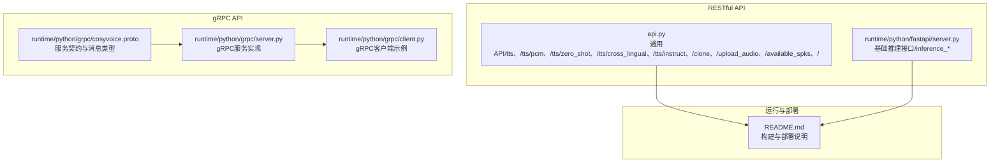
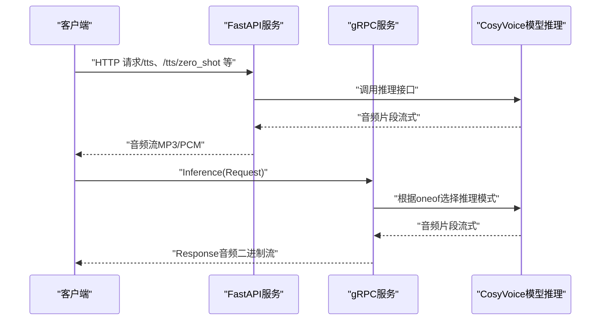
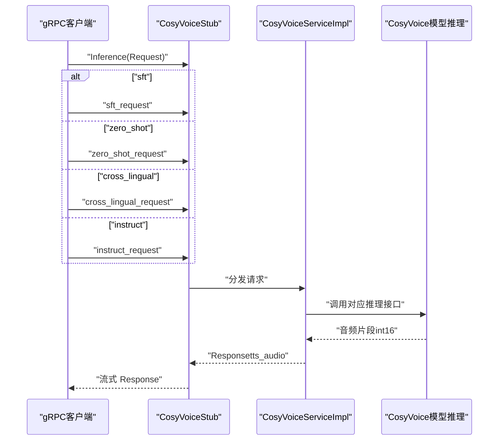
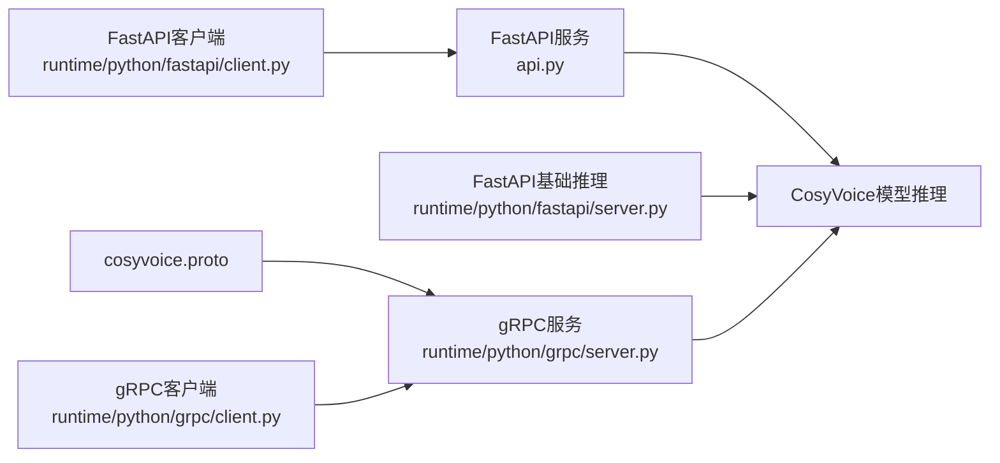

# API参考

<cite>
**本文引用的文件**
- [api.py](file://api.py)
- [runtime/python/fastapi/server.py](file://runtime/python/fastapi/server.py)
- [runtime/python/grpc/server.py](file://runtime/python/grpc/server.py)
- [runtime/python/grpc/cosyvoice.proto](file://runtime/python/grpc/cosyvoice.proto)
- [runtime/python/fastapi/client.py](file://runtime/python/fastapi/client.py)
- [runtime/python/grpc/client.py](file://runtime/python/grpc/client.py)
- [README.md](file://README.md)
</cite>

## 目录
1. [简介](#简介)
2. [项目结构](#项目结构)
3. [核心组件](#核心组件)
4. [架构总览](#架构总览)
5. [详细组件分析](#详细组件分析)
6. [依赖关系分析](#依赖关系分析)
7. [性能考虑](#性能考虑)
8. [故障排查指南](#故障排查指南)
9. [结论](#结论)
10. [附录](#附录)

## 简介
本文件为 CosyVoice 的公共接口 API 参考文档，覆盖以下两类接口：
- RESTful API（基于 FastAPI）：提供多种语音合成模式的 HTTP 接口，支持流式与非流式输出，以及音色克隆与音频上传辅助接口。
- gRPC API（基于 protobuf）：提供统一 Inference 接口，支持四种推理模式，采用流式响应，支持二进制音频传输。

文档将明确各端点的 HTTP 方法、请求参数、JSON Schema 结构、响应格式与状态码；解析 gRPC 服务契约、消息类型、流式传输与认证机制；并给出 curl 示例与 Python 客户端调用方式，以及错误处理策略、超时设置与性能调优建议。

## 项目结构
CosyVoice 提供了两套对外服务入口：
- RESTful API：位于顶层脚本与 runtime/python/fastapi 下，分别提供通用 API 与基础推理接口。
- gRPC API：位于 runtime/python/grpc 下，提供统一的推理服务。

图表来源
- [api.py](file://api.py#L280-L622)
- [runtime/python/fastapi/server.py](file://runtime/python/fastapi/server.py#L1-L187)
- [runtime/python/grpc/cosyvoice.proto](file://runtime/python/grpc/cosyvoice.proto#L1-L43)
- [runtime/python/grpc/server.py](file://runtime/python/grpc/server.py#L1-L97)
- [runtime/python/grpc/client.py](file://runtime/python/grpc/client.py#L1-L107)
- [README.md](file://README.md#L180-L208)

章节来源
- [api.py](file://api.py#L280-L622)
- [runtime/python/fastapi/server.py](file://runtime/python/fastapi/server.py#L1-L187)
- [runtime/python/grpc/cosyvoice.proto](file://runtime/python/grpc/cosyvoice.proto#L1-L43)
- [runtime/python/grpc/server.py](file://runtime/python/grpc/server.py#L1-L97)
- [runtime/python/grpc/client.py](file://runtime/python/grpc/client.py#L1-L107)
- [README.md](file://README.md#L180-L208)

## 核心组件
- RESTful API 应用（FastAPI）
  - 通用 API：提供多模式合成、流式/PCM 输出、音色克隆、音频上传与可用音色查询。
  - 基础推理 API：提供 GET/POST 形式的 /inference_* 接口，便于快速集成。
- gRPC 服务
  - 单一 Inference 接口，oneof 请求体承载四种模式，统一流式返回音频二进制。
- 客户端
  - FastAPI 客户端：requests 发起 HTTP 请求并保存音频。
  - gRPC 客户端：protobuf stub 调用，流式接收音频。

章节来源
- [api.py](file://api.py#L280-L622)
- [runtime/python/fastapi/server.py](file://runtime/python/fastapi/server.py#L68-L160)
- [runtime/python/grpc/server.py](file://runtime/python/grpc/server.py#L34-L97)
- [runtime/python/grpc/cosyvoice.proto](file://runtime/python/grpc/cosyvoice.proto#L6-L43)
- [runtime/python/fastapi/client.py](file://runtime/python/fastapi/client.py#L22-L57)
- [runtime/python/grpc/client.py](file://runtime/python/grpc/client.py#L30-L71)

## 架构总览
RESTful 与 gRPC 两种接入方式均通过 CosyVoice 模型推理层生成音频，再以流式方式返回。

图表来源
- [api.py](file://api.py#L317-L512)
- [runtime/python/grpc/server.py](file://runtime/python/grpc/server.py#L45-L72)
- [runtime/python/grpc/cosyvoice.proto](file://runtime/python/grpc/cosyvoice.proto#L6-L43)

## 详细组件分析

### RESTful API（FastAPI）

- 通用 API（/tts、/tts/pcm、/tts/zero_shot、/tts/cross_lingual、/tts/instruct、/clone、/upload_audio、/available_spks、/）
  - 端点与方法
    - GET /
    - GET /available_spks
    - POST /tts
    - POST /tts/pcm
    - POST /tts/zero_shot
    - POST /tts/cross_lingual
    - POST /tts/instruct
    - POST /clone
    - POST /upload_audio
  - 请求参数与 JSON Schema
    - /tts
      - 请求体：SftRequest
        - 字段：tts_text（字符串）、spk_id（字符串）、stream（布尔，默认 false）、speed（浮点数，默认 1.0）、seed（整数，默认 0）
      - 响应：流式音频（MP3），媒体类型 audio/mpeg
    - /tts/pcm
      - 请求体：SftRequest
      - 响应：流式音频（PCM，L16），媒体类型 audio/L16，附带 X-Sample-Rate、X-Channels、X-Bit-Depth 头
    - /tts/zero_shot
      - 请求体：ZeroShotRequest
        - 字段：tts_text、prompt_text、prompt_audio_base64（可选，Base64 编码音频）、stream、speed、seed
      - 响应：流式音频（MP3）
    - /tts/cross_lingual
      - 请求体：CrossLingualRequest
        - 字段：tts_text、prompt_audio_base64（可选，Base64 编码音频）、stream、speed、seed
      - 响应：流式音频（MP3），当非流式时返回完整 MP3
    - /tts/instruct
      - 请求体：InstructRequest
        - 字段：tts_text、spk_id、instruct_text、stream、speed、seed
      - 响应：流式音频（MP3）
    - /clone
      - 表单字段：prompt_text（字符串）、spk_id（字符串）、prompt_audio（文件上传）
      - 响应：JSON，包含状态与消息
    - /upload_audio
      - 表单字段：file（文件上传）
      - 响应：包含文件名与 audio_base64 的 JSON
    - /available_spks
      - 响应：包含 speakers 列表的 JSON
    - /
      - 响应：包含消息与版本号的 JSON
  - 状态码
    - 200：成功
    - 400：请求参数缺失或无效（如 prompt 音频为空、文本为空、模型不支持跨语种等）
    - 500：服务内部错误（如模型推理异常、保存音色失败）
  - 错误处理
    - 对 Base64 音频解码失败抛出 400
    - 对缺失必要字段抛出 400
    - 对模型不支持的模式抛出 400
    - 对推理异常抛出 500
  - 流式与非流式
    - /tts、/tts/zero_shot、/tts/cross_lingual、/tts/instruct 支持 stream 参数控制是否流式
    - /tts/pcm 直接返回 PCM 流
  - 采样率与音频格式
    - 默认采样率由模型提供，/tts/pcm 返回音频包含采样率头
    - /tts、/tts/zero_shot、/tts/cross_lingual 返回 MP3

- 基础推理 API（/inference_*）
  - 端点与方法
    - GET/POST /inference_sft
    - GET/POST /inference_zero_shot
    - GET/POST /inference_cross_lingual
    - GET/POST /inference_instruct
    - GET/POST /inference_instruct2
  - 请求参数
    - /inference_sft：tts_text、spk_id（表单）
    - /inference_zero_shot：tts_text、prompt_text、prompt_wav（文件上传）
    - /inference_cross_lingual：tts_text、prompt_wav（文件上传）
    - /inference_instruct：tts_text、spk_id、instruct_text（表单）
    - /inference_instruct2：tts_text、instruct_text、prompt_wav（文件上传）
  - 响应
    - 流式音频（PCM，L16），每个片段为 int16 小端二进制

章节来源
- [api.py](file://api.py#L77-L110)
- [api.py](file://api.py#L167-L205)
- [api.py](file://api.py#L206-L278)
- [api.py](file://api.py#L317-L512)
- [runtime/python/fastapi/server.py](file://runtime/python/fastapi/server.py#L68-L160)

#### RESTful API 端点一览（摘要）
- GET /
  - 响应：包含 message 与 version 的 JSON
- GET /available_spks
  - 响应：包含 speakers 列表的 JSON
- POST /tts
  - 请求体：SftRequest
  - 响应：流式 MP3
- POST /tts/pcm
  - 请求体：SftRequest
  - 响应：流式 PCM（L16），附带采样率等头
- POST /tts/zero_shot
  - 请求体：ZeroShotRequest（支持 prompt_audio_base64 或 prompt_wav 文件上传）
  - 响应：流式 MP3
- POST /tts/cross_lingual
  - 请求体：CrossLingualRequest（支持 prompt_audio_base64 或 prompt_wav 文件上传）
  - 响应：流式 MP3 或完整 MP3
- POST /tts/instruct
  - 请求体：InstructRequest
  - 响应：流式 MP3
- POST /clone
  - 表单：prompt_text、spk_id、prompt_audio
  - 响应：JSON
- POST /upload_audio
  - 表单：file
  - 响应：包含文件名与 audio_base64 的 JSON

章节来源
- [api.py](file://api.py#L280-L622)
- [runtime/python/fastapi/server.py](file://runtime/python/fastapi/server.py#L68-L160)

#### curl 示例（RESTful）
- 获取可用音色
  - curl -X GET http://HOST:PORT/available_spks
- 流式合成（MP3）
  - curl -X POST http://HOST:PORT/tts -H "Content-Type: application/json" -d '{"tts_text":"文本","spk_id":"中文女","stream":true,"speed":1.0,"seed":0}' -o out.mp3
- 流式合成（PCM）
  - curl -X POST http://HOST:PORT/tts/pcm -H "Content-Type: application/json" -d '{"tts_text":"文本","spk_id":"中文女","stream":true,"speed":1.0,"seed":0}' -o out.pcm
- 零样本合成（Base64）
  - curl -X POST http://HOST:PORT/tts/zero_shot -H "Content-Type: application/json" -d '{"tts_text":"文本","prompt_text":"提示文本","prompt_audio_base64":"...","stream":false,"speed":1.0,"seed":0}' -o out.mp3
- 跨语种合成（Base64）
  - curl -X POST http://HOST:PORT/tts/cross_lingual -H "Content-Type: application/json" -d '{"tts_text":"文本","prompt_audio_base64":"...","stream":true,"speed":1.0,"seed":0}' -o out.mp3
- 自然语言控制
  - curl -X POST http://HOST:PORT/tts/instruct -H "Content-Type: application/json" -d '{"tts_text":"文本","spk_id":"中文男","instruct_text":"指令文本","stream":false,"speed":1.0,"seed":0}' -o out.mp3
- 音色克隆（multipart/form-data）
  - curl -X POST http://HOST:PORT/clone -F "prompt_text=提示文本" -F "spk_id=my_spk" -F "prompt_audio=@prompt.wav" -o clone.json
- 上传音频并获取 Base64
  - curl -X POST http://HOST:PORT/upload_audio -F "file=@prompt.wav" -o upload.json

章节来源
- [api.py](file://api.py#L317-L512)
- [runtime/python/fastapi/client.py](file://runtime/python/fastapi/client.py#L22-L57)

#### Python 客户端调用（RESTful）
- 使用 requests 发送 HTTP 请求并保存音频
  - 参考路径：[runtime/python/fastapi/client.py](file://runtime/python/fastapi/client.py#L22-L57)
- 注意
  - /inference_* 基础接口返回 PCM，需自行解码保存为音频文件
  - 通用 /tts 系列返回 MP3，可直接保存

章节来源
- [runtime/python/fastapi/client.py](file://runtime/python/fastapi/client.py#L22-L57)

### gRPC API（cosyvoice.proto）

- 服务契约
  - 服务：CosyVoice
  - 方法：Inference(Request) returns (stream Response)
- 请求消息（RequestPayload oneof）
  - sftRequest：spk_id（字符串）、tts_text（字符串）
  - zeroshotRequest：tts_text（字符串）、prompt_text（字符串）、prompt_audio（bytes，int16 小端二进制）
  - crosslingualRequest：tts_text（字符串）、prompt_audio（bytes，int16 小端二进制）
  - instructRequest：tts_text（字符串）、spk_id（字符串）、instruct_text（字符串）
- 响应消息
  - Response：tts_audio（bytes，int16 小端二进制）
- 认证机制
  - 当前服务未内置认证逻辑，使用 insecure_channel 连接
- 流式传输
  - 服务端按推理片段逐条返回 Response，客户端循环消费

图表来源
- [runtime/python/grpc/cosyvoice.proto](file://runtime/python/grpc/cosyvoice.proto#L6-L43)
- [runtime/python/grpc/server.py](file://runtime/python/grpc/server.py#L45-L72)

章节来源
- [runtime/python/grpc/cosyvoice.proto](file://runtime/python/grpc/cosyvoice.proto#L6-L43)
- [runtime/python/grpc/server.py](file://runtime/python/grpc/server.py#L34-L97)
- [runtime/python/grpc/client.py](file://runtime/python/grpc/client.py#L30-L71)

#### gRPC curl 示例（概念性）
- 由于 gRPC 使用二进制协议，无法直接用 curl 调用；可通过客户端示例参考：
  - 参考路径：[runtime/python/grpc/client.py](file://runtime/python/grpc/client.py#L30-L71)

#### Python 客户端调用（gRPC）
- 使用 grpc.insecure_channel 与 stub.Inference 流式消费
  - 参考路径：[runtime/python/grpc/client.py](file://runtime/python/grpc/client.py#L30-L71)

章节来源
- [runtime/python/grpc/client.py](file://runtime/python/grpc/client.py#L30-L71)

## 依赖关系分析
- RESTful 与 gRPC 服务均依赖 CosyVoice 模型推理层
- FastAPI 服务依赖 CORS 中间件，支持跨域
- gRPC 服务依赖 protobuf 定义的消息类型与服务实现

图表来源
- [api.py](file://api.py#L280-L622)
- [runtime/python/fastapi/server.py](file://runtime/python/fastapi/server.py#L1-L187)
- [runtime/python/grpc/server.py](file://runtime/python/grpc/server.py#L1-L97)
- [runtime/python/grpc/cosyvoice.proto](file://runtime/python/grpc/cosyvoice.proto#L1-L43)
- [runtime/python/fastapi/client.py](file://runtime/python/fastapi/client.py#L1-L93)
- [runtime/python/grpc/client.py](file://runtime/python/grpc/client.py#L1-L107)

章节来源
- [api.py](file://api.py#L280-L622)
- [runtime/python/fastapi/server.py](file://runtime/python/fastapi/server.py#L1-L187)
- [runtime/python/grpc/server.py](file://runtime/python/grpc/server.py#L1-L97)
- [runtime/python/grpc/cosyvoice.proto](file://runtime/python/grpc/cosyvoice.proto#L1-L43)
- [runtime/python/fastapi/client.py](file://runtime/python/fastapi/client.py#L1-L93)
- [runtime/python/grpc/client.py](file://runtime/python/grpc/client.py#L1-L107)

## 性能考虑
- 流式输出
  - /tts、/tts/zero_shot、/tts/cross_lingual、/tts/instruct 支持 stream 控制，降低首包延迟
  - /tts/pcm 直接返回 PCM，适合低延迟场景
- 采样率与音频格式
  - /tts/pcm 返回采样率头，便于客户端正确解码
  - /tts 系列默认返回 MP3，压缩比高，带宽友好
- 并发与吞吐
  - gRPC 服务端通过线程池与最大并发 RPC 数控制（--max_conc），合理设置可提升吞吐
- 模型加速
  - README 提供 TensorRT-LLM 与 vLLM 加速方案，结合部署容器可显著提升性能

章节来源
- [api.py](file://api.py#L317-L512)
- [runtime/python/grpc/server.py](file://runtime/python/grpc/server.py#L74-L81)
- [README.md](file://README.md#L180-L208)

## 故障排查指南
- 400 错误
  - prompt 音频为空或解码失败
  - 缺少必要字段（如 prompt_text、spk_id）
  - 当前模型不支持跨语种复刻
- 500 错误
  - 模型推理异常
  - 保存音色失败
- 连接中断
  - FastAPI 流式生成器会在客户端断开时停止生成，避免资源浪费
- 日志
  - 通用 API 在启动时配置文件日志，便于定位问题

章节来源
- [api.py](file://api.py#L387-L512)
- [api.py](file://api.py#L144-L166)

## 结论
CosyVoice 提供了完善的 RESTful 与 gRPC 接口，覆盖多模式语音合成、流式输出、音色克隆与音频上传等常用能力。RESTful 接口更易用，gRPC 接口具备更强的流式与二进制传输优势。结合 README 的部署与加速建议，可在生产环境中获得稳定且高性能的语音合成服务。

## 附录

### RESTful API 端点定义（完整）
- GET /
  - 响应：JSON，包含 message 与 version
- GET /available_spks
  - 响应：JSON，包含 speakers 列表
- POST /tts
  - 请求体：SftRequest
  - 响应：流式 MP3
- POST /tts/pcm
  - 请求体：SftRequest
  - 响应：流式 PCM（L16），附带采样率等头
- POST /tts/zero_shot
  - 请求体：ZeroShotRequest
  - 响应：流式 MP3
- POST /tts/cross_lingual
  - 请求体：CrossLingualRequest
  - 响应：流式 MP3 或完整 MP3
- POST /tts/instruct
  - 请求体：InstructRequest
  - 响应：流式 MP3
- POST /clone
  - 表单：prompt_text、spk_id、prompt_audio
  - 响应：JSON
- POST /upload_audio
  - 表单：file
  - 响应：JSON，包含文件名与 audio_base64

章节来源
- [api.py](file://api.py#L280-L622)

### gRPC 服务契约（完整）
- 服务：CosyVoice
- 方法：Inference(Request) returns (stream Response)
- 请求消息 RequestPayload oneof
  - sftRequest：spk_id、tts_text
  - zeroshotRequest：tts_text、prompt_text、prompt_audio（bytes）
  - crosslingualRequest：tts_text、prompt_audio（bytes）
  - instructRequest：tts_text、spk_id、instruct_text
- 响应消息 Response：tts_audio（bytes）

章节来源
- [runtime/python/grpc/cosyvoice.proto](file://runtime/python/grpc/cosyvoice.proto#L6-L43)

### curl 与 Python 客户端调用示例（参考路径）
- RESTful
  - curl 示例：见“RESTful API”章节
  - Python 客户端：参考 [runtime/python/fastapi/client.py](file://runtime/python/fastapi/client.py#L22-L57)
- gRPC
  - Python 客户端：参考 [runtime/python/grpc/client.py](file://runtime/python/grpc/client.py#L30-L71)

章节来源
- [runtime/python/fastapi/client.py](file://runtime/python/fastapi/client.py#L22-L57)
- [runtime/python/grpc/client.py](file://runtime/python/grpc/client.py#L30-L71)