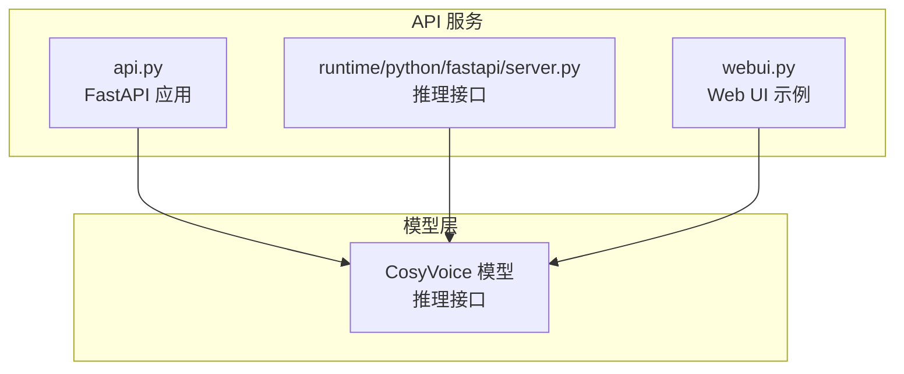
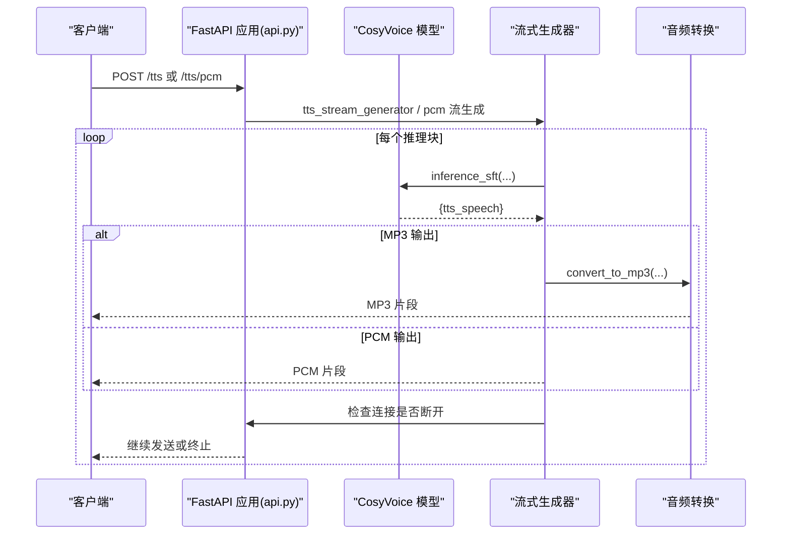
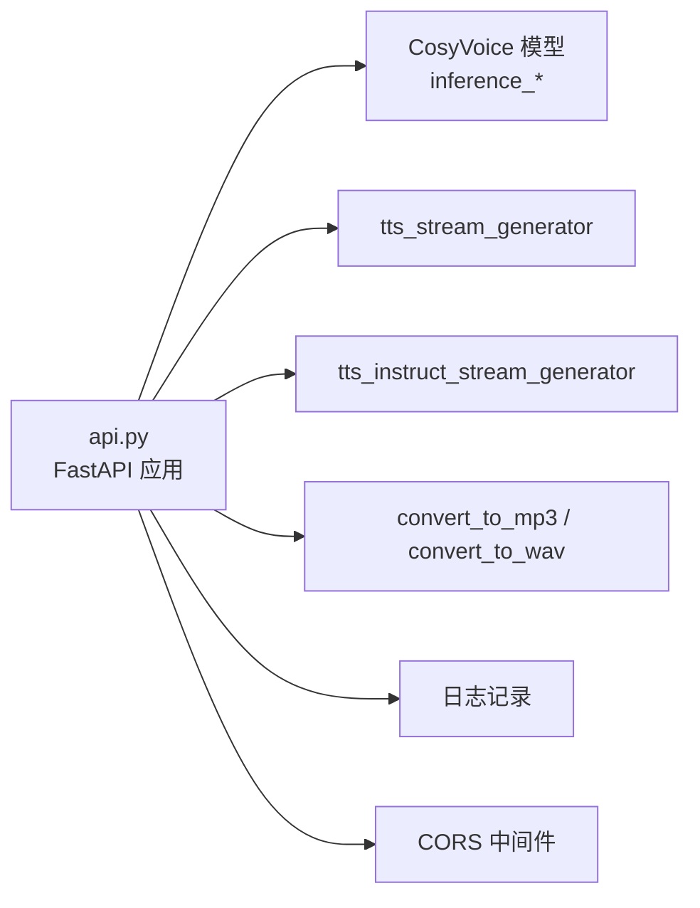

# REST API

<cite>
**本文引用的文件**
- [api.py](file://api.py)
- [server.py](file://runtime/python/fastapi/server.py)
- [webui.py](file://webui.py)
- [README.md](file://README.md)
</cite>

## 目录
1. [简介](#简介)
2. [项目结构](#项目结构)
3. [核心组件](#核心组件)
4. [架构总览](#架构总览)
5. [详细组件分析](#详细组件分析)
6. [依赖关系分析](#依赖关系分析)
7. [性能考虑](#性能考虑)
8. [故障排查指南](#故障排查指南)
9. [结论](#结论)
10. [附录](#附录)

## 简介
本文件为 CosyVoice 的 RESTful API 参考文档，基于仓库中的 FastAPI 实现，覆盖以下端点：
- /tts：SFT 预训练音色合成（MP3 流式输出）
- /tts/pcm：SFT 预训练音色合成（PCM 流式输出）
- /tts/zero_shot：零样本语音合成（MP3 流式输出）
- /tts/cross_lingual：跨语言语音合成（MP3 流式输出）
- /tts/instruct：指令引导语音合成（MP3 流式输出）
- /clone：音色克隆（表单上传 + JSON 响应）
- /upload_audio：音频上传并返回 Base64 编码（JSON 响应）
- /available_spks：查询可用说话人列表（JSON 响应）

文档详细说明各端点的 HTTP 方法、请求参数、JSON Schema 结构、响应格式、状态码、错误处理策略、流式响应机制、音频格式差异（MP3/WAV/PCM）、连接中断检测、超时与性能调优建议，并提供 curl 示例与 Python 客户端调用思路。

## 项目结构
- FastAPI 应用入口位于 api.py，提供 Web API 服务。
- runtime/python/fastapi/server.py 提供另一套 FastAPI 推理接口（与本仓库 Web UI 对齐），便于理解不同端点的参数与行为。
- webui.py 展示了前端如何调用模型推理接口，有助于理解请求参数与响应格式。
- README.md 提供部署与运行方式，便于本地启动服务。

图表来源
- [api.py](file://api.py#L280-L622)
- [server.py](file://runtime/python/fastapi/server.py#L48-L187)
- [webui.py](file://webui.py#L110-L170)

章节来源
- [api.py](file://api.py#L280-L622)
- [server.py](file://runtime/python/fastapi/server.py#L48-L187)
- [webui.py](file://webui.py#L110-L170)

## 核心组件
- 请求模型（Pydantic BaseModel）
  - SftRequest：SFT 预训练音色合成请求
  - ZeroShotRequest：零样本语音合成请求
  - CrossLingualRequest：跨语言语音合成请求
  - InstructRequest：指令引导语音合成请求
- 流式生成器
  - tts_stream_generator：SFT 流式生成（MP3）
  - tts_instruct_stream_generator：指令引导流式生成（MP3）
- 音频格式转换
  - convert_to_mp3：将 numpy 音频转为 MP3 字节
  - convert_to_wav：将 numpy 音频转为 WAV 字节
- 错误处理
  - HTTPException：统一错误响应
  - request.is_disconnected：连接中断检测

章节来源
- [api.py](file://api.py#L76-L110)
- [api.py](file://api.py#L167-L205)
- [api.py](file://api.py#L206-L278)

## 架构总览
下图展示 API 服务与模型推理之间的交互关系，以及典型请求流程。

图表来源
- [api.py](file://api.py#L167-L205)
- [api.py](file://api.py#L206-L278)
- [api.py](file://api.py#L317-L384)

## 详细组件分析

### 端点一览与规范

- GET /
  - 功能：返回服务基本信息
  - 响应：JSON，包含 message 与 version
  - 状态码：200

- GET /available_spks
  - 功能：获取可用说话人列表
  - 响应：JSON，包含 speakers 列表
  - 状态码：200

- POST /tts
  - 功能：SFT 预训练音色合成（MP3 流式输出）
  - 请求体：SftRequest（JSON）
  - 响应：audio/mpeg 流（MP3）
  - 状态码：200；错误时 400/500
  - 连接中断：支持 request.is_disconnected 检测并终止

- POST /tts/pcm
  - 功能：SFT 预训练音色合成（PCM 流式输出）
  - 请求体：SftRequest（JSON）
  - 响应：audio/L16 流（PCM，16bit 单声道）
  - 响应头：X-Sample-Rate、X-Channels、X-Bit-Depth
  - 状态码：200；错误时 400/500

- POST /tts/zero_shot
  - 功能：零样本语音合成（MP3 流式输出）
  - 请求体：ZeroShotRequest（JSON）
  - 响应：audio/mpeg 流（MP3）
  - 状态码：200；错误时 400/500

- POST /tts/cross_lingual
  - 功能：跨语言语音合成（MP3 流式输出）
  - 请求体：CrossLingualRequest（JSON）
  - 响应：audio/mpeg 流（MP3）
  - 状态码：200；错误时 400/500

- POST /tts/instruct
  - 功能：指令引导语音合成（MP3 流式输出）
  - 请求体：InstructRequest（JSON）
  - 响应：audio/mpeg 流（MP3）
  - 状态码：200；错误时 400/500

- POST /clone
  - 功能：音色克隆（保存用户上传的音色 prompt）
  - 表单字段：
    - prompt_text：字符串
    - spk_id：字符串
    - prompt_audio：文件（上传）
  - 响应：JSON，包含 status、message、spk_id
  - 状态码：200；错误时 400/500

- POST /upload_audio
  - 功能：上传音频文件并返回 Base64 编码
  - 表单字段：file（上传）
  - 响应：JSON，包含 filename 与 audio_base64
  - 状态码：200；错误时 500

章节来源
- [api.py](file://api.py#L298-L316)
- [api.py](file://api.py#L317-L384)
- [api.py](file://api.py#L386-L484)
- [api.py](file://api.py#L485-L512)
- [api.py](file://api.py#L513-L568)
- [api.py](file://api.py#L569-L588)

### 请求模型与 JSON Schema

- SftRequest
  - 字段
    - tts_text：字符串，必填
    - spk_id：字符串，必填
    - stream：布尔，可选，默认 false
    - speed：浮点数，可选，默认 1.0
    - seed：整数，可选，默认 0
  - 约束
    - tts_text 与 spk_id 必须有效
    - stream/speed/seed 为可选参数，影响推理与音频质量

- ZeroShotRequest
  - 字段
    - tts_text：字符串，必填
    - prompt_text：字符串，必填
    - prompt_audio_base64：字符串，可选（Base64 编码音频）
    - stream：布尔，可选，默认 false
    - speed：浮点数，可选，默认 1.0
    - seed：整数，可选，默认 0
  - 约束
    - 至少提供 prompt_audio_base64 或通过其他方式提供提示音频
    - seed > 0 时固定随机种子，否则随机

- CrossLingualRequest
  - 字段
    - tts_text：字符串，必填
    - prompt_audio_base64：字符串，可选（Base64 编码音频）
    - stream：布尔，可选，默认 false
    - speed：浮点数，可选，默认 1.0
    - seed：整数，可选，默认 0
  - 约束
    - 当模型不支持跨语种复刻时返回 400
    - 建议提供高质量的提示音频（采样率≥16kHz）

- InstructRequest
  - 字段
    - tts_text：字符串，必填
    - spk_id：字符串，必填
    - instruct_text：字符串，可选
    - stream：布尔，可选，默认 false
    - speed：浮点数，可选，默认 1.0
    - seed：整数，可选，默认 0
  - 约束
    - 若未提供 instruct_text，则退化为 SFT 模式
    - instruct_text 存在时，按指令控制风格/情感等

章节来源
- [api.py](file://api.py#L76-L110)

### 响应格式与状态码
- 成功响应
  - /tts：audio/mpeg 流（MP3）
  - /tts/pcm：audio/L16 流（PCM，16bit 单声道），带 X-Sample-Rate/X-Channels/X-Bit-Depth 响应头
  - /available_spks：application/json
  - /clone：application/json
  - /upload_audio：application/json
- 错误响应
  - 400：参数缺失或无效（如 prompt 音频为空、模型不支持某模式）
  - 500：内部异常（如模型推理失败、音频解码失败）
- 连接中断
  - 服务端在流式生成过程中定期检查 request.is_disconnected，断开即停止生成

章节来源
- [api.py](file://api.py#L317-L384)
- [api.py](file://api.py#L386-L484)
- [api.py](file://api.py#L485-L512)
- [api.py](file://api.py#L513-L568)
- [api.py](file://api.py#L569-L588)

### 流式响应与音频格式

- 流式响应机制
  - 服务端以生成器逐块产出音频片段，客户端边接收边播放
  - 断线检测：每块生成前检查 request.is_disconnected，断开立即终止
  - 首包延迟：首次产出音频片段时记录首 token 延迟，便于性能观测

- 音频格式差异
  - MP3（/tts、/tts/zero_shot、/tts/cross_lingual、/tts/instruct）
    - 优点：体积小，兼容性好
    - 生成：convert_to_mp3 将 numpy 音频转为 MP3 字节
  - PCM（/tts/pcm）
    - 优点：无损、便于二次处理
    - 生成：直接输出 int16 PCM 字节
    - 响应头：X-Sample-Rate、X-Channels、X-Bit-Depth

- 连接中断检测
  - 使用 request.is_disconnected 在生成循环内轮询
  - 断开后立即停止生成，释放资源

章节来源
- [api.py](file://api.py#L167-L205)
- [api.py](file://api.py#L206-L278)
- [api.py](file://api.py#L336-L384)

### curl 示例与 Python 客户端调用思路

- curl 示例（仅示意，参数请按实际替换）
  - 获取可用说话人
    - curl -X GET http://localhost:5000/available_spks
  - SFT 合成（MP3）
    - curl -X POST http://localhost:5000/tts -H "Content-Type: application/json" -d '{"tts_text":"你好","spk_id":"中文女","stream":false,"speed":1.0,"seed":0}'
  - SFT 合成（PCM）
    - curl -X POST http://localhost:5000/tts/pcm -H "Content-Type: application/json" -d '{"tts_text":"你好","spk_id":"中文女","stream":false,"speed":1.0,"seed":0}'
  - 零样本合成（MP3）
    - curl -X POST http://localhost:5000/tts/zero_shot -H "Content-Type: application/json" -d '{"tts_text":"你好","prompt_text":"你好","prompt_audio_base64":"..."}'
  - 跨语言合成（MP3）
    - curl -X POST http://localhost:5000/tts/cross_lingual -H "Content-Type: application/json" -d '{"tts_text":"Hello","prompt_audio_base64":"..."}'
  - 指令合成（MP3）
    - curl -X POST http://localhost:5000/tts/instruct -H "Content-Type: application/json" -d '{"tts_text":"你好","spk_id":"中文女","instruct_text":"用更温柔的语气"}'
  - 音色克隆（表单）
    - curl -X POST http://localhost:5000/clone -F "prompt_text=你好" -F "spk_id=my_spk" -F "prompt_audio=@/path/to/audio.wav"
  - 上传音频并获取 Base64
    - curl -X POST http://localhost:5000/upload_audio -F "file=@/path/to/audio.wav"

- Python 客户端调用思路
  - 使用 requests 或 aiohttp 发送 HTTP 请求
  - 对于流式输出（/tts、/tts/pcm、/tts/zero_shot、/tts/cross_lingual、/tts/instruct）
    - 以流式方式读取响应，边接收边写入文件或播放
  - 对于 /clone 与 /upload_audio
    - 使用 multipart/form-data 提交文件
  - 对于 /available_spks
    - 直接解析 JSON 响应

章节来源
- [api.py](file://api.py#L317-L588)

### 与 FastAPI 推理服务的对比
- runtime/python/fastapi/server.py 提供了与 Web UI 对齐的推理接口，便于理解参数命名与行为：
  - /inference_sft、/inference_zero_shot、/inference_cross_lingual、/inference_instruct、/inference_instruct2
  - 参数多采用 Form/File 方式，适合浏览器直连或简单脚本调用
- 本仓库 api.py 的 /tts、/tts/pcm、/tts/zero_shot、/tts/cross_lingual、/tts/instruct 更贴近生产级 API 设计，支持 JSON 请求体与流式响应。

章节来源
- [server.py](file://runtime/python/fastapi/server.py#L68-L160)
- [webui.py](file://webui.py#L110-L170)

## 依赖关系分析

图表来源
- [api.py](file://api.py#L280-L622)

章节来源
- [api.py](file://api.py#L280-L622)

## 性能考虑
- 流式输出
  - 使用 StreamingResponse 边生成边传输，降低首包延迟
  - 断线检测避免无效计算，提升资源利用率
- 音频格式
  - MP3 体积小，适合网络传输；PCM 便于二次处理但体积较大
- 随机种子
  - seed > 0 时固定随机种子，便于复现实验结果
- 采样率与后处理
  - 提示音频默认采样率 16kHz；可对输出进行裁剪与归一化，避免削波
- 并发与吞吐
  - 建议结合反向代理（如 Nginx）与异步服务器（uvicorn）优化并发
- 模型加载与加速
  - README 提供 vLLM、TensorRT-LLM 等加速方案，可显著降低 RTF

章节来源
- [api.py](file://api.py#L121-L142)
- [README.md](file://README.md#L183-L196)

## 故障排查指南
- 400 错误
  - 参数缺失或格式错误（如 prompt 音频为空、模型不支持跨语种复刻）
  - 建议：检查请求体字段与模型版本
- 500 错误
  - 内部异常（如模型推理失败、音频解码失败）
  - 建议：查看服务端日志，确认模型路径与依赖安装正确
- 连接中断
  - 客户端提前关闭或网络异常
  - 建议：客户端侧增加重试与超时设置；服务端已内置断线检测
- 音频质量
  - 采样率过低或幅值过大可能导致削波
  - 建议：确保提示音频采样率≥16kHz，必要时进行裁剪与归一化

章节来源
- [api.py](file://api.py#L386-L484)
- [api.py](file://api.py#L513-L568)
- [api.py](file://api.py#L121-L142)

## 结论
CosyVoice 的 REST API 提供了完善的语音合成能力，覆盖 SFT、零样本、跨语言与指令引导等多种模式，并支持 MP3 与 PCM 两种输出格式。通过流式响应与断线检测，满足实时性与鲁棒性需求。建议在生产环境中结合合适的并发与加速方案，配合合理的参数与音频预处理，获得最佳体验。

## 附录

### 端点对照表

- /tts
  - 方法：POST
  - 请求体：SftRequest
  - 响应：audio/mpeg 流
  - 状态码：200/400/500

- /tts/pcm
  - 方法：POST
  - 请求体：SftRequest
  - 响应：audio/L16 流（PCM）
  - 响应头：X-Sample-Rate、X-Channels、X-Bit-Depth
  - 状态码：200/400/500

- /tts/zero_shot
  - 方法：POST
  - 请求体：ZeroShotRequest
  - 响应：audio/mpeg 流
  - 状态码：200/400/500

- /tts/cross_lingual
  - 方法：POST
  - 请求体：CrossLingualRequest
  - 响应：audio/mpeg 流
  - 状态码：200/400/500

- /tts/instruct
  - 方法：POST
  - 请求体：InstructRequest
  - 响应：audio/mpeg 流
  - 状态码：200/400/500

- /clone
  - 方法：POST
  - 表单字段：prompt_text、spk_id、prompt_audio
  - 响应：JSON
  - 状态码：200/400/500

- /upload_audio
  - 方法：POST
  - 表单字段：file
  - 响应：JSON（filename、audio_base64）
  - 状态码：200/500

- /available_spks
  - 方法：GET
  - 响应：JSON（speakers）
  - 状态码：200

章节来源
- [api.py](file://api.py#L298-L588)