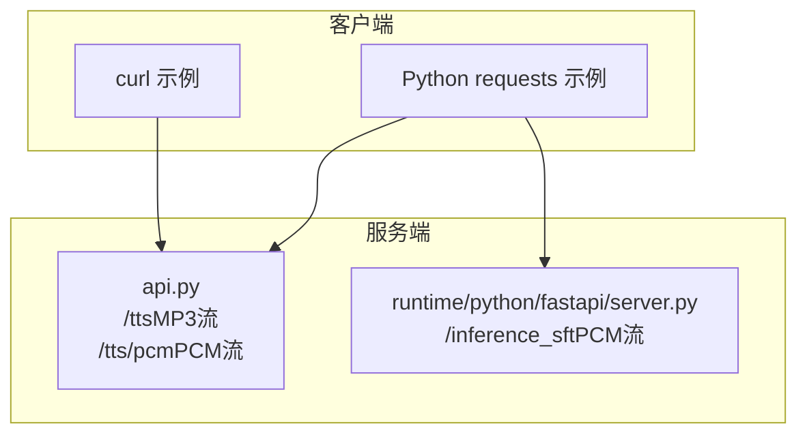
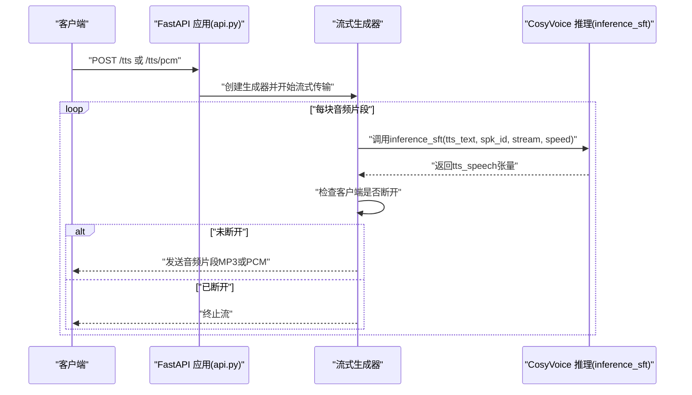
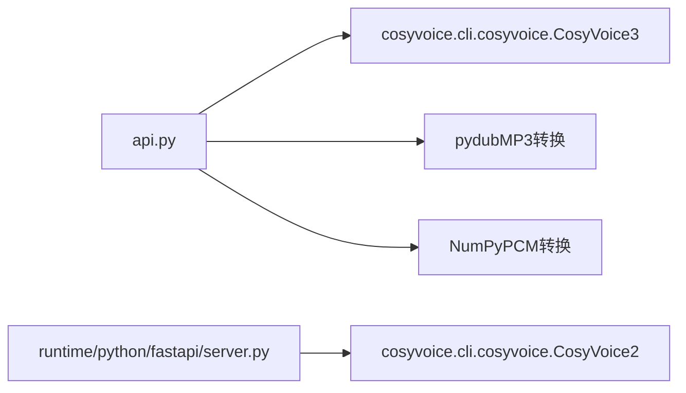

# SFT模式API

<cite>
**本文引用的文件**
- [api.py](file://api.py)
- [server.py](file://runtime/python/fastapi/server.py)
- [README.md](file://README.md)
- [example.py](file://example.py)
- [client.py](file://runtime/python/fastapi/client.py)
</cite>

## 目录
1. [简介](#简介)
2. [项目结构](#项目结构)
3. [核心组件](#核心组件)
4. [架构总览](#架构总览)
5. [详细组件分析](#详细组件分析)
6. [依赖关系分析](#依赖关系分析)
7. [性能考量](#性能考量)
8. [故障排查指南](#故障排查指南)
9. [结论](#结论)
10. [附录](#附录)

## 简介
本文件面向CosyVoice的SFT（说话人微调）模式REST API，系统性说明以下端点：
- FastAPI服务中的POST端点：/tts（MP3流）、/tts/pcm（PCM流）
- FastAPI服务中的通用推理端点：/inference_sft（GET/POST，PCM流）

文档覆盖HTTP方法、请求参数、JSON Schema、SftRequest模型字段约束、音频输出格式差异、响应头设置、流式与非流式行为、错误处理与连接中断检测、性能优化建议，以及使用curl与Python requests库的完整调用示例。

## 项目结构
围绕SFT模式API的关键文件与职责如下：
- api.py：定义SftRequest模型、/tts与/tts/pcm两个POST端点、流式生成器、音频格式转换与响应头设置、错误处理与连接中断检测。
- runtime/python/fastapi/server.py：提供通用推理端点/inference_sft（GET/POST），统一以PCM流形式返回音频，便于上层客户端自行转码或直接播放。
- README.md：提供部署与运行方式概览，便于快速启动服务。
- example.py：展示CosyVoice CLI中inference_sft的使用方式，帮助理解SFT模式的输入输出行为。
- runtime/python/fastapi/client.py：演示如何通过requests库调用/inference_sft端点，适合迁移至其他语言或框架。

图表来源
- [api.py](file://api.py#L317-L384)
- [server.py](file://runtime/python/fastapi/server.py#L68-L82)

章节来源
- [api.py](file://api.py#L317-L384)
- [server.py](file://runtime/python/fastapi/server.py#L68-L82)
- [README.md](file://README.md#L187-L196)

## 核心组件
- SftRequest模型（Pydantic BaseModel）：定义SFT模式的请求参数，包含字段tts_text、spk_id、stream、speed、seed及其默认值与约束。
- /tts端点（POST）：返回MP3音频流，媒体类型为audio/mpeg，文件名为tts.mp3。
- /tts/pcm端点（POST）：返回PCM音频流，媒体类型为audio/L16，附加采样率、通道数、位深等响应头。
- /inference_sft端点（GET/POST）：返回PCM音频流，媒体类型为audio/L16，便于上层按需转码或直接播放。
- 流式生成器：在每次迭代中检查客户端是否断开连接，及时终止生成，降低资源浪费。
- 音频格式转换：MP3转换采用pydub，PCM直接输出int16字节流；均进行幅度裁剪与淡入淡出处理（MP3转换时）。

章节来源
- [api.py](file://api.py#L76-L110)
- [api.py](file://api.py#L317-L384)
- [server.py](file://runtime/python/fastapi/server.py#L68-L82)

## 架构总览
下图展示了SFT模式API的典型调用链路与数据流。

图表来源
- [api.py](file://api.py#L167-L193)
- [api.py](file://api.py#L350-L384)
- [cosyvoice/cli/cosyvoice.py](file://cosyvoice/cli/cosyvoice.py#L121-L145)

## 详细组件分析

### SftRequest模型与JSON Schema
- 字段定义与约束
  - tts_text：待合成文本，必填。
  - spk_id：预训练说话人ID，必填。
  - stream：是否启用流式合成，布尔值，默认false。
  - speed：语音速度调节因子，浮点数，默认1.0。
  - seed：随机种子，整数，默认0。
- JSON Schema要点
  - 所有字段均为简单类型（字符串、布尔、浮点、整数），无复杂嵌套结构。
  - 默认值在服务端生效，客户端可省略对应字段。
- 业务约束
  - spk_id必须为已注册或可用的说话人标识。
  - speed应为正数，过大可能导致失真或过快，建议在合理区间内调整。
  - seed为0表示不固定随机性，大于0时可复现实验结果。

章节来源
- [api.py](file://api.py#L76-L110)

### /tts（MP3流）端点
- 方法与路径：POST /tts
- 请求体：SftRequest（JSON）
- 响应：StreamingResponse，媒体类型audio/mpeg，文件名为tts.mp3
- 行为特征
  - 流式生成：逐块返回MP3音频片段，便于边播边播。
  - 音频处理：对每块音频进行幅度裁剪与淡入淡出，避免爆音。
  - 连接检测：每块生成前检查客户端是否断开，断开即终止。
- 性能与体验
  - 首包延迟：首次生成音频片段时记录首token延迟，有助于评估冷启动性能。
  - 适用场景：浏览器直接播放、移动端实时播放、低带宽环境。

章节来源
- [api.py](file://api.py#L317-L334)
- [api.py](file://api.py#L167-L193)
- [api.py](file://api.py#L206-L246)

### /tts/pcm（PCM流）端点
- 方法与路径：POST /tts/pcm
- 请求体：SftRequest（JSON）
- 响应：StreamingResponse，媒体类型audio/L16，文件名为tts.pcm
- 响应头
  - Content-Disposition: attachment; filename=tts.pcm
  - X-Sample-Rate: 采样率（由模型提供）
  - X-Channels: 1（单声道）
  - X-Bit-Depth: 16（16位）
- 行为特征
  - 流式生成：逐块返回int16 PCM字节流。
  - 连接检测：每块生成前检查客户端是否断开，断开即终止。
- 适用场景
  - 需要自定义解码器或二次处理的客户端。
  - 对延迟敏感且需要最小化编解码开销的应用。

章节来源
- [api.py](file://api.py#L336-L384)
- [api.py](file://api.py#L350-L384)

### /inference_sft（PCM流）端点
- 方法与路径：GET/POST /inference_sft
- 参数（表单）
  - tts_text：待合成文本（必填）
  - spk_id：预训练说话人ID（必填）
- 响应：StreamingResponse，媒体类型audio/L16，便于上层自行处理。
- 用途
  - 作为通用推理入口，便于统一管理不同模式的端点。
  - 与FastAPI客户端配合，验证PCM流的正确性与延迟表现。

章节来源
- [server.py](file://runtime/python/fastapi/server.py#L68-L82)

### 音频输出格式差异与选择建议
- MP3（/tts）
  - 优点：体积小、兼容性好，适合浏览器直接播放。
  - 缺点：存在压缩损失，实时播放时CPU占用略高。
  - 适用：Web端、移动端播放、分享场景。
- PCM（/tts/pcm 与 /inference_sft）
  - 优点：无损、延迟低、可直接播放或二次处理。
  - 缺点：体积较大，需自备解码器。
  - 适用：低延迟实时系统、边缘设备、二次处理（降噪、混响、变调等）。

章节来源
- [api.py](file://api.py#L317-L384)
- [server.py](file://runtime/python/fastapi/server.py#L68-L82)

### 错误处理与连接中断检测
- 连接中断检测
  - 在流式生成循环中，每块生成前调用请求对象的断连检测方法，若客户端断开则立即终止生成，释放资源。
- 错误处理策略
  - 参数校验：SftRequest由Pydantic自动校验，非法类型或缺失字段会触发HTTP 422。
  - 业务异常：当模型推理或前置处理出现异常时，抛出HTTP 500并返回错误详情。
  - 音频解码失败：Base64音频解码异常时返回HTTP 400。
- 日志记录
  - 服务端对关键事件（如首token延迟、断连、错误）进行记录，便于问题定位。

章节来源
- [api.py](file://api.py#L167-L193)
- [api.py](file://api.py#L350-L384)
- [api.py](file://api.py#L144-L166)

### 使用示例

#### curl调用示例
- 调用/tts（MP3流）
  - 命令要点：POST /tts，Content-Type: application/json，Body为SftRequest的JSON。
  - 输出：MP3音频流，可重定向到文件或直接播放。
- 调用/tts/pcm（PCM流）
  - 命令要点：POST /tts/pcm，Content-Type: application/json，Body为SftRequest的JSON。
  - 输出：PCM音频流，可重定向到文件或交给播放器解码。
- 调用/inference_sft（PCM流）
  - 命令要点：GET/POST /inference_sft，表单参数tts_text与spk_id。
  - 输出：PCM音频流，便于上层自行处理。

章节来源
- [api.py](file://api.py#L317-L384)
- [server.py](file://runtime/python/fastapi/server.py#L68-L82)

#### Python requests调用示例
- 调用/inference_sft（PCM流）
  - 说明：使用requests发送表单数据，开启stream=True以接收流式响应。
  - 处理：遍历iter_content分块读取，拼接为完整的PCM数据，再保存为WAV或其他格式。
- 参考客户端
  - 可参考runtime/python/fastapi/client.py中的实现，了解如何构造payload与处理流式响应。

章节来源
- [client.py](file://runtime/python/fastapi/client.py#L22-L56)
- [server.py](file://runtime/python/fastapi/server.py#L68-L82)

## 依赖关系分析
- 模型层依赖
  - CosyVoice3（api.py）与CosyVoice2（server.py）分别通过CLI封装提供inference_sft能力。
- 生成器与模型交互
  - 生成器循环调用模型推理，逐块产出tts_speech，再进行格式转换或直接输出PCM。
- 第三方库
  - MP3转换依赖pydub；PCM输出依赖NumPy与Python内置io.BytesIO。
- CORS与部署
  - 服务端启用CORS，便于跨域访问；README提供了容器化部署与端口映射示例。

图表来源
- [api.py](file://api.py#L39-L41)
- [server.py](file://runtime/python/fastapi/server.py#L41-L45)

章节来源
- [api.py](file://api.py#L39-L41)
- [server.py](file://runtime/python/fastapi/server.py#L41-L45)
- [README.md](file://README.md#L187-L196)

## 性能考量
- 流式优先：SFT模式支持流式合成，建议在实时场景中启用stream=true，以降低首包延迟。
- 速度调节：speed参数可调，建议在0.8~1.2之间取得较好的平衡。
- 音频质量：MP3转换包含淡入淡出与幅度裁剪，避免爆音；如需极致低延迟，建议使用PCM流。
- 并发与资源：断连检测可避免无效计算；生产环境建议限制并发与超时，防止资源耗尽。
- 采样率与位深：PCM流默认单声道16位，采样率由模型提供，客户端需匹配解码器参数。

章节来源
- [api.py](file://api.py#L317-L384)
- [api.py](file://api.py#L167-L193)

## 故障排查指南
- HTTP 400：请求参数非法或音频解码失败（如Base64格式错误）。
- HTTP 404：端点不存在，确认路径是否为/tts、/tts/pcm或/inference_sft。
- HTTP 422：SftRequest字段类型或必填项不满足Pydantic校验。
- HTTP 500：模型推理异常或内部处理错误，查看服务端日志定位具体原因。
- 断连问题：客户端提前关闭连接会导致服务端终止生成；检查网络稳定性与超时设置。
- 音频播放异常：MP3播放器兼容性差异；建议改用PCM流或更换播放器。

章节来源
- [api.py](file://api.py#L144-L166)
- [api.py](file://api.py#L317-L384)

## 结论
SFT模式API提供了两种主流输出格式（MP3与PCM）与统一的流式生成能力，既满足浏览器与移动端的直接播放需求，又为需要自定义处理的场景提供PCM流。通过合理的参数配置与连接中断检测，可在保证用户体验的同时提升系统稳定性与资源利用率。建议在生产环境中结合日志监控与限流策略，持续优化延迟与吞吐。

## 附录

### SftRequest字段说明与约束
- tts_text：字符串，必填，待合成文本。
- spk_id：字符串，必填，预训练说话人ID。
- stream：布尔，可选，默认false，是否启用流式合成。
- speed：浮点，可选，默认1.0，语音速度调节因子（>0）。
- seed：整数，可选，默认0，随机种子（>0固定随机性）。

章节来源
- [api.py](file://api.py#L76-L110)

### 端点对比与选择建议
- /tts（MP3）：适合浏览器/移动端直接播放，体积小、兼容好。
- /tts/pcm：适合低延迟、自定义处理或边缘设备，体积大但延迟低。
- /inference_sft：通用PCM流端点，便于统一管理与测试。

章节来源
- [api.py](file://api.py#L317-L384)
- [server.py](file://runtime/python/fastapi/server.py#L68-L82)