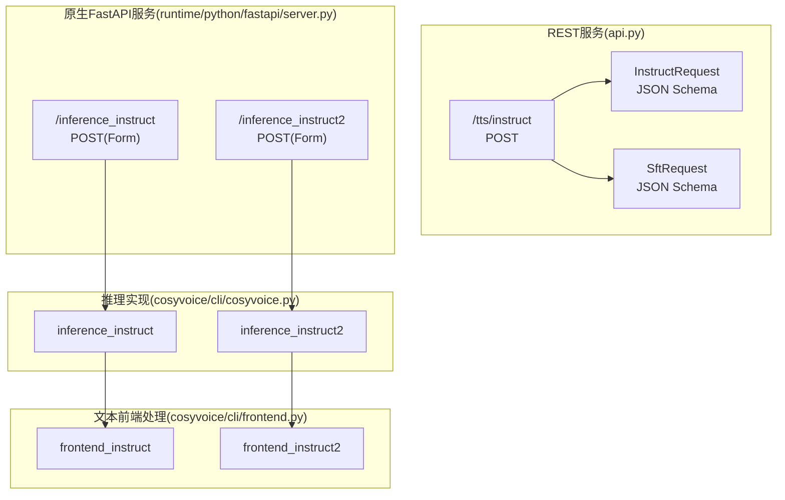
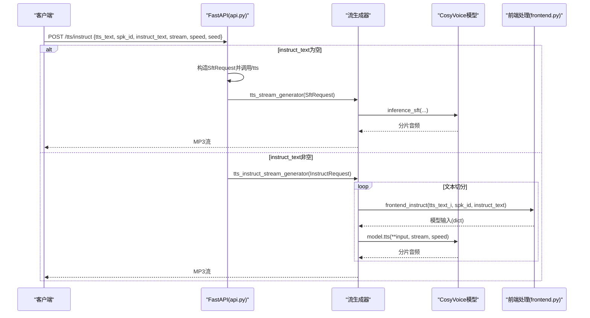
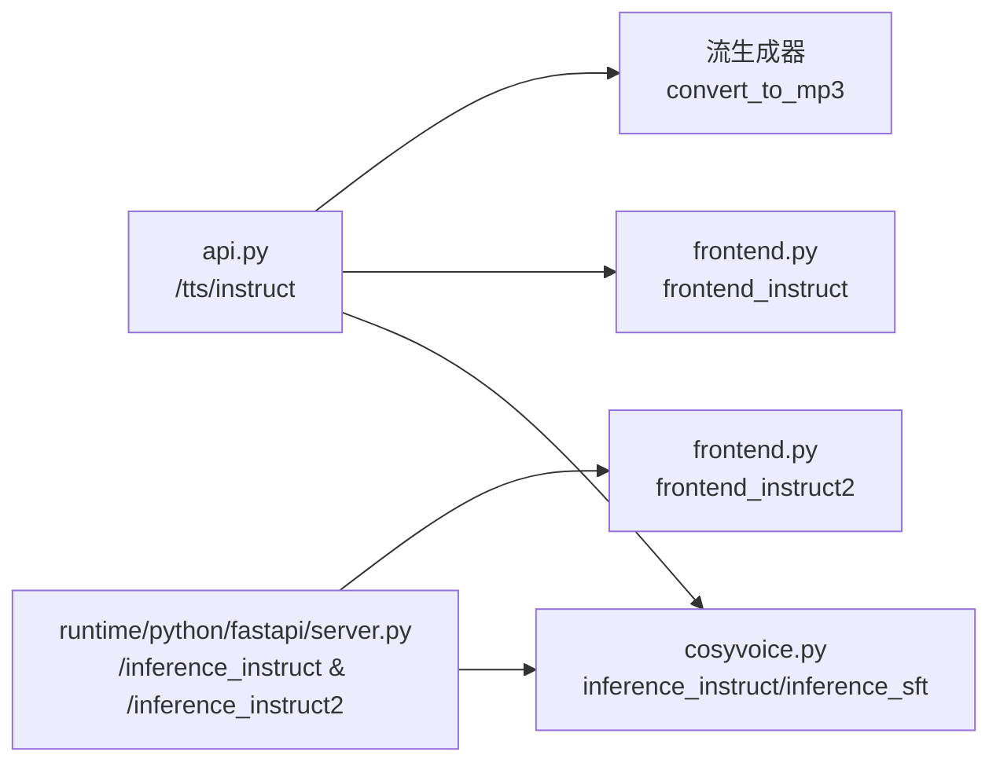

# 指令模式API

<cite>
**本文引用的文件**
- [api.py](file://api.py)
- [server.py](file://runtime/python/fastapi/server.py)
- [cosyvoice.py](file://cosyvoice/cli/cosyvoice.py)
- [frontend.py](file://cosyvoice/cli/frontend.py)
- [example.py](file://example.py)
- [webui.py](file://webui.py)
</cite>

## 目录
1. [简介](#简介)
2. [项目结构](#项目结构)
3. [核心组件](#核心组件)
4. [架构总览](#架构总览)
5. [详细组件分析](#详细组件分析)
6. [依赖关系分析](#依赖关系分析)
7. [性能考量](#性能考量)
8. [故障排查指南](#故障排查指南)
9. [结论](#结论)
10. [附录](#附录)

## 简介
本文件面向CosyVoice的“指令引导语音合成”REST API，围绕以下端点进行系统化说明：
- FastAPI服务端点：/tts/instruct（REST）、/inference_instruct、/inference_instruct2（原生FastAPI服务）
- 请求模型：InstructRequest 的JSON Schema
- 控制参数：tts_text、spk_id、instruct_text、stream、speed、seed
- 指令文本的作用：通过自然语言指令控制语音的情感、语调与风格
- 降级策略：当instruct_text为空时回退到SFT模式
- 可重现性：seed对随机性的影响

## 项目结构
- REST API入口位于api.py，提供/tts/instruct端点及其它模式端点
- 原生FastAPI服务位于runtime/python/fastapi/server.py，提供/inference_instruct与/inference_instruct2端点
- 推理实现位于cosyvoice/cli/cosyvoice.py，包含inference_instruct与inference_instruct2
- 文本前端处理位于cosyvoice/cli/frontend.py，负责将指令文本与文本切分融合到模型输入
- 示例与WebUI位于example.py与webui.py，便于理解参数与效果

图表来源
- [api.py](file://api.py#L485-L512)
- [server.py](file://runtime/python/fastapi/server.py#L124-L159)
- [cosyvoice.py](file://cosyvoice/cli/cosyvoice.py#L205-L232)
- [cosyvoice.py](file://cosyvoice/cli/cosyvoice.py#L312-L338)
- [frontend.py](file://cosyvoice/cli/frontend.py#L332-L374)

章节来源
- [api.py](file://api.py#L485-L512)
- [server.py](file://runtime/python/fastapi/server.py#L124-L159)

## 核心组件
- InstructRequest模型（REST）：用于/tts/instruct端点的请求体，包含tts_text、spk_id、instruct_text、stream、speed、seed六个字段
- SftRequest模型（REST）：用于SFT模式的请求体，包含tts_text、spk_id、stream、speed、seed五个字段
- 原生FastAPI端点：
  - /inference_instruct：接收Form参数tts_text、spk_id、instruct_text
  - /inference_instruct2：接收Form参数tts_text、instruct_text、prompt_wav（上传文件）

章节来源
- [api.py](file://api.py#L76-L110)
- [server.py](file://runtime/python/fastapi/server.py#L124-L159)

## 架构总览
下图展示了从REST请求到模型推理再到音频流产出的整体流程，包括降级分支与可选的音频格式转换。

图表来源
- [api.py](file://api.py#L485-L512)
- [api.py](file://api.py#L167-L205)
- [cosyvoice.py](file://cosyvoice/cli/cosyvoice.py#L205-L232)
- [frontend.py](file://cosyvoice/cli/frontend.py#L332-L350)

## 详细组件分析

### /tts/instruct 端点（REST）
- 方法：POST
- 路径：/tts/instruct
- 请求体：InstructRequest（JSON Schema见下）
- 行为：
  - 若instruct_text为空，构造SftRequest并回退到/tts端点（SFT模式）
  - 若instruct_text非空，设置随机种子（seed），调用指令模式流生成器
  - 流式返回MP3音频

InstructRequest JSON Schema
- 字段
  - tts_text: 字符串，必填
  - spk_id: 字符串，必填
  - instruct_text: 字符串，可选
  - stream: 布尔，可选，默认false
  - speed: 数值，可选，默认1.0
  - seed: 整数，可选，默认0
- 说明
  - instruct_text为空时触发降级逻辑
  - seed为0表示不固定随机种子；>0时固定随机种子以提升可重现性

章节来源
- [api.py](file://api.py#L485-L512)
- [api.py](file://api.py#L76-L110)

### /inference_instruct 与 /inference_instruct2（原生FastAPI服务）
- /inference_instruct
  - 方法：GET/POST
  - 参数：tts_text、spk_id、instruct_text（Form）
  - 行为：调用CosyVoice.inference_instruct，流式返回音频
- /inference_instruct2
  - 方法：GET/POST
  - 参数：tts_text、instruct_text（Form）、prompt_wav（上传文件）
  - 行为：加载prompt_wav至16kHz，调用CosyVoice.inference_instruct2，流式返回音频

章节来源
- [server.py](file://runtime/python/fastapi/server.py#L124-L159)

### 指令文本对语音风格的控制
- 指令模式的核心在于将自然语言指令注入到模型输入中，从而影响情感、语调与风格
- 文本前端处理
  - frontend_instruct：移除LLM中的说话人嵌入，将指令文本token化后拼接到LLM输入
  - frontend_instruct2：在零样本基础上融合指令文本，同样将指令文本token化并注入
- 速度控制：通过speed参数传入模型，影响合成速率
- 流式控制：通过stream参数控制是否分片返回

章节来源
- [cosyvoice.py](file://cosyvoice/cli/cosyvoice.py#L205-L232)
- [cosyvoice.py](file://cosyvoice/cli/cosyvoice.py#L312-L338)
- [frontend.py](file://cosyvoice/cli/frontend.py#L332-L374)

### 降级处理逻辑（instruct_text为空）
- 当instruct_text为空时，/tts/instruct会构造SftRequest并调用/tts端点
- /tts端点使用CosyVoice.inference_sft进行合成，保持相同的stream与speed行为
- 这种设计保证了在未提供指令时仍能稳定输出SFT风格的语音

章节来源
- [api.py](file://api.py#L496-L505)
- [api.py](file://api.py#L317-L384)

### 随机种子与可重现性
- /tts/instruct在非空seed时调用set_all_random_seed(seed)，否则随机生成种子
- 这意味着：
  - seed>0：相同输入+相同seed可获得近似一致的输出（受模型内部随机性影响）
  - seed=0：每次生成随机种子，输出具有多样性
- 原生FastAPI端点亦遵循类似逻辑（在对应实现中设置随机种子）

章节来源
- [api.py](file://api.py#L506-L511)
- [server.py](file://runtime/python/fastapi/server.py#L124-L159)

### 使用示例与效果说明
以下示例展示不同指令文本对合成语音的影响（示例路径而非代码片段）：
- 指令文本控制情感与语调
  - 示例路径：[example.py](file://example.py#L29-L33)
  - 说明：在CosyVoice-300M-Instruct模型上，通过自然语言描述控制情感与风格
- 指令文本控制语速
  - 示例路径：[example.py](file://example.py#L86-L91)
  - 说明：通过指令文本指定语速，结合speed参数共同作用
- 指令文本控制方言与口音
  - 示例路径：[example.py](file://example.py#L85-L91)
  - 说明：通过指令文本指示方言表达，结合prompt音频实现更精细的风格控制

章节来源
- [example.py](file://example.py#L29-L33)
- [example.py](file://example.py#L85-L91)

### WebUI中的指令模式使用
- WebUI中选择“跨语种复刻”模式时，若提供instruct_text，将调用inference_instruct2
- seed会在每次生成前设置，以提升可重现性
- 若同时提供prompt_wav与预训练音色ID，zero_shot_spk_id为空，否则使用预训练音色ID

章节来源
- [webui.py](file://webui.py#L114-L138)

## 依赖关系分析
- REST层依赖CosyVoice模型与前端处理
- 原生FastAPI服务直接依赖CosyVoice模型
- 指令模式通过frontend_instruct/frontend_instruct2将指令文本注入模型输入
- 流式生成器负责将模型输出转换为MP3并按块返回

图表来源
- [api.py](file://api.py#L485-L512)
- [api.py](file://api.py#L167-L205)
- [cosyvoice.py](file://cosyvoice/cli/cosyvoice.py#L205-L232)
- [cosyvoice.py](file://cosyvoice/cli/cosyvoice.py#L312-L338)
- [frontend.py](file://cosyvoice/cli/frontend.py#L332-L374)
- [server.py](file://runtime/python/fastapi/server.py#L124-L159)

## 性能考量
- 流式合成：通过stream参数开启分片返回，降低首包延迟，改善交互体验
- 速度调节：speed参数在模型侧生效，适合在不同场景下平衡质量与时延
- 音频格式：REST端点默认返回MP3流，减少客户端解码开销
- 随机性：固定seed有助于复现，但在高并发场景下建议谨慎使用固定种子

## 故障排查指南
- instruct_text为空导致回退到SFT
  - 现象：请求未携带指令文本时，服务会构造SftRequest并走/tts路径
  - 处理：确认请求体中instruct_text字段是否正确传入
  - 参考：[/tts/instruct降级逻辑](file://api.py#L496-L505)
- seed设置无效
  - 现象：相同输入多次生成结果不一致
  - 处理：确保seed>0且在同次请求中保持一致；注意模型内部随机性
  - 参考：[/tts/instruct种子设置](file://api.py#L506-L511)
- 原生FastAPI端点参数缺失
  - 现象：/inference_instruct或/inference_instruct2报错
  - 处理：确保tts_text、spk_id、instruct_text（或prompt_wav）均正确提交
  - 参考：[原生FastAPI端点定义](file://runtime/python/fastapi/server.py#L124-L159)
- 音频格式问题
  - 现象：客户端无法播放MP3
  - 处理：确认客户端支持audio/mpeg；必要时改用/tts/pcm返回PCM流
  - 参考：[REST端点返回类型](file://api.py#L485-L512)

章节来源
- [api.py](file://api.py#L496-L511)
- [server.py](file://runtime/python/fastapi/server.py#L124-L159)

## 结论
- /tts/instruct通过InstructRequest模型提供统一的REST接口，支持自然语言指令驱动的语音合成
- 当instruct_text为空时，系统自动回退到SFT模式，保证兼容性
- 通过seed、speed与stream参数，用户可在可控性与多样性之间取得平衡
- 原生FastAPI服务提供了Form参数的便捷调用方式，适合不同集成场景

## 附录

### API定义与参数说明
- /tts/instruct（REST）
  - 方法：POST
  - 请求体：InstructRequest
    - tts_text: 待合成文本
    - spk_id: 预训练说话人ID
    - instruct_text: 自然语言指令（可选）
    - stream: 是否流式合成（可选）
    - speed: 速度调节（可选）
    - seed: 随机种子（可选）
  - 响应：流式MP3音频

章节来源
- [api.py](file://api.py#L485-L512)
- [api.py](file://api.py#L76-L110)

### 原生FastAPI端点
- /inference_instruct
  - 方法：GET/POST
  - 参数：tts_text、spk_id、instruct_text（Form）
  - 响应：流式音频
- /inference_instruct2
  - 方法：GET/POST
  - 参数：tts_text、instruct_text（Form）、prompt_wav（上传文件）
  - 响应：流式音频

章节来源
- [server.py](file://runtime/python/fastapi/server.py#L124-L159)

### 指令文本示例（参考路径）
- 情感与语调控制：[example.py](file://example.py#L29-L33)
- 语速控制：[example.py](file://example.py#L86-L91)
- 方言与口音控制：[example.py](file://example.py#L85-L91)