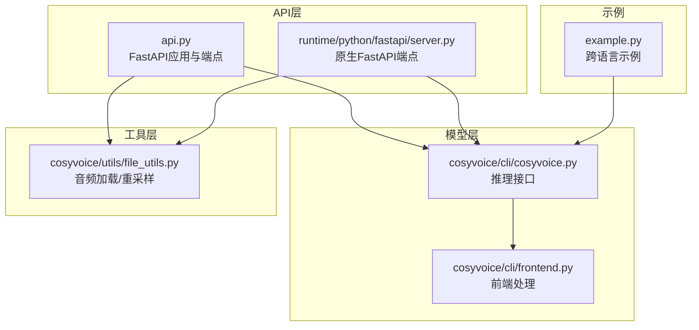
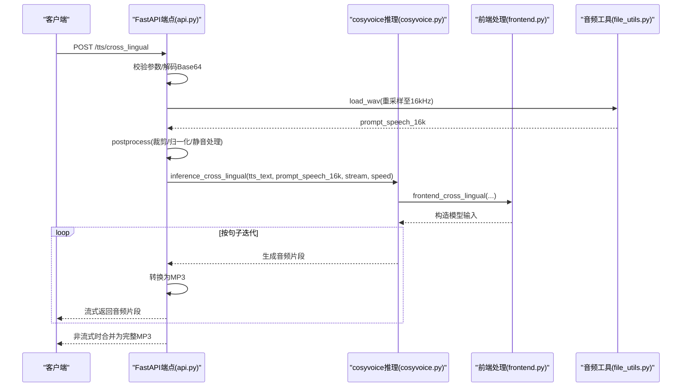
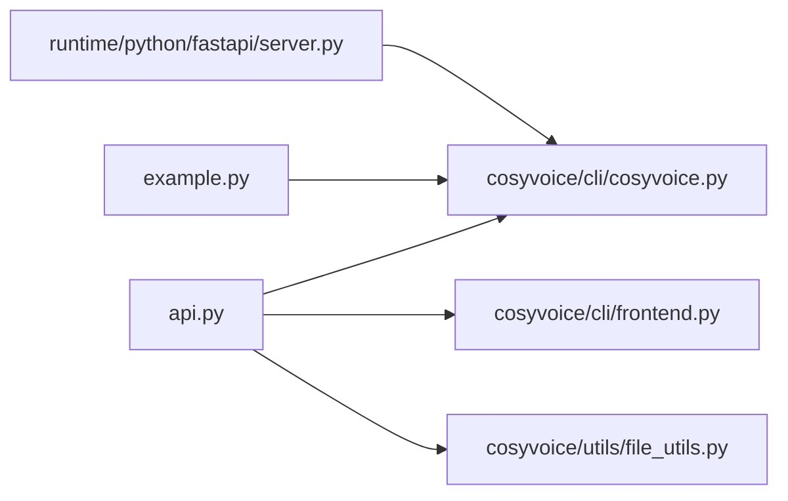

# 跨语言语音合成API

<cite>
**本文引用的文件**
- [api.py](file://api.py)
- [server.py](file://runtime/python/fastapi/server.py)
- [cosyvoice.py](file://cosyvoice/cli/cosyvoice.py)
- [frontend.py](file://cosyvoice/cli/frontend.py)
- [file_utils.py](file://cosyvoice/utils/file_utils.py)
- [example.py](file://example.py)
</cite>

## 目录
1. [简介](#简介)
2. [项目结构](#项目结构)
3. [核心组件](#核心组件)
4. [架构总览](#架构总览)
5. [详细组件分析](#详细组件分析)
6. [依赖关系分析](#依赖关系分析)
7. [性能考量](#性能考量)
8. [故障排查指南](#故障排查指南)
9. [结论](#结论)
10. [附录](#附录)

## 简介
本文件面向CosyVoice跨语言语音合成REST API，围绕以下两个端点进行深入说明：
- FastAPI服务端点：POST /tts/cross_lingual（基于api.py）
- 原生FastAPI服务端点：POST /inference_cross_lingual（基于runtime/python/fastapi/server.py）

重点涵盖：
- HTTP POST方法与请求参数（tts_text、prompt_audio_base64、stream、speed、seed）
- CrossLingualRequest模型的JSON Schema
- 语言解耦机制：如何使用一种语言的语音样本合成另一种语言的文本
- 模型兼容性检查（CosyVoice-300M限制）
- 音频预处理（postprocess函数）
- 流式/非流式响应处理实现细节
- 使用示例（中文提示语音合成英文文本等）

## 项目结构
本节聚焦与跨语言语音合成API直接相关的文件与职责划分：
- api.py：提供Web服务端点、请求模型定义、音频后处理与流式响应封装
- runtime/python/fastapi/server.py：提供原生FastAPI服务端点（Form参数形式），便于与CLI一致的推理流程对接
- cosyvoice/cli/cosyvoice.py：模型推理入口，包含跨语言推理接口
- cosyvoice/cli/frontend.py：前端处理逻辑，包含跨语言模式的输入构造
- cosyvoice/utils/file_utils.py：音频加载与重采样工具
- example.py：跨语言推理示例，展示语言标记与提示音频的使用方式

图表来源
- [api.py](file://api.py#L280-L590)
- [server.py](file://runtime/python/fastapi/server.py#L48-L160)
- [cosyvoice.py](file://cosyvoice/cli/cosyvoice.py#L170-L204)
- [frontend.py](file://cosyvoice/cli/frontend.py#L311-L330)
- [file_utils.py](file://cosyvoice/utils/file_utils.py#L44-L50)
- [example.py](file://example.py#L17-L27)

章节来源
- [api.py](file://api.py#L280-L590)
- [server.py](file://runtime/python/fastapi/server.py#L48-L160)

## 核心组件
- 请求模型：CrossLingualRequest（JSON Schema）
- 推理接口：cosyvoice.inference_cross_lingual
- 前端处理：frontend.frontend_cross_lingual
- 音频预处理：postprocess
- 流式响应：StreamingResponse（MP3/PCM）

章节来源
- [api.py](file://api.py#L94-L100)
- [cosyvoice.py](file://cosyvoice/cli/cosyvoice.py#L178-L203)
- [frontend.py](file://cosyvoice/cli/frontend.py#L311-L330)
- [file_utils.py](file://cosyvoice/utils/file_utils.py#L44-L50)

## 架构总览
跨语言语音合成的关键调用链如下：
- Web请求进入FastAPI端点
- 参数校验与Base64解码
- 音频预处理（重采样至16kHz、裁剪、归一化、静音处理）
- 调用cosyvoice.inference_cross_lingual进行推理
- 根据stream参数选择流式或非流式响应
- 将音频片段转换为MP3并返回

图表来源
- [api.py](file://api.py#L429-L484)
- [cosyvoice.py](file://cosyvoice/cli/cosyvoice.py#L178-L203)
- [frontend.py](file://cosyvoice/cli/frontend.py#L311-L330)
- [file_utils.py](file://cosyvoice/utils/file_utils.py#L44-L50)

## 详细组件分析

### 端点：POST /tts/cross_lingual（Web服务）
- 方法：POST
- 路径：/tts/cross_lingual
- 请求体：JSON（CrossLingualRequest）
- 响应：StreamingResponse（MP3），或非流式时一次性返回MP3

请求参数（JSON Schema）
- tts_text: 字符串，待合成文本（可包含语言标记）
- prompt_audio_base64: 可选字符串，Base64编码的提示音频
- stream: 可选布尔值，默认false
- speed: 可选浮点数，默认1.0
- seed: 可选整数，默认0

行为要点
- 必填校验：若未提供prompt_audio_base64，返回400错误
- Base64解码：使用decode_audio进行解码，失败返回400
- 模型兼容性：若cosyvoice.instruct为True，提示当前模型不支持跨语种复刻（需CosyVoice-300M）
- 音频预处理：使用postprocess对提示音频进行裁剪、归一化、静音处理
- 随机种子：根据seed设置随机种子
- 流式/非流式：
  - stream=true：逐片段生成MP3并通过StreamingResponse返回
  - stream=false：先收集全部片段，再合并为完整MP3返回

章节来源
- [api.py](file://api.py#L429-L484)
- [api.py](file://api.py#L121-L142)
- [api.py](file://api.py#L144-L166)

### 端点：POST /inference_cross_lingual（原生FastAPI）
- 方法：POST
- 路径：/inference_cross_lingual
- 请求体：multipart/form-data
  - tts_text: 文本字段
  - prompt_wav: 文件字段（提示音频）
- 响应：StreamingResponse（二进制音频，由generate_data生成）

行为要点
- 与Web端一致的推理流程，但参数以表单形式提交
- 采用load_wav将提示音频重采样至16kHz
- 调用cosyvoice.inference_cross_lingual进行推理
- 使用generate_data将模型输出的tts_speech转换为PCM字节流

章节来源
- [server.py](file://runtime/python/fastapi/server.py#L105-L121)
- [server.py](file://runtime/python/fastapi/server.py#L62-L66)

### 推理接口：cosyvoice.inference_cross_lingual
- 功能：跨语言语音合成
- 输入：
  - tts_text：目标语言文本（可带语言标记）
  - prompt_wav：16kHz提示音频
  - zero_shot_spk_id：可选零样本说话人ID
  - stream：是否流式
  - speed：语速
  - text_frontend：是否使用文本前端处理
- 输出：生成器，逐片段返回包含'tts_speech'的字典

章节来源
- [cosyvoice.py](file://cosyvoice/cli/cosyvoice.py#L178-L203)

### 前端处理：frontend.frontend_cross_lingual
- 功能：跨语言模式的前端输入构造
- 关键差异：移除LLM中的prompt文本相关字段，仅保留语音特征与嵌入，从而实现语言解耦

章节来源
- [frontend.py](file://cosyvoice/cli/frontend.py#L311-L330)

### 音频预处理：postprocess
- 功能：对提示音频进行裁剪、归一化与静音处理，确保输入质量
- 参数：top_db、hop_length、win_length
- 行为：裁剪静音、幅度归一化、末尾填充静音段

章节来源
- [api.py](file://api.py#L121-L142)

### 音频加载与重采样：load_wav
- 功能：加载音频并重采样至目标采样率（默认16kHz）
- 断言：要求原始采样率不低于最小值（16kHz）

章节来源
- [file_utils.py](file://cosyvoice/utils/file_utils.py#L44-L50)

### 流式/非流式响应
- 流式（stream=true）：逐片段生成MP3并通过StreamingResponse返回
- 非流式（stream=false）：收集所有片段后合并为完整音频，再转换为MP3返回

章节来源
- [api.py](file://api.py#L461-L481)

### 模型兼容性检查
- 当cosyvoice.instruct为True时，表示当前模型不支持跨语种复刻模式，需使用CosyVoice-300M模型
- 示例中明确展示了CosyVoice-300M的使用方式与跨语言推理

章节来源
- [api.py](file://api.py#L449-L452)
- [example.py](file://example.py#L17-L27)

### 使用示例（中文提示语音合成英文文本）
- 步骤：
  1) 准备提示音频（中文语音样本）
  2) 准备目标文本（英文文本，可包含语言标记）
  3) 调用POST /tts/cross_lingual，传入Base64编码的提示音频与目标文本
  4) 接收流式MP3音频，或非流式一次性音频
- 注意：
  - 若使用原生FastAPI端点，使用multipart/form-data提交tts_text与prompt_wav文件
  - 若使用CosyVoice-300M以外的模型，会触发“当前模型不支持跨语种复刻模式”的错误

章节来源
- [api.py](file://api.py#L429-L484)
- [server.py](file://runtime/python/fastapi/server.py#L105-L121)
- [example.py](file://example.py#L17-L27)

## 依赖关系分析
- api.py依赖cosyvoice推理接口与前端处理
- api.py依赖file_utils进行音频加载与重采样
- server.py提供与CLI一致的推理端点，便于统一部署
- frontend.frontend_cross_lingual移除LLM中的文本提示，实现语言解耦

图表来源
- [api.py](file://api.py#L280-L590)
- [server.py](file://runtime/python/fastapi/server.py#L48-L160)
- [cosyvoice.py](file://cosyvoice/cli/cosyvoice.py#L170-L204)
- [frontend.py](file://cosyvoice/cli/frontend.py#L311-L330)
- [file_utils.py](file://cosyvoice/utils/file_utils.py#L44-L50)
- [example.py](file://example.py#L17-L27)

## 性能考量
- 流式合成：适合实时播放与低延迟场景，客户端可边接收边播放
- 非流式合成：适合离线导出，整体延迟较低但首包延迟较高
- 音频预处理：postprocess会增加少量CPU开销，但有助于提升合成稳定性
- 采样率一致性：确保提示音频重采样至16kHz，避免模型输入不匹配导致的性能下降

## 故障排查指南
- 400错误：prompt_audio_base64为空或Base64解码失败
  - 检查Base64字符串是否正确、是否包含音频数据
- 400错误：当前模型不支持跨语种复刻
  - 切换至CosyVoice-300M模型
- 500错误：音频生成失败或模型推理异常
  - 检查提示音频质量与长度、目标文本长度与语言标记
- 音质问题：提示音频过短或噪声较大
  - 使用postprocess进行裁剪与归一化，确保静音段与幅度适中

章节来源
- [api.py](file://api.py#L440-L483)
- [api.py](file://api.py#L121-L142)

## 结论
- /tts/cross_lingual与/inference_cross_lingual均实现了跨语言语音合成能力
- CrossLingualRequest的JSON Schema简洁明确，支持流式与非流式两种模式
- 通过frontend.frontend_cross_lingual移除LLM中的文本提示，实现语言解耦
- 模型兼容性需注意CosyVoice-300M限制
- 建议优先使用流式合成以获得更好的用户体验，并配合postprocess保证音频质量

## 附录

### JSON Schema：CrossLingualRequest
- 字段
  - tts_text: 字符串
  - prompt_audio_base64: 可选字符串（Base64编码）
  - stream: 可选布尔值（默认false）
  - speed: 可选浮点数（默认1.0）
  - seed: 可选整数（默认0）

章节来源
- [api.py](file://api.py#L94-L100)

### 语言标记与示例
- 示例中展示了如何在目标文本中加入语言标记以指导跨语言合成
- 建议在目标文本中显式标注语言，以提升合成准确性

章节来源
- [example.py](file://example.py#L17-L27)