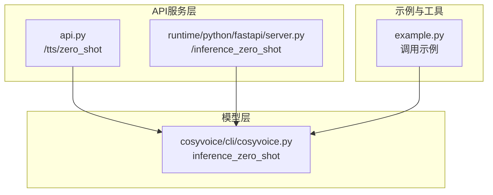
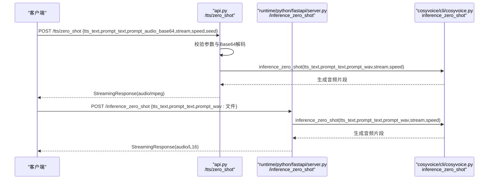
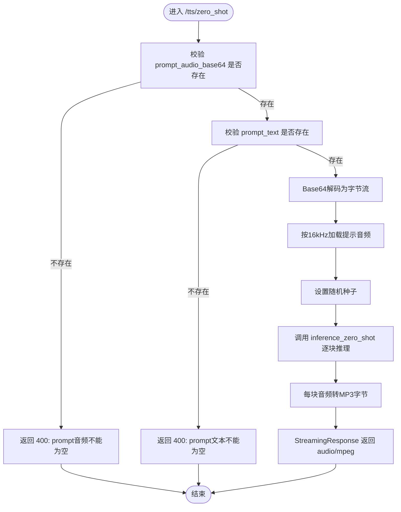
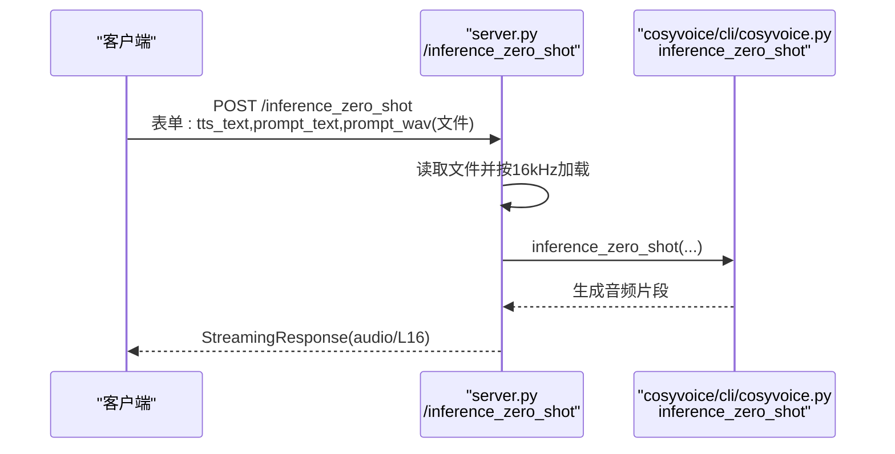
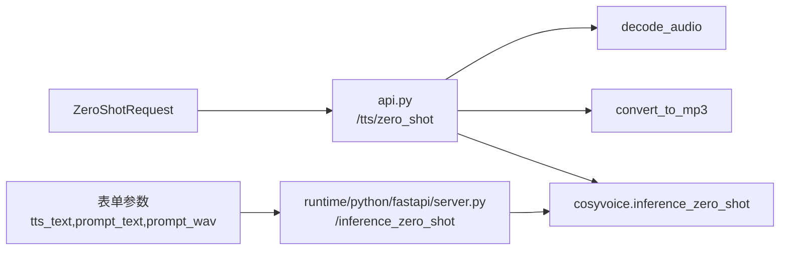

# 零样本语音克隆API

<cite>
**本文引用的文件**
- [api.py](file://api.py)
- [server.py](file://runtime/python/fastapi/server.py)
- [cosyvoice.py](file://cosyvoice/cli/cosyvoice.py)
- [example.py](file://example.py)
</cite>

## 目录
1. [简介](#简介)
2. [项目结构](#项目结构)
3. [核心组件](#核心组件)
4. [架构总览](#架构总览)
5. [详细组件分析](#详细组件分析)
6. [依赖关系分析](#依赖关系分析)
7. [性能考量](#性能考量)
8. [故障排查指南](#故障排查指南)
9. [结论](#结论)
10. [附录](#附录)

## 简介
本文件面向CosyVoice的零样本语音克隆REST API，围绕以下两个端点展开：
- FastAPI服务端点：POST /tts/zero_shot（基于api.py）
- 传统FastAPI服务端点：POST /inference_zero_shot（基于runtime/python/fastapi/server.py）

文档将详细说明HTTP POST方法、请求参数（tts_text、prompt_text、prompt_audio_base64、stream、speed、seed）、ZeroShotRequest模型的JSON Schema、Base64与文件上传两种提示音频提供方式、流式响应处理、音频后处理与错误验证机制，并给出curl与Python客户端示例的完整流程指引。

## 项目结构
与零样本语音克隆API直接相关的文件与职责如下：
- api.py：提供统一的FastAPI应用，包含/tts/zero_shot端点、请求模型定义、音频解码与流式MP3转换、错误处理等。
- runtime/python/fastapi/server.py：提供独立的FastAPI服务，包含/inference_zero_shot端点（表单+文件上传），用于兼容旧版或替代方案。
- cosyvoice/cli/cosyvoice.py：模型推理接口，包含inference_zero_shot等关键推理逻辑，定义了零样本模式的输入输出约定。
- example.py：演示如何使用模型API，包含零样本推理的调用示例，便于理解参数与输出。

图表来源
- [api.py](file://api.py#L387-L428)
- [server.py](file://runtime/python/fastapi/server.py#L85-L102)
- [cosyvoice.py](file://cosyvoice/cli/cosyvoice.py#L147-L176)
- [example.py](file://example.py#L17-L24)

章节来源
- [api.py](file://api.py#L387-L428)
- [server.py](file://runtime/python/fastapi/server.py#L85-L102)
- [cosyvoice.py](file://cosyvoice/cli/cosyvoice.py#L147-L176)
- [example.py](file://example.py#L17-L24)

## 核心组件
- 请求模型与JSON Schema
  - ZeroShotRequest（用于/tts/zero_shot）：
    - 字段：tts_text（必填）、prompt_text（必填）、prompt_audio_base64（可选，Base64编码提示音频）、stream（可选，默认false）、speed（可选，默认1.0）、seed（可选，默认0）。
    - JSON Schema要点：tts_text与prompt_text为字符串；prompt_audio_base64为字符串（Base64）；stream/speed/seed为布尔/数值类型。
  - CrossLingualRequest（用于跨语言模式，与零样本同属同一请求模型族）：
    - 字段：tts_text（必填）、prompt_audio_base64（可选，Base64编码提示音频）、stream/speed/seed（可选）。
  - SftRequest与InstructRequest（用于其他模式，便于对比）：
    - SftRequest：tts_text、spk_id、stream、speed、seed。
    - InstructRequest：tts_text、spk_id、instruct_text、stream、speed、seed。

- 错误验证与处理
  - /tts/zero_shot：当prompt_audio_base64为空或prompt_text为空时，返回400错误。
  - Base64解码异常：抛出HTTP 400，detail包含“音频解码失败”。
  - 其他异常：捕获并返回HTTP 500，detail包含“处理失败”。

- 音频处理
  - Base64解码：decode_audio将Base64字符串解码为内存字节流。
  - 采样率与后处理：模型侧要求提示音频采样率为16kHz；跨语言模式会进行后处理（如去静音、归一化、填充静音）。
  - 流式输出：convert_to_mp3将每块音频片段转换为MP3字节，StreamingResponse以audio/mpeg形式返回。

章节来源
- [api.py](file://api.py#L76-L100)
- [api.py](file://api.py#L144-L166)
- [api.py](file://api.py#L387-L428)
- [api.py](file://api.py#L429-L483)

## 架构总览
/tts/zero_shot与/inference_zero_shot两条路径最终都调用cosyvoice的inference_zero_shot进行推理，区别在于：
- /tts/zero_shot：接收JSON请求（Base64提示音频），服务端负责解码与流式MP3转换。
- /inference_zero_shot：接收表单+文件上传（UploadFile），服务端直接读取文件并传入模型。

图表来源
- [api.py](file://api.py#L387-L428)
- [server.py](file://runtime/python/fastapi/server.py#L85-L102)
- [cosyvoice.py](file://cosyvoice/cli/cosyvoice.py#L147-L176)

## 详细组件分析

### /tts/zero_shot 端点（基于api.py）
- HTTP方法与路径
  - POST /tts/zero_shot
- 请求体（JSON）
  - 必填字段：tts_text、prompt_text
  - 可选字段：prompt_audio_base64（Base64字符串）、stream（布尔）、speed（数值）、seed（整数）
- 行为与处理流程
  - 参数校验：若prompt_audio_base64为空或prompt_text为空，返回400。
  - Base64解码：decode_audio将Base64转为内存字节流；解码失败返回400。
  - 加载与处理：load_wav按16kHz采样率加载提示音频；若seed>0则固定随机种子，否则随机。
  - 推理：调用cosyvoice.inference_zero_shot，逐块产出音频片段。
  - 输出：convert_to_mp3将每块音频片段转为MP3字节，StreamingResponse以audio/mpeg返回。
- 错误处理
  - 400：参数缺失或Base64解码失败。
  - 500：模型推理异常。
- 流式响应
  - 逐块生成MP3字节，客户端可边接收边播放，降低首包延迟。

图表来源
- [api.py](file://api.py#L387-L428)
- [api.py](file://api.py#L144-L166)
- [cosyvoice.py](file://cosyvoice/cli/cosyvoice.py#L147-L176)

章节来源
- [api.py](file://api.py#L387-L428)
- [api.py](file://api.py#L144-L166)
- [cosyvoice.py](file://cosyvoice/cli/cosyvoice.py#L147-L176)

### /inference_zero_shot 端点（基于runtime/python/fastapi/server.py）
- HTTP方法与路径
  - POST /inference_zero_shot
- 请求体（表单）
  - 字段：tts_text（必填）、prompt_text（必填）、prompt_wav（必填，文件上传）
- 行为与处理流程
  - 读取上传文件，按16kHz采样率加载提示音频。
  - 调用cosyvoice.inference_zero_shot进行推理。
  - 以audio/L16格式返回PCM字节流（每块16位单声道）。
- 适用场景
  - 与/tts/zero_shot互补，适合需要直接接收文件上传的客户端。

图表来源
- [server.py](file://runtime/python/fastapi/server.py#L85-L102)
- [cosyvoice.py](file://cosyvoice/cli/cosyvoice.py#L147-L176)

章节来源
- [server.py](file://runtime/python/fastapi/server.py#L85-L102)
- [cosyvoice.py](file://cosyvoice/cli/cosyvoice.py#L147-L176)

### ZeroShotRequest 模型与JSON Schema
- 字段定义
  - tts_text：待合成文本（字符串）
  - prompt_text：提示文本（字符串）
  - prompt_audio_base64：Base64编码的提示音频（字符串，可选）
  - stream：是否启用流式合成（布尔，可选，默认false）
  - speed：语音速度调节因子（数值，可选，默认1.0）
  - seed：随机种子（整数，可选，默认0）
- 约束与默认值
  - prompt_audio_base64可为空；若为空，/tts/zero_shot会拒绝请求。
  - stream/speed/seed均有默认值，未显式传入时按默认行为处理。

章节来源
- [api.py](file://api.py#L76-L100)

### 音频后处理与流式转换
- 后处理（跨语言模式参考）
  - 去静音、幅度归一化、末尾填充静音等，确保提示音频质量稳定。
- 流式转换
  - convert_to_mp3将每块音频片段转换为MP3字节，StreamingResponse以audio/mpeg返回，适合边播边播。
- PCM输出（/inference_zero_shot）
  - 以audio/L16返回原始PCM字节流，客户端可自行解码或播放。

章节来源
- [api.py](file://api.py#L121-L143)
- [api.py](file://api.py#L220-L247)
- [server.py](file://runtime/python/fastapi/server.py#L85-L102)

## 依赖关系分析
- /tts/zero_shot依赖
  - 请求模型：ZeroShotRequest
  - 工具函数：decode_audio、convert_to_mp3、postprocess（跨语言模式）
  - 模型接口：cosyvoice.inference_zero_shot
- /inference_zero_shot依赖
  - 表单参数：tts_text、prompt_text、prompt_wav
  - 模型接口：cosyvoice.inference_zero_shot
- 模型层
  - cosyvoice/cli/cosyvoice.py提供inference_zero_shot，定义零样本推理的输入输出与文本前端处理。

图表来源
- [api.py](file://api.py#L76-L100)
- [api.py](file://api.py#L144-L166)
- [api.py](file://api.py#L220-L247)
- [server.py](file://runtime/python/fastapi/server.py#L85-L102)
- [cosyvoice.py](file://cosyvoice/cli/cosyvoice.py#L147-L176)

章节来源
- [api.py](file://api.py#L76-L100)
- [api.py](file://api.py#L144-L166)
- [api.py](file://api.py#L220-L247)
- [server.py](file://runtime/python/fastapi/server.py#L85-L102)
- [cosyvoice.py](file://cosyvoice/cli/cosyvoice.py#L147-L176)

## 性能考量
- 流式响应
  - 采用StreamingResponse逐块返回音频，降低首包延迟，提升用户体验。
- 音频转换
  - 每块音频先做淡入淡出与幅度裁剪，再转MP3，减少削波与爆音风险。
- 随机性控制
  - seed>0时固定随机种子，便于复现；否则随机，提高多样性。
- 采样率一致性
  - 提示音频统一按16kHz加载，保证模型输入一致性和稳定性。

章节来源
- [api.py](file://api.py#L220-L247)
- [api.py](file://api.py#L413-L417)
- [api.py](file://api.py#L453-L455)

## 故障排查指南
- 400错误
  - prompt音频不能为空：检查prompt_audio_base64是否传入且非空。
  - prompt文本不能为空：检查prompt_text是否传入且非空。
  - 音频解码失败：确认Base64字符串有效、无损坏。
- 500错误
  - 处理失败：检查模型初始化、提示音频格式与采样率、网络与资源状况。
- 连接中断
  - 客户端断开：服务端检测到is_disconnected后会停止生成，需重试或延长超时。
- PCM与MP3差异
  - 若使用/inference_zero_shot，返回audio/L16（PCM），需自行解码播放；若使用/tts/zero_shot，返回audio/mpeg（MP3），可直接播放。

章节来源
- [api.py](file://api.py#L397-L408)
- [api.py](file://api.py#L144-L166)
- [api.py](file://api.py#L426-L428)
- [server.py](file://runtime/python/fastapi/server.py#L85-L102)

## 结论
/tts/zero_shot与/inference_zero_shot分别提供了JSON（Base64）与表单（文件上传）两种零样本语音克隆的接入方式。前者更易集成到现代Web/移动端SDK，后者更适合直接文件上传场景。两者均通过cosyvoice的inference_zero_shot实现推理，并采用流式MP3或PCM输出，具备良好的实时性与可播放性。建议优先使用/tts/zero_shot并配合Base64传输，简化客户端实现；如已有成熟的文件上传链路，可选择/inference_zero_shot。

## 附录

### curl 示例（/tts/zero_shot，Base64方式）
- 步骤
  - 将本地音频文件读取为Base64字符串。
  - 发送POST请求至/tts/zero_shot，携带tts_text、prompt_text、prompt_audio_base64、stream、speed、seed。
  - 以audio/mpeg流式接收MP3音频。
- 参考路径
  - Base64编码与请求发送：见下述“Python客户端示例（/tts/zero_shot）”

章节来源
- [api.py](file://api.py#L387-L428)
- [api.py](file://api.py#L144-L166)

### Python客户端示例（/tts/zero_shot）
- 功能概述
  - 从本地音频文件读取并Base64编码。
  - 构造JSON请求体（tts_text、prompt_text、prompt_audio_base64、stream、speed、seed）。
  - 发送POST请求至/tts/zero_shot。
  - 流式接收audio/mpeg并写入文件或直接播放。
- 参考路径
  - Base64编码与请求发送：见下述“Python客户端示例（/tts/zero_shot）”
  - 流式写入与播放：见下述“Python客户端示例（/tts/zero_shot）”

章节来源
- [api.py](file://api.py#L387-L428)
- [api.py](file://api.py#L144-L166)

### curl 示例（/inference_zero_shot，文件上传方式）
- 步骤
  - 使用multipart/form-data上传prompt_wav文件。
  - 携带tts_text与prompt_text。
  - 以audio/L16流式接收PCM音频。
- 参考路径
  - 表单参数与文件上传：见下述“Python客户端示例（/inference_zero_shot）”

章节来源
- [server.py](file://runtime/python/fastapi/server.py#L85-L102)

### Python客户端示例（/inference_zero_shot）
- 功能概述
  - 以multipart/form-data方式上传prompt_wav文件。
  - 携带tts_text与prompt_text。
  - 流式接收audio/L16并写入文件或解码播放。
- 参考路径
  - 表单参数与文件上传：见下述“Python客户端示例（/inference_zero_shot）”

章节来源
- [server.py](file://runtime/python/fastapi/server.py#L85-L102)

### 参考调用示例（模型层）
- 零样本推理调用示例（供理解参数与输出）
  - 参考路径：[example.py](file://example.py#L17-L24)

章节来源
- [example.py](file://example.py#L17-L24)