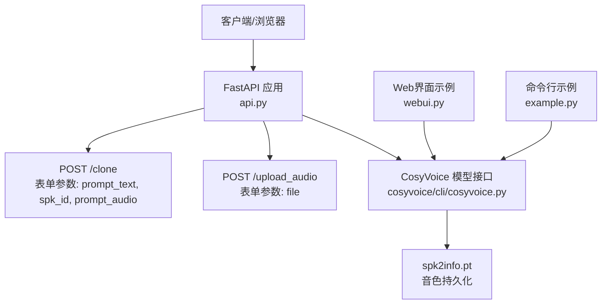
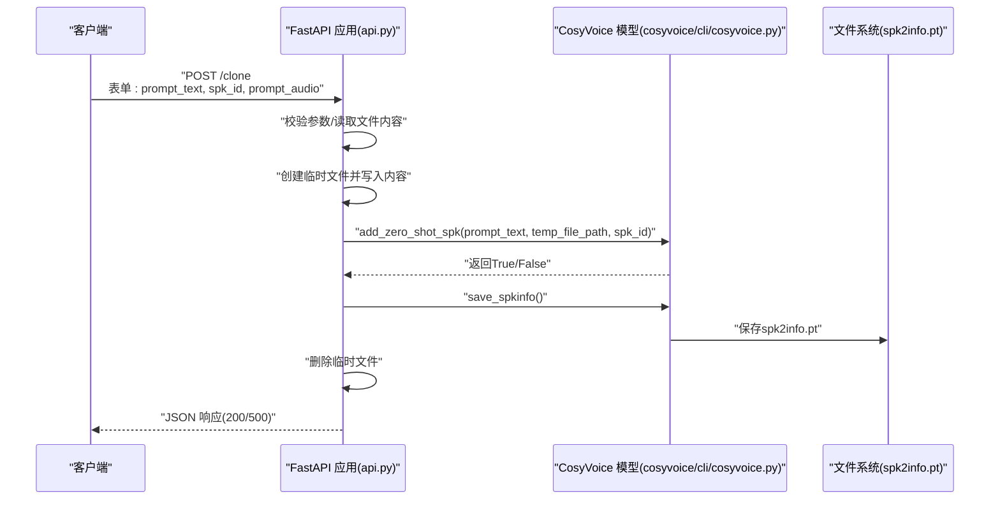
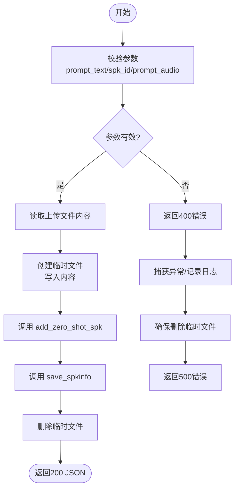
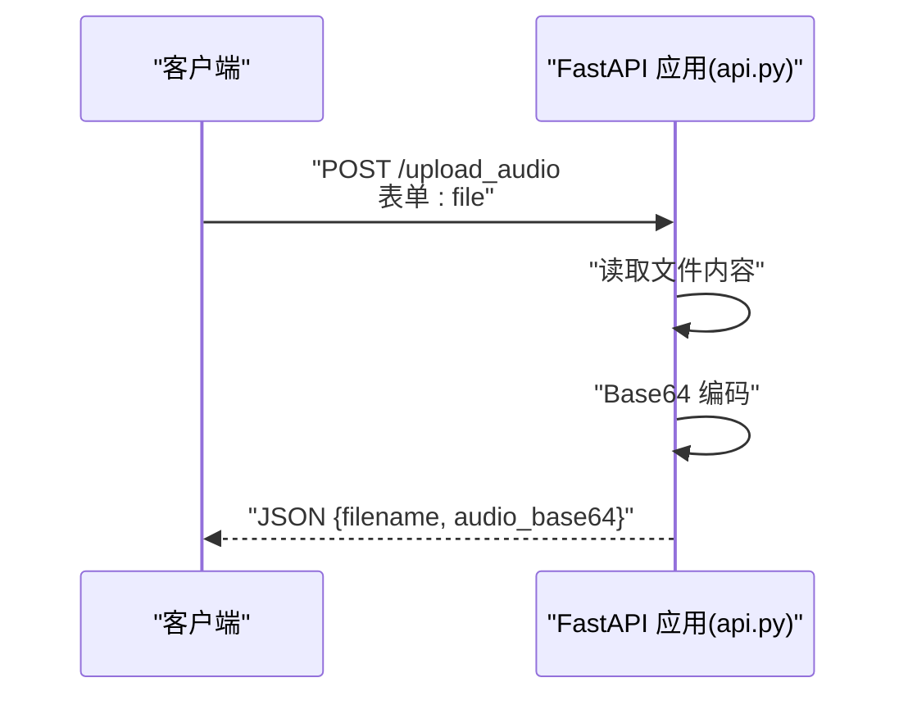
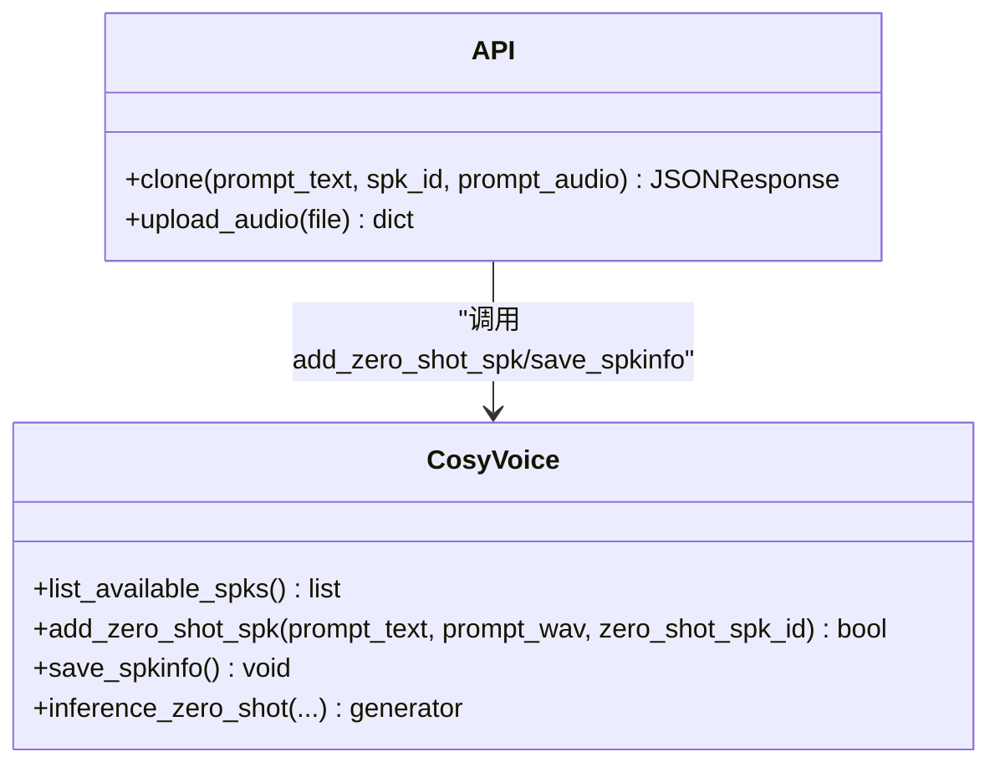
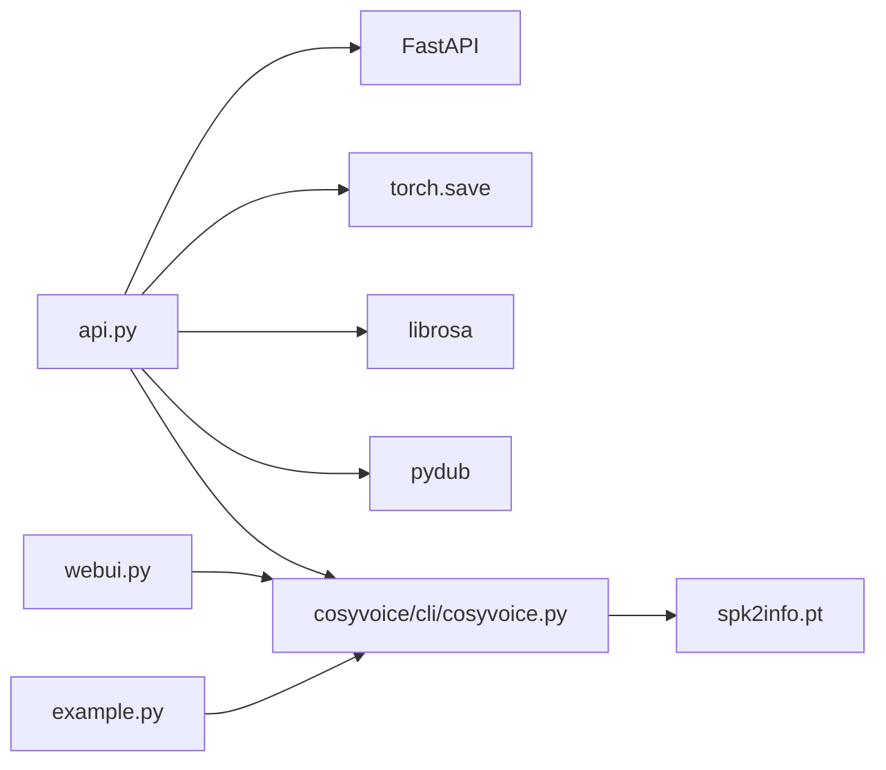

# 音色克隆与管理API

<cite>
**本文引用的文件**
- [api.py](file://api.py)
- [cosyvoice/cli/cosyvoice.py](file://cosyvoice/cli/cosyvoice.py)
- [webui.py](file://webui.py)
- [example.py](file://example.py)
- [speaker_names.json](file://speaker_names.json)
</cite>

## 目录
1. [简介](#简介)
2. [项目结构](#项目结构)
3. [核心组件](#核心组件)
4. [架构总览](#架构总览)
5. [详细组件分析](#详细组件分析)
6. [依赖关系分析](#依赖关系分析)
7. [性能考量](#性能考量)
8. [故障排查指南](#故障排查指南)
9. [结论](#结论)
10. [附录](#附录)

## 简介
本文件面向CosyVoice的音色克隆与管理REST API，围绕两个关键端点：
- POST /clone：接收用户上传的音色样本（prompt_audio）、提示文本（prompt_text）与目标音色ID（spk_id），将该音色持久化至模型内部的音色库，并返回保存结果。
- POST /upload_audio：接收音频文件，返回Base64编码，便于前端直接将音频以Base64形式提交到其他端点（如零样本克隆端点）。

文档将详细说明HTTP POST方法、表单参数、文件上传处理流程；解释add_zero_shot_spk与save_spkinfo如何实现自定义音色库的管理；提供完整的客户端实现思路与最佳实践；并阐述临时文件处理、异常捕获与资源清理机制，确保系统稳定与安全。

## 项目结构
与音色克隆与管理API直接相关的文件与职责如下：
- api.py：FastAPI应用入口，定义了/clone与/upload_audio端点，以及音频解码、流式生成、日志配置等辅助逻辑。
- cosyvoice/cli/cosyvoice.py：模型侧实现，提供add_zero_shot_spk与save_spkinfo方法，负责将用户提供的prompt文本与音频封装为音色条目并持久化到磁盘。
- webui.py：Web界面示例，展示了音色克隆的完整流程（上传或录制prompt音频、填写prompt文本与音色ID、调用克隆与保存）。
- example.py：命令行示例，演示如何在本地脚本中调用add_zero_shot_spk与save_spkinfo，以及后续使用该音色进行推理。
- speaker_names.json：示例音色名称映射，体现音色库的命名约定与用途。

图表来源
- [api.py](file://api.py#L513-L588)
- [cosyvoice/cli/cosyvoice.py](file://cosyvoice/cli/cosyvoice.py#L90-L120)
- [webui.py](file://webui.py#L140-L177)
- [example.py](file://example.py#L46-L58)

章节来源
- [api.py](file://api.py#L513-L588)
- [cosyvoice/cli/cosyvoice.py](file://cosyvoice/cli/cosyvoice.py#L90-L120)
- [webui.py](file://webui.py#L140-L177)
- [example.py](file://example.py#L46-L58)

## 核心组件
- /clone端点（POST）
  - 表单参数：
    - prompt_text：提示文本，用于描述prompt音频内容。
    - spk_id：目标音色ID（唯一标识符）。
    - prompt_audio：上传的音频文件（WAV/MP3等常见音频格式均可，最终会被加载为16kHz采样率）。
  - 处理流程要点：
    - 校验必填参数（prompt_audio、prompt_text、spk_id）。
    - 读取上传文件内容，写入临时文件（保持原扩展名）。
    - 调用模型接口cosyvoice.add_zero_shot_spk(prompt_text, temp_file_path, spk_id)，将音色条目加入内存spk2info。
    - 调用cosyvoice.save_spkinfo()将spk2info持久化到磁盘（默认保存到模型目录下的spk2info.pt）。
    - 删除临时文件，返回JSON响应。
    - 异常捕获与资源清理：若过程中出现异常，记录错误日志并确保删除临时文件，向客户端返回500错误。

- /upload_audio端点（POST）
  - 表单参数：
    - file：上传的音频文件。
  - 处理流程要点：
    - 读取文件内容，Base64编码后返回，包含原始文件名与编码后的音频数据。
    - 异常捕获：上传失败时返回500错误。

- 模型侧方法（由API调用）
  - add_zero_shot_spk(prompt_text, prompt_wav, zero_shot_spk_id)：将prompt文本与音频封装为音色条目，写入frontend.spk2info。
  - save_spkinfo()：将当前spk2info保存到磁盘（模型目录下spk2info.pt）。

章节来源
- [api.py](file://api.py#L513-L588)
- [cosyvoice/cli/cosyvoice.py](file://cosyvoice/cli/cosyvoice.py#L96-L120)

## 架构总览
下图展示了从客户端到模型层的调用链路与数据流向。

图表来源
- [api.py](file://api.py#L513-L588)
- [cosyvoice/cli/cosyvoice.py](file://cosyvoice/cli/cosyvoice.py#L96-L120)

## 详细组件分析

### /clone 端点（POST）
- HTTP方法与路径：POST /clone
- 表单参数：
  - prompt_text：字符串，必填。
  - spk_id：字符串，必填。
  - prompt_audio：文件，必填。
- 处理流程与关键步骤：
  - 参数校验：若任一参数为空，立即返回400错误。
  - 读取上传文件内容，创建临时文件（保留原扩展名），并将临时文件路径传给模型接口。
  - 调用cosyvoice.add_zero_shot_spk，将音色条目写入内存spk2info。
  - 调用cosyvoice.save_spkinfo，将spk2info持久化到磁盘。
  - 删除临时文件，返回JSON响应。
  - 异常捕获：捕获运行时异常，记录错误日志，确保删除临时文件，返回500错误。
- 安全与稳定性：
  - 临时文件采用delete=False创建，确保模型接口能正确打开文件；结束后显式删除。
  - 日志记录错误详情，便于定位问题。
  - 对空参数进行严格校验，避免无效数据进入模型。

图表来源
- [api.py](file://api.py#L513-L588)
- [cosyvoice/cli/cosyvoice.py](file://cosyvoice/cli/cosyvoice.py#L96-L120)

章节来源
- [api.py](file://api.py#L513-L588)
- [cosyvoice/cli/cosyvoice.py](file://cosyvoice/cli/cosyvoice.py#L96-L120)

### /upload_audio 端点（POST）
- HTTP方法与路径：POST /upload_audio
- 表单参数：
  - file：文件，必填。
- 处理流程与关键步骤：
  - 读取文件内容，Base64编码后返回，包含原始文件名与编码后的音频数据。
  - 异常捕获：上传失败时返回500错误。
- 使用场景：
  - 前端先调用该端点获取Base64，再将Base64提交到零样本克隆端点（如/tts/zero_shot）。
  - 或者直接将文件上传到/clone端点，避免Base64传输。

图表来源
- [api.py](file://api.py#L569-L588)

章节来源
- [api.py](file://api.py#L569-L588)

### 模型侧音色持久化（add_zero_shot_spk 与 save_spkinfo）
- add_zero_shot_spk(prompt_text, prompt_wav, zero_shot_spk_id)
  - 功能：将prompt文本与音频封装为音色条目，写入frontend.spk2info。
  - 返回：布尔值，表示添加是否成功。
- save_spkinfo()
  - 功能：将当前spk2info保存到磁盘（默认保存到模型目录下的spk2info.pt）。
- 与API的关系：
  - API在/clone端点中调用上述两个方法，完成“内存注册+磁盘持久化”的闭环。
  - WebUI与命令行示例同样展示了调用顺序：先add_zero_shot_spk，再save_spkinfo。

图表来源
- [cosyvoice/cli/cosyvoice.py](file://cosyvoice/cli/cosyvoice.py#L90-L120)
- [api.py](file://api.py#L513-L588)

章节来源
- [cosyvoice/cli/cosyvoice.py](file://cosyvoice/cli/cosyvoice.py#L90-L120)
- [api.py](file://api.py#L513-L588)

### 客户端实现示例（两种方式）
- 方式一：先上传音频获取Base64，再提交到零样本端点
  - 步骤：
    1) 调用POST /upload_audio，传入file字段，得到{filename, audio_base64}。
    2) 在后续请求（如/tts/zero_shot）中携带prompt_audio_base64与prompt_text。
  - 适用场景：需要将音频以Base64形式传输，或前端无法直接上传二进制文件。
- 方式二：直接上传文件到/clone端点
  - 步骤：
    1) 准备prompt_text、spk_id与prompt_audio文件。
    2) 调用POST /clone，提交三者。
    3) 若成功，后续可在/tts/zero_shot中使用该spk_id进行推理。
  - 适用场景：直接使用文件上传，避免Base64编码开销。

章节来源
- [api.py](file://api.py#L513-L588)

### 临时文件处理、异常捕获与资源清理
- 临时文件处理：
  - 使用NamedTemporaryFile创建临时文件，delete=False，确保模型接口能打开该文件。
  - 成功后删除临时文件；异常时也确保删除，避免磁盘泄漏。
- 异常捕获：
  - 对参数校验、文件读取、模型调用、持久化等环节进行try-except。
  - 记录详细错误日志，向客户端返回标准化的HTTP错误码。
- 资源清理：
  - 显式删除临时文件。
  - 对于日志处理器等，按需配置，保证日志落盘与级别设置合理。

章节来源
- [api.py](file://api.py#L513-L588)

## 依赖关系分析
- API层依赖：
  - FastAPI框架与UploadFile/JSONResponse等类型。
  - 模型接口cosyvoice（CosyVoice3实例），提供add_zero_shot_spk与save_spkinfo。
  - 临时文件与Base64编码工具。
- 模型层依赖：
  - frontend.spk2info：内存中的音色索引。
  - torch.save：持久化spk2info.pt。
- WebUI与示例：
  - 展示了与API一致的调用顺序：add_zero_shot_spk -> save_spkinfo。

图表来源
- [api.py](file://api.py#L1-L120)
- [cosyvoice/cli/cosyvoice.py](file://cosyvoice/cli/cosyvoice.py#L90-L120)
- [webui.py](file://webui.py#L140-L177)
- [example.py](file://example.py#L46-L58)

章节来源
- [api.py](file://api.py#L1-L120)
- [cosyvoice/cli/cosyvoice.py](file://cosyvoice/cli/cosyvoice.py#L90-L120)
- [webui.py](file://webui.py#L140-L177)
- [example.py](file://example.py#L46-L58)

## 性能考量
- Base64编码开销：/upload_audio会将整个音频文件编码为Base64，适合小文件；大文件建议直接使用/clone端点上传二进制。
- 流式响应：/tts与/tts/pcm等端点采用流式生成，降低首token延迟；/clone与/upload_audio为同步接口，适合批量管理音色。
- 临时文件I/O：/clone端点会写入临时文件再删除，建议确保磁盘空间充足且权限正确。
- 模型初始化：主函数中初始化CosyVoice3实例，包含TRT/vLLM等优化选项，建议在生产环境合理配置并发与精度。

[本节为通用性能建议，不直接分析具体文件]

## 故障排查指南
- 400错误（参数缺失）
  - 现象：/clone或/tts/*端点返回400。
  - 排查：确认prompt_text、spk_id、prompt_audio是否均提供；/upload_audio的file字段是否存在。
- 500错误（处理失败）
  - 现象：/clone返回500。
  - 排查：查看服务端日志（api_service.log），关注临时文件删除与模型调用是否异常；检查磁盘权限与磁盘空间。
- 音频格式/采样率问题
  - 现象：推理质量差或报错。
  - 排查：确保上传的prompt音频采样率满足要求；必要时在前端进行重采样或裁剪。
- 音色未生效
  - 现象：使用/clone保存后，在可用音色列表中未出现。
  - 排查：确认save_spkinfo是否成功执行；检查spk2info.pt是否生成；重启服务后再次查询可用音色列表。

章节来源
- [api.py](file://api.py#L513-L588)

## 结论
- /clone与/upload_audio构成了完整的音色克隆与管理闭环：前者负责将用户提供的prompt文本与音频持久化为自定义音色，后者负责便捷地将音频转换为Base64供其他端点使用。
- API层通过严格的参数校验、临时文件管理与异常捕获，保障了稳定性与安全性。
- 模型层的add_zero_shot_spk与save_spkinfo实现了音色库的内存注册与磁盘持久化，配合WebUI与示例脚本，形成从上传到使用的完整工作流。

[本节为总结性内容，不直接分析具体文件]

## 附录
- 可用音色列表
  - API提供/get_available_spks端点，返回当前可用音色ID列表（包括预设与自定义音色）。
- 示例音色名称
  - speaker_names.json提供了示例音色名称映射，可作为命名参考。

章节来源
- [api.py](file://api.py#L305-L316)
- [speaker_names.json](file://speaker_names.json#L1-L14)