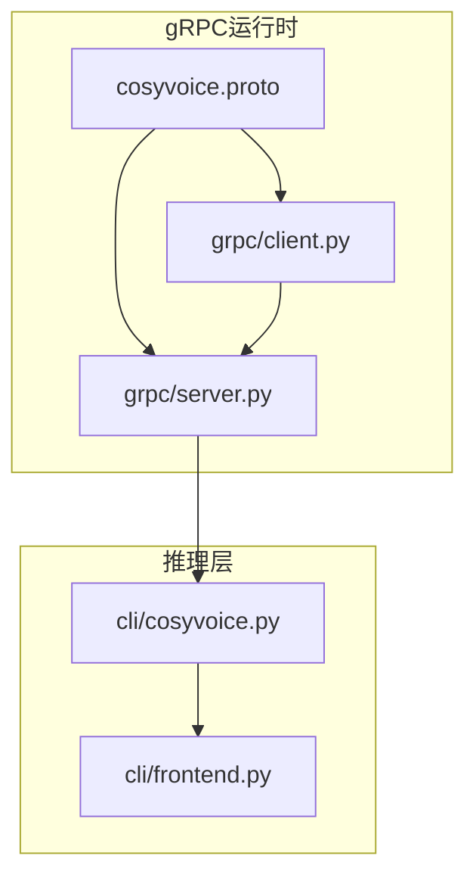
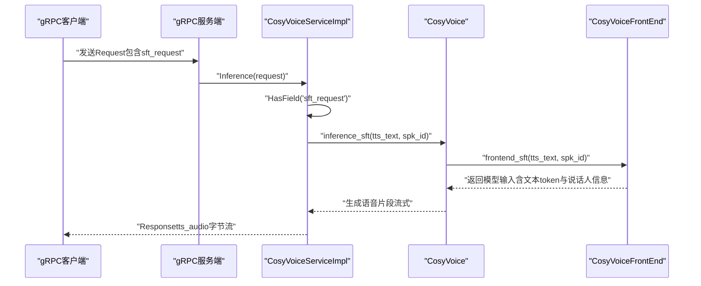
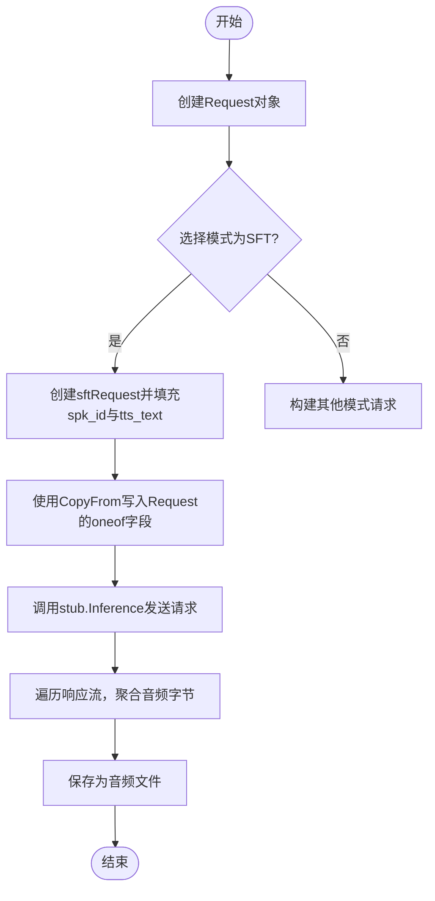
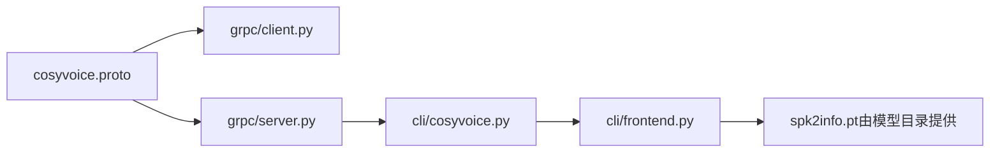

# SFT模式gRPC请求

<cite>
**本文引用的文件**
- [cosyvoice.proto](file://runtime/python/grpc/cosyvoice.proto)
- [client.py](file://runtime/python/grpc/client.py)
- [server.py](file://runtime/python/grpc/server.py)
- [cosyvoice.py](file://cosyvoice/cli/cosyvoice.py)
- [frontend.py](file://cosyvoice/cli/frontend.py)
- [example.py](file://example.py)
- [README.md](file://README.md)
- [speaker_names.json](file://speaker_names.json)
</cite>

## 目录
1. [简介](#简介)
2. [项目结构](#项目结构)
3. [核心组件](#核心组件)
4. [架构总览](#架构总览)
5. [详细组件分析](#详细组件分析)
6. [依赖关系分析](#依赖关系分析)
7. [性能考量](#性能考量)
8. [故障排查指南](#故障排查指南)
9. [结论](#结论)
10. [附录](#附录)

## 简介
本文件面向gRPC API中的SFT（Speaker Fine-Tuning）模式请求，围绕cosyvoice.proto中定义的sftRequest消息类型，系统阐述以下内容：
- 字段含义、数据类型与使用要求：spk_id与tts_text
- 工作机制：通过预定义说话人ID驱动语音合成
- 实际应用场景：固定音色语音合成
- 请求构造示例（Python客户端）：如何通过RequestPayload的oneof机制选择sft_request
- 错误处理建议：如无效spk_id
- 性能考量与优化建议
- 与其他模式（Zero-shot、Cross-lingual、Instruct）的对比

## 项目结构
与SFT模式gRPC请求直接相关的核心文件如下：
- 协议定义：runtime/python/grpc/cosyvoice.proto
- gRPC客户端：runtime/python/grpc/client.py
- gRPC服务端：runtime/python/grpc/server.py
- 推理实现（SFT模式）：cosyvoice/cli/cosyvoice.py
- 前端处理（SFT模式）：cosyvoice/cli/frontend.py
- 示例与模型下载说明：example.py、README.md
- 说话人名称示例：speaker_names.json

图表来源
- [cosyvoice.proto](file://runtime/python/grpc/cosyvoice.proto#L1-L43)
- [client.py](file://runtime/python/grpc/client.py#L30-L71)
- [server.py](file://runtime/python/grpc/server.py#L45-L71)
- [cosyvoice.py](file://cosyvoice/cli/cosyvoice.py#L121-L145)
- [frontend.py](file://cosyvoice/cli/frontend.py#L238-L256)

章节来源
- [cosyvoice.proto](file://runtime/python/grpc/cosyvoice.proto#L1-L43)
- [client.py](file://runtime/python/grpc/client.py#L30-L71)
- [server.py](file://runtime/python/grpc/server.py#L45-L71)
- [cosyvoice.py](file://cosyvoice/cli/cosyvoice.py#L121-L145)
- [frontend.py](file://cosyvoice/cli/frontend.py#L238-L256)

## 核心组件
- sftRequest消息类型
  - spk_id：string，预定义说话人ID
  - tts_text：string，待合成文本
- RequestPayload oneof机制
  - 在单次请求中仅允许设置一个子消息，SFT模式对应sft_request
- gRPC服务端入口
  - Inference方法根据HasField判断调用对应的推理分支
- 推理链路
  - 服务端接收sft_request后，调用CosyVoice.inference_sft
  - 前端frontend_sft将spk_id映射为模型输入，并拼接文本token

章节来源
- [cosyvoice.proto](file://runtime/python/grpc/cosyvoice.proto#L10-L22)
- [server.py](file://runtime/python/grpc/server.py#L45-L66)
- [cosyvoice.py](file://cosyvoice/cli/cosyvoice.py#L121-L145)
- [frontend.py](file://cosyvoice/cli/frontend.py#L238-L256)

## 架构总览
下图展示SFT模式从gRPC客户端到推理模型的完整调用链路。

图表来源
- [client.py](file://runtime/python/grpc/client.py#L30-L61)
- [server.py](file://runtime/python/grpc/server.py#L45-L71)
- [cosyvoice.py](file://cosyvoice/cli/cosyvoice.py#L121-L145)
- [frontend.py](file://cosyvoice/cli/frontend.py#L238-L256)

## 详细组件分析

### sftRequest消息类型与字段语义
- 字段定义
  - spk_id：string，预定义说话人ID
  - tts_text：string，待合成文本
- oneof机制
  - Request.RequestPayload为oneof，仅能设置其中一个子消息
  - 选择sft_request时，需确保spk_id与tts_text均有效
- 数据类型与约束
  - 字符串类型，UTF-8编码
  - 文本长度与说话人信息由后端模型决定，建议避免过长文本导致内存压力

章节来源
- [cosyvoice.proto](file://runtime/python/grpc/cosyvoice.proto#L10-L22)

### gRPC客户端请求构造（Python）
- 关键步骤
  - 创建Request对象
  - 为sft_request赋值spk_id与tts_text
  - 使用CopyFrom将sft_request写入Request的oneof字段
  - 发送Inference请求并聚合响应字节流
- 示例参考路径
  - [client.py](file://runtime/python/grpc/client.py#L30-L61)

章节来源
- [client.py](file://runtime/python/grpc/client.py#L30-L61)

### gRPC服务端处理流程
- 关键逻辑
  - HasField('sft_request')判断是否为SFT模式
  - 读取request.sft_request.tts_text与request.sft_request.spk_id
  - 调用CosyVoice.inference_sft进行推理
  - 将模型输出的tts_speech转为字节流并逐片返回
- 示例参考路径
  - [server.py](file://runtime/python/grpc/server.py#L45-L71)

章节来源
- [server.py](file://runtime/python/grpc/server.py#L45-L71)

### 推理实现与前端映射
- CosyVoice.inference_sft
  - 对输入文本进行规范化与分句
  - 调用frontend_sft获取模型输入
- CosyVoiceFrontEnd.frontend_sft
  - 将spk_id映射为模型输入字典
  - 附加文本token与长度
- 示例参考路径
  - [cosyvoice.py](file://cosyvoice/cli/cosyvoice.py#L121-L145)
  - [frontend.py](file://cosyvoice/cli/frontend.py#L238-L256)

章节来源
- [cosyvoice.py](file://cosyvoice/cli/cosyvoice.py#L121-L145)
- [frontend.py](file://cosyvoice/cli/frontend.py#L238-L256)

### 说话人ID来源与可用性
- 说话人信息加载
  - CosyVoice初始化时从模型目录加载spk2info.pt
  - 可通过list_available_spks列出可用说话人ID
- 示例参考路径
  - [cosyvoice.py](file://cosyvoice/cli/cosyvoice.py#L86-L94)
- 示例说话人名称
  - 参考[speaker_names.json](file://speaker_names.json#L1-L14)

章节来源
- [cosyvoice.py](file://cosyvoice/cli/cosyvoice.py#L86-L94)
- [speaker_names.json](file://speaker_names.json#L1-L14)

### 请求构造流程图（客户端侧）

图表来源
- [client.py](file://runtime/python/grpc/client.py#L30-L61)

## 依赖关系分析
- 协议与实现耦合
  - proto定义的字段名与类型直接影响客户端构造与服务端解析
- 服务端分支决策
  - HasField用于oneof分支选择，确保每次请求仅进入一个推理分支
- 推理链路依赖
  - 服务端依赖CosyVoice实例；CosyVoice依赖FrontEnd；FrontEnd依赖spk2info映射

图表来源
- [cosyvoice.proto](file://runtime/python/grpc/cosyvoice.proto#L10-L22)
- [client.py](file://runtime/python/grpc/client.py#L30-L61)
- [server.py](file://runtime/python/grpc/server.py#L45-L71)
- [cosyvoice.py](file://cosyvoice/cli/cosyvoice.py#L86-L94)
- [frontend.py](file://cosyvoice/cli/frontend.py#L60-L71)

章节来源
- [cosyvoice.proto](file://runtime/python/grpc/cosyvoice.proto#L10-L22)
- [client.py](file://runtime/python/grpc/client.py#L30-L61)
- [server.py](file://runtime/python/grpc/server.py#L45-L71)
- [cosyvoice.py](file://cosyvoice/cli/cosyvoice.py#L86-L94)
- [frontend.py](file://cosyvoice/cli/frontend.py#L60-L71)

## 性能考量
- 文本长度控制
  - 过长文本可能导致内存压力与延迟增加，建议按句切分后流式传输
- 流式输出
  - 服务端已采用流式响应，客户端应边收边写，降低首包延迟
- 采样率与量化
  - 服务端将浮点波形按16位整型量化为字节流，注意客户端解码时的采样率匹配
- 并发与资源
  - 服务端最大并发可通过参数配置，合理设置以平衡吞吐与延迟

[本节为通用性能建议，不直接分析具体文件]

## 故障排查指南
- 常见问题与定位
  - 无效spk_id：检查模型目录中是否存在对应说话人ID；可通过list_available_spks确认
  - 文本为空或过短：可能导致合成质量下降，建议保证tts_text非空且长度适中
  - oneof未正确设置：确保仅设置sft_request，避免同时携带其他模式字段
- 日志与调试
  - 服务端日志包含模式识别与推理阶段信息，便于定位问题
- 参考路径
  - [server.py](file://runtime/python/grpc/server.py#L45-L71)
  - [cosyvoice.py](file://cosyvoice/cli/cosyvoice.py#L86-L94)

章节来源
- [server.py](file://runtime/python/grpc/server.py#L45-L71)
- [cosyvoice.py](file://cosyvoice/cli/cosyvoice.py#L86-L94)

## 结论
SFT模式通过预定义说话人ID实现稳定的音色复现，适用于需要固定音色的语音合成场景。gRPC协议以简洁的sftRequest消息承载关键字段，配合oneof机制确保请求的单一性与清晰性。结合流式响应与合理的文本切分策略，可在保证质量的同时获得良好的实时性表现。

[本节为总结性内容，不直接分析具体文件]

## 附录

### SFT模式典型应用场景
- 固定音色播报：新闻、客服、导航等需要一致音色的服务
- 数字人与虚拟主播：稳定的人声风格与口音
- 多角色配音：为不同角色分配不同的预训练说话人ID

[本节为概念性说明，不直接分析具体文件]

### 与其他模式的对比（简述）
- 与Zero-shot模式
  - SFT使用预训练说话人，无需额外提示音频；Zero-shot通过提示音频快速克隆说话人
- 与Cross-lingual模式
  - SFT保持固定语言与音色；Cross-lingual支持跨语言文本合成
- 与Instruct模式
  - SFT专注于音色一致性；Instruct通过指令控制情感、语速等属性

[本节为概念性说明，不直接分析具体文件]

### 快速开始与示例参考
- 模型下载与基础用法参考
  - [README.md](file://README.md#L111-L133)
- Python示例（非gRPC）
  - [example.py](file://example.py#L10-L16)

章节来源
- [README.md](file://README.md#L111-L133)
- [example.py](file://example.py#L10-L16)