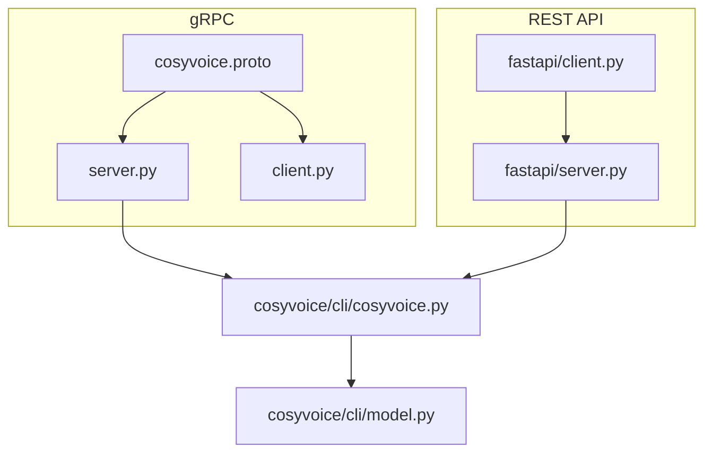
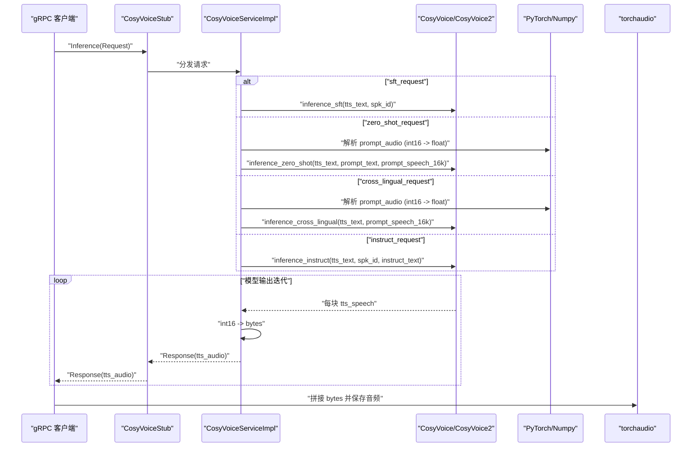
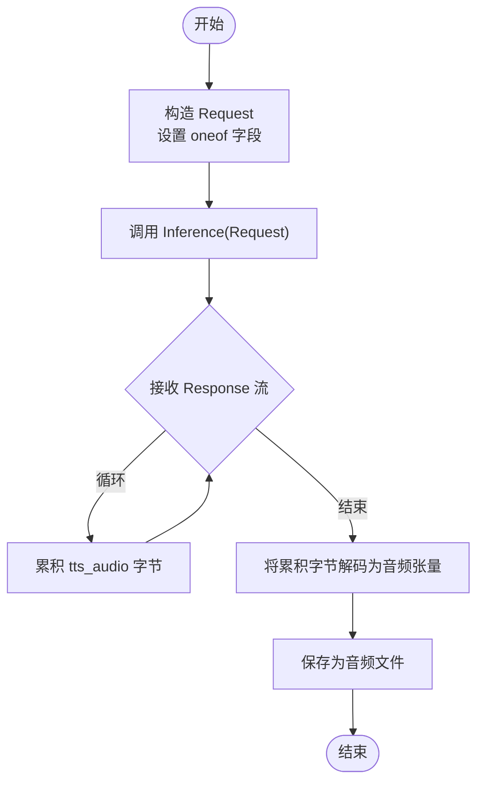
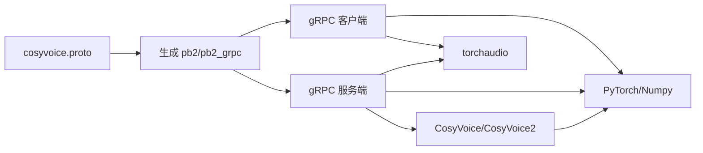

# gRPC API

<cite>
**本文引用的文件**
- [cosyvoice.proto](file://runtime/python/grpc/cosyvoice.proto)
- [client.py](file://runtime/python/grpc/client.py)
- [server.py](file://runtime/python/grpc/server.py)
- [server.py（FastAPI）](file://runtime/python/fastapi/server.py)
- [client.py（FastAPI）](file://runtime/python/fastapi/client.py)
- [cosyvoice.py](file://cosyvoice/cli/cosyvoice.py)
- [model.py](file://cosyvoice/cli/model.py)
</cite>

## 目录
1. [简介](#简介)
2. [项目结构](#项目结构)
3. [核心组件](#核心组件)
4. [架构总览](#架构总览)
5. [详细组件分析](#详细组件分析)
6. [依赖关系分析](#依赖关系分析)
7. [性能考量](#性能考量)
8. [故障排查指南](#故障排查指南)
9. [结论](#结论)
10. [附录](#附录)

## 简介
本文件为 CosyVoice 的 gRPC 接口 API 文档，基于 proto 文件定义的服务契约与消息类型，系统性说明以下内容：
- 服务 CosyVoice 的 RPC 方法 Inference 的请求与响应模型
- oneof 字段 RequestPayload 如何支持四种请求模式：sft、zero-shot、cross-lingual、instruct
- 流式响应（stream Response）的实现方式与客户端消费流程
- 二进制音频 prompt_audio 的序列化规则与协议缓冲区使用
- gRPC 客户端实现指南：连接建立、消息构造、流式接收、错误处理
- 认证机制、性能优化建议以及与 REST API 的对比

## 项目结构
CosyVoice 在仓库中的 gRPC 实现位于 runtime/python/grpc 目录，包含 proto 定义、gRPC 服务端与客户端示例；同时在 runtime/python/fastapi 中提供了 REST API 对应实现，便于对比与迁移。

图表来源
- [cosyvoice.proto](file://runtime/python/grpc/cosyvoice.proto#L1-L43)
- [server.py](file://runtime/python/grpc/server.py#L1-L97)
- [client.py](file://runtime/python/grpc/client.py#L1-L107)
- [server.py（FastAPI）](file://runtime/python/fastapi/server.py#L1-L187)
- [client.py（FastAPI）](file://runtime/python/fastapi/client.py#L1-L93)
- [cosyvoice.py](file://cosyvoice/cli/cosyvoice.py#L1-L200)
- [model.py](file://cosyvoice/cli/model.py#L1-L200)

章节来源
- [cosyvoice.proto](file://runtime/python/grpc/cosyvoice.proto#L1-L43)
- [server.py](file://runtime/python/grpc/server.py#L1-L97)
- [client.py](file://runtime/python/grpc/client.py#L1-L107)
- [server.py（FastAPI）](file://runtime/python/fastapi/server.py#L1-L187)
- [client.py（FastAPI）](file://runtime/python/fastapi/client.py#L1-L93)
- [cosyvoice.py](file://cosyvoice/cli/cosyvoice.py#L1-L200)
- [model.py](file://cosyvoice/cli/model.py#L1-L200)

## 核心组件
- 服务契约：CosyVoice.Inference(Request) returns (stream Response)
- 请求消息 Request：包含 oneof 字段 RequestPayload，支持四种请求模式
- 响应消息 Response：包含二进制音频字段 tts_audio
- 四种请求模式：
  - sftRequest：说话人微调模式
  - zeroshotRequest：零样本克隆说话人
  - crosslingualRequest：跨语言语音合成
  - instructRequest：指令控制语音合成

章节来源
- [cosyvoice.proto](file://runtime/python/grpc/cosyvoice.proto#L6-L43)

## 架构总览
gRPC 服务端通过 CosyVoiceServiceImpl 实现 Inference 方法，根据 RequestPayload 的具体字段选择对应推理模式，并将模型输出按块流式返回给客户端。客户端以流式方式接收 Response，拼接后保存为音频文件。

图表来源
- [server.py](file://runtime/python/grpc/server.py#L45-L72)
- [client.py](file://runtime/python/grpc/client.py#L30-L71)
- [cosyvoice.py](file://cosyvoice/cli/cosyvoice.py#L121-L200)

## 详细组件分析

### 服务契约与消息模型
- 服务：CosyVoice
  - 方法：Inference(Request) returns (stream Response)
- 请求消息：Request
  - oneof 字段 RequestPayload：包含 sft_request、zero_shot_request、cross_lingual_request、instruct_request
- 响应消息：Response
  - 字段：tts_audio（bytes）

章节来源
- [cosyvoice.proto](file://runtime/python/grpc/cosyvoice.proto#L6-L43)

### 请求模式详解

#### sftRequest（说话人微调）
- 字段：spk_id（说话人ID）、tts_text（待合成文本）
- 服务端逻辑：调用模型的 inference_sft
- 客户端逻辑：构造 sftRequest 并设置到 Request.sft_request

章节来源
- [cosyvoice.proto](file://runtime/python/grpc/cosyvoice.proto#L19-L22)
- [server.py](file://runtime/python/grpc/server.py#L45-L49)
- [client.py](file://runtime/python/grpc/client.py#L34-L39)

#### zeroshotRequest（零样本克隆）
- 字段：tts_text（待合成文本）、prompt_text（提示文本）、prompt_audio（提示音频，bytes）
- 服务端逻辑：
  - 将 bytes 解析为 16kHz 的浮点张量（int16 -> float）
  - 调用模型的 inference_zero_shot
- 客户端逻辑：
  - 读取本地音频文件，转为 16kHz
  - 将 numpy 数组按 int16 编码为 bytes，赋值给 prompt_audio

章节来源
- [cosyvoice.proto](file://runtime/python/grpc/cosyvoice.proto#L24-L28)
- [server.py](file://runtime/python/grpc/server.py#L51-L55)
- [client.py](file://runtime/python/grpc/client.py#L42-L47)

#### crosslingualRequest（跨语言）
- 字段：tts_text（目标语言文本）、prompt_audio（提示音频，bytes）
- 服务端逻辑：
  - 将 bytes 解析为 16kHz 的浮点张量（int16 -> float）
  - 调用模型的 inference_cross_lingual
- 客户端逻辑：
  - 读取本地音频文件，转为 16kHz
  - 将 numpy 数组按 int16 编码为 bytes，赋值给 prompt_audio

章节来源
- [cosyvoice.proto](file://runtime/python/grpc/cosyvoice.proto#L30-L33)
- [server.py](file://runtime/python/grpc/server.py#L58-L60)
- [client.py](file://runtime/python/grpc/client.py#L49-L54)

#### instructRequest（指令控制）
- 字段：tts_text（待合成文本）、spk_id（说话人ID）、instruct_text（指令文本）
- 服务端逻辑：调用模型的 inference_instruct
- 客户端逻辑：构造 instructRequest 并设置到 Request.instruct_request

章节来源
- [cosyvoice.proto](file://runtime/python/grpc/cosyvoice.proto#L35-L39)
- [server.py](file://runtime/python/grpc/server.py#L63-L65)
- [client.py](file://runtime/python/grpc/client.py#L56-L61)

### 流式响应（stream Response）实现
- 服务端：对模型输出进行迭代，逐块生成 Response，yield 返回
- 客户端：遍历响应流，累积 tts_audio 字节，最后保存为音频文件

图表来源
- [server.py](file://runtime/python/grpc/server.py#L68-L71)
- [client.py](file://runtime/python/grpc/client.py#L63-L69)

章节来源
- [server.py](file://runtime/python/grpc/server.py#L45-L72)
- [client.py](file://runtime/python/grpc/client.py#L30-L71)

### 二进制数据 prompt_audio 的序列化规则
- 客户端发送：将 16kHz 音频 numpy 数组按 int16 编码为 bytes
- 服务端接收：将 bytes 按 int16 解码为张量，再转为 float，作为模型输入
- 协议缓冲区使用：prompt_audio 为 bytes 类型，遵循 proto3 默认编码

章节来源
- [client.py](file://runtime/python/grpc/client.py#L45-L47)
- [server.py](file://runtime/python/grpc/server.py#L51-L52)

### gRPC 客户端实现指南
- 连接建立：使用 insecure_channel 建立到服务端的连接
- 消息构造：
  - 根据模式选择 oneof 字段：sft_request、zero_shot_request、cross_lingual_request、instruct_request
  - 对于 zero_shot 和 cross_lingual，需将提示音频按 int16 编码为 bytes
- 流式接收：遍历响应流，累积字节，最后解码保存
- 错误处理：客户端示例未显式捕获异常，建议在生产环境增加 try-except 与日志记录

章节来源
- [client.py](file://runtime/python/grpc/client.py#L30-L71)

### 与 REST API 的对比
- REST API：FastAPI 提供 /inference_* 接口，使用 multipart/form-data 或 JSON 参数，返回 StreamingResponse
- gRPC：单次 RPC 调用返回流式 Response，二进制音频直接在消息体中传输
- 适用场景：
  - gRPC 更适合低延迟、高吞吐的内部服务间通信
  - REST 更适合浏览器直连与简单集成

章节来源
- [server.py（FastAPI）](file://runtime/python/fastapi/server.py#L68-L160)
- [client.py（FastAPI）](file://runtime/python/fastapi/client.py#L22-L57)

## 依赖关系分析
- 服务端依赖：
  - CosyVoice/CosyVoice2 模型类，提供四种推理模式
  - PyTorch/Numpy 用于音频张量处理
  - torchaudio 用于保存音频
- 客户端依赖：
  - grpc 库建立通道与调用 stub
  - torchaudio 保存音频
  - cosyvoice_pb2 / cosyvoice_pb2_grpc 由 proto 生成

图表来源
- [cosyvoice.proto](file://runtime/python/grpc/cosyvoice.proto#L1-L43)
- [server.py](file://runtime/python/grpc/server.py#L1-L97)
- [client.py](file://runtime/python/grpc/client.py#L1-L107)
- [cosyvoice.py](file://cosyvoice/cli/cosyvoice.py#L1-L200)
- [model.py](file://cosyvoice/cli/model.py#L1-L200)

章节来源
- [server.py](file://runtime/python/grpc/server.py#L1-L97)
- [client.py](file://runtime/python/grpc/client.py#L1-L107)
- [cosyvoice.py](file://cosyvoice/cli/cosyvoice.py#L1-L200)
- [model.py](file://cosyvoice/cli/model.py#L1-L200)

## 性能考量
- 流式传输：服务端按块生成 Response，客户端边收边写，降低整体时延
- 采样率与格式：提示音频统一为 16kHz，int16 编码，减少带宽与内存占用
- 模型优化：CosyVoice2/3 支持 JIT、TensorRT 等优化，提升吞吐与 RTF
- 并发控制：服务端通过 maximum_concurrent_rpcs 控制最大并发 RPC 数

章节来源
- [server.py](file://runtime/python/grpc/server.py#L74-L80)
- [model.py](file://cosyvoice/cli/model.py#L97-L145)
- [cosyvoice.py](file://cosyvoice/cli/cosyvoice.py#L121-L200)

## 故障排查指南
- 连接问题：确认服务端监听地址与端口，客户端 host/port 参数正确
- 模式选择：确保 RequestPayload 仅设置一个 oneof 字段，避免冲突
- 音频格式：确保 prompt_audio 为 16kHz、int16 编码的 bytes
- 并发限制：若出现超时或拒绝，检查 maximum_concurrent_rpcs 与 max_workers
- 日志定位：服务端打印请求类型与响应发送状态，有助于定位问题

章节来源
- [server.py](file://runtime/python/grpc/server.py#L45-L72)
- [client.py](file://runtime/python/grpc/client.py#L30-L71)

## 结论
CosyVoice 的 gRPC API 以简洁的消息模型与流式响应满足高性能语音合成需求。通过 oneof 字段支持四种常用推理模式，结合二进制音频的高效传输与模型侧的多优化手段，可在服务间通信场景中获得稳定、低延迟的体验。与 REST API 对比，gRPC 更适合内部系统集成；与浏览器直连相比，REST 更易用。建议在生产环境中完善错误处理、监控与限流策略。

## 附录

### API 定义摘要
- 服务：CosyVoice
  - 方法：Inference(Request) returns (stream Response)
- 请求消息：Request
  - oneof RequestPayload：sft_request、zero_shot_request、cross_lingual_request、instruct_request
- 响应消息：Response
  - 字段：tts_audio（bytes）

章节来源
- [cosyvoice.proto](file://runtime/python/grpc/cosyvoice.proto#L6-L43)