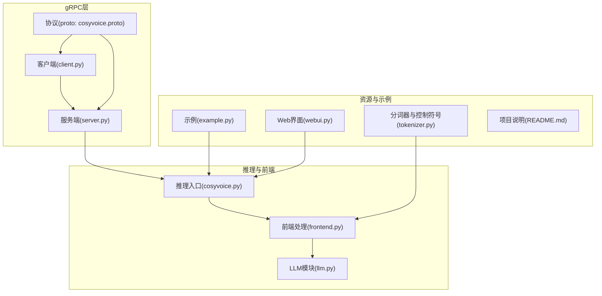
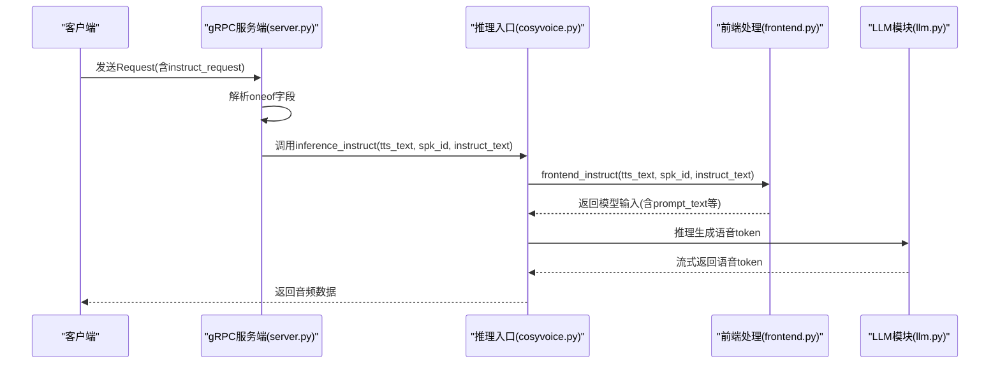
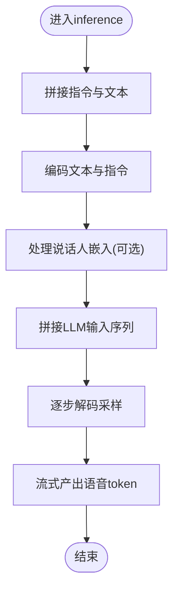
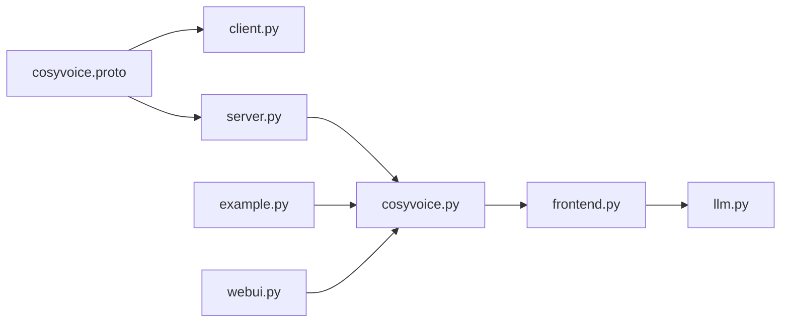

# 指令模式gRPC请求

<cite>
**本文引用的文件**
- [cosyvoice.proto](file://runtime/python/grpc/cosyvoice.proto)
- [client.py](file://runtime/python/grpc/client.py)
- [server.py](file://runtime/python/grpc/server.py)
- [cosyvoice.py](file://cosyvoice/cli/cosyvoice.py)
- [frontend.py](file://cosyvoice/cli/frontend.py)
- [llm.py](file://cosyvoice/llm/llm.py)
- [example.py](file://example.py)
- [README.md](file://README.md)
- [webui.py](file://webui.py)
- [tokenizer.py](file://cosyvoice/tokenizer/tokenizer.py)
</cite>

## 目录
1. [简介](#简介)
2. [项目结构](#项目结构)
3. [核心组件](#核心组件)
4. [架构总览](#架构总览)
5. [详细组件分析](#详细组件分析)
6. [依赖关系分析](#依赖关系分析)
7. [性能考量](#性能考量)
8. [故障排查指南](#故障排查指南)
9. [结论](#结论)
10. [附录](#附录)

## 简介
本文件面向gRPC API中“自然语言指令控制请求”的使用与实现，围绕cosyvoice.proto中的instructRequest消息类型展开，系统性说明以下要点：
- instructRequest的字段含义：tts_text、spk_id、instruct_text
- instruct_text如何通过自然语言描述（如“用欢快的语调”）控制语音风格
- 该模式如何结合LLM理解指令并生成相应语音
- 完整的请求示例与不同指令对输出语音的影响
- 指令语法建议、支持的控制维度以及潜在的解析错误处理

## 项目结构
与gRPC指令模式直接相关的核心文件如下：
- 协议定义：runtime/python/grpc/cosyvoice.proto
- gRPC客户端：runtime/python/grpc/client.py
- gRPC服务端：runtime/python/grpc/server.py
- CLI推理入口与前端处理：cosyvoice/cli/cosyvoice.py、cosyvoice/cli/frontend.py
- LLM推理与拼接逻辑：cosyvoice/llm/llm.py
- 示例与Web界面：example.py、webui.py
- 文本标记与特殊控制符号：cosyvoice/tokenizer/tokenizer.py
- 项目说明与模式能力概述：README.md

图表来源
- [cosyvoice.proto](file://runtime/python/grpc/cosyvoice.proto#L1-L43)
- [client.py](file://runtime/python/grpc/client.py#L30-L61)
- [server.py](file://runtime/python/grpc/server.py#L45-L65)
- [cosyvoice.py](file://cosyvoice/cli/cosyvoice.py#L205-L231)
- [frontend.py](file://cosyvoice/cli/frontend.py#L332-L374)
- [llm.py](file://cosyvoice/llm/llm.py#L166-L229)
- [example.py](file://example.py#L29-L96)
- [webui.py](file://webui.py#L106-L138)
- [tokenizer.py](file://cosyvoice/tokenizer/tokenizer.py#L274-L328)

章节来源
- [cosyvoice.proto](file://runtime/python/grpc/cosyvoice.proto#L1-L43)
- [client.py](file://runtime/python/grpc/client.py#L30-L61)
- [server.py](file://runtime/python/grpc/server.py#L45-L65)
- [cosyvoice.py](file://cosyvoice/cli/cosyvoice.py#L205-L231)
- [frontend.py](file://cosyvoice/cli/frontend.py#L332-L374)
- [llm.py](file://cosyvoice/llm/llm.py#L166-L229)
- [example.py](file://example.py#L29-L96)
- [webui.py](file://webui.py#L106-L138)
- [tokenizer.py](file://cosyvoice/tokenizer/tokenizer.py#L274-L328)
- [README.md](file://README.md#L13-L21)

## 核心组件
- instructRequest消息类型：包含tts_text、spk_id、instruct_text三个字段，用于在gRPC请求中传递待合成文本、说话人标识与自然语言指令。
- gRPC服务端Inference方法：根据oneof字段判断请求类型，并调用对应推理接口；在instruct模式下，将tts_text、spk_id、instruct_text传入模型推理。
- 前端处理frontend_instruct：将自然语言指令转换为内部token序列，注入到LLM输入中，同时在instruct模式下移除某些嵌入以避免信息泄露。
- LLM推理流程：将指令与文本拼接后进行编码与解码，逐步采样生成语音token，最终由声码器合成音频。
- 示例与Web界面：提供不同指令的使用示例，展示不同控制维度的效果。

章节来源
- [cosyvoice.proto](file://runtime/python/grpc/cosyvoice.proto#L10-L43)
- [server.py](file://runtime/python/grpc/server.py#L45-L65)
- [frontend.py](file://cosyvoice/cli/frontend.py#L332-L374)
- [llm.py](file://cosyvoice/llm/llm.py#L166-L229)
- [example.py](file://example.py#L29-L96)
- [webui.py](file://webui.py#L106-L138)

## 架构总览
下面的序列图展示了gRPC指令请求从客户端到服务端再到推理链路的整体流程。

图表来源
- [server.py](file://runtime/python/grpc/server.py#L45-L65)
- [cosyvoice.py](file://cosyvoice/cli/cosyvoice.py#L205-L231)
- [frontend.py](file://cosyvoice/cli/frontend.py#L332-L374)
- [llm.py](file://cosyvoice/llm/llm.py#L166-L229)

## 详细组件分析

### instructRequest消息类型与字段语义
- 字段定义
  - tts_text：待合成的文本内容
  - spk_id：预训练说话人ID（在instruct模式下仍可作为参考或上下文）
  - instruct_text：自然语言指令，用于控制情感、语速、音色等风格维度
- 在gRPC中的位置
  - Request消息体通过oneof字段承载多种请求类型，instruct模式对应instruct_request字段
- 与LLM的衔接
  - instruct_text在前端被转换为token序列，注入到LLM输入中，参与后续的编码与解码过程

章节来源
- [cosyvoice.proto](file://runtime/python/grpc/cosyvoice.proto#L10-L43)
- [frontend.py](file://cosyvoice/cli/frontend.py#L332-L374)
- [llm.py](file://cosyvoice/llm/llm.py#L166-L229)

### gRPC客户端构建instructRequest
- 客户端根据mode参数选择构造不同的子请求；当mode为instruct时，填充tts_text、spk_id、instruct_text并设置到Request的instruct_request字段
- 该行为确保了指令模式的请求格式与服务端解析一致

章节来源
- [client.py](file://runtime/python/grpc/client.py#L30-L61)

### gRPC服务端解析与路由
- 服务端Inference方法通过HasField判断oneof字段，命中instruct模式时，读取instruct_request中的三个字段并调用推理入口
- 这一步是实现“自然语言指令控制”的关键入口

章节来源
- [server.py](file://runtime/python/grpc/server.py#L45-L65)

### 前端处理：将自然语言指令注入LLM输入
- frontend_instruct会先执行标准的sft前端处理，再将instruct_text转换为token序列，注入到prompt_text与prompt_text_len中
- 在instruct模式下，会移除某些嵌入以避免信息泄露，保证指令仅影响风格而不过度干扰内容

章节来源
- [frontend.py](file://cosyvoice/cli/frontend.py#L332-L374)

### LLM推理：拼接指令与文本，逐步采样生成语音token
- LLM推理流程会将指令与文本拼接，进行编码与解码
- 通过逐步采样策略生成语音token，最终输出流式音频数据

图表来源
- [llm.py](file://cosyvoice/llm/llm.py#L166-L229)

### 指令语法建议与支持的控制维度
- 语法建议
  - 使用清晰、简洁的自然语言描述，例如“用欢快的语调”、“用低沉磁性的声音”、“语速稍慢一点”
  - 可结合项目提供的特殊控制符号，如呼吸音、笑声、强调词等，以获得更精细的控制效果
- 支持的控制维度（示例）
  - 情感：欢快、悲伤、愤怒、平静等
  - 语速：较快、较慢、正常
  - 音色：磁性、清亮、低沉、沙哑等
  - 呼吸与口音：带轻微呼吸、粤语口音、四川话等
- 参考示例
  - README中明确指出支持多语言、方言、情感、语速、音量等控制
  - 示例脚本展示了使用特殊控制符号与自然语言指令的组合效果

章节来源
- [README.md](file://README.md#L13-L21)
- [example.py](file://example.py#L29-L96)
- [tokenizer.py](file://cosyvoice/tokenizer/tokenizer.py#L274-L328)

### 请求示例与不同指令对输出的影响
- 示例一：使用自然语言指令控制情感与语速
  - tts_text：待合成文本
  - spk_id：预训练说话人ID
  - instruct_text：如“用欢快的语调”“请用尽可能快地语速说一句话”
- 示例二：结合方言与口音控制
  - instruct_text：如“请用尽可能快地语速说一句话”“You are a helpful assistant. 请用广东话表达。”
- 示例三：细粒度控制符号
  - instruct_text：包含特殊控制符号，如“[laughter]”“[breath]”“<strong>强调词</strong>”

章节来源
- [example.py](file://example.py#L29-L96)
- [webui.py](file://webui.py#L106-L138)

### 错误处理与解析注意事项
- 指令文本长度与合法性
  - 若指令过长或包含不被支持的控制符号，可能导致解析异常或生成不稳定
- 模式冲突提示
  - 在Web界面中，若选择了特定模式但提供了不兼容的参数，会给出提示信息，避免误用
- 采样稳定性
  - LLM推理过程中存在最大采样轮次限制，若达到上限仍未停止，可能需要检查输入或调整采样参数

章节来源
- [webui.py](file://webui.py#L106-L112)
- [llm.py](file://cosyvoice/llm/llm.py#L166-L229)

## 依赖关系分析
- 协议与实现耦合
  - proto定义了instructRequest字段，客户端按此结构构造请求，服务端据此解析并路由到推理入口
- 前端与LLM协作
  - frontend_instruct负责将自然语言指令转换为token序列并注入LLM输入
  - llm.py负责拼接与采样，逐步生成语音token
- 示例与界面验证
  - example.py与webui.py提供实际使用场景，验证不同指令对输出的影响

图表来源
- [cosyvoice.proto](file://runtime/python/grpc/cosyvoice.proto#L10-L43)
- [client.py](file://runtime/python/grpc/client.py#L30-L61)
- [server.py](file://runtime/python/grpc/server.py#L45-L65)
- [cosyvoice.py](file://cosyvoice/cli/cosyvoice.py#L205-L231)
- [frontend.py](file://cosyvoice/cli/frontend.py#L332-L374)
- [llm.py](file://cosyvoice/llm/llm.py#L166-L229)
- [example.py](file://example.py#L29-L96)
- [webui.py](file://webui.py#L106-L138)

## 性能考量
- 流式输出：LLM推理采用逐步采样与流式产出，有助于降低首帧延迟并提升实时性
- 缓存与KV：推理过程中使用缓存机制优化解码效率
- 采样策略：通过采样参数与最小/最大长度约束，平衡质量与速度

章节来源
- [llm.py](file://cosyvoice/llm/llm.py#L166-L229)

## 故障排查指南
- 指令无效或输出异常
  - 检查instruct_text是否包含不被支持的控制符号或过长
  - 尝试简化指令，使用更直观的自然语言描述
- 模式冲突
  - 在Web界面中注意不同模式下的参数要求，避免混用
- 采样超限
  - 若出现采样达到最大轮次仍未停止，检查输入长度与采样参数配置

章节来源
- [webui.py](file://webui.py#L106-L112)
- [llm.py](file://cosyvoice/llm/llm.py#L166-L229)

## 结论
通过gRPC instructRequest，CosyVoice实现了以自然语言指令驱动的语音风格控制。instruct_text与tts_text、spk_id协同工作，在前端被转换为token并注入LLM输入，经由逐步采样生成语音token，最终合成高质量语音。结合示例与Web界面，用户可以快速验证不同指令对输出的影响，并在实践中不断优化指令语法与控制维度。

## 附录
- 关键实现路径参考
  - instructRequest定义：[cosyvoice.proto](file://runtime/python/grpc/cosyvoice.proto#L35-L39)
  - gRPC客户端构造：[client.py](file://runtime/python/grpc/client.py#L55-L61)
  - gRPC服务端路由：[server.py](file://runtime/python/grpc/server.py#L61-L65)
  - 前端指令注入：[frontend.py](file://cosyvoice/cli/frontend.py#L332-L374)
  - LLM推理流程：[llm.py](file://cosyvoice/llm/llm.py#L166-L229)
  - 示例与控制符号：[example.py](file://example.py#L29-L96)、[tokenizer.py](file://cosyvoice/tokenizer/tokenizer.py#L274-L328)
  - 项目能力概述：[README.md](file://README.md#L13-L21)