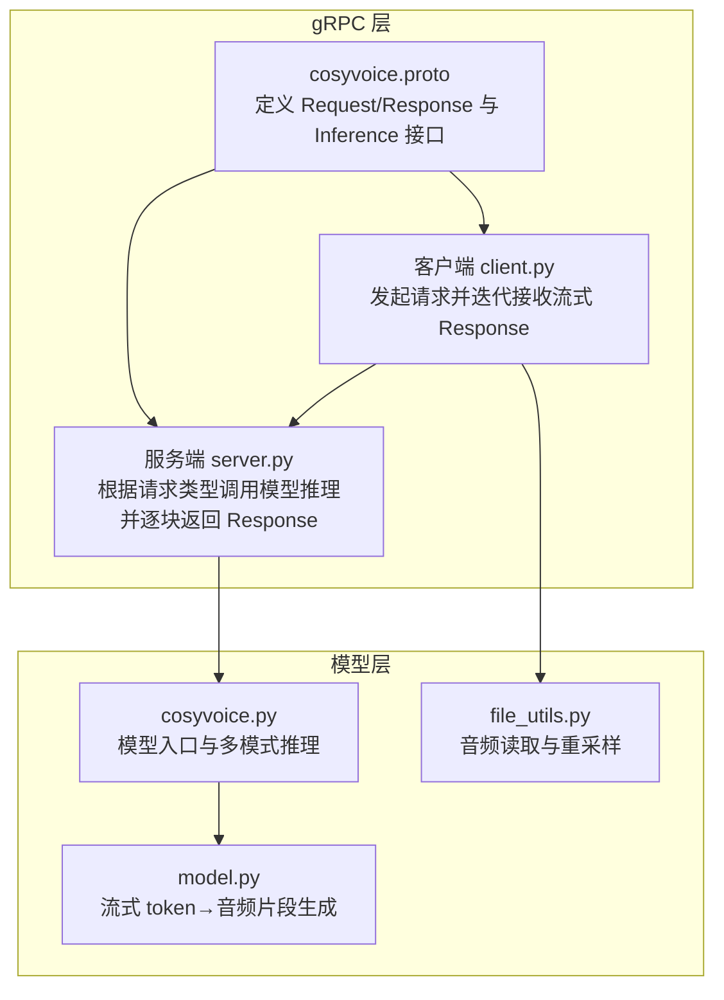
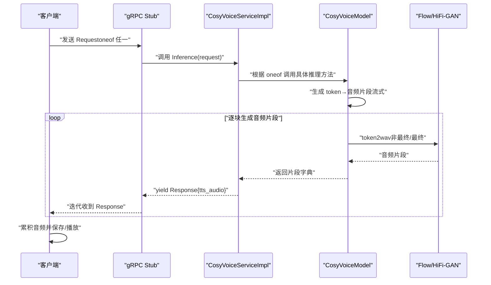
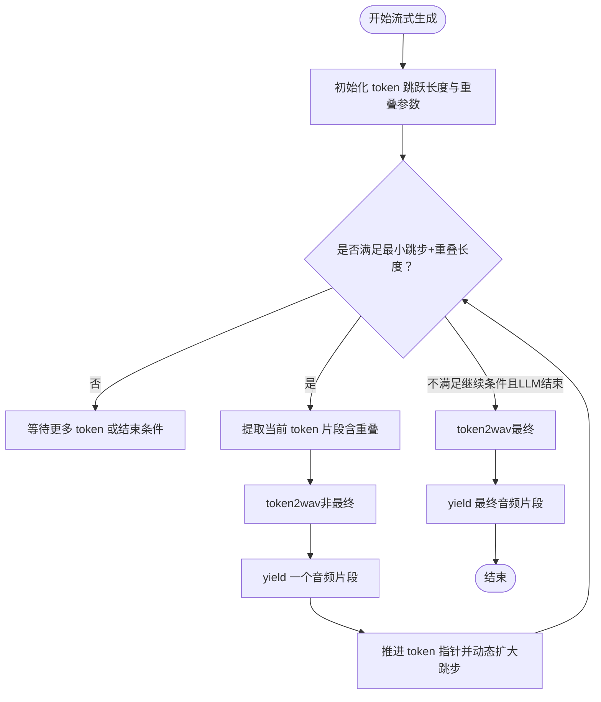
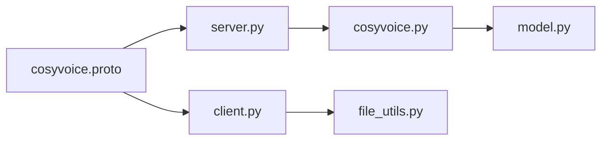

# 流式响应处理

<cite>
**本文引用的文件**
- [cosyvoice.proto](file://runtime/python/grpc/cosyvoice.proto)
- [grpc 客户端](file://runtime/python/grpc/client.py)
- [grpc 服务端](file://runtime/python/grpc/server.py)
- [cosyvoice 模型接口](file://cosyvoice/cli/cosyvoice.py)
- [cosyvoice 模型实现](file://cosyvoice/cli/model.py)
- [音频文件工具](file://cosyvoice/utils/file_utils.py)
</cite>

## 目录
1. [简介](#简介)
2. [项目结构](#项目结构)
3. [核心组件](#核心组件)
4. [架构总览](#架构总览)
5. [详细组件分析](#详细组件分析)
6. [依赖关系分析](#依赖关系分析)
7. [性能考量](#性能考量)
8. [故障排查指南](#故障排查指南)
9. [结论](#结论)
10. [附录](#附录)

## 简介
本文件围绕 gRPC API 的流式音频响应进行深入解析，重点基于 proto 中的 Response 消息与 stream Response 的返回类型，阐述服务器如何将生成的音频以“分块”的形式持续发送给客户端，并说明该设计在低延迟语音合成方面的优势。同时提供 Python 客户端示例思路与最佳实践，包括流式连接建立、迭代接收音频块、实时播放与保存、流控与缓冲策略、连接中断恢复、错误码处理以及性能优化建议（如缓冲区管理）。

## 项目结构
本项目的 gRPC 流式音频合成相关代码主要分布在以下位置：
- 协议定义：runtime/python/grpc/cosyvoice.proto
- gRPC 客户端：runtime/python/grpc/client.py
- gRPC 服务端：runtime/python/grpc/server.py
- 模型推理入口与流式生成：cosyvoice/cli/cosyvoice.py、cosyvoice/cli/model.py
- 音频文件读取工具：cosyvoice/utils/file_utils.py

图表来源
- [cosyvoice.proto](file://runtime/python/grpc/cosyvoice.proto#L1-L43)
- [grpc 客户端](file://runtime/python/grpc/client.py#L1-L107)
- [grpc 服务端](file://runtime/python/grpc/server.py#L1-L97)
- [cosyvoice 模型接口](file://cosyvoice/cli/cosyvoice.py#L1-L200)
- [cosyvoice 模型实现](file://cosyvoice/cli/model.py#L1-L200)
- [音频文件工具](file://cosyvoice/utils/file_utils.py#L1-L119)

章节来源
- [cosyvoice.proto](file://runtime/python/grpc/cosyvoice.proto#L1-L43)
- [grpc 客户端](file://runtime/python/grpc/client.py#L1-L107)
- [grpc 服务端](file://runtime/python/grpc/server.py#L1-L97)
- [cosyvoice 模型接口](file://cosyvoice/cli/cosyvoice.py#L1-L200)
- [cosyvoice 模型实现](file://cosyvoice/cli/model.py#L1-L200)
- [音频文件工具](file://cosyvoice/utils/file_utils.py#L1-L119)

## 核心组件
- gRPC 协议与消息
  - Request：包含多类 oneof 请求体（sft、zero_shot、crosslingual、instruct），用于选择不同的推理模式。
  - Response：包含 bytes 字段 tts_audio，承载每一块音频数据。
  - Inference：返回 stream Response，表示服务端将多次发送 Response，形成流式传输。
- 服务端实现
  - 解析 Request 的 oneof 字段，调用对应推理方法；随后将模型输出的音频片段逐块封装为 Response 并 yield。
- 客户端实现
  - 发送 Request 后，以迭代方式遍历返回的 Response 流，累积音频数据，最终保存为音频文件。

章节来源
- [cosyvoice.proto](file://runtime/python/grpc/cosyvoice.proto#L1-L43)
- [grpc 服务端](file://runtime/python/grpc/server.py#L45-L72)
- [grpc 客户端](file://runtime/python/grpc/client.py#L30-L71)

## 架构总览
下图展示了从客户端到服务端再到模型层的整体流程，以及流式 Response 的产生与消费路径。

图表来源
- [grpc 服务端](file://runtime/python/grpc/server.py#L45-L72)
- [cosyvoice 模型实现](file://cosyvoice/cli/model.py#L280-L355)
- [cosyvoice 模型实现](file://cosyvoice/cli/model.py#L438-L482)
- [grpc 客户端](file://runtime/python/grpc/client.py#L30-L71)

## 详细组件分析

### gRPC 协议与消息
- Request.oneof：支持四种推理模式，分别携带不同的输入字段，便于服务端分流处理。
- Response.tts_audio：每块音频数据以二进制形式传输，客户端按块累积。
- Inference 返回类型：stream Response，表示服务端将多次返回 Response，形成持续的数据流。

章节来源
- [cosyvoice.proto](file://runtime/python/grpc/cosyvoice.proto#L1-L43)

### 服务端实现（流式生成）
- 服务端根据 Request 的 oneof 字段选择推理分支，将提示音频解码为张量后传入模型。
- 模型推理采用流式生成，服务端逐块将音频片段封装为 Response 并 yield，从而实现边生成边传输。
- 服务端通过 gRPC 的 server-side streaming 机制，将多个 Response 串接为一个流。

章节来源
- [grpc 服务端](file://runtime/python/grpc/server.py#L45-L72)

### 客户端实现（流式消费）
- 客户端使用 insecure_channel 建立连接，构造 Request（oneof 任一），调用 Inference。
- 通过迭代 Response 流，将每块 Response.tts_audio 累积为完整音频，再保存为文件。

章节来源
- [grpc 客户端](file://runtime/python/grpc/client.py#L30-L71)

### 模型层（流式 token→音频片段）
- 流式生成的核心在于“token 跳跃长度”与“重叠缓存”，以保证拼接平滑与实时性。
- 关键参数与行为：
  - token_min_hop_len、token_max_hop_len：控制每次处理的 token 数量范围，动态调整以平衡延迟与质量。
  - token_overlap_len：相邻片段之间的重叠长度，用于后续 fade 拼接。
  - mel_overlap_len、speech_window、source_cache_len：用于频谱与波形的重叠缓存与平滑过渡。
  - token2wav：将 token 转换为音频片段；finalize=False 表示中间片段，finalize=True 表示最终收尾。
- 生成流程要点：
  - 在流式模式下，当缓存的 token 达到一定阈值时，提取一段 token 进行转换，yield 一个音频片段。
  - 逐步推进 token 指针，动态扩大跳步长度，直至剩余 token 不足以继续生成，再进行最终处理。

图表来源
- [cosyvoice 模型实现](file://cosyvoice/cli/model.py#L280-L355)
- [cosyvoice 模型实现](file://cosyvoice/cli/model.py#L438-L482)

章节来源
- [cosyvoice 模型实现](file://cosyvoice/cli/model.py#L280-L355)
- [cosyvoice 模型实现](file://cosyvoice/cli/model.py#L438-L482)

### 模型入口与多模式推理
- 模型入口提供多种推理模式（SFT、Zero-shot、Cross-lingual、Instruct），均支持 stream 参数以启用流式生成。
- 入口会将文本切分为若干片段，逐段调用模型的 tts 流式生成器，实现边生成边返回。

章节来源
- [cosyvoice 模型接口](file://cosyvoice/cli/cosyvoice.py#L121-L200)

### 音频文件读取与重采样
- 客户端在 zero-shot/crosslingual 模式下需要读取提示音频，确保采样率一致后再打包进请求。
- 工具函数提供音频读取与重采样能力，保证输入一致性。

章节来源
- [音频文件工具](file://cosyvoice/utils/file_utils.py#L44-L51)

## 依赖关系分析
- 协议层与实现层解耦：proto 定义接口，客户端/服务端各自实现，便于扩展与替换。
- 服务端依赖模型层：根据 oneof 分发到不同推理分支，再将模型输出转为 Response。
- 客户端依赖协议与工具：构造 Request、迭代 Response、读取提示音频。

图表来源
- [cosyvoice.proto](file://runtime/python/grpc/cosyvoice.proto#L1-L43)
- [grpc 客户端](file://runtime/python/grpc/client.py#L1-L107)
- [grpc 服务端](file://runtime/python/grpc/server.py#L1-L97)
- [cosyvoice 模型接口](file://cosyvoice/cli/cosyvoice.py#L1-L200)
- [cosyvoice 模型实现](file://cosyvoice/cli/model.py#L1-L200)
- [音频文件工具](file://cosyvoice/utils/file_utils.py#L1-L119)

章节来源
- [cosyvoice.proto](file://runtime/python/grpc/cosyvoice.proto#L1-L43)
- [grpc 客户端](file://runtime/python/grpc/client.py#L1-L107)
- [grpc 服务端](file://runtime/python/grpc/server.py#L1-L97)
- [cosyvoice 模型接口](file://cosyvoice/cli/cosyvoice.py#L1-L200)
- [cosyvoice 模型实现](file://cosyvoice/cli/model.py#L1-L200)
- [音频文件工具](file://cosyvoice/utils/file_utils.py#L1-L119)

## 性能考量
- 低延迟优势
  - 流式传输允许客户端在首块音频到达后立即开始播放，显著降低首包延迟。
  - 服务端采用“token 跳跃+重叠”的策略，使生成与传输并行，减少等待时间。
- 缓冲与拼接
  - 使用重叠窗口与缓存（mel/source/speech）实现平滑拼接，避免断点突变。
  - 动态扩大跳步长度可在保证质量的前提下提升吞吐。
- GPU/并发
  - 服务端可通过最大并发 RPC 数限制资源占用，避免过载。
  - 模型侧可利用 FP16、JIT/TensorRT 等优化手段提升 RTF（实时因子）。
- I/O 与网络
  - 客户端应采用合适的累积策略，避免一次性累积过大导致内存压力。
  - 网络抖动时，建议在应用层做超时与重试策略（见“故障排查指南”）。

[本节为通用性能讨论，无需列出具体文件来源]

## 故障排查指南
- 连接与通道
  - 若连接失败，检查主机与端口配置，确认服务端已启动并监听相应地址。
  - 如需安全通道，应在客户端与服务端同时切换为 secure_channel。
- 流式消费
  - 客户端必须以迭代方式遍历 Response 流，否则可能阻塞或无法正确接收后续块。
  - 若中途退出循环，可能导致音频不完整，应确保完整累积后再保存。
- 错误码与异常
  - gRPC 层面可捕获 RPC 状态码与异常，结合日志定位问题（如未找到模型、参数不合法等）。
  - 服务端日志记录推理请求类型与耗时，有助于诊断性能瓶颈。
- 断线与恢复
  - 建议在应用层实现重试与超时控制；若网络中断，可重新建立连接并从头发起请求。
  - 对于长文本，可考虑分段请求以降低单次连接压力。
- 音频质量
  - 若出现断点或音质不稳定，检查重叠长度与缓存参数是否合理，必要时适当增大重叠或缓存长度。

章节来源
- [grpc 客户端](file://runtime/python/grpc/client.py#L30-L71)
- [grpc 服务端](file://runtime/python/grpc/server.py#L74-L81)

## 结论
通过 gRPC 的 server-side streaming 与模型层的流式 token→音频片段生成机制，系统实现了低延迟、高吞吐的语音合成服务。客户端可即时播放或保存音频，服务端在保证音质的前提下最大化实时性。配合合理的缓冲与拼接策略、并发与优化手段，可在生产环境中获得稳定可靠的体验。

[本节为总结性内容，无需列出具体文件来源]

## 附录

### Python 客户端示例思路（基于现有实现）
- 建立连接
  - 使用 insecure_channel 连接到服务端地址与端口。
- 构造请求
  - 根据模式选择 oneof 字段，填充相应参数；zero-shot/crosslingual 模式需读取提示音频并重采样至目标采样率。
- 流式消费
  - 调用 Inference 并迭代返回的 Response，累积每块 tts_audio。
- 实时播放/保存
  - 播放：在累积到足够长度后，使用音频库进行播放（例如边累积边播放）。
  - 保存：将累积的音频数据写入文件。
- 注意事项
  - 确保完整遍历 Response 流，避免截断。
  - 处理异常与超时，必要时重试。

章节来源
- [grpc 客户端](file://runtime/python/grpc/client.py#L30-L71)
- [音频文件工具](file://cosyvoice/utils/file_utils.py#L44-L51)

### 流控与缓冲策略
- 服务端
  - 控制最大并发 RPC 数，避免资源争用。
  - 依据 token 跳跃长度与重叠参数动态调整生成节奏。
- 客户端
  - 采用小块累积策略，避免一次性累积过多导致内存峰值。
  - 在播放场景中，维持最小缓冲阈值后再开始播放，减少卡顿。

[本节为通用建议，无需列出具体文件来源]