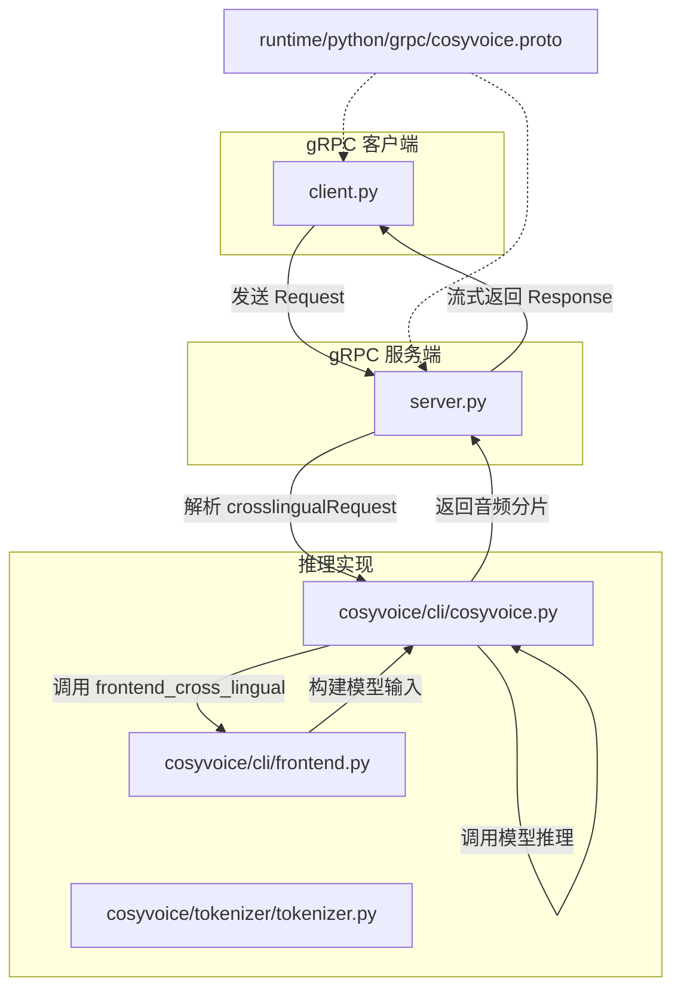
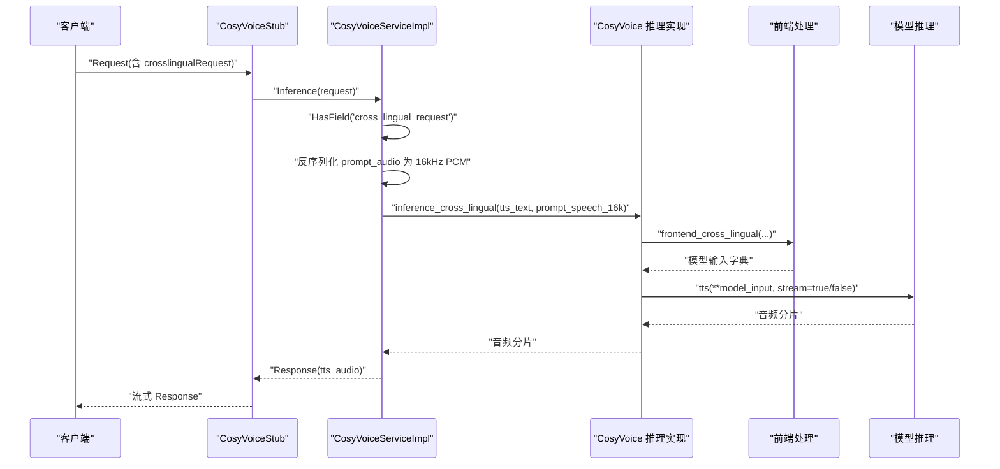
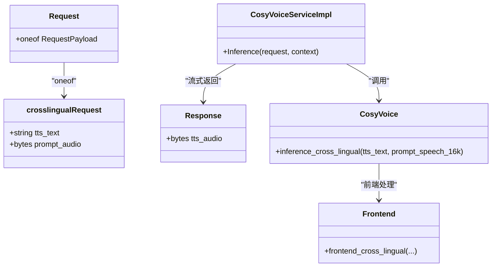

# 跨语言模式gRPC请求

<cite>
**本文引用的文件**
- [cosyvoice.proto](file://runtime/python/grpc/cosyvoice.proto)
- [client.py](file://runtime/python/grpc/client.py)
- [server.py](file://runtime/python/grpc/server.py)
- [cosyvoice.py](file://cosyvoice/cli/cosyvoice.py)
- [frontend.py](file://cosyvoice/cli/frontend.py)
- [tokenizer.py](file://cosyvoice/tokenizer/tokenizer.py)
- [example.py](file://example.py)
- [README.md](file://README.md)
</cite>

## 目录
1. [简介](#简介)
2. [项目结构](#项目结构)
3. [核心组件](#核心组件)
4. [架构总览](#架构总览)
5. [详细组件分析](#详细组件分析)
6. [依赖关系分析](#依赖关系分析)
7. [性能考量](#性能考量)
8. [故障排查指南](#故障排查指南)
9. [结论](#结论)
10. [附录](#附录)

## 简介
本文件面向使用 gRPC API 的开发者，系统性说明跨语言语音合成请求模式（crosslingualRequest）。围绕 proto 中的 crosslingualRequest 消息类型，重点解释 tts_text 与 prompt_audio 字段的作用，并强调该模式支持“文本语言与提示音频语言不同”的能力。文档还覆盖语音翻译与多语言内容生成的应用场景、请求构造要点（尤其是 prompt_audio 的二进制封装）、限制条件、预期延迟以及与零样本模式的区别。

## 项目结构
- gRPC 协议定义位于 runtime/python/grpc/cosyvoice.proto，包含 Request 与 crosslingualRequest 等消息类型。
- 客户端与服务端分别位于 runtime/python/grpc/client.py 与 runtime/python/grpc/server.py。
- 业务逻辑在 CosyVoice 推理层实现，跨语言模式由 cosyvoice/cli/cosyvoice.py 与 frontend.py 提供前端处理与调用入口。
- 示例与说明可在 example.py 与 README.md 中找到。

图表来源
- [cosyvoice.proto](file://runtime/python/grpc/cosyvoice.proto#L1-L43)
- [client.py](file://runtime/python/grpc/client.py#L30-L71)
- [server.py](file://runtime/python/grpc/server.py#L45-L71)
- [cosyvoice.py](file://cosyvoice/cli/cosyvoice.py#L178-L203)
- [frontend.py](file://cosyvoice/cli/frontend.py#L311-L330)

章节来源
- [cosyvoice.proto](file://runtime/python/grpc/cosyvoice.proto#L1-L43)
- [client.py](file://runtime/python/grpc/client.py#L30-L71)
- [server.py](file://runtime/python/grpc/server.py#L45-L71)
- [cosyvoice.py](file://cosyvoice/cli/cosyvoice.py#L178-L203)
- [frontend.py](file://cosyvoice/cli/frontend.py#L311-L330)

## 核心组件
- crosslingualRequest 消息：包含 tts_text 与 prompt_audio 两个字段，用于跨语言语音合成。
- Request.oneof：统一承载多种请求类型，包括 crosslingualRequest。
- Response：流式返回合成音频的二进制片段。

关键字段说明
- tts_text：待合成的文本内容，可为目标语言文本。
- prompt_audio：提示音频的二进制 PCM 数据（16kHz，16位整数），用于提供说话人特征与语言风格。

章节来源
- [cosyvoice.proto](file://runtime/python/grpc/cosyvoice.proto#L10-L43)

## 架构总览
下图展示跨语言模式从 gRPC 请求到音频输出的完整链路。

图表来源
- [client.py](file://runtime/python/grpc/client.py#L30-L71)
- [server.py](file://runtime/python/grpc/server.py#L45-L71)
- [cosyvoice.py](file://cosyvoice/cli/cosyvoice.py#L178-L203)
- [frontend.py](file://cosyvoice/cli/frontend.py#L311-L330)

## 详细组件分析

### crosslingualRequest 消息与字段语义
- tts_text：目标语言的待合成文本。该模式允许文本语言与提示音频语言不同，从而实现语音翻译与多语言内容生成。
- prompt_audio：提示音频的二进制 PCM 数据，要求采样率为 16kHz，量化格式为 16 位整数（客户端与服务端均按此格式处理）。

章节来源
- [cosyvoice.proto](file://runtime/python/grpc/cosyvoice.proto#L30-L33)
- [server.py](file://runtime/python/grpc/server.py#L56-L60)

### 客户端请求构造要点
- 选择模式：当 mode 为 cross_lingual 时，客户端构造 crosslingualRequest。
- prompt_audio 二进制封装：
  - 读取提示音频文件并重采样至 16kHz。
  - 将波形数组乘以 2^15 并转换为 int16 后转为 bytes，作为 prompt_audio 字段值。
- 发送请求后，客户端循环接收 Response 流，拼接为完整的音频并保存。

章节来源
- [client.py](file://runtime/python/grpc/client.py#L48-L54)

### 服务端解析与推理流程
- 服务端根据 HasField 判断请求类型，进入 cross_lingual 分支。
- 将 bytes prompt_audio 反序列化为 16kHz PCM（int16），再归一化为浮点张量。
- 调用 CosyVoice.inference_cross_lingual，传入 tts_text 与提示语音张量。
- 将模型输出的音频分片转换回 int16 的 bytes，逐片返回给客户端。

章节来源
- [server.py](file://runtime/python/grpc/server.py#L45-L71)

### 前端与模型集成
- frontend_cross_lingual 会复用零样本前端流程，但移除 LLM 层的提示文本相关字段，仅保留提示语音特征，从而聚焦跨语言合成。
- 推理实现 inference_cross_lingual 对 tts_text 进行规范化与切分，逐段调用模型进行流式合成。

章节来源
- [frontend.py](file://cosyvoice/cli/frontend.py#L311-L330)
- [cosyvoice.py](file://cosyvoice/cli/cosyvoice.py#L178-L203)

### 与零样本模式的差异
- 零样本模式（zeroshotRequest）需要同时提供 tts_text 与 prompt_text，且会在 LLM 层融合提示文本与目标文本。
- 跨语言模式（crosslingualRequest）仅需 tts_text 与 prompt_audio，不使用 prompt_text；前端会移除 LLM 层的提示文本相关字段，使合成更侧重于提示语音的语言风格与说话人特征。

章节来源
- [cosyvoice.proto](file://runtime/python/grpc/cosyvoice.proto#L24-L28)
- [frontend.py](file://cosyvoice/cli/frontend.py#L311-L330)

### 应用场景
- 语音翻译：使用一种语言的提示音频，合成另一种语言的文本内容。
- 多语言内容生成：在保持说话人与风格一致的前提下，将不同语言的文本转换为语音输出。
- 语言切换演示：在同一说话人上快速切换语言风格，便于产品演示与测试。

章节来源
- [README.md](file://README.md#L11-L21)
- [example.py](file://example.py#L17-L24)

## 依赖关系分析
- 协议层：cosyvoice.proto 定义 Request 与 crosslingualRequest。
- 客户端：client.py 使用 proto 生成的 stub 发送请求，构造 crosslingualRequest。
- 服务端：server.py 解析请求，调用 CosyVoice 推理实现。
- 推理层：cosyvoice.py 提供 inference_cross_lingual；frontend.py 提供 frontend_cross_lingual；tokenizer.py 提供多语言分词与编码支持。

图表来源
- [cosyvoice.proto](file://runtime/python/grpc/cosyvoice.proto#L10-L43)
- [server.py](file://runtime/python/grpc/server.py#L45-L71)
- [cosyvoice.py](file://cosyvoice/cli/cosyvoice.py#L178-L203)
- [frontend.py](file://cosyvoice/cli/frontend.py#L311-L330)

章节来源
- [cosyvoice.proto](file://runtime/python/grpc/cosyvoice.proto#L10-L43)
- [server.py](file://runtime/python/grpc/server.py#L45-L71)
- [cosyvoice.py](file://cosyvoice/cli/cosyvoice.py#L178-L203)
- [frontend.py](file://cosyvoice/cli/frontend.py#L311-L330)

## 性能考量
- 流式输出：服务端按模型输出的音频分片逐片返回，客户端可边接收边播放，降低首包延迟。
- 采样率与量化：提示音频必须为 16kHz、16 位整数 PCM，避免额外重采样与格式转换开销。
- 文本前端：跨语言模式仍会进行文本规范化与切分，建议控制单段文本长度以减少上下文拼接成本。
- 服务器并发：最大并发可通过参数配置，合理设置可提升吞吐。

章节来源
- [server.py](file://runtime/python/grpc/server.py#L68-L71)
- [client.py](file://runtime/python/grpc/client.py#L63-L69)
- [README.md](file://README.md#L11-L21)

## 故障排查指南
- 提示音频格式错误
  - 症状：合成异常或报错。
  - 排查：确认 prompt_audio 为 16kHz、16 位整数 PCM；客户端应按 int16 归一化后再发送。
- 文本语言与提示音频语言不匹配
  - 症状：合成语音口音或韵律不符合预期。
  - 排查：确保提示音频语言与期望的说话人风格一致；跨语言模式不依赖 prompt_text，仅依赖提示语音。
- 采样率不一致
  - 症状：音频失真或速度异常。
  - 排查：客户端与服务端均按 16kHz 处理，务必在发送前重采样。
- 服务器并发不足
  - 症状：请求排队或超时。
  - 排查：适当提高最大并发参数，评估硬件资源。

章节来源
- [server.py](file://runtime/python/grpc/server.py#L56-L60)
- [client.py](file://runtime/python/grpc/client.py#L48-L54)

## 结论
跨语言模式通过 crosslingualRequest 实现“文本语言与提示音频语言不同”的语音合成能力，适用于语音翻译与多语言内容生成等场景。其核心在于 prompt_audio 的正确封装（16kHz、16 位整数 PCM）与服务端的流式处理。相较零样本模式，跨语言模式不使用 prompt_text，前端移除了 LLM 层的文本提示，更专注于提示语音的语言风格与说话人特征。在工程实践中，建议严格遵循采样率与量化规范，合理控制文本长度与并发配置，以获得稳定且低延迟的合成效果。

## 附录

### 请求构造步骤（跨语言模式）
- 选择模式：mode=cross_lingual
- 读取提示音频并重采样至 16kHz
- 将波形数组转换为 16 位整数 PCM 的二进制数据
- 设置 crosslingualRequest.tts_text 与 crosslingualRequest.prompt_audio
- 发送请求并接收流式 Response

章节来源
- [client.py](file://runtime/python/grpc/client.py#L48-L54)

### 代码片段路径参考
- 客户端构造 crosslingualRequest
  - [client.py](file://runtime/python/grpc/client.py#L48-L54)
- 服务端解析与调用
  - [server.py](file://runtime/python/grpc/server.py#L56-L60)
- 推理实现入口
  - [cosyvoice.py](file://cosyvoice/cli/cosyvoice.py#L178-L203)
- 前端处理逻辑
  - [frontend.py](file://cosyvoice/cli/frontend.py#L311-L330)
- 协议定义
  - [cosyvoice.proto](file://runtime/python/grpc/cosyvoice.proto#L30-L33)