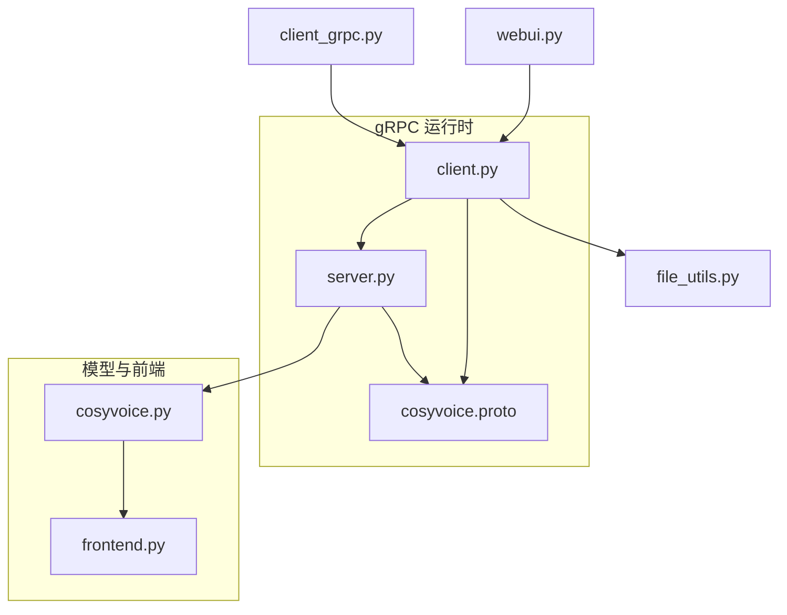
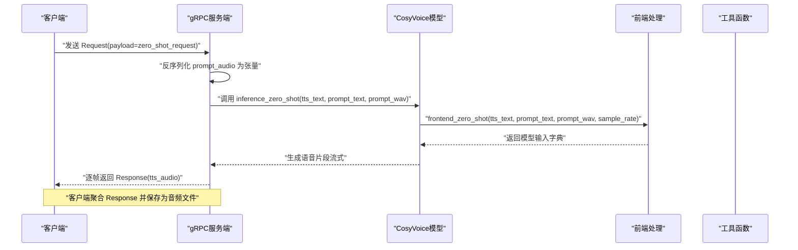
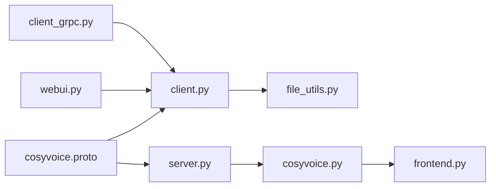

# 零样本模式gRPC请求

<cite>
**本文引用的文件**
- [cosyvoice.proto](file://runtime/python/grpc/cosyvoice.proto)
- [client.py](file://runtime/python/grpc/client.py)
- [server.py](file://runtime/python/grpc/server.py)
- [file_utils.py](file://cosyvoice/utils/file_utils.py)
- [frontend.py](file://cosyvoice/cli/frontend.py)
- [cosyvoice.py](file://cosyvoice/cli/cosyvoice.py)
- [webui.py](file://webui.py)
- [client_grpc.py](file://runtime/triton_trtllm/client_grpc.py)
</cite>

## 目录
1. [简介](#简介)
2. [项目结构](#项目结构)
3. [核心组件](#核心组件)
4. [架构总览](#架构总览)
5. [详细组件分析](#详细组件分析)
6. [依赖关系分析](#依赖关系分析)
7. [性能与质量考量](#性能与质量考量)
8. [故障排查指南](#故障排查指南)
9. [结论](#结论)
10. [附录：完整客户端实现步骤](#附录完整客户端实现步骤)

## 简介
本文件围绕 gRPC API 的“零样本语音克隆”请求进行系统化说明，聚焦于 proto 中的 zeroshotRequest 消息类型，重点解释以下内容：
- 字段作用：tts_text、prompt_text、prompt_audio 的职责与交互方式
- prompt_audio 的音频格式要求：采样率、量化位宽、编码格式
- 零样本克隆原理：如何仅凭一段提示音频即可克隆新音色
- 完整客户端实现示例：音频读取、二进制序列化、流式响应处理
- 常见问题：音频质量影响、超时处理、数据大小限制

## 项目结构
与零样本 gRPC 请求直接相关的核心文件如下：
- 协议定义：runtime/python/grpc/cosyvoice.proto
- 客户端：runtime/python/grpc/client.py
- 服务端：runtime/python/grpc/server.py
- 工具函数：cosyvoice/utils/file_utils.py
- 模型前端与推理：cosyvoice/cli/frontend.py、cosyvoice/cli/cosyvoice.py
- WebUI 示例：webui.py
- Triton/TrtLLM 客户端（参考音频加载与采样率约束）：runtime/triton_trtllm/client_grpc.py

图表来源
- [cosyvoice.proto](file://runtime/python/grpc/cosyvoice.proto#L1-L43)
- [client.py](file://runtime/python/grpc/client.py#L1-L107)
- [server.py](file://runtime/python/grpc/server.py#L1-L97)
- [frontend.py](file://cosyvoice/cli/frontend.py#L258-L374)
- [cosyvoice.py](file://cosyvoice/cli/cosyvoice.py#L147-L176)
- [file_utils.py](file://cosyvoice/utils/file_utils.py#L44-L51)
- [webui.py](file://webui.py#L140-L177)
- [client_grpc.py](file://runtime/triton_trtllm/client_grpc.py#L340-L376)

章节来源
- [cosyvoice.proto](file://runtime/python/grpc/cosyvoice.proto#L1-L43)
- [client.py](file://runtime/python/grpc/client.py#L1-L107)
- [server.py](file://runtime/python/grpc/server.py#L1-L97)
- [frontend.py](file://cosyvoice/cli/frontend.py#L258-L374)
- [cosyvoice.py](file://cosyvoice/cli/cosyvoice.py#L147-L176)
- [file_utils.py](file://cosyvoice/utils/file_utils.py#L44-L51)
- [webui.py](file://webui.py#L140-L177)
- [client_grpc.py](file://runtime/triton_trtllm/client_grpc.py#L340-L376)

## 核心组件
- zeroshotRequest 消息：包含 tts_text、prompt_text、prompt_audio 三字段，用于零样本语音克隆
- 客户端：构造 Request.payload 为 zero_shot_request，填充三字段，并以流式方式接收 Response
- 服务端：解析 zero_shot_request，将 prompt_audio 反序列化为张量，调用模型的零样本推理接口
- 模型前端：负责将提示文本、提示音频与目标文本组合，生成模型所需的输入字典
- 工具函数：提供音频加载与重采样能力，确保输入符合模型要求

章节来源
- [cosyvoice.proto](file://runtime/python/grpc/cosyvoice.proto#L24-L28)
- [client.py](file://runtime/python/grpc/client.py#L30-L71)
- [server.py](file://runtime/python/grpc/server.py#L45-L72)
- [frontend.py](file://cosyvoice/cli/frontend.py#L258-L374)
- [cosyvoice.py](file://cosyvoice/cli/cosyvoice.py#L147-L176)
- [file_utils.py](file://cosyvoice/utils/file_utils.py#L44-L51)

## 架构总览
下图展示了零样本请求从客户端到服务端再到模型的端到端流程。

图表来源
- [client.py](file://runtime/python/grpc/client.py#L30-L71)
- [server.py](file://runtime/python/grpc/server.py#L45-L72)
- [cosyvoice.py](file://cosyvoice/cli/cosyvoice.py#L147-L176)
- [frontend.py](file://cosyvoice/cli/frontend.py#L258-L374)
- [file_utils.py](file://cosyvoice/utils/file_utils.py#L44-L51)

## 详细组件分析

### zeroshotRequest 字段详解
- tts_text：待合成的文本内容，服务端将其传入模型进行语音合成
- prompt_text：用于零样本场景的提示文本，描述或引导提示音频的内容，帮助模型理解说话风格与语义
- prompt_audio：提示音频的二进制数据，服务端将其解码为浮点张量，作为零样本建模的声纹与韵律参考

章节来源
- [cosyvoice.proto](file://runtime/python/grpc/cosyvoice.proto#L24-L28)

### prompt_audio 的音频格式要求
- 采样率：客户端与服务端均以 16kHz 为目标采样率；客户端在加载音频时强制重采样至 16kHz，服务端同样按 16kHz 处理
- 量化位宽：客户端将音频幅度缩放并转换为有符号 16 位整型数组，再转为 bytes；服务端将其还原为 float 张量
- 编码格式：proto 中声明为 bytes，未限定具体编码；但客户端与服务端约定使用 16kHz、单声道、16 位 PCM 的二进制表示
- 数据范围：客户端将归一化后的波形乘以 2^15 并截断为 int16，服务端再除以 2^15 恢复到 [-1, 1] 范围

章节来源
- [client.py](file://runtime/python/grpc/client.py#L45-L46)
- [server.py](file://runtime/python/grpc/server.py#L51-L52)
- [file_utils.py](file://cosyvoice/utils/file_utils.py#L44-L51)
- [client_grpc.py](file://runtime/triton_trtllm/client_grpc.py#L340-L356)

### 零样本克隆原理概述
- 文本层面：prompt_text 与 tts_text 经过文本前端处理，生成对应的 token 序列，用于语义对齐与上下文建模
- 声纹层面：prompt_wav（16kHz）经前端提取声学特征与语音 token，作为说话人嵌入与韵律参考
- 合成过程：模型根据 tts_text 与提示信息，逐步生成目标语音的声学表示，最终输出音频
- 流式输出：服务端以流式方式返回 Response，客户端可边收边播放或保存

章节来源
- [cosyvoice.py](file://cosyvoice/cli/cosyvoice.py#L147-L176)
- [frontend.py](file://cosyvoice/cli/frontend.py#L258-L374)

### 客户端实现要点
- 构造 Request：设置 payload 为 zero_shot_request，填充 tts_text、prompt_text、prompt_audio
- 音频读取与重采样：使用工具函数将提示音频加载并重采样到 16kHz
- 二进制序列化：将 numpy 数组按 int16 编码为 bytes
- 流式响应处理：遍历服务端返回的 Response，拼接二进制音频，再保存为目标采样率的音频文件

章节来源
- [client.py](file://runtime/python/grpc/client.py#L30-L71)
- [file_utils.py](file://cosyvoice/utils/file_utils.py#L44-L51)

### 服务端处理要点
- 解析请求：判断 payload 类型为 zero_shot_request
- 反序列化音频：将 bytes 按 int16 解码为张量，并转换为浮点与归一化
- 调用模型：将 tts_text、prompt_text、prompt_wav 传入模型零样本推理接口
- 流式返回：将模型输出的张量按 int16 编码为 bytes，逐帧返回 Response

章节来源
- [server.py](file://runtime/python/grpc/server.py#L45-L72)

### WebUI 与 Triton/TrtLLM 的参考行为
- WebUI：在克隆音色前检查提示音频采样率，若低于 16kHz 则给出警告
- Triton/TrtLLM：客户端明确断言目标采样率为 16kHz，且对非 16kHz 的输入进行重采样

章节来源
- [webui.py](file://webui.py#L140-L177)
- [client_grpc.py](file://runtime/triton_trtllm/client_grpc.py#L340-L356)

## 依赖关系分析
- proto 定义了 Request.oneof 与各请求消息类型，客户端与服务端均依赖该定义
- 客户端依赖工具函数进行音频加载与重采样
- 服务端依赖模型推理接口，模型推理依赖前端处理模块
- WebUI 与 Triton/TrtLLM 客户端提供了采样率与音频格式的约束参考

图表来源
- [cosyvoice.proto](file://runtime/python/grpc/cosyvoice.proto#L1-L43)
- [client.py](file://runtime/python/grpc/client.py#L1-L107)
- [server.py](file://runtime/python/grpc/server.py#L1-L97)
- [file_utils.py](file://cosyvoice/utils/file_utils.py#L44-L51)
- [cosyvoice.py](file://cosyvoice/cli/cosyvoice.py#L147-L176)
- [frontend.py](file://cosyvoice/cli/frontend.py#L258-L374)
- [webui.py](file://webui.py#L140-L177)
- [client_grpc.py](file://runtime/triton_trtllm/client_grpc.py#L340-L376)

## 性能与质量考量
- 音频质量对结果的影响
  - 采样率：必须为 16kHz，否则模型无法正确建模韵律与音色
  - 通道数：建议单声道，避免混响与双耳差异干扰
  - 信噪比：清晰、无噪声的提示音频更有利于音色克隆
  - 时长：提示音频不宜过短，建议覆盖至少 1–3 秒有效语音
- 文本长度：当 tts_text 明显短于 prompt_text 时，模型可能表现不佳，前端已给出警告
- 流式合成：服务端以流式方式返回音频，客户端应尽快消费，避免阻塞
- 资源占用：并发连接数与模型最大并发 RPC 数需合理配置，避免资源争用

章节来源
- [cosyvoice.py](file://cosyvoice/cli/cosyvoice.py#L165-L169)
- [server.py](file://runtime/python/grpc/server.py#L74-L81)
- [client_grpc.py](file://runtime/triton_trtllm/client_grpc.py#L340-L356)

## 故障排查指南
- 采样率不匹配
  - 症状：输出音质异常、音高漂移
  - 排查：确认提示音频被重采样到 16kHz；WebUI 与 Triton/TrtLLM 客户端均强调 16kHz
- 音频格式错误
  - 症状：服务端解码失败或数值溢出
  - 排查：确保 prompt_audio 为 16kHz、单声道、16 位 PCM 的二进制数据
- 文本过短
  - 症状：合成效果差
  - 排查：增大 tts_text 长度，使其与 prompt_text 保持合理比例
- 超时与数据大小
  - 症状：请求超时、内存不足
  - 排查：缩短提示音频时长、降低并发、调整服务端最大并发 RPC 数
- 并发与吞吐
  - 症状：延迟升高、队列堆积
  - 排查：减少并发连接数，优化客户端批量策略

章节来源
- [client.py](file://runtime/python/grpc/client.py#L45-L46)
- [server.py](file://runtime/python/grpc/server.py#L51-L52)
- [cosyvoice.py](file://cosyvoice/cli/cosyvoice.py#L165-L169)
- [webui.py](file://webui.py#L140-L177)
- [client_grpc.py](file://runtime/triton_trtllm/client_grpc.py#L340-L356)

## 结论
零样本 gRPC 请求通过简洁的三字段设计，实现了“仅凭一段提示音频即可克隆新音色”的能力。其关键在于：
- prompt_audio 必须为 16kHz、单声道、16 位 PCM 的二进制数据
- 服务端将 bytes 解码为浮点张量，结合 prompt_text 与 tts_text，由模型前端与推理模块完成音色克隆与语音合成
- 客户端采用流式响应，便于实时播放与保存

## 附录：完整客户端实现步骤
以下为基于仓库现有代码的实现步骤，不直接展示代码内容，仅给出路径与关键逻辑位置，便于对照实现。

- 步骤1：构造 gRPC 请求
  - 设置 payload 为 zero_shot_request，填充 tts_text、prompt_text、prompt_audio
  - 参考路径：[client.py](file://runtime/python/grpc/client.py#L30-L61)
- 步骤2：加载并重采样提示音频
  - 使用工具函数将音频加载并重采样到 16kHz
  - 参考路径：[file_utils.py](file://cosyvoice/utils/file_utils.py#L44-L51)
- 步骤3：二进制序列化
  - 将 numpy 数组按 int16 编码为 bytes
  - 参考路径：[client.py](file://runtime/python/grpc/client.py#L45-L46)
- 步骤4：发送请求并处理流式响应
  - 遍历服务端返回的 Response，拼接二进制音频
  - 参考路径：[client.py](file://runtime/python/grpc/client.py#L63-L71)
- 步骤5：保存音频
  - 将聚合后的音频按目标采样率保存为文件
  - 参考路径：[client.py](file://runtime/python/grpc/client.py#L63-L69)

章节来源
- [client.py](file://runtime/python/grpc/client.py#L30-L71)
- [file_utils.py](file://cosyvoice/utils/file_utils.py#L44-L51)