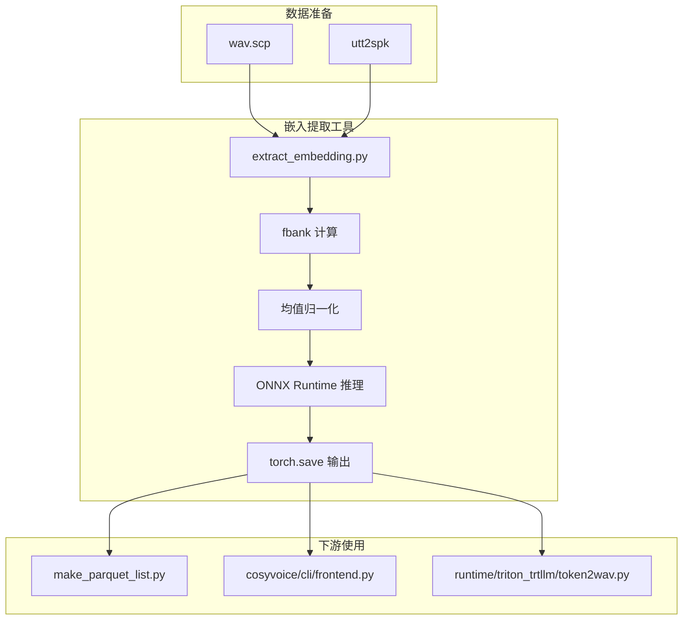
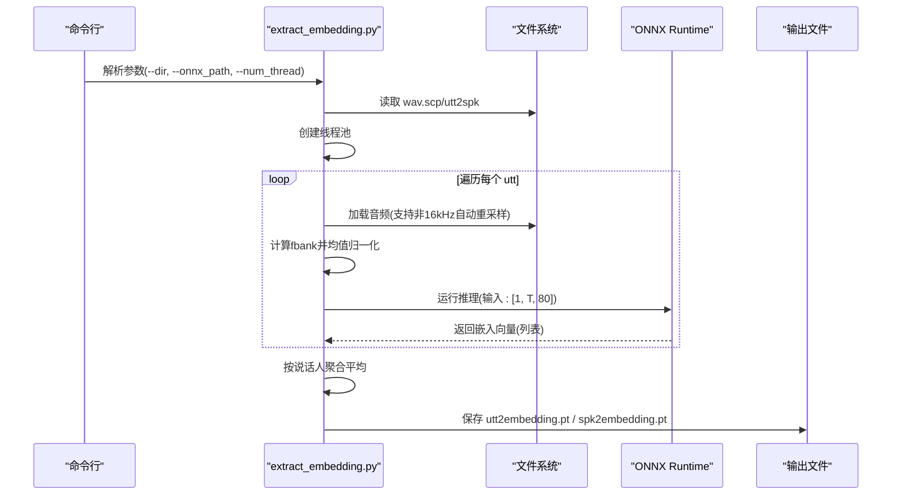
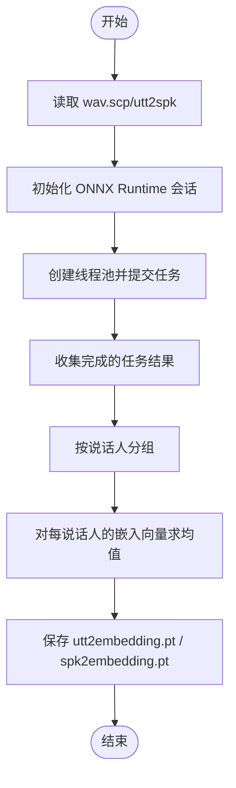
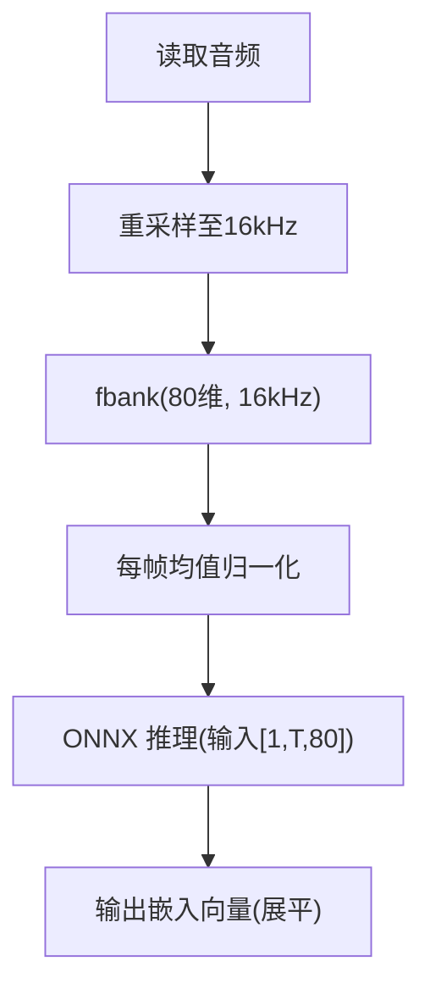
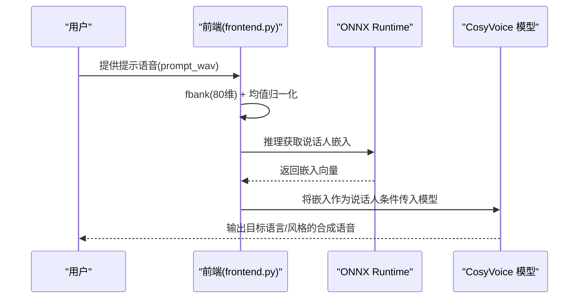
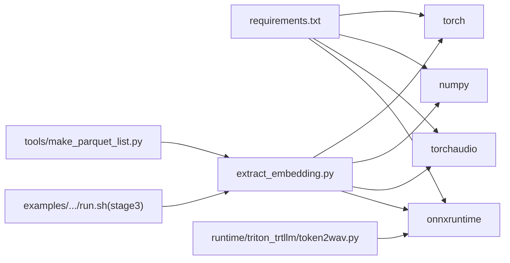

# 嵌入向量提取工具

<cite>
**本文引用的文件**
- [tools/extract_embedding.py](file://tools/extract_embedding.py)
- [cosyvoice/cli/frontend.py](file://cosyvoice/cli/frontend.py)
- [runtime/triton_trtllm/token2wav.py](file://runtime/triton_trtllm/token2wav.py)
- [examples/libritts/cosyvoice/run.sh](file://examples/libritts/cosyvoice/run.sh)
- [examples/libritts/cosyvoice2/run.sh](file://examples/libritts/cosyvoice2/run.sh)
- [examples/libritts/cosyvoice3/run.sh](file://examples/libritts/cosyvoice3/run.sh)
- [tools/make_parquet_list.py](file://tools/make_parquet_list.py)
- [requirements.txt](file://requirements.txt)
- [README.md](file://README.md)
</cite>

## 目录
1. [简介](#简介)
2. [项目结构](#项目结构)
3. [核心组件](#核心组件)
4. [架构总览](#架构总览)
5. [详细组件分析](#详细组件分析)
6. [依赖关系分析](#依赖关系分析)
7. [性能考量](#性能考量)
8. [故障排查指南](#故障排查指南)
9. [结论](#结论)
10. [附录](#附录)

## 简介
本文件面向“嵌入向量提取工具”（extract_embedding.py），系统性说明其功能、使用方法、命令行参数、数据格式、与 CosyVoice 系统的集成方式，以及在零样本语音克隆与说话人识别场景中的应用。文档同时给出调用流程图、关键实现点解析、常见问题排查建议，帮助读者快速理解并正确使用该工具。

## 项目结构
该工具位于 tools 目录下，主要负责：
- 读取 Kaldi 风格的数据清单（wav.scp、utt2spk）
- 对每条语音计算梅尔频谱（fbank）并标准化
- 使用 ONNX Runtime 推理预训练说话人嵌入模型（CampPlus）
- 并行提取每条语音的嵌入向量，并按说话人聚合为说话人级嵌入
- 输出两个 PyTorch 张量文件：utt2embedding.pt 和 spk2embedding.pt

图表来源
- [tools/extract_embedding.py](file://tools/extract_embedding.py#L37-L77)
- [tools/make_parquet_list.py](file://tools/make_parquet_list.py#L89-L112)
- [cosyvoice/cli/frontend.py](file://cosyvoice/cli/frontend.py#L39-L63)
- [runtime/triton_trtllm/token2wav.py](file://runtime/triton_trtllm/token2wav.py#L104-L152)

章节来源
- [tools/extract_embedding.py](file://tools/extract_embedding.py#L37-L77)

## 核心组件
- 单任务函数：对单条语音执行加载、重采样、fbank 特征提取、均值归一化、ONNX 推理，返回 utt 与 embedding 列表。
- 主流程：并发提交多任务，收集结果，按说话人聚合平均得到说话人嵌入；分别保存 utt2embedding.pt 与 spk2embedding.pt。
- 命令行参数：
  - --dir：数据目录，包含 wav.scp、utt2spk、以及输出文件
  - --onnx_path：预训练说话人嵌入模型（CampPlus）的 ONNX 文件路径
  - --num_thread：线程池并发数，默认 8
- 数据格式要求：
  - wav.scp：每行“utt_id /path/to/audio.wav”
  - utt2spk：每行“utt_id spk_id”
  - 输出：utt2embedding.pt 与 spk2embedding.pt（PyTorch 张量文件）

章节来源
- [tools/extract_embedding.py](file://tools/extract_embedding.py#L24-L77)

## 架构总览
下面以序列图展示从命令行到输出文件的完整调用链路，映射到实际源码位置。

图表来源
- [tools/extract_embedding.py](file://tools/extract_embedding.py#L24-L77)

## 详细组件分析

### 组件A：嵌入提取主流程
- 功能要点
  - 读取 wav.scp 与 utt2spk，构建 utt2wav 与 utt2spk 映射
  - 初始化 ONNX Runtime 会话（CPUExecutionProvider，图优化开启）
  - 使用 ThreadPoolExecutor 并发执行 single_job
  - 收集结果后，按说话人聚合并求均值，得到 spk2embedding
  - 分别保存 utt2embedding.pt 与 spk2embedding.pt
- 关键实现路径
  - 参数解析与初始化：[tools/extract_embedding.py](file://tools/extract_embedding.py#L53-L77)
  - 主循环与聚合逻辑：[tools/extract_embedding.py](file://tools/extract_embedding.py#L37-L51)
  - 单任务函数：[tools/extract_embedding.py](file://tools/extract_embedding.py#L24-L36)

图表来源
- [tools/extract_embedding.py](file://tools/extract_embedding.py#L24-L77)

章节来源
- [tools/extract_embedding.py](file://tools/extract_embedding.py#L24-L77)

### 组件B：特征提取与推理
- 特征提取
  - 采样率统一至 16kHz（若非 16kHz 自动重采样）
  - 使用 Kaldi fbank 计算 80 维梅尔谱
  - 对每帧做均值归一化（减去每列均值）
- 推理
  - 将特征张量形状调整为 [1, T, 80]，喂入 ONNX 模型
  - 输出为展平的一维向量（列表形式）
- 与前端一致的特征处理
  - CosyVoice 前端同样使用 80 维 fbank 与均值归一化，确保与模型输入一致
  - Triton/TensorRT 路径中也保持相同输入维度（80）

图表来源
- [tools/extract_embedding.py](file://tools/extract_embedding.py#L24-L36)
- [cosyvoice/cli/frontend.py](file://cosyvoice/cli/frontend.py#L153-L172)
- [runtime/triton_trtllm/token2wav.py](file://runtime/triton_trtllm/token2wav.py#L127-L152)

章节来源
- [tools/extract_embedding.py](file://tools/extract_embedding.py#L24-L36)
- [cosyvoice/cli/frontend.py](file://cosyvoice/cli/frontend.py#L153-L172)
- [runtime/triton_trtllm/token2wav.py](file://runtime/triton_trtllm/token2wav.py#L127-L152)

### 组件C：与 CosyVoice 的集成与应用场景
- 零样本语音克隆
  - 在前端中，从提示语音提取嵌入向量作为说话人特征，用于零样本合成
  - 提取流程与本工具一致：fbank -> 归一化 -> ONNX 推理
- 说话人识别
  - 本工具输出的 spk2embedding.pt 可用于说话人识别/检索
  - 也可与离线 token 提取工具配合，形成完整的 parquet 数据集
- 跨语言合成与语音转换
  - 通过零样本嵌入，系统可在不同语言之间迁移说话人特征，实现跨语言合成与语音转换

图表来源
- [cosyvoice/cli/frontend.py](file://cosyvoice/cli/frontend.py#L153-L172)
- [README.md](file://README.md#L13-L21)

章节来源
- [cosyvoice/cli/frontend.py](file://cosyvoice/cli/frontend.py#L153-L172)
- [README.md](file://README.md#L13-L21)

## 依赖关系分析
- 外部库
  - onnxruntime：推理引擎（CPUExecutionProvider）
  - torchaudio：音频加载与重采样
  - torchaudio.compliance.kaldi：fbank 特征
  - numpy/torch：张量运算与保存
- 与训练/推理脚本的关系
  - LibriTTS 示例脚本在第 3 步会调用本工具生成 utt2embedding.pt 与 spk2embedding.pt，随后生成 parquet 数据
- 与运行时的关系
  - Triton/TensorRT 路径同样使用 CampPlus ONNX 模型提取说话人嵌入，输入维度一致（80）

图表来源
- [requirements.txt](file://requirements.txt#L1-L43)
- [tools/extract_embedding.py](file://tools/extract_embedding.py#L53-L77)
- [examples/libritts/cosyvoice/run.sh](file://examples/libritts/cosyvoice/run.sh#L35-L52)
- [tools/make_parquet_list.py](file://tools/make_parquet_list.py#L89-L112)
- [runtime/triton_trtllm/token2wav.py](file://runtime/triton_trtllm/token2wav.py#L104-L152)

章节来源
- [requirements.txt](file://requirements.txt#L1-L43)
- [examples/libritts/cosyvoice/run.sh](file://examples/libritts/cosyvoice/run.sh#L35-L52)
- [tools/make_parquet_list.py](file://tools/make_parquet_list.py#L89-L112)
- [runtime/triton_trtllm/token2wav.py](file://runtime/triton_trtllm/token2wav.py#L104-L152)

## 性能考量
- 并发策略
  - 使用 ThreadPoolExecutor 并行处理多条语音，可通过 --num_thread 调整线程数
  - ONNX Runtime 会话设置图优化级别为最高，CPUExecutionProvider
- I/O 与内存
  - 读取音频与 fbanks 为 CPU 密集型操作，建议在多核环境下提升 num_thread
  - 输出为 .pt 文件，便于后续直接加载
- 采样率与特征
  - 自动重采样至 16kHz，避免与模型输入不一致导致的性能或精度问题
  - fbank 维度固定为 80，保证与前端与运行时一致

章节来源
- [tools/extract_embedding.py](file://tools/extract_embedding.py#L53-L77)
- [cosyvoice/cli/frontend.py](file://cosyvoice/cli/frontend.py#L153-L172)
- [runtime/triton_trtllm/token2wav.py](file://runtime/triton_trtllm/token2wav.py#L127-L152)

## 故障排查指南
- 音频格式不支持
  - 现象：加载失败或采样率异常
  - 处理：确认音频可被 torchaudio.load 读取；若非 16kHz，工具会自动重采样
  - 参考：[tools/extract_embedding.py](file://tools/extract_embedding.py#L24-L36)
- 嵌入维度不匹配
  - 现象：下游模型报错或维度不一致
  - 处理：确保使用与前端一致的 80 维 fbank；确认 ONNX 模型为 CampPlus（192 维嵌入）
  - 参考：[cosyvoice/cli/frontend.py](file://cosyvoice/cli/frontend.py#L153-L172)、[runtime/triton_trtllm/token2wav.py](file://runtime/triton_trtllm/token2wav.py#L127-L152)
- 数据清单格式错误
  - 现象：无法读取 wav.scp 或 utt2spk
  - 处理：检查文件每行格式为“utt_id 路径”，且路径存在
  - 参考：[tools/extract_embedding.py](file://tools/extract_embedding.py#L60-L69)
- ONNX 模型路径错误
  - 现象：推理失败
  - 处理：确认 --onnx_path 指向正确的 CampPlus ONNX 文件
  - 参考：[tools/extract_embedding.py](file://tools/extract_embedding.py#L53-L77)
- 并发与资源限制
  - 现象：CPU 占用过高或内存不足
  - 处理：降低 --num_thread；确保系统具备足够内存
  - 参考：[tools/extract_embedding.py](file://tools/extract_embedding.py#L53-L77)

章节来源
- [tools/extract_embedding.py](file://tools/extract_embedding.py#L24-L77)
- [cosyvoice/cli/frontend.py](file://cosyvoice/cli/frontend.py#L153-L172)
- [runtime/triton_trtllm/token2wav.py](file://runtime/triton_trtllm/token2wav.py#L127-L152)

## 结论
extract_embedding.py 提供了高效、稳定的说话人嵌入向量提取能力，与 CosyVoice 的前端、运行时及数据管线无缝衔接。通过统一的 80 维 fbank 特征与 ONNX 推理，它既可用于零样本语音克隆，也可用于说话人识别与下游数据集构建。遵循本文的命令行参数、数据格式与故障排查建议，可稳定获得高质量的嵌入向量，支撑跨语言合成与语音转换等高级应用。

## 附录

### 命令行参数说明
- --dir：数据目录，需包含 wav.scp 与 utt2spk
- --onnx_path：CampPlus ONNX 模型路径
- --num_thread：并发线程数，默认 8

章节来源
- [tools/extract_embedding.py](file://tools/extract_embedding.py#L53-L77)

### 输出文件说明
- utt2embedding.pt：每条语音的嵌入向量（列表形式，可转为张量）
- spk2embedding.pt：按说话人聚合后的平均嵌入向量（列表形式）

章节来源
- [tools/extract_embedding.py](file://tools/extract_embedding.py#L37-L51)

### 与示例脚本的配合
- LibriTTS 示例脚本在 stage3 中调用本工具生成 utt2embedding.pt 与 spk2embedding.pt，再生成 parquet 数据
- 参考路径：
  - [examples/libritts/cosyvoice/run.sh](file://examples/libritts/cosyvoice/run.sh#L35-L52)
  - [examples/libritts/cosyvoice2/run.sh](file://examples/libritts/cosyvoice2/run.sh#L35-L52)
  - [examples/libritts/cosyvoice3/run.sh](file://examples/libritts/cosyvoice3/run.sh#L35-L53)
  - [tools/make_parquet_list.py](file://tools/make_parquet_list.py#L89-L112)