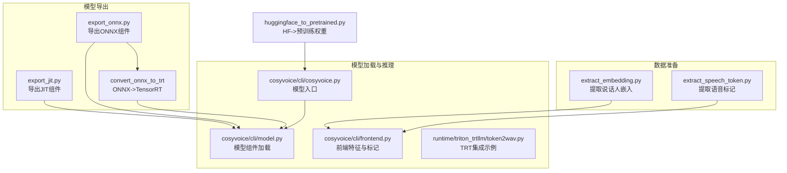
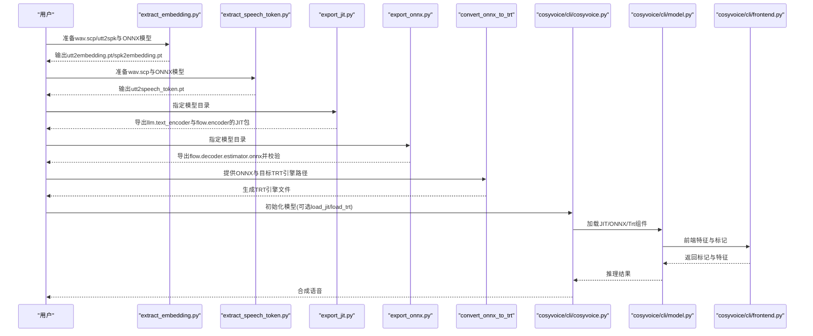
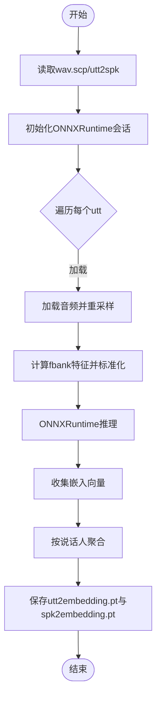
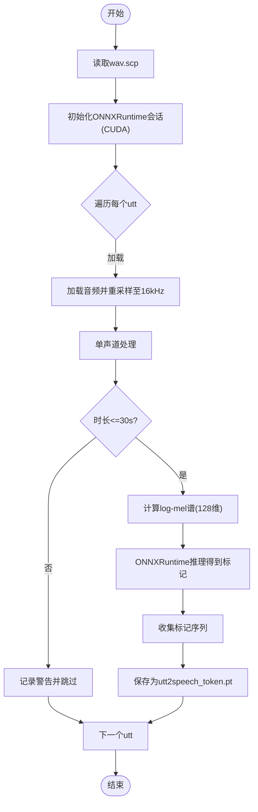
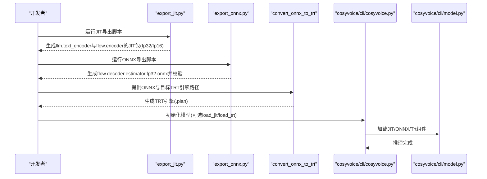
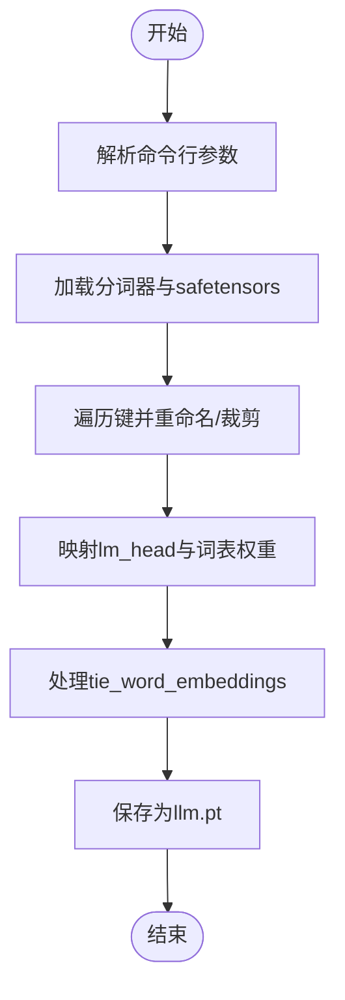
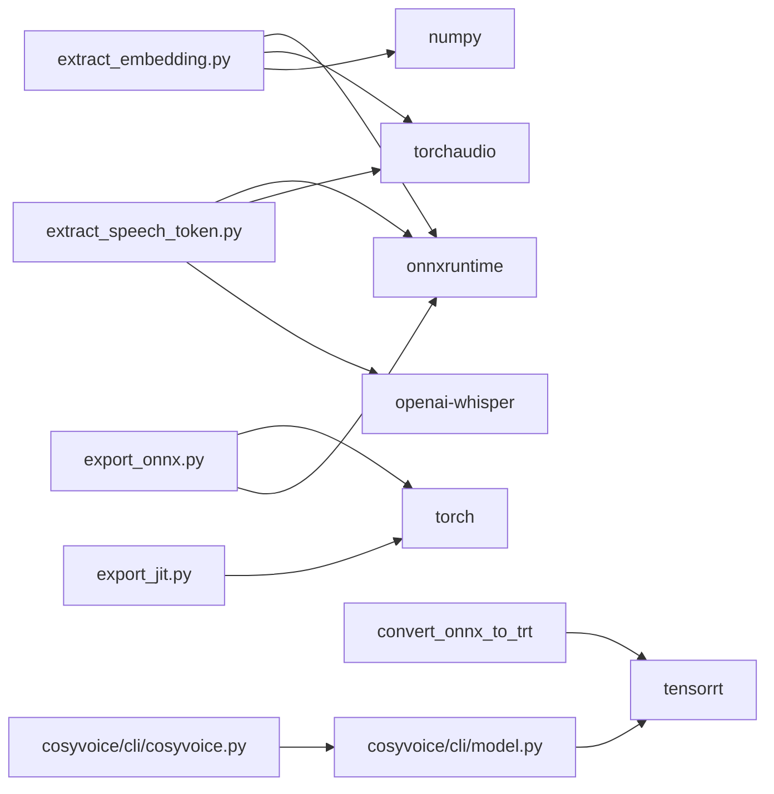

# 工具与实用程序

<cite>
**本文引用的文件**
- [tools/extract_embedding.py](file://tools/extract_embedding.py)
- [tools/extract_speech_token.py](file://tools/extract_speech_token.py)
- [cosyvoice/bin/export_jit.py](file://cosyvoice/bin/export_jit.py)
- [cosyvoice/bin/export_onnx.py](file://cosyvoice/bin/export_onnx.py)
- [examples/grpo/cosyvoice2/huggingface_to_pretrained.py](file://examples/grpo/cosyvoice2/huggingface_to_pretrained.py)
- [cosyvoice/cli/cosyvoice.py](file://cosyvoice/cli/cosyvoice.py)
- [cosyvoice/cli/model.py](file://cosyvoice/cli/model.py)
- [cosyvoice/cli/frontend.py](file://cosyvoice/cli/frontend.py)
- [runtime/triton_trtllm/token2wav.py](file://runtime/triton_trtllm/token2wav.py)
- [requirements.txt](file://requirements.txt)
</cite>

## 目录
1. [简介](#简介)
2. [项目结构](#项目结构)
3. [核心工具总览](#核心工具总览)
4. [架构概览](#架构概览)
5. [详细工具分析](#详细工具分析)
6. [依赖关系分析](#依赖关系分析)
7. [性能与部署考量](#性能与部署考量)
8. [故障排查指南](#故障排查指南)
9. [结论](#结论)

## 简介
本章节面向使用者与工程师，系统性文档化以下工具与实用程序：
- 说话人嵌入提取工具：从音频中提取说话人嵌入向量，便于说话人建模与检索。
- 语音标记提取工具：将音频转换为语音标记序列，用于下游分析与对齐。
- 模型导出工具：支持JIT脚本化导出与ONNX导出，并包含ONNX到TensorRT的转换流程与推理后端应用。
- HuggingFace格式到预训练权重的转换工具：将HuggingFace格式的CosyVoice2 LLM权重转换为项目内部使用的预训练权重格式。

## 项目结构
本仓库围绕“工具与实用程序”提供了多条数据准备与模型部署链路：
- 数据准备与特征提取：tools目录下的两个脚本分别负责说话人嵌入与语音标记的批量提取。
- 模型导出与部署：bin目录下的JIT与ONNX导出脚本，配合CLI模型加载逻辑与TRT集成实现高性能推理。
- 格式转换：examples目录下提供HuggingFace到预训练权重的转换脚本，便于迁移与复用外部模型权重。

图表来源
- [tools/extract_embedding.py](file://tools/extract_embedding.py#L1-L78)
- [tools/extract_speech_token.py](file://tools/extract_speech_token.py#L1-L73)
- [cosyvoice/bin/export_jit.py](file://cosyvoice/bin/export_jit.py#L1-L100)
- [cosyvoice/bin/export_onnx.py](file://cosyvoice/bin/export_onnx.py#L1-L115)
- [cosyvoice/cli/cosyvoice.py](file://cosyvoice/cli/cosyvoice.py#L1-L200)
- [cosyvoice/cli/model.py](file://cosyvoice/cli/model.py#L113-L144)
- [cosyvoice/cli/frontend.py](file://cosyvoice/cli/frontend.py#L131-L151)
- [runtime/triton_trtllm/token2wav.py](file://runtime/triton_trtllm/token2wav.py#L36-L71)
- [examples/grpo/cosyvoice2/huggingface_to_pretrained.py](file://examples/grpo/cosyvoice2/huggingface_to_pretrained.py#L1-L72)

章节来源
- [tools/extract_embedding.py](file://tools/extract_embedding.py#L1-L78)
- [tools/extract_speech_token.py](file://tools/extract_speech_token.py#L1-L73)
- [cosyvoice/bin/export_jit.py](file://cosyvoice/bin/export_jit.py#L1-L100)
- [cosyvoice/bin/export_onnx.py](file://cosyvoice/bin/export_onnx.py#L1-L115)
- [cosyvoice/cli/cosyvoice.py](file://cosyvoice/cli/cosyvoice.py#L1-L200)
- [cosyvoice/cli/model.py](file://cosyvoice/cli/model.py#L113-L144)
- [cosyvoice/cli/frontend.py](file://cosyvoice/cli/frontend.py#L131-L151)
- [runtime/triton_trtllm/token2wav.py](file://runtime/triton_trtllm/token2wav.py#L36-L71)
- [examples/grpo/cosyvoice2/huggingface_to_pretrained.py](file://examples/grpo/cosyvoice2/huggingface_to_pretrained.py#L1-L72)

## 核心工具总览
- 说话人嵌入提取工具：读取wav.scp与utt2spk，使用ONNXRuntime会话对fbank特征进行推理，得到每条语音的嵌入向量，并按说话人聚合均值，输出用户级与说话人级嵌入文件。
- 语音标记提取工具：读取wav.scp，对音频进行重采样与通道处理，计算log-mel谱，使用ONNXRuntime会话推理得到语音标记序列，输出每条语音的标记列表。
- 模型导出工具：
  - JIT导出：将LLM文本编码器、LLM主干、Flow编码器等组件分别导出fp32与fp16的JIT脚本包，便于离线部署与推理加速。
  - ONNX导出：导出Flow解码器估计器组件为ONNX，并进行一致性校验；同时提供ONNX到TensorRT的转换流程，以适配高吞吐GPU推理。
- HuggingFace到预训练权重：将HuggingFace格式的CosyVoice2 LLM权重映射到项目内部结构，生成llm.pt，便于直接加载。

章节来源
- [tools/extract_embedding.py](file://tools/extract_embedding.py#L1-L78)
- [tools/extract_speech_token.py](file://tools/extract_speech_token.py#L1-L73)
- [cosyvoice/bin/export_jit.py](file://cosyvoice/bin/export_jit.py#L1-L100)
- [cosyvoice/bin/export_onnx.py](file://cosyvoice/bin/export_onnx.py#L1-L115)
- [runtime/triton_trtllm/token2wav.py](file://runtime/triton_trtllm/token2wav.py#L36-L71)
- [examples/grpo/cosyvoice2/huggingface_to_pretrained.py](file://examples/grpo/cosyvoice2/huggingface_to_pretrained.py#L1-L72)

## 架构概览
下图展示从数据准备到模型部署的整体流程，包括工具间的数据传递与依赖关系。

图表来源
- [tools/extract_embedding.py](file://tools/extract_embedding.py#L1-L78)
- [tools/extract_speech_token.py](file://tools/extract_speech_token.py#L1-L73)
- [cosyvoice/bin/export_jit.py](file://cosyvoice/bin/export_jit.py#L1-L100)
- [cosyvoice/bin/export_onnx.py](file://cosyvoice/bin/export_onnx.py#L1-L115)
- [runtime/triton_trtllm/token2wav.py](file://runtime/triton_trtllm/token2wav.py#L36-L71)
- [cosyvoice/cli/cosyvoice.py](file://cosyvoice/cli/cosyvoice.py#L1-L200)
- [cosyvoice/cli/model.py](file://cosyvoice/cli/model.py#L113-L144)
- [cosyvoice/cli/frontend.py](file://cosyvoice/cli/frontend.py#L131-L151)

## 详细工具分析

### 说话人嵌入提取工具：extract_embedding.py
- 功能概述
  - 从Kaldi风格的wav.scp与utt2spk文件中读取音频路径与说话人标签。
  - 对音频进行重采样至16kHz，计算fbank特征并标准化，使用ONNXRuntime会话进行推理，得到每条语音的嵌入向量。
  - 将每条语音的嵌入向量按说话人聚合，计算说话人均值嵌入，输出用户级与说话人级嵌入文件。
- 关键流程
  - 读取配置：解析wav.scp与utt2spk，构建utt到wav与utt到spk的映射。
  - 初始化ONNXRuntime会话：设置图优化级别与执行提供者。
  - 单任务处理：加载音频、重采样、fbank特征、归一化、推理、收集结果。
  - 聚合与保存：按说话人聚合嵌入，保存为用户级与说话人级嵌入文件。
- 并发与性能
  - 使用线程池并发处理多条语音，提高整体吞吐。
  - ONNXRuntime提供CPU/GPU执行能力，可根据硬件选择执行提供者。
- 输出文件
  - 用户级嵌入：utt2embedding.pt
  - 说话人级嵌入：spk2embedding.pt

图表来源
- [tools/extract_embedding.py](file://tools/extract_embedding.py#L1-L78)

章节来源
- [tools/extract_embedding.py](file://tools/extract_embedding.py#L1-L78)

### 语音标记提取工具：extract_speech_token.py
- 功能概述
  - 从wav.scp读取音频路径，对音频进行重采样至16kHz与单声道处理。
  - 计算log-mel谱（128维），使用ONNXRuntime会话进行推理，得到语音标记序列。
  - 对超过30秒的音频给出警告并跳过处理，避免超长音频导致内存与时间开销过大。
  - 输出每条语音对应的标记列表文件。
- 关键流程
  - 读取wav.scp，构建utt到wav映射。
  - 初始化ONNXRuntime会话（默认使用CUDAExecutionProvider）。
  - 单任务处理：加载音频、重采样、单声道、log-mel谱、推理、收集标记。
  - 保存为utt2speech_token.pt。
- 并发与性能
  - 多线程并发处理，提升批处理效率。
  - 默认使用CUDAExecutionProvider，若无GPU则自动回退（由上层逻辑控制）。
- 输出文件
  - utt2speech_token.pt

图表来源
- [tools/extract_speech_token.py](file://tools/extract_speech_token.py#L1-L73)

章节来源
- [tools/extract_speech_token.py](file://tools/extract_speech_token.py#L1-L73)

### 模型导出工具：JIT与ONNX
- JIT导出（export_jit.py）
  - 目标：将LLM文本编码器、LLM主干、Flow编码器等组件导出为JIT脚本包，支持fp32与fp16两种精度。
  - 流程：初始化AutoModel，根据模型类型分支导出对应组件；对脚本进行freeze与optimize_for_inference优化；分别保存fp32与fp16版本。
  - 输出：各组件的fp32.zip与fp16.zip文件。
- ONNX导出（export_onnx.py）
  - 目标：导出Flow解码器估计器组件为ONNX，设置动态轴以支持变长序列；随后使用ONNXRuntime会话进行一致性校验。
  - 流程：构造dummy输入，调用torch.onnx.export导出；创建ONNXRuntime会话；随机生成多组输入进行数值一致性测试。
  - 输出：flow.decoder.estimator.fp32.onnx文件。
- ONNX到TensorRT转换（runtime/triton_trtllm/token2wav.py）
  - 目标：将ONNX模型转换为TensorRT引擎，支持FP16与动态batch配置，提升GPU推理吞吐。
  - 流程：创建builder、network与parser；设置优化配置与输入形状profile；构建序列化网络并保存引擎；在运行时按需加载与反序列化。
  - 输出：.plan引擎文件。

图表来源
- [cosyvoice/bin/export_jit.py](file://cosyvoice/bin/export_jit.py#L1-L100)
- [cosyvoice/bin/export_onnx.py](file://cosyvoice/bin/export_onnx.py#L1-L115)
- [runtime/triton_trtllm/token2wav.py](file://runtime/triton_trtllm/token2wav.py#L36-L71)
- [cosyvoice/cli/cosyvoice.py](file://cosyvoice/cli/cosyvoice.py#L1-L200)
- [cosyvoice/cli/model.py](file://cosyvoice/cli/model.py#L113-L144)

章节来源
- [cosyvoice/bin/export_jit.py](file://cosyvoice/bin/export_jit.py#L1-L100)
- [cosyvoice/bin/export_onnx.py](file://cosyvoice/bin/export_onnx.py#L1-L115)
- [runtime/triton_trtllm/token2wav.py](file://runtime/triton_trtllm/token2wav.py#L36-L71)
- [cosyvoice/cli/model.py](file://cosyvoice/cli/model.py#L113-L144)

### HuggingFace到预训练权重：huggingface_to_pretrained.py
- 功能概述
  - 将HuggingFace格式的CosyVoice2 LLM权重映射到项目内部结构，生成llm.pt文件，便于直接加载。
  - 处理lm_head与词表权重的映射，确保tie_word_embeddings策略一致。
- 关键流程
  - 解析命令行参数，加载分词器与safetensors权重。
  - 遍历safetensors键，重命名并裁剪相关权重，生成新的键空间。
  - 保存为llm.pt。
- 输出文件
  - llm.pt（内部权重字典）

图表来源
- [examples/grpo/cosyvoice2/huggingface_to_pretrained.py](file://examples/grpo/cosyvoice2/huggingface_to_pretrained.py#L1-L72)

章节来源
- [examples/grpo/cosyvoice2/huggingface_to_pretrained.py](file://examples/grpo/cosyvoice2/huggingface_to_pretrained.py#L1-L72)

## 依赖关系分析
- 工具与库依赖
  - ONNXRuntime：用于推理与一致性校验。
  - Torchaudio：音频加载与重采样。
  - Whisper：log-mel谱计算。
  - NumPy：数组操作。
  - 多线程：ThreadPoolExecutor并发处理。
  - TensorRT：ONNX到TRT转换与推理。
- 环境要求
  - requirements.txt中包含onnxruntime、onnxruntime-gpu、tensorrt-cu12等依赖，确保在Linux环境下可使用GPU执行提供者与TRT。

图表来源
- [tools/extract_embedding.py](file://tools/extract_embedding.py#L1-L78)
- [tools/extract_speech_token.py](file://tools/extract_speech_token.py#L1-L73)
- [cosyvoice/bin/export_jit.py](file://cosyvoice/bin/export_jit.py#L1-L100)
- [cosyvoice/bin/export_onnx.py](file://cosyvoice/bin/export_onnx.py#L1-L115)
- [runtime/triton_trtllm/token2wav.py](file://runtime/triton_trtllm/token2wav.py#L36-L71)
- [cosyvoice/cli/cosyvoice.py](file://cosyvoice/cli/cosyvoice.py#L1-L200)
- [cosyvoice/cli/model.py](file://cosyvoice/cli/model.py#L113-L144)
- [requirements.txt](file://requirements.txt#L1-L43)

章节来源
- [requirements.txt](file://requirements.txt#L1-L43)

## 性能与部署考量
- JIT导出
  - 冻结与优化：冻结静态图并进行inference优化，减少运行时开销。
  - 精度选择：fp16可显著降低显存占用并提升吞吐，但需注意数值稳定性。
- ONNX导出
  - 动态轴：设置序列长度动态轴，提升模型泛化能力。
  - 一致性校验：通过ONNXRuntime会话与PyTorch原实现对比，保证导出正确性。
- TensorRT集成
  - 动态batch与形状：根据实际业务设定min/opt/max形状与输入名称，提升吞吐与稳定性。
  - FP16与工作区：在满足精度前提下启用FP16与合理的工作区限制，平衡性能与资源。
- 前端标记与特征
  - 语音标记提取：前端在推理时同样使用log-mel谱与ONNXRuntime会话，确保与工具链一致。
  - 时长限制：前端对输入音频时长有上限约束，避免超长音频导致性能问题。

章节来源
- [cosyvoice/bin/export_jit.py](file://cosyvoice/bin/export_jit.py#L1-L100)
- [cosyvoice/bin/export_onnx.py](file://cosyvoice/bin/export_onnx.py#L1-L115)
- [runtime/triton_trtllm/token2wav.py](file://runtime/triton_trtllm/token2wav.py#L36-L71)
- [cosyvoice/cli/frontend.py](file://cosyvoice/cli/frontend.py#L131-L151)
- [cosyvoice/cli/model.py](file://cosyvoice/cli/model.py#L113-L144)

## 故障排查指南
- ONNXRuntime执行提供者
  - 若无GPU或驱动不匹配，ONNXRuntime可能无法使用CUDAExecutionProvider。建议检查环境变量与驱动版本，或在工具中回退到CPUExecutionProvider。
- TensorRT引擎加载失败
  - 确认ONNX模型解析成功且输入形状与profile一致；检查TRT引擎文件是否完整；确认运行时FP16与构建时一致。
- 音频时长与内存
  - 语音标记提取工具对超过30秒的音频给出警告并跳过；前端同样有限制，避免超长音频导致内存溢出。
- 权重映射错误
  - HuggingFace到预训练权重转换时，确保分词器特殊token索引与目标token大小一致；检查lm_head与embed_tokens的裁剪范围。

章节来源
- [tools/extract_speech_token.py](file://tools/extract_speech_token.py#L1-L73)
- [cosyvoice/cli/frontend.py](file://cosyvoice/cli/frontend.py#L131-L151)
- [runtime/triton_trtllm/token2wav.py](file://runtime/triton_trtllm/token2wav.py#L36-L71)
- [examples/grpo/cosyvoice2/huggingface_to_pretrained.py](file://examples/grpo/cosyvoice2/huggingface_to_pretrained.py#L1-L72)

## 结论
本文档系统性地梳理了工具与实用程序在说话人嵌入与语音标记提取、模型导出与部署方面的功能与使用方法。通过JIT与ONNX导出，结合ONNX到TensorRT的转换流程，可在不同推理后端（如TensorRT）实现高效部署。同时，HuggingFace到预训练权重的转换工具为模型迁移与复用提供了便利。建议在生产环境中优先采用ONNX+TRT方案以获得最佳吞吐与稳定性，并在部署前完成一致性校验与性能基准测试。