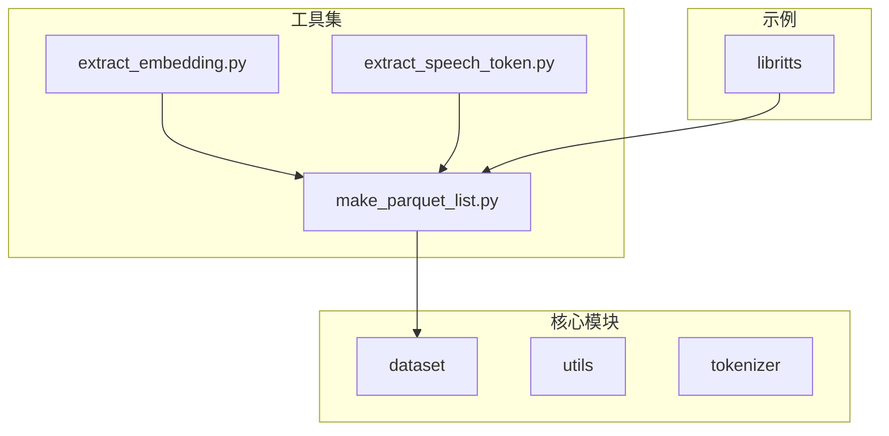
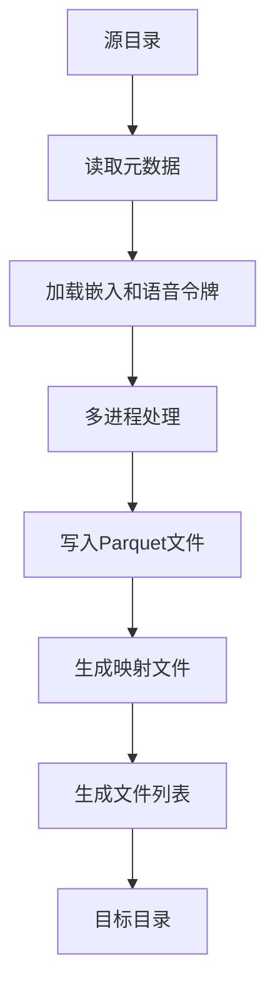
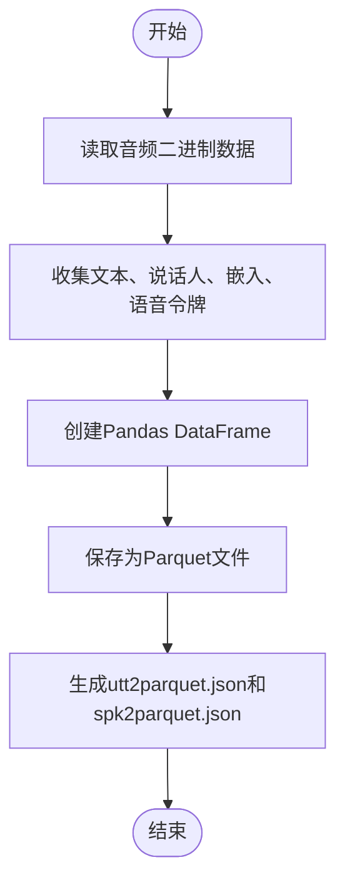
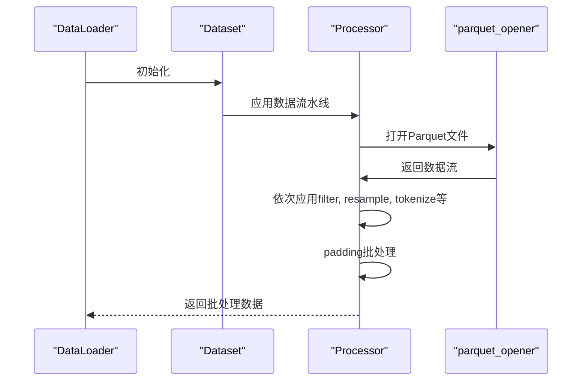
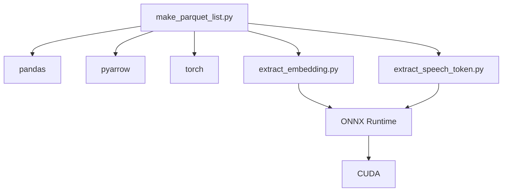

# Parquet数据集生成工具

<cite>
**本文档引用的文件**   
- [make_parquet_list.py](file://tools/make_parquet_list.py)
- [dataset.py](file://cosyvoice/dataset/dataset.py)
- [processor.py](file://cosyvoice/dataset/processor.py)
- [file_utils.py](file://cosyvoice/utils/file_utils.py)
- [extract_embedding.py](file://tools/extract_embedding.py)
- [extract_speech_token.py](file://tools/extract_speech_token.py)
- [tokenizer.py](file://cosyvoice/tokenizer/tokenizer.py)
- [train.py](file://cosyvoice/bin/train.py)
- [train_utils.py](file://cosyvoice/utils/train_utils.py)
- [executor.py](file://cosyvoice/utils/executor.py)
- [run.sh](file://examples/libritts/cosyvoice/run.sh)
</cite>

## 目录
1. [简介](#简介)
2. [项目结构](#项目结构)
3. [核心组件](#核心组件)
4. [架构概述](#架构概述)
5. [详细组件分析](#详细组件分析)
6. [依赖分析](#依赖分析)
7. [性能考虑](#性能考虑)
8. [故障排除指南](#故障排除指南)
9. [结论](#结论)

## 简介
`make_parquet_list.py`工具是CosyVoice项目中的关键数据预处理组件，用于将原始音频-文本对转换为高效存储的Parquet格式数据列表。该工具支持大规模数据集的快速加载与随机访问，通过列式存储、压缩效率和I/O吞吐提升，显著优化了训练流水线的性能。本文档详细说明该工具的实现机制与使用方法，包括其内部如何组织音频路径、文本标注、说话人ID等元数据字段，以及如何与`cosyvoice/dataset/dataset.py`中的Dataloader协同工作。

## 项目结构
CosyVoice项目采用模块化设计，主要包含`cosyvoice`核心模块、`examples`示例、`runtime`运行时环境、`third_party`第三方依赖和`tools`工具集。`make_parquet_list.py`位于`tools`目录下，作为数据预处理工具，与`cosyvoice/dataset`中的数据加载和处理模块紧密协作。

**图表来源**
- [make_parquet_list.py](file://tools/make_parquet_list.py)
- [dataset.py](file://cosyvoice/dataset/dataset.py)

**章节来源**
- [make_parquet_list.py](file://tools/make_parquet_list.py)
- [run.sh](file://examples/libritts/cosyvoice/run.sh)

## 核心组件
`make_parquet_list.py`工具的核心功能是将分散的音频、文本、说话人信息等元数据整合到高效的Parquet格式文件中。它通过多进程并行处理，显著提升了大规模数据集的转换速度。该工具与`cosyvoice/dataset/dataset.py`中的Dataloader协同工作，为训练过程提供优化的数据输入。

**章节来源**
- [make_parquet_list.py](file://tools/make_parquet_list.py)
- [dataset.py](file://cosyvoice/dataset/dataset.py)

## 架构概述
`make_parquet_list.py`工具的架构设计遵循高效、可扩展的原则。它首先从源目录读取`wav.scp`、`text`、`utt2spk`等元数据文件，然后加载`utt2embedding.pt`、`spk2embedding.pt`、`utt2speech_token.pt`等预计算的嵌入和语音令牌。通过多进程池，将数据分批处理并写入Parquet文件，同时生成`utt2parquet.json`和`spk2parquet.json`映射文件，最后汇总生成`data.list`文件列表。

**图表来源**
- [make_parquet_list.py](file://tools/make_parquet_list.py)

**章节来源**
- [make_parquet_list.py](file://tools/make_parquet_list.py)

## 详细组件分析

### make_parquet_list.py 工具分析
`make_parquet_list.py`工具通过`job`函数处理每个数据批次。它读取音频文件的二进制数据，收集文本、说话人、嵌入和语音令牌等信息，构建Pandas DataFrame，并将其保存为Parquet文件。同时，生成`utt2parquet.json`和`spk2parquet.json`映射文件，便于后续快速查找。

**图表来源**
- [make_parquet_list.py](file://tools/make_parquet_list.py#L26-L62)

**章节来源**
- [make_parquet_list.py](file://tools/make_parquet_list.py#L26-L62)

### 数据加载与处理分析
`cosyvoice/dataset/dataset.py`中的`Dataset`函数通过`DataList`和`Processor`类构建数据流水线。`parquet_opener`处理器使用PyArrow读取Parquet文件，`filter`、`resample`、`tokenize`等处理器依次对数据进行过滤、重采样和分词处理，最终通过`padding`处理器将数据批处理为训练所需的格式。

**图表来源**
- [dataset.py](file://cosyvoice/dataset/dataset.py#L125-L151)
- [processor.py](file://cosyvoice/dataset/processor.py#L29-L444)

**章节来源**
- [dataset.py](file://cosyvoice/dataset/dataset.py#L125-L151)
- [processor.py](file://cosyvoice/dataset/processor.py#L29-L444)

## 依赖分析
`make_parquet_list.py`工具依赖于`pandas`、`pyarrow`、`torch`等库，用于数据处理和文件操作。它与`extract_embedding.py`和`extract_speech_token.py`工具协同工作，前者使用ONNX模型提取说话人和话语嵌入，后者提取离散语音令牌。这些预处理步骤为`make_parquet_list.py`提供了必要的元数据。

**图表来源**
- [make_parquet_list.py](file://tools/make_parquet_list.py)
- [extract_embedding.py](file://tools/extract_embedding.py)
- [extract_speech_token.py](file://tools/extract_speech_token.py)

**章节来源**
- [make_parquet_list.py](file://tools/make_parquet_list.py)
- [extract_embedding.py](file://tools/extract_embedding.py)
- [extract_speech_token.py](file://tools/extract_speech_token.py)

## 性能考虑
`make_parquet_list.py`工具通过多进程并行处理和列式存储，显著提升了数据转换和加载的性能。Parquet格式的压缩效率减少了存储空间，I/O吞吐提升加快了数据读取速度。在训练过程中，`DataLoader`的`prefetch_factor`参数进一步优化了数据预取，减少了GPU等待时间。

## 故障排除指南
在使用`make_parquet_list.py`工具时，可能遇到音频文件路径错误、嵌入文件缺失等问题。确保源目录中的`wav.scp`、`text`、`utt2spk`等文件格式正确，且`utt2embedding.pt`、`spk2embedding.pt`、`utt2speech_token.pt`文件存在。检查ONNX模型路径和CUDA环境，确保`extract_embedding.py`和`extract_speech_token.py`工具正常运行。

**章节来源**
- [make_parquet_list.py](file://tools/make_parquet_list.py)
- [extract_embedding.py](file://tools/extract_embedding.py)
- [extract_speech_token.py](file://tools/extract_speech_token.py)

## 结论
`make_parquet_list.py`工具是CosyVoice项目中不可或缺的数据预处理组件，通过高效的Parquet格式存储和多进程并行处理，为大规模语音合成模型的训练提供了优化的数据输入。其与`cosyvoice/dataset/dataset.py`中的Dataloader紧密协作，构建了高效、可扩展的训练流水线。通过合理配置参数和优化性能，可以显著提升模型训练的效率和效果。