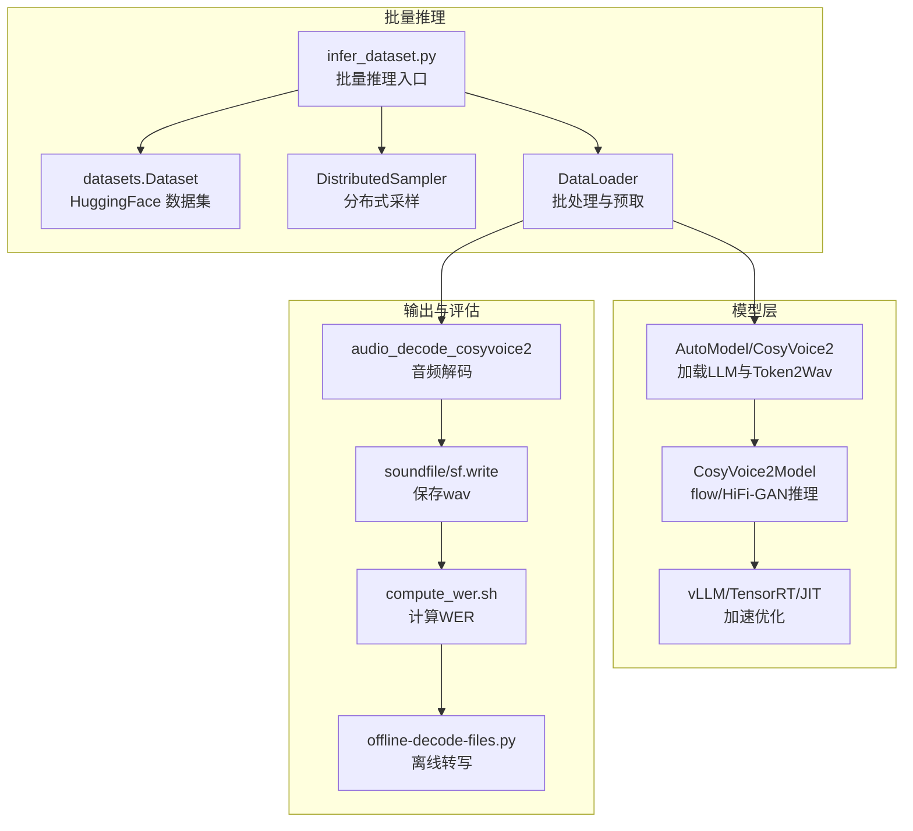
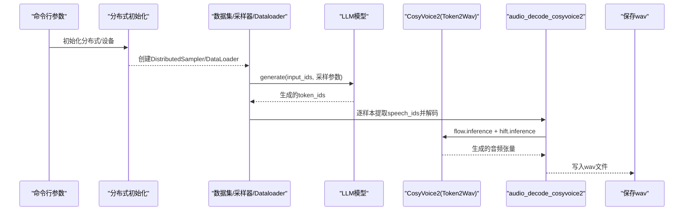
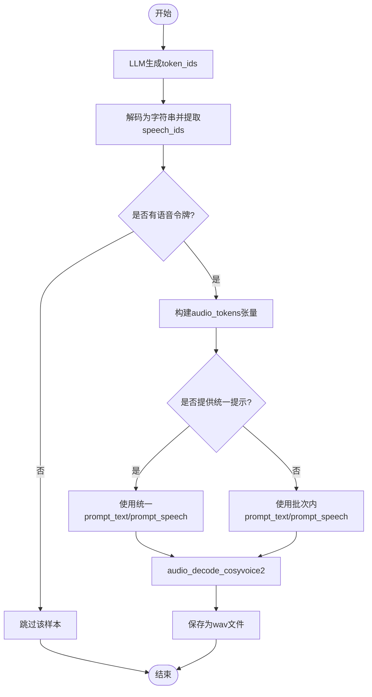
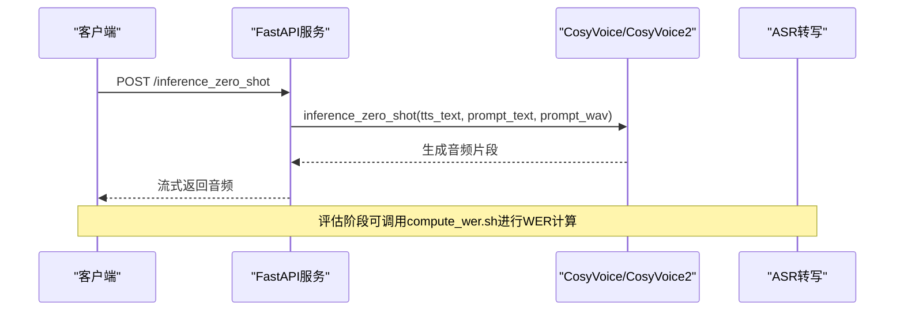
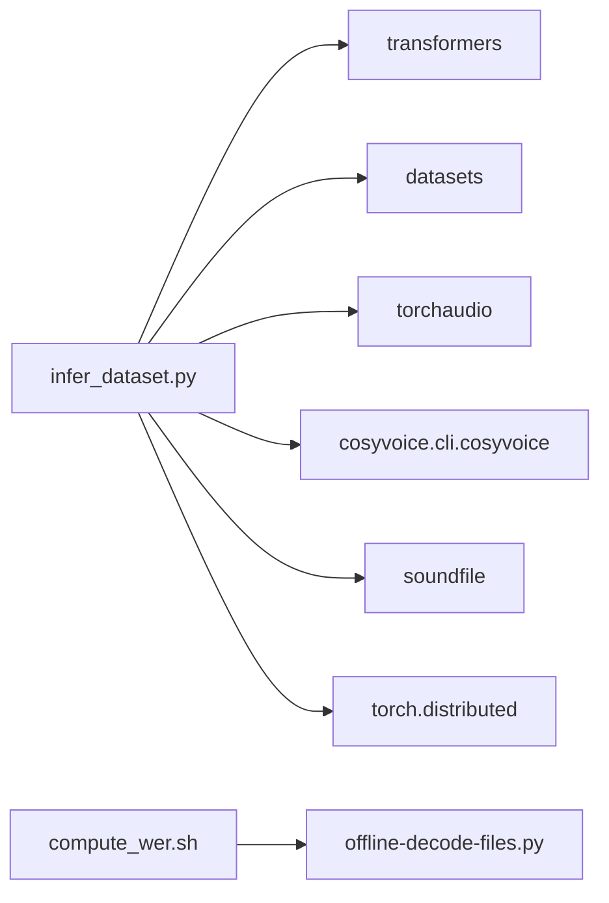

# 推理数据集生成工具

<cite>
**本文引用的文件**
- [infer_dataset.py](file://examples/grpo/cosyvoice2/infer_dataset.py)
- [compute_wer.sh](file://examples/grpo/cosyvoice2/scripts/compute_wer.sh)
- [server.py](file://runtime/python/fastapi/server.py)
- [cosyvoice.py](file://cosyvoice/cli/cosyvoice.py)
- [model.py](file://cosyvoice/cli/model.py)
- [file_utils.py](file://cosyvoice/utils/file_utils.py)
- [offline-decode-files.py](file://examples/grpo/cosyvoice2/scripts/offline-decode-files.py)
</cite>

## 目录
1. [简介](#简介)
2. [项目结构](#项目结构)
3. [核心组件](#核心组件)
4. [架构总览](#架构总览)
5. [详细组件分析](#详细组件分析)
6. [依赖关系分析](#依赖关系分析)
7. [性能考量](#性能考量)
8. [故障排查指南](#故障排查指南)
9. [结论](#结论)
10. [附录](#附录)

## 简介
本文件深入解析推理数据集生成工具 infer_dataset.py 的设计与应用，聚焦其在训练完成后对测试集或评估集进行批量语音合成推理，生成合成语音文件以供后续评估（例如通过 compute_wer.sh 计算 WER）。文档说明其如何加载预训练模型、读取测试文本与提示音频、调用 CosyVoice/CosyVoice2 类的不同推理模式（如 Zero-shot 或 SFT），并高效地输出音频文件；同时涵盖配置参数详解、批处理大小对内存的影响、多进程加速策略，以及如何扩展支持新的评估指标。最后，结合 runtime/python/fastapi/server.py 对比说明批量推理与在线服务的异同。

## 项目结构
该工具位于 examples/grpo/cosyvoice2 目录下，围绕以下关键文件协同工作：
- infer_dataset.py：批量推理主程序，负责加载 LLM 与 CosyVoice2 Token2Wav 模型、构建数据集、分布式采样、批处理推理与音频保存。
- compute_wer.sh：评估脚本，基于生成的 wav 文件调用 ASR 进行转写并计算 WER。
- server.py：FastAPI 在线服务示例，展示如何在服务端加载 CosyVoice/CosyVoice2 并提供多种推理接口。
- cosyvoice.py：CosyVoice/CosyVoice2 推理接口定义，包含 SFT、Zero-shot、Cross-lingual、Instruct 等模式。
- model.py：CosyVoice2Model 推理实现，包含 vLLM 加速、TensorRT/JIT 加载等。
- file_utils.py：导出 vLLM 模型权重等工具函数。
- offline-decode-files.py：离线解码脚本，供 compute_wer.sh 调用进行转写。

图表来源
- [infer_dataset.py](file://examples/grpo/cosyvoice2/infer_dataset.py#L282-L398)
- [cosyvoice.py](file://cosyvoice/cli/cosyvoice.py#L257-L391)
- [model.py](file://cosyvoice/cli/model.py#L369-L574)
- [compute_wer.sh](file://examples/grpo/cosyvoice2/scripts/compute_wer.sh#L1-L33)

章节来源
- [infer_dataset.py](file://examples/grpo/cosyvoice2/infer_dataset.py#L282-L398)
- [cosyvoice.py](file://cosyvoice/cli/cosyvoice.py#L257-L391)
- [model.py](file://cosyvoice/cli/model.py#L369-L574)
- [compute_wer.sh](file://examples/grpo/cosyvoice2/scripts/compute_wer.sh#L1-L33)

## 核心组件
- 批量推理入口与分布式初始化：解析参数、初始化分布式环境、设置设备、创建 LLM 与 CosyVoice2 模型实例。
- 数据加载与批处理：使用 HuggingFace datasets 加载数据集，配合 DistributedSampler 与 DataLoader 实现分布式分片与批处理。
- 语音令牌生成与解码：利用 LLM 生成语音令牌序列，再通过 CosyVoice2 的前端与 flow/HiFi-GAN 解码生成音频。
- 输出与评估：将生成的音频按条目 ID 保存为 wav 文件，并由 compute_wer.sh 调用 ASR 进行转写与 WER 计算。

章节来源
- [infer_dataset.py](file://examples/grpo/cosyvoice2/infer_dataset.py#L117-L184)
- [infer_dataset.py](file://examples/grpo/cosyvoice2/infer_dataset.py#L269-L394)
- [cosyvoice.py](file://cosyvoice/cli/cosyvoice.py#L257-L391)
- [compute_wer.sh](file://examples/grpo/cosyvoice2/scripts/compute_wer.sh#L1-L33)

## 架构总览
下面的时序图展示了从数据加载到音频生成的关键流程，映射到实际代码结构。

图表来源
- [infer_dataset.py](file://examples/grpo/cosyvoice2/infer_dataset.py#L282-L394)
- [cosyvoice.py](file://cosyvoice/cli/cosyvoice.py#L257-L391)

## 详细组件分析

### 批量推理入口与参数
- 关键参数
  - split-name：指定 HuggingFace 数据集的划分名称，区分 Zero-shot 与 SFT 数据集。
  - output-dir：输出目录，保存生成的 wav 文件。
  - batch-size：每 GPU 的批大小（per-device）。
  - num-workers/prefetch：DataLoader 工作线程与预取因子。
  - llm-model-name-or-path：LLM 模型路径（包含 tokenizer）。
  - token2wav-path：CosyVoice2 Token2Wav 模型路径。
  - prompt-text/prompt-speech-path：统一提示文本与提示音频（若未提供则使用批次内对应字段）。
  - top-p/top-k/temperature：采样超参。
- 分布式初始化：设置 CUDA 设备、初始化 NCCL 进程组，按 rank 控制进度条与屏障同步。

章节来源
- [infer_dataset.py](file://examples/grpo/cosyvoice2/infer_dataset.py#L117-L184)
- [infer_dataset.py](file://examples/grpo/cosyvoice2/infer_dataset.py#L269-L304)

### 数据加载与批处理
- 数据集来源：根据 split-name 自动选择 yuekai/CV3-Eval（Zero-shot）或 yuekai/seed_tts_cosy2（SFT）。
- 分布式采样：使用 DistributedSampler 将数据均匀分配到各 rank。
- 批处理与预取：DataLoader 支持 num_workers 与 prefetch_factor，collate_fn 使用 data_collator 组装 input_ids、prompt_text 与 prompt_audio，并在需要时量化为 CosyVoice2 语音令牌。

章节来源
- [infer_dataset.py](file://examples/grpo/cosyvoice2/infer_dataset.py#L305-L321)
- [infer_dataset.py](file://examples/grpo/cosyvoice2/infer_dataset.py#L186-L267)

### 语音令牌生成与解码
- LLM 生成：对拼接后的 prompt_text + target_text 使用 apply_chat_template 生成 input_ids，随后调用 generate 生成 token_ids。
- 令牌提取：将生成的 token_ids 解码为字符串，提取形如 <|s_数字|> 的语音令牌，转换为整型序列。
- 音频解码：调用 audio_decode_cosyvoice2，通过 CosyVoice2 前端构造零样本提示输入，flow.inference 生成梅尔谱，再经 hift.inference 重建波形。

图表来源
- [infer_dataset.py](file://examples/grpo/cosyvoice2/infer_dataset.py#L332-L385)
- [infer_dataset.py](file://examples/grpo/cosyvoice2/infer_dataset.py#L59-L94)

章节来源
- [infer_dataset.py](file://examples/grpo/cosyvoice2/infer_dataset.py#L332-L385)
- [infer_dataset.py](file://examples/grpo/cosyvoice2/infer_dataset.py#L59-L94)

### CosyVoice/CosyVoice2 推理模式
- CosyVoice：支持 SFT、Zero-shot、Cross-lingual、Instruct、Voice Conversion 等模式，面向传统 TTS 流程。
- CosyVoice2：在 CosyVoice 基础上引入 vLLM、JIT、TensorRT 等加速能力，提供更高效的推理路径；同时保留 SFT 与 Zero-shot 等模式，且在前端与模型层面做了适配。

章节来源
- [cosyvoice.py](file://cosyvoice/cli/cosyvoice.py#L257-L391)

### CosyVoice2Model 推理实现与加速
- CosyVoice2Model：封装 LLM、Flow、HiFi-GAN，支持 load_vllm、load_jit、load_trt 等加载方式；内部维护缓存与 RTF 计时逻辑。
- vLLM 加速：通过 export_cosyvoice2_vllm 导出权重并在推理时使用 LLMEngine 提升吞吐。
- TensorRT/JIT：在 flow 编码器与解码器上启用 TRT/JIT，降低延迟并提升吞吐。

章节来源
- [model.py](file://cosyvoice/cli/model.py#L369-L574)
- [file_utils.py](file://cosyvoice/utils/file_utils.py#L91-L117)

### 在线服务对比：批量推理 vs 在线服务
- 批量推理（infer_dataset.py）：单次启动，遍历整个数据集，逐样本生成并保存 wav；适合大规模评估与离线批处理。
- 在线服务（runtime/python/fastapi/server.py）：提供 /inference_sft、/inference_zero_shot、/inference_cross_lingual、/inference_instruct、/inference_instruct2 等接口，按请求实时推理并流式返回音频；适合交互式或低延迟场景。

图表来源
- [server.py](file://runtime/python/fastapi/server.py#L67-L101)
- [cosyvoice.py](file://cosyvoice/cli/cosyvoice.py#L257-L391)

章节来源
- [server.py](file://runtime/python/fastapi/server.py#L67-L101)
- [cosyvoice.py](file://cosyvoice/cli/cosyvoice.py#L257-L391)

## 依赖关系分析
- infer_dataset.py 依赖：
  - transformers（AutoTokenizer/AutoModelForCausalLM）：加载 LLM 与 tokenizer。
  - datasets：加载 HuggingFace 数据集。
  - torchaudio：重采样提示音频。
  - cosyvoice.cli.cosyvoice：CosyVoice2 推理接口。
  - soundfile：保存 wav。
  - torch.distributed：分布式训练/推理。
- compute_wer.sh 依赖：
  - sherpa-onnx Paraformer 模型进行离线转写，再调用 offline-decode-files.py 输出评估日志。

图表来源
- [infer_dataset.py](file://examples/grpo/cosyvoice2/infer_dataset.py#L29-L47)
- [compute_wer.sh](file://examples/grpo/cosyvoice2/scripts/compute_wer.sh#L1-L33)

章节来源
- [infer_dataset.py](file://examples/grpo/cosyvoice2/infer_dataset.py#L29-L47)
- [compute_wer.sh](file://examples/grpo/cosyvoice2/scripts/compute_wer.sh#L1-L33)

## 性能考量
- 批处理大小对内存的影响
  - 增大 batch-size 可提升吞吐，但会增加显存占用；需根据 GPU 显存与 prompt 长度权衡。
  - num_workers 与 prefetch_factor 可减少 I/O 阻塞，提高 CPU-GPU 利用率。
- 多进程加速策略
  - 使用 torchrun 多卡并行，每个 rank 使用 DistributedSampler 分片数据，避免重复计算。
  - 在 CosyVoice2 中启用 load_vllm、load_trt、load_jit 可显著降低延迟与提升吞吐。
- 采样参数调优
  - top-p/top-k/temperature 影响生成多样性与稳定性，建议在验证集上微调。
- I/O 与评估
  - 生成 wav 后通过 compute_wer.sh 调用 ASR 进行转写与 WER 计算，注意输出目录与日志路径一致性。

章节来源
- [infer_dataset.py](file://examples/grpo/cosyvoice2/infer_dataset.py#L117-L184)
- [infer_dataset.py](file://examples/grpo/cosyvoice2/infer_dataset.py#L305-L321)
- [model.py](file://cosyvoice/cli/model.py#L369-L574)

## 故障排查指南
- 无提示音频或提示文本为空
  - 若未提供统一提示，需确保批次内存在有效的 prompt_text 与 prompt_audio；否则会跳过该样本。
- 未生成语音令牌
  - 若 LLM 未生成任何 <|s_数字|> 令牌，将打印警告并跳过该样本；检查 prompt_text + target_text 拼接与 tokenizer chat 模板。
- 分布式初始化失败
  - 确认 WORLD_SIZE、LOCAL_RANK、RANK 环境变量正确；NCCL 初始化需网络与驱动正常。
- 显存不足
  - 降低 batch-size、关闭 load_vllm/load_trt/load_jit 或切换 fp32；必要时减少 num_workers 与 prefetch_factor。
- 评估脚本异常
  - 确保 compute_wer.sh 中模型路径存在且 sherpa-onnx 已安装；确认 wav_dir 下存在 wav 文件。

章节来源
- [infer_dataset.py](file://examples/grpo/cosyvoice2/infer_dataset.py#L352-L385)
- [infer_dataset.py](file://examples/grpo/cosyvoice2/infer_dataset.py#L269-L304)
- [compute_wer.sh](file://examples/grpo/cosyvoice2/scripts/compute_wer.sh#L1-L33)

## 结论
infer_dataset.py 通过 LLM 生成语音令牌并结合 CosyVoice2 的 Token2Wav 解码链路，实现了对测试/评估集的大规模批量推理与音频生成。借助分布式采样、批处理与多进程加速，可在有限资源下高效完成评估任务。结合 compute_wer.sh 的 WER 计算流程，可形成完整的离线评估闭环。对比在线服务，批量推理更适合离线、高吞吐的评估场景；在线服务则适用于交互式与低延迟需求。

## 附录
- 扩展支持新的评估指标
  - 在 compute_wer.sh 基础上新增评估脚本，调用其他 ASR 引擎或自定义评测工具，保持输出格式一致以便统一统计。
  - 在 infer_dataset.py 中增加额外元数据输出（如转写文本、置信度等），便于下游指标计算。