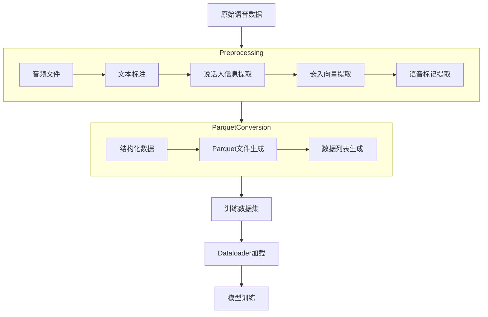
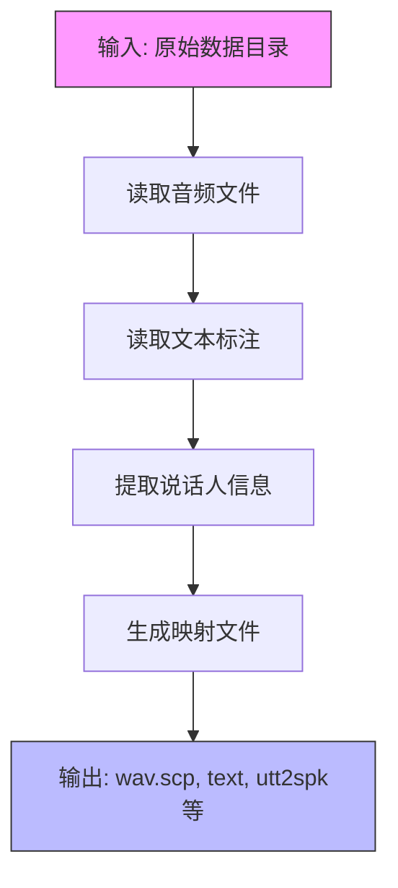
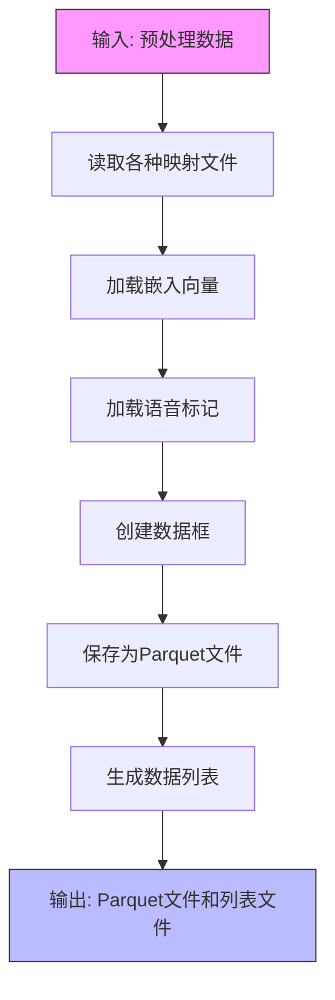
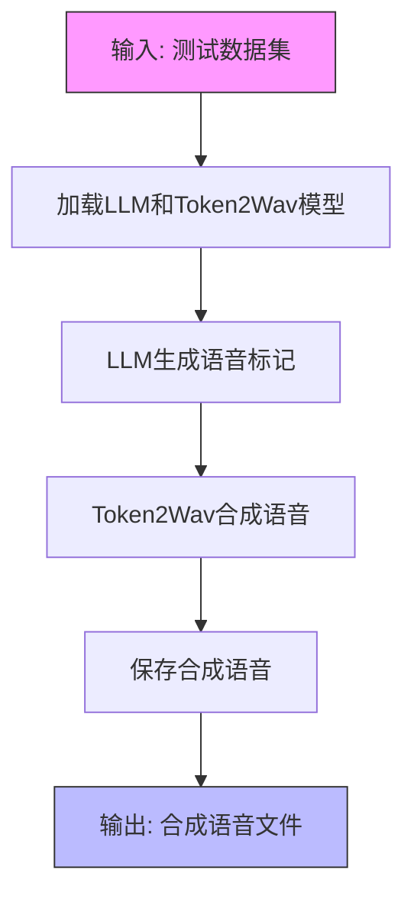
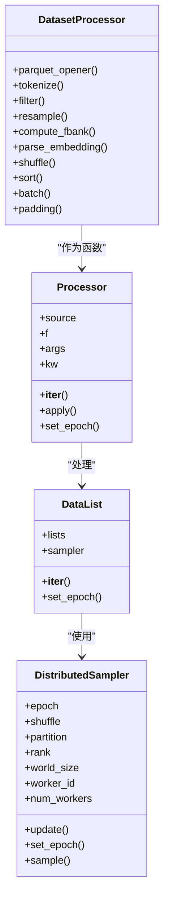
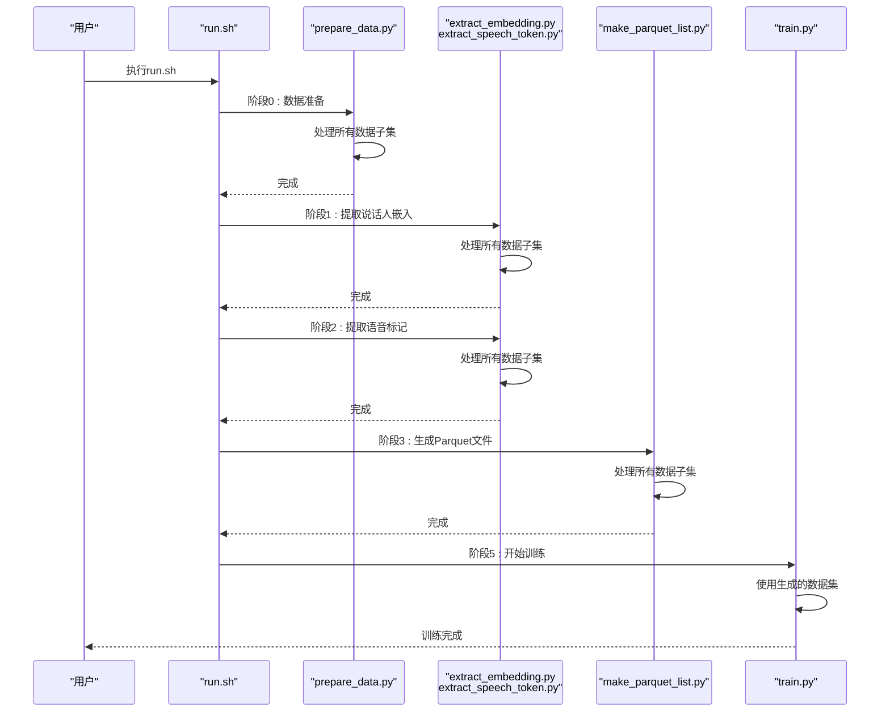

# 数据集处理工具

<cite>
**本文档中引用的文件**  
- [make_parquet_list.py](file://tools/make_parquet_list.py)
- [prepare_data.py](file://examples/grpo/cosyvoice2/prepare_data.py)
- [infer_dataset.py](file://examples/grpo/cosyvoice2/infer_dataset.py)
- [dataset.py](file://cosyvoice/dataset/dataset.py)
- [processor.py](file://cosyvoice/dataset/processor.py)
- [cosyvoice.yaml](file://examples/libritts/cosyvoice/conf/cosyvoice.yaml)
- [cosyvoice2.yaml](file://examples/libritts/cosyvoice2/conf/cosyvoice2.yaml)
- [cosyvoice3.yaml](file://examples/libritts/cosyvoice3/conf/cosyvoice3.yaml)
- [run.sh](file://examples/libritts/cosyvoice/run.sh)
- [run.sh](file://examples/libritts/cosyvoice2/run.sh)
- [run.sh](file://examples/libritts/cosyvoice3/run.sh)
- [prepare_data.py](file://examples/libritts/cosyvoice/local/prepare_data.py)
- [prepare_data.py](file://examples/magicdata-read/cosyvoice/local/prepare_data.py)
</cite>

## 目录
1. [简介](#简介)
2. [核心工具概述](#核心工具概述)
3. [数据处理流程](#数据处理流程)
4. [工具详细说明](#工具详细说明)
5. [Dataloader协同工作机制](#dataloader协同工作机制)
6. [典型工作流示例](#典型工作流示例)
7. [配置参数说明](#配置参数说明)
8. [最佳实践](#最佳实践)

## 简介
本文档详细说明了CosyVoice项目中用于数据集处理的一系列实用工具，包括`make_parquet_list.py`、`prepare_data.py`和`infer_dataset.py`。这些工具在语音合成模型的训练流水线中扮演着关键角色，负责从原始语音数据到训练就绪数据集的转换过程。文档将阐述各工具的功能定位、输入输出格式规范，以及它们如何与Dataloader协同工作，最终提供一个从原始数据到训练数据集的完整构建示例。

## 核心工具概述
CosyVoice项目中的数据集处理工具链由三个核心组件构成，它们分别负责不同阶段的数据处理任务：

1. **`prepare_data.py`**：负责原始数据的预处理，包括文本标注、音频对齐等基础准备工作，将原始语音数据转换为结构化的中间格式。

2. **`make_parquet_list.py`**：将预处理后的数据转换为高效的Parquet格式存储，便于后续快速读取和批量处理。

3. **`infer_dataset.py`**：用于批量推理测试集，生成合成语音，通常在模型评估和验证阶段使用。

这些工具共同构成了从原始数据到模型训练/推理所需格式的完整转换流水线。

**Section sources**
- [prepare_data.py](file://examples/grpo/cosyvoice2/prepare_data.py)
- [make_parquet_list.py](file://tools/make_parquet_list.py)
- [infer_dataset.py](file://examples/grpo/cosyvoice2/infer_dataset.py)

## 数据处理流程
数据处理流程遵循一个清晰的阶段化设计，从原始数据到最终可用于训练的数据集，经历多个处理阶段。整个流程可以概括为以下几个主要步骤：



**Diagram sources**
- [prepare_data.py](file://examples/libritts/cosyvoice/local/prepare_data.py)
- [make_parquet_list.py](file://tools/make_parquet_list.py)
- [dataset.py](file://cosyvoice/dataset/dataset.py)

## 工具详细说明

### prepare_data.py
`prepare_data.py`是数据处理流水线的起点，负责将原始语音数据转换为结构化的中间格式。该工具主要执行以下任务：

- 读取音频文件和对应的文本标注
- 提取说话人信息（spk）
- 生成utt2spk、spk2utt等映射文件
- 可选地生成指令文件（instruct）

该工具根据不同数据集的特点有多个实现版本，如LibriTTS和MagicData-Read数据集都有对应的`prepare_data.py`脚本。



**Diagram sources**
- [prepare_data.py](file://examples/libritts/cosyvoice/local/prepare_data.py)
- [prepare_data.py](file://examples/magicdata-read/cosyvoice/local/prepare_data.py)

**Section sources**
- [prepare_data.py](file://examples/libritts/cosyvoice/local/prepare_data.py)
- [prepare_data.py](file://examples/magicdata-read/cosyvoice/local/prepare_data.py)

### make_parquet_list.py
`make_parquet_list.py`负责将预处理后的数据转换为高效的Parquet格式，这是训练阶段的主要数据输入格式。该工具的主要功能包括：

- 读取预处理阶段生成的各种文件（wav.scp、text、utt2spk等）
- 加载嵌入向量（utt2embedding.pt、spk2embedding.pt）
- 加载语音标记（utt2speech_token.pt）
- 将所有数据整合并保存为Parquet格式文件
- 生成数据列表文件（data.list、utt2data.list、spk2data.list）

该工具支持多进程并行处理，可以显著提高大数据集的处理速度。



**Diagram sources**
- [make_parquet_list.py](file://tools/make_parquet_list.py)

**Section sources**
- [make_parquet_list.py](file://tools/make_parquet_list.py)

### infer_dataset.py
`infer_dataset.py`用于批量推理测试集，生成合成语音。该工具通常在模型评估和验证阶段使用，其主要功能包括：

- 加载预训练的LLM模型和Token2Wav模型
- 从HuggingFace数据集中加载测试数据
- 使用LLM模型生成语音标记序列
- 使用Token2Wav模型将标记序列转换为合成语音
- 支持分布式推理，可以利用多GPU加速推理过程

该工具实现了完整的文本到语音的推理流水线，是模型性能评估的关键工具。



**Diagram sources**
- [infer_dataset.py](file://examples/grpo/cosyvoice2/infer_dataset.py)

**Section sources**
- [infer_dataset.py](file://examples/grpo/cosyvoice2/infer_dataset.py)

## Dataloader协同工作机制
数据处理工具与Dataloader之间存在紧密的协同关系。Dataloader负责在训练过程中高效地加载和批处理数据，而数据处理工具则负责准备Dataloader所需的输入数据。



**Diagram sources**
- [dataset.py](file://cosyvoice/dataset/dataset.py)
- [processor.py](file://cosyvoice/dataset/processor.py)

Dataloader的工作流程如下：

1. **数据源初始化**：Dataloader从`data.list`文件中读取Parquet文件列表，作为数据源。

2. **数据打开**：使用`parquet_opener`函数打开每个Parquet文件，读取其中的数据。

3. **数据处理流水线**：数据依次通过一系列处理函数，包括：
   - `tokenize`：文本标记化
   - `filter`：数据过滤
   - `resample`：重采样
   - `compute_fbank`：计算FBank特征
   - `parse_embedding`：解析嵌入向量
   - `shuffle`：数据混洗
   - `sort`：数据排序
   - `batch`：批处理
   - `padding`：填充

4. **批处理输出**：最终输出格式化的批次数据，供模型训练使用。

**Section sources**
- [dataset.py](file://cosyvoice/dataset/dataset.py)
- [processor.py](file://cosyvoice/dataset/processor.py)

## 典型工作流示例
以下是一个从原始语音数据到训练就绪数据集的完整构建过程示例，以LibriTTS数据集为例：



**Diagram sources**
- [run.sh](file://examples/libritts/cosyvoice/run.sh)

具体执行步骤如下：

1. **数据下载**：使用`local/download_and_untar.sh`脚本下载LibriTTS数据集。

2. **数据预处理**：
```bash
for x in train-clean-100 train-clean-360 train-other-500 dev-clean dev-other test-clean test-other; do
    mkdir -p data/$x
    python local/prepare_data.py --src_dir $data_dir/LibriTTS/$x --des_dir data/$x
done
```

3. **提取说话人嵌入**：
```bash
for x in train-clean-100 train-clean-360 train-other-500 dev-clean dev-other test-clean test-other; do
    tools/extract_embedding.py --dir data/$x \
      --onnx_path $pretrained_model_dir/campplus.onnx
done
```

4. **提取语音标记**：
```bash
for x in train-clean-100 train-clean-360 train-other-500 dev-clean dev-other test-clean test-other; do
    tools/extract_speech_token.py --dir data/$x \
      --onnx_path $pretrained_model_dir/speech_tokenizer_v1.onnx
done
```

5. **生成Parquet格式数据**：
```bash
for x in train-clean-100 train-clean-360 train-other-500 dev-clean dev-other test-clean test-other; do
    mkdir -p data/$x/parquet
    tools/make_parquet_list.py --num_utts_per_parquet 1000 \
      --num_processes 10 \
      --src_dir data/$x \
      --des_dir data/$x/parquet
done
```

6. **训练模型**：
```bash
cat data/{train-clean-100,train-clean-360,train-other-500}/parquet/data.list > data/train.data.list
cat data/{dev-clean,dev-other}/parquet/data.list > data/dev.data.list
torchrun --nnodes=1 --nproc_per_node=$num_gpus \
    cosyvoice/bin/train.py \
    --train_engine $train_engine \
    --config conf/cosyvoice.yaml \
    --train_data data/train.data.list \
    --cv_data data/dev.data.list \
    --model llm \
    --checkpoint $pretrained_model_dir/llm.pt \
    --model_dir `pwd`/exp/cosyvoice/llm/$train_engine
```

**Section sources**
- [run.sh](file://examples/libritts/cosyvoice/run.sh)

## 配置参数说明
数据处理和训练过程中的关键参数在YAML配置文件中定义，不同版本的CosyVoice模型有不同的配置文件。

### CosyVoice配置参数
```yaml
# 固定参数
sample_rate: 22050
text_encoder_input_size: 512
llm_input_size: 1024
llm_output_size: 1024
spk_embed_dim: 192

# 数据处理流水线
data_pipeline: [
    !ref <parquet_opener>,
    !ref <tokenize>,
    !ref <filter>,
    !ref <resample>,
    !ref <compute_fbank>,
    !ref <parse_embedding>,
    !ref <shuffle>,
    !ref <sort>,
    !ref <batch>,
    !ref <padding>,
]
```

### CosyVoice2配置参数
```yaml
# 固定参数
sample_rate: 24000
llm_input_size: 896
llm_output_size: 896
spk_embed_dim: 192
token_frame_rate: 25
token_mel_ratio: 2

# 数据处理流水线
data_pipeline: [
    !ref <parquet_opener>,
    !ref <tokenize>,
    !ref <filter>,
    !ref <resample>,
    !ref <compute_fbank>,
    !ref <parse_embedding>,
    !ref <shuffle>,
    !ref <sort>,
    !ref <batch>,
    !ref <padding>,
]
```

### CosyVoice3配置参数
```yaml
# 固定参数
sample_rate: 24000
llm_input_size: 896
llm_output_size: 896
spk_embed_dim: 192
token_frame_rate: 25
token_mel_ratio: 2

# 数据处理流水线
data_pipeline: [
    !ref <parquet_opener>,
    !ref <tokenize>,
    !ref <filter>,
    !ref <resample>,
    !ref <compute_fbank>,
    !ref <parse_embedding>,
    !ref <shuffle>,
    !ref <sort>,
    !ref <batch>,
    !ref <padding>,
]
```

**Section sources**
- [cosyvoice.yaml](file://examples/libritts/cosyvoice/conf/cosyvoice.yaml)
- [cosyvoice2.yaml](file://examples/libritts/cosyvoice2/conf/cosyvoice2.yaml)
- [cosyvoice3.yaml](file://examples/libritts/cosyvoice3/conf/cosyvoice3.yaml)

## 最佳实践
为了确保数据处理流程的高效和可靠，建议遵循以下最佳实践：

1. **并行处理**：在处理大型数据集时，充分利用`make_parquet_list.py`的多进程功能，设置适当的`--num_processes`参数以加速处理。

2. **内存管理**：合理设置`--num_utts_per_parquet`参数，平衡单个Parquet文件的大小和数量，避免单个文件过大导致内存问题。

3. **数据验证**：在每个处理阶段后，检查输出文件的完整性和正确性，确保数据处理流水线的可靠性。

4. **配置一致性**：确保数据处理参数（如采样率、特征提取参数等）与模型配置文件中的参数保持一致。

5. **错误处理**：在数据处理脚本中添加适当的错误处理和日志记录，便于调试和问题排查。

6. **版本控制**：对数据处理脚本和配置文件进行版本控制，确保实验的可重复性。

通过遵循这些最佳实践，可以构建一个高效、可靠的数据处理流水线，为语音合成模型的训练和评估提供高质量的数据支持。