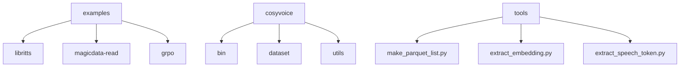
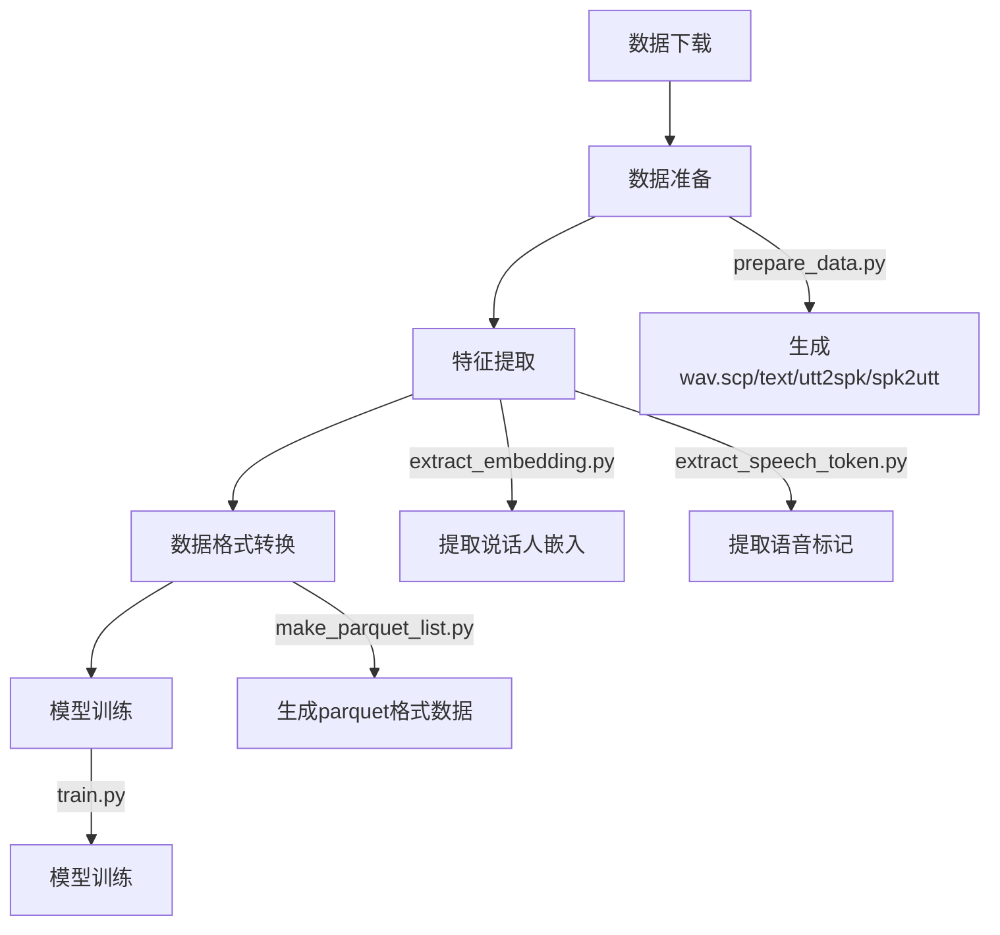
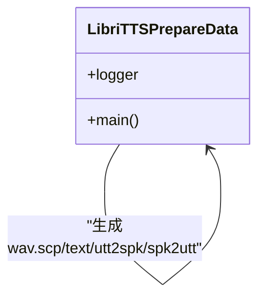
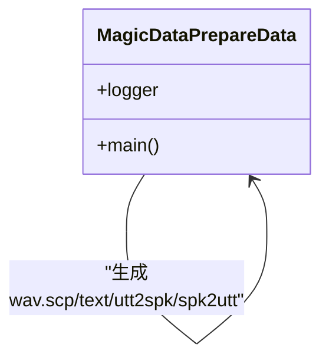
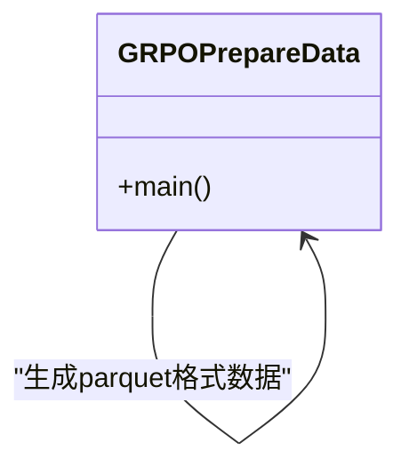
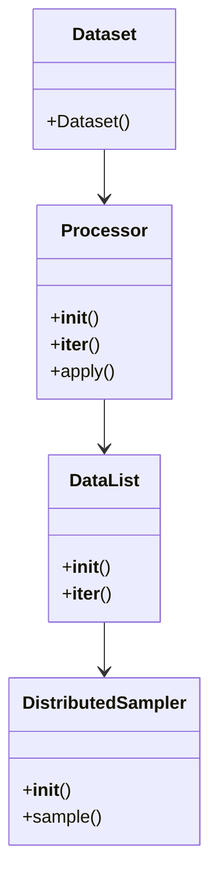
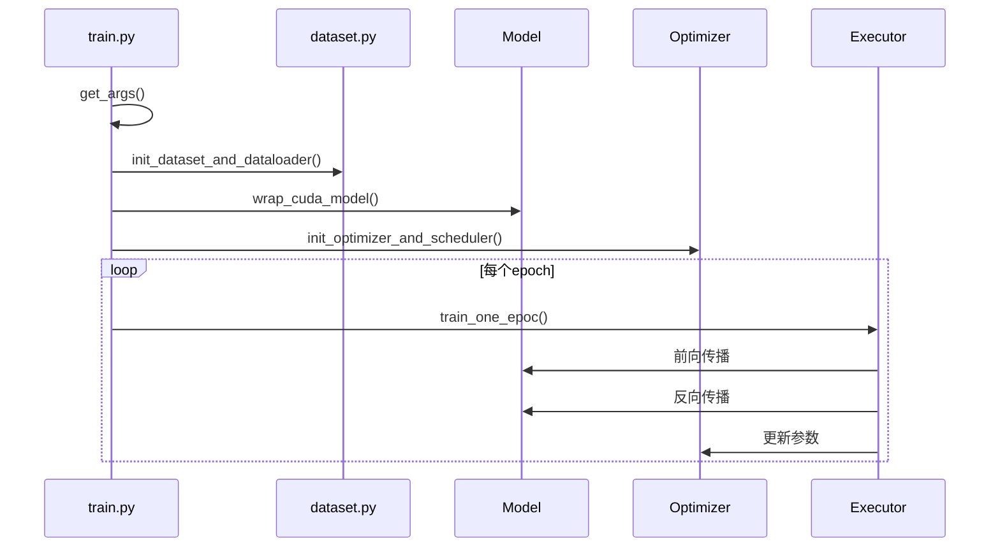
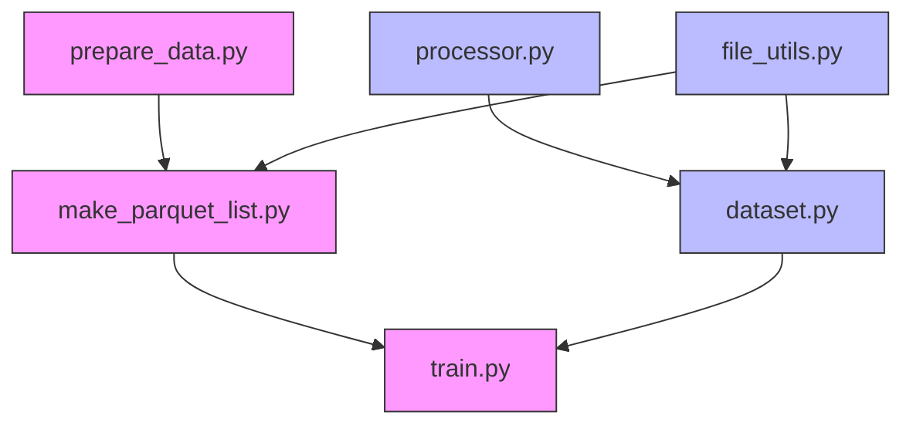

# 数据预处理工具

<cite>
**本文档引用的文件**   
- [prepare_data.py](file://examples/libritts/cosyvoice/local/prepare_data.py)
- [prepare_data.py](file://examples/magicdata-read/cosyvoice/local/prepare_data.py)
- [prepare_data.py](file://examples/grpo/cosyvoice2/prepare_data.py)
- [dataset.py](file://cosyvoice/dataset/dataset.py)
- [train.py](file://cosyvoice/bin/train.py)
- [processor.py](file://cosyvoice/dataset/processor.py)
- [file_utils.py](file://cosyvoice/utils/file_utils.py)
- [make_parquet_list.py](file://tools/make_parquet_list.py)
- [run.sh](file://examples/libritts/cosyvoice/run.sh)
- [run.sh](file://examples/magicdata-read/cosyvoice/run.sh)
- [cosyvoice.yaml](file://examples/libritts/cosyvoice/conf/cosyvoice.yaml)
</cite>

## 目录
1. [引言](#引言)
2. [项目结构](#项目结构)
3. [核心组件](#核心组件)
4. [架构概述](#架构概述)
5. [详细组件分析](#详细组件分析)
6. [依赖分析](#依赖分析)
7. [性能考虑](#性能考虑)
8. [故障排除指南](#故障排除指南)
9. [结论](#结论)

## 引言
本文档旨在整合和文档化CosyVoice项目中各数据集专用的`prepare_data.py`脚本，这些脚本负责执行端到端的数据预处理流程。分析不同示例目录下脚本的共性与差异，说明如何适配LibriTTS、MagicData等不同数据集。重点描述其输出如何被`dataset.py`解析，并与模型训练入口`bin/train.py`集成。提供调试技巧和常见错误处理方法。

## 项目结构
CosyVoice项目包含多个子目录，其中`examples`目录下包含了针对不同数据集的示例配置和脚本。`cosyvoice`目录包含了核心的模型和数据处理代码。`tools`目录包含了用于数据处理的工具脚本。

**图示来源**
- [examples](file://examples)
- [cosyvoice](file://cosyvoice)
- [tools](file://tools)

**章节来源**
- [examples](file://examples)
- [cosyvoice](file://cosyvoice)
- [tools](file://tools)

## 核心组件
本项目的核心组件包括数据预处理脚本`prepare_data.py`、数据集处理模块`dataset.py`、训练脚本`train.py`以及数据处理工具`make_parquet_list.py`。这些组件共同协作，完成从原始数据到模型训练的整个流程。

**章节来源**
- [prepare_data.py](file://examples/libritts/cosyvoice/local/prepare_data.py)
- [dataset.py](file://cosyvoice/dataset/dataset.py)
- [train.py](file://cosyvoice/bin/train.py)
- [make_parquet_list.py](file://tools/make_parquet_list.py)

## 架构概述
整个数据预处理和训练流程可以分为以下几个步骤：数据下载、数据准备、特征提取、数据格式转换、模型训练。每个步骤都有相应的脚本和配置文件支持。

**图示来源**
- [run.sh](file://examples/libritts/cosyvoice/run.sh)
- [run.sh](file://examples/magicdata-read/cosyvoice/run.sh)

**章节来源**
- [run.sh](file://examples/libritts/cosyvoice/run.sh)
- [run.sh](file://examples/magicdata-read/cosyvoice/run.sh)

## 详细组件分析

### 数据准备脚本分析
不同数据集的`prepare_data.py`脚本虽然实现细节不同，但都遵循相同的模式：读取原始数据，生成标准的Kaldi格式文件（wav.scp, text, utt2spk, spk2utt）。

#### LibriTTS数据准备

**图示来源**
- [prepare_data.py](file://examples/libritts/cosyvoice/local/prepare_data.py)

#### MagicData数据准备

**图示来源**
- [prepare_data.py](file://examples/magicdata-read/cosyvoice/local/prepare_data.py)

#### GRPO数据准备

**图示来源**
- [prepare_data.py](file://examples/grpo/cosyvoice2/prepare_data.py)

**章节来源**
- [prepare_data.py](file://examples/libritts/cosyvoice/local/prepare_data.py)
- [prepare_data.py](file://examples/magicdata-read/cosyvoice/local/prepare_data.py)
- [prepare_data.py](file://examples/grpo/cosyvoice2/prepare_data.py)

### 数据集处理模块分析
`dataset.py`模块定义了数据集的处理流程，包括数据加载、预处理、批处理等。

**图示来源**
- [dataset.py](file://cosyvoice/dataset/dataset.py)

**章节来源**
- [dataset.py](file://cosyvoice/dataset/dataset.py)

### 训练脚本分析
`train.py`脚本是模型训练的入口，负责初始化模型、数据加载器、优化器等，并执行训练循环。

**图示来源**
- [train.py](file://cosyvoice/bin/train.py)

**章节来源**
- [train.py](file://cosyvoice/bin/train.py)

## 依赖分析
各组件之间的依赖关系如下图所示：

**图示来源**
- [prepare_data.py](file://examples/libritts/cosyvoice/local/prepare_data.py)
- [make_parquet_list.py](file://tools/make_parquet_list.py)
- [train.py](file://cosyvoice/bin/train.py)
- [processor.py](file://cosyvoice/dataset/processor.py)
- [dataset.py](file://cosyvoice/dataset/dataset.py)
- [file_utils.py](file://cosyvoice/utils/file_utils.py)

**章节来源**
- [prepare_data.py](file://examples/libritts/cosyvoice/local/prepare_data.py)
- [make_parquet_list.py](file://tools/make_parquet_list.py)
- [train.py](file://cosyvoice/bin/train.py)
- [processor.py](file://cosyvoice/dataset/processor.py)
- [dataset.py](file://cosyvoice/dataset/dataset.py)
- [file_utils.py](file://cosyvoice/utils/file_utils.py)

## 性能考虑
在数据预处理和训练过程中，有几个关键的性能考虑点：
1. 使用多进程加速parquet文件的生成
2. 使用动态批处理以提高GPU利用率
3. 使用混合精度训练以减少内存占用
4. 使用数据并行训练以利用多GPU

## 故障排除指南
### 常见错误及解决方法
1. **数据文件不存在**：检查`src_dir`路径是否正确，确保原始数据已下载。
2. **内存不足**：减少`num_processes`参数值，或使用更小的`num_utts_per_parquet`。
3. **训练中断**：检查CUDA_VISIBLE_DEVICES设置，确保GPU可用。
4. **特征提取失败**：检查音频文件格式是否支持，确保采样率符合要求。

**章节来源**
- [run.sh](file://examples/libritts/cosyvoice/run.sh)
- [run.sh](file://examples/magicdata-read/cosyvoice/run.sh)
- [train.py](file://cosyvoice/bin/train.py)

## 结论
本文档详细分析了CosyVoice项目中的数据预处理工具，包括不同数据集的`prepare_data.py`脚本、数据集处理模块`dataset.py`、训练脚本`train.py`以及数据处理工具`make_parquet_list.py`。通过这些组件的协同工作，实现了从原始数据到模型训练的完整流程。对于新数据集的适配，主要需要修改`prepare_data.py`脚本以适应数据格式，并相应调整配置文件。