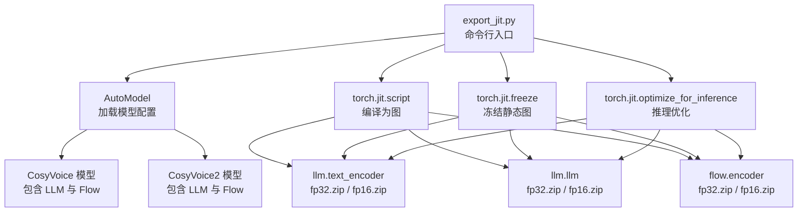
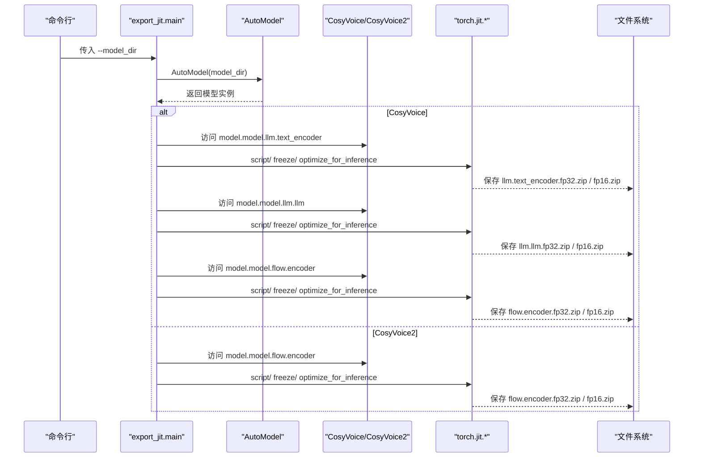
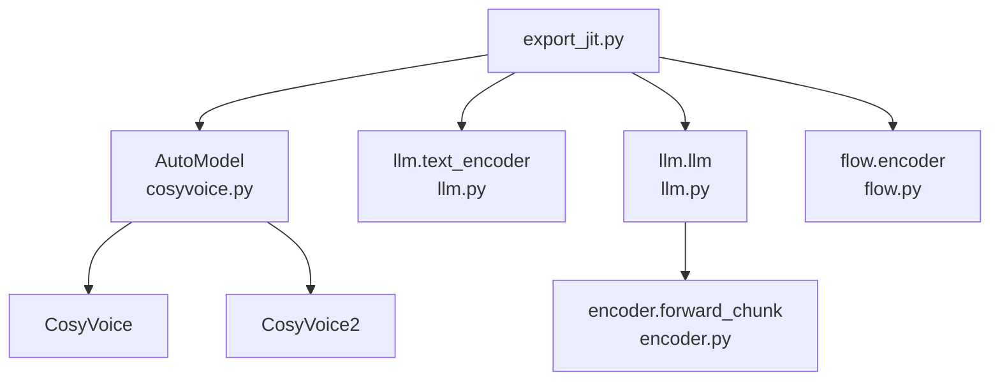
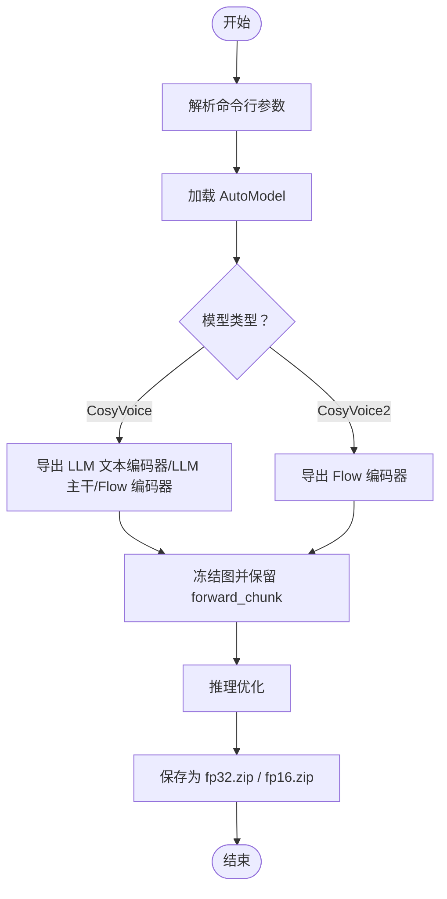

# JIT模型导出工具

<cite>
**本文引用的文件**
- [export_jit.py](file://cosyvoice/bin/export_jit.py)
- [llm.py](file://cosyvoice/llm/llm.py)
- [flow.py](file://cosyvoice/flow/flow.py)
- [cosyvoice.py](file://cosyvoice/cli/cosyvoice.py)
- [model.py](file://cosyvoice/cli/model.py)
- [encoder.py](file://cosyvoice/transformer/encoder.py)
- [cosyvoice2.py](file://cosyvoice/vllm/cosyvoice2.py)
</cite>

## 目录
1. [简介](#简介)
2. [项目结构](#项目结构)
3. [核心组件](#核心组件)
4. [架构总览](#架构总览)
5. [详细组件分析](#详细组件分析)
6. [依赖关系分析](#依赖关系分析)
7. [性能考量](#性能考量)
8. [故障排查指南](#故障排查指南)
9. [结论](#结论)
10. [附录](#附录)

## 简介
本文件系统性地文档化 export_jit.py 脚本的工作原理与使用场景，重点解释其如何通过 TorchScript 的三阶段优化流程（script、freeze、optimize_for_inference）将 PyTorch 模型转换为高效的 JIT 格式；阐述 fp32.zip 与 fp16.zip 双精度模型的生成逻辑及在推理性能与内存占用上的权衡；针对 CosyVoice 与 CosyVoice2 两种模型架构，说明其各自导出的组件（如 LLM 文本编码器、LLM 主干、Flow 编码器）及其在推理流水线中的作用；提供完整的命令行使用示例；深入分析 forward_chunk 等需保留属性的必要性；并覆盖导出过程中可能遇到的算子不支持、动态控制流等问题的排查与解决方案。

## 项目结构
export_jit.py 位于 cosyvoice/bin/ 目录下，主要职责是读取本地或 ModelScope 下载的模型配置，按 CosyVoice 与 CosyVoice2 的差异分别导出对应的 JIT 组件，并保存为 fp32.zip 与 fp16.zip 两个版本，供推理端加载使用。

图表来源
- [export_jit.py](file://cosyvoice/bin/export_jit.py#L51-L99)
- [cosyvoice.py](file://cosyvoice/cli/cosyvoice.py#L380-L391)

章节来源
- [export_jit.py](file://cosyvoice/bin/export_jit.py#L51-L99)
- [cosyvoice.py](file://cosyvoice/cli/cosyvoice.py#L380-L391)

## 核心组件
- export_jit.get_optimized_script：封装 TorchScript 三阶段优化流程，支持传入 preserved_attrs 以冻结特定方法或属性，确保推理时仍可调用。
- export_jit.main：解析命令行参数，加载 AutoModel，根据模型类型分支导出组件，并保存为 fp32.zip 与 fp16.zip。
- LLM 文本编码器（llm.text_encoder）：负责将输入文本编码为隐藏表示，作为 LLM 的输入特征。
- LLM 主干（llm.llm）：负责基于文本与提示语音 token 的拼接序列进行自回归解码，支持 forward_chunk 以实现流式增量解码。
- Flow 编码器（flow.encoder）：将离散语音 token 编码为中间表征，供后续 Flow 解码器生成声学特征。

章节来源
- [export_jit.py](file://cosyvoice/bin/export_jit.py#L41-L48)
- [export_jit.py](file://cosyvoice/bin/export_jit.py#L60-L96)
- [llm.py](file://cosyvoice/llm/llm.py#L33-L110)
- [llm.py](file://cosyvoice/llm/llm.py#L166-L229)
- [flow.py](file://cosyvoice/flow/flow.py#L24-L146)

## 架构总览
下图展示了 export_jit 的整体工作流：从命令行参数解析到模型加载，再到各组件的 JIT 导出与保存。

图表来源
- [export_jit.py](file://cosyvoice/bin/export_jit.py#L51-L99)
- [cosyvoice.py](file://cosyvoice/cli/cosyvoice.py#L380-L391)

## 详细组件分析

### TorchScript 三阶段优化流程
- script：将 Python 模型编译为 TorchScript 图，捕获静态计算图。
- freeze：冻结图，移除运行时动态分支，固定常量参数；若传入 preserved_attrs，则保留指定属性或方法，便于后续推理调用。
- optimize_for_inference：进一步优化图，消除冗余节点，提升推理性能。

章节来源
- [export_jit.py](file://cosyvoice/bin/export_jit.py#L41-L48)

### fp32.zip 与 fp16.zip 的生成逻辑与权衡
- 两份导出均来自同一原始模型，仅在 dtype 上有差异：fp32 使用半精度拷贝 half()，fp16 使用原精度。
- 推理性能与内存占用权衡：
  - FP16 在 GPU 上通常能获得更快的算子吞吐与更低显存占用，适合大规模部署。
  - FP32 在数值稳定性上更稳健，某些算子在 FP16 下可能出现不稳定或精度损失。
- 推理端加载时，可通过 AutoModel 的 load_jit 参数选择加载 fp32 或 fp16 对应 zip 文件。

章节来源
- [export_jit.py](file://cosyvoice/bin/export_jit.py#L66-L68)
- [export_jit.py](file://cosyvoice/bin/export_jit.py#L74-L76)
- [export_jit.py](file://cosyvoice/bin/export_jit.py#L89-L91)
- [cosyvoice.py](file://cosyvoice/cli/cosyvoice.py#L60-L84)
- [cosyvoice.py](file://cosyvoice/cli/cosyvoice.py#L298-L310)

### CosyVoice 与 CosyVoice2 的导出差异
- CosyVoice：导出 LLM 文本编码器、LLM 主干、Flow 编码器。
- CosyVoice2：仅导出 Flow 编码器；CosyVoice2 的 LLM 主干由 vLLM 加速，不在 export_jit 中导出，而是在推理端通过 load_vllm 导入。

章节来源
- [export_jit.py](file://cosyvoice/bin/export_jit.py#L60-L96)
- [cosyvoice.py](file://cosyvoice/cli/cosyvoice.py#L258-L311)

### LLM 文本编码器（llm.text_encoder）
- 作用：将文本 token 映射为嵌入向量，并通过编码器得到上下文表征，再经仿射层映射到 LLM 输入维度。
- 导出：直接 script/freeze/optimize_for_inference，保存为 llm.text_encoder.fp32.zip 与 llm.text_encoder.fp16.zip。

章节来源
- [llm.py](file://cosyvoice/llm/llm.py#L33-L110)
- [export_jit.py](file://cosyvoice/bin/export_jit.py#L60-L69)

### LLM 主干（llm.llm）与 forward_chunk
- 作用：基于拼接的文本与提示语音 token 序列进行自回归解码；在流式推理中，通过 forward_chunk 实现按块增量解码，避免一次性全序列计算。
- 关键点：
  - forward_chunk 方法在编码器中被标注为 @torch.jit.export，确保在 TorchScript 中可见。
  - 导出时需 preserve forward_chunk 属性，否则推理端无法调用该方法。
- CosyVoice2 的 LLM 主干还支持 vLLM 加速，推理端通过 load_vllm 导入，不再使用 export_jit 导出的 llm.llm.zip。

章节来源
- [llm.py](file://cosyvoice/llm/llm.py#L166-L229)
- [encoder.py](file://cosyvoice/transformer/encoder.py#L183-L273)
- [export_jit.py](file://cosyvoice/bin/export_jit.py#L71-L77)
- [cosyvoice.py](file://cosyvoice/cli/cosyvoice.py#L258-L311)
- [cosyvoice2.py](file://cosyvoice/vllm/cosyvoice2.py#L29-L104)

### Flow 编码器（flow.encoder）
- 作用：将离散语音 token 编码为中间表征，供 Flow 解码器生成声学特征。
- 导出：直接 script/freeze/optimize_for_inference，保存为 flow.encoder.fp32.zip 与 flow.encoder.fp16.zip。

章节来源
- [flow.py](file://cosyvoice/flow/flow.py#L24-L146)
- [export_jit.py](file://cosyvoice/bin/export_jit.py#L79-L85)
- [export_jit.py](file://cosyvoice/bin/export_jit.py#L86-L93)

### 推理流水线中的组件协作
- 文本前端将文本转为 token 并提取说话人嵌入；随后通过 LLM 文本编码器与 LLM 主干生成语音 token；最后由 Flow 编码器与 Flow 解码器生成声学特征并经 HiFi-GAN 合成为波形。
- CosyVoice2 还支持 vLLM 加速的 LLM 主干，减少 CPU/GPU 间数据搬运与调度开销。

章节来源
- [cosyvoice.py](file://cosyvoice/cli/cosyvoice.py#L1-L120)
- [cosyvoice.py](file://cosyvoice/cli/cosyvoice.py#L258-L311)
- [model.py](file://cosyvoice/cli/model.py#L245-L368)
- [model.py](file://cosyvoice/cli/model.py#L370-L576)

## 依赖关系分析
- export_jit 依赖 AutoModel 自动识别模型类型（CosyVoice 或 CosyVoice2），并据此分支导出组件。
- LLM 主干依赖编码器模块的 forward_chunk 能力，因此导出时必须保留该属性。
- Flow 编码器依赖 Flow 模块的编码与长度对齐逻辑，导出时保持其内部计算图不变。

图表来源
- [export_jit.py](file://cosyvoice/bin/export_jit.py#L51-L99)
- [cosyvoice.py](file://cosyvoice/cli/cosyvoice.py#L380-L391)
- [llm.py](file://cosyvoice/llm/llm.py#L166-L229)
- [encoder.py](file://cosyvoice/transformer/encoder.py#L183-L273)
- [flow.py](file://cosyvoice/flow/flow.py#L24-L146)

## 性能考量
- FP16 与 FP32 的选择：
  - FP16 在现代 GPU 上通常带来更高的吞吐与更低显存占用，适合大规模部署。
  - FP32 在数值稳定性上更稳健，建议在关键算子或对精度敏感的场景优先考虑。
- 冻结与优化：
  - freeze 可显著减少运行时动态分支与常量计算，提升推理稳定性。
  - optimize_for_inference 会进一步剪枝冗余节点，降低图复杂度。
- CosyVoice2 的 vLLM 加速：
  - 通过 vLLM 引擎替代 export_jit 导出的 llm.llm.zip，可显著降低解码延迟与 CPU 占用。

章节来源
- [export_jit.py](file://cosyvoice/bin/export_jit.py#L41-L48)
- [cosyvoice.py](file://cosyvoice/cli/cosyvoice.py#L258-L311)
- [model.py](file://cosyvoice/cli/model.py#L421-L437)

## 故障排查指南
- 症状：导出后推理端调用 forward_chunk 报错
  - 原因：未在 freeze 阶段保留 forward_chunk 属性
  - 解决：在导出 LLM 主干时传入 preserved_attrs=['forward_chunk']
  - 参考路径：[export_jit.py](file://cosyvoice/bin/export_jit.py#L71-L77)
- 症状：导出报错或冻结失败
  - 原因：模型中存在不受支持的 Python 特性（如动态控制流、动态属性访问）
  - 解决：将动态逻辑改为静态图可表达的形式；必要时使用 @torch.jit.unused/@torch.jit.export 标注
  - 参考路径：[encoder.py](file://cosyvoice/transformer/encoder.py#L183-L273)
- 症状：FP16 精度导致数值不稳定
  - 原因：部分算子在 FP16 下不稳定
  - 解决：改用 FP32 导出或在推理端切换 FP32
  - 参考路径：[export_jit.py](file://cosyvoice/bin/export_jit.py#L66-L68)
- 症状：CosyVoice2 导出 llm.llm.zip 后无法使用
  - 原因：CosyVoice2 的 LLM 主干由 vLLM 加速，不依赖 export_jit 导出
  - 解决：使用 load_vllm 导入 vLLM 模型
  - 参考路径：[cosyvoice.py](file://cosyvoice/cli/cosyvoice.py#L258-L311)

## 结论
export_jit.py 通过 TorchScript 三阶段优化，将 CosyVoice 与 CosyVoice2 的关键组件（LLM 文本编码器、LLM 主干、Flow 编码器）导出为 fp32.zip 与 fp16.zip，为推理端提供高性能、低内存占用的部署方案。其中，forward_chunk 的保留对于流式解码至关重要；CosyVoice2 的 vLLM 加速进一步提升了端到端性能。在实际部署中，应结合硬件能力与精度需求选择合适的 FP16/FP32 策略，并遵循导出与加载的最佳实践。

## 附录

### 命令行使用示例
- 基本用法
  - python cosyvoice/bin/export_jit.py --model_dir /path/to/your/model
- 输出文件
  - CosyVoice：llm.text_encoder.fp32.zip、llm.text_encoder.fp16.zip、llm.llm.fp32.zip、llm.llm.fp16.zip、flow.encoder.fp32.zip、flow.encoder.fp16.zip
  - CosyVoice2：flow.encoder.fp32.zip、flow.encoder.fp16.zip

章节来源
- [export_jit.py](file://cosyvoice/bin/export_jit.py#L30-L38)
- [export_jit.py](file://cosyvoice/bin/export_jit.py#L60-L96)

### 关键流程图：导出与冻结

图表来源
- [export_jit.py](file://cosyvoice/bin/export_jit.py#L51-L99)
- [encoder.py](file://cosyvoice/transformer/encoder.py#L183-L273)