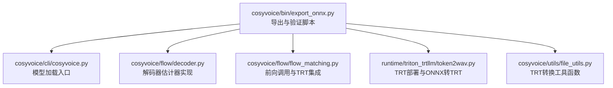
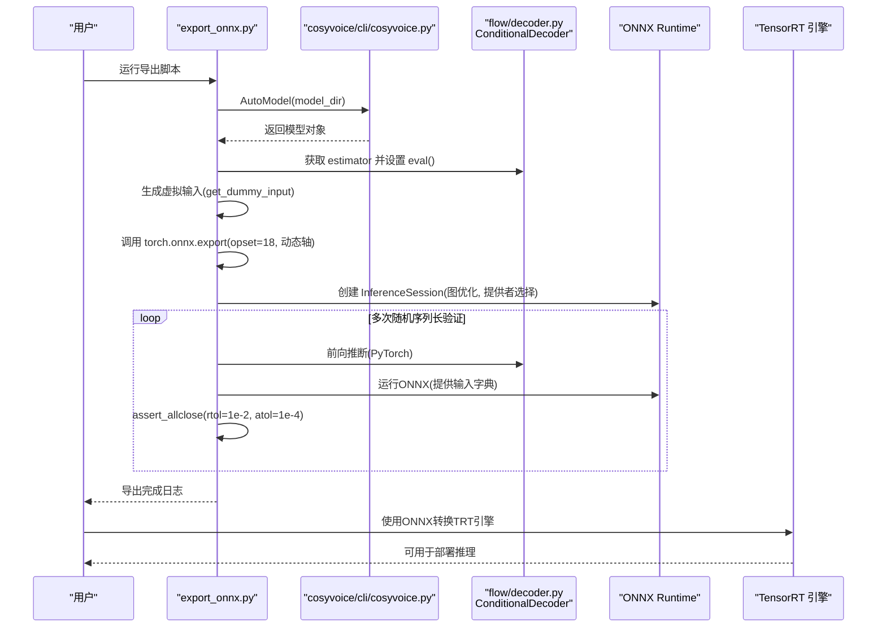
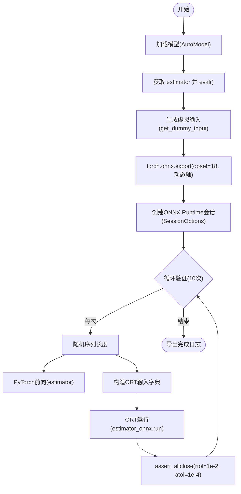
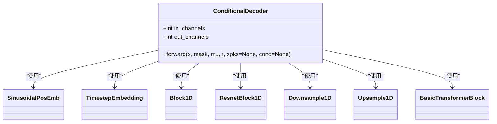
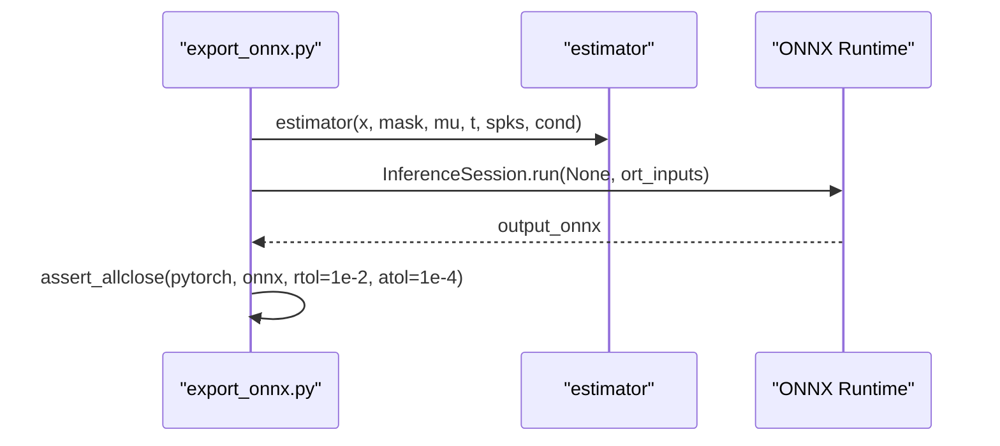
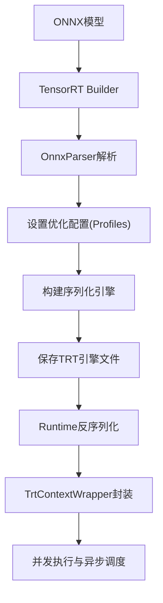
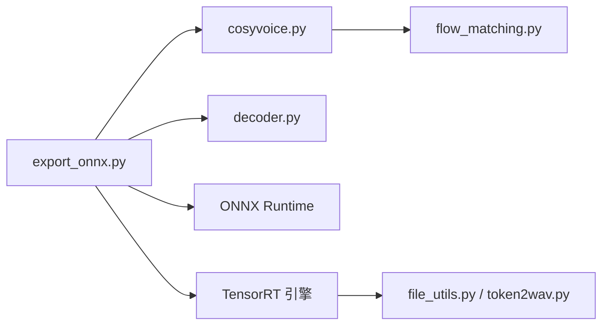

# ONNX模型导出工具

<cite>
**本文引用的文件**
- [export_onnx.py](file://cosyvoice/bin/export_onnx.py)
- [cosyvoice.py](file://cosyvoice/cli/cosyvoice.py)
- [model.py](file://cosyvoice/cli/model.py)
- [decoder.py](file://cosyvoice/flow/decoder.py)
- [flow_matching.py](file://cosyvoice/flow/flow_matching.py)
- [file_utils.py](file://cosyvoice/utils/file_utils.py)
- [token2wav.py](file://runtime/triton_trtllm/token2wav.py)
</cite>

## 目录
1. [简介](#简介)
2. [项目结构](#项目结构)
3. [核心组件](#核心组件)
4. [架构总览](#架构总览)
5. [详细组件分析](#详细组件分析)
6. [依赖关系分析](#依赖关系分析)
7. [性能考量](#性能考量)
8. [故障排查指南](#故障排查指南)
9. [结论](#结论)
10. [附录](#附录)

## 简介
本文件系统性文档化“导出ONNX”工具的功能与实现细节，聚焦于将Flow模型中的“解码器估计器（decoder.estimator）”组件导出为ONNX格式。内容涵盖：
- torch.onnx.export 的关键参数配置（如 opset_version=18、动态轴定义）及其对跨平台兼容性的影响；
- get_dummy_input 生成的虚拟输入张量（x、mask、mu、t、spks、cond）的维度与数据类型要求及语义；
- 导出后通过 ONNX Runtime 进行计算一致性验证的完整流程（会话配置、提供者选择、容差标准）；
- 从模型加载到ONNX验证的端到端示例；
- 在TensorRT等推理引擎中部署时可能遇到的算子支持与性能优化问题。

## 项目结构
该工具位于 cosyvoice/bin/export_onnx.py，围绕 Flow 解码器估计器组件展开，配合 CLI 模型加载与 TRT 部署链路共同构成完整的推理优化闭环。

图示来源
- [export_onnx.py](file://cosyvoice/bin/export_onnx.py#L63-L114)
- [cosyvoice.py](file://cosyvoice/cli/cosyvoice.py#L1-L120)
- [decoder.py](file://cosyvoice/flow/decoder.py#L88-L120)
- [flow_matching.py](file://cosyvoice/flow/flow_matching.py#L126-L153)
- [token2wav.py](file://runtime/triton_trtllm/token2wav.py#L36-L191)
- [file_utils.py](file://cosyvoice/utils/file_utils.py#L53-L81)

章节来源
- [export_onnx.py](file://cosyvoice/bin/export_onnx.py#L63-L114)
- [cosyvoice.py](file://cosyvoice/cli/cosyvoice.py#L1-L120)

## 核心组件
- 导出与验证脚本：负责加载模型、导出解码器估计器为ONNX、并在ONNX Runtime上进行一致性验证。
- CLI模型加载：提供 AutoModel 接口以加载预训练模型，包含 Flow 解码器估计器。
- 解码器估计器：实现 ConditionalDecoder，具备 out_channels 属性，接受多输入张量并输出估计结果。
- 前向与TRT集成：在 flow_matching 中对 estimator 的调用路径与TRT上下文绑定。
- TRT部署：提供将ONNX转换为TensorRT引擎的工具函数与运行时加载逻辑。

章节来源
- [export_onnx.py](file://cosyvoice/bin/export_onnx.py#L63-L114)
- [decoder.py](file://cosyvoice/flow/decoder.py#L88-L120)
- [flow_matching.py](file://cosyvoice/flow/flow_matching.py#L126-L153)
- [token2wav.py](file://runtime/triton_trtllm/token2wav.py#L36-L191)
- [file_utils.py](file://cosyvoice/utils/file_utils.py#L53-L81)

## 架构总览
下图展示从导出到验证再到TRT部署的整体流程。

图示来源
- [export_onnx.py](file://cosyvoice/bin/export_onnx.py#L63-L114)
- [cosyvoice.py](file://cosyvoice/cli/cosyvoice.py#L1-L120)
- [decoder.py](file://cosyvoice/flow/decoder.py#L88-L120)
- [token2wav.py](file://runtime/triton_trtllm/token2wav.py#L36-L191)

## 详细组件分析

### 组件A：导出与验证脚本（export_onnx.py）
- 模型加载：通过 AutoModel(model_dir) 获取模型对象，随后定位到 flow.decoder.estimator。
- 评估模式：将 estimator 设置为 eval()，确保导出行为稳定。
- 虚拟输入生成：get_dummy_input 生成六类输入张量，用于导出与验证。
- ONNX导出：使用 torch.onnx.export，opset_version=18，开启常量折叠，输入/输出命名明确，动态轴仅在时间维（seq_len）生效。
- ONNX Runtime验证：创建 SessionOptions 启用图优化，按需选择 CUDAExecutionProvider 或 CPUExecutionProvider；循环多次随机序列长度测试，使用 torch.testing.assert_allclose 进行数值一致性校验。

图示来源
- [export_onnx.py](file://cosyvoice/bin/export_onnx.py#L63-L114)

章节来源
- [export_onnx.py](file://cosyvoice/bin/export_onnx.py#L63-L114)

### 组件B：虚拟输入张量（get_dummy_input）
- 输入张量清单与语义
  - x：形状 (batch, out_channels, seq_len)，表示输入信号或条件特征，dtype=float32，device与模型一致。
  - mask：形状 (batch, 1, seq_len)，掩码张量，通常用于填充位置屏蔽，dtype=float32。
  - mu：形状 (batch, out_channels, seq_len)，均值或期望特征，dtype=float32。
  - t：形状 (batch,)，时间步或噪声尺度，dtype=float32。
  - spks：形状 (batch, out_channels)，说话人嵌入或条件向量，dtype=float32。
  - cond：形状 (batch, out_channels, seq_len)，额外条件张量，dtype=float32。
- 动态轴设计：导出时仅将 seq_len 设为动态轴，便于跨序列长度推理；其他维度固定。
- 数据类型：统一为 float32，与导出参数 export_params=True、opset=18 兼容。

章节来源
- [export_onnx.py](file://cosyvoice/bin/export_onnx.py#L34-L41)
- [export_onnx.py](file://cosyvoice/bin/export_onnx.py#L71-L87)

### 组件C：解码器估计器（ConditionalDecoder）
- 结构要点
  - out_channels：由构造函数传入并作为最终投影通道数，决定输出通道维度。
  - 时间嵌入与MLP：基于时间步 t 计算时间嵌入并通过MLP映射。
  - 特征拼接：将 x 与 mu 拼接；若存在 spks，则重复扩展至时间维并与 x 拼接；若存在 cond，则同样拼接。
  - 卷积与变换：采用1D卷积、残差块、Transformer块与上/下采样模块构建编码-解码路径，最终通过卷积层输出到 out_channels。
- 输入输出约定
  - 输入：x、mask、mu、t、spks（可选）、cond（可选）。
  - 输出：估计结果张量，通道数为 out_channels，时间维与输入一致。

图示来源
- [decoder.py](file://cosyvoice/flow/decoder.py#L88-L120)
- [decoder.py](file://cosyvoice/flow/decoder.py#L121-L195)

章节来源
- [decoder.py](file://cosyvoice/flow/decoder.py#L88-L120)
- [decoder.py](file://cosyvoice/flow/decoder.py#L121-L195)

### 组件D：ONNX Runtime一致性验证流程
- 会话配置
  - GraphOptimizationLevel 启用全部优化；
  - intra_op_num_threads 设置为1，避免线程竞争导致的非确定性；
  - 提供者选择：优先 CUDAExecutionProvider（若可用），否则回退 CPUExecutionProvider。
- 输入字典构造：将PyTorch张量移至CPU并转为numpy数组，键名与导出时 input_names 对应。
- 一致性校验：比较 PyTorch 输出与 ONNX Runtime 输出，容差标准为 rtol=1e-2、atol=1e-4。

图示来源
- [export_onnx.py](file://cosyvoice/bin/export_onnx.py#L90-L110)

章节来源
- [export_onnx.py](file://cosyvoice/bin/export_onnx.py#L90-L110)

### 组件E：端到端示例（从模型加载到ONNX验证）
- 步骤概览
  1) 通过 AutoModel(model_dir) 加载模型；
  2) 定位 estimator 并设置 eval()；
  3) 生成虚拟输入（固定 batch=2、out_channels 来自 estimator.out_channels）；
  4) 调用 torch.onnx.export 导出为 ONNX；
  5) 创建 ONNX Runtime 会话并进行多次随机长度验证；
  6) 打印成功日志。
- 注意事项
  - 导出时 opset=18，确保新算子与动态轴得到良好支持；
  - 验证阶段使用相同的设备与数据类型，保证数值稳定性。

章节来源
- [export_onnx.py](file://cosyvoice/bin/export_onnx.py#L63-L114)
- [cosyvoice.py](file://cosyvoice/cli/cosyvoice.py#L1-L120)

### 组件F：在TensorRT部署中的算子支持与性能优化
- ONNX到TRT转换
  - 使用 convert_onnx_to_trt 将导出的ONNX模型转换为TensorRT引擎；
  - 需要设置输入张量的最小/最优/最大形状（min/opt/max），并指定输入名称列表；
  - 支持FP16优化（BuilderFlag.FP16），并设置网络dtype与输出dtype。
- TRT运行时加载
  - 通过 trt.Runtime 反序列化引擎字节流，封装为 TrtContextWrapper 以支持并发执行；
  - 在 flow_matching 中，根据输入序列长度动态设置输入形状并异步执行。
- 性能优化建议
  - 合理设置优化配置文件（profile）与批大小范围；
  - 在TRT侧启用FP16（若精度允许）以提升吞吐；
  - 控制工作空间上限，避免OOM；
  - 保持输入张量布局与dtype一致，减少数据搬运。

图示来源
- [file_utils.py](file://cosyvoice/utils/file_utils.py#L53-L81)
- [token2wav.py](file://runtime/triton_trtllm/token2wav.py#L36-L191)
- [flow_matching.py](file://cosyvoice/flow/flow_matching.py#L126-L153)

章节来源
- [file_utils.py](file://cosyvoice/utils/file_utils.py#L53-L81)
- [token2wav.py](file://runtime/triton_trtllm/token2wav.py#L36-L191)
- [flow_matching.py](file://cosyvoice/flow/flow_matching.py#L126-L153)

## 依赖关系分析
- 导出脚本依赖 CLI 模型加载与解码器估计器实现；
- ONNX Runtime 依赖导出的ONNX文件；
- TRT部署依赖ONNX文件与TRT转换工具函数；
- flow_matching 中对 estimator 的调用与TRT上下文绑定，形成端到端推理链路。

图示来源
- [export_onnx.py](file://cosyvoice/bin/export_onnx.py#L63-L114)
- [cosyvoice.py](file://cosyvoice/cli/cosyvoice.py#L1-L120)
- [decoder.py](file://cosyvoice/flow/decoder.py#L88-L120)
- [flow_matching.py](file://cosyvoice/flow/flow_matching.py#L126-L153)
- [file_utils.py](file://cosyvoice/utils/file_utils.py#L53-L81)
- [token2wav.py](file://runtime/triton_trtllm/token2wav.py#L36-L191)

章节来源
- [export_onnx.py](file://cosyvoice/bin/export_onnx.py#L63-L114)
- [cosyvoice.py](file://cosyvoice/cli/cosyvoice.py#L1-L120)
- [decoder.py](file://cosyvoice/flow/decoder.py#L88-L120)
- [flow_matching.py](file://cosyvoice/flow/flow_matching.py#L126-L153)
- [file_utils.py](file://cosyvoice/utils/file_utils.py#L53-L81)
- [token2wav.py](file://runtime/triton_trtllm/token2wav.py#L36-L191)

## 性能考量
- ONNX导出
  - opset=18 提供较新的算子支持，有利于跨平台兼容；
  - 动态轴仅在时间维生效，减少不必要的静态形状约束；
  - 常量折叠有助于简化图结构，降低运行时开销。
- ONNX Runtime
  - 图优化级别启用全部优化，提升执行效率；
  - 提供者选择优先GPU，可显著加速推理；
  - 线程数控制为1，避免非确定性带来的差异。
- TRT部署
  - FP16优化可显著提升吞吐，但需注意精度损失；
  - 合理设置优化配置文件与批大小范围，避免频繁切换导致性能抖动；
  - 控制工作空间上限，防止显存溢出。

[本节为通用性能建议，不直接分析具体文件]

## 故障排查指南
- 导出失败
  - 检查导出参数是否与模型输入匹配（尤其是 out_channels 与动态轴）；
  - 确认 opset 版本与目标运行环境兼容。
- ONNX Runtime 报错
  - 核对输入张量名称与顺序是否与导出时一致；
  - 确保输入dtype为float32且设备一致（CPU->numpy）。
- 一致性验证失败
  - 调整容差 rtol/atol，确认数值范围合理；
  - 检查是否存在随机性或非确定性算子；
  - 确保模型处于 eval() 模式。
- TRT转换失败
  - 检查ONNX解析错误信息，定位不支持的算子；
  - 调整优化配置文件的min/opt/max形状，确保覆盖实际推理场景；
  - 若启用FP16，确认硬件与驱动支持。

章节来源
- [export_onnx.py](file://cosyvoice/bin/export_onnx.py#L90-L110)
- [file_utils.py](file://cosyvoice/utils/file_utils.py#L53-L81)
- [token2wav.py](file://runtime/triton_trtllm/token2wav.py#L36-L191)

## 结论
该导出工具完整实现了将 Flow 解码器估计器导出为ONNX并进行ONNX Runtime一致性验证的全流程。通过合理的导出参数（opset=18、动态轴）与严格的验证策略（rtol=1e-2、atol=1e-4），确保了跨平台部署的可靠性。结合TRT转换与运行时封装，可在生产环境中获得更高的推理性能。建议在部署前充分评估算子支持与精度需求，并针对目标硬件调整优化配置。

[本节为总结性内容，不直接分析具体文件]

## 附录
- 关键参数与约定
  - opset_version：18
  - 动态轴：仅时间维（seq_len）
  - 输入名称：x、mask、mu、t、spks、cond
  - 输出名称：estimator_out
  - 容差标准：rtol=1e-2、atol=1e-4
  - 提供者：CUDAExecutionProvider（可用时）或 CPUExecutionProvider

章节来源
- [export_onnx.py](file://cosyvoice/bin/export_onnx.py#L71-L87)
- [export_onnx.py](file://cosyvoice/bin/export_onnx.py#L90-L110)