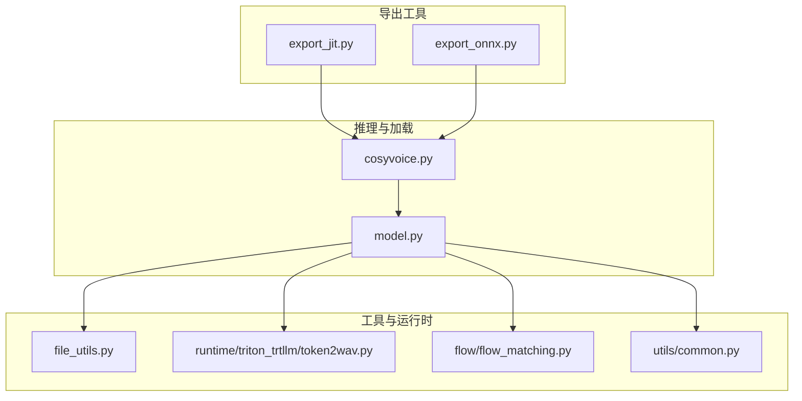
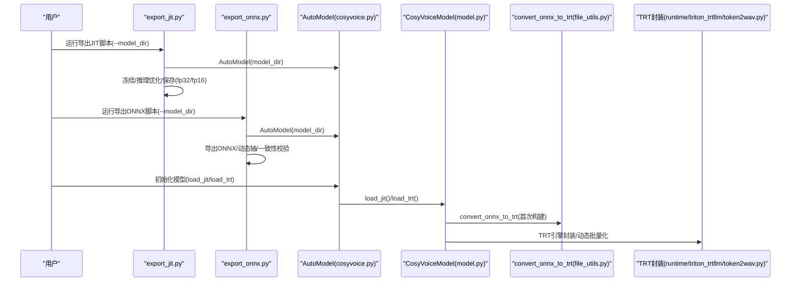
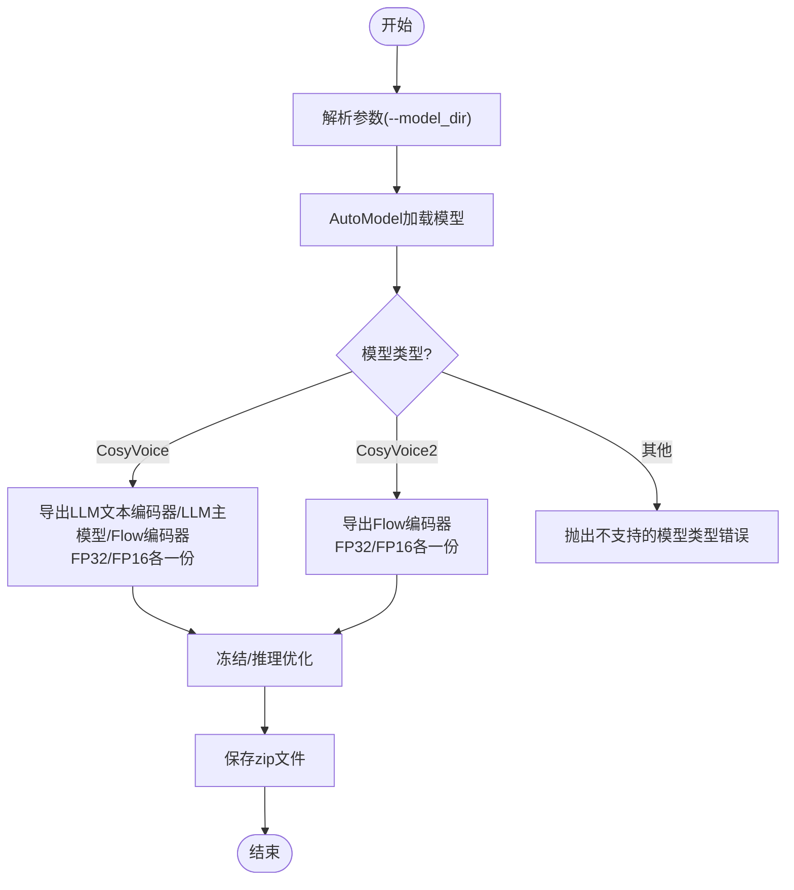
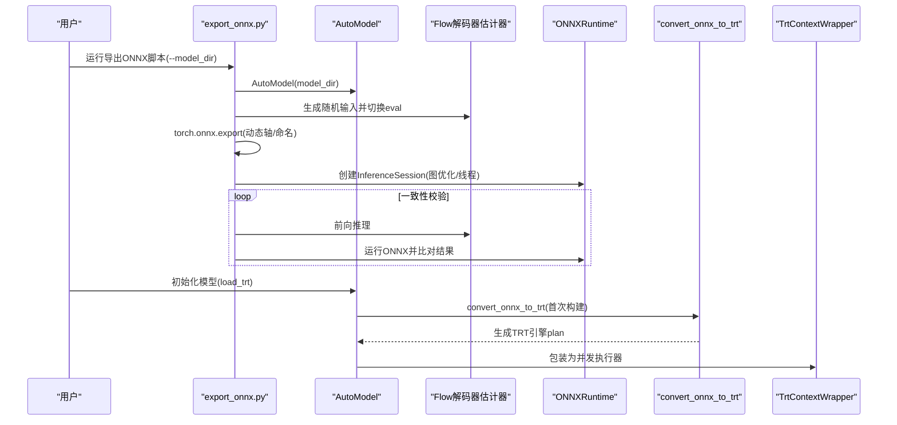
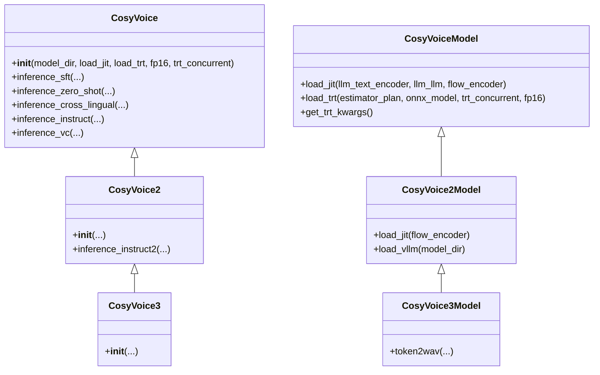
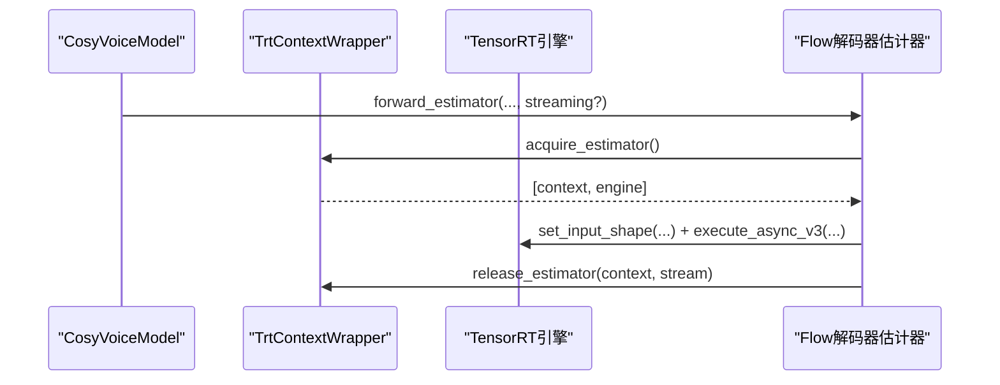
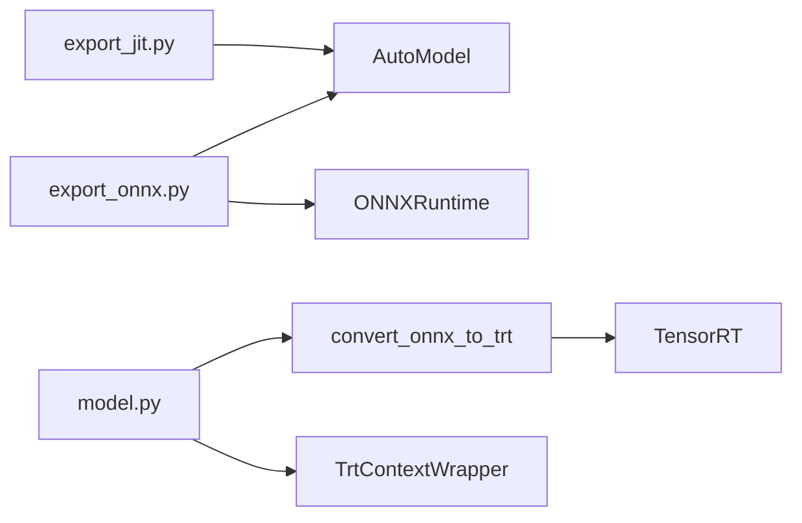

# 模型导出工具

<cite>
**本文引用的文件**
- [export_jit.py](file://cosyvoice/bin/export_jit.py)
- [export_onnx.py](file://cosyvoice/bin/export_onnx.py)
- [cosyvoice.py](file://cosyvoice/cli/cosyvoice.py)
- [model.py](file://cosyvoice/cli/model.py)
- [file_utils.py](file://cosyvoice/utils/file_utils.py)
- [flow_matching.py](file://cosyvoice/flow/flow_matching.py)
- [common.py](file://cosyvoice/utils/common.py)
- [token2wav.py](file://runtime/triton_trtllm/token2wav.py)
</cite>

## 目录
1. [简介](#简介)
2. [项目结构](#项目结构)
3. [核心组件](#核心组件)
4. [架构总览](#架构总览)
5. [详细组件分析](#详细组件分析)
6. [依赖关系分析](#依赖关系分析)
7. [性能考量](#性能考量)
8. [故障排查指南](#故障排查指南)
9. [结论](#结论)
10. [附录](#附录)

## 简介
本文件系统性地文档化两个模型导出工具的工作原理与使用场景：
- export_jit.py：导出 TorchScript（JIT）模型，用于在 C++ 或 Python 环境中进行高性能推理，支持 FP32/FP16 两种精度，并对关键模块进行冻结与推理优化。
- export_onnx.py：导出 ONNX 模型，便于跨平台集成（如 TensorRT、OpenVINO 等），并在导出后进行 PyTorch 与 ONNXRuntime 的计算一致性校验。

同时，本文说明 JIT 编译导出的 TorchScript 模型如何提升推理效率并支持 C++ 部署，而 ONNX 导出则便于跨平台集成（如 TensorRT、OpenVINO）。详细描述每个脚本的参数配置、模型兼容性要求、转换过程中的关键步骤（如 trace/script 模式选择）以及潜在的算子不支持问题。提供从 PyTorch 模型到目标格式的完整转换示例，并对比不同格式在延迟、内存占用方面的差异。

## 项目结构
与导出工具直接相关的文件与职责如下：
- cosyvoice/bin/export_jit.py：导出 TorchScript（JIT）模型，包含参数解析、优化流程与保存逻辑。
- cosyvoice/bin/export_onnx.py：导出 ONNX 模型，包含参数解析、动态轴设置、导出与一致性校验。
- cosyvoice/cli/cosyvoice.py：自动模型工厂与推理入口，支持加载 JIT/TensorRT 组件。
- cosyvoice/cli/model.py：推理模型封装，包含 load_jit、load_trt、get_trt_kwargs 等方法，支撑 JIT/ONNX/TensorRT 的加载与运行。
- cosyvoice/utils/file_utils.py：ONNX 转 TensorRT 的通用转换函数。
- runtime/triton_trtllm/token2wav.py：TRT 推理封装与动态批量化配置，展示 ONNX→TRT 的端到端链路。
- cosyvoice/flow/flow_matching.py：Flow 解码器估计器的执行路径，体现 TRT 引擎调用与输入形状设置。

图表来源
- [export_jit.py](file://cosyvoice/bin/export_jit.py#L1-L100)
- [export_onnx.py](file://cosyvoice/bin/export_onnx.py#L1-L115)
- [cosyvoice.py](file://cosyvoice/cli/cosyvoice.py#L380-L391)
- [model.py](file://cosyvoice/cli/model.py#L97-L145)
- [file_utils.py](file://cosyvoice/utils/file_utils.py#L53-L81)
- [token2wav.py](file://runtime/triton_trtllm/token2wav.py#L173-L191)
- [flow_matching.py](file://cosyvoice/flow/flow_matching.py#L126-L153)
- [common.py](file://cosyvoice/utils/common.py#L198-L213)

章节来源
- [export_jit.py](file://cosyvoice/bin/export_jit.py#L1-L100)
- [export_onnx.py](file://cosyvoice/bin/export_onnx.py#L1-L115)
- [cosyvoice.py](file://cosyvoice/cli/cosyvoice.py#L380-L391)
- [model.py](file://cosyvoice/cli/model.py#L97-L145)

## 核心组件
- TorchScript（JIT）导出组件
  - 参数：--model_dir（本地模型目录）
  - 行为：根据模型类型（CosyVoice/CosyVoice2）导出 LLM 文本编码器、LLM 主模型、Flow 编码器等关键子模块；支持 FP32/FP16 两套文件；对模型进行冻结与推理优化。
- ONNX 导出组件
  - 参数：--model_dir（本地模型目录）
  - 行为：导出 Flow 解码器估计器（estimator）为 ONNX；设置动态轴（序列长度）；导出后使用 ONNXRuntime 进行一致性校验；支持 CUDA/FP16 的 TRT 转换。

章节来源
- [export_jit.py](file://cosyvoice/bin/export_jit.py#L30-L49)
- [export_onnx.py](file://cosyvoice/bin/export_onnx.py#L44-L53)

## 架构总览
下图展示了从 PyTorch 模型到目标格式的转换链路，以及后续加载与运行的关键节点。

图表来源
- [export_jit.py](file://cosyvoice/bin/export_jit.py#L51-L99)
- [export_onnx.py](file://cosyvoice/bin/export_onnx.py#L55-L114)
- [cosyvoice.py](file://cosyvoice/cli/cosyvoice.py#L380-L391)
- [model.py](file://cosyvoice/cli/model.py#L97-L145)
- [file_utils.py](file://cosyvoice/utils/file_utils.py#L53-L81)
- [token2wav.py](file://runtime/triton_trtllm/token2wav.py#L173-L191)

## 详细组件分析

### TorchScript（JIT）导出工具（export_jit.py）
- 参数与入口
  - --model_dir：本地模型目录，默认指向预训练模型路径。
- 模型兼容性与导出范围
  - 支持 CosyVoice 与 CosyVoice2 两类模型类型，分别导出对应的子模块：
    - CosyVoice：LLM 文本编码器、LLM 主模型、Flow 编码器
    - CosyVoice2：Flow 编码器
- 关键步骤
  - 优化流程：torch.jit.script -> freeze -> optimize_for_inference
  - 保存：分别保存 fp32.zip 与 fp16.zip 文件
  - 对某些模块（如 LLM 主模型）保留特定属性以支持分块推理
- 性能与部署
  - 冻结与推理优化可减少运行时开销，适合 C++/Python 环境部署；FP16 可降低显存占用并提升吞吐。

图表来源
- [export_jit.py](file://cosyvoice/bin/export_jit.py#L30-L99)

章节来源
- [export_jit.py](file://cosyvoice/bin/export_jit.py#L30-L99)

### ONNX 导出工具（export_onnx.py）
- 参数与入口
  - --model_dir：本地模型目录，默认指向预训练模型路径。
- 导出对象与范围
  - 导出 Flow 解码器估计器（estimator）为 ONNX，设置动态轴（序列长度）。
- 关键步骤
  - 生成随机输入张量（x、mask、mu、t、spks、cond）
  - torch.onnx.export 导出，opset 版本、常量折叠、输入/输出命名
  - 使用 ONNXRuntime InferenceSession 加载并进行多次随机输入的一致性校验
- 与 TRT 的衔接
  - 导出完成后，可通过 convert_onnx_to_trt 将 ONNX 转为 TensorRT 引擎；推理侧通过 TrtContextWrapper 实现多上下文并发执行。

图表来源
- [export_onnx.py](file://cosyvoice/bin/export_onnx.py#L55-L114)
- [file_utils.py](file://cosyvoice/utils/file_utils.py#L53-L81)
- [token2wav.py](file://runtime/triton_trtllm/token2wav.py#L173-L191)
- [model.py](file://cosyvoice/cli/model.py#L113-L145)

章节来源
- [export_onnx.py](file://cosyvoice/bin/export_onnx.py#L34-L114)
- [file_utils.py](file://cosyvoice/utils/file_utils.py#L53-L81)
- [model.py](file://cosyvoice/cli/model.py#L113-L145)

### 推理与加载（cosyvoice.py 与 model.py）
- 自动模型工厂
  - AutoModel 根据模型目录下的配置文件判断模型类型并返回对应实例（CosyVoice/CosyVoice2/CosyVoice3）。
- 加载 JIT/ONNX/ TensorRT
  - load_jit：加载冻结优化后的 TorchScript 模型组件
  - load_trt：首次构建时将 ONNX 转为 TRT 引擎，随后以并发执行器封装
- TRT 参数
  - get_trt_kwargs/get_trt_kwargs_dynamic_batch：定义最小/最优/最大输入形状与输入名称，支持动态批量化

图表来源
- [cosyvoice.py](file://cosyvoice/cli/cosyvoice.py#L27-L120)
- [cosyvoice.py](file://cosyvoice/cli/cosyvoice.py#L258-L340)
- [cosyvoice.py](file://cosyvoice/cli/cosyvoice.py#L341-L391)
- [model.py](file://cosyvoice/cli/model.py#L97-L145)

章节来源
- [cosyvoice.py](file://cosyvoice/cli/cosyvoice.py#L380-L391)
- [model.py](file://cosyvoice/cli/model.py#L97-L145)

### TRT 执行与动态批量化（flow_matching.py 与 common.py）
- TRT 执行路径
  - 在 Flow 解码器估计器中，通过 TrtContextWrapper 获取执行上下文，设置输入形状并异步执行，随后释放上下文。
- 并发与资源管理
  - TrtContextWrapper 维护固定数量的执行上下文池，避免频繁创建销毁带来的开销。

图表来源
- [flow_matching.py](file://cosyvoice/flow/flow_matching.py#L126-L153)
- [common.py](file://cosyvoice/utils/common.py#L198-L213)

章节来源
- [flow_matching.py](file://cosyvoice/flow/flow_matching.py#L126-L153)
- [common.py](file://cosyvoice/utils/common.py#L198-L213)

## 依赖关系分析
- 导出工具依赖
  - export_jit.py 与 export_onnx.py 均依赖 AutoModel 来加载模型结构与权重。
  - export_onnx.py 在导出后使用 ONNXRuntime 进行一致性校验。
  - model.py 中的 load_trt 与 get_trt_kwargs 为 TRT 集成提供参数与加载逻辑。
- 工具函数依赖
  - file_utils.py 提供 convert_onnx_to_trt，将 ONNX 转为 TensorRT 引擎。
  - runtime/triton_trtllm/token2wav.py 展示了动态批量化与并发执行的 TRT 配置。

图表来源
- [export_jit.py](file://cosyvoice/bin/export_jit.py#L51-L99)
- [export_onnx.py](file://cosyvoice/bin/export_onnx.py#L55-L114)
- [model.py](file://cosyvoice/cli/model.py#L113-L145)
- [file_utils.py](file://cosyvoice/utils/file_utils.py#L53-L81)
- [token2wav.py](file://runtime/triton_trtllm/token2wav.py#L173-L191)

章节来源
- [export_jit.py](file://cosyvoice/bin/export_jit.py#L51-L99)
- [export_onnx.py](file://cosyvoice/bin/export_onnx.py#L55-L114)
- [model.py](file://cosyvoice/cli/model.py#L113-L145)
- [file_utils.py](file://cosyvoice/utils/file_utils.py#L53-L81)
- [token2wav.py](file://runtime/triton_trtllm/token2wav.py#L173-L191)

## 性能考量
- JIT（TorchScript）导出
  - 优点：冻结与推理优化可减少运行时分支与动态开销，适合 C++/Python 部署；FP16 可降低显存占用并提升吞吐。
  - 适用场景：需要低延迟、稳定吞吐、跨平台部署（尤其是 C++ 环境）。
- ONNX 导出
  - 优点：跨平台兼容性强，便于集成 TensorRT/OpenVINO 等推理框架；动态轴支持变长序列。
  - 适用场景：需要在不同硬件/框架上统一部署，或进行端侧/边缘侧优化。
- TRT 集成
  - 通过 convert_onnx_to_trt 构建引擎，结合 TrtContextWrapper 实现多上下文并发执行，显著提升吞吐与稳定性。
  - 动态批量化与形状配置对吞吐影响较大，需根据业务峰值合理设置最小/最优/最大形状。

[本节为通用性能讨论，不直接分析具体文件]

## 故障排查指南
- 算子不支持
  - ONNX 导出可能遇到不支持的算子或动态形状导致导出失败。建议检查模型中使用的算子是否在目标 opset 版本内支持。
- 一致性校验失败
  - export_onnx.py 在导出后会进行 PyTorch 与 ONNXRuntime 的输出一致性校验。若失败，检查输入构造、动态轴设置与精度差异。
- TRT 构建失败
  - convert_onnx_to_trt 在解析 ONNX 时若失败，会打印错误信息。请确认 ONNX 文件有效、输入形状配置正确且满足 TRT 的约束。
- 并发上下文不足
  - TrtContextWrapper 在创建执行上下文失败时会给出提示，通常因显存不足或并发数过大。适当降低并发或调整内存上限。

章节来源
- [export_onnx.py](file://cosyvoice/bin/export_onnx.py#L90-L114)
- [file_utils.py](file://cosyvoice/utils/file_utils.py#L53-L81)
- [common.py](file://cosyvoice/utils/common.py#L198-L213)

## 结论
- export_jit.py 与 export_onnx.py 分别面向“高性能本地部署”和“跨平台集成”的不同需求。前者通过 TorchScript 冻结与推理优化提升吞吐与稳定性，后者通过 ONNX 动态轴与一致性校验确保跨平台一致性，并可无缝衔接 TRT。
- 在实际工程中，建议先使用 export_onnx.py 完成 ONNX 导出与一致性验证，再按需使用 TRT 进行端到端优化；对于需要 C++ 部署或严格控制运行时开销的场景，优先采用 export_jit.py 的 TorchScript 模型。

[本节为总结性内容，不直接分析具体文件]

## 附录
- 使用示例（步骤说明）
  - 导出 TorchScript（JIT）
    - 运行脚本：python cosyvoice/bin/export_jit.py --model_dir <你的模型目录>
    - 输出：llm.text_encoder.fp32.zip、llm.text_encoder.fp16.zip、llm.llm.fp32.zip、llm.llm.fp16.zip、flow.encoder.fp32.zip、flow.encoder.fp16.zip（CosyVoice）或 flow.encoder.fp32.zip、flow.encoder.fp16.zip（CosyVoice2）
  - 导出 ONNX
    - 运行脚本：python cosyvoice/bin/export_onnx.py --model_dir <你的模型目录>
    - 输出：flow.decoder.estimator.fp32.onnx；随后进行一致性校验
  - 加载与运行
    - 初始化模型时传入 load_jit 或 load_trt 参数，自动加载对应组件
    - 若首次加载 TRT，将触发 convert_onnx_to_trt 构建引擎

章节来源
- [export_jit.py](file://cosyvoice/bin/export_jit.py#L51-L99)
- [export_onnx.py](file://cosyvoice/bin/export_onnx.py#L55-L114)
- [cosyvoice.py](file://cosyvoice/cli/cosyvoice.py#L380-L391)
- [model.py](file://cosyvoice/cli/model.py#L97-L145)