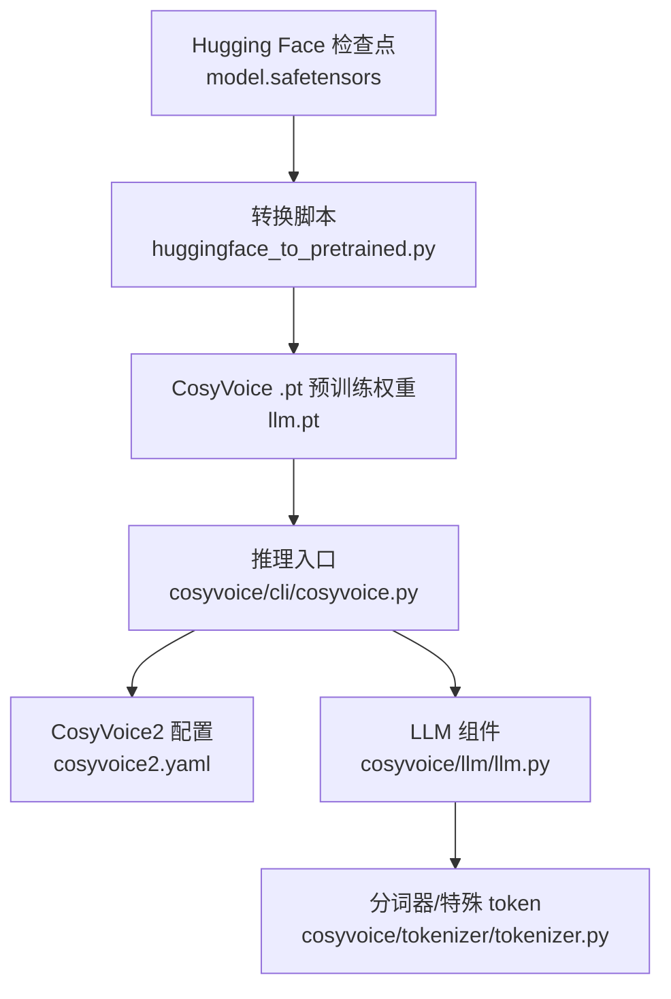
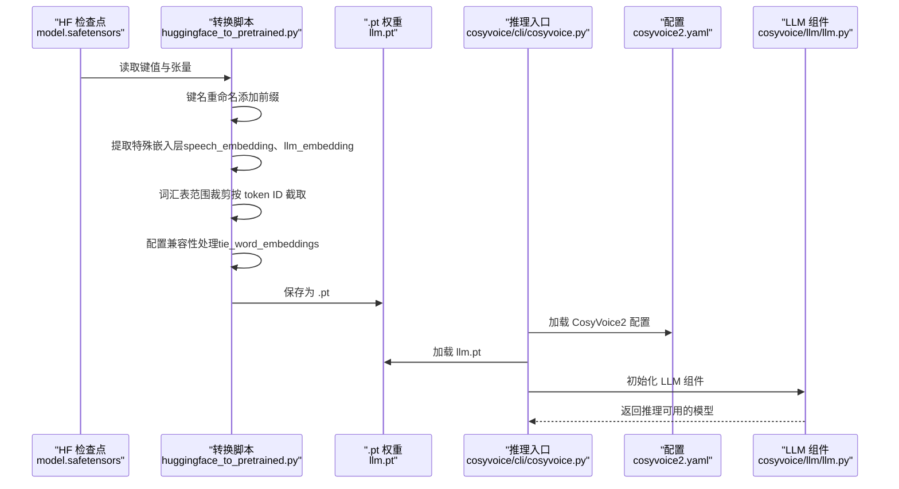
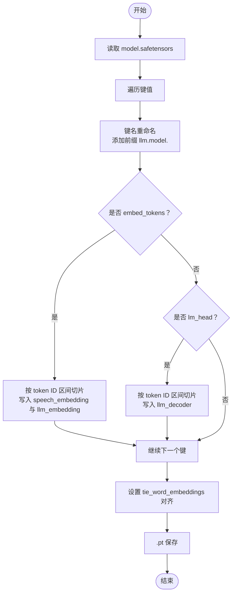
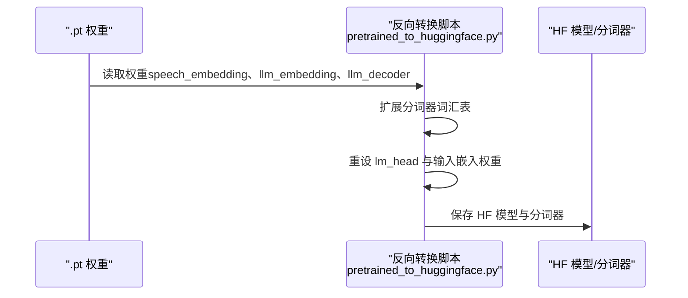
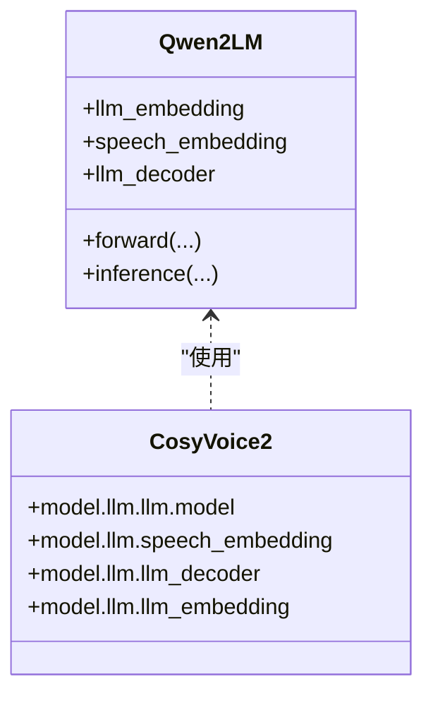
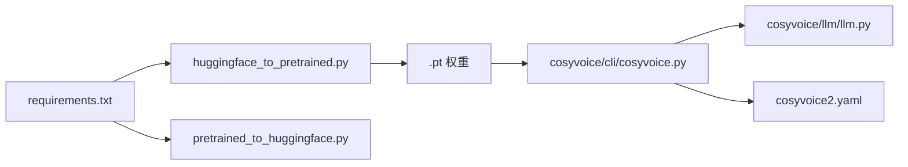

# Hugging Face转预训练模型

<cite>
**本文引用的文件**
- [huggingface_to_pretrained.py](file://examples/grpo/cosyvoice2/huggingface_to_pretrained.py)
- [pretrained_to_huggingface.py](file://examples/grpo/cosyvoice2/pretrained_to_huggingface.py)
- [cosyvoice2.yaml](file://examples/libritts/cosyvoice2/conf/cosyvoice2.yaml)
- [cosyvoice2.yaml（预训练模型）](file://pretrained_models/CosyVoice2-0.5B/cosyvoice2.yaml)
- [llm.py](file://cosyvoice/llm/llm.py)
- [cosyvoice.py](file://cosyvoice/cli/cosyvoice.py)
- [tokenizer.py](file://cosyvoice/tokenizer/tokenizer.py)
- [requirements.txt](file://requirements.txt)
</cite>

## 目录
1. [简介](#简介)
2. [项目结构](#项目结构)
3. [核心组件](#核心组件)
4. [架构总览](#架构总览)
5. [详细组件分析](#详细组件分析)
6. [依赖关系分析](#依赖关系分析)
7. [性能与兼容性考虑](#性能与兼容性考虑)
8. [故障排查指南](#故障排查指南)
9. [结论](#结论)
10. [附录：命令行示例与最佳实践](#附录命令行示例与最佳实践)

## 简介
本文件围绕 `examples/grpo/cosyvoice2/huggingface_to_pretrained.py` 脚本，系统阐述其在模型生态互操作中的关键作用：将 Hugging Face 格式的检查点（如 `model.safetensors`）转换为 CosyVoice 内部使用的 `.pt` 预训练模型格式。重点覆盖以下方面：
- 权重重命名规则（如为键名统一添加 `llm.model.` 前缀）
- 特殊嵌入层提取逻辑（speech_embedding、llm_embedding）
- 词汇表范围裁剪方法（按指定 token ID 区间截取）
- 配置兼容性处理（tie_word_embeddings、lm_head 与 embed_tokens 的对齐）
- 完整转换流程的命令行示例与常见错误定位

该脚本使外部以 Transformers 训练的 CosyVoice2 LLM 检查点能够无缝接入 CosyVoice 推理管线，实现“外部训练、本地推理”的生态闭环。

## 项目结构
与本主题直接相关的文件与模块分布如下：
- 转换脚本：examples/grpo/cosyvoice2/huggingface_to_pretrained.py
- 反向转换脚本：examples/grpo/cosyvoice2/pretrained_to_huggingface.py
- CosyVoice2 配置：examples/libritts/cosyvoice2/conf/cosyvoice2.yaml 与 pretrained_models/CosyVoice2-0.5B/cosyvoice2.yaml
- LLM 实现与推理入口：cosyvoice/llm/llm.py、cosyvoice/cli/cosyvoice.py
- 分词器与特殊 token：cosyvoice/tokenizer/tokenizer.py
- 依赖声明：requirements.txt

图表来源
- [huggingface_to_pretrained.py](file://examples/grpo/cosyvoice2/huggingface_to_pretrained.py#L44-L72)
- [cosyvoice.py](file://cosyvoice/cli/cosyvoice.py#L258-L311)
- [cosyvoice2.yaml](file://examples/libritts/cosyvoice2/conf/cosyvoice2.yaml#L23-L37)
- [llm.py](file://cosyvoice/llm/llm.py#L261-L304)
- [tokenizer.py](file://cosyvoice/tokenizer/tokenizer.py#L241-L328)

章节来源
- [huggingface_to_pretrained.py](file://examples/grpo/cosyvoice2/huggingface_to_pretrained.py#L44-L72)
- [cosyvoice.py](file://cosyvoice/cli/cosyvoice.py#L258-L311)
- [cosyvoice2.yaml](file://examples/libritts/cosyvoice2/conf/cosyvoice2.yaml#L23-L37)

## 核心组件
- 转换脚本（huggingface_to_pretrained.py）
  - 读取 Hugging Face 格式检查点，重命名键名并提取特殊嵌入层，生成 CosyVoice 兼容的 .pt 文件。
- 反向转换脚本（pretrained_to_huggingface.py）
  - 将 CosyVoice 的 .pt 权重回写为 Hugging Face 格式，便于二次训练或分享。
- CosyVoice2 配置（cosyvoice2.yaml）
  - 定义模型参数、词汇表大小、采样策略等，支撑推理时的权重尺寸与行为一致性。
- LLM 组件（llm.py）
  - 定义 Qwen2LM 的嵌入、解码器、停止 token 等，决定 .pt 中权重的形状与用途。
- 推理入口（cosyvoice.py）
  - 加载 llm.pt 并完成推理初始化，验证 .pt 与配置的一致性。
- 分词器（tokenizer.py）
  - 提供特殊 token 与编码/解码能力，影响词汇表扩展与权重对齐。

章节来源
- [huggingface_to_pretrained.py](file://examples/grpo/cosyvoice2/huggingface_to_pretrained.py#L44-L72)
- [pretrained_to_huggingface.py](file://examples/grpo/cosyvoice2/pretrained_to_huggingface.py#L52-L121)
- [cosyvoice2.yaml](file://examples/libritts/cosyvoice2/conf/cosyvoice2.yaml#L23-L37)
- [llm.py](file://cosyvoice/llm/llm.py#L261-L304)
- [cosyvoice.py](file://cosyvoice/cli/cosyvoice.py#L258-L311)
- [tokenizer.py](file://cosyvoice/tokenizer/tokenizer.py#L241-L328)

## 架构总览
下图展示从 Hugging Face 检查点到 CosyVoice 推理的关键路径与数据流。

图表来源
- [huggingface_to_pretrained.py](file://examples/grpo/cosyvoice2/huggingface_to_pretrained.py#L44-L72)
- [cosyvoice.py](file://cosyvoice/cli/cosyvoice.py#L258-L311)
- [cosyvoice2.yaml](file://examples/libritts/cosyvoice2/conf/cosyvoice2.yaml#L23-L37)
- [llm.py](file://cosyvoice/llm/llm.py#L261-L304)

## 详细组件分析

### 转换脚本工作流与规则
- 键名重命名
  - 将所有键名统一添加前缀 `llm.model.`，以适配 CosyVoice 内部加载逻辑。
- 特殊嵌入层提取
  - 当遇到以 `model.embed_tokens` 开头的权重时，将其切片并分别赋给：
    - `speech_embedding.weight`：对应语音 token 的嵌入矩阵
    - `llm_embedding.weight`：对应 LLM 自身特殊 token 的嵌入矩阵
  - 同时，当遇到以 `lm_head` 开头的权重时，将其切片并写入：
    - `llm_decoder.weight` 与 `llm_decoder.bias`
- 词汇表范围裁剪
  - 使用分词器中的起始 token ID，按固定大小截取语音 token 范围，确保权重维度与配置一致。
- 配置兼容性处理
  - 设置 `tie_word_embeddings=True`，使 `embed_tokens` 与 `lm_head` 对齐，避免维度不一致导致的加载失败。

图表来源
- [huggingface_to_pretrained.py](file://examples/grpo/cosyvoice2/huggingface_to_pretrained.py#L44-L72)

章节来源
- [huggingface_to_pretrained.py](file://examples/grpo/cosyvoice2/huggingface_to_pretrained.py#L44-L72)

### 反向转换与生态闭环
- 反向转换脚本将 CosyVoice 的 .pt 权重回写为 Hugging Face 格式，包括：
  - 扩展分词器词汇表，加入语音 token 与特殊 token
  - 重新对齐输入嵌入与 lm_head，使其与扩展后的词表大小一致
  - 保存模型与分词器，便于后续微调或发布

图表来源
- [pretrained_to_huggingface.py](file://examples/grpo/cosyvoice2/pretrained_to_huggingface.py#L52-L121)

章节来源
- [pretrained_to_huggingface.py](file://examples/grpo/cosyvoice2/pretrained_to_huggingface.py#L52-L121)

### LLM 组件与权重形状约束
- Qwen2LM 的嵌入与解码器
  - `speech_embedding`：维度与 `llm.model.model.embed_tokens` 的输出维度一致
  - `llm_embedding`：维度与 LLM 自身特殊 token 数量一致
  - `llm_decoder`：输出维度等于语音 token 数量 + 特殊 token 数量
- 推理入口加载
  - 推理入口会从 .pt 中加载上述权重，并根据配置文件校验维度一致性

图表来源
- [llm.py](file://cosyvoice/llm/llm.py#L261-L304)
- [cosyvoice.py](file://cosyvoice/cli/cosyvoice.py#L258-L311)

章节来源
- [llm.py](file://cosyvoice/llm/llm.py#L261-L304)
- [cosyvoice.py](file://cosyvoice/cli/cosyvoice.py#L258-L311)

### 配置兼容性与词汇表范围
- 配置文件中的关键参数
  - 语音 token 数量、采样策略、模型尺寸等，直接影响 .pt 中权重的形状与行为
- 词汇表范围裁剪
  - 转换脚本依据分词器起始 token ID 与固定大小，对嵌入层进行区间截取，确保与配置一致

章节来源
- [cosyvoice2.yaml](file://examples/libritts/cosyvoice2/conf/cosyvoice2.yaml#L23-L37)
- [cosyvoice2.yaml（预训练模型）](file://pretrained_models/CosyVoice2-0.5B/cosyvoice2.yaml#L23-L37)
- [huggingface_to_pretrained.py](file://examples/grpo/cosyvoice2/huggingface_to_pretrained.py#L44-L72)

## 依赖关系分析
- 运行时依赖
  - PyTorch、Transformers、safetensors 等库用于张量读取、模型加载与权重保存
- 脚本间耦合
  - 转换脚本与推理入口通过 .pt 文件耦合；反向转换脚本与转换脚本形成生态闭环
- 外部训练到本地推理的桥接
  - 外部以 Transformers 训练的模型权重经转换脚本适配后，可被 CosyVoice 推理入口直接加载

图表来源
- [requirements.txt](file://requirements.txt#L1-L43)
- [huggingface_to_pretrained.py](file://examples/grpo/cosyvoice2/huggingface_to_pretrained.py#L44-L72)
- [pretrained_to_huggingface.py](file://examples/grpo/cosyvoice2/pretrained_to_huggingface.py#L52-L121)
- [cosyvoice.py](file://cosyvoice/cli/cosyvoice.py#L258-L311)
- [llm.py](file://cosyvoice/llm/llm.py#L261-L304)
- [cosyvoice2.yaml](file://examples/libritts/cosyvoice2/conf/cosyvoice2.yaml#L23-L37)

章节来源
- [requirements.txt](file://requirements.txt#L1-L43)
- [huggingface_to_pretrained.py](file://examples/grpo/cosyvoice2/huggingface_to_pretrained.py#L44-L72)
- [pretrained_to_huggingface.py](file://examples/grpo/cosyvoice2/pretrained_to_huggingface.py#L52-L121)
- [cosyvoice.py](file://cosyvoice/cli/cosyvoice.py#L258-L311)
- [llm.py](file://cosyvoice/llm/llm.py#L261-L304)
- [cosyvoice2.yaml](file://examples/libritts/cosyvoice2/conf/cosyvoice2.yaml#L23-L37)

## 性能与兼容性考虑
- 性能
  - 使用 safetensors 读取权重，避免 Python pickle 的安全与性能问题
  - tie_word_embeddings 可减少冗余参数，提升加载与推理效率
- 兼容性
  - 键名统一前缀与词汇表区间裁剪，确保与 CosyVoice 内部期望一致
  - 配置文件与 .pt 权重的维度必须严格匹配，否则加载阶段会报错

[本节提供通用建议，无需特定文件分析]

## 故障排查指南
- 常见错误与定位
  - 键名不匹配：检查是否正确添加 `llm.model.` 前缀
  - 缺失 `model.safetensors` 文件：确认传入的 Hugging Face 路径是否包含该文件
  - 词汇表维度不一致：核对分词器起始 token ID 与固定大小，确保裁剪区间正确
  - tie_word_embeddings 未对齐：确认转换脚本中已设置该选项
- 解决方案
  - 重新运行转换脚本，确保路径与参数正确
  - 对照配置文件核对权重维度，必要时调整裁剪区间
  - 在推理入口加载前打印 .pt 中的权重键名，比对预期键名

章节来源
- [huggingface_to_pretrained.py](file://examples/grpo/cosyvoice2/huggingface_to_pretrained.py#L44-L72)
- [cosyvoice.py](file://cosyvoice/cli/cosyvoice.py#L258-L311)

## 结论
huggingface_to_pretrained.py 脚本通过标准化键名、提取特殊嵌入层、裁剪词汇表范围与配置兼容性处理，实现了 Hugging Face 检查点到 CosyVoice .pt 的高效转换。配合 pretrained_to_huggingface.py，形成了“外部训练—本地推理—再导出”的完整生态闭环，显著降低了模型生态互操作的门槛。

[本节为总结性内容，无需特定文件分析]

## 附录：命令行示例与最佳实践
- 转换命令示例
  - 将 Hugging Face 格式的 CosyVoice2 LLM 检查点转换为 .pt：
    - 示例命令：python3 huggingface_to_pretrained.py --hf-cosyvoice2-llm-path /workspace/rl-exp/checkpoint-400 --output-path /workspace/CosyVoice2-0.5B/llm-new.pt
- 最佳实践
  - 确保 Hugging Face 路径包含 model.safetensors
  - 在转换前核对配置文件中的语音 token 数量与采样策略
  - 转换完成后，使用推理入口加载 .pt 并进行小规模推理验证
  - 如需二次训练，可使用反向转换脚本导出 HF 格式

章节来源
- [huggingface_to_pretrained.py](file://examples/grpo/cosyvoice2/huggingface_to_pretrained.py#L17-L18)
- [pretrained_to_huggingface.py](file://examples/grpo/cosyvoice2/pretrained_to_huggingface.py#L52-L121)
- [cosyvoice.py](file://cosyvoice/cli/cosyvoice.py#L258-L311)