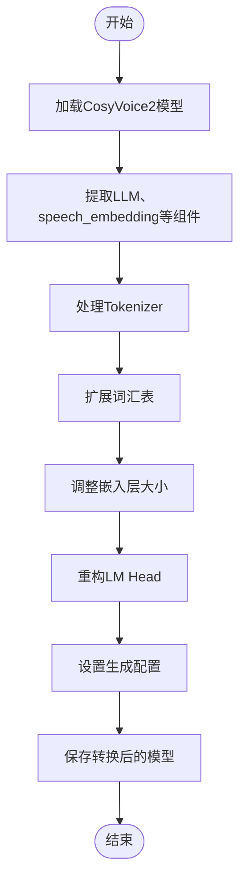
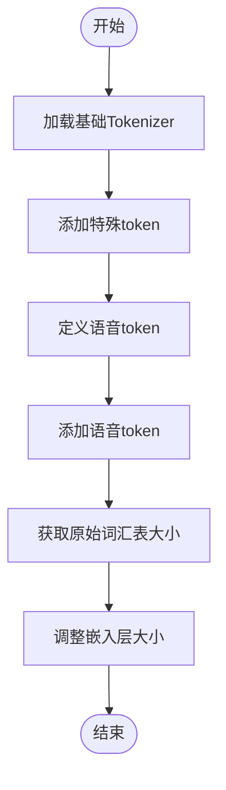
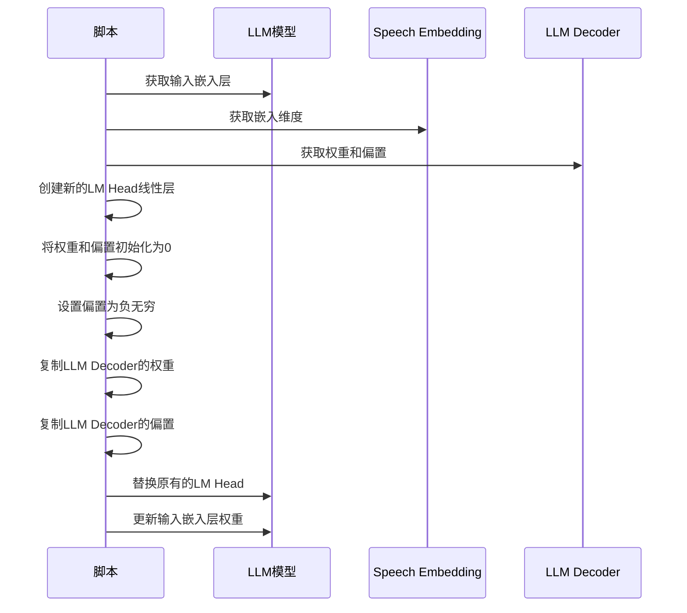
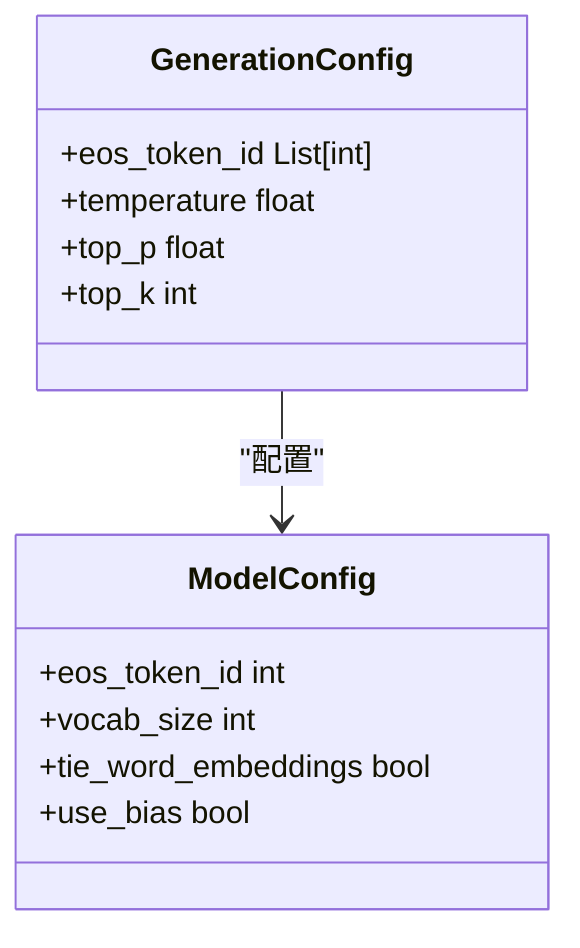
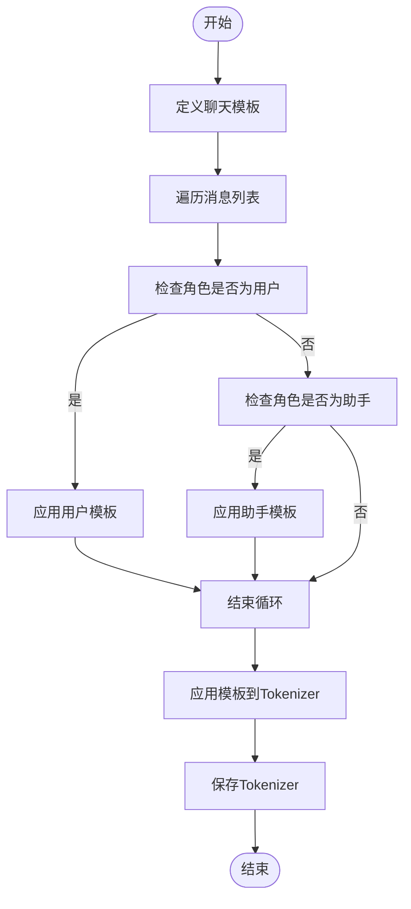

# 预训练模型转Hugging Face

<cite>
**本文档引用的文件**
- [pretrained_to_huggingface.py](file://examples/grpo/cosyvoice2/pretrained_to_huggingface.py)
- [cosyvoice.py](file://cosyvoice/cli/cosyvoice.py)
- [model.py](file://cosyvoice/cli/model.py)
- [llm.py](file://cosyvoice/llm/llm.py)
- [file_utils.py](file://cosyvoice/utils/file_utils.py)
- [huggingface_to_pretrained.py](file://examples/grpo/cosyvoice2/huggingface_to_pretrained.py)
- [cosyvoice2.yaml](file://pretrained_models/CosyVoice2-0.5B/cosyvoice2.yaml)
</cite>

## 目录
1. [简介](#简介)
2. [核心组件分析](#核心组件分析)
3. [转换流程详解](#转换流程详解)
4. [关键配置与参数](#关键配置与参数)
5. [实际调用示例](#实际调用示例)
6. [注意事项与最佳实践](#注意事项与最佳实践)
7. [模型验证方法](#模型验证方法)
8. [双向转换支持](#双向转换支持)

## 简介
`pretrained_to_huggingface.py`脚本实现了将CosyVoice本地预训练模型转换为标准Hugging Face Transformers格式的功能。该转换过程使得模型能够无缝集成到Hugging Face生态系统中，便于模型的共享、发布和使用。转换后的模型可以利用Hugging Face提供的丰富工具链进行推理、微调和部署。

## 核心组件分析

该转换脚本主要涉及以下几个核心组件：

1. **CosyVoice2类**：作为模型的主要接口，负责加载和管理LLM、Flow和HiFi-GAN三个子模型。
2. **LLM组件**：基于Qwen2架构的大语言模型，负责生成语音token。
3. **Speech Embedding**：用于将语音token嵌入到向量空间中。
4. **Tokenizer**：负责文本和语音token的编码与解码。

**Section sources**
- [cosyvoice.py](file://cosyvoice/cli/cosyvoice.py#L258-L339)
- [model.py](file://cosyvoice/cli/model.py#L370-L559)
- [llm.py](file://cosyvoice/llm/llm.py#L33-L228)

## 转换流程详解

### 模型加载与初始化
转换过程首先通过`CosyVoice2`类加载预训练模型，获取LLM、speech_embedding等关键组件。



**Diagram sources**
- [pretrained_to_huggingface.py](file://examples/grpo/cosyvoice2/pretrained_to_huggingface.py#L54-L63)

### Tokenizer处理
脚本首先加载基础Tokenizer，然后添加特殊token并扩展词汇表以包含语音token。



**Diagram sources**
- [pretrained_to_huggingface.py](file://examples/grpo/cosyvoice2/pretrained_to_huggingface.py#L64-L87)

### LM Head重构
重构LM Head线性层并初始化权重是转换过程中的关键步骤。



**Diagram sources**
- [pretrained_to_huggingface.py](file://examples/grpo/cosyvoice2/pretrained_to_huggingface.py#L90-L107)

## 关键配置与参数

### 生成配置设置
转换过程中设置了生成配置，包括EOS token ID、温度、top_p和top_k等参数。



**Diagram sources**
- [pretrained_to_huggingface.py](file://examples/grpo/cosyvoice2/pretrained_to_huggingface.py#L108-L120)

### 聊天模板设置
脚本设置了特定的聊天模板，用于指导模型的对话行为。



**Diagram sources**
- [pretrained_to_huggingface.py](file://examples/grpo/cosyvoice2/pretrained_to_huggingface.py#L123-L133)

## 实际调用示例

转换脚本可以通过命令行参数进行调用：

```bash
python3 pretrained_to_huggingface.py \
    --pretrained-cosyvoice2-path /workspace/CosyVoice2-0.5B \
    --save-path ./transformers_cosyvoice2_llm
```

**Section sources**
- [pretrained_to_huggingface.py](file://examples/grpo/cosyvoice2/pretrained_to_huggingface.py#L33-L49)

## 注意事项与最佳实践

### 关键注意事项
1. **禁用tie_word_embeddings**：在转换过程中必须禁用词嵌入权重共享，以确保语音token的正确处理。
2. **Bias初始化策略**：新的LM Head偏置被初始化为负无穷，以防止模型在生成过程中过早地生成EOS token。
3. **Token ID映射偏移计算**：需要正确计算语音token在扩展后词汇表中的位置偏移。

### 最佳实践
1. **精度选择**：建议使用bfloat16精度以平衡性能和内存占用。
2. **词汇表大小对齐**：调整嵌入层大小时使用pad_to_multiple_of=128参数，以优化GPU内存访问效率。
3. **配置一致性**：确保转换前后模型配置的一致性，避免潜在的兼容性问题。

**Section sources**
- [pretrained_to_huggingface.py](file://examples/grpo/cosyvoice2/pretrained_to_huggingface.py#L118-L120)
- [file_utils.py](file://cosyvoice/utils/file_utils.py#L111-L112)

## 模型验证方法

转换后的模型可以通过以下方法进行验证：
1. **结构验证**：检查模型文件是否完整，包括config.json、pytorch_model.bin等。
2. **功能验证**：使用Hugging Face的AutoModelForCausalLM加载转换后的模型，进行简单的推理测试。
3. **性能验证**：比较转换前后模型的推理速度和内存占用。

**Section sources**
- [pretrained_to_huggingface.py](file://examples/grpo/cosyvoice2/pretrained_to_huggingface.py#L121-L133)

## 双向转换支持

项目还提供了`huggingface_to_pretrained.py`脚本，支持将Hugging Face格式的模型转换回本地预训练格式，实现了双向转换能力。

```mermaid
flowchart LR
Pretrained[本地预训练模型] < --> |pretrained_to_huggingface.py| HF[Hugging Face模型]
HF < --> |huggingface_to_pretrained.py| Pretrained
```

**Diagram sources**
- [huggingface_to_pretrained.py](file://examples/grpo/cosyvoice2/huggingface_to_pretrained.py#L47-L71)

**Section sources**
- [huggingface_to_pretrained.py](file://examples/grpo/cosyvoice2/huggingface_to_pretrained.py#L1-L72)