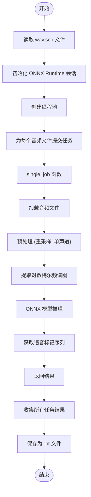
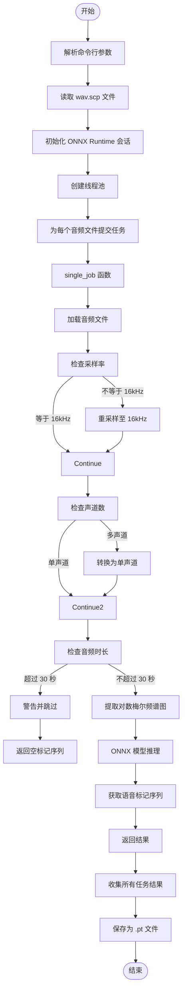

# 语音标记提取工具

<cite>
**本文档引用文件**  
- [extract_speech_token.py](file://tools/extract_speech_token.py)
- [frontend.py](file://cosyvoice/cli/frontend.py)
- [tokenizer.py](file://cosyvoice/tokenizer/tokenizer.py)
- [file_utils.py](file://cosyvoice/utils/file_utils.py)
- [requirements.txt](file://requirements.txt)
</cite>

## 目录
1. [简介](#简介)
2. [项目结构](#项目结构)
3. [核心组件](#核心组件)
4. [架构概述](#架构概述)
5. [详细组件分析](#详细组件分析)
6. [依赖分析](#依赖分析)
7. [性能考量](#性能考量)
8. [故障排除指南](#故障排除指南)
9. [结论](#结论)

## 简介
`extract_speech_token.py` 是 CosyVoice 项目中的一个关键工具，用于将语音波形转换为离散的语音标记序列（speech tokens）。这些语音标记在模型训练、数据集构建和质量评估中起着重要作用。该工具利用预训练的 ONNX 模型和 Whisper 的对数梅尔频谱图提取技术，将输入的语音信号转换为可用于后续处理的离散标记序列。文档将深入解析其工作机制，涵盖输入输出格式、依赖组件（如 tokenizer 模块）及处理流程，并提供实际调用命令和输出示例。

## 项目结构
CosyVoice 项目采用模块化设计，主要包含以下几个目录：
- `cosyvoice/`: 核心代码库，包括 bin、cli、dataset、flow、hifigan、llm、tokenizer、transformer、utils 和 vllm 等子模块。
- `docker/`: Docker 相关配置文件。
- `examples/`: 示例脚本和配置文件，用于演示不同场景下的使用方法。
- `runtime/`: 运行时环境配置，支持 FastAPI 和 gRPC 服务。
- `third_party/Matcha-TTS/`: 第三方依赖库 Matcha-TTS。
- `tools/`: 工具脚本，包括 `extract_embedding.py`、`extract_speech_token.py` 和 `make_parquet_list.py`。

**Diagram sources**
- [extract_speech_token.py](file://tools/extract_speech_token.py)

## 核心组件
`extract_speech_token.py` 的核心功能是通过预训练的 ONNX 模型将语音波形转换为离散的语音标记序列。该工具依赖于 Whisper 的对数梅尔频谱图提取技术和 ONNX Runtime 进行推理。主要组件包括：
- `single_job(utt)`: 处理单个音频文件的函数，负责加载音频、重采样、转换为单声道、提取对数梅尔频谱图，并通过 ONNX 模型生成语音标记。
- `main(args)`: 主函数，读取 `wav.scp` 文件，创建线程池并提交任务，收集结果并保存到指定目录。

**Section sources**
- [extract_speech_token.py](file://tools/extract_speech_token.py)

## 架构概述
`extract_speech_token.py` 的工作流程如下：
1. 读取 `wav.scp` 文件，获取音频文件路径映射。
2. 初始化 ONNX Runtime 会话，加载预训练的语音分词器模型。
3. 创建线程池，为每个音频文件提交处理任务。
4. 在 `single_job` 函数中，加载音频文件，进行必要的预处理（重采样、单声道转换），提取对数梅尔频谱图。
5. 将对数梅尔频谱图输入 ONNX 模型，获取语音标记序列。
6. 收集所有任务的结果，保存为 `.pt` 文件。

**Diagram sources**
- [extract_speech_token.py](file://tools/extract_speech_token.py)

## 详细组件分析
### extract_speech_token.py 分析
`extract_speech_token.py` 是一个独立的工具脚本，用于批量提取语音标记。它通过命令行参数接收输入目录、ONNX 模型路径和线程数。脚本首先读取 `wav.scp` 文件，构建音频文件路径映射。然后初始化 ONNX Runtime 会话，加载预训练的语音分词器模型。接着创建线程池，为每个音频文件提交处理任务。在 `single_job` 函数中，加载音频文件，进行必要的预处理（重采样至 16kHz、转换为单声道），提取对数梅尔频谱图，并通过 ONNX 模型生成语音标记序列。最后，收集所有任务的结果，保存为 `.pt` 文件。

#### 处理流程

**Diagram sources**
- [extract_speech_token.py](file://tools/extract_speech_token.py)

**Section sources**
- [extract_speech_token.py](file://tools/extract_speech_token.py)

## 依赖分析
`extract_speech_token.py` 依赖于多个外部库和内部模块：
- **外部库**:
  - `torch`: PyTorch 深度学习框架。
  - `torchaudio`: PyTorch 音频处理库。
  - `onnxruntime`: ONNX 模型推理库。
  - `whisper`: Whisper 模型的对数梅尔频谱图提取功能。
  - `tqdm`: 进度条显示库。
- **内部模块**:
  - `cosyvoice.utils.file_utils.load_wav`: 加载音频文件的工具函数。
  - `cosyvoice.cli.frontend._extract_speech_token`: 提取语音标记的核心函数。
  - `cosyvoice.tokenizer.tokenizer`: 文本分词器模块。

**Section sources**
- [extract_speech_token.py](file://tools/extract_speech_token.py)
- [frontend.py](file://cosyvoice/cli/frontend.py)
- [tokenizer.py](file://cosyvoice/tokenizer/tokenizer.py)
- [file_utils.py](file://cosyvoice/utils/file_utils.py)

## 性能考量
`extract_speech_token.py` 的性能受多个因素影响：
- **音频时长**: 脚本不支持超过 30 秒的音频文件，这限制了处理长音频的能力。
- **线程数**: 通过 `--num_thread` 参数可以调整线程数，以充分利用多核 CPU 的并行处理能力。
- **GPU 加速**: ONNX Runtime 支持 CUDA 执行提供者，可以在支持的硬件上启用 GPU 加速，显著提升推理速度。
- **批量处理**: 当前实现为每个音频文件单独提交任务，未来可以考虑批量处理以进一步提高效率。

## 故障排除指南
### 常见问题
- **音频文件无法加载**: 确保音频文件路径正确且文件存在。
- **采样率不匹配**: 脚本会自动将非 16kHz 的音频重采样至 16kHz，但可能会影响音质。
- **音频时长超过 30 秒**: 脚本会跳过超过 30 秒的音频文件，需要预先分割长音频。
- **ONNX 模型加载失败**: 确保 ONNX 模型路径正确且模型文件完整。

**Section sources**
- [extract_speech_token.py](file://tools/extract_speech_token.py)

## 结论
`extract_speech_token.py` 是 CosyVoice 项目中一个重要的工具，用于将语音波形转换为离散的语音标记序列。通过深入解析其工作机制，我们了解了其如何利用预训练模型和 Whisper 的对数梅尔频谱图提取技术，将输入的语音信号转换为可用于后续处理的离散标记序列。该工具在模型训练、数据集构建和质量评估中发挥着关键作用。未来可以通过优化批量处理和启用 GPU 加速来进一步提升其性能。