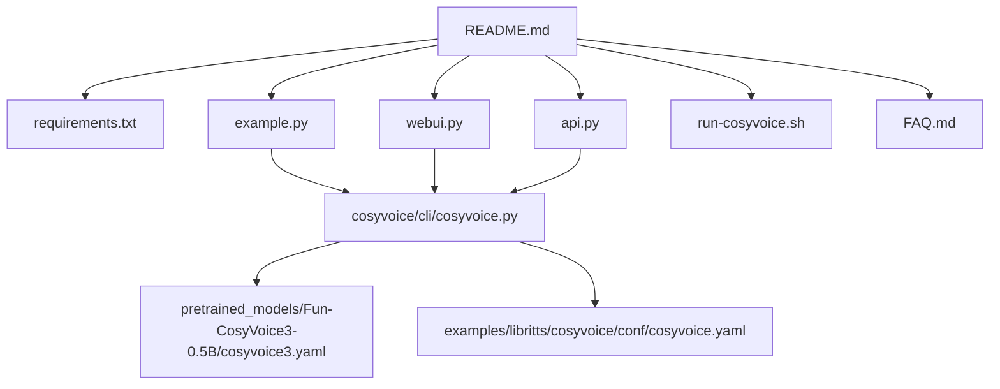
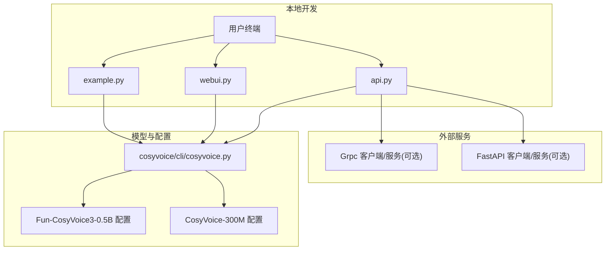
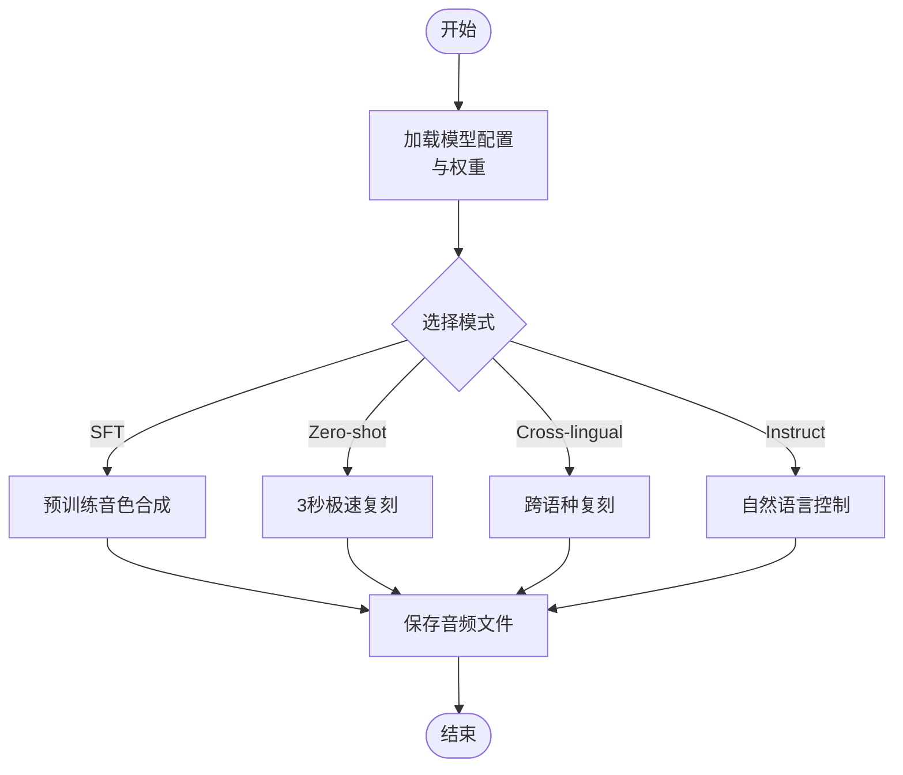
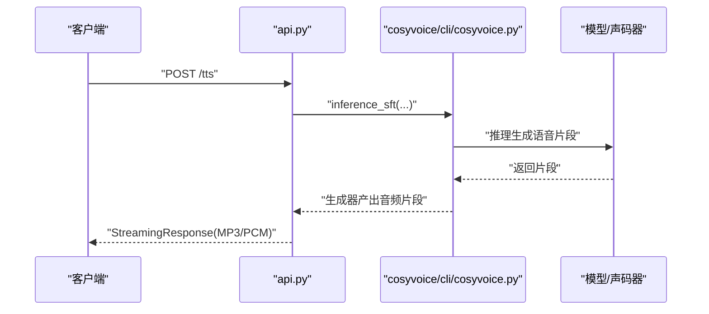
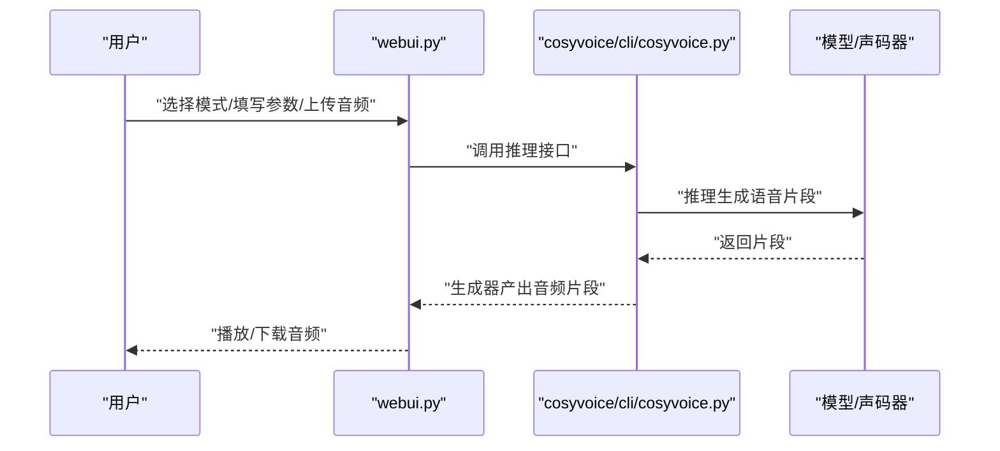
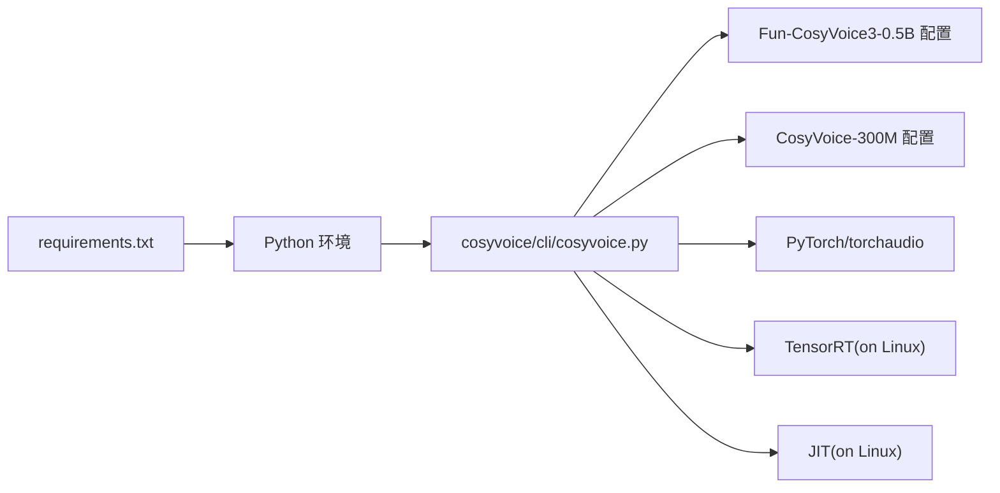

# 快速开始

<cite>
**本文引用的文件**
- [README.md](file://README.md)
- [requirements.txt](file://requirements.txt)
- [example.py](file://example.py)
- [api.py](file://api.py)
- [webui.py](file://webui.py)
- [run-cosyvoice.sh](file://run-cosyvoice.sh)
- [FAQ.md](file://FAQ.md)
- [cosyvoice/cli/cosyvoice.py](file://cosyvoice/cli/cosyvoice.py)
- [pretrained_models/Fun-CosyVoice3-0.5B/cosyvoice3.yaml](file://pretrained_models/Fun-CosyVoice3-0.5B/cosyvoice3.yaml)
- [examples/libritts/cosyvoice/conf/cosyvoice.yaml](file://examples/libritts/cosyvoice/conf/cosyvoice.yaml)
</cite>

## 目录
1. [简介](#简介)
2. [项目结构](#项目结构)
3. [核心组件](#核心组件)
4. [架构总览](#架构总览)
5. [详细组件解析](#详细组件解析)
6. [依赖关系分析](#依赖关系分析)
7. [性能与资源建议](#性能与资源建议)
8. [故障排查指南](#故障排查指南)
9. [结论](#结论)
10. [附录](#附录)

## 简介
本指南面向首次接触 CosyVoice 的用户，带你从环境准备、依赖安装、预训练模型下载，到首次运行基础推理、启动服务与交互式体验的完整流程。文档还以 run-cosyvoice.sh 为例讲解自动化部署思路，并提供常见初始化错误的排查建议，帮助你快速验证安装正确性。

## 项目结构
- 核心入口与示例
  - 基础推理示例：example.py
  - Web 交互界面：webui.py
  - API 服务：api.py
  - 自动化部署脚本：run-cosyvoice.sh
- 模型与配置
  - 预训练模型目录：pretrained_models/
  - 模型配置：pretrained_models/*/cosyvoice*.yaml
- CLI 接口
  - 模型统一入口：cosyvoice/cli/cosyvoice.py
- 依赖与说明
  - 依赖清单：requirements.txt
  - 常见问题：FAQ.md
  - 顶层说明：README.md

图表来源
- [README.md](file://README.md#L84-L176)
- [requirements.txt](file://requirements.txt#L1-L43)
- [example.py](file://example.py#L1-L107)
- [webui.py](file://webui.py#L1-L259)
- [api.py](file://api.py#L592-L622)
- [run-cosyvoice.sh](file://run-cosyvoice.sh#L1-L3)
- [FAQ.md](file://FAQ.md#L1-L17)
- [cosyvoice/cli/cosyvoice.py](file://cosyvoice/cli/cosyvoice.py#L1-L200)
- [pretrained_models/Fun-CosyVoice3-0.5B/cosyvoice3.yaml](file://pretrained_models/Fun-CosyVoice3-0.5B/cosyvoice3.yaml#L1-L224)
- [examples/libritts/cosyvoice/conf/cosyvoice.yaml](file://examples/libritts/cosyvoice/conf/cosyvoice.yaml#L1-L257)

章节来源
- [README.md](file://README.md#L84-L176)

## 核心组件
- 自动化部署脚本 run-cosyvoice.sh
  - 功能：停止旧进程、后台启动 api.py 并重定向日志
  - 适用场景：一键启动服务，便于持续集成或运维
- CLI 统一入口 cosyvoice/cli/cosyvoice.py
  - 提供 AutoModel/CosyVoice3 等接口，封装多模式推理（SFT、Zero-shot、Cross-lingual、Instruct、VC）
  - 自动处理模型下载、配置加载、前端文本归一化与后端声码器合成
- 示例脚本 example.py
  - 展示如何调用不同模型与模式进行推理，保存音频文件
- Web 交互 webui.py
  - 基于 Gradio 构建，支持多模式切换、随机种子、流式推理、音色克隆与 Whisper ASR 辅助
- API 服务 api.py
  - 基于 FastAPI 提供 /tts、/tts/zero_shot、/tts/cross_lingual、/tts/instruct、/clone、/upload_audio 等接口
  - 支持 MP3/PCM 流式输出、CORS、日志记录

章节来源
- [run-cosyvoice.sh](file://run-cosyvoice.sh#L1-L3)
- [cosyvoice/cli/cosyvoice.py](file://cosyvoice/cli/cosyvoice.py#L1-L200)
- [example.py](file://example.py#L1-L107)
- [webui.py](file://webui.py#L1-L259)
- [api.py](file://api.py#L280-L622)

## 架构总览
下图展示从用户到服务的关键交互路径与组件关系。

图表来源
- [example.py](file://example.py#L1-L107)
- [webui.py](file://webui.py#L1-L259)
- [api.py](file://api.py#L280-L622)
- [cosyvoice/cli/cosyvoice.py](file://cosyvoice/cli/cosyvoice.py#L1-L200)
- [pretrained_models/Fun-CosyVoice3-0.5B/cosyvoice3.yaml](file://pretrained_models/Fun-CosyVoice3-0.5B/cosyvoice3.yaml#L1-L224)
- [examples/libritts/cosyvoice/conf/cosyvoice.yaml](file://examples/libritts/cosyvoice/conf/cosyvoice.yaml#L1-L257)

## 详细组件解析

### 环境搭建与依赖安装
- 步骤概览
  - 克隆仓库并初始化子模块
  - 创建 Python 环境并安装依赖
  - 可选：安装 sox 以解决音频兼容问题
- 命令参考
  - 克隆与子模块初始化
    - 参考：[README.md](file://README.md#L88-L94)
  - 创建 Conda 环境并安装依赖
    - 参考：[README.md](file://README.md#L99-L109)，[requirements.txt](file://requirements.txt#L1-L43)
  - 可选系统依赖（Ubuntu/CentOS）
    - 参考：[README.md](file://README.md#L104-L109)
- 预期输出
  - 成功创建环境且无报错
  - 安装完成后可直接运行示例脚本

章节来源
- [README.md](file://README.md#L88-L109)
- [requirements.txt](file://requirements.txt#L1-L43)

### 预训练模型下载
- 推荐模型
  - Fun-CosyVoice3-0.5B、CosyVoice2-0.5B、CosyVoice-300M、CosyVoice-300M-SFT、CosyVoice-300M-Instruct、CosyVoice-ttsfrd
- 下载方式
  - ModelScope SDK 或 HuggingFace SDK
  - 可选：解压 ttsfrd 资源并安装依赖包以提升文本归一化性能
- 命令参考
  - 参考：[README.md](file://README.md#L111-L144)
- 预期输出
  - 在 pretrained_models/ 下出现对应模型目录，包含配置文件与权重
  - 若使用 ttsfrd，应能看到 resource.zip 解压产物与安装包

章节来源
- [README.md](file://README.md#L111-L144)

### 首次运行基础推理（example.py）
- 目标
  - 执行 example.py，触发不同模式的推理并保存音频文件
- 操作步骤
  - 准备好已下载的预训练模型目录
  - 运行脚本
    - 参考：[README.md](file://README.md#L146-L152)，[example.py](file://example.py#L1-L107)
- 预期输出
  - 控制台打印各模式推理进度与 RTF 日志
  - 当前目录生成若干 .wav 文件（按模式命名）

图表来源
- [example.py](file://example.py#L1-L107)
- [cosyvoice/cli/cosyvoice.py](file://cosyvoice/cli/cosyvoice.py#L121-L200)

章节来源
- [README.md](file://README.md#L146-L152)
- [example.py](file://example.py#L1-L107)

### 启动 API 服务（api.py）
- 目标
  - 通过 FastAPI 提供语音合成服务，支持多模式与流式输出
- 启动方式
  - 直接运行脚本并指定端口与模型目录
  - 参考：[README.md](file://README.md#L186-L196)，[api.py](file://api.py#L592-L622)
- 接口概览
  - GET /：返回服务基本信息
  - GET /available_spks：列出可用音色
  - POST /tts：SFT 模式，MP3 流式输出
  - POST /tts/pcm：SFT 模式，PCM 流式输出
  - POST /tts/zero_shot：Zero-shot 模式
  - POST /tts/cross_lingual：跨语种复刻模式
  - POST /tts/instruct：自然语言控制模式
  - POST /clone：保存音色提示
  - POST /upload_audio：上传音频并返回 Base64
- 预期输出
  - 服务启动日志，监听指定端口
  - 请求成功返回对应音频流或 JSON

图表来源
- [api.py](file://api.py#L317-L384)
- [api.py](file://api.py#L387-L484)
- [api.py](file://api.py#L485-L512)
- [cosyvoice/cli/cosyvoice.py](file://cosyvoice/cli/cosyvoice.py#L121-L146)

章节来源
- [README.md](file://README.md#L186-L196)
- [api.py](file://api.py#L280-L622)

### 通过 WebUI 交互（webui.py）
- 目标
  - 使用 Gradio 构建的图形界面进行多模式语音合成与音色克隆
- 启动方式
  - 指定端口与模型目录
  - 参考：[README.md](file://README.md#L166-L175)，[webui.py](file://webui.py#L241-L259)
- 功能要点
  - 模式选择：预训练音色、3秒极速复刻、跨语种复刻、自然语言控制
  - 参数：随机种子、流式推理、速度调节
  - 音色克隆：上传/录制 prompt 音频与文本，保存为新音色
  - Whisper ASR 辅助：自动将 prompt 音频转录为文本
- 预期输出
  - 页面加载成功，可实时播放合成音频
  - 克隆成功后音色列表更新

图表来源
- [webui.py](file://webui.py#L67-L139)
- [webui.py](file://webui.py#L140-L178)
- [cosyvoice/cli/cosyvoice.py](file://cosyvoice/cli/cosyvoice.py#L147-L200)

章节来源
- [README.md](file://README.md#L166-L175)
- [webui.py](file://webui.py#L1-L259)

### 自动化部署示例（run-cosyvoice.sh）
- 目标
  - 停止旧进程并以后台方式启动 api.py，适合持续集成或运维
- 内部逻辑
  - pkill -9 -f "api.py"：强制终止已存在的 api.py 进程
  - nohup ... python api.py ... &：后台启动服务并重定向日志
- 使用建议
  - 确保已安装 vLLM/TensorRT 等加速组件（如需要）
  - 指定合适的模型目录与端口
- 预期输出
  - 控制台显示后台启动信息，日志写入 logs/console.log

章节来源
- [run-cosyvoice.sh](file://run-cosyvoice.sh#L1-L3)

## 依赖关系分析
- 运行时依赖
  - PyTorch、torchaudio、transformers、fastapi、uvicorn、gradio、librosa、soundfile、onnxruntime、wetext、whisper 等
  - 参考：[requirements.txt](file://requirements.txt#L1-L43)
- 模型配置
  - Fun-CosyVoice3-0.5B：采样率 24kHz，token 帧率 25，流式推理参数等
    - 参考：[pretrained_models/Fun-CosyVoice3-0.5B/cosyvoice3.yaml](file://pretrained_models/Fun-CosyVoice3-0.5B/cosyvoice3.yaml#L1-L224)
  - CosyVoice-300M：采样率 22050，流式参数等
    - 参考：[examples/libritts/cosyvoice/conf/cosyvoice.yaml](file://examples/libritts/cosyvoice/conf/cosyvoice.yaml#L1-L257)
- CLI 与模型加载
  - 自动检测 CUDA 设备，按需关闭 JIT/TRT/FP16
  - 自动下载模型（若传入模型标识符）
  - 参考：[cosyvoice/cli/cosyvoice.py](file://cosyvoice/cli/cosyvoice.py#L39-L85)

图表来源
- [requirements.txt](file://requirements.txt#L1-L43)
- [cosyvoice/cli/cosyvoice.py](file://cosyvoice/cli/cosyvoice.py#L39-L85)
- [pretrained_models/Fun-CosyVoice3-0.5B/cosyvoice3.yaml](file://pretrained_models/Fun-CosyVoice3-0.5B/cosyvoice3.yaml#L1-L224)
- [examples/libritts/cosyvoice/conf/cosyvoice.yaml](file://examples/libritts/cosyvoice/conf/cosyvoice.yaml#L1-L257)

章节来源
- [requirements.txt](file://requirements.txt#L1-L43)
- [cosyvoice/cli/cosyvoice.py](file://cosyvoice/cli/cosyvoice.py#L39-L85)

## 性能与资源建议
- 硬件要求
  - GPU 推荐：NVIDIA 显卡（CUDA 12.1），便于 ONNX Runtime GPU、TensorRT、vLLM 加速
- 加速选项
  - TensorRT：在 Linux 上可显著降低延迟
  - vLLM：适用于 CosyVoice2 推理（版本要求见 README）
  - FP16：在支持设备上可减少显存占用
- 日志与监控
  - API 服务内置日志文件，便于定位问题
  - 参考：[api.py](file://api.py#L43-L74)

章节来源
- [README.md](file://README.md#L154-L165)
- [api.py](file://api.py#L43-L74)

## 故障排查指南
- 常见错误与建议
  - 缺少 Matcha-TTS 子模块
    - 现象：模块导入失败
    - 处理：初始化子模块；或将 third_party/Matcha-TTS 加入 PYTHONPATH
    - 参考：[FAQ.md](file://FAQ.md#L1-L6)
  - 无法解压 ttsfrd 资源
    - 现象：找不到 resource.zip 或解压失败
    - 处理：安装 git-lfs 后重新拉取资源
    - 参考：[FAQ.md](file://FAQ.md#L7-L17)
  - 模型路径错误
    - 现象：配置文件不存在或模型未找到
    - 处理：确认模型目录包含 cosyvoice*.yaml；或使用模型标识符自动下载
    - 参考：[cosyvoice/cli/cosyvoice.py](file://cosyvoice/cli/cosyvoice.py#L53-L60)
  - 依赖缺失或版本不匹配
    - 现象：导入失败或运行时报错
    - 处理：使用 requirements.txt 安装；注意 PyTorch、ONNX Runtime、vLLM 版本约束
    - 参考：[requirements.txt](file://requirements.txt#L1-L43)
  - sox 兼容性问题
    - 现象：音频处理异常
    - 处理：按系统安装 sox 与开发包
    - 参考：[README.md](file://README.md#L104-L109)
  - API 服务端口占用
    - 现象：启动失败或端口冲突
    - 处理：更换端口或释放占用端口
    - 参考：[api.py](file://api.py#L592-L622)

章节来源
- [FAQ.md](file://FAQ.md#L1-L17)
- [cosyvoice/cli/cosyvoice.py](file://cosyvoice/cli/cosyvoice.py#L53-L60)
- [requirements.txt](file://requirements.txt#L1-L43)
- [README.md](file://README.md#L104-L109)
- [api.py](file://api.py#L592-L622)

## 结论
通过本指南，你可以完成从环境准备到首次运行的基础推理与服务启动，并掌握 WebUI 交互与 API 调用的基本方法。遇到问题时，可依据 FAQ 与依赖清单逐步排查。随着模型与硬件条件的提升，可进一步启用 TensorRT、vLLM 等加速方案以获得更佳性能。

## 附录
- 快速命令清单
  - 克隆与子模块初始化
    - 参考：[README.md](file://README.md#L88-L94)
  - 创建环境并安装依赖
    - 参考：[README.md](file://README.md#L99-L109)，[requirements.txt](file://requirements.txt#L1-L43)
  - 运行基础推理
    - 参考：[README.md](file://README.md#L146-L152)，[example.py](file://example.py#L1-L107)
  - 启动 WebUI
    - 参考：[README.md](file://README.md#L166-L175)，[webui.py](file://webui.py#L241-L259)
  - 启动 API 服务
    - 参考：[README.md](file://README.md#L186-L196)，[api.py](file://api.py#L592-L622)
  - 自动化部署
    - 参考：[run-cosyvoice.sh](file://run-cosyvoice.sh#L1-L3)