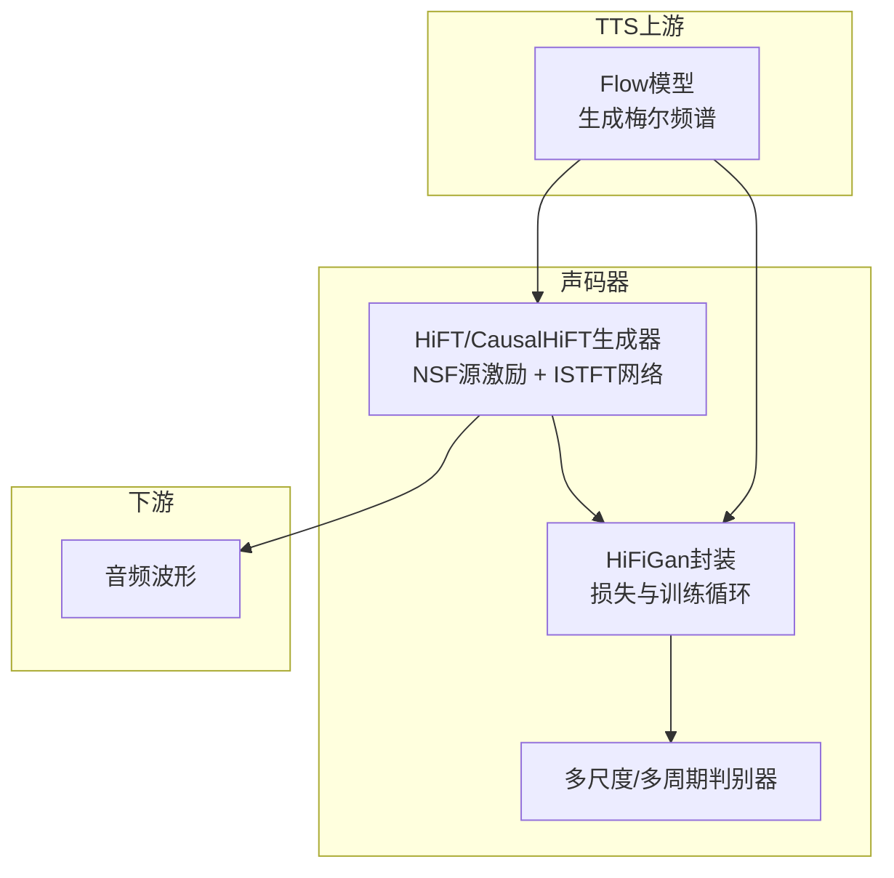
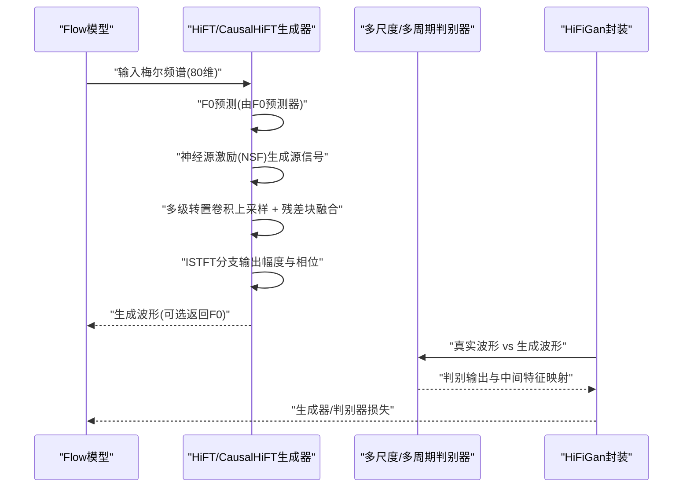
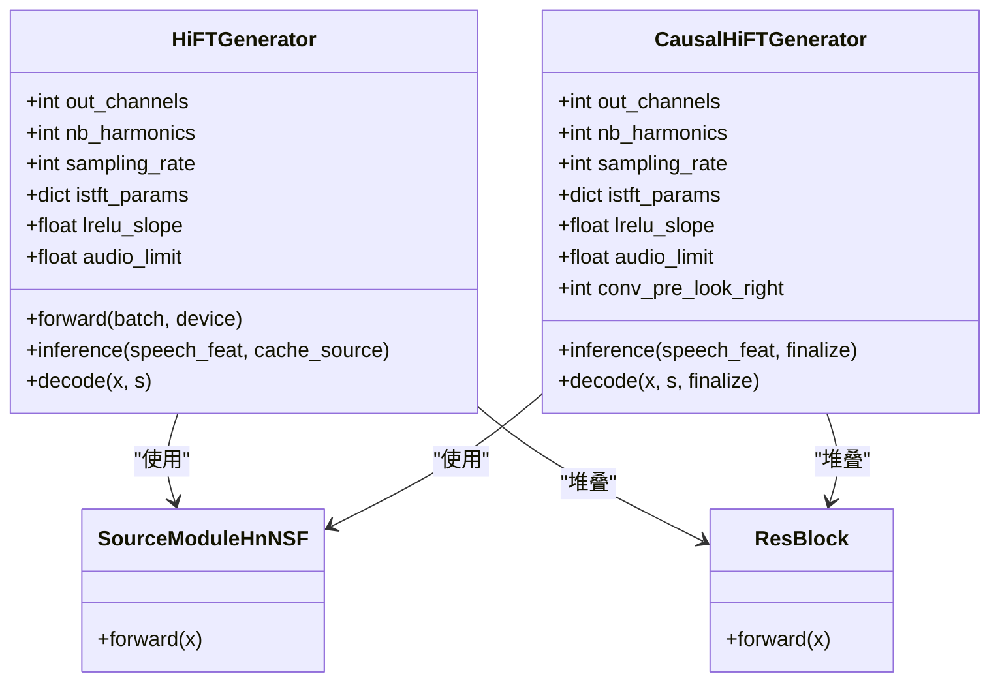
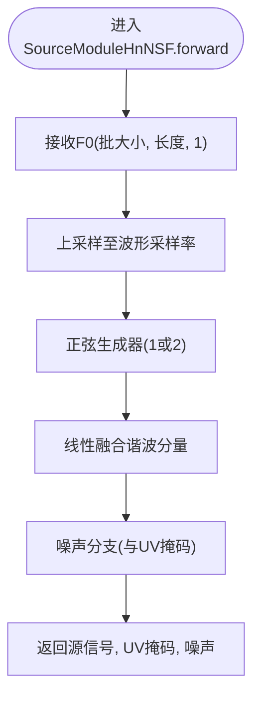
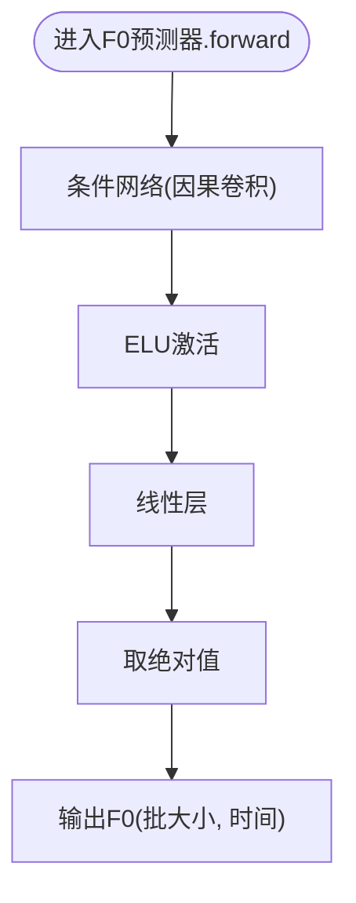
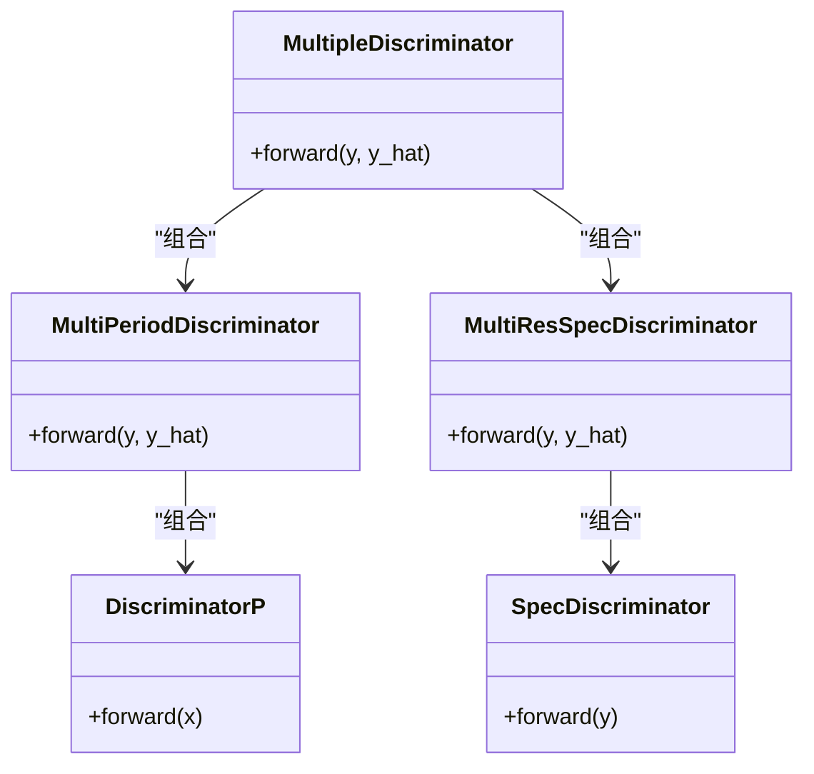
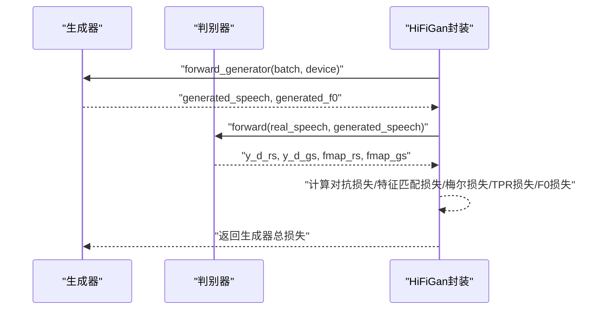
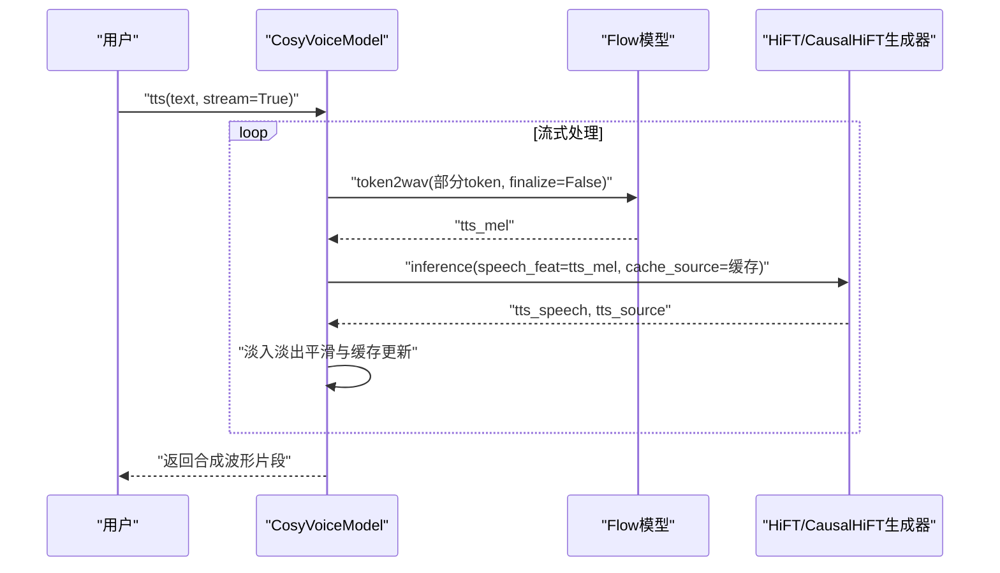
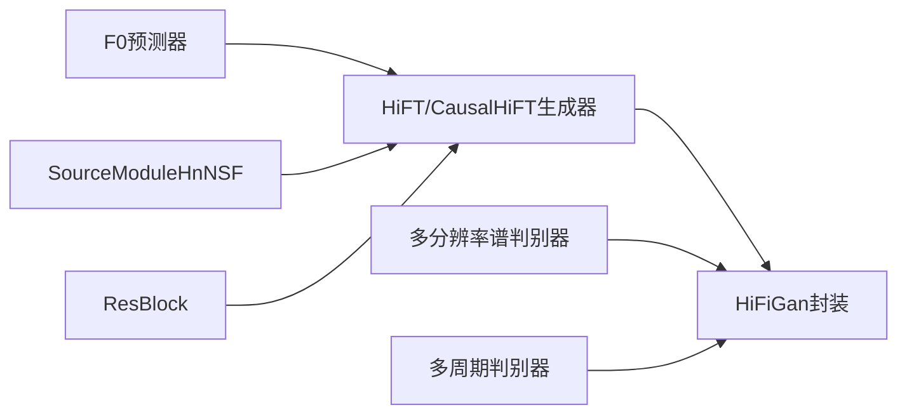

# HiFi-GAN声码器架构

<cite>
**本文引用的文件**
- [cosyvoice/hifigan/generator.py](file://cosyvoice/hifigan/generator.py)
- [cosyvoice/hifigan/discriminator.py](file://cosyvoice/hifigan/discriminator.py)
- [cosyvoice/hifigan/hifigan.py](file://cosyvoice/hifigan/hifigan.py)
- [cosyvoice/hifigan/f0_predictor.py](file://cosyvoice/hifigan/f0_predictor.py)
- [cosyvoice/flow/decoder.py](file://cosyvoice/flow/decoder.py)
- [cosyvoice/cli/model.py](file://cosyvoice/cli/model.py)
- [examples/libritts/cosyvoice3/conf/cosyvoice3.yaml](file://examples/libritts/cosyvoice3/conf/cosyvoice3.yaml)
- [examples/libritts/cosyvoice2/conf/cosyvoice2.yaml](file://examples/libritts/cosyvoice2/conf/cosyvoice2.yaml)
- [examples/libritts/cosyvoice/conf/cosyvoice.yaml](file://examples/libritts/cosyvoice/conf/cosyvoice.yaml)
- [third_party/Matcha-TTS/matcha/hifigan/models.py](file://third_party/Matcha-TTS/matcha/hifigan/models.py)
- [third_party/Matcha-TTS/matcha/models/components/decoder.py](file://third_party/Matcha-TTS/matcha/models/components/decoder.py)
</cite>

## 目录
1. [简介](#简介)
2. [项目结构](#项目结构)
3. [核心组件](#核心组件)
4. [架构总览](#架构总览)
5. [详细组件分析](#详细组件分析)
6. [依赖关系分析](#依赖关系分析)
7. [性能考量](#性能考量)
8. [故障排查指南](#故障排查指南)
9. [结论](#结论)
10. [附录](#附录)

## 简介
本技术文档围绕CosyVoice中的HiFi-GAN声码器展开，系统阐述其将梅尔频谱图转换为高质量音频波形的原理与实现，重点包括：
- 多尺度与多周期判别器的结构与作用
- 生成器中转置卷积层的堆叠设计与残差块融合策略
- 声码器与Flow模型的端到端集成，作为TTS流水线的最终环节
- 声码器对合成语音自然度与保真度的贡献
- 在不同采样率（如24kHz）下的配置与性能表现
- 声码器调用流程与流式合成中的缓冲机制

## 项目结构
HiFi-GAN相关代码主要分布在以下模块：
- 生成器与源激励模块：cosyvoice/hifigan/generator.py
- 判别器模块：cosyvoice/hifigan/discriminator.py
- 训练/损失封装：cosyvoice/hifigan/hifigan.py
- F0预测器：cosyvoice/hifigan/f0_predictor.py
- Flow模型（TTS流水线上游）：cosyvoice/flow/decoder.py
- CLI集成与流式缓冲：cosyvoice/cli/model.py
- 配置文件（采样率、上采样参数等）：examples/libritts/cosyvoice*/conf/*.yaml
- 参考实现（Matcha-TTS）：third_party/Matcha-TTS/matcha/hifigan/models.py、matcha/models/components/decoder.py

图表来源
- [cosyvoice/flow/decoder.py](file://cosyvoice/flow/decoder.py#L1-L200)
- [cosyvoice/hifigan/generator.py](file://cosyvoice/hifigan/generator.py#L378-L570)
- [cosyvoice/hifigan/discriminator.py](file://cosyvoice/hifigan/discriminator.py#L1-L120)
- [cosyvoice/hifigan/hifigan.py](file://cosyvoice/hifigan/hifigan.py#L1-L68)

章节来源
- [cosyvoice/hifigan/generator.py](file://cosyvoice/hifigan/generator.py#L378-L570)
- [cosyvoice/hifigan/discriminator.py](file://cosyvoice/hifigan/discriminator.py#L1-L120)
- [cosyvoice/hifigan/hifigan.py](file://cosyvoice/hifigan/hifigan.py#L1-L68)
- [cosyvoice/flow/decoder.py](file://cosyvoice/flow/decoder.py#L1-L200)
- [examples/libritts/cosyvoice3/conf/cosyvoice3.yaml](file://examples/libritts/cosyvoice3/conf/cosyvoice3.yaml#L1-L120)

## 核心组件
- 生成器（HiFTGenerator/CausalHiFTGenerator）
  - 负责从80维梅尔特征重建为波形，采用多级转置卷积上采样与多核残差块融合，结合神经源激励（NSF）与ISTFT分支输出幅度与相位，再通过逆STFT合成波形。
  - 提供非因果与因果两种版本，满足实时/流式合成需求。
- 源激励模块（SourceModuleHnNSF）
  - 基于F0的正弦串激励，融合谐波分量与噪声分量，生成源信号，支持“1型”和“2型”正弦生成器以适配不同采样率。
- F0预测器（ConvRNNF0Predictor/CausalConvRNNF0Predictor）
  - 从梅尔特征中回归基音频率，为源激励模块提供F0驱动信号；因果版本支持流式推理。
- 判别器（MultiResSpecDiscriminator/MultiPeriodDiscriminator）
  - 多分辨率谱判别器与多周期判别器组合，分别从时域与频域捕捉细节，提升对抗训练稳定性与音质。
- 训练封装（HiFiGan）
  - 统一生成器与判别器的前向、损失计算（对抗损失、特征匹配损失、梅尔谱重建损失、TPR损失、F0一致性损失），形成完整的GAN训练闭环。

章节来源
- [cosyvoice/hifigan/generator.py](file://cosyvoice/hifigan/generator.py#L378-L747)
- [cosyvoice/hifigan/f0_predictor.py](file://cosyvoice/hifigan/f0_predictor.py#L1-L104)
- [cosyvoice/hifigan/discriminator.py](file://cosyvoice/hifigan/discriminator.py#L1-L231)
- [cosyvoice/hifigan/hifigan.py](file://cosyvoice/hifigan/hifigan.py#L1-L68)

## 架构总览
下图展示TTS流水线中Flow到声码器的关键交互与数据流。

图表来源
- [cosyvoice/flow/decoder.py](file://cosyvoice/flow/decoder.py#L1-L200)
- [cosyvoice/hifigan/generator.py](file://cosyvoice/hifigan/generator.py#L541-L570)
- [cosyvoice/hifigan/discriminator.py](file://cosyvoice/hifigan/discriminator.py#L1-L120)
- [cosyvoice/hifigan/hifigan.py](file://cosyvoice/hifigan/hifigan.py#L22-L68)

## 详细组件分析

### 生成器：HiFTGenerator 与 CausalHiFTGenerator
- 结构要点
  - 预卷积与多级转置卷积上采样，逐级通道减半，配合反射填充与残差块融合，增强建模能力。
  - 源激励分支：先将F0上采样至与波形同步，经SourceModuleHnNSF生成源信号，再与上采样特征融合。
  - ISTFT分支：将上采样特征映射为STFT幅度与相位，逆变换得到波形，并做幅度裁剪与限幅。
  - 因果版本（CausalHiFTGenerator）：使用因果卷积与因果源模块，支持流式推理，包含look-right预卷积与finalize裁剪逻辑，避免前向传播引入延迟。
- 关键流程（非因果）
  - 梅尔特征经预卷积与多级转置卷积上采样
  - 源激励与上采样特征融合
  - 残差块堆叠融合
  - ISTFT幅度与相位输出，逆变换得到波形
- 关键流程（因果）
  - 预卷积区分finalize阶段，非最终阶段丢弃部分右边界
  - 源激励与上采样特征融合时同步裁剪
  - 最终阶段逆变换并裁剪掉因果延迟

图表来源
- [cosyvoice/hifigan/generator.py](file://cosyvoice/hifigan/generator.py#L378-L747)

章节来源
- [cosyvoice/hifigan/generator.py](file://cosyvoice/hifigan/generator.py#L378-L747)

### 源激励模块：SourceModuleHnNSF 与 SineGen/SineGen2
- 功能概述
  - 依据F0生成正弦串激励，融合多个谐波分量与噪声分量，形成神经源激励信号。
  - 支持“1型”和“2型”正弦生成器，以适配不同采样率与因果性需求。
- 关键点
  - F0上采样与相位累积
  - U/V（浊/清）掩码与噪声注入
  - 线性融合谐波分量，输出源信号与UV掩码

图表来源
- [cosyvoice/hifigan/generator.py](file://cosyvoice/hifigan/generator.py#L320-L376)

章节来源
- [cosyvoice/hifigan/generator.py](file://cosyvoice/hifigan/generator.py#L320-L376)

### F0预测器：ConvRNNF0Predictor 与 CausalConvRNNF0Predictor
- 功能概述
  - 从80维梅尔特征中回归基音频率，作为声码器源激励的驱动信号。
  - 因果版本在流式推理中仅使用右侧因果padding的部分，保证无前向泄漏。
- 关键点
  - 多层因果卷积堆叠，ELU激活
  - 线性分类器输出F0幅度

图表来源
- [cosyvoice/hifigan/f0_predictor.py](file://cosyvoice/hifigan/f0_predictor.py#L62-L104)

章节来源
- [cosyvoice/hifigan/f0_predictor.py](file://cosyvoice/hifigan/f0_predictor.py#L1-L104)

### 判别器：多分辨率谱判别器与多周期判别器
- 多分辨率谱判别器（MultiResSpecDiscriminator）
  - 对不同窗口长度的STFT进行谱域判别，捕获多尺度频谱特征。
- 多周期判别器（MultiPeriodDiscriminator）
  - 将时域信号按周期折叠，使用2、3、5、7、11等周期的卷积判别，捕捉周期性结构。
- 组合判别器（MultipleDiscriminator）
  - 将两类判别器输出拼接，提供更全面的判别反馈。

图表来源
- [cosyvoice/hifigan/discriminator.py](file://cosyvoice/hifigan/discriminator.py#L1-L231)
- [third_party/Matcha-TTS/matcha/hifigan/models.py](file://third_party/Matcha-TTS/matcha/hifigan/models.py#L209-L343)

章节来源
- [cosyvoice/hifigan/discriminator.py](file://cosyvoice/hifigan/discriminator.py#L1-L231)
- [third_party/Matcha-TTS/matcha/hifigan/models.py](file://third_party/Matcha-TTS/matcha/hifigan/models.py#L209-L343)

### 训练封装：HiFiGan
- 功能概述
  - 统一生成器与判别器的前向与损失计算，包括对抗损失、特征匹配损失、梅尔谱重建损失、TPR损失与F0一致性损失。
  - 支持按轮次切换“生成器”与“判别器”训练。
- 关键点
  - 生成器输出真实/生成波形的判别结果与中间特征映射
  - 计算生成器与判别器的损失并返回

图表来源
- [cosyvoice/hifigan/hifigan.py](file://cosyvoice/hifigan/hifigan.py#L22-L68)

章节来源
- [cosyvoice/hifigan/hifigan.py](file://cosyvoice/hifigan/hifigan.py#L1-L68)

### 与Flow模型的集成与流式缓冲
- 集成方式
  - Flow模型输出梅尔频谱，HiFi-GAN声码器将其转换为波形；二者通过CosyVoiceModel统一调度。
- 流式缓冲机制
  - 使用重叠窗口与缓存策略，避免块间拼接的突变与毛刺；在finalize阶段进行淡入淡出平滑。
  - 通过缓存梅尔与源信号，实现跨块的连续合成。

图表来源
- [cosyvoice/cli/model.py](file://cosyvoice/cli/model.py#L190-L200)
- [cosyvoice/cli/model.py](file://cosyvoice/cli/model.py#L287-L320)
- [cosyvoice/cli/model.py](file://cosyvoice/cli/model.py#L462-L482)

章节来源
- [cosyvoice/cli/model.py](file://cosyvoice/cli/model.py#L1-L200)
- [cosyvoice/cli/model.py](file://cosyvoice/cli/model.py#L287-L320)
- [cosyvoice/cli/model.py](file://cosyvoice/cli/model.py#L462-L482)

## 依赖关系分析
- 生成器依赖
  - F0预测器：提供F0驱动信号
  - 源激励模块：生成源信号
  - 残差块：多核融合增强表达力
- 判别器依赖
  - 多分辨率谱判别器与多周期判别器共同构成组合判别器
- 训练依赖
  - HiFiGan封装统一管理生成器与判别器的损失计算与训练轮次切换

图表来源
- [cosyvoice/hifigan/generator.py](file://cosyvoice/hifigan/generator.py#L378-L747)
- [cosyvoice/hifigan/discriminator.py](file://cosyvoice/hifigan/discriminator.py#L1-L231)
- [cosyvoice/hifigan/hifigan.py](file://cosyvoice/hifigan/hifigan.py#L1-L68)

章节来源
- [cosyvoice/hifigan/generator.py](file://cosyvoice/hifigan/generator.py#L378-L747)
- [cosyvoice/hifigan/discriminator.py](file://cosyvoice/hifigan/discriminator.py#L1-L231)
- [cosyvoice/hifigan/hifigan.py](file://cosyvoice/hifigan/hifigan.py#L1-L68)

## 性能考量
- 上采样与卷积堆叠
  - 多级转置卷积上采样与多核残差块融合，提升对高频细节的建模能力；需注意权重归一化与激活函数选择以稳定训练。
- 源激励与ISTFT
  - 源激励模块的正弦生成与谐波融合直接影响音色自然度；ISTFT幅度与相位的分离有助于提升保真度。
- 判别器多样性
  - 多分辨率谱判别器与多周期判别器的组合，有助于从时域与频域同时约束生成质量，减少伪影。
- 流式合成
  - 因果卷积与look-right预卷积确保无前向泄漏；缓存与淡入淡出平滑有效降低块间突变。
- 采样率与配置
  - 配置文件展示了24kHz采样率下的上采样率、窗口参数与梅尔谱参数，直接影响音质与延迟权衡。

章节来源
- [examples/libritts/cosyvoice3/conf/cosyvoice3.yaml](file://examples/libritts/cosyvoice3/conf/cosyvoice3.yaml#L1-L120)
- [examples/libritts/cosyvoice2/conf/cosyvoice2.yaml](file://examples/libritts/cosyvoice2/conf/cosyvoice2.yaml#L89-L130)
- [examples/libritts/cosyvoice/conf/cosyvoice.yaml](file://examples/libritts/cosyvoice/conf/cosyvoice.yaml#L112-L153)

## 故障排查指南
- 生成器无法移除权重归一化
  - 检查是否正确调用移除归一化方法，确保所有上采样、残差块、预/后卷积均被处理。
- 源激励导致波形失真
  - 检查F0预测精度与上采样倍率，确认正弦生成器类型与因果性设置。
- 流式合成出现毛刺
  - 检查缓存长度、重叠窗口与淡入淡出平滑参数，确保finalize阶段裁剪与缓存更新一致。
- 判别器不稳定
  - 调整多分辨率与多周期判别器的权重与谱窗参数，确保训练平衡。

章节来源
- [cosyvoice/hifigan/generator.py](file://cosyvoice/hifigan/generator.py#L477-L506)
- [cosyvoice/cli/model.py](file://cosyvoice/cli/model.py#L462-L482)

## 结论
CosyVoice中的HiFi-GAN声码器通过“神经源激励 + ISTFT网络”的生成器架构，结合多分辨率与多周期判别器，实现了高质量、高保真的波形重建。生成器采用多级转置卷积与残差块融合，源激励模块基于F0生成正弦串，ISTFT分支输出幅度与相位，逆变换得到波形。在TTS流水线中，声码器与Flow模型紧密集成，支持流式合成与缓存平滑，显著提升用户体验。配置文件展示了24kHz采样率下的参数设置，便于在不同场景下权衡音质与延迟。

## 附录
- 代码示例路径（不直接展示代码内容）
  - 生成器前向与推理调用：[cosyvoice/hifigan/generator.py](file://cosyvoice/hifigan/generator.py#L541-L570)
  - 流式合成调用与缓存更新：[cosyvoice/cli/model.py](file://cosyvoice/cli/model.py#L287-L320), [cosyvoice/cli/model.py](file://cosyvoice/cli/model.py#L462-L482)
  - 判别器组合与前向：[cosyvoice/hifigan/discriminator.py](file://cosyvoice/hifigan/discriminator.py#L1-L120)
  - 训练封装与损失计算：[cosyvoice/hifigan/hifigan.py](file://cosyvoice/hifigan/hifigan.py#L22-L68)
  - 参考实现（多周期/多分辨率判别器）：[third_party/Matcha-TTS/matcha/hifigan/models.py](file://third_party/Matcha-TTS/matcha/hifigan/models.py#L209-L343)
  - 参考实现（转置卷积上采样）：[third_party/Matcha-TTS/matcha/models/components/decoder.py](file://third_party/Matcha-TTS/matcha/models/components/decoder.py#L134-L158)