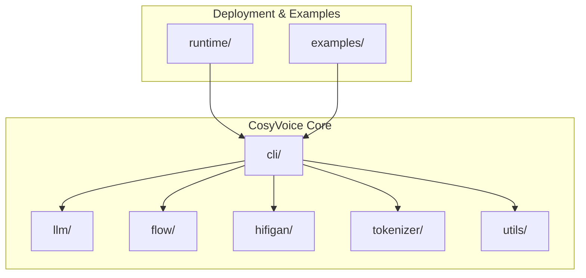
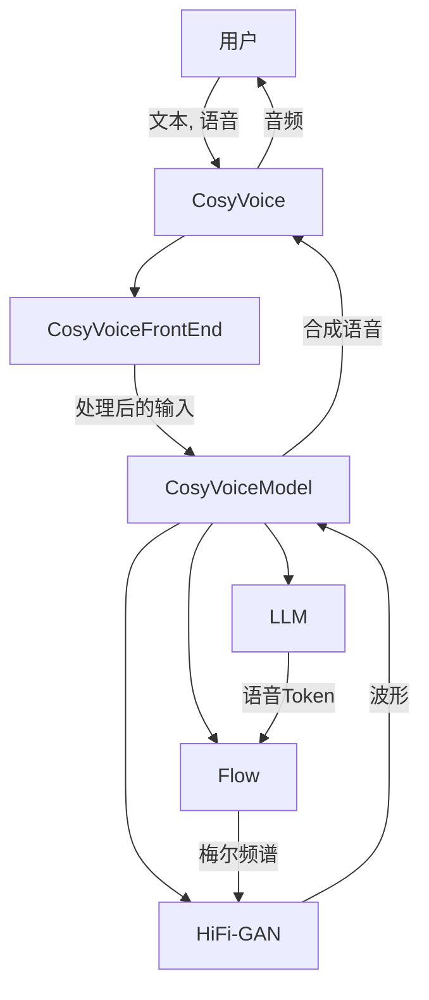
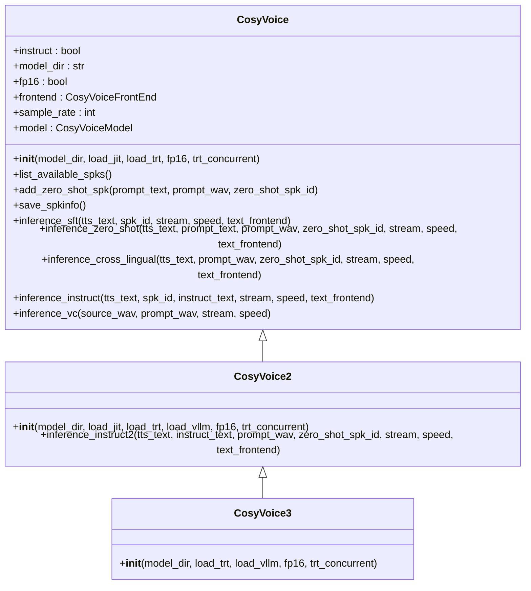
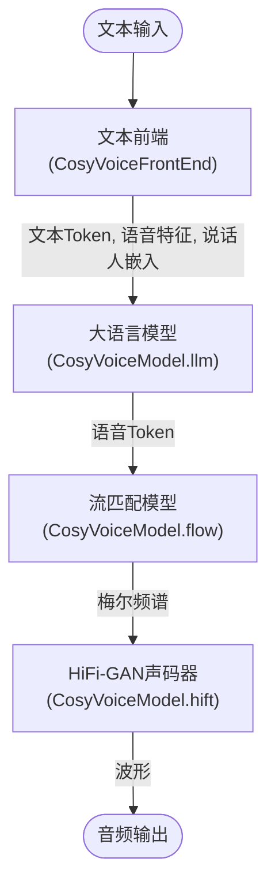
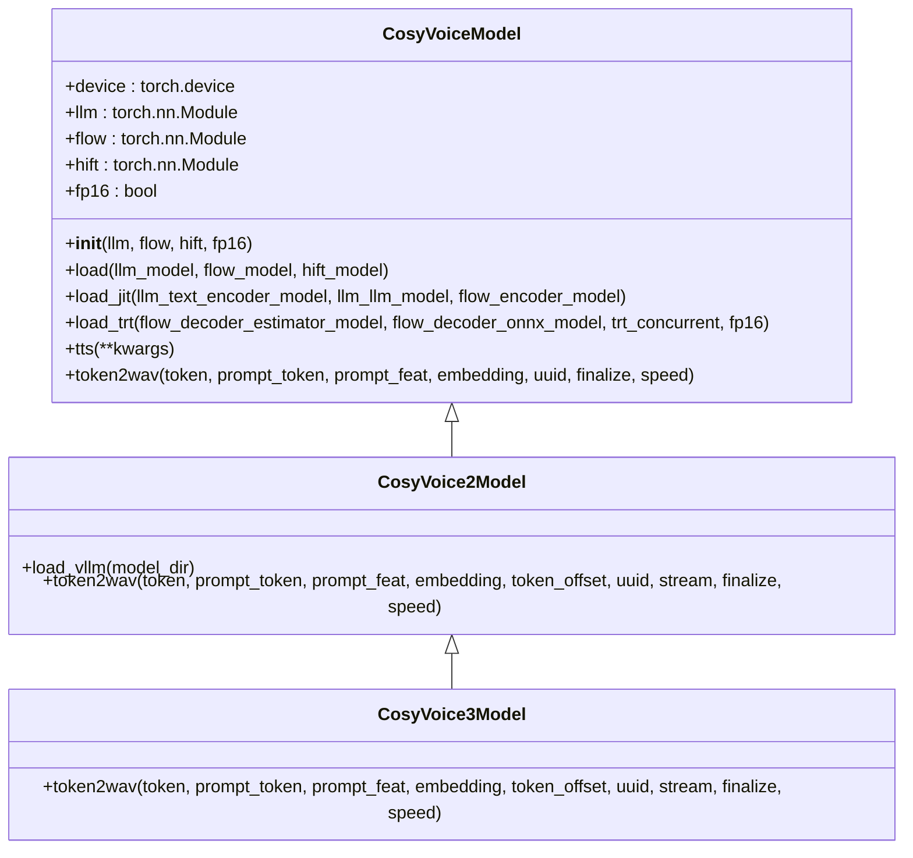
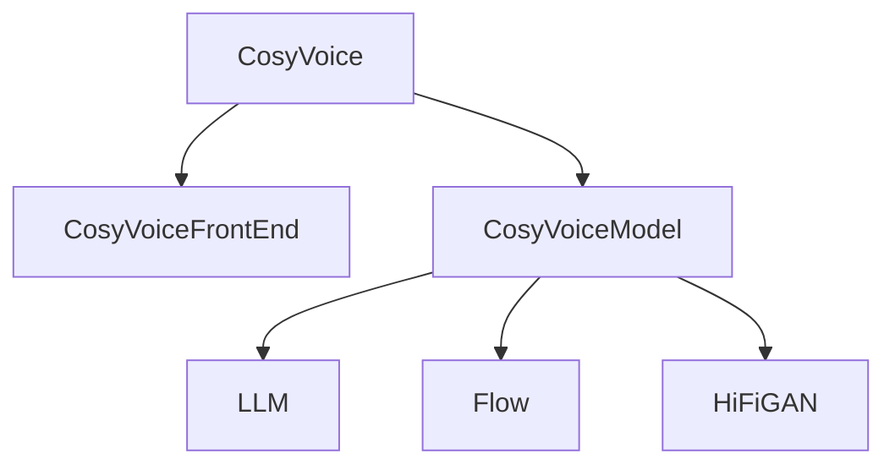

# 技术架构

<cite>
**本文档引用的文件**   
- [cosyvoice.py](file://cosyvoice/cli/cosyvoice.py)
- [frontend.py](file://cosyvoice/cli/frontend.py)
- [model.py](file://cosyvoice/cli/model.py)
- [llm.py](file://cosyvoice/llm/llm.py)
- [flow.py](file://cosyvoice/flow/flow.py)
- [hifigan.py](file://cosyvoice/hifigan/hifigan.py)
- [generator.py](file://cosyvoice/hifigan/generator.py)
- [decoder.py](file://cosyvoice/flow/decoder.py)
- [cosyvoice.yaml](file://examples/libritts/cosyvoice/conf/cosyvoice.yaml)
- [cosyvoice2.yaml](file://examples/libritts/cosyvoice2/conf/cosyvoice2.yaml)
- [cosyvoice3.yaml](file://examples/libritts/cosyvoice3/conf/cosyvoice3.yaml)
- [common.py](file://cosyvoice/utils/common.py)
- [cosyvoice2.py](file://cosyvoice/vllm/cosyvoice2.py)
</cite>

## 目录
1. [引言](#引言)
2. [项目结构](#项目结构)
3. [核心组件](#核心组件)
4. [架构概述](#架构概述)
5. [详细组件分析](#详细组件分析)
6. [依赖分析](#依赖分析)
7. [性能考虑](#性能考虑)
8. [故障排除指南](#故障排除指南)
9. [结论](#结论)

## 引言
CosyVoice 是一个基于大型语言模型（LLM）的可扩展多语言零样本文本到语音（TTS）合成系统。该系统通过创新的模块化设计，将文本前端、语言模型、流匹配模型和声码器等核心组件有机地整合在一起，实现了高质量、低延迟的语音合成。本文档旨在深入剖析CosyVoice系统的架构设计，重点阐述`CosyVoice`类如何协调各组件完成端到端的语音合成流程，以及其继承体系带来的扩展性优势。

## 项目结构
CosyVoice项目的目录结构清晰地体现了其模块化设计理念。核心功能被组织在`cosyvoice`目录下，主要分为以下几个关键模块：
- `bin/`: 包含模型训练、平均和导出等脚本。
- `cli/`: 命令行接口，包含`CosyVoice`主类、前端处理器和模型推理器。
- `dataset/`: 数据集处理相关代码。
- `flow/`: 流匹配模型（Flow Matching Model）的实现。
- `hifigan/`: HiFi-GAN声码器的实现。
- `llm/`: 大语言模型（LLM）的核心逻辑。
- `tokenizer/`: 文本和语音分词器。
- `transformer/`: 通用的Transformer组件。
- `utils/`: 各种工具函数和类。
- `vllm/`: 针对vLLM优化的模型实现。

此外，`examples/`目录提供了不同版本模型的配置和运行脚本，`runtime/`目录则包含了用于服务部署的FastAPI和gRPC接口。

**目录来源**
- [cosyvoice/cli/cosyvoice.py](file://cosyvoice/cli/cosyvoice.py)
- [cosyvoice/cli/frontend.py](file://cosyvoice/cli/frontend.py)
- [cosyvoice/cli/model.py](file://cosyvoice/cli/model.py)
- [cosyvoice/llm/llm.py](file://cosyvoice/llm/llm.py)
- [cosyvoice/flow/flow.py](file://cosyvoice/flow/flow.py)
- [cosyvoice/hifigan/hifigan.py](file://cosyvoice/hifigan/hifigan.py)

## 核心组件
CosyVoice系统的核心由四个主要组件构成：文本前端（Frontend）、大语言模型（LLM）、流匹配模型（Flow）和HiFi-GAN声码器（HiFi-GAN）。`CosyVoice`类作为系统的主接口，负责协调这些组件，完成从文本到语音的端到端合成。

**核心组件来源**
- [cosyvoice/cli/cosyvoice.py](file://cosyvoice/cli/cosyvoice.py#L27-L390)
- [cosyvoice/cli/frontend.py](file://cosyvoice/cli/frontend.py#L31-L396)
- [cosyvoice/cli/model.py](file://cosyvoice/cli/model.py#L29-L626)

## 架构概述
CosyVoice系统采用了一种变体的MVC（Model-View-Controller）架构，将关注点分离。`CosyVoice`类扮演控制器（Controller）的角色，接收用户请求并协调模型（Model）和视图（View）的交互。模型部分由`CosyVoiceModel`及其子类实现，负责核心的推理逻辑。视图部分则由`CosyVoiceFrontEnd`实现，负责处理用户输入和输出。

**架构来源**
- [cosyvoice/cli/cosyvoice.py](file://cosyvoice/cli/cosyvoice.py#L27-L390)
- [cosyvoice/cli/frontend.py](file://cosyvoice/cli/frontend.py#L31-L396)
- [cosyvoice/cli/model.py](file://cosyvoice/cli/model.py#L29-L626)

## 详细组件分析

### CosyVoice类分析
`CosyVoice`类是整个系统的入口点，它封装了模型的初始化和多种推理模式。该类通过继承实现了版本的演进，从`CosyVoice`到`CosyVoice2`再到`CosyVoice3`，形成了一个清晰的继承链，极大地提升了代码的可扩展性和可维护性。

**类图来源**
- [cosyvoice/cli/cosyvoice.py](file://cosyvoice/cli/cosyvoice.py#L27-L390)

### 数据流分析
CosyVoice系统的数据流遵循一个清晰的路径：文本 → 前端 → LLM → Flow → HiFi-GAN → 音频。`CosyVoice`类通过调用`CosyVoiceFrontEnd`对输入文本进行标准化和分词，然后将处理后的数据传递给`CosyVoiceModel`。`CosyVoiceModel`内部协调LLM、Flow和HiFi-GAN三个子模型，逐步完成语音合成。

**流程图来源**
- [cosyvoice/cli/cosyvoice.py](file://cosyvoice/cli/cosyvoice.py#L27-L390)
- [cosyvoice/cli/frontend.py](file://cosyvoice/cli/frontend.py#L31-L396)
- [cosyvoice/cli/model.py](file://cosyvoice/cli/model.py#L29-L626)

### 模块化设计与继承关系分析
CosyVoice系统通过模块化设计和继承关系实现了卓越的扩展性。`CosyVoiceModel`类负责管理LLM、Flow和HiFi-GAN三个子模型，并提供统一的推理接口。其子类`CosyVoice2Model`和`CosyVoice3Model`通过重写`__init__`和`token2wav`等方法，引入了vLLM加速、流式推理等新特性，而无需修改父类的核心逻辑。

**类图来源**
- [cosyvoice/cli/model.py](file://cosyvoice/cli/model.py#L29-L626)

## 依赖分析
CosyVoice系统内部组件之间的依赖关系清晰且松耦合。`CosyVoice`类依赖于`CosyVoiceFrontEnd`和`CosyVoiceModel`，而`CosyVoiceModel`则直接依赖于LLM、Flow和HiFi-GAN这三个子模型。这种设计使得各个组件可以独立开发和测试。

**依赖来源**
- [cosyvoice/cli/cosyvoice.py](file://cosyvoice/cli/cosyvoice.py#L27-L390)
- [cosyvoice/cli/model.py](file://cosyvoice/cli/model.py#L29-L626)

## 性能考虑
CosyVoice系统在设计时充分考虑了性能优化。它支持多种推理模式，包括非流式和流式推理，以满足不同场景的需求。通过JIT编译和TensorRT优化，系统能够显著提升推理速度。此外，`CosyVoice2Model`和`CosyVoice3Model`通过引入vLLM，进一步加速了LLM的推理过程。

## 故障排除指南
在使用CosyVoice系统时，可能会遇到一些常见问题。例如，如果在使用vLLM时遇到版本兼容性问题，建议创建一个独立的conda环境来安装`vllm==v0.9.0`。对于文本前端处理，如果`ttsfrd`包不可用，系统会自动回退到`wetext`作为替代方案。

**故障排除来源**
- [README.md](file://README.md#L154-L163)

## 结论
CosyVoice系统通过精心设计的模块化架构和继承体系，成功地将文本前端、大语言模型、流匹配模型和声码器等复杂组件整合在一起。`CosyVoice`类作为系统的协调中心，通过清晰的数据流路径和灵活的接口设计，实现了高效、高质量的端到端语音合成。其继承模式不仅保证了代码的可维护性，还为未来的功能扩展提供了坚实的基础。