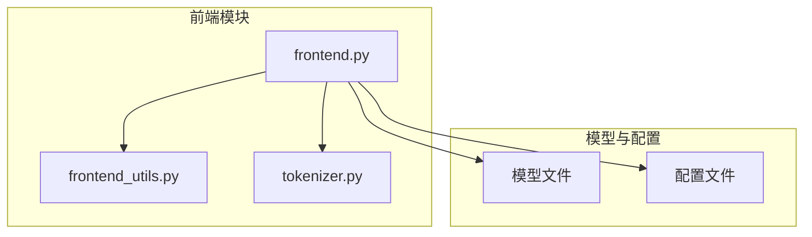
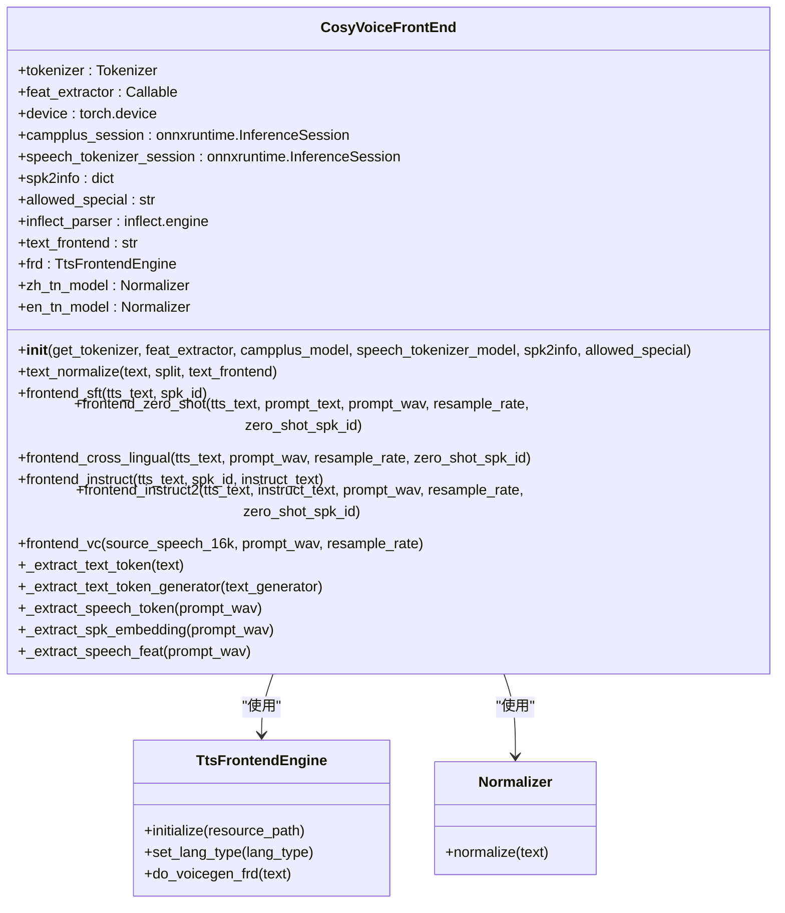
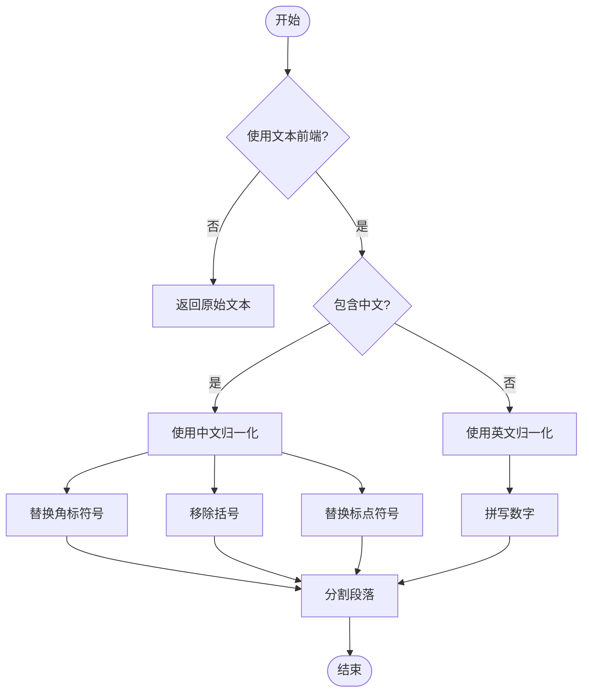
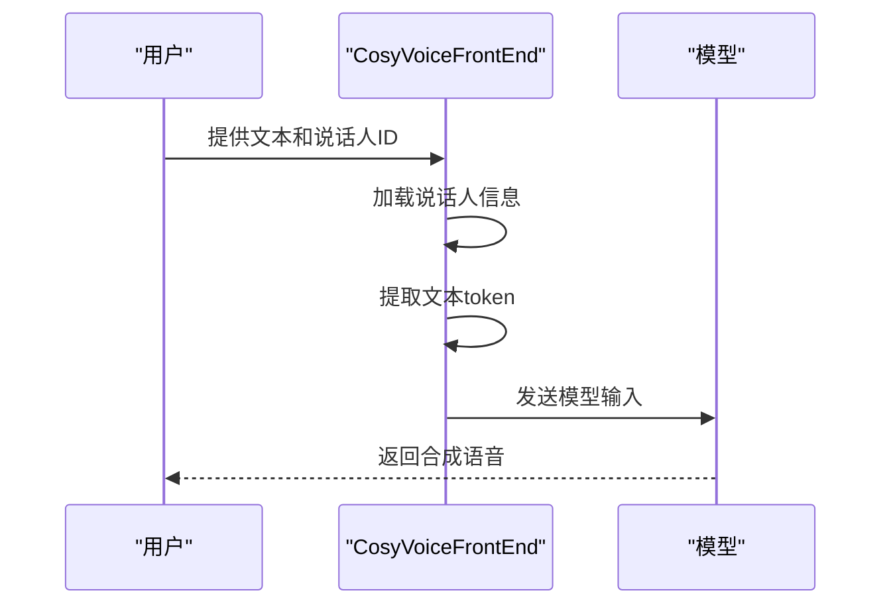
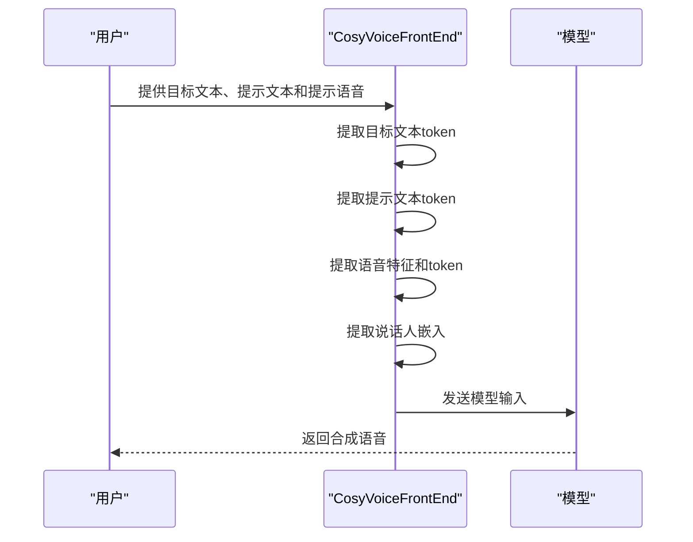
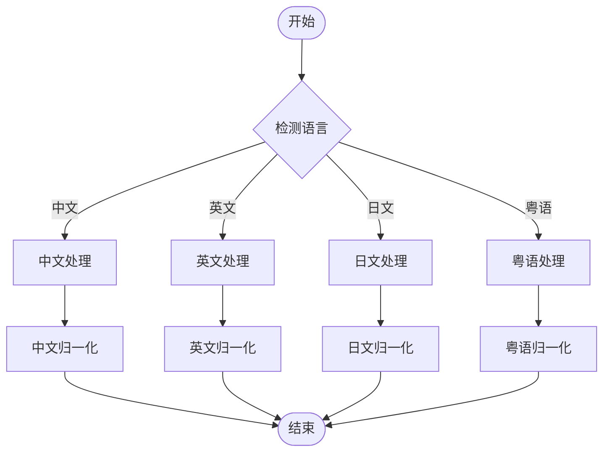
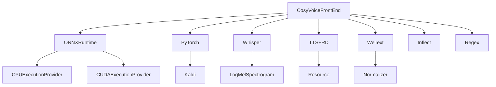

# 文本前端架构

<cite>
**本文档中引用的文件**  
- [frontend.py](file://cosyvoice/cli/frontend.py)
- [frontend_utils.py](file://cosyvoice/utils/frontend_utils.py)
- [tokenizer.py](file://cosyvoice/tokenizer/tokenizer.py)
- [cosyvoice2.yaml](file://pretrained_models/CosyVoice2-0.5B/cosyvoice2.yaml)
- [example.py](file://example.py)
</cite>

## 目录
1. [简介](#简介)
2. [项目结构](#项目结构)
3. [核心组件](#核心组件)
4. [架构概述](#架构概述)
5. [详细组件分析](#详细组件分析)
6. [依赖分析](#依赖分析)
7. [性能考虑](#性能考虑)
8. [故障排除指南](#故障排除指南)
9. [结论](#结论)

## 简介
CosyVoice 是一个先进的生成式语音大模型，其文本前端架构在语音合成过程中起着至关重要的作用。该架构负责将原始文本转换为模型可理解的格式，处理多语言输入，并与声纹编码器、语音分词器等组件协同工作。本文档详细描述了 `CosyVoiceFrontEnd` 类的设计与实现，重点介绍其在文本归一化、音素转换、特征提取中的作用，以及如何支持 SFT、Zero-shot 等不同模式下的差异化处理逻辑。

## 项目结构
CosyVoice 项目的文本前端相关代码主要分布在 `cosyvoice/cli/` 和 `cosyvoice/utils/` 目录下。核心的前端处理逻辑由 `frontend.py` 文件中的 `CosyVoiceFrontEnd` 类实现，而辅助的文本处理工具则位于 `frontend_utils.py` 中。此外，`tokenizer.py` 文件提供了文本分词功能，支持多语言处理。

**图源**  
- [frontend.py](file://cosyvoice/cli/frontend.py)
- [frontend_utils.py](file://cosyvoice/utils/frontend_utils.py)
- [tokenizer.py](file://cosyvoice/tokenizer/tokenizer.py)

**章节源**  
- [frontend.py](file://cosyvoice/cli/frontend.py)
- [frontend_utils.py](file://cosyvoice/utils/frontend_utils.py)

## 核心组件
`CosyVoiceFrontEnd` 类是整个文本前端架构的核心，负责处理从文本输入到模型输入的整个流程。它集成了文本归一化、音素转换、特征提取等功能，并与声纹编码器（campplus.onnx）、语音分词器（speech_tokenizer_v*.onnx）和说话人信息（spk2info.pt）协同工作。

**章节源**  
- [frontend.py](file://cosyvoice/cli/frontend.py#L30-L396)

## 架构概述
`CosyVoiceFrontEnd` 类的架构设计旨在支持多种语音合成模式，包括 SFT、Zero-shot、跨语言合成和语音转换。其核心功能包括文本归一化、音素转换、特征提取和说话人嵌入提取。

**图源**  
- [frontend.py](file://cosyvoice/cli/frontend.py#L30-L396)

**章节源**  
- [frontend.py](file://cosyvoice/cli/frontend.py#L30-L396)

## 详细组件分析

### CosyVoiceFrontEnd 类分析
`CosyVoiceFrontEnd` 类的设计充分考虑了多语言支持和不同合成模式的需求。它通过集成多种文本前端工具（如 ttsfrd 和 wetext）来实现文本归一化，并通过 ONNX 运行时与声纹编码器和语音分词器进行交互。

#### 文本归一化处理
文本归一化是语音合成的第一步，`text_normalize` 方法负责将原始文本转换为适合语音合成的格式。该方法支持中文、英文和粤语等多种语言，并能处理数字、标点符号等特殊字符。

**图源**  
- [frontend.py](file://cosyvoice/cli/frontend.py#L190-L236)
- [frontend_utils.py](file://cosyvoice/utils/frontend_utils.py#L65-L148)

**章节源**  
- [frontend.py](file://cosyvoice/cli/frontend.py#L190-L236)
- [frontend_utils.py](file://cosyvoice/utils/frontend_utils.py#L65-L148)

#### SFT 模式前端处理
SFT（Supervised Fine-Tuning）模式是 CosyVoice 的一种重要合成模式，`frontend_sft` 方法负责处理该模式下的前端逻辑。它通过加载预存的说话人信息来生成模型输入。

**图源**  
- [frontend.py](file://cosyvoice/cli/frontend.py#L238-L256)

**章节源**  
- [frontend.py](file://cosyvoice/cli/frontend.py#L238-L256)

#### Zero-shot 模式前端处理
Zero-shot 模式允许用户通过提供提示语音来合成新说话人的语音，`frontend_zero_shot` 方法实现了这一功能。它从提示语音中提取声学特征和说话人嵌入，并将其与目标文本结合生成模型输入。

**图源**  
- [frontend.py](file://cosyvoice/cli/frontend.py#L258-L309)

**章节源**  
- [frontend.py](file://cosyvoice/cli/frontend.py#L258-L309)

### 多语言文本处理
CosyVoice 支持中文、日文、粤语等多种语言的文本处理。通过 `contains_chinese` 函数检测文本中的中文字符，并根据语言类型选择相应的归一化策略。

**图源**  
- [frontend_utils.py](file://cosyvoice/utils/frontend_utils.py#L20-L22)
- [frontend.py](file://cosyvoice/cli/frontend.py#L215-L234)

**章节源**  
- [frontend_utils.py](file://cosyvoice/utils/frontend_utils.py#L20-L22)
- [frontend.py](file://cosyvoice/cli/frontend.py#L215-L234)

## 依赖分析
`CosyVoiceFrontEnd` 类依赖于多个外部组件和库，包括 ONNX 运行时、PyTorch、Whisper、TTSFRD 和 WeText。这些依赖项通过 `__init__` 方法中的参数传递和异常处理机制进行管理。

**图源**  
- [frontend.py](file://cosyvoice/cli/frontend.py#L39-L93)

**章节源**  
- [frontend.py](file://cosyvoice/cli/frontend.py#L39-L93)

## 性能考虑
`CosyVoiceFrontEnd` 类在设计时充分考虑了性能优化。通过使用 ONNX 运行时进行推理，利用 GPU 加速计算，并通过缓存机制减少重复计算。此外，文本归一化过程中的正则表达式匹配和字符串操作也经过优化，以提高处理速度。

## 故障排除指南
在使用 `CosyVoiceFrontEnd` 类时，可能会遇到一些常见问题，如文本前端工具不可用、模型文件缺失等。以下是一些常见问题的解决方案：

1. **文本前端工具不可用**：如果 `ttsfrd` 或 `wetext` 不可用，系统会自动降级到基本的文本处理模式。
2. **模型文件缺失**：确保 `campplus.onnx`、`speech_tokenizer_v*.onnx` 和 `spk2info.pt` 文件存在且路径正确。
3. **GPU 资源不足**：如果 GPU 内存不足，可以尝试使用 CPU 进行推理，或减少批量大小。

**章节源**  
- [frontend.py](file://cosyvoice/cli/frontend.py#L74-L93)
- [example.py](file://example.py#L10-L107)

## 结论
`CosyVoiceFrontEnd` 类是 CosyVoice 语音合成系统的核心组件，负责处理从文本输入到模型输入的整个流程。它通过集成多种文本前端工具、声纹编码器和语音分词器，实现了对多语言文本的支持，并能够处理 SFT、Zero-shot 等不同模式下的差异化逻辑。该类的设计充分考虑了性能优化和错误处理，为用户提供了一个高效、可靠的语音合成解决方案。