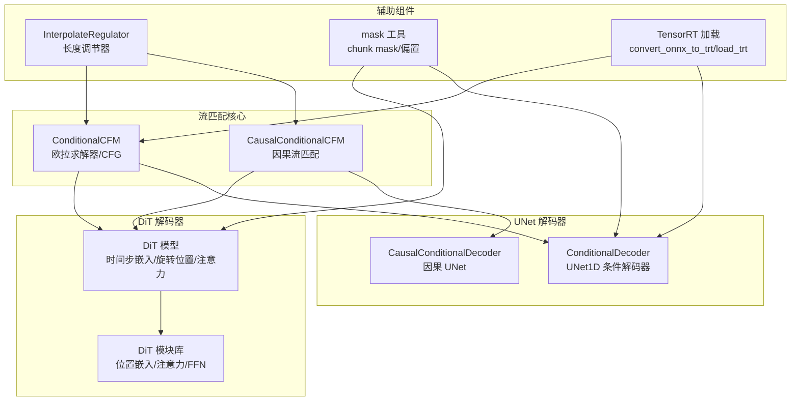
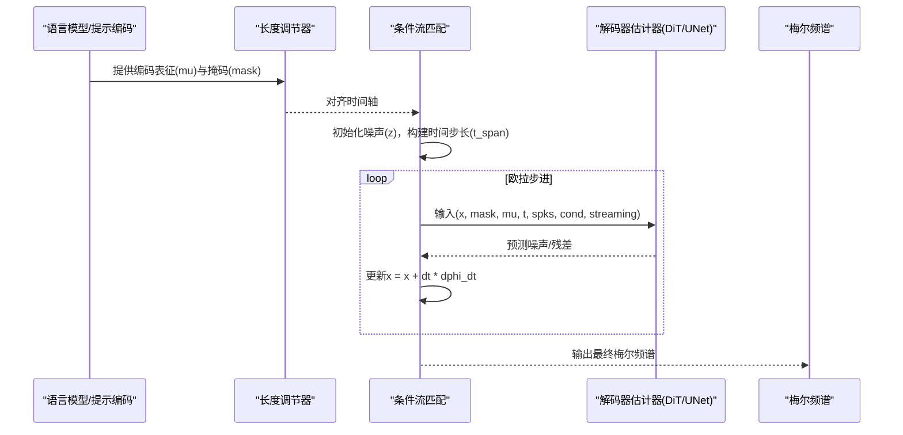
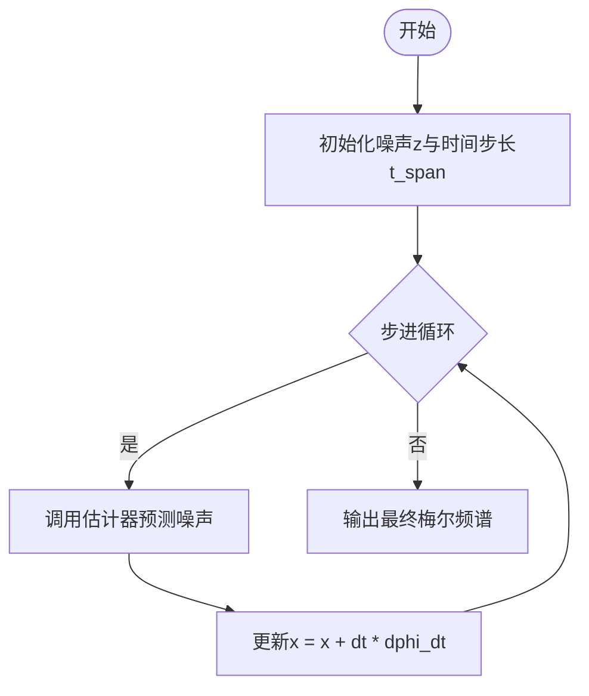
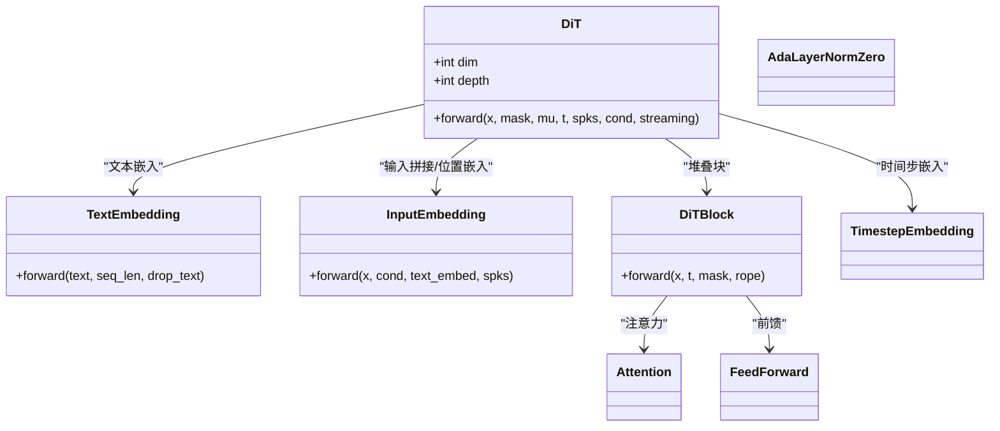
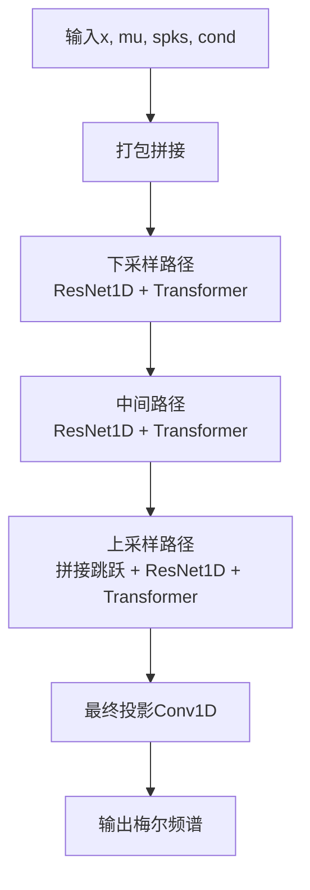
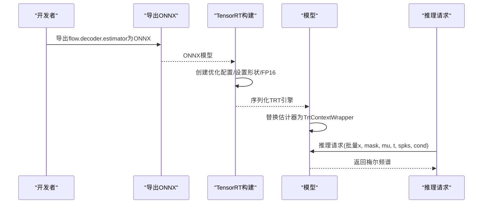
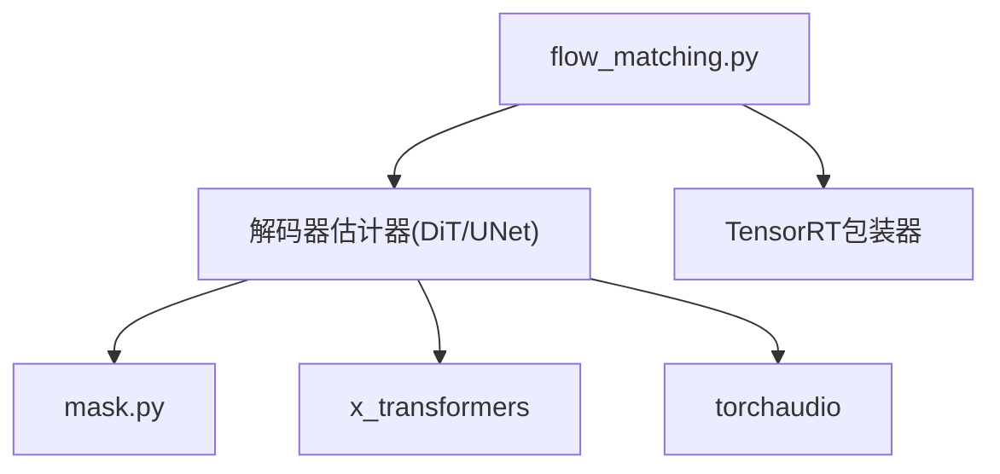

# 流匹配模型架构

<cite>
**本文引用的文件**
- [flow_matching.py](file://cosyvoice/flow/flow_matching.py)
- [length_regulator.py](file://cosyvoice/flow/length_regulator.py)
- [dit.py](file://cosyvoice/flow/DiT/dit.py)
- [modules.py](file://cosyvoice/flow/DiT/modules.py)
- [decoder.py](file://cosyvoice/flow/decoder.py)
- [export_onnx.py](file://cosyvoice/bin/export_onnx.py)
- [token2wav.py](file://runtime/triton_trtllm/token2wav.py)
- [common.py](file://cosyvoice/utils/common.py)
- [mask.py](file://cosyvoice/utils/mask.py)
</cite>

## 目录
1. [引言](#引言)
2. [项目结构](#项目结构)
3. [核心组件](#核心组件)
4. [架构总览](#架构总览)
5. [详细组件分析](#详细组件分析)
6. [依赖关系分析](#依赖关系分析)
7. [性能考量](#性能考量)
8. [故障排查指南](#故障排查指南)
9. [结论](#结论)
10. [附录](#附录)

## 引言
本文件系统性阐述 CosyVoice 中“流匹配模型（Flow）”的架构与实现，重点解释其在语音合成中的核心作用：将语言模型输出的语音标记（如文本或中间表示）转换为梅尔频谱图，并通过基于 DiT 的扩散在时间维度上的流匹配算法完成采样生成。文档覆盖以下关键点：
- 基于 DiT（Diffusion in Time）的流匹配算法实现，包括 DiT 模块的结构设计与时间步长处理机制
- Flow 模型的编码器-解码器架构如何实现从条件表征到梅尔频谱的序列到序列转换，并支持流式推理
- flow_matching 与 length_regulator 组件的工作原理
- TensorRT 优化（load_trt）对解码器性能的提升
- 提供模型数据流的详细示例与可视化图示

## 项目结构
围绕流匹配模型的相关目录与文件组织如下：
- flow_matching.py：条件流匹配（ConditionalCFM）与因果流匹配（CausalConditionalCFM）实现，包含欧拉求解器、训练损失计算与推理时的 CFG（Classifier-Free Guidance）
- DiT/dit.py 与 DiT/modules.py：DiT 架构与注意力、位置嵌入、时间步嵌入等模块
- decoder.py：UNet 风格的条件解码器，支持因果与非因果两种版本，用于从噪声与条件表征中重建梅尔频谱
- length_regulator.py：长度调节器，线性插值对齐不同来源序列的时间轴
- runtime/triton_trtllm/token2wav.py：TensorRT 推理加载与优化流程
- utils/common.py 与 utils/mask.py：掩码工具与 TRT 上下文封装等通用能力

图表来源
- [flow_matching.py](file://cosyvoice/flow/flow_matching.py#L1-L229)
- [dit.py](file://cosyvoice/flow/DiT/dit.py#L104-L177)
- [modules.py](file://cosyvoice/flow/DiT/modules.py#L497-L617)
- [decoder.py](file://cosyvoice/flow/decoder.py#L210-L292)
- [length_regulator.py](file://cosyvoice/flow/length_regulator.py#L21-L71)
- [mask.py](file://cosyvoice/utils/mask.py#L161-L200)
- [token2wav.py](file://runtime/triton_trtllm/token2wav.py#L36-L191)

章节来源
- [flow_matching.py](file://cosyvoice/flow/flow_matching.py#L1-L229)
- [dit.py](file://cosyvoice/flow/DiT/dit.py#L104-L177)
- [modules.py](file://cosyvoice/flow/DiT/modules.py#L497-L617)
- [decoder.py](file://cosyvoice/flow/decoder.py#L210-L292)
- [length_regulator.py](file://cosyvoice/flow/length_regulator.py#L21-L71)
- [mask.py](file://cosyvoice/utils/mask.py#L161-L200)
- [token2wav.py](file://runtime/triton_trtllm/token2wav.py#L36-L191)

## 核心组件
- 条件流匹配（ConditionalCFM）与因果流匹配（CausalConditionalCFM）
  - 使用欧拉法求解扩散 ODE，支持余弦调度的时间步长与推理时的 CFG
  - 支持通过 TensorRT 进行解码器估计器的异步执行
- DiT 解码器（DiT）
  - 时间步嵌入、旋转位置编码、多头注意力、前馈网络与 AdaLayerNormZero 调制
  - 支持流式注意力掩码与长跳跃连接
- UNet 条件解码器（ConditionalDecoder/CausalConditionalDecoder）
  - 以 UNet1D 为基础，融合时间步、说话人条件与上下文（如文本/提示），实现从噪声到梅尔的重建
  - 因果版本保证单向依赖，适合流式推理
- 长度调节器（InterpolateRegulator）
  - 线性插值对齐不同来源序列的时间轴，推理时可分段插值以获得清晰的拼接边界
- 掩码工具（mask）
  - 提供动态/静态 chunk 掩码与注意力偏置，支撑流式与非流式注意力
- TensorRT 优化（load_trt）
  - ONNX 导出后转 TensorRT，动态批量化与形状配置，加速解码器估计器推理

章节来源
- [flow_matching.py](file://cosyvoice/flow/flow_matching.py#L21-L125)
- [dit.py](file://cosyvoice/flow/DiT/dit.py#L104-L177)
- [modules.py](file://cosyvoice/flow/DiT/modules.py#L497-L617)
- [decoder.py](file://cosyvoice/flow/decoder.py#L210-L292)
- [length_regulator.py](file://cosyvoice/flow/length_regulator.py#L21-L71)
- [mask.py](file://cosyvoice/utils/mask.py#L161-L200)
- [token2wav.py](file://runtime/triton_trtllm/token2wav.py#L36-L191)

## 架构总览
流匹配模型在 CosyVoice 中承担“从条件表征到梅尔频谱”的序列到序列转换任务。其核心流程如下：
- 输入：文本/提示的编码表征（mu）、掩码（mask）、说话人嵌入（spks）、条件（cond）
- 可选：长度调节器对齐时间轴
- 扩散采样：欧拉法求解 ODE，逐步去噪得到梅尔频谱
- 解码器估计器：DiT 或 UNet 条件解码器，预测噪声或残差
- 流式支持：掩码与因果卷积确保单向依赖，便于实时推理
- 性能优化：ONNX 导出与 TensorRT 动态批量化

图表来源
- [flow_matching.py](file://cosyvoice/flow/flow_matching.py#L36-L125)
- [decoder.py](file://cosyvoice/flow/decoder.py#L210-L292)
- [dit.py](file://cosyvoice/flow/DiT/dit.py#L145-L177)

## 详细组件分析

### 条件流匹配（ConditionalCFM）与因果流匹配（CausalConditionalCFM）
- 时间步长调度
  - 支持线性与余弦调度；余弦调度使采样更集中在起始阶段，有助于稳定训练与推理
- 欧拉求解器
  - 在固定步长上迭代更新，支持动态步长与缓存（prompt/overlap 区域）
- 训练与推理的 CFG
  - 训练时可随机丢弃条件以平衡覆盖与保真；推理时通过 CFG 提升可控性
- TensorRT 推理
  - 通过 forward_estimator 切换至 TRT 引擎，设置输入形状、地址并异步执行，最后释放上下文

图表来源
- [flow_matching.py](file://cosyvoice/flow/flow_matching.py#L66-L125)

章节来源
- [flow_matching.py](file://cosyvoice/flow/flow_matching.py#L21-L125)
- [flow_matching.py](file://cosyvoice/flow/flow_matching.py#L126-L154)

### DiT 解码器（DiT）
- 结构要点
  - 时间步嵌入：SinusPositionEmbedding + MLP
  - 输入嵌入：拼接无噪音频、条件、文本嵌入与说话人嵌入，卷积位置嵌入增强局部特征
  - 注意力：旋转位置编码（RotaryEmbedding），支持因果与非因果掩码
  - 前馈：AdaLayerNormZero 调制 + FFN
  - 输出投影：线性层映射到梅尔通道
- 流式支持
  - add_optional_chunk_mask 生成 chunk 掩码，控制注意力范围
- 长跳跃连接
  - 可选的跨层连接提升梯度流动与特征复用

图表来源
- [dit.py](file://cosyvoice/flow/DiT/dit.py#L33-L177)
- [modules.py](file://cosyvoice/flow/DiT/modules.py#L497-L617)

章节来源
- [dit.py](file://cosyvoice/flow/DiT/dit.py#L104-L177)
- [modules.py](file://cosyvoice/flow/DiT/modules.py#L497-L617)

### UNet 条件解码器（ConditionalDecoder/CausalConditionalDecoder）
- 结构要点
  - 下采样/上采样：ResNet1D + Transformer 块 + 下采样/上采样
  - 跳跃连接：保存隐藏状态并在上采样时拼接
  - 最终投影：Conv1D 输出梅尔通道
- 因果版本
  - 使用因果卷积与因果块，确保单向依赖，适合流式推理
- 掩码与注意力
  - add_optional_chunk_mask 与 mask_to_bias 将掩码转换为注意力偏置

图表来源
- [decoder.py](file://cosyvoice/flow/decoder.py#L210-L292)
- [decoder.py](file://cosyvoice/flow/decoder.py#L294-L495)

章节来源
- [decoder.py](file://cosyvoice/flow/decoder.py#L210-L292)
- [decoder.py](file://cosyvoice/flow/decoder.py#L294-L495)

### 长度调节器（InterpolateRegulator）
- 功能
  - 线性插值对齐不同来源序列的时间轴
  - 推理时分段插值（head/mid/tail），获得清晰的拼接边界
- 应用
  - 将提示与生成片段按帧率对齐，再经卷积网络进一步细化

章节来源
- [length_regulator.py](file://cosyvoice/flow/length_regulator.py#L21-L71)

### 掩码工具（mask）
- 动态/静态 chunk 掩码
  - 控制注意力可见范围，支撑流式与非流式场景
- 掩码到注意力偏置
  - 将布尔掩码转换为数值偏置，避免无效位置参与注意力

章节来源
- [mask.py](file://cosyvoice/utils/mask.py#L161-L200)

### TensorRT 优化（load_trt）
- ONNX 导出
  - 导出解码器估计器为 ONNX，支持动态序列长度
- TensorRT 转换
  - 设置最小/最优/最大形状配置，启用 FP16（可选），序列化引擎
- 推理加载
  - 反序列化引擎，替换原估计器为 TrtContextWrapper，支持并发上下文池
- 性能收益
  - 减少推理延迟，提高吞吐，尤其在动态批量化场景

图表来源
- [export_onnx.py](file://cosyvoice/bin/export_onnx.py#L63-L95)
- [token2wav.py](file://runtime/triton_trtllm/token2wav.py#L36-L191)
- [common.py](file://cosyvoice/utils/common.py#L198-L214)

章节来源
- [export_onnx.py](file://cosyvoice/bin/export_onnx.py#L63-L95)
- [token2wav.py](file://runtime/triton_trtllm/token2wav.py#L36-L191)
- [common.py](file://cosyvoice/utils/common.py#L198-L214)

## 依赖关系分析
- 组件耦合
  - flow_matching 依赖 estimator（DiT 或 UNet 条件解码器），并通过 TRT 包装器进行推理
  - DiT 与 UNet 解码器共享时间步嵌入、掩码工具与注意力机制
  - length_regulator 作为预处理/后处理模块，独立于扩散采样
- 外部依赖
  - x_transformers（旋转位置编码）
  - torchaudio（Mel 计算）
  - TensorRT（推理加速）

图表来源
- [flow_matching.py](file://cosyvoice/flow/flow_matching.py#L126-L154)
- [decoder.py](file://cosyvoice/flow/decoder.py#L210-L292)
- [dit.py](file://cosyvoice/flow/DiT/dit.py#L104-L177)
- [modules.py](file://cosyvoice/flow/DiT/modules.py#L497-L617)
- [mask.py](file://cosyvoice/utils/mask.py#L161-L200)

章节来源
- [flow_matching.py](file://cosyvoice/flow/flow_matching.py#L126-L154)
- [decoder.py](file://cosyvoice/flow/decoder.py#L210-L292)
- [dit.py](file://cosyvoice/flow/DiT/dit.py#L104-L177)
- [modules.py](file://cosyvoice/flow/DiT/modules.py#L497-L617)
- [mask.py](file://cosyvoice/utils/mask.py#L161-L200)

## 性能考量
- 扩散采样
  - 步数与调度策略影响质量与速度；余弦调度通常更稳定
  - 欧拉法简单高效，但建议根据任务选择更高阶积分器（如 RK4）以提升稳定性
- 掩码与注意力
  - chunk 掩码减少无效注意力计算，提升流式推理效率
- 解码器估计器
  - ONNX 导出与 TensorRT 动态批量化显著降低延迟；FP16 可进一步提速但需注意数值稳定性
- 长度调节器
  - 线性插值计算开销低，但在高分辨率/长序列时仍需关注内存与带宽

[本节为通用指导，不直接分析具体文件]

## 故障排查指南
- TRT 推理异常
  - 确认 ONNX 导出成功且张量名称与形状一致
  - 检查优化配置（min/opt/max_shape）是否覆盖实际输入范围
  - 若出现 NaN，检查 dtype 一致性（参考注释中 dtype 保持策略）
- 掩码问题
  - 注意力偏置应为负无穷大掩码，避免无效位置参与计算
- 流式推理卡顿
  - 确保因果卷积与 chunk 掩码正确设置，避免回看
- 训练不稳定
  - 适当降低 CFG 率或调整时间步长调度

章节来源
- [flow_matching.py](file://cosyvoice/flow/flow_matching.py#L93-L125)
- [mask.py](file://cosyvoice/utils/mask.py#L161-L200)
- [token2wav.py](file://runtime/triton_trtllm/token2wav.py#L36-L191)

## 结论
CosyVoice 的流匹配模型通过 DiT/UNet 条件解码器与欧拉扩散采样，实现了从语言条件到梅尔频谱的高质量序列到序列转换。DiT 在时间步嵌入、旋转位置编码与 AdaLayerNormZero 调制方面提供了强大的建模能力；UNet 条件解码器则在重建细节与稳定性之间取得平衡。配合长度调节器与掩码工具，系统支持对齐与流式推理；借助 TensorRT 优化，显著提升了端到端推理性能。未来可在积分器选择、CFG 策略与动态批量化上继续优化，以进一步提升质量与效率。

[本节为总结，不直接分析具体文件]

## 附录
- 数据流示例（概念性）
  - 输入：文本/提示编码表征（mu）、掩码（mask）、说话人嵌入（spks）、条件（cond）
  - 长度调节器对齐时间轴
  - 扩散采样：初始化噪声与时间步长，逐步更新
  - 解码器估计器：预测噪声/残差，输出梅尔频谱
  - 后处理：可选的淡入淡出拼接与 HiFiGAN 合成

[本节为概念性说明，不直接分析具体文件]