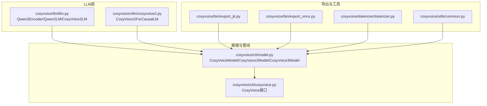
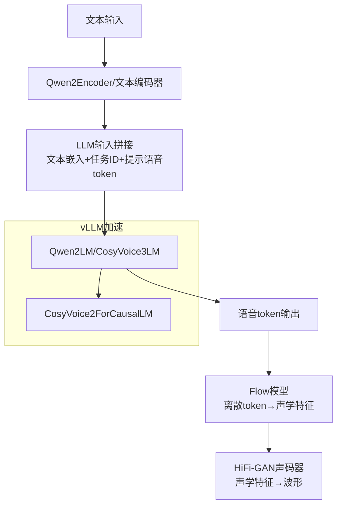
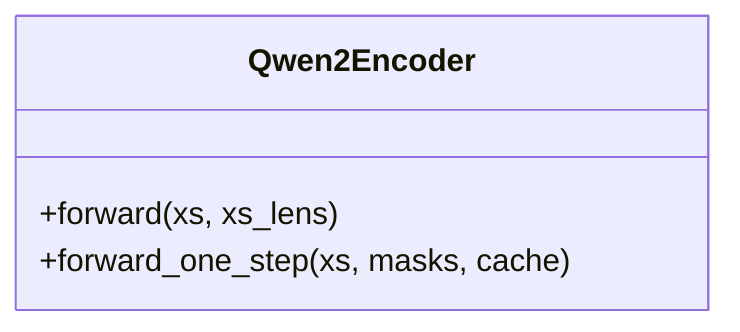
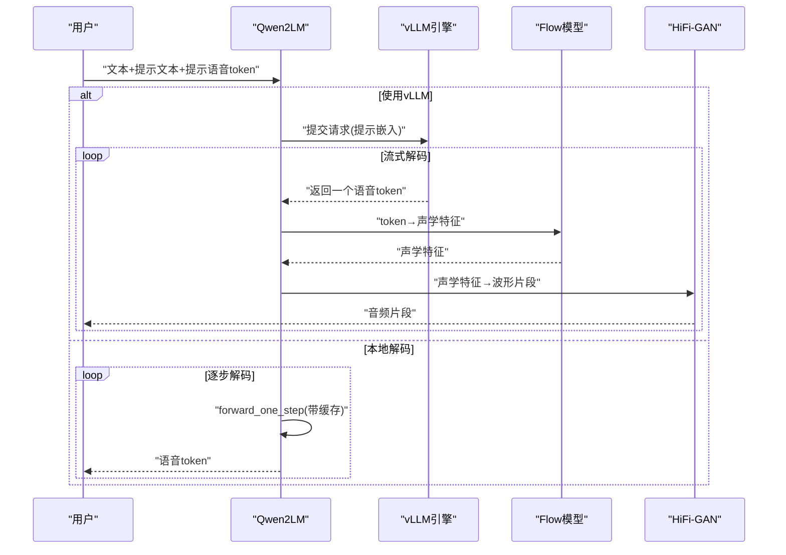
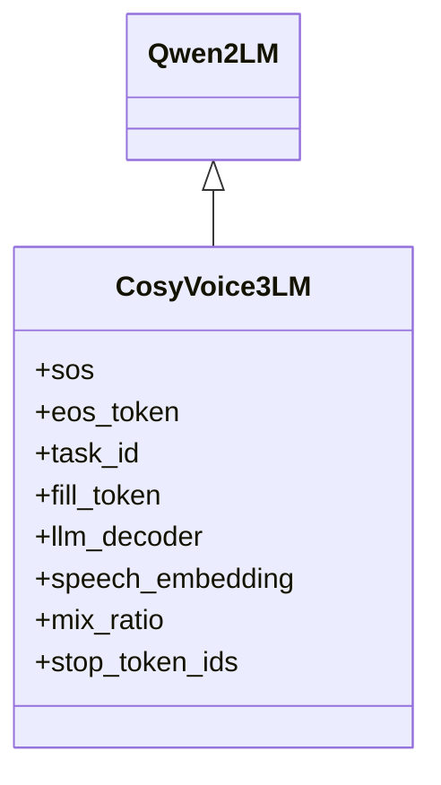
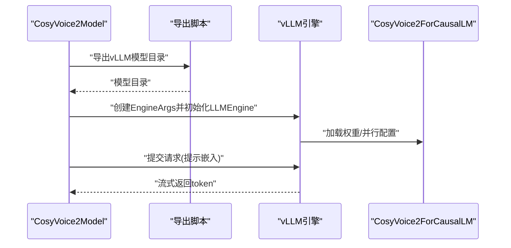
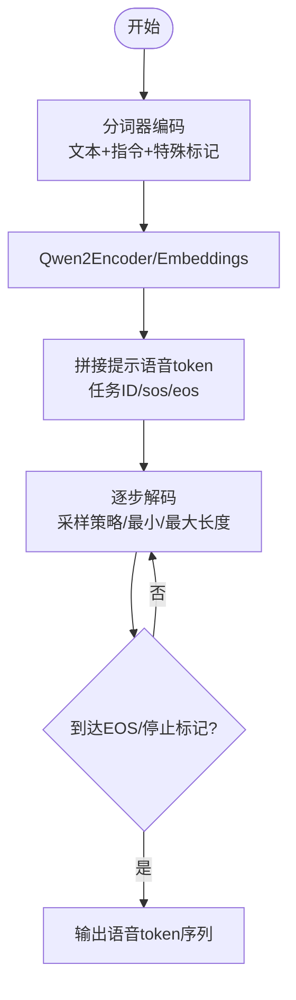
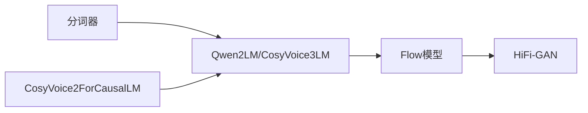

# 语言模型架构

<cite>
**本文引用的文件**
- [cosyvoice/llm/llm.py](file://cosyvoice/llm/llm.py)
- [cosyvoice/vllm/cosyvoice2.py](file://cosyvoice/vllm/cosyvoice2.py)
- [cosyvoice/cli/model.py](file://cosyvoice/cli/model.py)
- [cosyvoice/bin/export_jit.py](file://cosyvoice/bin/export_jit.py)
- [cosyvoice/bin/export_onnx.py](file://cosyvoice/bin/export_onnx.py)
- [cosyvoice/tokenizer/tokenizer.py](file://cosyvoice/tokenizer/tokenizer.py)
- [cosyvoice/utils/common.py](file://cosyvoice/utils/common.py)
- [cosyvoice/cli/cosyvoice.py](file://cosyvoice/cli/cosyvoice.py)
- [vllm_example.py](file://vllm_example.py)
- [examples/grpo/cosyvoice2/pretrained_to_huggingface.py](file://examples/grpo/cosyvoice2/pretrained_to_huggingface.py)
</cite>

## 目录
1. [引言](#引言)
2. [项目结构](#项目结构)
3. [核心组件](#核心组件)
4. [架构总览](#架构总览)
5. [详细组件分析](#详细组件分析)
6. [依赖关系分析](#依赖关系分析)
7. [性能考量](#性能考量)
8. [故障排查指南](#故障排查指南)
9. [结论](#结论)
10. [附录](#附录)

## 引言
本文件系统性解析 CosyVoice 中语言模型（LLM）的架构设计，重点聚焦以下方面：
- 基于 Qwen 架构的定制化实现：Qwen2Encoder、Qwen2LM、CosyVoice3LM 的继承与扩展。
- 文本序列到语音标记序列的转换流程，以及与 Flow 模型的协同机制。
- CosyVoice3LM 对 Qwen2LM 的继承与扩展，以及 vLLM 集成（CosyVoice2ForCausalLM）带来的推理性能优化。
- 指令模式（Instruct）的工作原理，包括如何将自然语言指令编码为控制信号。
- 模型初始化、加载与推理的代码示例路径，以及 FP16 精度与 JIT 编译对性能的影响。

## 项目结构
CosyVoice 的 LLM 相关代码主要集中在以下模块：
- 语言模型实现：cosyvoice/llm/llm.py
- vLLM 接入适配：cosyvoice/vllm/cosyvoice2.py
- 推理与管线：cosyvoice/cli/model.py、cosyvoice/cli/cosyvoice.py
- 导出工具：cosyvoice/bin/export_jit.py、cosyvoice/bin/export_onnx.py
- 分词器与通用工具：cosyvoice/tokenizer/tokenizer.py、cosyvoice/utils/common.py

图表来源
- [cosyvoice/llm/llm.py](file://cosyvoice/llm/llm.py#L1-L740)
- [cosyvoice/vllm/cosyvoice2.py](file://cosyvoice/vllm/cosyvoice2.py#L1-L104)
- [cosyvoice/cli/model.py](file://cosyvoice/cli/model.py#L1-L626)
- [cosyvoice/cli/cosyvoice.py](file://cosyvoice/cli/cosyvoice.py#L1-L200)
- [cosyvoice/bin/export_jit.py](file://cosyvoice/bin/export_jit.py#L1-L100)
- [cosyvoice/bin/export_onnx.py](file://cosyvoice/bin/export_onnx.py#L1-L115)
- [cosyvoice/tokenizer/tokenizer.py](file://cosyvoice/tokenizer/tokenizer.py#L1-L328)
- [cosyvoice/utils/common.py](file://cosyvoice/utils/common.py#L1-L200)

章节来源
- [cosyvoice/llm/llm.py](file://cosyvoice/llm/llm.py#L1-L740)
- [cosyvoice/vllm/cosyvoice2.py](file://cosyvoice/vllm/cosyvoice2.py#L1-L104)
- [cosyvoice/cli/model.py](file://cosyvoice/cli/model.py#L1-L626)
- [cosyvoice/cli/cosyvoice.py](file://cosyvoice/cli/cosyvoice.py#L1-L200)
- [cosyvoice/bin/export_jit.py](file://cosyvoice/bin/export_jit.py#L1-L100)
- [cosyvoice/bin/export_onnx.py](file://cosyvoice/bin/export_onnx.py#L1-L115)
- [cosyvoice/tokenizer/tokenizer.py](file://cosyvoice/tokenizer/tokenizer.py#L1-L328)
- [cosyvoice/utils/common.py](file://cosyvoice/utils/common.py#L1-L200)

## 核心组件
- Qwen2Encoder：基于 Qwen2ForCausalLM 的文本编码器，支持输入嵌入、注意力掩码与缓存前向。
- Qwen2LM：面向语音 token 生成的语言模型，负责将文本 token 与语音 token 组合为 LM 输入，输出语音 token 序列；支持 vLLM 推理与流式解码。
- CosyVoice3LM：在 Qwen2LM 基础上扩展，引入更丰富的特殊 token（如 sos/eos/task_id/fill_token），并支持更大维度的输出空间与 vLLM 集成。
- CosyVoiceModel/CosyVoice2Model/CosyVoice3Model：统一的推理管线，负责 LLM、Flow、HiFi-GAN 的协同与流式/非流式合成。
- CosyVoice2ForCausalLM：vLLM 适配层，将 Qwen2 模型接入 vLLM 推理引擎，支持提示嵌入（prompt embeds）与多并行策略。

章节来源
- [cosyvoice/llm/llm.py](file://cosyvoice/llm/llm.py#L230-L740)
- [cosyvoice/cli/model.py](file://cosyvoice/cli/model.py#L1-L626)
- [cosyvoice/vllm/cosyvoice2.py](file://cosyvoice/vllm/cosyvoice2.py#L1-L104)

## 架构总览
CosyVoice 的 LLM 架构围绕“文本→语音 token”的生成链路展开，结合 Flow 模型与 HiFi-GAN 完成端到端语音合成。LLM 层采用 Qwen2 架构并进行定制化扩展，同时通过 vLLM 实现高效推理。

图表来源
- [cosyvoice/llm/llm.py](file://cosyvoice/llm/llm.py#L230-L740)
- [cosyvoice/vllm/cosyvoice2.py](file://cosyvoice/vllm/cosyvoice2.py#L1-L104)
- [cosyvoice/cli/model.py](file://cosyvoice/cli/model.py#L1-L626)

## 详细组件分析

### Qwen2Encoder：基于 Qwen 的文本编码器
- 负责将文本 token 映射为嵌入，并通过 Qwen2ForCausalLM 前向得到隐藏状态与注意力掩码。
- 支持单步前向（forward_one_step）与缓存，便于增量解码。

图表来源
- [cosyvoice/llm/llm.py](file://cosyvoice/llm/llm.py#L230-L259)

章节来源
- [cosyvoice/llm/llm.py](file://cosyvoice/llm/llm.py#L230-L259)

### Qwen2LM：面向语音 token 的语言模型
- 输入拼接策略：在序列起始加入特殊 token（如 sos）、拼接文本嵌入、任务 ID、提示语音 token，形成统一的 LM 输入。
- 训练目标：将语音 token 序列映射为目标序列，使用标签平滑损失与准确率评估。
- 解码流程：逐步解码，使用采样策略（核采样/随机采样/重复感知采样）生成语音 token，支持最小/最大长度约束与 EOS 判定。
- vLLM 集成：当存在 vLLM 引擎时，使用 prompt embeddings 与 stop token ids 进行流式解码；否则回退到本地 forward_one_step。

图表来源
- [cosyvoice/llm/llm.py](file://cosyvoice/llm/llm.py#L345-L518)
- [cosyvoice/vllm/cosyvoice2.py](file://cosyvoice/vllm/cosyvoice2.py#L1-L104)

章节来源
- [cosyvoice/llm/llm.py](file://cosyvoice/llm/llm.py#L345-L518)

### CosyVoice3LM：继承与扩展
- 继承 Qwen2LM 的输入拼接与解码框架，扩展特殊 token 空间（sos/eos/task_id/fill_token），扩大输出维度以容纳更多语音 token 类别。
- 保留 vLLM 集成能力，支持更大的 stop token ids 集合。
- 在训练/推理中预留 instruct_token 的接入点，用于指令模式的控制信号编码。

图表来源
- [cosyvoice/llm/llm.py](file://cosyvoice/llm/llm.py#L261-L740)

章节来源
- [cosyvoice/llm/llm.py](file://cosyvoice/llm/llm.py#L620-L740)

### vLLM 集成（CosyVoice2ForCausalLM）
- 将 Qwen2 模型适配为 vLLM 可用的 CausalLM，支持提示嵌入（enable_prompt_embeds）、权重加载与并行策略（TP/PP/CP）。
- 在 CosyVoice2/3 的推理管线中，通过导出脚本生成 vLLM 可用的模型目录，并在运行时创建 LLMEngine，实现高吞吐的流式解码。

图表来源
- [cosyvoice/vllm/cosyvoice2.py](file://cosyvoice/vllm/cosyvoice2.py#L1-L104)
- [cosyvoice/cli/model.py](file://cosyvoice/cli/model.py#L421-L437)
- [vllm_example.py](file://vllm_example.py#L1-L39)

章节来源
- [cosyvoice/vllm/cosyvoice2.py](file://cosyvoice/vllm/cosyvoice2.py#L1-L104)
- [cosyvoice/cli/model.py](file://cosyvoice/cli/model.py#L421-L437)
- [vllm_example.py](file://vllm_example.py#L1-L39)

### 指令模式（Instruct）工作原理
- 分词器层面：CosyVoice3Tokenizer 注册了大量特殊 token（如系统结束标记、音素/音节标记、情感/事件标记等），为指令控制提供语义锚点。
- LLM 层面：CosyVoice3LM 在 forward 中预留 instruct_token 的输入通道，结合任务 ID 与提示语音 token，将自然语言指令编码为控制信号，驱动语音 token 的生成节奏与内容。
- 实践参考：示例脚本展示了如何在推理中组合自然语言指令与提示语音，实现风格控制与零样本克隆。

图表来源
- [cosyvoice/tokenizer/tokenizer.py](file://cosyvoice/tokenizer/tokenizer.py#L241-L328)
- [cosyvoice/llm/llm.py](file://cosyvoice/llm/llm.py#L662-L702)
- [cosyvoice/cli/cosyvoice.py](file://cosyvoice/cli/cosyvoice.py#L312-L341)

章节来源
- [cosyvoice/tokenizer/tokenizer.py](file://cosyvoice/tokenizer/tokenizer.py#L241-L328)
- [cosyvoice/llm/llm.py](file://cosyvoice/llm/llm.py#L662-L702)
- [cosyvoice/cli/cosyvoice.py](file://cosyvoice/cli/cosyvoice.py#L312-L341)

### 流式解码与混合序列（BitStream）
- Qwen2LM 提供双流（bit-stream）解码路径：在提示语音 token 不足时，按固定比例（mix_ratio）逐步追加文本与语音 token，实现边生成边解码。
- 通过 fill_token 控制追加节奏，避免过早 EOS 或过早停止。

章节来源
- [cosyvoice/llm/llm.py](file://cosyvoice/llm/llm.py#L520-L618)

## 依赖关系分析
- LLM 与 Flow/HiFi-GAN 的耦合：CosyVoiceModel 将三者串联，负责 token→mel→wave 的完整管线。
- vLLM 与 LLM 的耦合：CosyVoice2ForCausalLM 作为 vLLM 适配层，使 Qwen2LM 能够以 prompt embeddings 方式参与推理。
- 分词器与 LLM 的耦合：特殊 token 的注册与扩展，确保 LLM 输出空间与下游 Flow/HiFi-GAN 的 token 对齐。

图表来源
- [cosyvoice/tokenizer/tokenizer.py](file://cosyvoice/tokenizer/tokenizer.py#L1-L328)
- [cosyvoice/llm/llm.py](file://cosyvoice/llm/llm.py#L1-L740)
- [cosyvoice/cli/model.py](file://cosyvoice/cli/model.py#L1-L626)
- [cosyvoice/vllm/cosyvoice2.py](file://cosyvoice/vllm/cosyvoice2.py#L1-L104)

章节来源
- [cosyvoice/tokenizer/tokenizer.py](file://cosyvoice/tokenizer/tokenizer.py#L1-L328)
- [cosyvoice/llm/llm.py](file://cosyvoice/llm/llm.py#L1-L740)
- [cosyvoice/cli/model.py](file://cosyvoice/cli/model.py#L1-L626)
- [cosyvoice/vllm/cosyvoice2.py](file://cosyvoice/vllm/cosyvoice2.py#L1-L104)

## 性能考量
- FP16 精度：CosyVoiceModel/CosyVoice2Model/CosyVoice3Model 在推理时通过 autocast 自动切换半精度，显著降低显存占用并提升吞吐；CosyVoice2ForCausalLM 默认使用 bfloat16。
- JIT 编译：export_jit 脚本导出冻结与优化后的 TorchScript，减少 Python 开销，提升首包延迟与稳定性能。
- TensorRT：export_onnx 脚本导出 Flow 解码器估计器的 ONNX 并可转换为 TensorRT 引擎，进一步加速 Flow 推理。
- vLLM：通过提示嵌入与批内并行，大幅提高 LLM 解码吞吐，适合长序列与流式场景。

章节来源
- [cosyvoice/cli/model.py](file://cosyvoice/cli/model.py#L1-L200)
- [cosyvoice/bin/export_jit.py](file://cosyvoice/bin/export_jit.py#L1-L100)
- [cosyvoice/bin/export_onnx.py](file://cosyvoice/bin/export_onnx.py#L1-L115)
- [cosyvoice/vllm/cosyvoice2.py](file://cosyvoice/vllm/cosyvoice2.py#L1-L104)

## 故障排查指南
- 采样循环异常：若 ignore_eos 为真而采样持续得到 EOS，将触发采样上限错误。检查 min_token_text_ratio 与采样参数设置。
- vLLM 输出队列阻塞：确认 stop_token_ids 与 UUID 对应关系正确，避免输出队列未弹出导致死循环。
- 分词器不匹配：CosyVoice3Tokenizer 注册了大量特殊 token，若下游模型未扩展词表，可能导致 OOM 或解码失败。参考导出脚本中的词表扩展与头层权重对齐。
- ONNX/TensorRT 不一致：导出后使用 ONNX Runtime 进行一致性校验，确保动态轴与算子图正确。

章节来源
- [cosyvoice/llm/llm.py](file://cosyvoice/llm/llm.py#L149-L168)
- [cosyvoice/bin/export_onnx.py](file://cosyvoice/bin/export_onnx.py#L55-L115)
- [examples/grpo/cosyvoice2/pretrained_to_huggingface.py](file://examples/grpo/cosyvoice2/pretrained_to_huggingface.py#L60-L122)

## 结论
CosyVoice 的 LLM 架构以 Qwen2 为核心，通过定制化的输入拼接、特殊 token 扩展与 vLLM 集成，实现了从文本到语音 token 的高效生成，并与 Flow/HiFi-GAN 形成稳定的端到端管线。CosyVoice3LM 在 Qwen2LM 基础上进一步扩展了输出空间与指令控制能力，配合 FP16、JIT、TensorRT 与 vLLM，显著提升了推理性能与实时性。

## 附录

### 模型初始化、加载与推理示例（代码路径）
- CosyVoice 初始化与加载
  - [cosyvoice/cli/cosyvoice.py](file://cosyvoice/cli/cosyvoice.py#L39-L84)
- CosyVoice2 vLLM 加载与推理
  - [cosyvoice/cli/model.py](file://cosyvoice/cli/model.py#L421-L437)
  - [vllm_example.py](file://vllm_example.py#L1-L39)
- CosyVoice3 指令模式推理
  - [cosyvoice/cli/cosyvoice.py](file://cosyvoice/cli/cosyvoice.py#L312-L341)
- JIT 导出与加载
  - [cosyvoice/bin/export_jit.py](file://cosyvoice/bin/export_jit.py#L51-L99)
  - [cosyvoice/cli/model.py](file://cosyvoice/cli/model.py#L97-L112)
- ONNX 导出与 TensorRT 转换
  - [cosyvoice/bin/export_onnx.py](file://cosyvoice/bin/export_onnx.py#L55-L115)
  - [cosyvoice/cli/model.py](file://cosyvoice/cli/model.py#L113-L132)

### FP16 与 JIT 对性能的影响
- FP16：在 CosyVoiceModel/CosyVoice2Model/CosyVoice3Model 的推理路径中广泛使用 autocast，结合 vLLM 的 bfloat16，可显著降低显存占用并提升吞吐。
- JIT：冻结与优化后的 TorchScript 减少 Python 层开销，提升首包延迟与稳定性；导出脚本提供 fp32/fp16 两套模型以适配不同硬件环境。

章节来源
- [cosyvoice/cli/model.py](file://cosyvoice/cli/model.py#L1-L200)
- [cosyvoice/bin/export_jit.py](file://cosyvoice/bin/export_jit.py#L1-L100)
- [cosyvoice/vllm/cosyvoice2.py](file://cosyvoice/vllm/cosyvoice2.py#L1-L104)