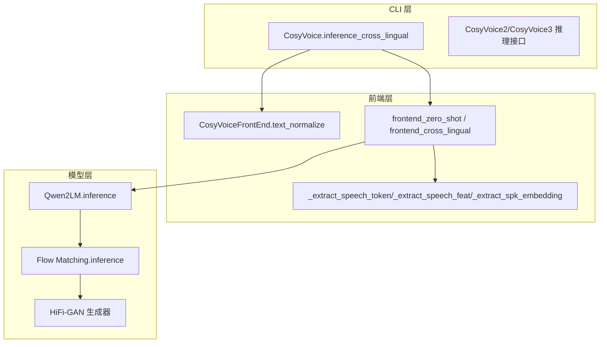
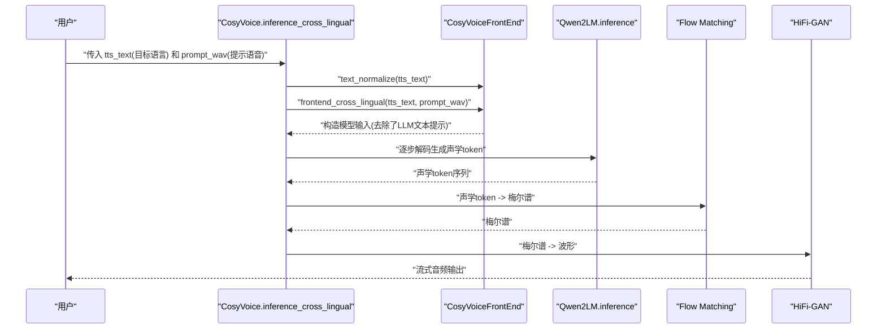
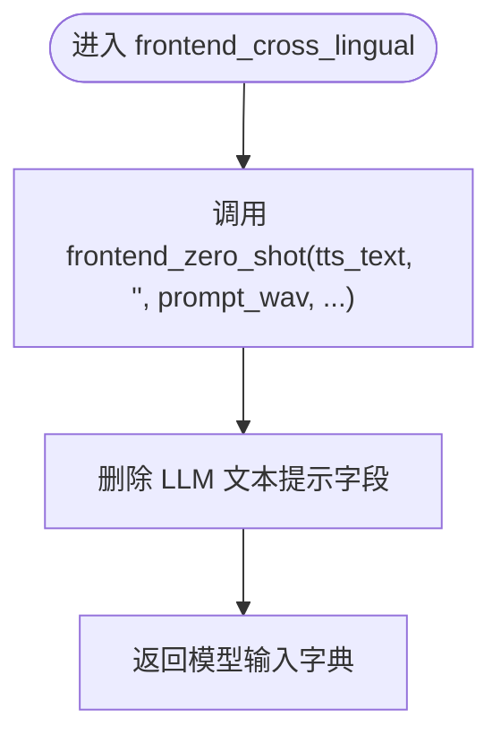
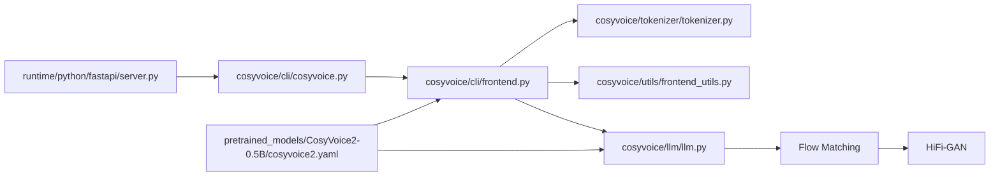

# 跨语言模式

<cite>
**本文引用的文件**
- [cosyvoice/cli/cosyvoice.py](file://cosyvoice/cli/cosyvoice.py)
- [cosyvoice/cli/frontend.py](file://cosyvoice/cli/frontend.py)
- [cosyvoice/llm/llm.py](file://cosyvoice/llm/llm.py)
- [cosyvoice/utils/frontend_utils.py](file://cosyvoice/utils/frontend_utils.py)
- [cosyvoice/tokenizer/tokenizer.py](file://cosyvoice/tokenizer/tokenizer.py)
- [pretrained_models/CosyVoice2-0.5B/cosyvoice2.yaml](file://pretrained_models/CosyVoice2-0.5B/cosyvoice2.yaml)
- [example.py](file://example.py)
- [README.md](file://README.md)
- [runtime/python/fastapi/server.py](file://runtime/python/fastapi/server.py)
</cite>

## 目录
1. [简介](#简介)
2. [项目结构](#项目结构)
3. [核心组件](#核心组件)
4. [架构总览](#架构总览)
5. [详细组件分析](#详细组件分析)
6. [依赖关系分析](#依赖关系分析)
7. [性能考量](#性能考量)
8. [故障排查指南](#故障排查指南)
9. [结论](#结论)
10. [附录](#附录)

## 简介
本节面向希望理解 CosyVoice 跨语言语音合成（Cross-lingual）模式的读者，系统阐述以下要点：
- 如何通过“一种语言的提示语音”合成“另一种语言”的文本；
- 在 frontend_zero_shot 的基础上，如何移除 LLM 部分的提示信息，从而实现跨语言音色迁移；
- 多语言合成的使用示例与部署入口；
- 技术挑战与优化建议，包括音素对齐与韵律迁移。

## 项目结构
CosyVoice 的跨语言模式由三层协同完成：
- CLI 层：对外暴露 inference_cross_lingual 接口，负责文本切分、调用前端与模型推理；
- 前端层：负责文本归一化、语音特征/声学 token 提取、说话人嵌入提取，并构造模型输入；
- 模型层：包含 LLM（Qwen2LM）、Flow（条件流匹配）与 HiFi-GAN（声码器），完成从文本 token 到语音的生成。

图表来源
- [cosyvoice/cli/cosyvoice.py](file://cosyvoice/cli/cosyvoice.py#L178-L203)
- [cosyvoice/cli/frontend.py](file://cosyvoice/cli/frontend.py#L190-L236)
- [cosyvoice/cli/frontend.py](file://cosyvoice/cli/frontend.py#L258-L330)
- [cosyvoice/llm/llm.py](file://cosyvoice/llm/llm.py#L436-L518)

章节来源
- [cosyvoice/cli/cosyvoice.py](file://cosyvoice/cli/cosyvoice.py#L178-L203)
- [cosyvoice/cli/frontend.py](file://cosyvoice/cli/frontend.py#L190-L236)
- [cosyvoice/cli/frontend.py](file://cosyvoice/cli/frontend.py#L258-L330)
- [cosyvoice/llm/llm.py](file://cosyvoice/llm/llm.py#L436-L518)

## 核心组件
- CosyVoice.inference_cross_lingual：跨语言模式的入口，接收目标语言文本与提示语音，逐句切分后交由前端与模型推理。
- CosyVoiceFrontEnd.frontend_cross_lingual：在 frontend_zero_shot 的基础上，移除 LLM 部分的文本提示，仅保留语音提示，从而实现跨语言音色迁移。
- Qwen2LM.inference：基于 Qwen2 的 LLM 解码器，将文本 token 与语音提示拼接后逐步解码生成声学 token。
- Flow Matching：将声学 token 映射为梅尔谱，再经 HiFi-GAN 生成波形。

章节来源
- [cosyvoice/cli/cosyvoice.py](file://cosyvoice/cli/cosyvoice.py#L178-L203)
- [cosyvoice/cli/frontend.py](file://cosyvoice/cli/frontend.py#L311-L330)
- [cosyvoice/llm/llm.py](file://cosyvoice/llm/llm.py#L436-L518)

## 架构总览
跨语言模式的关键流程如下：
- 文本归一化：根据语言自动选择分词策略与断句规则；
- 前端特征提取：提取提示语音的声学特征、声学 token 与说话人嵌入；
- 输入构造：在 frontend_zero_shot 的基础上，删除 LLM 文本提示字段，仅保留语音提示；
- LLM 推理：将目标文本与语音提示拼接，逐步解码生成声学 token；
- Flow 推理：将声学 token 映射为梅尔谱；
- HiFi-GAN：将梅尔谱转为波形输出。

图表来源
- [cosyvoice/cli/cosyvoice.py](file://cosyvoice/cli/cosyvoice.py#L178-L203)
- [cosyvoice/cli/frontend.py](file://cosyvoice/cli/frontend.py#L311-L330)
- [cosyvoice/llm/llm.py](file://cosyvoice/llm/llm.py#L436-L518)

## 详细组件分析

### 组件A：跨语言推理入口（CosyVoice.inference_cross_lingual）
- 功能要点
  - 对 tts_text 进行分句与文本归一化；
  - 调用 frontend_cross_lingual 构造模型输入；
  - 通过模型 tts 接口进行流式推理，按 RTF 记录日志并逐块产出语音。
- 关键行为
  - 文本切分：按语言与 token 长度策略切分为多个片段；
  - 输入构造：委托前端完成特征提取与输入拼装；
  - 流式输出：支持 stream 参数以降低延迟。

章节来源
- [cosyvoice/cli/cosyvoice.py](file://cosyvoice/cli/cosyvoice.py#L178-L203)

### 组件B：前端处理（frontend_cross_lingual）
- 基于 frontend_zero_shot 的扩展
  - 在零样本模式中，前端会同时提取 prompt_text、prompt_speech_token、prompt_speech_feat 与说话人嵌入；
  - 在跨语言模式中，移除 LLM 文本提示字段，仅保留语音提示，从而实现“跨语言音色迁移”。
- 关键步骤
  - 调用 frontend_zero_shot(tts_text, "", prompt_wav, ...)；
  - 删除 prompt_text、prompt_text_len、llm_prompt_speech_token、llm_prompt_speech_token_len；
  - 返回仅含语音提示的模型输入字典。

图表来源
- [cosyvoice/cli/frontend.py](file://cosyvoice/cli/frontend.py#L311-L330)

章节来源
- [cosyvoice/cli/frontend.py](file://cosyvoice/cli/frontend.py#L311-L330)

### 组件C：零样本前端（frontend_zero_shot）
- 功能要点
  - 提取目标文本 token 与长度；
  - 若未指定预定义说话人 ID，则从提示语音中提取：
    - 语音特征（24kHz）与长度；
    - 语音声学 token（16kHz）与长度；
    - 说话人嵌入（16kHz）；
  - 在 CosyVoice2 中，强制 speech_feat 与 speech_token 的长度比例为 2:1；
  - 将上述信息与目标文本 token 组合为模型输入。
- 重要细节
  - 语音特征与声学 token 的长度对齐逻辑；
  - 说话人嵌入用于 Flow 与 LLM 的音色约束。

章节来源
- [cosyvoice/cli/frontend.py](file://cosyvoice/cli/frontend.py#L258-L309)

### 组件D：文本归一化与语言检测（text_normalize）
- 功能要点
  - 自动检测中文/英文等语言，分别采用不同的分词与断句策略；
  - 支持数字读法、括号清理、标点规范化等；
  - 支持生成器输入（流式文本）。
- 语言能力
  - 多语言分词器与语言映射来自 tokenizer 模块；
  - README 显示支持中、英、日、韩、德、西、法、意、俄等常见语言。

章节来源
- [cosyvoice/cli/frontend.py](file://cosyvoice/cli/frontend.py#L190-L236)
- [cosyvoice/utils/frontend_utils.py](file://cosyvoice/utils/frontend_utils.py#L1-L168)
- [cosyvoice/tokenizer/tokenizer.py](file://cosyvoice/tokenizer/tokenizer.py#L1-L238)
- [README.md](file://README.md#L12-L21)

### 组件E：LLM 推理（Qwen2LM.inference）
- 功能要点
  - 将目标文本与语音提示拼接后，逐步解码生成声学 token；
  - 支持最小/最大长度约束，避免过短或过长；
  - 支持 vLLM 加速（CosyVoice3/CosyVoice2）。
- 关键参数
  - sampling 控制 top-k/top-p；
  - min_token_text_ratio 与 max_token_text_ratio 控制声学 token 与文本 token 的长度关系。

章节来源
- [cosyvoice/llm/llm.py](file://cosyvoice/llm/llm.py#L436-L518)

### 组件F：Flow 推理与 HiFi-GAN
- 功能要点
  - 将声学 token 映射为梅尔谱；
  - 通过 HiFi-GAN 生成波形；
  - CosyVoice2 配置中设置 token_frame_rate 与 token_mel_ratio，保证对齐关系。
- 配置参考
  - token_frame_rate、token_mel_ratio、input_frame_rate 等参数在 CosyVoice2 配置中给出。

章节来源
- [pretrained_models/CosyVoice2-0.5B/cosyvoice2.yaml](file://pretrained_models/CosyVoice2-0.5B/cosyvoice2.yaml#L1-L234)

## 依赖关系分析
- CLI 与前端
  - CosyVoice.inference_cross_lingual 依赖 CosyVoiceFrontEnd.text_normalize 与 frontend_cross_lingual；
  - 前端依赖 tokenizer、特征提取器与 ONNX 推理会话。
- 前端与模型
  - 前端提取的语音特征、声学 token 与说话人嵌入作为 Qwen2LM.inference 的输入；
  - Flow 与 HiFi-GAN 依赖声学 token 与说话人嵌入。
- 配置与运行时
  - CosyVoice2/CosyVoice3 的 YAML 配置定义了 token 与梅尔谱的对齐关系；
  - FastAPI/GRPC 服务提供跨语言推理接口。

图表来源
- [cosyvoice/cli/cosyvoice.py](file://cosyvoice/cli/cosyvoice.py#L178-L203)
- [cosyvoice/cli/frontend.py](file://cosyvoice/cli/frontend.py#L190-L236)
- [cosyvoice/tokenizer/tokenizer.py](file://cosyvoice/tokenizer/tokenizer.py#L1-L238)
- [cosyvoice/utils/frontend_utils.py](file://cosyvoice/utils/frontend_utils.py#L1-L168)
- [cosyvoice/llm/llm.py](file://cosyvoice/llm/llm.py#L436-L518)
- [pretrained_models/CosyVoice2-0.5B/cosyvoice2.yaml](file://pretrained_models/CosyVoice2-0.5B/cosyvoice2.yaml#L1-L234)
- [runtime/python/fastapi/server.py](file://runtime/python/fastapi/server.py#L105-L121)

章节来源
- [cosyvoice/cli/cosyvoice.py](file://cosyvoice/cli/cosyvoice.py#L178-L203)
- [cosyvoice/cli/frontend.py](file://cosyvoice/cli/frontend.py#L190-L236)
- [cosyvoice/llm/llm.py](file://cosyvoice/llm/llm.py#L436-L518)
- [pretrained_models/CosyVoice2-0.5B/cosyvoice2.yaml](file://pretrained_models/CosyVoice2-0.5B/cosyvoice2.yaml#L1-L234)
- [runtime/python/fastapi/server.py](file://runtime/python/fastapi/server.py#L105-L121)

## 性能考量
- 流式推理
  - CLI 层支持 stream 模式，结合模型侧的 KV 缓存与静态块大小，降低首包延迟；
  - CosyVoice2 配置中定义了 chunk_size 与 num_decoding_left_chunks，有助于流式解码。
- 对齐与长度约束
  - CosyVoice2 强制 speech_feat 与 speech_token 长度比例为 2:1，减少对齐误差；
  - LLM 侧通过 min_token_text_ratio 与 max_token_text_ratio 控制声学 token 与文本 token 的长度关系，避免过度生成。
- 加速方案
  - vLLM 加速（CosyVoice2/3）可显著提升 LLM 推理速度；
  - TensorRT-LLM（CosyVoice2）可加速 LLM 推理。

章节来源
- [pretrained_models/CosyVoice2-0.5B/cosyvoice2.yaml](file://pretrained_models/CosyVoice2-0.5B/cosyvoice2.yaml#L1-L234)
- [cosyvoice/llm/llm.py](file://cosyvoice/llm/llm.py#L436-L518)
- [README.md](file://README.md#L12-L21)

## 故障排查指南
- 提示语音过长
  - 前端在提取语音声学 token 时有限制（例如不超过 30 秒），超限将报错；
  - 建议缩短提示语音或拆分多次调用。
- 文本长度与提示文本不匹配
  - CLI 层会对目标文本长度与提示文本长度进行比较并给出警告，建议目标文本尽量与提示文本长度相当；
  - 若目标文本过短，可能导致音色迁移效果不佳。
- 语言混杂文本
  - README 显示支持多语言，但跨语言模式下仍需确保提示语音与目标文本语言差异合理；
  - 可通过 tokenizer 的语言映射与分词策略避免歧义。
- 服务端接口
  - FastAPI 提供 /inference_cross_lingual 接口，便于在线部署与调试；
  - 确认提示语音采样率为 16kHz，否则需在前端进行重采样。

章节来源
- [cosyvoice/cli/frontend.py](file://cosyvoice/cli/frontend.py#L131-L151)
- [cosyvoice/cli/cosyvoice.py](file://cosyvoice/cli/cosyvoice.py#L178-L203)
- [runtime/python/fastapi/server.py](file://runtime/python/fastapi/server.py#L105-L121)

## 结论
跨语言语音合成的核心在于“以语音提示驱动音色迁移，以文本提示驱动内容生成”。CosyVoice 通过在 frontend_zero_shot 的基础上移除 LLM 文本提示，实现了“跨语言音色迁移”，并在 LLM 与 Flow 的协同下，将目标语言文本映射为高质量语音。实践中应关注提示语音长度、文本长度与对齐关系，并结合流式推理与加速方案以获得更佳的实时性与稳定性。

## 附录

### 多语言合成代码示例（路径引用）
- 示例脚本
  - CosyVoice3 多语言合成示例：[example.py](file://example.py#L71-L98)
  - CosyVoice2 跨语言合成示例：[example.py](file://example.py#L36-L70)
- FastAPI 接口
  - 跨语言推理接口：[runtime/python/fastapi/server.py](file://runtime/python/fastapi/server.py#L105-L121)

章节来源
- [example.py](file://example.py#L71-L98)
- [example.py](file://example.py#L36-L70)
- [runtime/python/fastapi/server.py](file://runtime/python/fastapi/server.py#L105-L121)

### 技术挑战与优化建议
- 音素对齐
  - 通过 CosyVoice2 的 token_mel_ratio 与 token_frame_rate，确保声学 token 与梅尔谱帧率一致；
  - 在前端对 speech_feat 与 speech_token 进行裁剪与对齐，减少误差传播。
- 韵律迁移
  - 通过提示语音的声学特征与说话人嵌入，约束 Flow 与 LLM 的韵律输出；
  - 在 CosyVoice2 中，强制比例与长度约束有助于稳定韵律迁移。
- 多语言一致性
  - 使用多语言分词器与语言映射，确保不同语言的文本被正确归一化与分句；
  - 在跨语言场景中，建议提示语音与目标文本语言差异适中，避免极端跨语言导致的韵律不匹配。

章节来源
- [pretrained_models/CosyVoice2-0.5B/cosyvoice2.yaml](file://pretrained_models/CosyVoice2-0.5B/cosyvoice2.yaml#L1-L234)
- [cosyvoice/tokenizer/tokenizer.py](file://cosyvoice/tokenizer/tokenizer.py#L1-L238)
- [cosyvoice/utils/frontend_utils.py](file://cosyvoice/utils/frontend_utils.py#L1-L168)