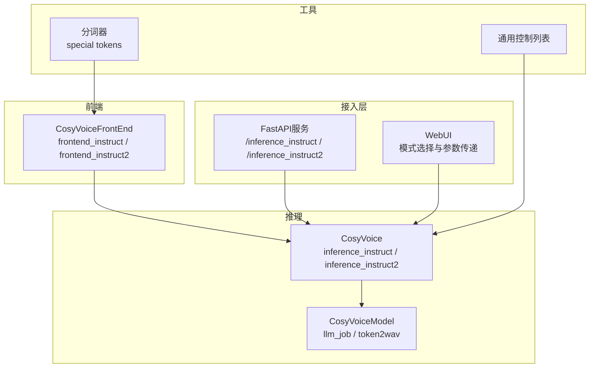
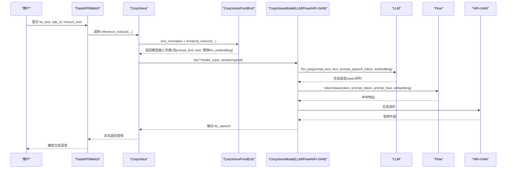
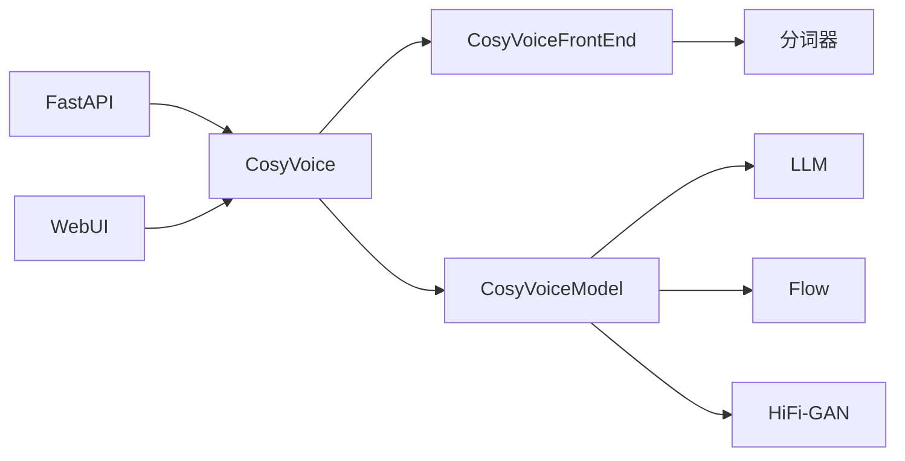

# Instruct模式

<cite>
**本文引用的文件**
- [cosyvoice/cli/cosyvoice.py](file://cosyvoice/cli/cosyvoice.py)
- [cosyvoice/cli/frontend.py](file://cosyvoice/cli/frontend.py)
- [runtime/python/fastapi/server.py](file://runtime/python/fastapi/server.py)
- [webui.py](file://webui.py)
- [example.py](file://example.py)
- [cosyvoice/tokenizer/tokenizer.py](file://cosyvoice/tokenizer/tokenizer.py)
- [cosyvoice/utils/common.py](file://cosyvoice/utils/common.py)
- [cosyvoice/cli/model.py](file://cosyvoice/cli/model.py)
</cite>

## 目录
1. [引言](#引言)
2. [项目结构](#项目结构)
3. [核心组件](#核心组件)
4. [架构总览](#架构总览)
5. [详细组件分析](#详细组件分析)
6. [依赖关系分析](#依赖关系分析)
7. [性能考量](#性能考量)
8. [故障排查指南](#故障排查指南)
9. [结论](#结论)
10. [附录](#附录)

## 引言
本文件系统性解析CosyVoice的Instruct（指令引导）模式，重点阐述以下内容：
- inference_instruct方法如何通过instruct_text参数控制语音的情感、风格与语调；
- frontend_instruct方法如何移除说话人嵌入以避免信息泄露，并将指令文本作为新的提示输入；
- 自然语言指令示例（如“用欢快的语调朗读”）及其对合成语音的影响；
- Instruct模式与SFT模式的区别，以及在创造多样化语音表达方面的应用价值。

## 项目结构
围绕Instruct模式的关键文件与职责如下：
- 推理入口与模式切换：cosyvoice/cli/cosyvoice.py
- 前端处理与指令注入：cosyvoice/cli/frontend.py
- Web与API接入：runtime/python/fastapi/server.py、webui.py
- 示例与控制标签：example.py、cosyvoice/tokenizer/tokenizer.py、cosyvoice/utils/common.py
- 模型推理管线：cosyvoice/cli/model.py

图表来源
- [cosyvoice/cli/cosyvoice.py](file://cosyvoice/cli/cosyvoice.py#L205-L231)
- [cosyvoice/cli/frontend.py](file://cosyvoice/cli/frontend.py#L332-L374)
- [runtime/python/fastapi/server.py](file://runtime/python/fastapi/server.py#L124-L159)
- [webui.py](file://webui.py#L114-L138)
- [cosyvoice/cli/model.py](file://cosyvoice/cli/model.py#L146-L200)
- [cosyvoice/tokenizer/tokenizer.py](file://cosyvoice/tokenizer/tokenizer.py#L240-L328)
- [cosyvoice/utils/common.py](file://cosyvoice/utils/common.py#L20-L54)

章节来源
- [cosyvoice/cli/cosyvoice.py](file://cosyvoice/cli/cosyvoice.py#L205-L231)
- [cosyvoice/cli/frontend.py](file://cosyvoice/cli/frontend.py#L332-L374)
- [runtime/python/fastapi/server.py](file://runtime/python/fastapi/server.py#L124-L159)
- [webui.py](file://webui.py#L114-L138)
- [cosyvoice/cli/model.py](file://cosyvoice/cli/model.py#L146-L200)
- [cosyvoice/tokenizer/tokenizer.py](file://cosyvoice/tokenizer/tokenizer.py#L240-L328)
- [cosyvoice/utils/common.py](file://cosyvoice/utils/common.py#L20-L54)

## 核心组件
- CosyVoice.inference_instruct：Instruct模式推理入口，接收待合成文本、预训练说话人ID与自然语言指令，按句切分后逐句推理。
- CosyVoiceFrontEnd.frontend_instruct：Instruct模式前端处理，移除LLM侧的说话人嵌入，注入instruct_text作为提示，形成模型输入字典。
- CosyVoiceModel.llm_job：将文本与指令拼接为LLM输入，驱动语音token生成；token2wav将token转换为波形。
- FastAPI与WebUI：提供HTTP接口与图形界面，分别调用inference_instruct与inference_instruct2。

章节来源
- [cosyvoice/cli/cosyvoice.py](file://cosyvoice/cli/cosyvoice.py#L205-L231)
- [cosyvoice/cli/frontend.py](file://cosyvoice/cli/frontend.py#L332-L374)
- [cosyvoice/cli/model.py](file://cosyvoice/cli/model.py#L146-L200)
- [runtime/python/fastapi/server.py](file://runtime/python/fastapi/server.py#L124-L159)
- [webui.py](file://webui.py#L114-L138)

## 架构总览
Instruct模式的端到端流程如下：
- 用户输入自然语言指令（如“用欢快的语调朗读”）与待合成文本；
- 前端对指令与文本进行归一化与分词，构建prompt_text与text；
- 移除LLM侧说话人嵌入，避免泄露预训练音色信息；
- 将prompt_text与text拼接到LLM输入，驱动语音token生成；
- Flow与HiFi-GAN将token转换为波形输出。

图表来源
- [cosyvoice/cli/cosyvoice.py](file://cosyvoice/cli/cosyvoice.py#L205-L231)
- [cosyvoice/cli/frontend.py](file://cosyvoice/cli/frontend.py#L332-L374)
- [cosyvoice/cli/model.py](file://cosyvoice/cli/model.py#L146-L200)
- [runtime/python/fastapi/server.py](file://runtime/python/fastapi/server.py#L124-L159)

## 详细组件分析

### inference_instruct 方法：自然语言指令驱动的语音合成
- 输入参数：tts_text（待合成文本）、spk_id（预训练说话人ID）、instruct_text（自然语言指令）、stream/speed/text_frontend。
- 关键逻辑：
  - 对instruct_text进行文本归一化（split=False），对tts_text按句切分（split=True）；
  - 逐句调用frontend_instruct生成模型输入；
  - 调用model.tts进行推理，支持流式与速度调节。
- 作用：将自然语言指令注入LLM输入，控制情感、风格与语调。

章节来源
- [cosyvoice/cli/cosyvoice.py](file://cosyvoice/cli/cosyvoice.py#L205-L231)

### frontend_instruct 方法：移除说话人嵌入并注入指令
- 输入：tts_text、spk_id、instruct_text。
- 关键逻辑：
  - 调用frontend_sft获取基础模型输入；
  - 删除llm_embedding，避免泄露预训练音色信息；
  - 对instruct_text进行分词，得到prompt_text与prompt_text_len；
  - 将prompt_text与prompt_text_len写入模型输入。
- 作用：将自然语言指令作为LLM的提示，替代或补充说话人信息。

章节来源
- [cosyvoice/cli/frontend.py](file://cosyvoice/cli/frontend.py#L332-L350)

### 分词器与控制标签：支撑多样化的语音表达
- 分词器支持大量特殊控制标签，如“<|endofprompt|>”、“[laughter]”、“<strong>”、“[breath]”等；
- 这些标签与自然语言指令共同作用，指导LLM生成符合期望的语音token。

章节来源
- [cosyvoice/tokenizer/tokenizer.py](file://cosyvoice/tokenizer/tokenizer.py#L240-L328)

### 示例与自然语言指令
- 示例脚本展示了Instruct模式的典型用法，包括多语言与方言控制、语速与情绪控制等；
- 通用控制列表提供了常见指令模板，便于快速试验。

章节来源
- [example.py](file://example.py#L29-L33)
- [cosyvoice/utils/common.py](file://cosyvoice/utils/common.py#L20-L54)

### Instruct模式与SFT模式的区别
- SFT模式：使用预训练说话人ID，前端直接注入预定义的说话人嵌入，强调音色一致性；
- Instruct模式：移除LLM侧说话人嵌入，以自然语言指令作为主要引导，强调风格与情感的可控性；
- 应用价值：Instruct模式可在不泄露特定音色的前提下，灵活控制语音的语调、节奏、情绪与口音，适合多样化表达与创意合成。

章节来源
- [cosyvoice/cli/frontend.py](file://cosyvoice/cli/frontend.py#L332-L350)
- [cosyvoice/cli/cosyvoice.py](file://cosyvoice/cli/cosyvoice.py#L121-L145)

### API与WebUI集成
- FastAPI提供/inference_instruct与/inference_instruct2接口，分别对应基础Instruct与CosyVoice2增强Instruct；
- WebUI根据用户选择的模式调用相应推理接口，并将instruct_text与prompt_wav等参数传入。

章节来源
- [runtime/python/fastapi/server.py](file://runtime/python/fastapi/server.py#L124-L159)
- [webui.py](file://webui.py#L114-L138)

### 模型推理管线：LLM生成token、Flow与HiFi-GAN合成波形
- llm_job：将prompt_text与text拼接为LLM输入，结合prompt_speech_token与embedding生成语音token；
- token2wav：将token转换为声学特征并合成波形，支持缓存与重叠fade以提升连续性。

章节来源
- [cosyvoice/cli/model.py](file://cosyvoice/cli/model.py#L146-L200)

## 依赖关系分析
- CosyVoice依赖CosyVoiceFrontEnd进行文本与语音特征处理；
- CosyVoiceFrontEnd依赖分词器与特征提取器；
- CosyVoiceModel封装LLM、Flow与HiFi-GAN，负责token生成与波形合成；
- FastAPI与WebUI作为外部接入层，统一调度推理流程。

图表来源
- [cosyvoice/cli/cosyvoice.py](file://cosyvoice/cli/cosyvoice.py#L205-L231)
- [cosyvoice/cli/frontend.py](file://cosyvoice/cli/frontend.py#L332-L374)
- [cosyvoice/cli/model.py](file://cosyvoice/cli/model.py#L146-L200)
- [runtime/python/fastapi/server.py](file://runtime/python/fastapi/server.py#L124-L159)
- [webui.py](file://webui.py#L114-L138)

## 性能考量
- 流式推理：支持stream参数，按块生成音频，降低首帧延迟；
- 速度调节：speed参数影响推理速度，适合不同场景需求；
- 优化策略：可通过JIT/TensorRT/vLLM等优化组件加速推理（视具体模型版本而定）。

章节来源
- [cosyvoice/cli/cosyvoice.py](file://cosyvoice/cli/cosyvoice.py#L205-L231)
- [cosyvoice/cli/model.py](file://cosyvoice/cli/model.py#L146-L200)

## 故障排查指南
- 指令过短：当instruct_text过短时，可能影响合成质量，建议适当扩展指令内容；
- 采样率问题：提示音频需满足最低采样率要求，否则可能导致特征提取异常；
- 控制标签缺失：未正确使用“<|endofprompt|>”等控制标签，可能影响指令边界识别；
- 会话冲突：多线程/并发场景下，确保每个会话使用唯一uuid，避免共享状态干扰。

章节来源
- [cosyvoice/cli/cosyvoice.py](file://cosyvoice/cli/cosyvoice.py#L165-L176)
- [cosyvoice/cli/frontend.py](file://cosyvoice/cli/frontend.py#L131-L151)
- [cosyvoice/tokenizer/tokenizer.py](file://cosyvoice/tokenizer/tokenizer.py#L240-L328)

## 结论
Instruct模式通过将自然语言指令注入LLM输入，实现了对语音情感、风格与语调的精细化控制。相比SFT模式，Instruct模式更注重表达多样性与可控性，且通过移除说话人嵌入避免信息泄露。结合分词器的丰富控制标签与示例模板，用户可以在不暴露特定音色的前提下，灵活生成多样化的语音表达。

## 附录
- 自然语言指令示例（来自通用控制列表与示例脚本）：
  - 方言与口音：用广东话/四川话/东北话/河南话等表达；
  - 语速控制：尽可能快/慢地语速；
  - 情绪控制：非常开心/非常伤心/非常生气；
  - 风格控制：机器人风格、小猪佩奇风格等。
- 使用建议：
  - 在instruct_text末尾添加“<|endofprompt|>”，明确指令边界；
  - 合理设置speed与stream参数，平衡实时性与质量；
  - 对于CosyVoice2/3，可结合零样本提示音频进一步微调音色风格。

章节来源
- [cosyvoice/utils/common.py](file://cosyvoice/utils/common.py#L20-L54)
- [example.py](file://example.py#L29-L33)
- [cosyvoice/tokenizer/tokenizer.py](file://cosyvoice/tokenizer/tokenizer.py#L240-L328)