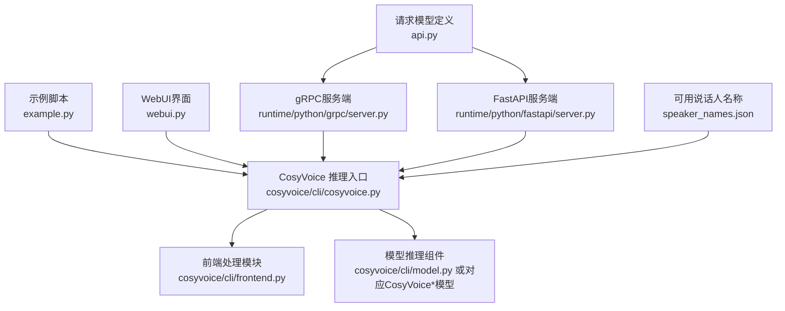
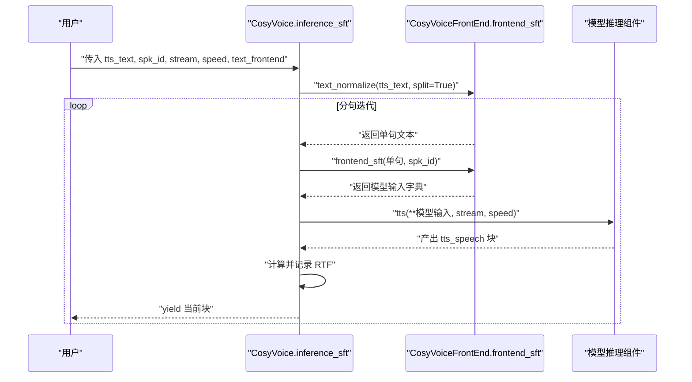
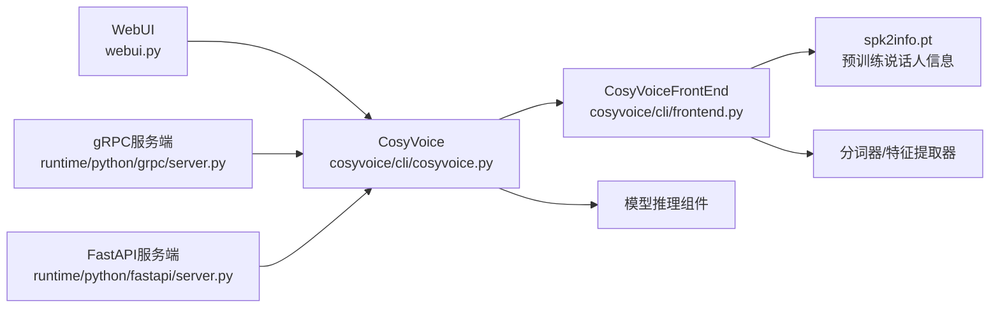

# SFT模式

<cite>
**本文引用的文件**
- [cosyvoice/cli/cosyvoice.py](file://cosyvoice/cli/cosyvoice.py)
- [cosyvoice/cli/frontend.py](file://cosyvoice/cli/frontend.py)
- [example.py](file://example.py)
- [webui.py](file://webui.py)
- [runtime/python/grpc/server.py](file://runtime/python/grpc/server.py)
- [runtime/python/fastapi/server.py](file://runtime/python/fastapi/server.py)
- [api.py](file://api.py)
- [speaker_names.json](file://speaker_names.json)
</cite>

## 目录
1. [简介](#简介)
2. [项目结构](#项目结构)
3. [核心组件](#核心组件)
4. [架构总览](#架构总览)
5. [详细组件分析](#详细组件分析)
6. [依赖关系分析](#依赖关系分析)
7. [性能考量](#性能考量)
8. [故障排查指南](#故障排查指南)
9. [结论](#结论)
10. [附录](#附录)

## 简介
本节面向希望理解并使用SFT（说话人微调）模式的用户，系统讲解其工作原理、参数含义、前端处理流程、典型用法、性能特征及与其他模式的差异。SFT模式通过使用预训练的说话人信息，直接驱动模型进行高质量的语音合成，适合需要稳定音色一致性与较高合成质量的场景。

## 项目结构
围绕SFT模式的关键文件与职责如下：
- 推理入口与模式调度：cosyvoice/cli/cosyvoice.py
- 前端处理与特征抽取：cosyvoice/cli/frontend.py
- 示例与用法演示：example.py
- WebUI与服务端集成：webui.py、runtime/python/grpc/server.py、runtime/python/fastapi/server.py
- 请求模型定义：api.py
- 可用说话人名称映射：speaker_names.json

图表来源
- [cosyvoice/cli/cosyvoice.py](file://cosyvoice/cli/cosyvoice.py#L121-L176)
- [cosyvoice/cli/frontend.py](file://cosyvoice/cli/frontend.py#L190-L256)
- [example.py](file://example.py#L1-L35)
- [webui.py](file://webui.py#L114-L138)
- [runtime/python/grpc/server.py](file://runtime/python/grpc/server.py#L45-L65)
- [runtime/python/fastapi/server.py](file://runtime/python/fastapi/server.py#L69-L75)
- [api.py](file://api.py#L76-L100)
- [speaker_names.json](file://speaker_names.json#L1-L14)

章节来源
- [cosyvoice/cli/cosyvoice.py](file://cosyvoice/cli/cosyvoice.py#L121-L176)
- [cosyvoice/cli/frontend.py](file://cosyvoice/cli/frontend.py#L190-L256)
- [example.py](file://example.py#L1-L35)
- [webui.py](file://webui.py#L114-L138)
- [runtime/python/grpc/server.py](file://runtime/python/grpc/server.py#L45-L65)
- [runtime/python/fastapi/server.py](file://runtime/python/fastapi/server.py#L69-L75)
- [api.py](file://api.py#L76-L100)
- [speaker_names.json](file://speaker_names.json#L1-L14)

## 核心组件
- CosyVoice.inference_sft：SFT模式推理主入口，负责文本切分、前端处理、模型调用与RTF日志输出。
- CosyVoiceFrontEnd.frontend_sft：SFT模式前端处理，将文本token与预训练说话人信息拼接为模型输入。
- CosyVoiceFrontEnd.text_normalize：文本标准化与分句，支持中文/英文与SSML符号检测。
- 列表可用说话人：CosyVoice.list_available_spks，读取前端持有的spk2info字典键作为可用说话人ID。

章节来源
- [cosyvoice/cli/cosyvoice.py](file://cosyvoice/cli/cosyvoice.py#L86-L95)
- [cosyvoice/cli/cosyvoice.py](file://cosyvoice/cli/cosyvoice.py#L121-L176)
- [cosyvoice/cli/frontend.py](file://cosyvoice/cli/frontend.py#L190-L256)

## 架构总览
SFT模式的端到端流程如下：
- 用户输入文本与目标说话人ID
- 文本标准化与按句切分
- 前端提取文本token，并从预训练说话人信息中组装模型输入
- 模型执行TTS推理，按块产出语音
- 记录每段产出的语音长度与实时因子（RTF）

图表来源
- [cosyvoice/cli/cosyvoice.py](file://cosyvoice/cli/cosyvoice.py#L121-L176)
- [cosyvoice/cli/frontend.py](file://cosyvoice/cli/frontend.py#L190-L256)

## 详细组件分析

### inference_sft 方法详解
- 参数说明
  - tts_text：待合成的文本字符串
  - spk_id：预训练说话人ID（需存在于前端的spk2info中）
  - stream：是否启用流式合成（按块产出）
  - speed：语速调节因子，默认1.0
  - text_frontend：是否使用文本前端处理（中文/英文正则化、分句等）
- 处理逻辑
  - 对输入文本进行标准化与分句
  - 逐句调用frontend_sft，得到模型输入
  - 调用模型tts，按块产出语音
  - 记录每块的语音长度与RTF（实时因子）
- 返回/产出
  - 生成器，逐块产出包含“tts_speech”的字典

章节来源
- [cosyvoice/cli/cosyvoice.py](file://cosyvoice/cli/cosyvoice.py#L121-L176)

### frontend_sft 方法详解
- 功能：将单句文本与预训练说话人信息组合为模型输入
- 关键步骤
  - 提取文本token与长度
  - 从spk2info中取出该说话人的预存信息（包含LLM/Flow侧嵌入等）
  - 将文本token与长度注入到该说话人信息中，形成最终输入字典
- 注意事项
  - 该方法不直接提取新的说话人嵌入，而是复用预训练说话人信息
  - 若需要去除LLM侧说话人嵌入以避免信息泄露（例如Instruct模式），需在上层前端处理中删除相应字段

章节来源
- [cosyvoice/cli/frontend.py](file://cosyvoice/cli/frontend.py#L238-L256)

### 文本前端处理（text_normalize）
- 功能：对输入文本进行规范化、分句与SSML检测
- 行为要点
  - 中文：使用中文正则化与分句策略
  - 英文：使用英文正则化与分句策略
  - SSML符号检测：若文本包含特定标记，则跳过文本前端处理
  - 生成器输入：若输入为生成器，跳过文本前端处理
- 影响：直接影响SFT模式的分句粒度与后续模型输入token化

章节来源
- [cosyvoice/cli/frontend.py](file://cosyvoice/cli/frontend.py#L190-L236)

### 列表可用说话人
- 方法：CosyVoice.list_available_spks
- 实现：读取前端spk2info的键集合作为可用说话人ID列表
- 用途：在推理前查询可用说话人ID，确保spk_id有效

章节来源
- [cosyvoice/cli/cosyvoice.py](file://cosyvoice/cli/cosyvoice.py#L86-L95)
- [speaker_names.json](file://speaker_names.json#L1-L14)

### 代码调用示例（不含具体代码内容）
- 列出可用说话人
  - 参考路径：[cosyvoice/cli/cosyvoice.py](file://cosyvoice/cli/cosyvoice.py#L86-L95)
- 执行SFT推理
  - 参考路径：[example.py](file://example.py#L1-L20)
  - WebUI调用参考：[webui.py](file://webui.py#L114-L138)
  - gRPC服务端调用参考：[runtime/python/grpc/server.py](file://runtime/python/grpc/server.py#L45-L65)
  - FastAPI服务端调用参考：[runtime/python/fastapi/server.py](file://runtime/python/fastapi/server.py#L69-L75)
  - 请求模型定义参考：[api.py](file://api.py#L76-L84)

章节来源
- [cosyvoice/cli/cosyvoice.py](file://cosyvoice/cli/cosyvoice.py#L86-L95)
- [example.py](file://example.py#L1-L20)
- [webui.py](file://webui.py#L114-L138)
- [runtime/python/grpc/server.py](file://runtime/python/grpc/server.py#L45-L65)
- [runtime/python/fastapi/server.py](file://runtime/python/fastapi/server.py#L69-L75)
- [api.py](file://api.py#L76-L84)

### SFT模式与其他模式的对比
- 与Zero-shot模式
  - SFT：使用预训练说话人信息，无需额外提示语音；推理更快、稳定性更好
  - Zero-shot：通过提示语音快速克隆说话人，灵活性高但需要额外音频输入
- 与Cross-lingual模式
  - SFT：固定说话人音色，适合稳定音色需求
  - Cross-lingual：使用提示语音进行跨语言合成，目标文本可为多语言混合
- 与Instruct模式
  - SFT：仅控制音色，不引入额外指令
  - Instruct：通过指令文本控制情感、风格等特性，适合精细化控制

章节来源
- [cosyvoice/cli/cosyvoice.py](file://cosyvoice/cli/cosyvoice.py#L121-L203)
- [cosyvoice/cli/frontend.py](file://cosyvoice/cli/frontend.py#L311-L350)

## 依赖关系分析
- CosyVoice依赖前端CosyVoiceFrontEnd与模型组件
- 前端依赖ONNX推理引擎与特征提取器，加载预训练说话人信息文件
- 服务端（gRPC/FastAPI/WebUI）均通过CosyVoice.inference_sft发起SFT推理

图表来源
- [cosyvoice/cli/cosyvoice.py](file://cosyvoice/cli/cosyvoice.py#L50-L85)
- [cosyvoice/cli/frontend.py](file://cosyvoice/cli/frontend.py#L39-L73)
- [webui.py](file://webui.py#L114-L138)
- [runtime/python/grpc/server.py](file://runtime/python/grpc/server.py#L45-L65)
- [runtime/python/fastapi/server.py](file://runtime/python/fastapi/server.py#L69-L75)

章节来源
- [cosyvoice/cli/cosyvoice.py](file://cosyvoice/cli/cosyvoice.py#L50-L85)
- [cosyvoice/cli/frontend.py](file://cosyvoice/cli/frontend.py#L39-L73)
- [webui.py](file://webui.py#L114-L138)
- [runtime/python/grpc/server.py](file://runtime/python/grpc/server.py#L45-L65)
- [runtime/python/fastapi/server.py](file://runtime/python/fastapi/server.py#L69-L75)

## 性能考量
- 流式合成（stream=True）
  - 可降低首包延迟，适合实时场景；按块产出语音，便于边产边播
- 语速调节（speed）
  - 默认1.0；增大可提升速度但可能牺牲部分自然度
- RTF（实时因子）
  - 推理过程中会记录每块语音的RTF，便于评估整体性能
- 设备与精度
  - CUDA可用时可启用JIT/TensorRT/vLLM优化；FP16可降低显存占用但需注意兼容性
- 文本前端处理
  - 合理的文本前端处理可减少无效分句，提高推理效率

章节来源
- [cosyvoice/cli/cosyvoice.py](file://cosyvoice/cli/cosyvoice.py#L121-L176)
- [cosyvoice/cli/cosyvoice.py](file://cosyvoice/cli/cosyvoice.py#L50-L85)

## 故障排查指南
- 无法找到可用说话人
  - 确认spk2info.pt已正确加载；可通过list_available_spks检查
  - 参考：[cosyvoice/cli/cosyvoice.py](file://cosyvoice/cli/cosyvoice.py#L86-L95)
- spk_id不存在
  - 确保传入的说话人ID存在于前端spk2info的键集合中
  - 参考：[cosyvoice/cli/frontend.py](file://cosyvoice/cli/frontend.py#L238-L256)
- 文本前端处理导致分句异常
  - 若输入文本包含特定SSML标记，将跳过文本前端处理
  - 参考：[cosyvoice/cli/frontend.py](file://cosyvoice/cli/frontend.py#L190-L210)
- 服务端调用失败
  - 检查gRPC/FastAPI服务端是否正确转发SFT请求
  - 参考：[runtime/python/grpc/server.py](file://runtime/python/grpc/server.py#L45-L65), [runtime/python/fastapi/server.py](file://runtime/python/fastapi/server.py#L69-L75)
- 生成器输入问题
  - 若传入生成器，文本前端处理会被跳过；确保上层具备合理的句子切分逻辑
  - 参考：[cosyvoice/cli/frontend.py](file://cosyvoice/cli/frontend.py#L202-L205)

章节来源
- [cosyvoice/cli/cosyvoice.py](file://cosyvoice/cli/cosyvoice.py#L86-L95)
- [cosyvoice/cli/frontend.py](file://cosyvoice/cli/frontend.py#L190-L210)
- [runtime/python/grpc/server.py](file://runtime/python/grpc/server.py#L45-L65)
- [runtime/python/fastapi/server.py](file://runtime/python/fastapi/server.py#L69-L75)

## 结论
SFT模式通过复用预训练说话人信息，能够在保证音色稳定性的前提下实现高质量、低延迟的语音合成。其参数简洁、易用性强，适用于需要固定音色与较高合成质量的场景。结合流式合成与语速调节，可在不同业务需求间取得良好平衡。与其他模式相比，SFT更偏向“稳定音色”，而Zero-shot/Cross-lingual/Instruct则分别强调“灵活克隆”“跨语言”“精细控制”。

## 附录
- 可用说话人名称映射参考：[speaker_names.json](file://speaker_names.json#L1-L14)
- 请求模型定义（SFT）：[api.py](file://api.py#L76-L84)