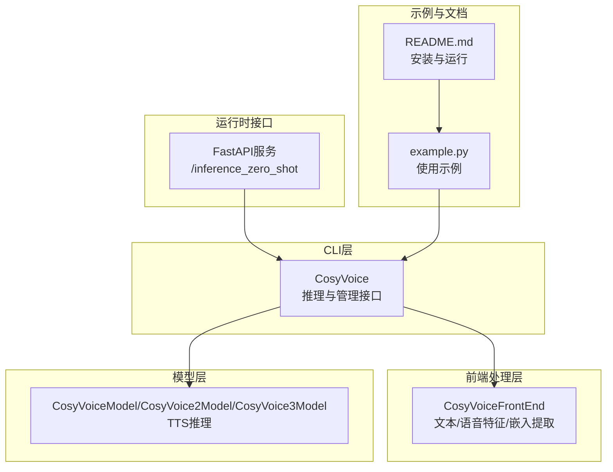
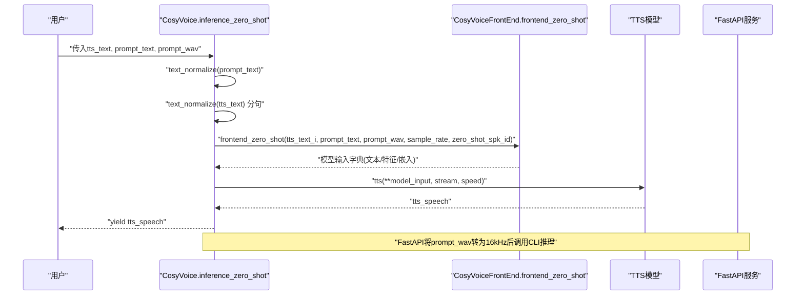
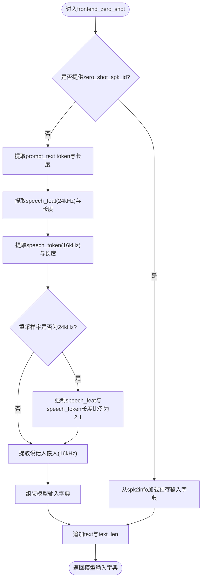
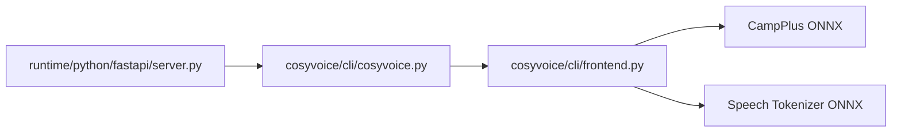

# Zero-shot模式

<cite>
**本文引用的文件**
- [cosyvoice/cli/cosyvoice.py](file://cosyvoice/cli/cosyvoice.py)
- [cosyvoice/cli/frontend.py](file://cosyvoice/cli/frontend.py)
- [runtime/python/fastapi/server.py](file://runtime/python/fastapi/server.py)
- [example.py](file://example.py)
- [README.md](file://README.md)
</cite>

## 目录
1. [简介](#简介)
2. [项目结构](#项目结构)
3. [核心组件](#核心组件)
4. [架构总览](#架构总览)
5. [详细组件分析](#详细组件分析)
6. [依赖关系分析](#依赖关系分析)
7. [性能考量](#性能考量)
8. [故障排查指南](#故障排查指南)
9. [结论](#结论)
10. [附录](#附录)

## 简介
本节面向零样本（Zero-shot）语音克隆模式，系统性阐述其工作原理、关键实现细节与最佳实践。重点包括：
- inference_zero_shot方法的参数语义与调用流程
- prompt_text与prompt_wav在零样本克隆中的作用
- 如何通过add_zero_shot_spk方法注册并复用“零样本说话人”
- frontend_zero_shot中语音特征、语音token与说话人嵌入的提取过程
- 完整使用示例（提示语音准备与推理调用）
- 优势与潜在性能问题（如提示文本与合成文本长度不匹配的警告）

## 项目结构
围绕零样本模式的关键代码位于CLI层与前端处理层：
- CLI入口：CosyVoice类提供inference_zero_shot与add_zero_shot_spk等高层接口
- 前端处理：CosyVoiceFrontEnd负责文本token化、语音特征提取、语音token抽取、说话人嵌入提取以及零样本前端拼装
- 运行时接口：FastAPI服务提供HTTP接口，便于在线推理
- 示例与文档：example.py给出典型调用方式；README提供安装与运行指引

图表来源
- [cosyvoice/cli/cosyvoice.py](file://cosyvoice/cli/cosyvoice.py#L146-L176)
- [cosyvoice/cli/frontend.py](file://cosyvoice/cli/frontend.py#L257-L309)
- [runtime/python/fastapi/server.py](file://runtime/python/fastapi/server.py#L85-L102)
- [example.py](file://example.py#L1-L107)
- [README.md](file://README.md#L146-L176)

章节来源
- [cosyvoice/cli/cosyvoice.py](file://cosyvoice/cli/cosyvoice.py#L146-L176)
- [cosyvoice/cli/frontend.py](file://cosyvoice/cli/frontend.py#L257-L309)
- [runtime/python/fastapi/server.py](file://runtime/python/fastapi/server.py#L85-L102)
- [example.py](file://example.py#L1-L107)
- [README.md](file://README.md#L146-L176)

## 核心组件
- CosyVoice.inference_zero_shot：零样本推理主入口，负责文本归一化、长度校验、构造模型输入并驱动模型推理
- CosyVoiceFrontEnd.frontend_zero_shot：零样本前端拼装，提取文本token、语音特征、语音token与说话人嵌入，按需对齐长度
- CosyVoice.add_zero_shot_spk：注册“零样本说话人”，将一次提示样本的前端特征缓存到spk2info，后续可直接复用
- FastAPI.runtime.python.fastapi.server：提供HTTP接口，接收提示音频与文本，调用CosyVoice推理并流式返回音频

章节来源
- [cosyvoice/cli/cosyvoice.py](file://cosyvoice/cli/cosyvoice.py#L95-L113)
- [cosyvoice/cli/cosyvoice.py](file://cosyvoice/cli/cosyvoice.py#L146-L176)
- [cosyvoice/cli/frontend.py](file://cosyvoice/cli/frontend.py#L257-L309)
- [runtime/python/fastapi/server.py](file://runtime/python/fastapi/server.py#L85-L102)

## 架构总览
零样本模式的端到端流程如下：
- 用户输入合成文本与提示文本/提示语音
- CLI层对提示文本进行归一化，对合成文本进行分句归一化
- 前端层提取提示文本token、提示语音特征、语音token与说话人嵌入，并在需要时强制对齐长度
- 将目标文本token与上述特征拼装为模型输入，交由TTS模型推理
- 返回流式音频数据

图表来源
- [cosyvoice/cli/cosyvoice.py](file://cosyvoice/cli/cosyvoice.py#L146-L176)
- [cosyvoice/cli/frontend.py](file://cosyvoice/cli/frontend.py#L257-L309)
- [runtime/python/fastapi/server.py](file://runtime/python/fastapi/server.py#L85-L102)

## 详细组件分析

### inference_zero_shot方法参数与行为
- 参数
  - tts_text：待合成的文本
  - prompt_text：提示文本，用于零样本合成中的语义引导
  - prompt_wav：提示语音（16kHz采样率）
  - zero_shot_spk_id：预定义的零样本说话人ID（可选）
  - stream：是否启用流式合成
  - speed：语音速度调节因子
  - text_frontend：是否使用文本前端处理
- 行为
  - 对prompt_text进行文本归一化
  - 对tts_text进行分句归一化
  - 对每个子句检查长度阈值，若过短则发出性能警告
  - 调用frontend_zero_shot生成模型输入
  - 驱动模型推理并流式返回结果

章节来源
- [cosyvoice/cli/cosyvoice.py](file://cosyvoice/cli/cosyvoice.py#L146-L176)

### prompt_text与prompt_wav的作用
- prompt_text：提供语义与上下文信息，帮助模型理解说话风格、情感倾向与语言风格
- prompt_wav：提供音色与韵律信息，用于提取说话人嵌入与语音token，实现音色克隆
- 在零样本模式下，两者共同决定合成音色与语义一致性

章节来源
- [cosyvoice/cli/cosyvoice.py](file://cosyvoice/cli/cosyvoice.py#L146-L176)
- [cosyvoice/cli/frontend.py](file://cosyvoice/cli/frontend.py#L257-L309)

### add_zero_shot_spk方法：添加新的零样本说话人
- 功能：将一次提示样本的前端特征（不含目标文本）缓存到spk2info，形成可复用的“零样本说话人”
- 关键点：
  - 断言zero_shot_spk_id非空
  - 调用frontend_zero_shot生成输入字典并删除text/text_len字段
  - 将字典写入spk2info并返回True
- 使用场景：多次使用同一提示样本克隆同一音色，避免重复计算前端特征

章节来源
- [cosyvoice/cli/cosyvoice.py](file://cosyvoice/cli/cosyvoice.py#L95-L113)

### frontend_zero_shot：特征与嵌入提取流程
- 步骤
  - 提取目标文本token与长度
  - 若未指定预定义说话人ID：
    - 提取提示文本token与长度
    - 提取重采样后语音的声学特征与长度（24kHz）
    - 提取提示语音的语音token（16kHz）
    - 当重采样率为24kHz时，强制speech_feat与speech_token长度比例为2:1
    - 提取说话人嵌入（16kHz）
    - 组装模型输入字典（包含prompt_text、prompt_speech_feat、speech_token与嵌入）
  - 若已指定预定义说话人ID：直接从spk2info取回缓存的输入字典
  - 最终追加text与text_len

图表来源
- [cosyvoice/cli/frontend.py](file://cosyvoice/cli/frontend.py#L257-L309)

章节来源
- [cosyvoice/cli/frontend.py](file://cosyvoice/cli/frontend.py#L257-L309)

### FastAPI接口：/inference_zero_shot
- 接口职责：接收tts_text、prompt_text与prompt_wav，确保prompt_wav采样率为16kHz，调用CosyVoice推理并流式返回音频
- 适用场景：在线服务部署，便于Web/移动端接入

章节来源
- [runtime/python/fastapi/server.py](file://runtime/python/fastapi/server.py#L85-L102)

## 依赖关系分析
- CosyVoice依赖CosyVoiceFrontEnd进行前端特征提取与输入拼装
- CosyVoiceFrontEnd依赖ONNX推理引擎（CampPlus提取说话人嵌入、Speech Tokenizer提取语音token）
- FastAPI服务依赖CosyVoice进行推理，并将结果以流式二进制形式返回

图表来源
- [cosyvoice/cli/cosyvoice.py](file://cosyvoice/cli/cosyvoice.py#L146-L176)
- [cosyvoice/cli/frontend.py](file://cosyvoice/cli/frontend.py#L30-L71)
- [runtime/python/fastapi/server.py](file://runtime/python/fastapi/server.py#L85-L102)

章节来源
- [cosyvoice/cli/cosyvoice.py](file://cosyvoice/cli/cosyvoice.py#L146-L176)
- [cosyvoice/cli/frontend.py](file://cosyvoice/cli/frontend.py#L30-L71)
- [runtime/python/fastapi/server.py](file://runtime/python/fastapi/server.py#L85-L102)

## 性能考量
- 提示文本与合成文本长度不匹配的警告
  - 当合成文本子句长度小于提示文本长度的一半时，会记录性能警告，提示可能影响合成质量
  - 建议：尽量保证合成文本长度与提示文本长度相当或更长，以提升语义一致性与音色稳定性
- 重采样率与长度对齐
  - 当重采样率为24kHz时，前端会强制speech_feat与speech_token长度比例为2:1，避免下游模型对齐不一致导致的音质下降
- 推理速度与流式输出
  - CLI层记录每段产出的语音时长与RTF（实时因子），便于评估性能
  - FastAPI服务采用流式返回，降低首包延迟

章节来源
- [cosyvoice/cli/cosyvoice.py](file://cosyvoice/cli/cosyvoice.py#L165-L175)
- [cosyvoice/cli/frontend.py](file://cosyvoice/cli/frontend.py#L286-L291)

## 故障排查指南
- 提示音频采样率不符
  - 现象：推理报错或音质异常
  - 处理：确保prompt_wav为16kHz采样率（FastAPI服务已自动处理）
- 提示文本过短
  - 现象：出现性能警告
  - 处理：增加提示文本长度，或使用更长的提示音频
- 无法加载模型或ONNX引擎
  - 现象：初始化失败
  - 处理：确认模型目录与ONNX文件存在，检查GPU/CPU执行提供者配置
- 预定义说话人ID为空
  - 现象：断言失败
  - 处理：调用add_zero_shot_spk时确保zero_shot_spk_id非空

章节来源
- [runtime/python/fastapi/server.py](file://runtime/python/fastapi/server.py#L99-L101)
- [cosyvoice/cli/cosyvoice.py](file://cosyvoice/cli/cosyvoice.py#L165-L175)
- [cosyvoice/cli/cosyvoice.py](file://cosyvoice/cli/cosyvoice.py#L107-L113)
- [cosyvoice/cli/frontend.py](file://cosyvoice/cli/frontend.py#L30-L71)

## 结论
零样本语音克隆通过提示文本与提示语音的联合建模，在无需额外训练的情况下实现高质量音色克隆。其核心在于：
- prompt_text提供语义与风格引导，prompt_wav提供音色与韵律信息
- 前端层对特征与嵌入进行统一提取与对齐，保障下游模型输入一致性
- 通过add_zero_shot_spk可缓存“零样本说话人”，显著降低重复推理成本
- FastAPI接口便于在线部署与集成

## 附录

### 使用示例（准备提示语音与推理调用）
- 准备提示语音
  - 采样率应为16kHz
  - 时长建议适中（前端对语音token提取有最大时长限制）
- 调用方式
  - 直接推理：传入tts_text、prompt_text与prompt_wav
  - 复用说话人：先调用add_zero_shot_spk注册，再以zero_shot_spk_id进行推理
  - 流式输出：设置stream=True以获得低延迟音频流
- 参考示例
  - CosyVoice2示例展示了零样本推理、注册说话人、保存spk2info与流式输入的用法

章节来源
- [example.py](file://example.py#L1-L107)
- [README.md](file://README.md#L146-L176)