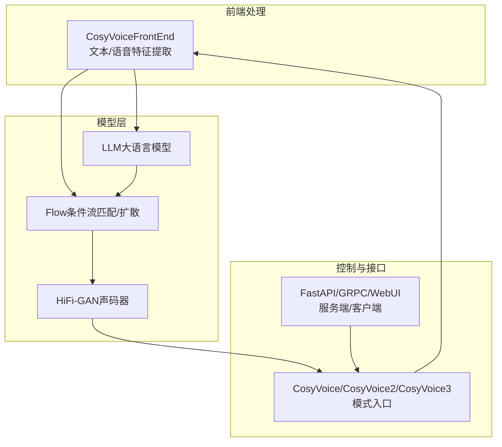
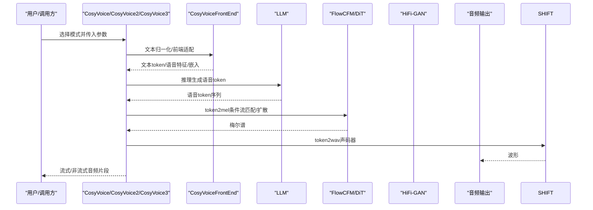
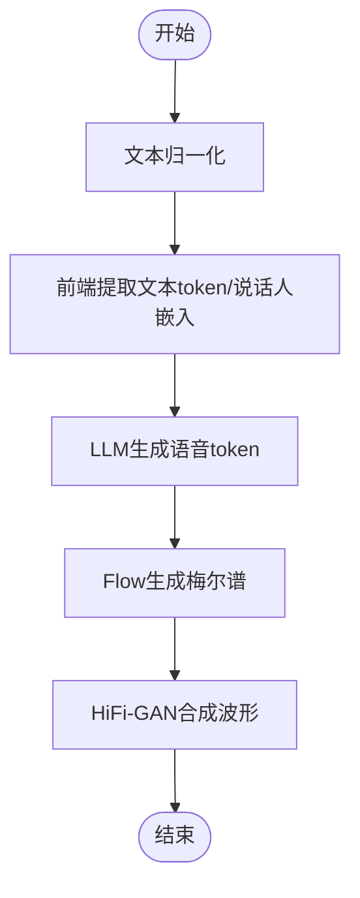
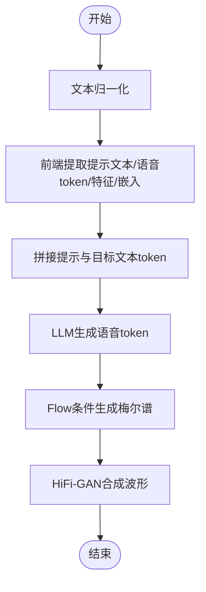
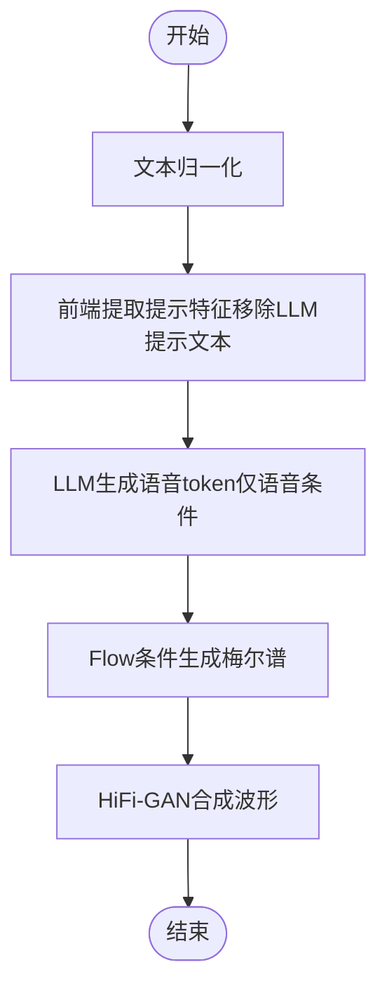
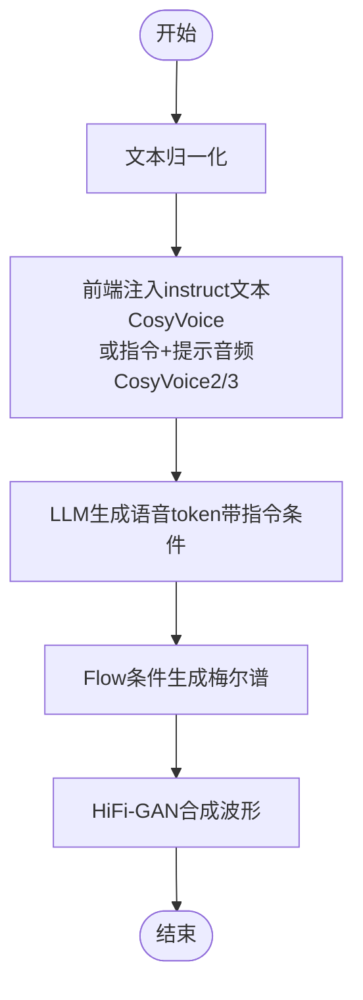
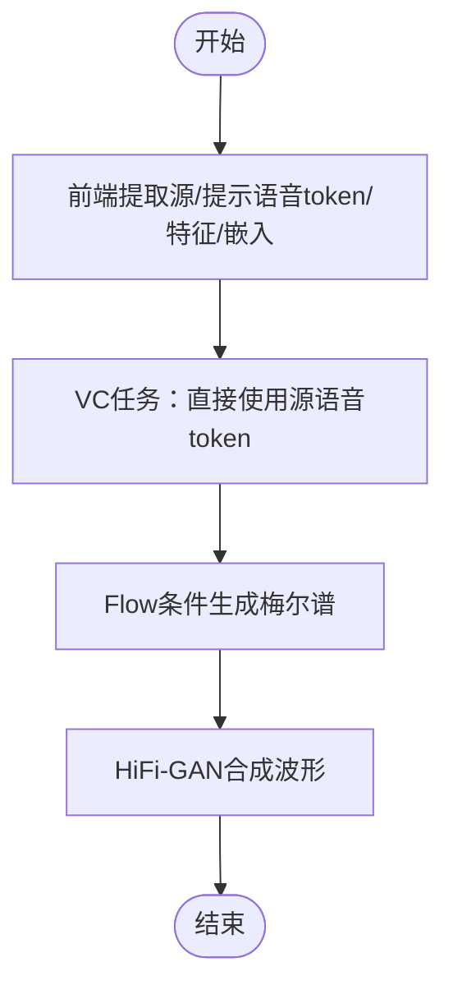
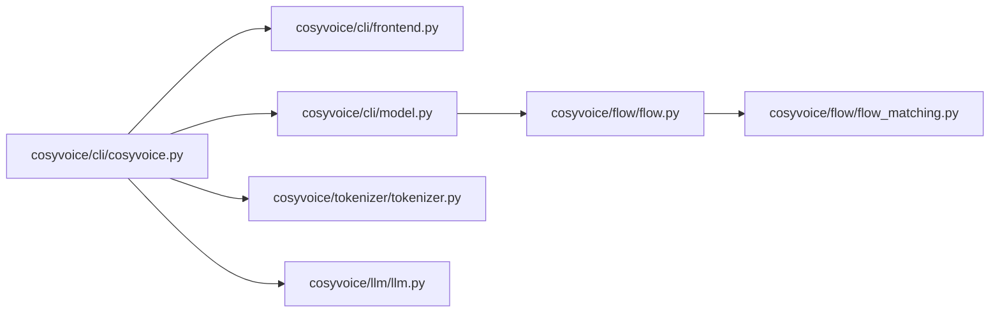

# 核心功能详解

<cite>
**本文引用的文件**
- [cosyvoice/cli/cosyvoice.py](file://cosyvoice/cli/cosyvoice.py)
- [cosyvoice/cli/model.py](file://cosyvoice/cli/model.py)
- [cosyvoice/cli/frontend.py](file://cosyvoice/cli/frontend.py)
- [cosyvoice/flow/flow.py](file://cosyvoice/flow/flow.py)
- [cosyvoice/flow/flow_matching.py](file://cosyvoice/flow/flow_matching.py)
- [cosyvoice/tokenizer/tokenizer.py](file://cosyvoice/tokenizer/tokenizer.py)
- [cosyvoice/llm/llm.py](file://cosyvoice/llm/llm.py)
- [README.md](file://README.md)
- [example.py](file://example.py)
- [api.py](file://api.py)
- [runtime/python/fastapi/server.py](file://runtime/python/fastapi/server.py)
- [runtime/python/grpc/client.py](file://runtime/python/grpc/client.py)
- [webui.py](file://webui.py)
</cite>

## 目录
1. [简介](#简介)
2. [项目结构](#项目结构)
3. [核心组件](#核心组件)
4. [架构总览](#架构总览)
5. [详细组件分析](#详细组件分析)
6. [依赖关系分析](#依赖关系分析)
7. [性能考量](#性能考量)
8. [故障排查指南](#故障排查指南)
9. [结论](#结论)
10. [附录](#附录)

## 简介
本文件面向CosyVoice的五种语音合成模式：SFT、Zero-shot、Cross-lingual、Instruct与语音转换（Voice Conversion）。我们将从系统架构、数据流、处理逻辑、调用方式、自然语言指令控制原理、跨语言音素对齐策略等方面进行深入解析，并结合CLI与运行时接口给出实际用例与最佳实践，帮助用户准确选择与使用不同模式。

## 项目结构
CosyVoice采用“前端-大语言模型-流匹配/扩散-声码器”的三层推理管线，配合多模型版本（CosyVoice、CosyVoice2、CosyVoice3）与多种优化（JIT、TensorRT、vLLM）实现高吞吐与低延迟。

图示来源
- [cosyvoice/cli/cosyvoice.py](file://cosyvoice/cli/cosyvoice.py#L121-L256)
- [cosyvoice/cli/model.py](file://cosyvoice/cli/model.py#L245-L368)
- [cosyvoice/cli/frontend.py](file://cosyvoice/cli/frontend.py#L238-L396)
- [cosyvoice/flow/flow.py](file://cosyvoice/flow/flow.py#L148-L276)
- [runtime/python/fastapi/server.py](file://runtime/python/fastapi/server.py#L85-L159)
- [webui.py](file://webui.py#L115-L138)

章节来源
- [README.md](file://README.md#L1-L120)

## 核心组件
- CosyVoice/CosyVoice2/CosyVoice3：统一的模式入口与推理调度，负责文本归一化、前端特征提取、模式路由与流式/非流式推理。
- CosyVoiceFrontEnd：负责文本token化、语音特征提取、说话人嵌入、零样本/跨语言/指令前端适配。
- CosyVoiceModel/CosyVoice2Model/CosyVoice3Model：LLM推理线程、token2mel、token2wav、流式缓存与重叠拼接。
- Flow模块：条件流匹配/扩散（CFM）与DiT估计器，实现从语音token到梅尔谱的生成。
- HiFi-GAN：将梅尔谱转换为波形。
- LLM：将文本与提示信息编码为语音token序列。

章节来源
- [cosyvoice/cli/cosyvoice.py](file://cosyvoice/cli/cosyvoice.py#L121-L256)
- [cosyvoice/cli/model.py](file://cosyvoice/cli/model.py#L245-L368)
- [cosyvoice/cli/frontend.py](file://cosyvoice/cli/frontend.py#L238-L396)
- [cosyvoice/flow/flow.py](file://cosyvoice/flow/flow.py#L148-L276)
- [cosyvoice/flow/flow_matching.py](file://cosyvoice/flow/flow_matching.py#L1-L120)
- [cosyvoice/llm/llm.py](file://cosyvoice/llm/llm.py#L73-L120)

## 架构总览
下图展示了CosyVoice的端到端推理流程，包括五种模式的输入与关键中间产物。

图示来源
- [cosyvoice/cli/cosyvoice.py](file://cosyvoice/cli/cosyvoice.py#L121-L256)
- [cosyvoice/cli/model.py](file://cosyvoice/cli/model.py#L245-L368)
- [cosyvoice/cli/frontend.py](file://cosyvoice/cli/frontend.py#L238-L396)
- [cosyvoice/flow/flow.py](file://cosyvoice/flow/flow.py#L148-L276)

## 详细组件分析

### SFT（预训练音色）模式
- 适用场景
  - 已有预训练说话人，追求稳定音色一致性与高保真度。
- 输入参数
  - tts_text：待合成文本
  - spk_id：预训练说话人ID
  - stream/speed/text_frontend：流式/语速/文本前端开关
- 实现机制
  - 前端直接从预存的说话人信息中读取嵌入，不引入额外提示。
  - LLM根据文本生成语音token；Flow将token映射为梅尔谱；HiFi-GAN合成波形。
- 调用方式
  - CLI：参考路径 [cosyvoice/cli/cosyvoice.py](file://cosyvoice/cli/cosyvoice.py#L121-L146)
  - 示例：参考路径 [example.py](file://example.py#L17-L26)
  - WebUI：参考路径 [webui.py](file://webui.py#L115-L119)
- 关键流程图

图示来源
- [cosyvoice/cli/cosyvoice.py](file://cosyvoice/cli/cosyvoice.py#L121-L146)
- [cosyvoice/cli/frontend.py](file://cosyvoice/cli/frontend.py#L238-L257)
- [cosyvoice/cli/model.py](file://cosyvoice/cli/model.py#L245-L368)

章节来源
- [cosyvoice/cli/cosyvoice.py](file://cosyvoice/cli/cosyvoice.py#L121-L146)
- [cosyvoice/cli/frontend.py](file://cosyvoice/cli/frontend.py#L238-L257)
- [example.py](file://example.py#L17-L26)
- [webui.py](file://webui.py#L115-L119)

### Zero-shot（3秒极速复刻）模式
- 适用场景
  - 快速克隆说话人音色，无需微调；适合短提示音频（≤30s）。
- 输入参数
  - tts_text：待合成文本
  - prompt_text：提示文本（描述提示音频内容）
  - prompt_wav：提示音频（16kHz）
  - zero_shot_spk_id：可选，预定义零样本说话人ID
  - stream/speed/text_frontend：流式/语速/文本前端
- 实现机制
  - 前端提取提示文本token、提示语音token、提示语音特征与说话人嵌入。
  - CosyVoice2/3中强制speech_feat与speech_token长度比例为2:1（resample_rate=24000时）。
  - LLM结合文本与提示生成语音token；Flow以提示作为条件生成梅尔谱；HiFi-GAN合成波形。
- 调用方式
  - CLI：参考路径 [cosyvoice/cli/cosyvoice.py](file://cosyvoice/cli/cosyvoice.py#L147-L203)
  - 示例：参考路径 [example.py](file://example.py#L17-L26)
  - WebUI：参考路径 [webui.py](file://webui.py#L119-L124)
- 关键流程图

图示来源
- [cosyvoice/cli/cosyvoice.py](file://cosyvoice/cli/cosyvoice.py#L147-L203)
- [cosyvoice/cli/frontend.py](file://cosyvoice/cli/frontend.py#L258-L309)
- [cosyvoice/cli/model.py](file://cosyvoice/cli/model.py#L245-L368)

章节来源
- [cosyvoice/cli/cosyvoice.py](file://cosyvoice/cli/cosyvoice.py#L147-L203)
- [cosyvoice/cli/frontend.py](file://cosyvoice/cli/frontend.py#L258-L309)
- [example.py](file://example.py#L17-L26)
- [webui.py](file://webui.py#L119-L124)

### Cross-lingual（跨语言）模式
- 适用场景
  - 使用一种语言的提示语音，合成另一种语言的文本；常用于多语种演示与快速复刻。
- 输入参数
  - tts_text：目标语言文本（可混合语言标记）
  - prompt_wav：提示音频（16kHz）
  - zero_shot_spk_id：可选
  - stream/speed/text_frontend：流式/语速/文本前端
- 实现机制
  - 前端按Zero-shot流程提取提示特征，但跨语言模式在LLM侧移除提示文本（仅保留语音条件）。
  - LLM仍生成语音token；Flow以提示语音特征为条件生成梅尔谱；HiFi-GAN合成波形。
- 调用方式
  - CLI：参考路径 [cosyvoice/cli/cosyvoice.py](file://cosyvoice/cli/cosyvoice.py#L178-L204)
  - 示例：参考路径 [example.py](file://example.py#L17-L26)
  - WebUI：参考路径 [webui.py](file://webui.py#L125-L129)
- 关键流程图

图示来源
- [cosyvoice/cli/cosyvoice.py](file://cosyvoice/cli/cosyvoice.py#L178-L204)
- [cosyvoice/cli/frontend.py](file://cosyvoice/cli/frontend.py#L311-L330)
- [cosyvoice/cli/model.py](file://cosyvoice/cli/model.py#L245-L368)

章节来源
- [cosyvoice/cli/cosyvoice.py](file://cosyvoice/cli/cosyvoice.py#L178-L204)
- [cosyvoice/cli/frontend.py](file://cosyvoice/cli/frontend.py#L311-L330)
- [example.py](file://example.py#L17-L26)
- [webui.py](file://webui.py#L125-L129)

### Instruct（自然语言指令）模式
- 适用场景
  - 通过自然语言指令控制情感、风格、口音、语速等；适用于精细化控制与创意合成。
- 输入参数
  - tts_text：待合成文本
  - spk_id：预训练说话人ID（CosyVoice）
  - instruct_text：指令文本（如“用四川话说”、“轻柔一些”等）
  - stream/speed/text_frontend：流式/语速/文本前端
- 实现机制
  - CosyVoice：前端移除LLM侧说话人嵌入，将instruct_text作为提示文本注入LLM。
  - CosyVoice2/3：支持“指令+提示音频”的增强Instruct2，既可零样本复刻又可精细控制。
- 调用方式
  - CosyVoice：参考路径 [cosyvoice/cli/cosyvoice.py](file://cosyvoice/cli/cosyvoice.py#L205-L233)
  - CosyVoice2/3：参考路径 [cosyvoice/cli/cosyvoice.py](file://cosyvoice/cli/cosyvoice.py#L312-L339)
  - 示例：参考路径 [example.py](file://example.py#L53-L58)
  - FastAPI/GRPC/WebUI：参考路径 [runtime/python/fastapi/server.py](file://runtime/python/fastapi/server.py#L124-L159)、[runtime/python/grpc/client.py](file://runtime/python/grpc/client.py#L73-L106)、[webui.py](file://webui.py#L130-L138)
- 关键流程图

图示来源
- [cosyvoice/cli/cosyvoice.py](file://cosyvoice/cli/cosyvoice.py#L205-L233)
- [cosyvoice/cli/cosyvoice.py](file://cosyvoice/cli/cosyvoice.py#L312-L339)
- [cosyvoice/cli/frontend.py](file://cosyvoice/cli/frontend.py#L332-L375)
- [cosyvoice/cli/model.py](file://cosyvoice/cli/model.py#L245-L368)

章节来源
- [cosyvoice/cli/cosyvoice.py](file://cosyvoice/cli/cosyvoice.py#L205-L233)
- [cosyvoice/cli/cosyvoice.py](file://cosyvoice/cli/cosyvoice.py#L312-L339)
- [cosyvoice/cli/frontend.py](file://cosyvoice/cli/frontend.py#L332-L375)
- [example.py](file://example.py#L53-L58)
- [runtime/python/fastapi/server.py](file://runtime/python/fastapi/server.py#L124-L159)
- [runtime/python/grpc/client.py](file://runtime/python/grpc/client.py#L73-L106)
- [webui.py](file://webui.py#L130-L138)

### 语音转换（Voice Conversion）模式
- 适用场景
  - 将源语音的音色转换为提示语音的音色，保持内容不变；适合配音替换、音色迁移。
- 输入参数
  - source_wav：源语音（16kHz）
  - prompt_wav：提示语音（16kHz，决定目标音色）
  - stream/speed：流式/语速
- 实现机制
  - 前端提取source_speech_token、prompt_speech_token、prompt_speech_feat与flow_embedding。
  - VC模式绕过LLM，直接以source_speech_token驱动Flow，以prompt作为条件生成梅尔谱；HiFi-GAN合成波形。
- 调用方式
  - CLI：参考路径 [cosyvoice/cli/cosyvoice.py](file://cosyvoice/cli/cosyvoice.py#L234-L256)
  - 示例：参考路径 [example.py](file://example.py#L23-L27)
  - FastAPI/GRPC/WebUI：参考路径 [runtime/python/fastapi/server.py](file://runtime/python/fastapi/server.py#L85-L121)、[runtime/python/grpc/client.py](file://runtime/python/grpc/client.py#L73-L106)、[webui.py](file://webui.py#L125-L129)
- 关键流程图

图示来源
- [cosyvoice/cli/cosyvoice.py](file://cosyvoice/cli/cosyvoice.py#L234-L256)
- [cosyvoice/cli/frontend.py](file://cosyvoice/cli/frontend.py#L376-L396)
- [cosyvoice/cli/model.py](file://cosyvoice/cli/model.py#L179-L189)

章节来源
- [cosyvoice/cli/cosyvoice.py](file://cosyvoice/cli/cosyvoice.py#L234-L256)
- [cosyvoice/cli/frontend.py](file://cosyvoice/cli/frontend.py#L376-L396)
- [example.py](file://example.py#L23-L27)
- [runtime/python/fastapi/server.py](file://runtime/python/fastapi/server.py#L85-L121)
- [runtime/python/grpc/client.py](file://runtime/python/grpc/client.py#L73-L106)
- [webui.py](file://webui.py#L125-L129)

### 自然语言指令控制的工作原理
- CosyVoice（基础版）
  - 前端将instruct_text编码为prompt_text，注入LLM；同时移除LLM侧说话人嵌入，避免信息泄露。
- CosyVoice2/3（增强版）
  - 支持“指令+提示音频”的组合，既可零样本复刻音色，又可通过instruct文本控制风格。
- LLM侧
  - 将文本、提示文本、语音token与嵌入拼接为统一序列，通过LLM生成语音token。
- Flow侧
  - 以提示语音特征与嵌入作为条件，生成梅尔谱，从而影响韵律、情感与风格。

章节来源
- [cosyvoice/cli/cosyvoice.py](file://cosyvoice/cli/cosyvoice.py#L205-L233)
- [cosyvoice/cli/cosyvoice.py](file://cosyvoice/cli/cosyvoice.py#L312-L339)
- [cosyvoice/cli/frontend.py](file://cosyvoice/cli/frontend.py#L332-L375)
- [cosyvoice/llm/llm.py](file://cosyvoice/llm/llm.py#L73-L120)

### 跨语言合成的音素对齐策略
- 语音token与梅尔谱的对齐
  - Flow模块在CosyVoice2/3中采用“token_mel_ratio=2”的设计，强制speech_feat与speech_token长度比例为2:1（当resample_rate=24000时）。
  - 这保证了语音token与梅尔谱帧的稳定对应关系，便于跨语言条件下进行对齐与拼接。
- 条件生成
  - Flow以prompt_feat作为条件，将encoder输出的隐表示映射到目标梅尔谱，跨语言时由提示语音提供韵律与音色约束。
- 语言标记
  - 分词器支持多语言标记（如“<|zh|>”、“<|en|>”等），可在文本中显式指示语言，辅助跨语言合成。

章节来源
- [cosyvoice/cli/frontend.py](file://cosyvoice/cli/frontend.py#L286-L292)
- [cosyvoice/flow/flow.py](file://cosyvoice/flow/flow.py#L148-L276)
- [cosyvoice/tokenizer/tokenizer.py](file://cosyvoice/tokenizer/tokenizer.py#L119-L176)

## 依赖关系分析
- 模块耦合
  - CosyVoice/CosyVoice2/CosyVoice3对FrontEnd与Model的依赖清晰，模式切换通过方法分发实现。
  - FrontEnd负责特征提取与模式适配，Model负责LLM、Flow、HiFi-GAN的推理与流式缓存。
- 外部依赖
  - ONNXRuntime（前端语音token/说话人嵌入）、vLLM（CosyVoice2/3可选加速）、TensorRT（可选加速）。
- 可能的循环依赖
  - 未发现直接循环导入；各模块职责明确，通过接口传递参数。

图示来源
- [cosyvoice/cli/cosyvoice.py](file://cosyvoice/cli/cosyvoice.py#L1-L120)
- [cosyvoice/cli/frontend.py](file://cosyvoice/cli/frontend.py#L1-L70)
- [cosyvoice/cli/model.py](file://cosyvoice/cli/model.py#L1-L80)
- [cosyvoice/flow/flow.py](file://cosyvoice/flow/flow.py#L1-L60)
- [cosyvoice/flow/flow_matching.py](file://cosyvoice/flow/flow_matching.py#L1-L40)
- [cosyvoice/tokenizer/tokenizer.py](file://cosyvoice/tokenizer/tokenizer.py#L1-L60)
- [cosyvoice/llm/llm.py](file://cosyvoice/llm/llm.py#L1-L40)

章节来源
- [cosyvoice/cli/cosyvoice.py](file://cosyvoice/cli/cosyvoice.py#L1-L120)
- [cosyvoice/cli/model.py](file://cosyvoice/cli/model.py#L1-L80)
- [cosyvoice/cli/frontend.py](file://cosyvoice/cli/frontend.py#L1-L70)
- [cosyvoice/flow/flow.py](file://cosyvoice/flow/flow.py#L1-L60)
- [cosyvoice/flow/flow_matching.py](file://cosyvoice/flow/flow_matching.py#L1-L40)
- [cosyvoice/tokenizer/tokenizer.py](file://cosyvoice/tokenizer/tokenizer.py#L1-L60)
- [cosyvoice/llm/llm.py](file://cosyvoice/llm/llm.py#L1-L40)

## 性能考量
- 流式推理
  - CosyVoiceModel：token2wav采用重叠拼接与缓存，动态调整token跳跃长度，提升RTF与音质平衡。
  - CosyVoice2/3：支持静态chunk大小与lookahead，进一步优化流式吞吐。
- 硬件加速
  - JIT：前端编码器与LLM组件可JIT优化。
  - TensorRT：Flow解码器估计器可TRT加速，显著降低延迟。
  - vLLM：CosyVoice2/3可加载vLLM引擎加速LLM。
- 采样率与长度
  - 提示音频建议≤30s；CosyVoice2/3在24kHz采样率下强制feat与token长度比例为2:1，减少对齐误差。
- 语速调节
  - 非流式模式支持速度插值；流式模式不支持速度调节。

章节来源
- [cosyvoice/cli/model.py](file://cosyvoice/cli/model.py#L56-L120)
- [cosyvoice/cli/model.py](file://cosyvoice/cli/model.py#L245-L368)
- [cosyvoice/cli/model.py](file://cosyvoice/cli/model.py#L491-L568)
- [cosyvoice/cli/frontend.py](file://cosyvoice/cli/frontend.py#L131-L151)
- [README.md](file://README.md#L1-L120)

## 故障排查指南
- 提示音频采样率不足
  - WebUI会在采样率低于16kHz时发出警告；请确保prompt音频≥16kHz。
- 提示文本过短
  - Zero-shot模式若合成文本明显短于提示文本，可能影响音色复刻效果，前端会给出警告。
- 速度调节限制
  - 流式模式不支持速度调节；如需变速，请使用非流式模式。
- 模型类型不匹配
  - AutoModel会根据配置文件判断模型类型；若cosyvoice.yaml不存在或类型不符，将报错。
- 服务器端口与模式
  - FastAPI/GRPC客户端需与服务端一致；注意mode参数与必填字段。

章节来源
- [webui.py](file://webui.py#L87-L106)
- [cosyvoice/cli/cosyvoice.py](file://cosyvoice/cli/cosyvoice.py#L147-L177)
- [cosyvoice/cli/model.py](file://cosyvoice/cli/model.py#L237-L244)
- [runtime/python/fastapi/server.py](file://runtime/python/fastapi/server.py#L85-L159)
- [runtime/python/grpc/client.py](file://runtime/python/grpc/client.py#L73-L106)

## 结论
CosyVoice通过“文本-语音token-梅尔谱-波形”的流水线实现了五种模式的灵活切换与高效推理。SFT适合稳定音色；Zero-shot与Cross-lingual适合快速复刻与多语种合成；Instruct模式提供自然语言级控制；VC模式实现音色迁移。结合流式推理、JIT/TensorRT/vLLM等优化，可在低延迟与高质量之间取得良好平衡。

## 附录
- 实际用例参考
  - SFT：参考路径 [example.py](file://example.py#L17-L26)
  - Zero-shot：参考路径 [example.py](file://example.py#L17-L26)
  - Cross-lingual：参考路径 [example.py](file://example.py#L17-L26)
  - Instruct：参考路径 [example.py](file://example.py#L53-L58)
  - VC：参考路径 [example.py](file://example.py#L23-L27)
- API定义参考
  - 请求模型：参考路径 [api.py](file://api.py#L76-L100)