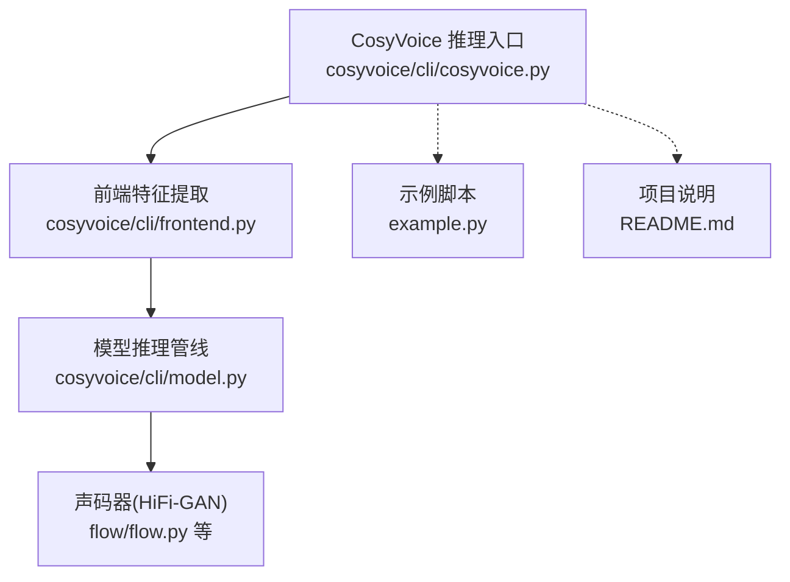
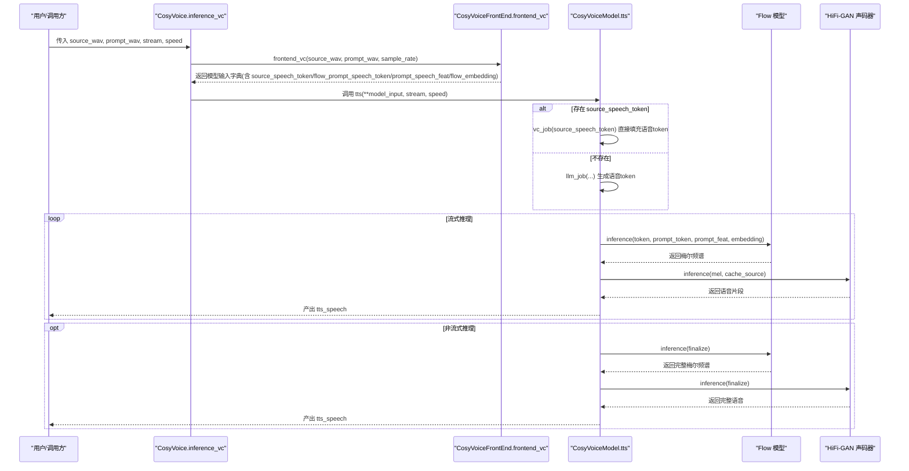
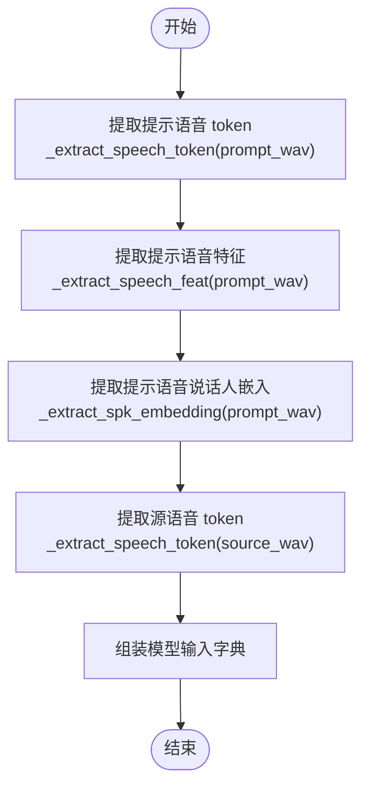
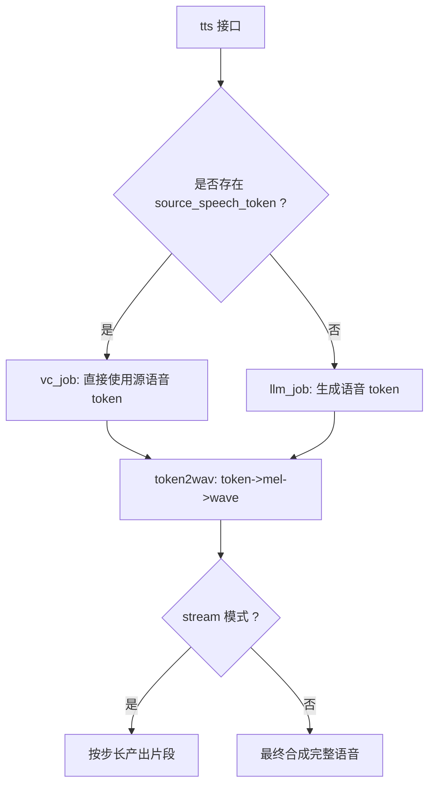
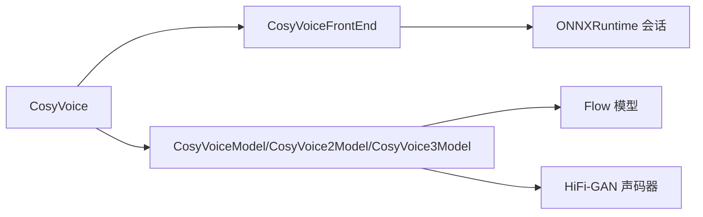

# 语音转换模式

<cite>
**本文引用的文件**
- [cosyvoice/cli/cosyvoice.py](file://cosyvoice/cli/cosyvoice.py)
- [cosyvoice/cli/frontend.py](file://cosyvoice/cli/frontend.py)
- [cosyvoice/cli/model.py](file://cosyvoice/cli/model.py)
- [example.py](file://example.py)
- [README.md](file://README.md)
</cite>

## 目录
1. [简介](#简介)
2. [项目结构](#项目结构)
3. [核心组件](#核心组件)
4. [架构总览](#架构总览)
5. [详细组件分析](#详细组件分析)
6. [依赖关系分析](#依赖关系分析)
7. [性能考量](#性能考量)
8. [故障排查指南](#故障排查指南)
9. [结论](#结论)
10. [附录](#附录)

## 简介
本节聚焦于 CosyVoice 的“语音转换（Voice Conversion，VC）”模式，系统性说明其技术实现、参数含义与应用场景。重点解析以下问题：
- inference_vc 方法的参数与作用，尤其是 source_wav（源语音）与 prompt_wav（提示语音）分别承担的角色；
- 通过 frontend_vc 方法，系统如何提取源语音的语音 token 与提示语音的声学特征与说话人嵌入，从而实现音色转换；
- 给出 VC 模式的调用示例与最佳实践；
- 讨论该模式在个性化语音服务与娱乐应用中的潜力。

## 项目结构
围绕语音转换模式，涉及的关键模块包括：
- 推理入口与模式调度：cosyvoice/cli/cosyvoice.py 中的 CosyVoice 类提供 inference_vc 接口；
- 前端特征提取：cosyvoice/cli/frontend.py 中的 CosyVoiceFrontEnd 提供 frontend_vc 与底层特征抽取；
- 模型推理管线：cosyvoice/cli/model.py 中的 CosyVoiceModel/CosyVoice2Model/CosyVoice3Model 实现 token2wav 与流式/非流式推理；
- 示例与文档：example.py 展示 VC 的基本用法；README.md 提供总体背景与路线图。

图表来源
- [cosyvoice/cli/cosyvoice.py](file://cosyvoice/cli/cosyvoice.py#L234-L256)
- [cosyvoice/cli/frontend.py](file://cosyvoice/cli/frontend.py#L376-L396)
- [cosyvoice/cli/model.py](file://cosyvoice/cli/model.py#L245-L368)
- [example.py](file://example.py#L25-L27)
- [README.md](file://README.md#L46-L56)

章节来源
- [cosyvoice/cli/cosyvoice.py](file://cosyvoice/cli/cosyvoice.py#L234-L256)
- [cosyvoice/cli/frontend.py](file://cosyvoice/cli/frontend.py#L376-L396)
- [cosyvoice/cli/model.py](file://cosyvoice/cli/model.py#L245-L368)
- [example.py](file://example.py#L25-L27)
- [README.md](file://README.md#L46-L56)

## 核心组件
- CosyVoice.inference_vc：对外暴露的 VC 推理接口，接收 source_wav 与 prompt_wav，返回转换后的语音片段。
- CosyVoiceFrontEnd.frontend_vc：将源语音与提示语音转换为模型所需的 token、特征与嵌入，作为 VC 模式输入。
- CosyVoiceModel/CosyVoice2Model/CosyVoice3Model.tts：统一的推理入口，根据是否存在 source_speech_token 决定走 LLM 生成流程还是 VC 直接流程；随后通过 token2wav 将离散语音 token 转换为波形。

章节来源
- [cosyvoice/cli/cosyvoice.py](file://cosyvoice/cli/cosyvoice.py#L234-L256)
- [cosyvoice/cli/frontend.py](file://cosyvoice/cli/frontend.py#L376-L396)
- [cosyvoice/cli/model.py](file://cosyvoice/cli/model.py#L245-L368)

## 架构总览
下图展示 VC 模式从输入到输出的完整调用链路与数据流。

图表来源
- [cosyvoice/cli/cosyvoice.py](file://cosyvoice/cli/cosyvoice.py#L234-L256)
- [cosyvoice/cli/frontend.py](file://cosyvoice/cli/frontend.py#L376-L396)
- [cosyvoice/cli/model.py](file://cosyvoice/cli/model.py#L245-L368)

## 详细组件分析

### inference_vc 方法：参数与职责
- 参数说明
  - source_wav：源语音（16kHz 采样率），用于提供语音内容与韵律信息；
  - prompt_wav：提示语音（16kHz 采样率），决定输出的音色（说话人特征）；
  - stream：是否启用流式推理；
  - speed：语速调节因子（非流式模式生效）。
- 职责
  - 调用 frontend.frontend_vc 生成模型输入；
  - 交由 model.tts 执行推理，按流式/非流式策略产出语音片段或完整语音。

章节来源
- [cosyvoice/cli/cosyvoice.py](file://cosyvoice/cli/cosyvoice.py#L234-L256)

### frontend_vc 方法：特征与嵌入提取
- 输入
  - source_speech_16k：源语音（16kHz）；
  - prompt_speech_16k：提示语音（16kHz）；
  - resample_rate：目标重采样率（影响特征与 token 对齐）。
- 输出
  - 模型输入字典，包含：
    - source_speech_token / source_speech_token_len：源语音的离散 token；
    - flow_prompt_speech_token / flow_prompt_speech_token_len：提示语音的离散 token；
    - prompt_speech_feat / prompt_speech_feat_len：提示语音的声学特征；
    - flow_embedding：提示语音的说话人嵌入。
- 关键步骤
  - 提取提示语音的语音 token 与声学特征、说话人嵌入；
  - 提取源语音的语音 token；
  - 组装为模型输入字典。

图表来源
- [cosyvoice/cli/frontend.py](file://cosyvoice/cli/frontend.py#L131-L173)
- [cosyvoice/cli/frontend.py](file://cosyvoice/cli/frontend.py#L174-L188)
- [cosyvoice/cli/frontend.py](file://cosyvoice/cli/frontend.py#L376-L396)

章节来源
- [cosyvoice/cli/frontend.py](file://cosyvoice/cli/frontend.py#L131-L173)
- [cosyvoice/cli/frontend.py](file://cosyvoice/cli/frontend.py#L174-L188)
- [cosyvoice/cli/frontend.py](file://cosyvoice/cli/frontend.py#L376-L396)

### 模型推理管线：token2wav 与流式/非流式
- 关键点
  - 若传入 source_speech_token 非空，则直接进入 VC 流程（vc_job），将源语音 token 作为输出 token 序列；
  - 若为空，则进入 LLM 生成 token 的流程（llm_job）；
  - token2wav 将 token 转为梅尔频谱，再经 HiFi-GAN 生成波形；
  - 流式模式按动态步长逐步产出片段，非流式一次性产出完整语音。
- 性能与缓存
  - 使用重叠窗口与缓存（mel_overlap、hift_cache、flow_cache）提升拼接自然度与吞吐。

图表来源
- [cosyvoice/cli/model.py](file://cosyvoice/cli/model.py#L179-L244)
- [cosyvoice/cli/model.py](file://cosyvoice/cli/model.py#L245-L368)

章节来源
- [cosyvoice/cli/model.py](file://cosyvoice/cli/model.py#L179-L244)
- [cosyvoice/cli/model.py](file://cosyvoice/cli/model.py#L245-L368)

### 参数详解：source_wav 与 prompt_wav 的作用
- source_wav（源语音）
  - 作用：提供语音内容、韵律、节奏等信息；
  - 提取：通过 _extract_speech_token(source_wav) 生成 source_speech_token，作为 VC 的“内容基底”。
- prompt_wav（提示语音）
  - 作用：决定输出音色（说话人特征）；
  - 提取：通过 _extract_speech_token(prompt_wav) 生成 flow_prompt_speech_token，通过 _extract_speech_feat(prompt_wav) 生成 prompt_speech_feat，通过 _extract_spk_embedding(prompt_wav) 生成 flow_embedding。

章节来源
- [cosyvoice/cli/frontend.py](file://cosyvoice/cli/frontend.py#L131-L173)
- [cosyvoice/cli/frontend.py](file://cosyvoice/cli/frontend.py#L174-L188)
- [cosyvoice/cli/frontend.py](file://cosyvoice/cli/frontend.py#L376-L396)

### 语音转换的代码示例
- 基本用法（参考示例脚本）
  - 使用 AutoModel 加载模型后，调用 inference_vc(source_wav, prompt_wav) 即可得到转换后的语音。
- 示例路径
  - [示例脚本中的 VC 调用](file://example.py#L25-L27)

章节来源
- [example.py](file://example.py#L25-L27)

### 应用场景与潜力
- 个性化语音服务
  - 将用户已有音频（prompt_wav）作为音色模板，将任意文本或现有语音（source_wav）转换为该音色，满足客服、播报、有声书等场景的“换声音”需求。
- 娱乐与创意应用
  - 将不同人物或角色的提示音频作为音色库，将同一段内容转换为多音色版本，用于配音、角色扮演、短视频配音等。
- 跨媒体内容生产
  - 在视频/直播中，将主播原声转换为特定角色或风格的声音，降低后期制作成本。

章节来源
- [README.md](file://README.md#L12-L21)

## 依赖关系分析
- CosyVoice 依赖 CosyVoiceFrontEnd 进行特征与嵌入提取；
- CosyVoiceFrontEnd 依赖 ONNXRuntime 会话加载外部模型（说话人嵌入与语音分词器）；
- CosyVoiceModel 负责 token2wav 与流式/非流式推理；
- 项目整体强调多模型版本（CosyVoice/CosyVoice2/CosyVoice3）与优化（JIT/TensorRT/vLLM）。

图表来源
- [cosyvoice/cli/cosyvoice.py](file://cosyvoice/cli/cosyvoice.py#L50-L84)
- [cosyvoice/cli/frontend.py](file://cosyvoice/cli/frontend.py#L39-L73)
- [cosyvoice/cli/model.py](file://cosyvoice/cli/model.py#L29-L78)

章节来源
- [cosyvoice/cli/cosyvoice.py](file://cosyvoice/cli/cosyvoice.py#L50-L84)
- [cosyvoice/cli/frontend.py](file://cosyvoice/cli/frontend.py#L39-L73)
- [cosyvoice/cli/model.py](file://cosyvoice/cli/model.py#L29-L78)

## 性能考量
- 流式推理
  - 通过动态步长与重叠窗口减少延迟，适合实时/低延迟场景；
  - 注意 speed 参数在流式模式下不可用，需在非流式模式调整。
- 硬件与优化
  - 支持 JIT/TensorRT/vLLM 等优化，可显著提升吞吐与 RTF；
  - CUDA 可用时建议开启相关优化以获得更佳性能。
- 数据规模与长度
  - 语音分词器对输入长度有限制（例如不超过 30 秒），超出将被拒绝。

章节来源
- [cosyvoice/cli/model.py](file://cosyvoice/cli/model.py#L245-L368)
- [cosyvoice/cli/frontend.py](file://cosyvoice/cli/frontend.py#L131-L151)
- [README.md](file://README.md#L46-L56)

## 故障排查指南
- 输入音频采样率不足
  - prompt_wav 与 source_wav 建议使用 16kHz 采样率；若低于阈值，可能无法正确提取特征或嵌入。
- 输入音频过长
  - 语音分词器对单段音频长度有限制（例如不超过 30 秒），超限将被拒绝。
- 流式与非流式混用
  - speed 参数仅在非流式模式生效；流式模式下应通过其他方式控制语速。
- ONNXRuntime 提供商问题
  - 若 ONNXRuntime 未正确初始化或提供者不可用，可能导致前端特征提取失败。

章节来源
- [cosyvoice/cli/frontend.py](file://cosyvoice/cli/frontend.py#L131-L151)
- [cosyvoice/cli/model.py](file://cosyvoice/cli/model.py#L237-L244)
- [cosyvoice/cli/frontend.py](file://cosyvoice/cli/frontend.py#L60-L66)

## 结论
语音转换模式通过“源语音内容 + 提示语音音色”的双通道设计，实现了高保真的音色迁移。frontend_vc 将源语音与提示语音统一为 token、特征与嵌入，配合 CosyVoiceModel 的 token2wav 与流式/非流式推理，形成高效稳定的 VC 管线。该模式在个性化语音服务与娱乐应用中具备广泛前景，可进一步结合多音色模板与自动化工作流，拓展至更多内容创作与交互场景。

## 附录
- 快速参考
  - VC 调用示例路径：[example.py](file://example.py#L25-L27)
  - VC 推理入口：[cosyvoice/cli/cosyvoice.py](file://cosyvoice/cli/cosyvoice.py#L234-L256)
  - 前端特征提取：[cosyvoice/cli/frontend.py](file://cosyvoice/cli/frontend.py#L376-L396)
  - 推理管线：[cosyvoice/cli/model.py](file://cosyvoice/cli/model.py#L245-L368)