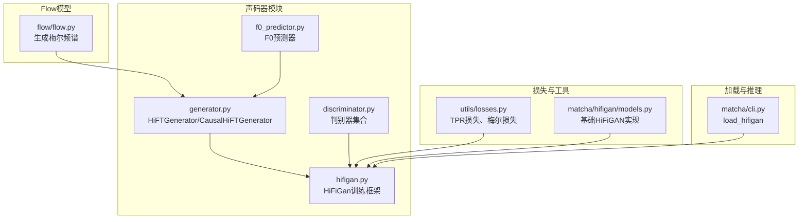
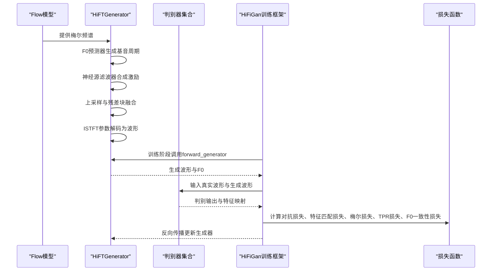
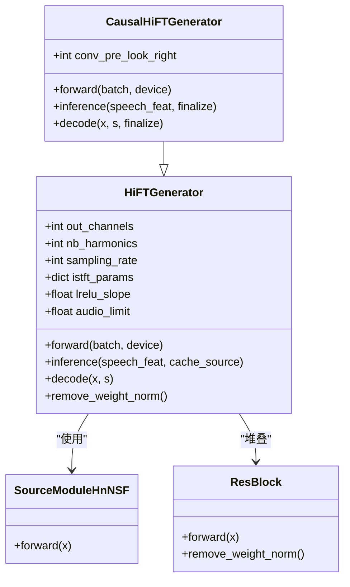
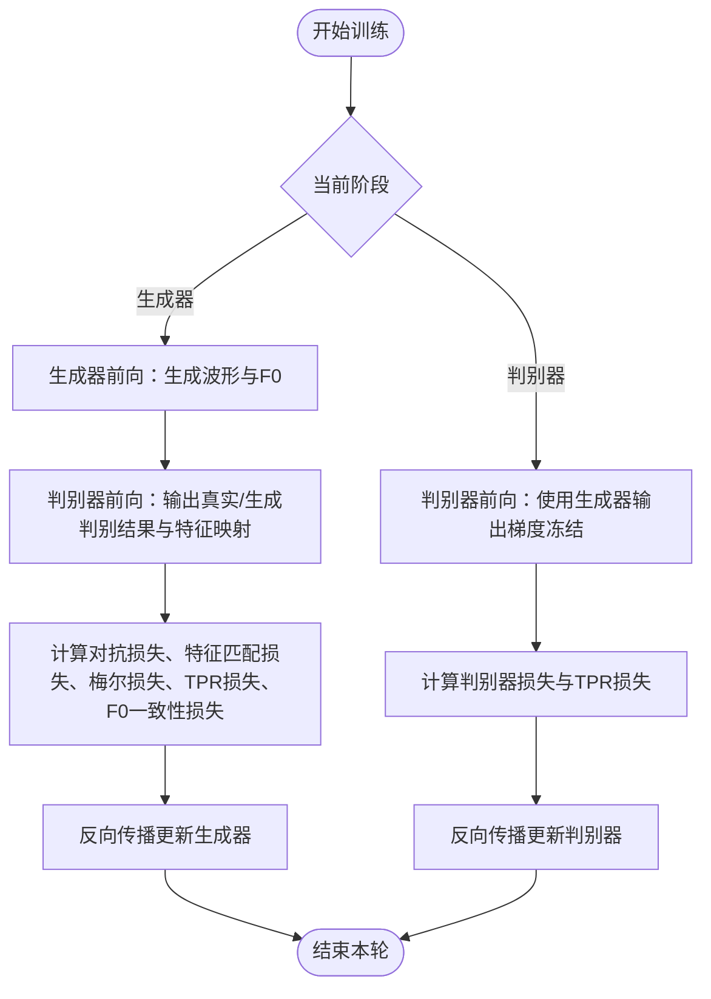
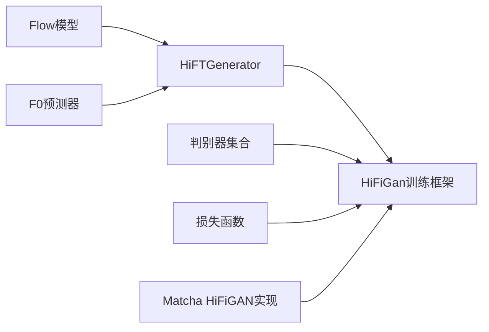

# HiFi-GAN声码器

<cite>
**本文引用的文件**
- [cosyvoice/hifigan/generator.py](file://cosyvoice/hifigan/generator.py)
- [cosyvoice/hifigan/discriminator.py](file://cosyvoice/hifigan/discriminator.py)
- [cosyvoice/hifigan/hifigan.py](file://cosyvoice/hifigan/hifigan.py)
- [cosyvoice/hifigan/f0_predictor.py](file://cosyvoice/hifigan/f0_predictor.py)
- [cosyvoice/utils/losses.py](file://cosyvoice/utils/losses.py)
- [third_party/Matcha-TTS/matcha/hifigan/models.py](file://third_party/Matcha-TTS/matcha/hifigan/models.py)
- [third_party/Matcha-TTS/matcha/cli.py](file://third_party/Matcha-TTS/matcha/cli.py)
- [cosyvoice/flow/flow.py](file://cosyvoice/flow/flow.py)
</cite>

## 目录
1. [引言](#引言)
2. [项目结构](#项目结构)
3. [核心组件](#核心组件)
4. [架构总览](#架构总览)
5. [详细组件分析](#详细组件分析)
6. [依赖关系分析](#依赖关系分析)
7. [性能考量](#性能考量)
8. [故障排查指南](#故障排查指南)
9. [结论](#结论)

## 引言
本节面向希望理解CosyVoice中HiFi-GAN声码器实现与作用的读者，重点说明：
- HiFTGenerator（HiFi-GAN的变体）如何将Flow模型输出的梅尔频谱图高效地转换为高质量的音频波形；
- HiFiGan类的训练逻辑，包括生成器与判别器的对抗训练过程；
- 多尺度梅尔频谱重建损失、特征匹配损失与TPR损失的计算方式及权重配置；
- forward_generator与forward_discriminator方法的执行流程；
- 结合load_hifigan函数，说明模型加载与推理时的预处理步骤（如移除权重归一化）。

## 项目结构
CosyVoice中的声码器相关代码主要位于cosyvoice/hifigan目录，配合flow模块的梅尔频谱生成、utils中的损失函数定义，以及第三方Matcha-TTS中的部分HiFiGAN实现与加载脚本。

图表来源
- [cosyvoice/hifigan/generator.py](file://cosyvoice/hifigan/generator.py#L378-L571)
- [cosyvoice/hifigan/discriminator.py](file://cosyvoice/hifigan/discriminator.py#L1-L231)
- [cosyvoice/hifigan/hifigan.py](file://cosyvoice/hifigan/hifigan.py#L1-L68)
- [cosyvoice/hifigan/f0_predictor.py](file://cosyvoice/hifigan/f0_predictor.py#L1-L104)
- [cosyvoice/utils/losses.py](file://cosyvoice/utils/losses.py#L1-L58)
- [third_party/Matcha-TTS/matcha/hifigan/models.py](file://third_party/Matcha-TTS/matcha/hifigan/models.py#L1-L200)
- [third_party/Matcha-TTS/matcha/cli.py](file://third_party/Matcha-TTS/matcha/cli.py#L84-L105)
- [cosyvoice/flow/flow.py](file://cosyvoice/flow/flow.py#L379-L432)

章节来源
- [cosyvoice/hifigan/generator.py](file://cosyvoice/hifigan/generator.py#L378-L571)
- [cosyvoice/hifigan/discriminator.py](file://cosyvoice/hifigan/discriminator.py#L1-L231)
- [cosyvoice/hifigan/hifigan.py](file://cosyvoice/hifigan/hifigan.py#L1-L68)
- [cosyvoice/hifigan/f0_predictor.py](file://cosyvoice/hifigan/f0_predictor.py#L1-L104)
- [cosyvoice/utils/losses.py](file://cosyvoice/utils/losses.py#L1-L58)
- [third_party/Matcha-TTS/matcha/hifigan/models.py](file://third_party/Matcha-TTS/matcha/hifigan/models.py#L1-L200)
- [third_party/Matcha-TTS/matcha/cli.py](file://third_party/Matcha-TTS/matcha/cli.py#L84-L105)
- [cosyvoice/flow/flow.py](file://cosyvoice/flow/flow.py#L379-L432)

## 核心组件
- HiFTGenerator：基于神经源滤波器与ISTFT网络的端到端声码器，接收梅尔频谱作为条件，输出波形；支持非因果与因果两种版本（CausalHiFTGenerator），用于流式推理。
- 判别器集合：包含多分辨率判别器与多周期判别器，用于对抗训练，提供特征映射以计算特征匹配损失。
- HiFiGan训练框架：封装生成器与判别器的对抗训练，组合特征匹配损失、多尺度梅尔重建损失、TPR损失与F0一致性损失。
- F0预测器：从梅尔频谱预测基音周期，作为声带激励源的输入。
- 损失函数：TPR损失、多尺度梅尔损失、特征匹配损失来自第三方库与自定义实现。
- 加载与推理：通过load_hifigan加载权重并在推理前移除权重归一化，保证推理稳定性。

章节来源
- [cosyvoice/hifigan/generator.py](file://cosyvoice/hifigan/generator.py#L378-L571)
- [cosyvoice/hifigan/discriminator.py](file://cosyvoice/hifigan/discriminator.py#L1-L231)
- [cosyvoice/hifigan/hifigan.py](file://cosyvoice/hifigan/hifigan.py#L1-L68)
- [cosyvoice/hifigan/f0_predictor.py](file://cosyvoice/hifigan/f0_predictor.py#L1-L104)
- [cosyvoice/utils/losses.py](file://cosyvoice/utils/losses.py#L1-L58)
- [third_party/Matcha-TTS/matcha/cli.py](file://third_party/Matcha-TTS/matcha/cli.py#L84-L105)

## 架构总览
下图展示了Flow模型生成梅尔频谱后，HiFTGenerator将其转换为波形，并由HiFiGan进行对抗训练的整体流程。

图表来源
- [cosyvoice/flow/flow.py](file://cosyvoice/flow/flow.py#L379-L432)
- [cosyvoice/hifigan/generator.py](file://cosyvoice/hifigan/generator.py#L541-L569)
- [cosyvoice/hifigan/discriminator.py](file://cosyvoice/hifigan/discriminator.py#L1-L231)
- [cosyvoice/hifigan/hifigan.py](file://cosyvoice/hifigan/hifigan.py#L32-L67)
- [cosyvoice/utils/losses.py](file://cosyvoice/utils/losses.py#L1-L58)

## 详细组件分析

### HiFTGenerator与CausalHiFTGenerator
- 设计要点
  - 使用SourceModuleHnNSF将F0转换为激励信号，再与上采样后的梅尔频谱融合，通过残差块与卷积层逐步重建波形。
  - 采用ISTFT参数（n_fft、hop_len）对频谱幅度与相位进行建模，再通过逆STFT合成波形。
  - 支持因果版本（CausalHiFTGenerator），通过因果卷积与预看窗口控制，满足流式推理需求。
- 关键流程
  - F0预测：调用f0_predictor将梅尔频谱映射为基音周期。
  - 激励生成：将上采样后的F0送入SourceModuleHnNSF得到激励信号。
  - 波形重建：先对梅尔频谱进行上采样与残差块融合，再输出ISTFT参数并合成波形。
- 推理优化
  - remove_weight_norm在推理前移除权重归一化，提升推理稳定性与速度。
  - CausalHiFTGenerator通过look-ahead与裁剪避免边界伪影，支持分片推理与缓存。

图表来源
- [cosyvoice/hifigan/generator.py](file://cosyvoice/hifigan/generator.py#L378-L571)
- [cosyvoice/hifigan/generator.py](file://cosyvoice/hifigan/generator.py#L572-L727)

章节来源
- [cosyvoice/hifigan/generator.py](file://cosyvoice/hifigan/generator.py#L378-L571)
- [cosyvoice/hifigan/generator.py](file://cosyvoice/hifigan/generator.py#L572-L727)

### F0预测器
- 功能：从梅尔频谱中预测基音周期，作为声带激励源的输入。
- 实现：提供非因果与因果两种版本，因果版本支持流式推理时的上下文裁剪与预看窗口控制。
- 与HiFTGenerator协作：在forward/inference中调用f0_predictor，将F0上采样后送入SourceModuleHnNSF。

章节来源
- [cosyvoice/hifigan/f0_predictor.py](file://cosyvoice/hifigan/f0_predictor.py#L1-L104)
- [cosyvoice/hifigan/generator.py](file://cosyvoice/hifigan/generator.py#L541-L569)

### 判别器集合
- 多分辨率判别器（MultiResolutionDiscriminator）与SpecDiscriminator：对不同窗长的STFT谱进行判别，增强频率覆盖范围。
- 多周期判别器（MultipleDiscriminator）：通过多个周期长度的判别器捕捉不同时间尺度的周期性特征。
- 特征映射：返回各层特征映射，用于计算特征匹配损失。

章节来源
- [cosyvoice/hifigan/discriminator.py](file://cosyvoice/hifigan/discriminator.py#L1-L231)

### HiFiGan训练框架
- 对抗训练：生成器与判别器交替训练，turn字段控制当前阶段。
- 损失构成：
  - 对抗损失：生成器最小化判别器对生成样本的置信度。
  - 特征匹配损失：生成器与判别器中间层特征的L1距离。
  - 多尺度梅尔重建损失：对多组Mel变换参数计算L1损失。
  - TPR损失：基于判别器输出的相对方差约束，提升稳定性。
  - F0一致性损失：生成器输出的F0与目标F0的L1距离。
- 权重配置：multi_mel_spectral_recon_loss_weight、feat_match_loss_weight、tpr_loss_weight、tpr_loss_tau等超参在构造函数中注入。

图表来源
- [cosyvoice/hifigan/hifigan.py](file://cosyvoice/hifigan/hifigan.py#L22-L67)
- [cosyvoice/utils/losses.py](file://cosyvoice/utils/losses.py#L1-L58)
- [third_party/Matcha-TTS/matcha/hifigan/models.py](file://third_party/Matcha-TTS/matcha/hifigan/models.py#L1-L200)

章节来源
- [cosyvoice/hifigan/hifigan.py](file://cosyvoice/hifigan/hifigan.py#L1-L68)
- [cosyvoice/utils/losses.py](file://cosyvoice/utils/losses.py#L1-L58)
- [third_party/Matcha-TTS/matcha/hifigan/models.py](file://third_party/Matcha-TTS/matcha/hifigan/models.py#L1-L200)

### 模型加载与推理预处理
- load_hifigan流程：
  - 从检查点加载生成器权重；
  - 调用remove_weight_norm移除权重归一化；
  - 设置为评估模式，准备推理。
- 在CosyVoice中，Flow模型生成的梅尔频谱作为HiFTGenerator的输入，随后HiFTGenerator输出波形。

章节来源
- [third_party/Matcha-TTS/matcha/cli.py](file://third_party/Matcha-TTS/matcha/cli.py#L84-L105)
- [cosyvoice/hifigan/generator.py](file://cosyvoice/hifigan/generator.py#L477-L490)

## 依赖关系分析
- 组件耦合
  - HiFTGenerator依赖F0预测器与SourceModuleHnNSF，同时与HiFiGan训练框架耦合，后者负责损失计算与反向传播。
  - 判别器集合独立于生成器，仅通过forward接口获取判别结果与特征映射。
- 外部依赖
  - 第三方Matcha-TTS提供了基础的HiFiGAN实现与加载脚本，CosyVoice在此基础上扩展了因果版本与更丰富的损失组合。
- 循环依赖
  - 未发现循环导入；训练框架与生成器/判别器之间为单向依赖。

图表来源
- [cosyvoice/flow/flow.py](file://cosyvoice/flow/flow.py#L379-L432)
- [cosyvoice/hifigan/generator.py](file://cosyvoice/hifigan/generator.py#L541-L569)
- [cosyvoice/hifigan/hifigan.py](file://cosyvoice/hifigan/hifigan.py#L22-L67)
- [cosyvoice/hifigan/discriminator.py](file://cosyvoice/hifigan/discriminator.py#L1-L231)
- [cosyvoice/utils/losses.py](file://cosyvoice/utils/losses.py#L1-L58)
- [third_party/Matcha-TTS/matcha/hifigan/models.py](file://third_party/Matcha-TTS/matcha/hifigan/models.py#L1-L200)

章节来源
- [cosyvoice/flow/flow.py](file://cosyvoice/flow/flow.py#L379-L432)
- [cosyvoice/hifigan/generator.py](file://cosyvoice/hifigan/generator.py#L541-L569)
- [cosyvoice/hifigan/hifigan.py](file://cosyvoice/hifigan/hifigan.py#L22-L67)
- [cosyvoice/hifigan/discriminator.py](file://cosyvoice/hifigan/discriminator.py#L1-L231)
- [cosyvoice/utils/losses.py](file://cosyvoice/utils/losses.py#L1-L58)
- [third_party/Matcha-TTS/matcha/hifigan/models.py](file://third_party/Matcha-TTS/matcha/hifigan/models.py#L1-L200)

## 性能考量
- 因果推理优化：CausalHiFTGenerator通过因果卷积与预看窗口减少伪影，适合实时流式合成。
- 权重归一化：训练后在推理前移除权重归一化可降低推理开销，提高稳定性。
- 多尺度梅尔损失：对多组Mel变换参数求平均，有助于提升频域一致性与感知质量。
- 特征匹配损失：利用判别器中间层特征，使生成波形在高层语义上更接近真实分布。
- TPR损失：缓解过度拟合，稳定对抗训练过程。

[本节为通用性能讨论，不直接分析具体文件]

## 故障排查指南
- 推理波形异常或噪声
  - 检查是否已调用remove_weight_norm；若未移除，可能导致不稳定或伪影。
  - 确认ISTFT参数（n_fft、hop_len）与采样率一致。
- 流式推理断续或伪影
  - 使用CausalHiFTGenerator并正确设置finalize与look-ahead参数。
  - 在分片推理时传递cache_source以避免边界不连续。
- 训练不稳定或收敛慢
  - 调整multi_mel_spectral_recon_loss_weight、feat_match_loss_weight、tpr_loss_weight等权重。
  - 确保判别器与生成器的步调平衡，避免过拟合或崩溃。
- F0预测不准导致音质下降
  - 检查F0预测器的输入梅尔维度与通道数是否匹配。
  - 在因果推理中确保f0_predictor的设备与数据类型一致。

章节来源
- [cosyvoice/hifigan/generator.py](file://cosyvoice/hifigan/generator.py#L477-L571)
- [cosyvoice/hifigan/generator.py](file://cosyvoice/hifigan/generator.py#L572-L727)
- [cosyvoice/hifigan/hifigan.py](file://cosyvoice/hifigan/hifigan.py#L1-L68)
- [cosyvoice/hifigan/f0_predictor.py](file://cosyvoice/hifigan/f0_predictor.py#L61-L104)

## 结论
CosyVoice中的HiFTGenerator以神经源滤波器为核心，结合ISTFT参数解码，实现了从Flow模型生成的梅尔频谱到高质量波形的高效转换。HiFiGan训练框架通过对抗训练、特征匹配损失、多尺度梅尔重建损失与TPR损失的协同，显著提升了语音自然度与稳定性。配合因果版本与权重归一化移除策略，CosyVoice在训练与推理两端均具备良好的性能与可扩展性。