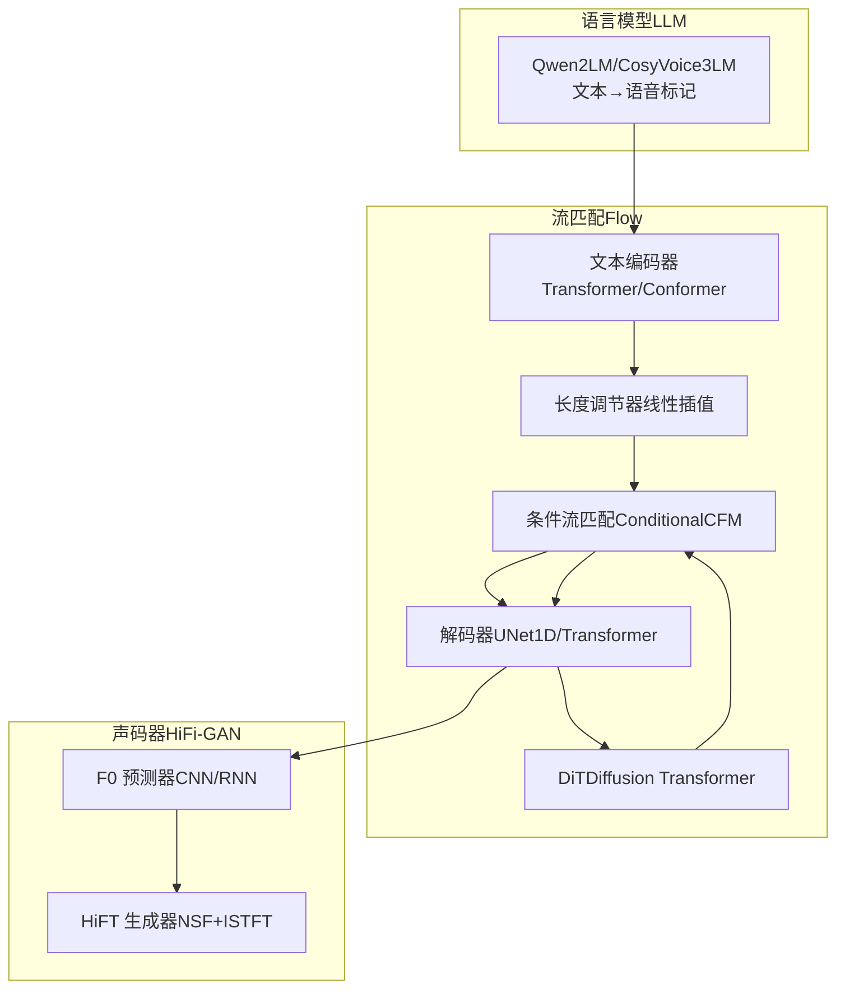
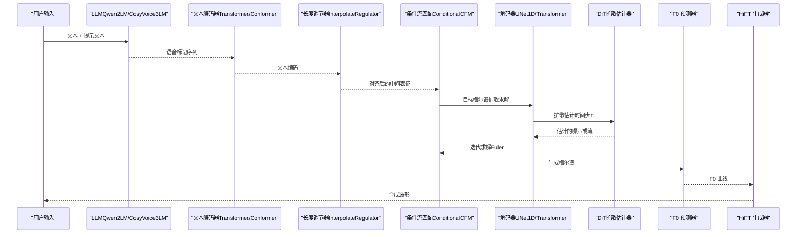
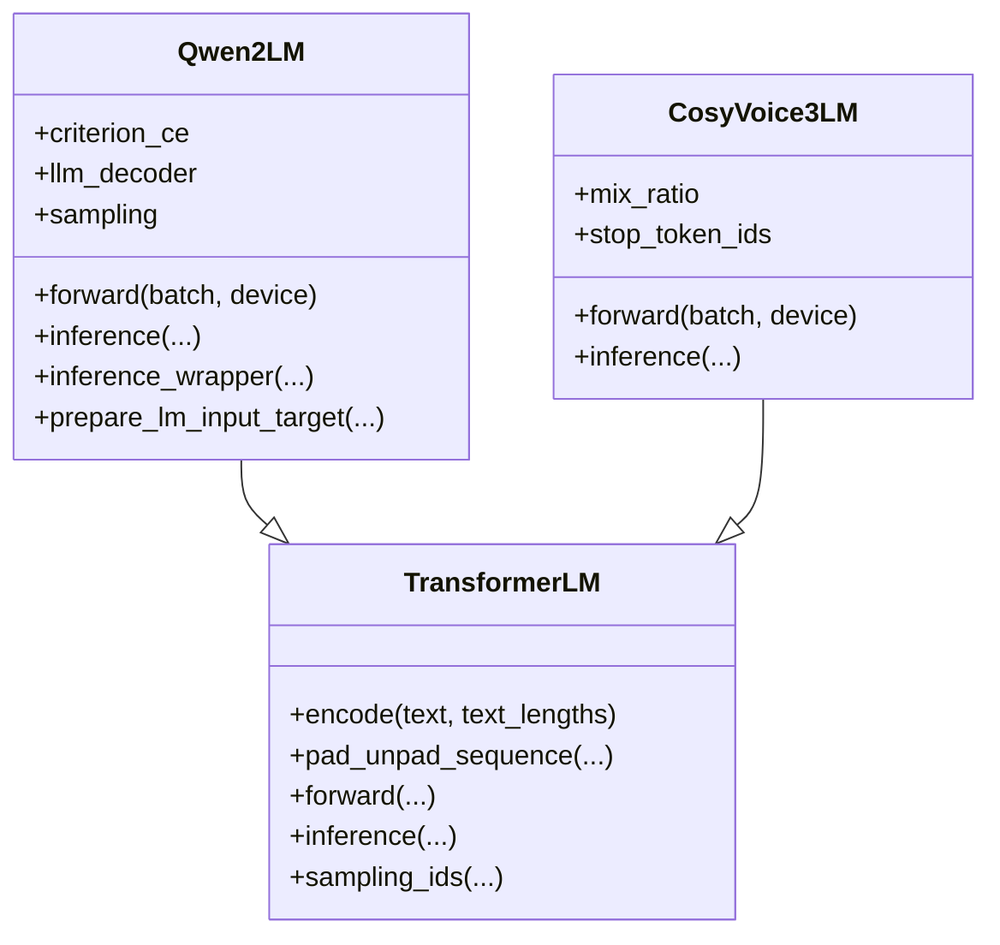
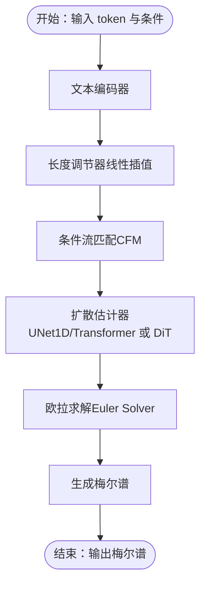
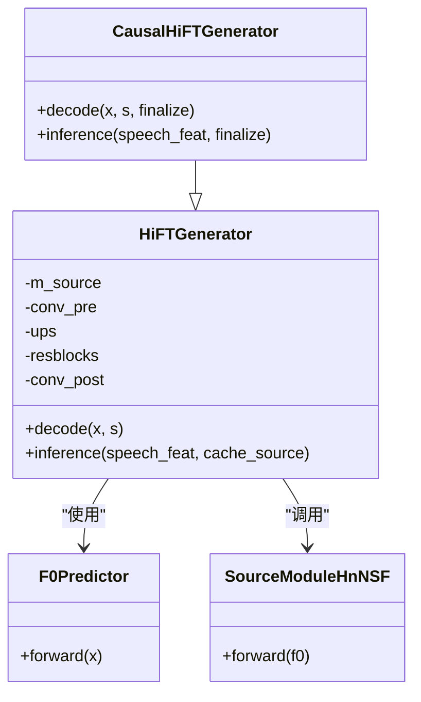
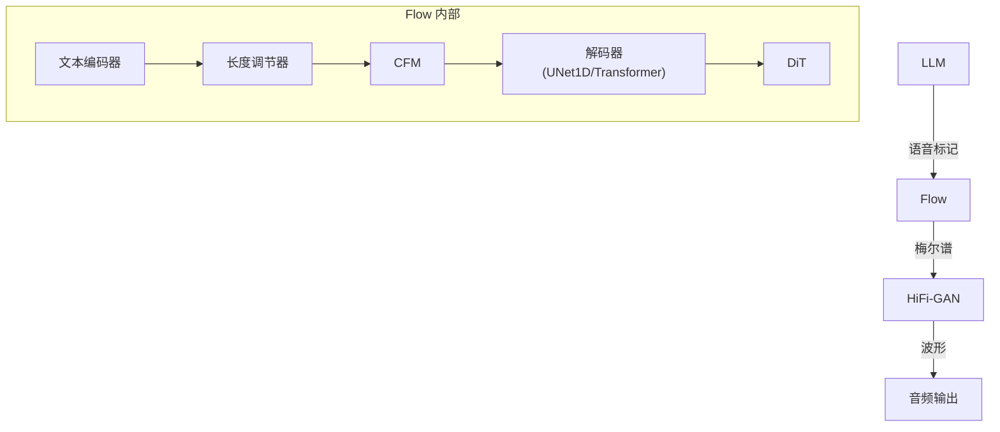

# 模型架构

<cite>
**本文引用的文件列表**
- [cosyvoice/llm/llm.py](file://cosyvoice/llm/llm.py)
- [cosyvoice/flow/flow.py](file://cosyvoice/flow/flow.py)
- [cosyvoice/flow/flow_matching.py](file://cosyvoice/flow/flow_matching.py)
- [cosyvoice/flow/decoder.py](file://cosyvoice/flow/decoder.py)
- [cosyvoice/flow/DiT/dit.py](file://cosyvoice/flow/DiT/dit.py)
- [cosyvoice/flow/DiT/modules.py](file://cosyvoice/flow/DiT/modules.py)
- [cosyvoice/flow/length_regulator.py](file://cosyvoice/flow/length_regulator.py)
- [cosyvoice/hifigan/generator.py](file://cosyvoice/hifigan/generator.py)
- [cosyvoice/hifigan/f0_predictor.py](file://cosyvoice/hifigan/f0_predictor.py)
- [cosyvoice/transformer/encoder.py](file://cosyvoice/transformer/encoder.py)
- [cosyvoice/transformer/decoder.py](file://cosyvoice/transformer/decoder.py)
</cite>

## 目录
1. [引言](#引言)
2. [项目结构](#项目结构)
3. [核心组件](#核心组件)
4. [架构总览](#架构总览)
5. [详细组件分析](#详细组件分析)
6. [依赖关系分析](#依赖关系分析)
7. [性能与训练策略](#性能与训练策略)
8. [故障排查指南](#故障排查指南)
9. [结论](#结论)

## 引言
本文件系统性剖析 CosyVoice 的三大核心模型组件：语言模型（LLM）、流匹配模型（Flow）与 HiFi-GAN 声码器。重点说明：
- LLM 如何将文本与提示信息编码为语音标记序列；
- Flow 模型如何通过扩散（Diffusion）与条件流匹配（Conditional Flow Matching）生成梅尔频谱，并在 Flow 中应用 DiT（Diffusion Transformer）与注意力机制进行建模；
- HiFi-GAN 如何从梅尔谱还原高质量波形，包括源滤波器（NSF）与 ISTFT 网络的协同工作。

同时给出网络结构图、关键超参数说明与训练策略概述，帮助读者快速理解各模块的设计思想与实现细节。

## 项目结构
CosyVoice 将语音合成流程划分为三个阶段：
- 文本到语音标记：由 LLM 完成，输出离散语音标记；
- 语音标记到梅尔谱：由 Flow（扩散 + 条件流匹配）完成；
- 梅尔谱到波形：由 HiFi-GAN（含 NSF 源滤波器与 ISTFT）完成。

图表来源
- [cosyvoice/llm/llm.py](file://cosyvoice/llm/llm.py#L261-L740)
- [cosyvoice/flow/flow.py](file://cosyvoice/flow/flow.py#L1-L433)
- [cosyvoice/flow/flow_matching.py](file://cosyvoice/flow/flow_matching.py#L1-L229)
- [cosyvoice/flow/decoder.py](file://cosyvoice/flow/decoder.py#L1-L495)
- [cosyvoice/flow/DiT/dit.py](file://cosyvoice/flow/DiT/dit.py#L1-L177)
- [cosyvoice/hifigan/generator.py](file://cosyvoice/hifigan/generator.py#L1-L747)
- [cosyvoice/hifigan/f0_predictor.py](file://cosyvoice/hifigan/f0_predictor.py#L1-L104)

章节来源
- [cosyvoice/llm/llm.py](file://cosyvoice/llm/llm.py#L1-L740)
- [cosyvoice/flow/flow.py](file://cosyvoice/flow/flow.py#L1-L433)
- [cosyvoice/flow/flow_matching.py](file://cosyvoice/flow/flow_matching.py#L1-L229)
- [cosyvoice/flow/decoder.py](file://cosyvoice/flow/decoder.py#L1-L495)
- [cosyvoice/flow/DiT/dit.py](file://cosyvoice/flow/DiT/dit.py#L1-L177)
- [cosyvoice/hifigan/generator.py](file://cosyvoice/hifigan/generator.py#L1-L747)
- [cosyvoice/hifigan/f0_predictor.py](file://cosyvoice/hifigan/f0_predictor.py#L1-L104)

## 核心组件
- 语言模型（LLM）
  - 支持多种预训练 LLM（如 Qwen2），将文本与提示信息编码为语音标记序列；支持流式推理与批式推理，具备采样策略与停止符控制。
- 流匹配（Flow）
  - 使用条件流匹配（CFM）与扩散求解器（Euler）生成梅尔谱；解码器采用 UNet1D 与 Transformer 注意力块；DiT 在扩散过程中作为估计器使用。
- HiFi-GAN 声码器
  - 通过 F0 预测器得到基音曲线，结合神经源滤波器（NSF）与 ISTFT 生成波形；支持因果流式推理以降低延迟。

章节来源
- [cosyvoice/llm/llm.py](file://cosyvoice/llm/llm.py#L261-L740)
- [cosyvoice/flow/flow_matching.py](file://cosyvoice/flow/flow_matching.py#L1-L229)
- [cosyvoice/flow/decoder.py](file://cosyvoice/flow/decoder.py#L1-L495)
- [cosyvoice/flow/DiT/dit.py](file://cosyvoice/flow/DiT/dit.py#L1-L177)
- [cosyvoice/hifigan/generator.py](file://cosyvoice/hifigan/generator.py#L1-L747)
- [cosyvoice/hifigan/f0_predictor.py](file://cosyvoice/hifigan/f0_predictor.py#L1-L104)

## 架构总览
下图展示从文本到波形的端到端流程，标注关键模块与数据通路。

图表来源
- [cosyvoice/llm/llm.py](file://cosyvoice/llm/llm.py#L261-L740)
- [cosyvoice/flow/flow.py](file://cosyvoice/flow/flow.py#L1-L433)
- [cosyvoice/flow/flow_matching.py](file://cosyvoice/flow/flow_matching.py#L1-L229)
- [cosyvoice/flow/decoder.py](file://cosyvoice/flow/decoder.py#L1-L495)
- [cosyvoice/flow/DiT/dit.py](file://cosyvoice/flow/DiT/dit.py#L1-L177)
- [cosyvoice/hifigan/generator.py](file://cosyvoice/hifigan/generator.py#L1-L747)
- [cosyvoice/hifigan/f0_predictor.py](file://cosyvoice/hifigan/f0_predictor.py#L1-L104)

## 详细组件分析

### 语言模型（LLM）
- 结构要点
  - 文本嵌入与编码：将文本 token 映射为嵌入并通过文本编码器（Transformer/Conformer）获得上下文表示。
  - 语音标记嵌入与拼接：将提示语音标记与当前生成的语音标记按策略拼接，形成统一的输入序列。
  - 解码器头：对 LLM 输出进行线性映射，得到语音标记分布；使用标签平滑损失与准确率评估。
  - 推理模式：支持流式逐步解码，动态设置最小/最大长度，采样策略可配置，EOS 控制与停止符处理。
- 关键接口
  - 训练前向：计算损失与准确率。
  - 推理前向：逐步生成语音标记，支持提示词与说话人嵌入融合。
- 注意事项
  - 采样时会忽略 EOS 直到达到最小长度阈值，避免过早终止。
  - 支持混合序列（bistream/unistream）策略，提升对长文本的建模能力。

图表来源
- [cosyvoice/llm/llm.py](file://cosyvoice/llm/llm.py#L1-L740)

章节来源
- [cosyvoice/llm/llm.py](file://cosyvoice/llm/llm.py#L1-L740)
- [cosyvoice/transformer/encoder.py](file://cosyvoice/transformer/encoder.py#L1-L475)
- [cosyvoice/transformer/decoder.py](file://cosyvoice/transformer/decoder.py#L1-L397)

### 流匹配模型（Flow）与扩散估计器（DiT）
- 结构要点
  - 文本编码与长度调节：将文本 token 编码为中间表征，再通过长度调节器将帧率对齐至梅尔谱采样率。
  - 条件流匹配（CFM）：定义扩散时间调度与欧拉求解器，支持训练与推理阶段的 CFG（Classifier-Free Guidance）。
  - 解码器（UNet1D + Transformer）：在时间维度上进行下采样、中段与上采样，配合 Transformer 注意力块与掩码注意力。
  - DiT（Diffusion Transformer）：在扩散估计器中使用 DiT 块，结合 AdaLayerNormZero、旋转位置编码（RoPE）与注意力，实现对无噪输入、条件与时间步的联合建模。
- 关键流程
  - 训练：随机时间步与噪声，计算估计误差损失。
  - 推理：从高斯噪声开始，按时间步迭代求解，结合提示段与重叠缓存，支持流式分块生成。

图表来源
- [cosyvoice/flow/flow.py](file://cosyvoice/flow/flow.py#L1-L433)
- [cosyvoice/flow/flow_matching.py](file://cosyvoice/flow/flow_matching.py#L1-L229)
- [cosyvoice/flow/decoder.py](file://cosyvoice/flow/decoder.py#L1-L495)
- [cosyvoice/flow/DiT/dit.py](file://cosyvoice/flow/DiT/dit.py#L1-L177)
- [cosyvoice/flow/DiT/modules.py](file://cosyvoice/flow/DiT/modules.py#L1-L617)
- [cosyvoice/flow/length_regulator.py](file://cosyvoice/flow/length_regulator.py#L1-L71)

章节来源
- [cosyvoice/flow/flow.py](file://cosyvoice/flow/flow.py#L1-L433)
- [cosyvoice/flow/flow_matching.py](file://cosyvoice/flow/flow_matching.py#L1-L229)
- [cosyvoice/flow/decoder.py](file://cosyvoice/flow/decoder.py#L1-L495)
- [cosyvoice/flow/DiT/dit.py](file://cosyvoice/flow/DiT/dit.py#L1-L177)
- [cosyvoice/flow/DiT/modules.py](file://cosyvoice/flow/DiT/modules.py#L1-L617)
- [cosyvoice/flow/length_regulator.py](file://cosyvoice/flow/length_regulator.py#L1-L71)

### HiFi-GAN 声码器（含 NSF 与 ISTFT）
- 结构要点
  - F0 预测器：基于 CNN/RNN 的时序预测，输出基音幅度（非负）。
  - HiFT 生成器：将梅尔谱经上采样与残差块堆叠后，与源信号（NSF）融合，输出幅度与相位，再经 ISTFT 得到波形。
  - 因果流式推理：支持预留窗口与 finalize 切换，保证实时性与无泄漏。
- 关键组件
  - ResBlock（带因果卷积）、Snake 激活、权重归一化；
  - SourceModuleHnNSF：多谐波叠加与噪声混合，生成源信号；
  - CausalHiFTGenerator：确保因果性与流式分块。

图表来源
- [cosyvoice/hifigan/generator.py](file://cosyvoice/hifigan/generator.py#L1-L747)
- [cosyvoice/hifigan/f0_predictor.py](file://cosyvoice/hifigan/f0_predictor.py#L1-L104)

章节来源
- [cosyvoice/hifigan/generator.py](file://cosyvoice/hifigan/generator.py#L1-L747)
- [cosyvoice/hifigan/f0_predictor.py](file://cosyvoice/hifigan/f0_predictor.py#L1-L104)

## 依赖关系分析
- 组件耦合
  - LLM 与 Flow：LLM 输出的语音标记经 Flow 转换为梅尔谱；Flow 的条件来自 LLM 的文本编码与说话人嵌入。
  - Flow 与 HiFi-GAN：Flow 输出的梅尔谱作为 HiFi-GAN 的输入；HiFi-GAN 的 F0 预测器与生成器相互独立但顺序连接。
- 外部依赖
  - 扩散估计器与注意力：DiT 与 UNet1D 的注意力模块依赖于旋转位置编码（RoPE）与掩码注意力。
  - 数据流：所有模块均通过掩码与时间步张量进行对齐与约束。

图表来源
- [cosyvoice/llm/llm.py](file://cosyvoice/llm/llm.py#L1-L740)
- [cosyvoice/flow/flow.py](file://cosyvoice/flow/flow.py#L1-L433)
- [cosyvoice/flow/flow_matching.py](file://cosyvoice/flow/flow_matching.py#L1-L229)
- [cosyvoice/flow/decoder.py](file://cosyvoice/flow/decoder.py#L1-L495)
- [cosyvoice/flow/DiT/dit.py](file://cosyvoice/flow/DiT/dit.py#L1-L177)
- [cosyvoice/hifigan/generator.py](file://cosyvoice/hifigan/generator.py#L1-L747)

章节来源
- [cosyvoice/llm/llm.py](file://cosyvoice/llm/llm.py#L1-L740)
- [cosyvoice/flow/flow.py](file://cosyvoice/flow/flow.py#L1-L433)
- [cosyvoice/flow/flow_matching.py](file://cosyvoice/flow/flow_matching.py#L1-L229)
- [cosyvoice/flow/decoder.py](file://cosyvoice/flow/decoder.py#L1-L495)
- [cosyvoice/flow/DiT/dit.py](file://cosyvoice/flow/DiT/dit.py#L1-L177)
- [cosyvoice/hifigan/generator.py](file://cosyvoice/hifigan/generator.py#L1-L747)

## 性能与训练策略
- 训练阶段
  - 条件流匹配损失：最小化估计器输出与目标之间的均方误差，掩码加权。
  - CFG（Classifier-Free Guidance）：在训练与推理中引入条件缺失策略，平衡覆盖度与保真度。
  - 时间步调度：余弦调度提升扩散过程稳定性。
- 推理阶段
  - 流式分块：通过静态块大小与左块数量控制延迟与吞吐；因果生成器确保无泄漏。
  - 采样策略：Top-k 采样与 EOS 控制，结合最小/最大长度限制。
- 计算优化
  - 掩码注意力与分块掩码减少无效计算；
  - 可选梯度检查点与权重归一化降低显存与提高收敛性。

章节来源
- [cosyvoice/flow/flow_matching.py](file://cosyvoice/flow/flow_matching.py#L1-L229)
- [cosyvoice/flow/decoder.py](file://cosyvoice/flow/decoder.py#L1-L495)
- [cosyvoice/flow/DiT/modules.py](file://cosyvoice/flow/DiT/modules.py#L1-L617)
- [cosyvoice/llm/llm.py](file://cosyvoice/llm/llm.py#L1-L740)

## 故障排查指南
- 采样提前终止
  - 现象：推理时过早出现 EOS 导致生成截断。
  - 处理：调整最小长度阈值，确保在达到最小长度前忽略 EOS。
  - 参考路径：[cosyvoice/llm/llm.py](file://cosyvoice/llm/llm.py#L149-L165)
- 推理不连续或泄漏
  - 现象：流式分块边界处波形不连续或存在噪声。
  - 处理：启用 finalize 切换，使用重叠缓存与预留窗口；确认因果卷积与上采样对齐。
  - 参考路径：[cosyvoice/hifigan/generator.py](file://cosyvoice/hifigan/generator.py#L572-L727)
- 扩散求解不稳定
  - 现象：生成梅尔谱质量差或发散。
  - 处理：检查时间步调度与学习率；适当增大掩码权重；确认 CFG 率设置合理。
  - 参考路径：[cosyvoice/flow/flow_matching.py](file://cosyvoice/flow/flow_matching.py#L1-L229)
- 注意力掩码异常
  - 现象：注意力遮罩导致信息泄露或遮罩不一致。
  - 处理：核对掩码构造逻辑与分块掩码函数，确保维度与类型一致。
  - 参考路径：[cosyvoice/flow/decoder.py](file://cosyvoice/flow/decoder.py#L210-L291)

章节来源
- [cosyvoice/llm/llm.py](file://cosyvoice/llm/llm.py#L149-L165)
- [cosyvoice/hifigan/generator.py](file://cosyvoice/hifigan/generator.py#L572-L727)
- [cosyvoice/flow/flow_matching.py](file://cosyvoice/flow/flow_matching.py#L1-L229)
- [cosyvoice/flow/decoder.py](file://cosyvoice/flow/decoder.py#L210-L291)

## 结论
CosyVoice 通过“LLM→Flow→HiFi-GAN”的流水线实现了高质量、低延迟的语音合成。其中：
- LLM 负责将文本与提示信息转化为离散语音标记；
- Flow 采用条件流匹配与扩散估计器（UNet1D/Transformer 或 DiT）稳定地生成梅尔谱；
- HiFi-GAN 以 NSF 源滤波器与 ISTFT 实现自然逼真的波形重建。
该设计在注意力与扩散估计器的协同下，兼顾了建模能力与推理效率，适合在线与离线场景部署。