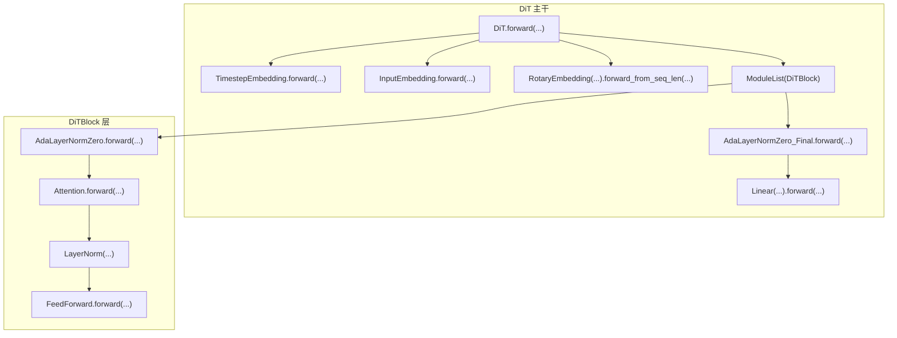
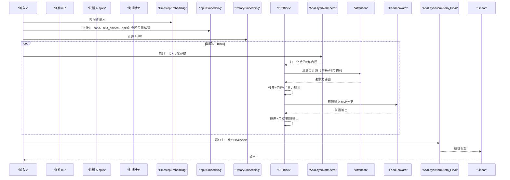
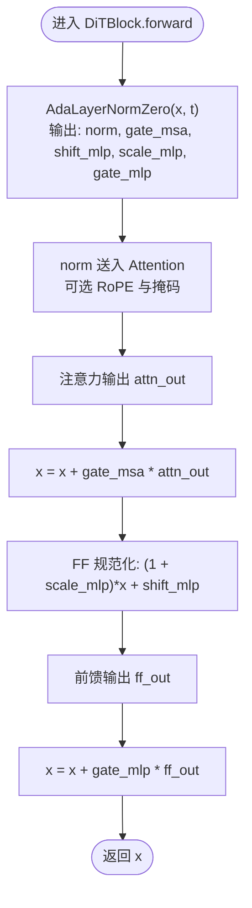
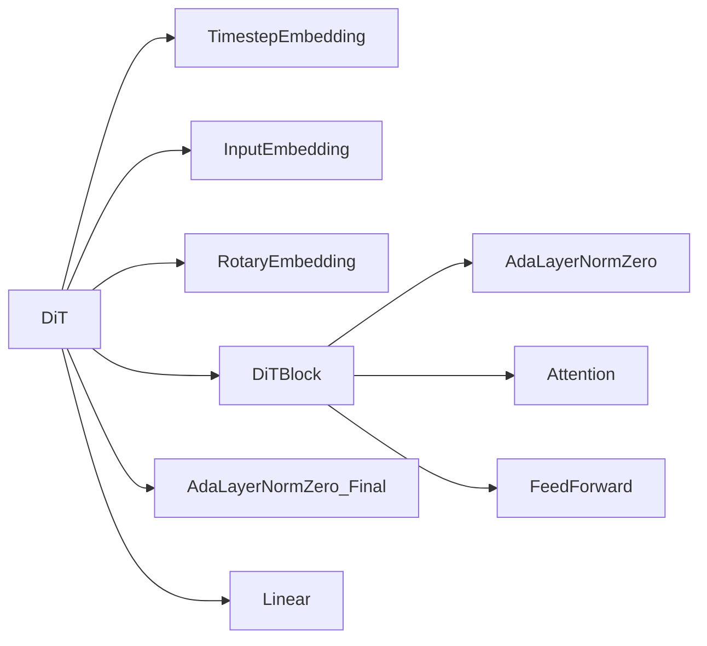

# DiT Transformer块

<cite>
**本文引用的文件列表**
- [cosyvoice/flow/DiT/dit.py](file://cosyvoice/flow/DiT/dit.py)
- [cosyvoice/flow/DiT/modules.py](file://cosyvoice/flow/DiT/modules.py)
- [cosyvoice/utils/mask.py](file://cosyvoice/utils/mask.py)
</cite>

## 目录
1. [简介](#简介)
2. [项目结构](#项目结构)
3. [核心组件](#核心组件)
4. [架构总览](#架构总览)
5. [详细组件分析](#详细组件分析)
6. [依赖关系分析](#依赖关系分析)
7. [性能考量](#性能考量)
8. [故障排查指南](#故障排查指南)
9. [结论](#结论)

## 简介
本文件聚焦于 DiT Transformer 块中的 DiTBlock 类，系统性解析其内部结构与前向传播机制。重点包括：
- AdaLayerNormZero 如何基于时间步嵌入 t 对输入进行自适应归一化，并生成门控信号（gate_msa、gate_mlp）与偏移/缩放参数（shift_mlp、scale_mlp），用于调制注意力与前馈网络的输出；
- Attention 模块中旋转位置编码（RoPE）的应用方式；
- 多头注意力机制如何处理带掩码的序列；
- 通过代码片段路径展示残差连接与门控机制的实现细节；
- FeedForward 网络中 GELU 激活函数与 Dropout 的配置对模型性能的影响。

## 项目结构
DiT 相关代码位于 flow/DiT 目录，包含主干网络 DiT 与模块集合 modules.py。其中：
- DiT：负责时间步嵌入、输入拼接与卷积位置编码、旋转位置编码构建、块级堆叠与最终归一化投影；
- DiTBlock：单层 Transformer 块，包含自适应归一化、注意力与前馈网络、门控残差连接；
- Attention 及处理器：实现标准注意力与联合注意力（含 RoPE）；
- AdaLayerNormZero：时序条件驱动的归一化与门控参数生成；
- FeedForward：前馈网络，包含 GELU 与 Dropout；
- 掩码工具：提供动态/静态分块掩码，支持流式推理。

图表来源
- [cosyvoice/flow/DiT/dit.py](file://cosyvoice/flow/DiT/dit.py#L145-L177)
- [cosyvoice/flow/DiT/modules.py](file://cosyvoice/flow/DiT/modules.py#L500-L531)

章节来源
- [cosyvoice/flow/DiT/dit.py](file://cosyvoice/flow/DiT/dit.py#L104-L177)
- [cosyvoice/flow/DiT/modules.py](file://cosyvoice/flow/DiT/modules.py#L229-L331)

## 核心组件
- DiT：构建时间步嵌入、输入拼接与卷积位置编码、旋转位置编码、块堆叠、最终归一化与线性输出。
- DiTBlock：每层包含 AdaLayerNormZero（预归一化+门控）、Attention（可选 RoPE）、FFN（GELU+Dropout）、残差门控融合。
- AdaLayerNormZero：将时间步嵌入映射为多组门控与归一化参数，分别作用于注意力与前馈分支。
- Attention：支持标准注意力与联合注意力（文本上下文），内置 RoPE 应用与掩码广播。
- FeedForward：两层线性+激活+Dropout，内层使用 GELU，外层线性输出。

章节来源
- [cosyvoice/flow/DiT/dit.py](file://cosyvoice/flow/DiT/dit.py#L104-L177)
- [cosyvoice/flow/DiT/modules.py](file://cosyvoice/flow/DiT/modules.py#L229-L331)
- [cosyvoice/flow/DiT/modules.py](file://cosyvoice/flow/DiT/modules.py#L497-L531)

## 架构总览
下图展示 DiT 与 DiTBlock 的端到端数据流，强调时间步条件、旋转位置编码、掩码传播与门控残差。

图表来源
- [cosyvoice/flow/DiT/dit.py](file://cosyvoice/flow/DiT/dit.py#L145-L177)
- [cosyvoice/flow/DiT/modules.py](file://cosyvoice/flow/DiT/modules.py#L500-L531)

## 详细组件分析

### DiTBlock 内部结构与前向传播
- 结构要点
  - 预归一化与门控：AdaLayerNormZero 将时间步嵌入映射为注意力与前馈分支的 scale/shift/gate 参数；
  - 注意力：Attention 使用 AttnProcessor 或 JointAttnProcessor，支持 RoPE 与掩码；
  - 前馈：LayerNorm 后经 FeedForward（GELU+Dropout）；
  - 残差门控：注意力与前馈输出均通过门控系数加回到输入，形成门控残差。

- 关键实现路径
  - AdaLayerNormZero：生成门控与归一化参数，返回归一化后的输入与门控项
    - [AdaLayerNormZero.forward](file://cosyvoice/flow/DiT/modules.py#L239-L244)
  - DiTBlock 前向：调用 AdaLayerNormZero、Attention、FF 并执行门控残差
    - [DiTBlock.forward](file://cosyvoice/flow/DiT/modules.py#L516-L530)

- 门控机制与残差连接
  - 注意力分支：norm, gate_msa, *_mlp = AdaLayerNormZero(x, t)，随后 attn_out = Attn(norm)，x = x + gate_msa * attn_out
    - [DiTBlock.forward](file://cosyvoice/flow/DiT/modules.py#L516-L530)
  - 前馈分支：先对 x 进行 FF 规范化（scale_mlp/shift_mlp），再经 FF，最后 x = x + gate_mlp * ff_out
    - [DiTBlock.forward](file://cosyvoice/flow/DiT/modules.py#L516-L530)

- 时间步嵌入 t 的作用
  - TimestepEmbedding 将标量或批量时间步映射为与隐藏维一致的时间条件向量，作为 AdaLayerNormZero 的输入
    - [TimestepEmbedding.forward](file://cosyvoice/flow/DiT/modules.py#L612-L616)
  - DiT 在前向中将 t 转换为 batch 维度后传入各层
    - [DiT.forward](file://cosyvoice/flow/DiT/dit.py#L145-L177)

章节来源
- [cosyvoice/flow/DiT/modules.py](file://cosyvoice/flow/DiT/modules.py#L230-L245)
- [cosyvoice/flow/DiT/modules.py](file://cosyvoice/flow/DiT/modules.py#L500-L531)
- [cosyvoice/flow/DiT/dit.py](file://cosyvoice/flow/DiT/dit.py#L145-L177)

### AdaLayerNormZero：自适应归一化与门控生成
- 输入输出
  - 输入：x（序列特征）、emb（时间步嵌入）
  - 输出：归一化后的 x 与门控参数（gate_msa、shift_mlp、scale_mlp、gate_mlp）
- 实现要点
  - 通过 SiLU + 线性层将 emb 映射为 6 维张量，按通道切分为 6 份，分别对应注意力分支的 scale_msa、shift_msa 与前馈分支的 shift_mlp、scale_mlp、gate_mlp
  - 对 x 先 LayerNorm，再乘以 (1 + scale_msa) 并加上 shift_msa，得到注意力输入
- 代码片段路径
  - [AdaLayerNormZero.forward](file://cosyvoice/flow/DiT/modules.py#L239-L244)

- 与最终层的区别
  - AdaLayerNormZero_Final 仅生成 scale/shift，不产生门控参数，用于最终归一化阶段
    - [AdaLayerNormZero_Final.forward](file://cosyvoice/flow/DiT/modules.py#L260-L265)

章节来源
- [cosyvoice/flow/DiT/modules.py](file://cosyvoice/flow/DiT/modules.py#L230-L266)

### Attention：RoPE 应用与掩码传播
- RoPE 应用
  - 标准注意力：在生成 query/key 后，若提供 rope，则对 query/key 分别应用旋转位置编码
    - [AttnProcessor.__call__](file://cosyvoice/flow/DiT/modules.py#L353-L407)
  - 联合注意力：对样本 x 与上下文 c 分别独立应用 RoPE
    - [JointAttnProcessor.__call__](file://cosyvoice/flow/DiT/modules.py#L418-L494)
- 掩码处理
  - 标准注意力：mask 为二维时扩展为 (B, H, T, T)，并在注意力中作为掩码传入
    - [AttnProcessor.__call__](file://cosyvoice/flow/DiT/modules.py#L382-L390)
  - 联合注意力：将样本 mask 扩展到拼接长度，并对上下文部分不施加掩码
    - [JointAttnProcessor.__call__](file://cosyvoice/flow/DiT/modules.py#L464-L471)
- 多头注意力
  - 将 Q/K/V 投影为 (B, H, T, D_head)，执行 scaled_dot_product_attention，再线性投影与 Dropout
    - [AttnProcessor.__call__](file://cosyvoice/flow/DiT/modules.py#L376-L399)
    - [JointAttnProcessor.__call__](file://cosyvoice/flow/DiT/modules.py#L453-L488)

- DiT 中的掩码构造
  - DiT 基于 add_optional_chunk_mask 生成掩码，支持动态/静态分块与左扩展，然后广播为多头形状
    - [DiT.forward 掩码构造与广播](file://cosyvoice/flow/DiT/dit.py#L163-L167)
    - [add_optional_chunk_mask](file://cosyvoice/utils/mask.py#L161-L236)

章节来源
- [cosyvoice/flow/DiT/modules.py](file://cosyvoice/flow/DiT/modules.py#L289-L407)
- [cosyvoice/flow/DiT/modules.py](file://cosyvoice/flow/DiT/modules.py#L410-L494)
- [cosyvoice/flow/DiT/dit.py](file://cosyvoice/flow/DiT/dit.py#L145-L177)
- [cosyvoice/utils/mask.py](file://cosyvoice/utils/mask.py#L161-L236)

### FeedForward：GELU 与 Dropout 配置
- 结构
  - 两层线性：先升维再降维；中间使用 GELU 激活；整体包含 Dropout
- 参数影响
  - approximate 控制 GELU 近似策略，近似模式可能提升速度但牺牲精度；
  - dropout 控制前馈分支的正则化强度，过高可能导致欠拟合，过低可能过拟合。
- 代码片段路径
  - [FeedForward.__init__](file://cosyvoice/flow/DiT/modules.py#L271-L279)
  - [FeedForward.forward](file://cosyvoice/flow/DiT/modules.py#L281-L282)

章节来源
- [cosyvoice/flow/DiT/modules.py](file://cosyvoice/flow/DiT/modules.py#L268-L283)

### 残差连接与门控机制流程图

图表来源
- [cosyvoice/flow/DiT/modules.py](file://cosyvoice/flow/DiT/modules.py#L516-L530)

## 依赖关系分析
- DiT 依赖
  - TimestepEmbedding：生成时间步条件向量
  - InputEmbedding：拼接多源输入并加入卷积位置编码
  - RotaryEmbedding：为注意力提供旋转位置编码
  - ModuleList(DiTBlock)：堆叠多层
  - AdaLayerNormZero_Final：最终归一化
  - Linear：输出投影
- DiTBlock 依赖
  - AdaLayerNormZero：预归一化与门控
  - Attention：注意力计算（含 RoPE 与掩码）
  - FeedForward：前馈网络（GELU+Dropout）
  - LayerNorm：FF 规范化

图表来源
- [cosyvoice/flow/DiT/dit.py](file://cosyvoice/flow/DiT/dit.py#L104-L177)
- [cosyvoice/flow/DiT/modules.py](file://cosyvoice/flow/DiT/modules.py#L500-L531)

章节来源
- [cosyvoice/flow/DiT/dit.py](file://cosyvoice/flow/DiT/dit.py#L104-L177)
- [cosyvoice/flow/DiT/modules.py](file://cosyvoice/flow/DiT/modules.py#L229-L331)

## 性能考量
- RoPE 与掩码
  - RoPE 提升长序列建模能力，但需额外计算频率表与旋转操作；掩码广播会增加内存与计算开销，建议在静态长度场景减少广播维度。
- 门控残差
  - 门控残差有助于稳定训练与信息保留，但门控参数由时间步条件生成，需确保时间步嵌入维度与隐藏维度匹配。
- 前馈网络
  - GELU 近似模式可加速推理，但可能影响精度；Dropout 过高会抑制学习，应结合数据规模与验证集表现调整。
- 流式推理
  - 动态/静态分块掩码可降低延迟，但需保证左扩展与分块大小设置合理，避免信息泄漏。

[本节为通用指导，无需列出具体文件来源]

## 故障排查指南
- 注意力掩码无效
  - 检查掩码维度是否正确扩展至 (B, H, T, T)，以及是否与注意力张量形状兼容
  - 参考：[AttnProcessor 掩码处理](file://cosyvoice/flow/DiT/modules.py#L382-L390)
- 联合注意力上下文未生效
  - 确认 c_rope 是否传入，且上下文掩码未被错误地施加到文本部分
  - 参考：[JointAttnProcessor 掩码与分割](file://cosyvoice/flow/DiT/modules.py#L464-L494)
- 门控残差无变化
  - 检查 AdaLayerNormZero 输出的门控参数是否被正确使用；确认 t 维度与 emb 期望一致
  - 参考：[AdaLayerNormZero.forward](file://cosyvoice/flow/DiT/modules.py#L239-L244)，[DiTBlock.forward](file://cosyvoice/flow/DiT/modules.py#L516-L530)
- GELU/Dropout 影响训练稳定性
  - 调整 approximate 与 dropout 比例，观察验证集指标；过大 dropout 可导致收敛困难
  - 参考：[FeedForward.__init__](file://cosyvoice/flow/DiT/modules.py#L271-L279)

章节来源
- [cosyvoice/flow/DiT/modules.py](file://cosyvoice/flow/DiT/modules.py#L353-L407)
- [cosyvoice/flow/DiT/modules.py](file://cosyvoice/flow/DiT/modules.py#L418-L494)
- [cosyvoice/flow/DiT/modules.py](file://cosyvoice/flow/DiT/modules.py#L239-L244)
- [cosyvoice/flow/DiT/modules.py](file://cosyvoice/flow/DiT/modules.py#L271-L279)

## 结论
DiTBlock 通过 AdaLayerNormZero 将时间步条件 t 映射为注意力与前馈分支的门控与归一化参数，结合 Attention 的 RoPE 与掩码机制，实现了对长序列与变长目标的有效建模。门控残差连接增强了信息保留与稳定性，而 FeedForward 的 GELU 与 Dropout 则平衡了表达能力与正则化。在实际部署中，应根据任务特性与资源约束，合理选择 RoPE、掩码策略与前馈配置，以获得最佳性能与稳定性。