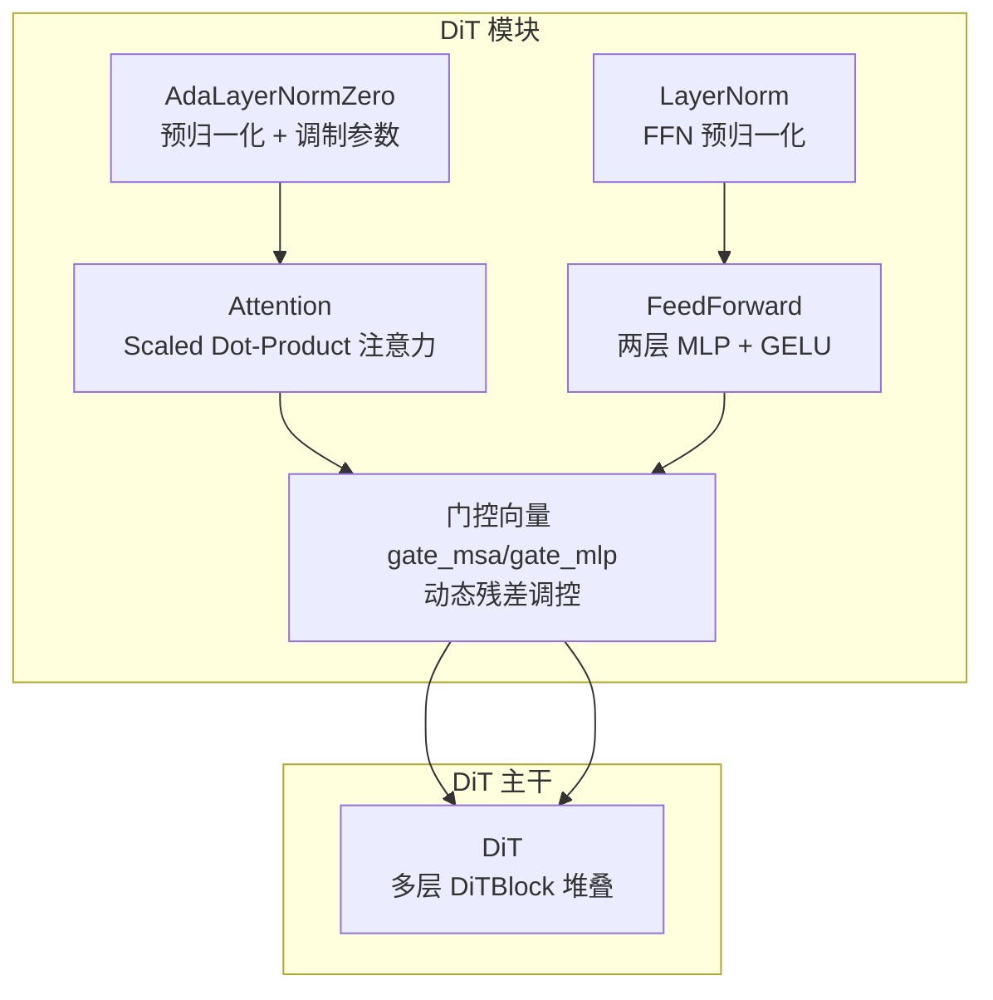
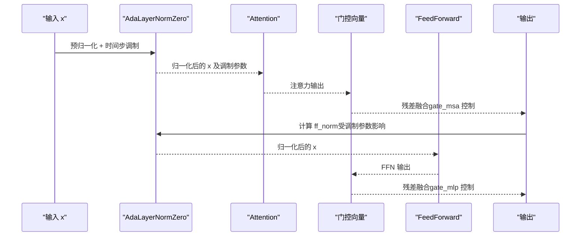
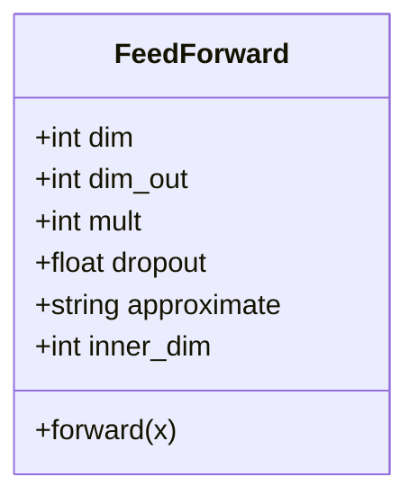
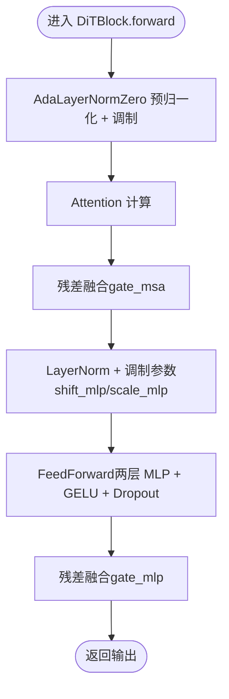
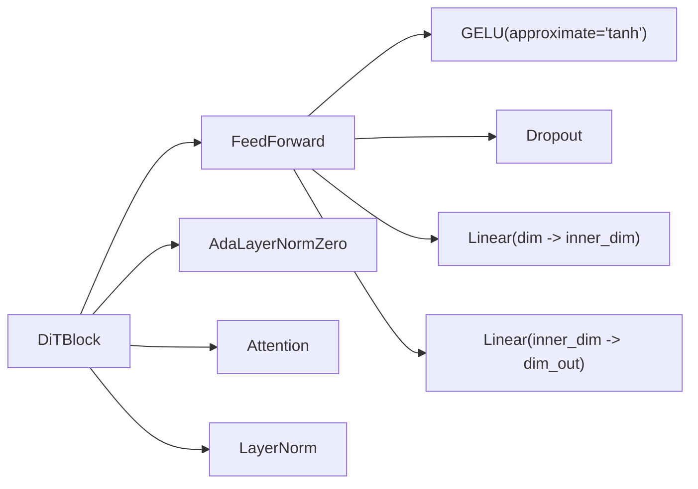

# 前馈网络（FeedForward）

<cite>
**本文引用的文件列表**
- [modules.py](file://cosyvoice/flow/DiT/modules.py)
- [dit.py](file://cosyvoice/flow/DiT/dit.py)
</cite>

## 目录
1. [简介](#简介)
2. [项目结构](#项目结构)
3. [核心组件](#核心组件)
4. [架构总览](#架构总览)
5. [详细组件分析](#详细组件分析)
6. [依赖关系分析](#依赖关系分析)
7. [性能考量](#性能考量)
8. [故障排查指南](#故障排查指南)
9. [结论](#结论)

## 简介
本节聚焦于 CosyVoice 中 DiT 架构下的 FeedForward 类，系统阐述其两层 MLP 结构（两个线性层 + GELU 激活）、inner_dim 的扩展机制、近似 GELU（approximate='tanh'）在训练稳定性与计算效率之间的权衡、project_in 序列的实现细节（激活与 Dropout 的顺序配置），以及该模块在 DiTBlock 中的作用：作为非线性变换单元增强模型表达能力，并结合门控机制（gate_mlp）实现残差路径的动态调控。同时讨论 Dropout 对模型泛化的影响及在语音生成任务中的调优建议。

## 项目结构
- FeedForward 定义位于 DiT 模块文件中，是 DiTBlock 的重要子模块之一。
- DiTBlock 将注意力子层与 FeedForward 子层以预归一化（Pre-Norm）+ 动态门控的方式组合，形成可学习的残差路径动态调控单元。
- DiT 主干网络由多个 DiTBlock 组成，负责从含噪音频、条件特征、文本嵌入等输入中逐步去噪并输出目标频谱。

图表来源
- [modules.py](file://cosyvoice/flow/DiT/modules.py#L271-L283)
- [modules.py](file://cosyvoice/flow/DiT/modules.py#L500-L531)
- [dit.py](file://cosyvoice/flow/DiT/dit.py#L104-L177)

章节来源
- [modules.py](file://cosyvoice/flow/DiT/modules.py#L271-L283)
- [modules.py](file://cosyvoice/flow/DiT/modules.py#L500-L531)
- [dit.py](file://cosyvoice/flow/DiT/dit.py#L104-L177)

## 核心组件
- FeedForward：两层 MLP，第一层将维度从 dim 扩展到 inner_dim（由 mult 参数控制），第二层映射回输出维度 dim_out；激活使用 GELU，支持 approximate='tanh' 近似；中间插入 Dropout。
- DiTBlock：在预归一化与 AdaLayerNormZero 的调制下，先执行注意力，再经门控向量 gate_msa 控制注意力输出对残差的融合；随后对 FFN 输入进行调制（ff_norm），经 FeedForward 后由 gate_mlp 控制 FFN 输出对残差的融合。

章节来源
- [modules.py](file://cosyvoice/flow/DiT/modules.py#L271-L283)
- [modules.py](file://cosyvoice/flow/DiT/modules.py#L500-L531)

## 架构总览
下图展示了 DiTBlock 内部的前馈路径与门控机制，以及 FeedForward 在其中的位置与数据流。

图表来源
- [modules.py](file://cosyvoice/flow/DiT/modules.py#L500-L531)

章节来源
- [modules.py](file://cosyvoice/flow/DiT/modules.py#L500-L531)

## 详细组件分析

### FeedForward 类结构与两层 MLP 设计
- 结构组成
  - 第一层线性层：将输入维度从 dim 映射到 inner_dim。
  - 激活函数：GELU，支持 approximate='tanh' 近似实现。
  - Dropout：在激活后、第二层线性层前应用。
  - 第二层线性层：将 inner_dim 映射回输出维度 dim_out（默认等于输入维度 dim）。
- inner_dim 的扩展机制
  - inner_dim = int(dim × mult)，mult 为扩展倍数，默认值为 4。该机制在不改变输入通道数的前提下，显著提升模型的非线性表达能力与参数容量。
- 近似 GELU（approximate='tanh'）
  - 使用 torch.nn.GELU(approximate='tanh')，在保证非线性能力的同时，降低计算开销，提高训练稳定性与吞吐效率，尤其适用于大规模推理场景。
- project_in 序列的实现细节
  - 实现为“线性层 → 激活函数 → Dropout → 线性层”的顺序，确保激活与 Dropout 的正确位置，避免在残差连接之前引入过多噪声或破坏梯度流动。

图表来源
- [modules.py](file://cosyvoice/flow/DiT/modules.py#L271-L283)

章节来源
- [modules.py](file://cosyvoice/flow/DiT/modules.py#L271-L283)

### DiTBlock 中的 FeedForward 与门控机制
- 预归一化与调制
  - AdaLayerNormZero 对输入 x 进行 LayerNorm，并根据时间步嵌入 t 生成一组调制参数（包含 gate_msa、shift_mlp、scale_mlp、gate_mlp 等）。
- 注意力分支
  - 使用调制后的 x 进行注意力计算，得到注意力输出；通过 gate_msa 与残差进行融合。
- 前馈分支
  - 对残差 x 进行 LayerNorm 并受调制参数（shift_mlp、scale_mlp）影响，得到 ff_norm；将 ff_norm 送入 FeedForward，得到 FFN 输出；通过 gate_mlp 与残差进行融合。
- 残差路径的动态调控
  - gate_msa 与 gate_mlp 分别控制注意力与前馈分支对残差的贡献权重，使模型在不同时间步、不同输入条件下自适应地调整信息融合比例，从而提升表达能力与稳定性。

图表来源
- [modules.py](file://cosyvoice/flow/DiT/modules.py#L500-L531)

章节来源
- [modules.py](file://cosyvoice/flow/DiT/modules.py#L500-L531)

### 在 DiT 主干中的作用
- 作为非线性变换单元，FeedForward 提升了 DiTBlock 的表达能力，使其能够拟合更复杂的时序与跨模态关系。
- 与注意力子层配合，通过门控机制实现残差路径的动态调控，有助于缓解梯度消失、稳定训练，并在推理阶段保持高效。

章节来源
- [modules.py](file://cosyvoice/flow/DiT/modules.py#L500-L531)
- [dit.py](file://cosyvoice/flow/DiT/dit.py#L104-L177)

## 依赖关系分析
- FeedForward 依赖
  - torch.nn.GELU(approximate='tanh')：提供近似 GELU 激活。
  - torch.nn.Dropout：在激活后、线性层前应用，控制正则化强度。
  - torch.nn.Linear：构建两层 MLP。
- DiTBlock 依赖
  - AdaLayerNormZero：提供预归一化与调制参数（包括 gate_msa、gate_mlp 等）。
  - LayerNorm：对 FFN 输入进行预归一化。
  - FeedForward：非线性变换核心。
  - Attention：注意力子层，与 FFN 共同构成 DiTBlock 的双分支结构。

图表来源
- [modules.py](file://cosyvoice/flow/DiT/modules.py#L271-L283)
- [modules.py](file://cosyvoice/flow/DiT/modules.py#L500-L531)

章节来源
- [modules.py](file://cosyvoice/flow/DiT/modules.py#L271-L283)
- [modules.py](file://cosyvoice/flow/DiT/modules.py#L500-L531)

## 性能考量
- 计算效率
  - 使用 GELU(approximate='tanh') 可在保持非线性能力的同时降低计算成本，适合大规模推理与实时应用。
- 训练稳定性
  - 近似 GELU 通常具有更好的数值稳定性，有助于在长序列与深层网络中稳定收敛。
- 正则化与泛化
  - Dropout 在激活后、线性层前应用，有助于抑制过拟合并提升泛化能力；在语音生成任务中，适度的 Dropout 有利于模型对噪声与变体的鲁棒性。

[本节为通用性能讨论，不直接分析具体文件，故无章节来源]

## 故障排查指南
- 激活与 Dropout 顺序错误
  - 若将 Dropout 放置在线性层之后，可能导致梯度不稳定或信息丢失；应确保顺序为“线性层 → 激活 → Dropout → 线性层”。
- 近似 GELU 选择
  - 当遇到数值不稳定或性能瓶颈时，可尝试将 approximate 设置为 'none' 或 'tanh'，观察训练损失与推理速度的变化。
- 门控参数缺失
  - 若 gate_msa 或 gate_mlp 异常，可能表现为注意力与 FFN 融合比例异常；需检查 AdaLayerNormZero 的时间步嵌入输入与调制参数生成逻辑。
- 维度不匹配
  - inner_dim 由 mult × dim 计算而来，若下游模块期望固定维度，需确保 dim_out 与输入维度一致或与上/下游对齐。

章节来源
- [modules.py](file://cosyvoice/flow/DiT/modules.py#L271-L283)
- [modules.py](file://cosyvoice/flow/DiT/modules.py#L500-L531)

## 结论
FeedForward 在 CosyVoice 的 DiT 架构中承担着关键的非线性变换职责。其两层 MLP 结构、inner_dim 的 mult 扩展机制、近似 GELU 的稳定性与效率平衡，以及与 DiTBlock 中门控机制的协同，共同提升了模型在语音生成任务中的表达能力与训练稳定性。在实际调优中，建议结合任务规模与资源约束，合理设置 mult、dropout 与 approximate 参数，并通过门控向量的动态融合实现更稳健的残差路径调控。