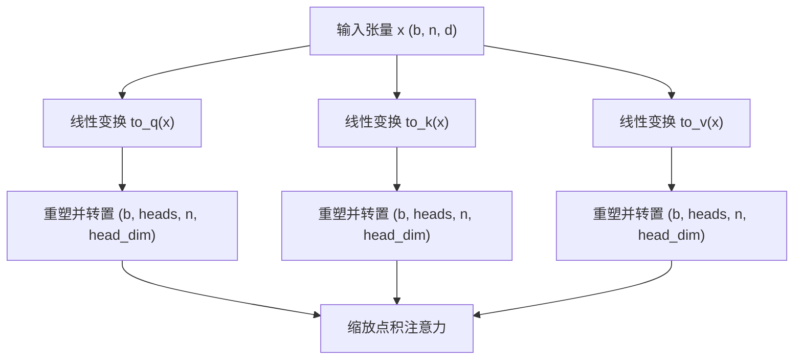
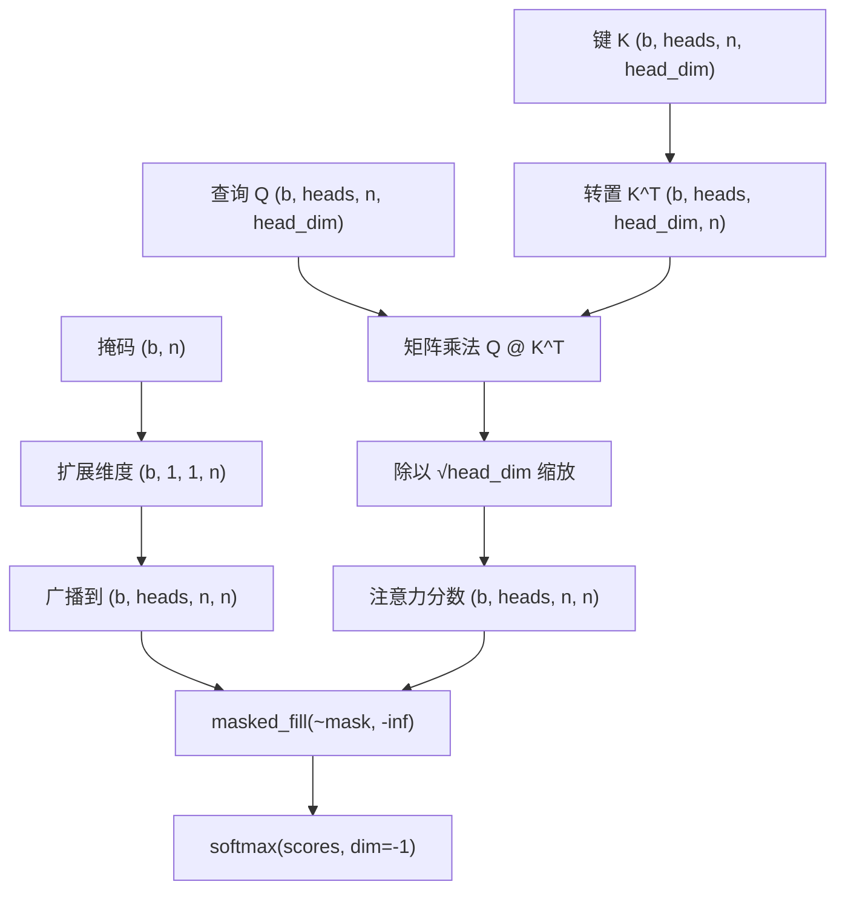
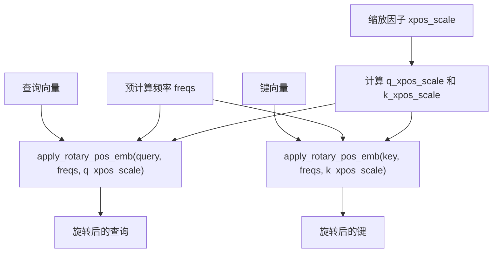
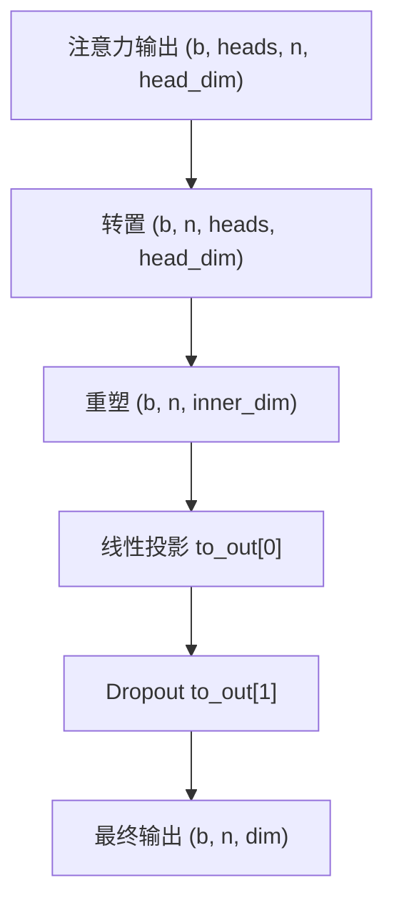
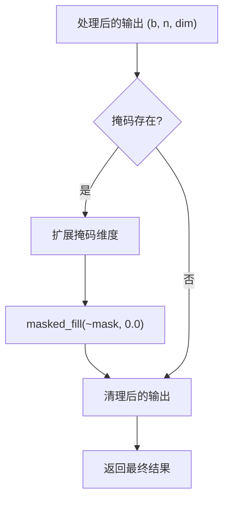

# 注意力机制

<cite>
**本文档中引用的文件**   
- [attention.py](file://cosyvoice/transformer/attention.py)
- [modules.py](file://cosyvoice/flow/DiT/modules.py)
- [mask.py](file://cosyvoice/utils/mask.py)
</cite>

## 目录
1. [引言](#引言)
2. [查询、键、值的线性变换与多头注意力计算](#查询键值的线性变换与多头注意力计算)
3. [注意力分数计算与掩码处理](#注意力分数计算与掩码处理)
4. [RoPE旋转位置编码的实现](#rope旋转位置编码的实现)
5. [输出投影与Dropout集成](#输出投影与dropout集成)
6. [推理阶段的填充处理逻辑](#推理阶段的填充处理逻辑)

## 引言
本文档详细解析CosyVoice项目中注意力机制的实现，重点分析`Attention`类如何通过`AttnProcessor`处理自注意力计算。文档将阐述查询（Q）、键（K）、值（V）的线性变换过程，多头注意力在批量数据上的并行计算方式，`F.scaled_dot_product_attention`函数的应用逻辑，以及RoPE（旋转位置编码）如何通过`apply_rotary_pos_emb`函数注入位置信息。

**Section sources**
- [attention.py](file://cosyvoice/transformer/attention.py#L26-L331)
- [modules.py](file://cosyvoice/flow/DiT/modules.py#L289-L407)

## 查询、键、值的线性变换与多头注意力计算
在`AttnProcessor`类中，输入张量首先通过三个独立的线性层进行投影，分别生成查询（Q）、键（K）和值（V）向量。这一过程通过`to_q`、`to_k`和`to_v`三个`nn.Linear`层实现。线性变换后，张量被重塑并转置，以适应多头注意力的计算需求。具体而言，张量从形状`(batch_size, sequence_length, inner_dim)`被重塑为`(batch_size, sequence_length, heads, head_dim)`，然后通过`transpose(1, 2)`操作将头维度置于第二维，形成`(batch_size, heads, sequence_length, head_dim)`的形状，从而实现多头的并行计算。

**Diagram sources**
- [modules.py](file://cosyvoice/flow/DiT/modules.py#L363-L380)

**Section sources**
- [modules.py](file://cosyvoice/flow/DiT/modules.py#L363-L380)

## 注意力分数计算与掩码处理
注意力分数通过查询（Q）和键（K）的转置进行矩阵乘法计算，并除以`head_dim`的平方根进行缩放。在批处理不同长度的序列时，注意力掩码（mask）用于确保模型不会关注填充（padding）部分。掩码首先被扩展维度，从`(batch_size, sequence_length)`变为`(batch_size, 1, 1, sequence_length)`，然后通过`expand`操作广播到与注意力分数相同的形状`(batch_size, heads, query_length, key_length)`。最后，使用`masked_fill`将掩码为`False`的位置填充为负无穷大，确保这些位置在后续的`softmax`操作中权重为零。

**Diagram sources**
- [modules.py](file://cosyvoice/flow/DiT/modules.py#L383-L389)

**Section sources**
- [modules.py](file://cosyvoice/flow/DiT/modules.py#L383-L391)

## RoPE旋转位置编码的实现
RoPE（Rotary Position Embedding）通过`apply_rotary_pos_emb`函数实现，将绝对位置信息注入到查询和键向量中。该函数接收预计算的频率张量`freqs`和可选的缩放因子`xpos_scale`。在应用时，查询和键向量会分别使用不同的缩放因子（`q_xpos_scale`和`k_xpos_scale`），这有助于模型在处理长序列时保持更好的性能。位置编码通过将查询和键向量与预计算的余弦和正弦频率进行组合，实现了旋转操作，从而在不增加模型参数的情况下编码相对位置信息。

**Diagram sources**
- [modules.py](file://cosyvoice/flow/DiT/modules.py#L367-L373)

**Section sources**
- [modules.py](file://cosyvoice/flow/DiT/modules.py#L367-L373)

## 输出投影与Dropout集成
在注意力计算完成后，输出张量通过`transpose`和`reshape`操作恢复到原始的二维形状`(batch_size, sequence_length, inner_dim)`。随后，该张量被送入由`nn.Linear`和`nn.Dropout`组成的`to_out`模块。线性层将维度从`inner_dim`投影回`dim`，完成输出的维度变换。紧接着，Dropout层以指定的概率随机将部分神经元的输出置零，以防止模型过拟合。这两个操作是顺序执行的，构成了注意力机制的最终输出处理流程。

**Diagram sources**
- [modules.py](file://cosyvoice/flow/DiT/modules.py#L391-L398)

**Section sources**
- [modules.py](file://cosyvoice/flow/DiT/modules.py#L391-L398)

## 推理阶段的填充处理逻辑
在推理阶段，当处理批处理中不同长度的序列时，模型需要正确处理填充部分。在`AttnProcessor`的`__call__`方法末尾，如果提供了掩码，最终的输出张量会再次应用`masked_fill`操作。具体来说，掩码被扩展维度后，用于将输出张量中对应填充位置的值强制置零。这确保了即使在注意力计算中某些填充位置可能获得了非零权重，最终的输出也不会包含这些无效信息，从而保证了模型输出的正确性和一致性。

**Diagram sources**
- [modules.py](file://cosyvoice/flow/DiT/modules.py#L400-L405)

**Section sources**
- [modules.py](file://cosyvoice/flow/DiT/modules.py#L400-L406)