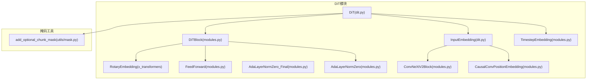
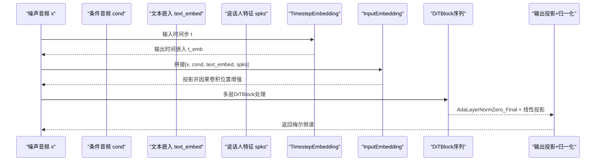
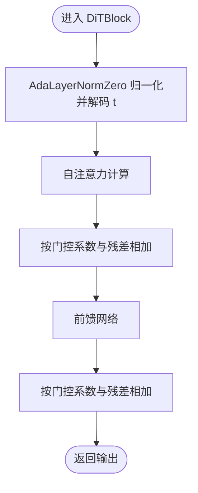
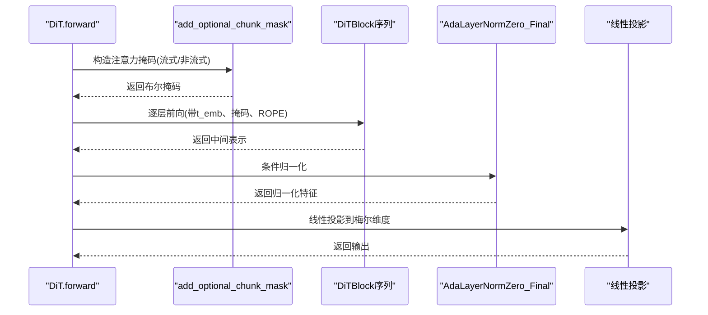
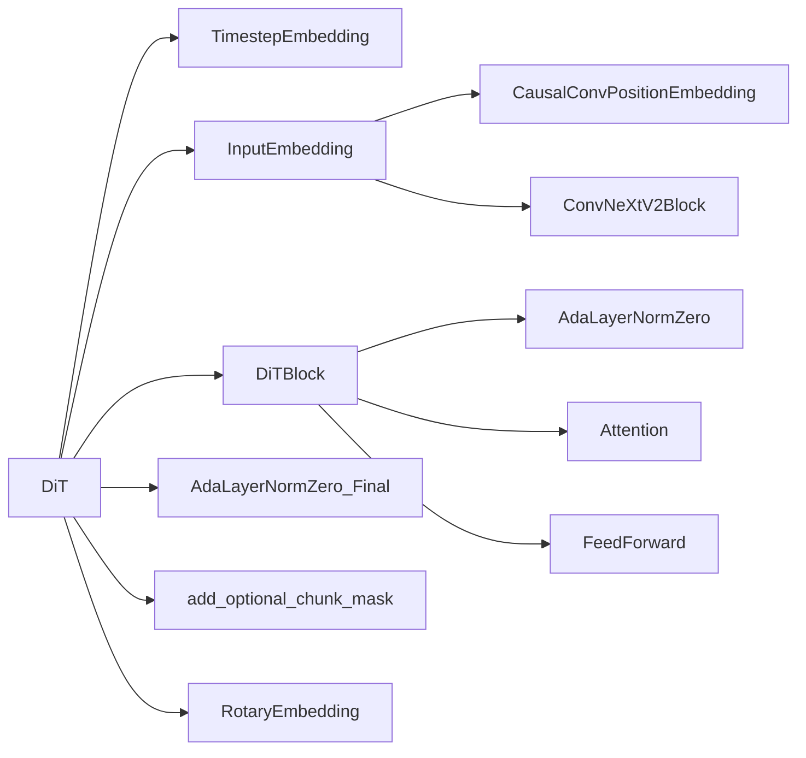

# DiT模型架构

<cite>
**本文引用的文件**
- [cosyvoice/flow/DiT/dit.py](file://cosyvoice/flow/DiT/dit.py)
- [cosyvoice/flow/DiT/modules.py](file://cosyvoice/flow/DiT/modules.py)
- [cosyvoice/utils/mask.py](file://cosyvoice/utils/mask.py)
</cite>

## 目录
1. [引言](#引言)
2. [项目结构](#项目结构)
3. [核心组件](#核心组件)
4. [架构总览](#架构总览)
5. [详细组件分析](#详细组件分析)
6. [依赖关系分析](#依赖关系分析)
7. [性能考量](#性能考量)
8. [故障排查指南](#故障排查指南)
9. [结论](#结论)

## 引言
本文件深入解析 DiT（Diffusion Transformer）模型的架构设计与实现机制，聚焦于如何将扩散过程与 Transformer 架构结合以实现高质量的梅尔频谱生成。文档重点阐述以下关键点：
- 时间步嵌入 TimestepEmbedding 如何将时间步 t 编码为位置信息并参与条件调制；
- 输入嵌入 InputEmbedding 如何融合噪声音频、条件音频、文本嵌入与说话人特征；
- ConvNeXtV2Block 与 CausalConvPositionEmbedding 在特征提取与因果位置建模中的作用；
- DiTBlock 的内部结构：自注意力、前馈网络与自适应层归一化（AdaLayerNormZero_Final）的实现；
- 前向传播中流式推理参数 static_chunk_size 与 num_decoding_left_chunks 通过 add_optional_chunk_mask 控制注意力掩码，实现因果推理；
- 模型前向传播数据流图与 long_skip_connection 残差连接对训练稳定性的意义。

## 项目结构
DiT 模型位于 flow/DiT 目录下，包含两个核心文件：
- dit.py：定义文本嵌入、输入嵌入与 DiT 主干网络；
- modules.py：定义时间步嵌入、注意力、前馈网络、AdaLayerNormZero、ConvNeXtV2Block、CausalConvPositionEmbedding 等模块；
- utils/mask.py：提供 add_optional_chunk_mask 等掩码工具，支持静态分块与动态分块的流式推理。

图表来源
- [cosyvoice/flow/DiT/dit.py](file://cosyvoice/flow/DiT/dit.py#L104-L177)
- [cosyvoice/flow/DiT/modules.py](file://cosyvoice/flow/DiT/modules.py#L230-L617)
- [cosyvoice/utils/mask.py](file://cosyvoice/utils/mask.py#L161-L237)

章节来源
- [cosyvoice/flow/DiT/dit.py](file://cosyvoice/flow/DiT/dit.py#L104-L177)
- [cosyvoice/flow/DiT/modules.py](file://cosyvoice/flow/DiT/modules.py#L195-L617)
- [cosyvoice/utils/mask.py](file://cosyvoice/utils/mask.py#L161-L237)

## 核心组件
- 文本嵌入 TextEmbedding：将字符 token 映射为文本嵌入，并可选地使用 ConvNeXtV2Block 与旋转位置编码进行增强。
- 输入嵌入 InputEmbedding：将噪声音频、条件音频、文本嵌入与说话人特征拼接后投影到统一维度，并通过因果卷积位置嵌入增强局部建模能力。
- DiT 主干 DiT：包含时间步嵌入、输入嵌入、多层 DiTBlock、AdaLayerNormZero_Final 与输出投影。
- 关键模块：Attention、FeedForward、AdaLayerNormZero、AdaLayerNormZero_Final、ConvNeXtV2Block、CausalConvPositionEmbedding、RotaryEmbedding。

章节来源
- [cosyvoice/flow/DiT/dit.py](file://cosyvoice/flow/DiT/dit.py#L33-L100)
- [cosyvoice/flow/DiT/dit.py](file://cosyvoice/flow/DiT/dit.py#L104-L177)
- [cosyvoice/flow/DiT/modules.py](file://cosyvoice/flow/DiT/modules.py#L195-L617)

## 架构总览
DiT 将扩散过程的条件 t 通过 TimestepEmbedding 编码为时间嵌入，随后与输入音频、条件音频、文本嵌入、说话人特征共同进入 InputEmbedding 进行融合与位置增强。主干由若干 DiTBlock 组成，每个 DiTBlock 内部采用预归一化与 AdaLayerNormZero 调制的自注意力，以及前馈网络，最终经 AdaLayerNormZero_Final 与线性层输出梅尔频谱。

图表来源
- [cosyvoice/flow/DiT/dit.py](file://cosyvoice/flow/DiT/dit.py#L145-L177)
- [cosyvoice/flow/DiT/modules.py](file://cosyvoice/flow/DiT/modules.py#L230-L617)

## 详细组件分析

### 时间步嵌入 TimestepEmbedding
- 设计目标：将离散时间步 t 映射为与模型维度一致的时间嵌入，作为条件调制信号参与后续各层。
- 实现要点：
  - 使用 SinusPositionEmbedding 生成频率域位置编码；
  - 通过两层线性网络将频率编码映射到目标维度，并经 SiLU 激活；
  - forward 接收批量时间步张量，返回形状为 [B, D] 的时间嵌入。

章节来源
- [cosyvoice/flow/DiT/modules.py](file://cosyvoice/flow/DiT/modules.py#L606-L617)

### 输入嵌入 InputEmbedding
- 设计目标：将多源输入（噪声音频、条件音频、文本嵌入、说话人特征）融合到统一维度，并引入因果卷积位置嵌入以增强局部建模。
- 实现要点：
  - 可选拼接说话人特征，重复至序列长度；
  - 通过线性层将拼接后的张量投影到统一维度；
  - 使用 CausalConvPositionEmbedding 对投影结果进行因果卷积位置增强，再与原值相加。

章节来源
- [cosyvoice/flow/DiT/dit.py](file://cosyvoice/flow/DiT/dit.py#L76-L99)
- [cosyvoice/flow/DiT/modules.py](file://cosyvoice/flow/DiT/modules.py#L115-L145)

### ConvNeXtV2Block 特征提取
- 设计目标：以深度可分离卷积与全局响应归一化（GRN）提升通道间建模能力，同时保持轻量与高效。
- 实现要点：
  - 7×7 深度卷积，支持膨胀（dilation）以扩大感受野；
  - LayerNorm + 线性逐点卷积（pwconv1/pwconv2） + GELU + GRN；
  - 残差连接，保证梯度稳定与信息保留。

章节来源
- [cosyvoice/flow/DiT/modules.py](file://cosyvoice/flow/DiT/modules.py#L195-L224)

### CausalConvPositionEmbedding 因果位置建模
- 设计目标：在不泄漏未来信息的前提下，利用因果卷积对序列局部结构进行建模，适配流式推理。
- 实现要点：
  - 两次卷积，padding 设置为仅向左填充，确保因果性；
  - 使用 Mish 激活与掩码处理，避免填充区域影响。

章节来源
- [cosyvoice/flow/DiT/modules.py](file://cosyvoice/flow/DiT/modules.py#L115-L145)

### DiTBlock 内部结构
- 结构组成：预归一化 + AdaLayerNormZero 调制的自注意力；前馈网络；残差连接。
- 关键流程：
  - AdaLayerNormZero 对输入进行归一化并从时间嵌入 t 中解码出 shift/scale/gate 参数；
  - 自注意力计算后按门控系数与残差相加；
  - 前馈网络在调制后的归一化特征上执行，同样以门控系数与残差相加；
  - 该设计遵循预归一化与条件调制，有利于训练稳定与表达力。

图表来源
- [cosyvoice/flow/DiT/modules.py](file://cosyvoice/flow/DiT/modules.py#L500-L531)

章节来源
- [cosyvoice/flow/DiT/modules.py](file://cosyvoice/flow/DiT/modules.py#L500-L531)

### AdaLayerNormZero 与 AdaLayerNormZero_Final
- AdaLayerNormZero：从时间嵌入 t 解码出自注意力与前馈网络的 shift/scale/gate 参数，分别用于缩放、平移与门控；
- AdaLayerNormZero_Final：仅用于最终层，解码出缩放与平移参数，对输出进行条件归一化。

章节来源
- [cosyvoice/flow/DiT/modules.py](file://cosyvoice/flow/DiT/modules.py#L230-L266)

### DiT 主干网络 DiT 的前向传播
- 数据流：
  - 输入张量在进入主干前进行维度转置；
  - 计算时间嵌入 t_emb；
  - 通过 InputEmbedding 融合多源输入并进行因果卷积位置增强；
  - 计算旋转位置编码（RotaryEmbedding）；
  - 根据 streaming 参数选择掩码策略：
    - 流式推理：使用 add_optional_chunk_mask 并设置 static_chunk_size 与 num_decoding_left_chunks；
    - 非流式推理：使用全序列掩码；
  - 逐层通过 DiTBlock，每层接收 t_emb、掩码与旋转位置编码；
  - 可选 long_skip_connection：将残差与当前输出拼接后经线性层融合；
  - 最终经 AdaLayerNormZero_Final 与线性层投影回梅尔维度并转置输出。

图表来源
- [cosyvoice/flow/DiT/dit.py](file://cosyvoice/flow/DiT/dit.py#L145-L177)
- [cosyvoice/utils/mask.py](file://cosyvoice/utils/mask.py#L161-L237)

章节来源
- [cosyvoice/flow/DiT/dit.py](file://cosyvoice/flow/DiT/dit.py#L145-L177)

### 流式推理掩码控制与因果性
- add_optional_chunk_mask 支持两种模式：
  - 动态分块：根据 decoding_chunk_size 或随机采样确定分块大小，限制注意力覆盖范围；
  - 静态分块：固定 static_chunk_size，配合 num_decoding_left_chunks 控制左侧可见窗口；
- 在流式推理中，掩码会限制当前位置只能关注到其左侧有限范围，从而实现因果推理，避免信息泄漏。

章节来源
- [cosyvoice/utils/mask.py](file://cosyvoice/utils/mask.py#L161-L237)

### long_skip_connection 残差连接
- 当启用 long_skip_connection 时，主干在进入 DiTBlock 序列前保存初始输入 x 的残差，最终将输出与残差拼接并通过线性层融合；
- 该设计有助于缓解深层网络的梯度消失问题，提升训练稳定性与收敛速度。

章节来源
- [cosyvoice/flow/DiT/dit.py](file://cosyvoice/flow/DiT/dit.py#L134-L138)

## 依赖关系分析
- DiT 依赖：
  - TimestepEmbedding：提供时间步条件；
  - InputEmbedding：融合多源输入并进行因果位置增强；
  - DiTBlock：堆叠的 Transformer 层，包含自注意力与前馈网络；
  - AdaLayerNormZero_Final：最终层条件归一化；
  - add_optional_chunk_mask：流式推理掩码生成；
  - RotaryEmbedding：旋转位置编码。
- 模块间耦合：
  - DiTBlock 与 AdaLayerNormZero/Attention/FeedForward 高内聚；
  - InputEmbedding 与 CausalConvPositionEmbedding、ConvNeXtV2Block 存在线性组合关系；
  - DiT 与掩码工具通过 add_optional_chunk_mask 解耦。

图表来源
- [cosyvoice/flow/DiT/dit.py](file://cosyvoice/flow/DiT/dit.py#L104-L177)
- [cosyvoice/flow/DiT/modules.py](file://cosyvoice/flow/DiT/modules.py#L195-L617)
- [cosyvoice/utils/mask.py](file://cosyvoice/utils/mask.py#L161-L237)

## 性能考量
- 计算复杂度：
  - 自注意力复杂度近似 O(N^2·D)，其中 N 为序列长度，D 为隐藏维度；
  - DiTBlock 中的前馈网络复杂度近似 O(N·D^2)；
  - 长序列下，掩码与旋转位置编码的开销相对较小。
- 内存与吞吐：
  - 静态分块掩码可减少注意力计算范围，降低显存占用；
  - ConvNeXtV2Block 与因果卷积位置嵌入均为轻量模块，适合实时推理。
- 训练稳定性：
  - 预归一化与 AdaLayerNormZero 调制有助于稳定深层网络训练；
  - long_skip_connection 提升残差流动，缓解梯度问题。

## 故障排查指南
- 注意力掩码全为 False：
  - 若出现掩码全为 False 的情况，掩码工具会强制将其置为 True，以避免未来计算中的屏蔽错误。若频繁出现，检查输入 mask 与分块参数配置。
- 流式推理延迟过大：
  - 调整 static_chunk_size 与 num_decoding_left_chunks，平衡延迟与稳定性；
  - 确保输入序列长度与掩码长度一致，避免广播或索引越界。
- 归一化异常：
  - 确认 AdaLayerNormZero/AdaLayerNormZero_Final 的输入维度与时间嵌入维度匹配；
  - 检查 SiLU/Linear 层权重初始化是否正常。

章节来源
- [cosyvoice/utils/mask.py](file://cosyvoice/utils/mask.py#L231-L236)

## 结论
DiT 通过将扩散过程的时间步条件与 Transformer 的自注意力机制有机结合，实现了高质量的梅尔频谱生成。TimestepEmbedding 将时间步编码为条件信号，InputEmbedding 融合多源输入并引入因果位置增强，DiTBlock 则以预归一化与 AdaLayerNormZero 调制保障训练稳定性。流式推理通过 add_optional_chunk_mask 与静态分块掩码实现因果约束，long_skip_connection 进一步提升训练稳定性。整体架构在保持高效与可扩展的同时，具备良好的工程落地性。