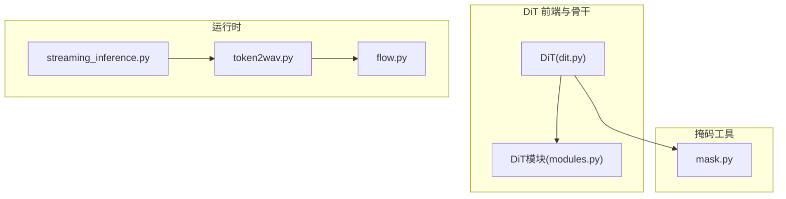
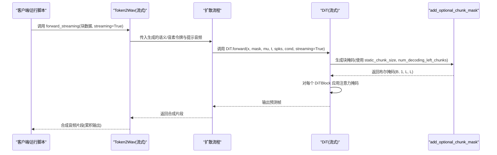
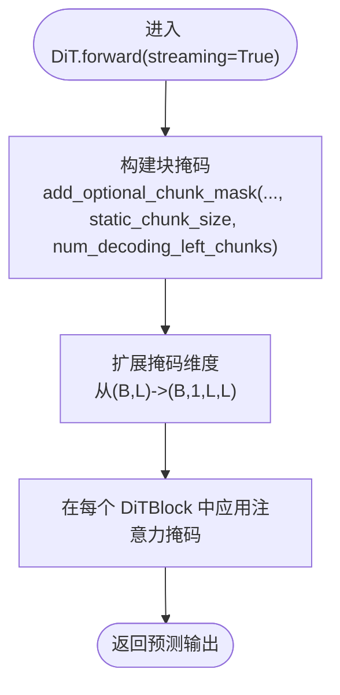
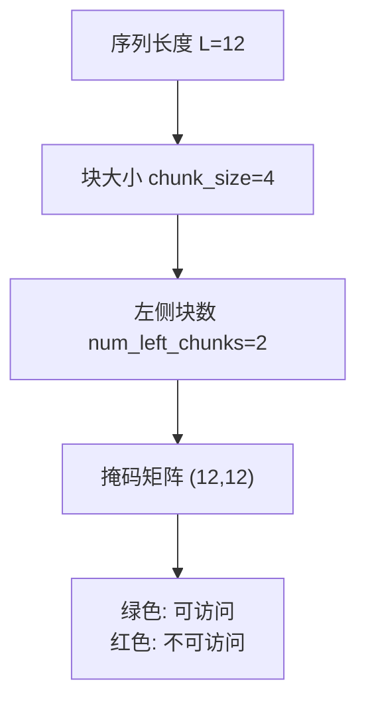
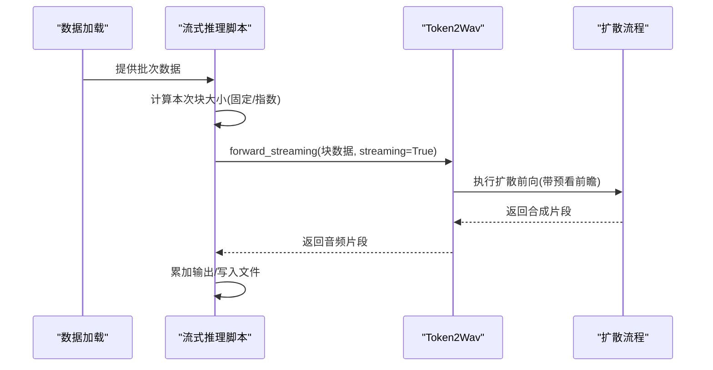
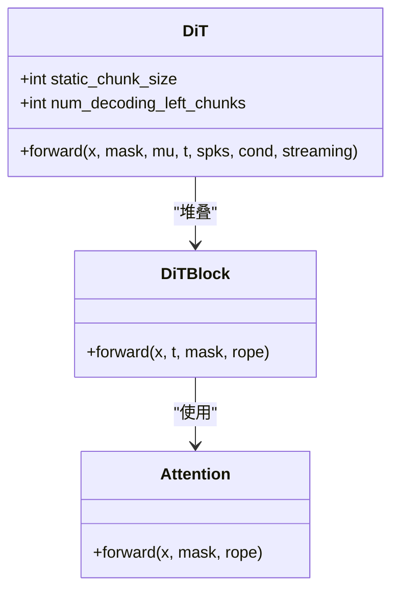
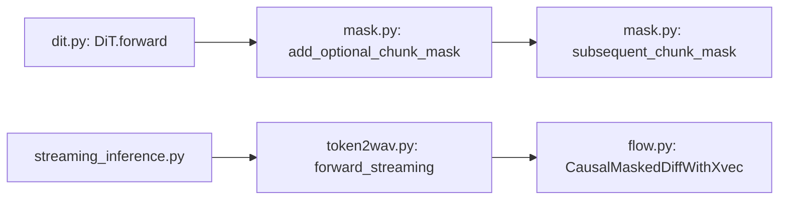

# 流式推理机制

<cite>
**本文引用的文件**
- [cosyvoice/flow/DiT/dit.py](file://cosyvoice/flow/DiT/dit.py)
- [cosyvoice/flow/DiT/modules.py](file://cosyvoice/flow/DiT/modules.py)
- [cosyvoice/utils/mask.py](file://cosyvoice/utils/mask.py)
- [runtime/triton_trtllm/streaming_inference.py](file://runtime/triton_trtllm/streaming_inference.py)
- [runtime/triton_trtllm/token2wav.py](file://runtime/triton_trtllm/token2wav.py)
- [cosyvoice/flow/flow.py](file://cosyvoice/flow/flow.py)
</cite>

## 目录
1. [引言](#引言)
2. [项目结构](#项目结构)
3. [核心组件](#核心组件)
4. [架构总览](#架构总览)
5. [详细组件分析](#详细组件分析)
6. [依赖关系分析](#依赖关系分析)
7. [性能考量](#性能考量)
8. [故障排查指南](#故障排查指南)
9. [结论](#结论)

## 引言
本文件系统化阐述 CosyVoice 中 DiT 模型在流式推理场景下的实现与工作机制，重点解析两个关键参数：
- static_chunk_size：定义处理的静态块大小
- num_decoding_left_chunks：指定保留的左侧上下文块数

结合 add_optional_chunk_mask 函数，说明在 streaming=True 模式下，如何生成因果注意力掩码，确保模型仅依赖当前块及有限的过去信息，从而实现低延迟的实时语音合成。文档还提供掩码生成的可视化示例，并讨论该机制对合成语音自然度与实时性的综合影响。

## 项目结构
围绕流式推理的关键代码分布在以下模块：
- DiT 前端与骨干网络：cosyvoice/flow/DiT/dit.py、cosyvoice/flow/DiT/modules.py
- 掩码工具：cosyvoice/utils/mask.py
- 运行时流式推理示例：runtime/triton_trtllm/streaming_inference.py
- Token2Wav 端到端管线（包含流式调用）：runtime/triton_trtllm/token2wav.py
- 扩散流程（含预看前瞻长度等）：cosyvoice/flow/flow.py

**图表来源**
- [cosyvoice/flow/DiT/dit.py](file://cosyvoice/flow/DiT/dit.py#L145-L176)
- [cosyvoice/flow/DiT/modules.py](file://cosyvoice/flow/DiT/modules.py#L498-L601)
- [cosyvoice/utils/mask.py](file://cosyvoice/utils/mask.py#L161-L236)
- [runtime/triton_trtllm/streaming_inference.py](file://runtime/triton_trtllm/streaming_inference.py#L40-L123)
- [runtime/triton_trtllm/token2wav.py](file://runtime/triton_trtllm/token2wav.py#L93-L126)
- [cosyvoice/flow/flow.py](file://cosyvoice/flow/flow.py#L148-L171)

**章节来源**
- [cosyvoice/flow/DiT/dit.py](file://cosyvoice/flow/DiT/dit.py#L145-L176)
- [cosyvoice/utils/mask.py](file://cosyvoice/utils/mask.py#L161-L236)
- [runtime/triton_trtllm/streaming_inference.py](file://runtime/triton_trtllm/streaming_inference.py#L40-L123)
- [runtime/triton_trtllm/token2wav.py](file://runtime/triton_trtllm/token2wav.py#L93-L126)
- [cosyvoice/flow/flow.py](file://cosyvoice/flow/flow.py#L148-L171)

## 核心组件
- DiT 前端与骨干网络
  - TextEmbedding：文本嵌入与可选卷积建模
  - InputEmbedding：将噪声输入、条件、文本嵌入与说话人特征拼接并加入因果卷积位置编码
  - DiT：多层 DiTBlock 变换器，支持长跳跃连接；在 forward 中根据 streaming 参数生成注意力掩码
- 掩码工具
  - subsequent_chunk_mask/subsequent_chunk_mask_deprecated：按块生成后续块掩码
  - add_optional_chunk_mask：根据 use_dynamic_chunk/static_chunk_size/num_decoding_left_chunks 等参数选择性应用块掩码，并与序列填充掩码相交
- 运行时流式推理
  - streaming_inference.py：演示以固定或指数增长策略进行分块推理，调用 token2wav 的 forward_streaming
  - token2wav.py：CosyVoice2_Token2Wav 封装扩散流程与声码器，支持 streaming=True 的流式推理
- 扩散流程
  - flow.py：CausalMaskedDiffWithXvec 定义输出类型、词表大小、帧率、预看前瞻长度等，为流式推理提供上下文

**章节来源**
- [cosyvoice/flow/DiT/dit.py](file://cosyvoice/flow/DiT/dit.py#L104-L176)
- [cosyvoice/flow/DiT/modules.py](file://cosyvoice/flow/DiT/modules.py#L498-L601)
- [cosyvoice/utils/mask.py](file://cosyvoice/utils/mask.py#L89-L236)
- [runtime/triton_trtllm/streaming_inference.py](file://runtime/triton_trtllm/streaming_inference.py#L40-L123)
- [runtime/triton_trtllm/token2wav.py](file://runtime/triton_trtllm/token2wav.py#L93-L126)
- [cosyvoice/flow/flow.py](file://cosyvoice/flow/flow.py#L148-L171)

## 架构总览
下面的序列图展示了在 streaming=True 模式下，DiT 如何基于 static_chunk_size 与 num_decoding_left_chunks 生成因果注意力掩码，并在每步推理中限制可见的历史范围，从而实现低延迟实时合成。

**图表来源**
- [cosyvoice/flow/DiT/dit.py](file://cosyvoice/flow/DiT/dit.py#L145-L176)
- [cosyvoice/utils/mask.py](file://cosyvoice/utils/mask.py#L161-L236)
- [runtime/triton_trtllm/streaming_inference.py](file://runtime/triton_trtllm/streaming_inference.py#L74-L103)
- [runtime/triton_trtllm/token2wav.py](file://runtime/triton_trtllm/token2wav.py#L93-L126)

## 详细组件分析

### DiT 在流式推理中的掩码生成
- 关键点
  - streaming=True 时，DiT.forward 使用 add_optional_chunk_mask 生成块掩码，并扩展为四维用于注意力
  - static_chunk_size 决定块大小，num_decoding_left_chunks 决定保留的左侧历史块数量
  - 掩码与序列填充掩码相交，保证填充位置不被访问
- 影响
  - 降低注意力计算范围，显著减少延迟与内存占用
  - 通过限制可见历史，避免远距离依赖导致的伪影，提升实时性与稳定性

**图表来源**
- [cosyvoice/flow/DiT/dit.py](file://cosyvoice/flow/DiT/dit.py#L145-L176)
- [cosyvoice/utils/mask.py](file://cosyvoice/utils/mask.py#L161-L236)

**章节来源**
- [cosyvoice/flow/DiT/dit.py](file://cosyvoice/flow/DiT/dit.py#L145-L176)
- [cosyvoice/utils/mask.py](file://cosyvoice/utils/mask.py#L161-L236)

### 掩码生成算法与可视化
- subsequent_chunk_mask
  - 输入：序列长度 L、块大小 chunk_size、左侧块数 num_left_chunks
  - 输出：(L, L) 布尔掩码，表示每个位置能看到的范围
  - 特性：对每个查询位置 i，允许看到从 max(i//chunk_size - num_left_chunks, 0)*chunk_size 到 (i//chunk_size+1)*chunk_size 的所有位置
- add_optional_chunk_mask
  - 当 use_dynamic_chunk=True 时，按 decoding_chunk_size 或随机策略生成掩码
  - 当 static_chunk_size > 0 时，直接使用固定块大小与 num_decoding_left_chunks
  - 最终与序列填充掩码相交，确保填充位置不可见

掩码可视化（以 L=12, chunk_size=4, num_left_chunks=2 为例）：
- 行索引代表当前查询位置 i
- 列索引代表可访问的键位置
- 绿色区域表示可访问，红色区域表示不可访问

说明：
- 每个块宽 4，左侧保留 2 个完整块，右侧包含当前块
- 对于第 i 行，允许访问区间为 [max(0, (i//4 - 2)*4), min(12, (i//4 + 1)*4))

**图表来源**
- [cosyvoice/utils/mask.py](file://cosyvoice/utils/mask.py#L127-L159)
- [cosyvoice/utils/mask.py](file://cosyvoice/utils/mask.py#L161-L236)

**章节来源**
- [cosyvoice/utils/mask.py](file://cosyvoice/utils/mask.py#L127-L159)
- [cosyvoice/utils/mask.py](file://cosyvoice/utils/mask.py#L161-L236)

### 运行时流式推理策略
- streaming_inference.py
  - 以固定 CHUNK_SIZE 或指数增长策略切分生成令牌
  - 通过 token2wav_model.forward_streaming 实现分块推理
  - 末端块设置 is_last=True，触发最终输出
- token2wav.py
  - CosyVoice2_Token2Wav 支持 streaming=True 的流式推理路径
  - 预看前瞻长度 pre_lookahead_len 由扩散流程提供，影响提前量与首包延迟

**图表来源**
- [runtime/triton_trtllm/streaming_inference.py](file://runtime/triton_trtllm/streaming_inference.py#L74-L103)
- [runtime/triton_trtllm/token2wav.py](file://runtime/triton_trtllm/token2wav.py#L93-L126)
- [cosyvoice/flow/flow.py](file://cosyvoice/flow/flow.py#L148-L171)

**章节来源**
- [runtime/triton_trtllm/streaming_inference.py](file://runtime/triton_trtllm/streaming_inference.py#L40-L123)
- [runtime/triton_trtllm/token2wav.py](file://runtime/triton_trtllm/token2wav.py#L93-L126)
- [cosyvoice/flow/flow.py](file://cosyvoice/flow/flow.py#L148-L171)

### DiT 类与注意力掩码的关系
- DiTBlock/Attention
  - DiTBlock 内部使用 AdaLayerNormZero 与注意力子层
  - Attention 的前向中，若提供 mask，则将其扩展为注意力掩码并参与 scaled_dot_product_attention
- 在流式中，DiT.forward 将块掩码传入 Attention，确保自回归因果性与局部性

**图表来源**
- [cosyvoice/flow/DiT/dit.py](file://cosyvoice/flow/DiT/dit.py#L104-L176)
- [cosyvoice/flow/DiT/modules.py](file://cosyvoice/flow/DiT/modules.py#L498-L601)

**章节来源**
- [cosyvoice/flow/DiT/dit.py](file://cosyvoice/flow/DiT/dit.py#L104-L176)
- [cosyvoice/flow/DiT/modules.py](file://cosyvoice/flow/DiT/modules.py#L498-L601)

## 依赖关系分析
- DiT.forward 依赖 add_optional_chunk_mask 生成块掩码
- add_optional_chunk_mask 依赖 subsequent_chunk_mask/subsequent_chunk_mask_deprecated
- 运行时脚本 streaming_inference.py 通过 token2wav.py 的 forward_streaming 触发流式推理
- 扩散流程 flow.py 提供预看前瞻长度等配置，影响首包延迟与合成质量

**图表来源**
- [cosyvoice/flow/DiT/dit.py](file://cosyvoice/flow/DiT/dit.py#L145-L176)
- [cosyvoice/utils/mask.py](file://cosyvoice/utils/mask.py#L127-L236)
- [runtime/triton_trtllm/streaming_inference.py](file://runtime/triton_trtllm/streaming_inference.py#L74-L103)
- [runtime/triton_trtllm/token2wav.py](file://runtime/triton_trtllm/token2wav.py#L93-L126)
- [cosyvoice/flow/flow.py](file://cosyvoice/flow/flow.py#L148-L171)

**章节来源**
- [cosyvoice/flow/DiT/dit.py](file://cosyvoice/flow/DiT/dit.py#L145-L176)
- [cosyvoice/utils/mask.py](file://cosyvoice/utils/mask.py#L127-L236)
- [runtime/triton_trtllm/streaming_inference.py](file://runtime/triton_trtllm/streaming_inference.py#L74-L103)
- [runtime/triton_trtllm/token2wav.py](file://runtime/triton_trtllm/token2wav.py#L93-L126)
- [cosyvoice/flow/flow.py](file://cosyvoice/flow/flow.py#L148-L171)

## 性能考量
- static_chunk_size
  - 更大的块可提升吞吐但增加延迟；更小的块降低延迟但可能增加注意力开销
  - 与 num_decoding_left_chunks 协同决定可见历史范围
- num_decoding_left_chunks
  - 增大可提升长程依赖建模能力，但会增大注意力窗口与显存占用
  - 过小可能导致回音或伪影
- 预看前瞻长度 pre_lookahead_len
  - 来自扩散流程配置，影响首包延迟与合成起始稳定性
- 运行时策略
  - 固定块大小适合稳定延迟目标；指数增长策略可在早期快速出声，后期稳定输出

[本节为通用性能建议，无需特定文件引用]

## 故障排查指南
- 掩码全假风险
  - add_optional_chunk_mask 在某些时间步可能出现全假掩码，代码会强制置为真以避免未来计算错误
  - 若出现异常，检查输入序列长度与块大小是否合理
- 填充掩码未正确传递
  - 确保传入的 mask 与序列长度一致，避免注意力访问到填充区域
- 流式参数设置不当
  - static_chunk_size 与 num_decoding_left_chunks 过大可能导致显存不足
  - 过小可能导致合成不稳定或伪影
- 首包延迟问题
  - 检查扩散流程的 pre_lookahead_len 与 token2wav 的流式调用策略

**章节来源**
- [cosyvoice/utils/mask.py](file://cosyvoice/utils/mask.py#L231-L236)
- [runtime/triton_trtllm/streaming_inference.py](file://runtime/triton_trtllm/streaming_inference.py#L74-L103)
- [runtime/triton_trtllm/token2wav.py](file://runtime/triton_trtllm/token2wav.py#L93-L126)
- [cosyvoice/flow/flow.py](file://cosyvoice/flow/flow.py#L148-L171)

## 结论
通过 static_chunk_size 与 num_decoding_left_chunks 的协同配置，DiT 在 streaming=True 模式下能够以块掩码约束注意力可见范围，实现低延迟、低内存占用的实时语音合成。add_optional_chunk_mask 将块掩码与填充掩码融合，确保因果性与稳定性。运行时脚本与 Token2Wav 的流式接口进一步验证了该机制在端到端管线中的可行性。实践中应根据硬件资源与延迟目标平衡块大小与历史保留数量，并结合预看前瞻长度优化首包延迟与整体体验。