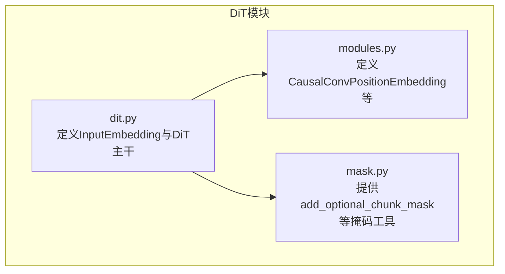
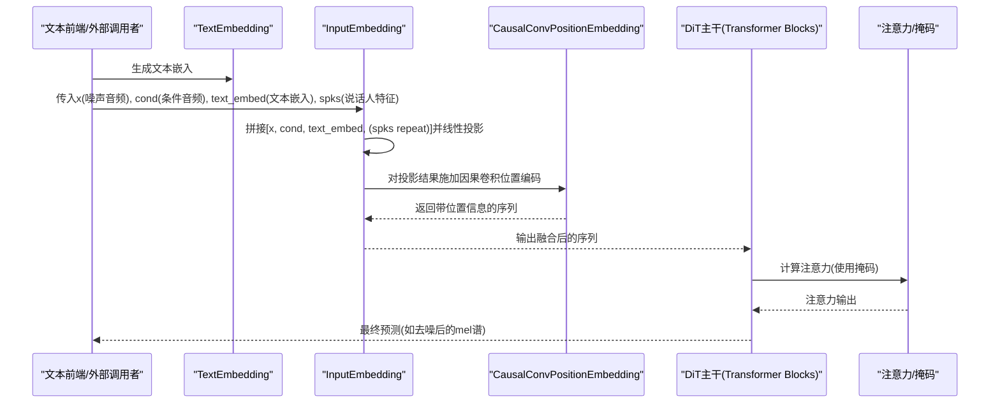
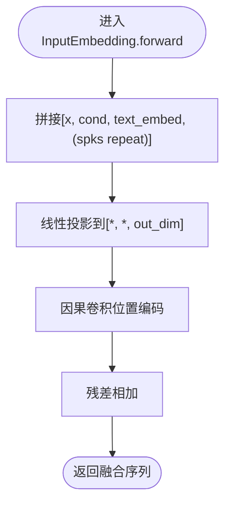
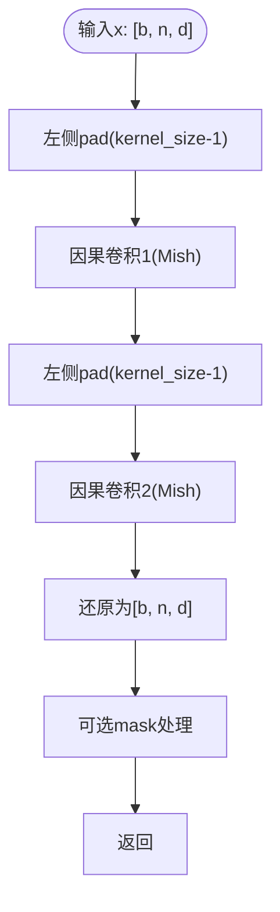
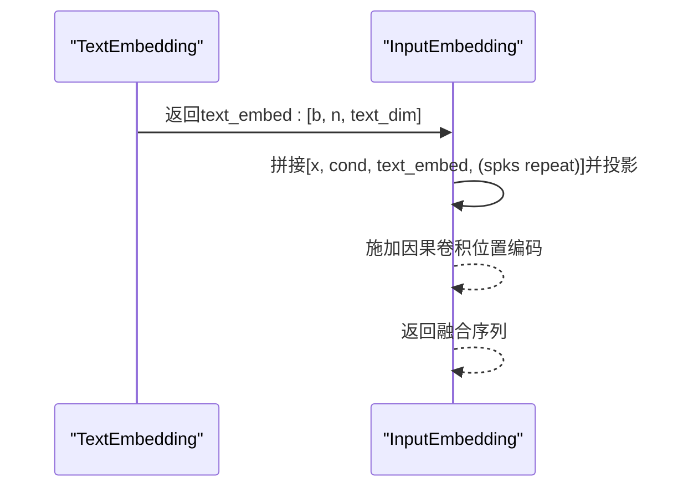
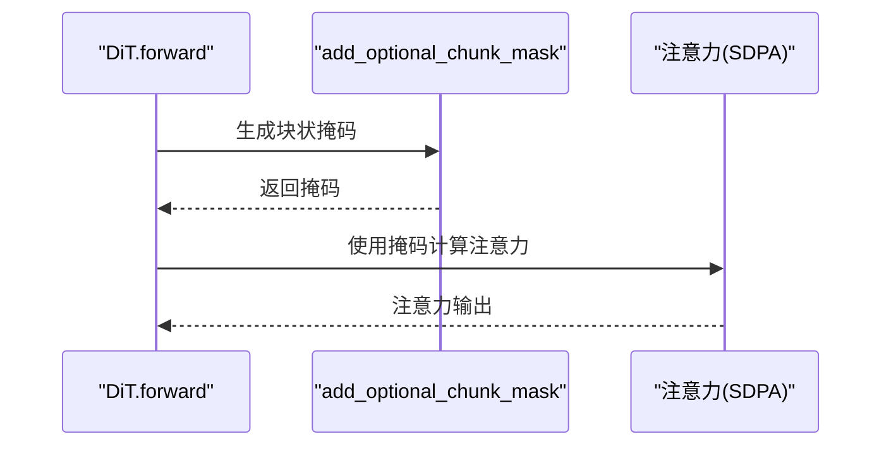
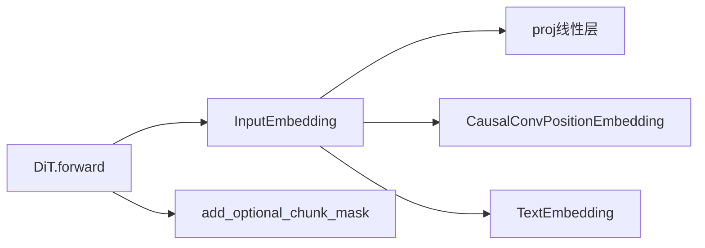

# 输入嵌入模块

<cite>
**本文引用的文件**
- [dit.py](file://cosyvoice/flow/DiT/dit.py)
- [modules.py](file://cosyvoice/flow/DiT/modules.py)
- [mask.py](file://cosyvoice/utils/mask.py)
</cite>

## 目录
1. [简介](#简介)
2. [项目结构](#项目结构)
3. [核心组件](#核心组件)
4. [架构总览](#架构总览)
5. [详细组件分析](#详细组件分析)
6. [依赖关系分析](#依赖关系分析)
7. [性能考量](#性能考量)
8. [故障排查指南](#故障排查指南)
9. [结论](#结论)

## 简介
本文聚焦于DiT模型中的输入嵌入模块InputEmbedding，系统阐述其如何融合三类或多类输入特征：噪声音频、条件音频、文本嵌入与说话人特征，并将其统一映射到隐空间；同时解释proj线性层如何将多源特征拼接后的维度（mel_dim*2 + text_dim + spk_dim）投影到统一隐空间维度；以及CausalConvPositionEmbedding如何通过因果卷积为序列添加位置信息，从而在流式推理场景下保证时间上的因果性，避免未来信息泄露。此外，本文还分析InputEmbedding与TextEmbedding的协同工作机制，并给出输入张量形状变换的详细说明。

## 项目结构
围绕输入嵌入模块的相关文件主要位于flow/DiT目录，配合掩码工具mask.py用于流式推理时的注意力掩码构建。

图表来源
- [dit.py](file://cosyvoice/flow/DiT/dit.py#L76-L177)
- [modules.py](file://cosyvoice/flow/DiT/modules.py#L115-L145)
- [mask.py](file://cosyvoice/utils/mask.py#L161-L237)

章节来源
- [dit.py](file://cosyvoice/flow/DiT/dit.py#L76-L177)
- [modules.py](file://cosyvoice/flow/DiT/modules.py#L115-L145)
- [mask.py](file://cosyvoice/utils/mask.py#L161-L237)

## 核心组件
- InputEmbedding：负责将噪声音频、条件音频、文本嵌入与说话人特征拼接后经线性层投影到统一隐空间，并叠加因果卷积位置编码。
- CausalConvPositionEmbedding：基于因果卷积对序列进行位置增强，确保未来信息不泄露。
- TextEmbedding：生成文本嵌入，供InputEmbedding融合使用。
- 掩码工具add_optional_chunk_mask：在流式推理中构造块状注意力掩码，限制注意力范围以维持因果性。

章节来源
- [dit.py](file://cosyvoice/flow/DiT/dit.py#L76-L177)
- [modules.py](file://cosyvoice/flow/DiT/modules.py#L115-L145)
- [mask.py](file://cosyvoice/utils/mask.py#L161-L237)

## 架构总览
下面的图展示了InputEmbedding在DiT前向流程中的位置与作用，以及与TextEmbedding、掩码工具的关系。

图表来源
- [dit.py](file://cosyvoice/flow/DiT/dit.py#L76-L177)
- [modules.py](file://cosyvoice/flow/DiT/modules.py#L115-L145)
- [mask.py](file://cosyvoice/utils/mask.py#L161-L237)

## 详细组件分析

### InputEmbedding类
- 功能概述
  - 融合多源输入：将噪声音频x、条件音频cond、文本嵌入text_embed与说话人特征spks按通道维拼接。
  - 维度投影：通过proj线性层将拼接后的维度(mel_dim*2 + text_dim + spk_dim)映射到统一隐空间维度out_dim。
  - 位置增强：对投影结果施加CausalConvPositionEmbedding，引入因果卷积位置编码，叠加残差。
- 关键点
  - 当spk_dim>0时，将说话人特征重复扩展到序列长度，再与x、cond、text_embed拼接。
  - 输出保持序列长度不变，仅改变通道维至out_dim。
- 形状变换要点
  - 输入：x、cond、text_embed均为[b, n, d]，spks为[b, d_spk]。
  - 拼接后：[b, n, mel_dim*2 + text_dim + spk_dim]。
  - 投影后：[b, n, out_dim]。
  - 因果卷积位置编码后：[b, n, out_dim]（残差相加）。

图表来源
- [dit.py](file://cosyvoice/flow/DiT/dit.py#L84-L98)

章节来源
- [dit.py](file://cosyvoice/flow/DiT/dit.py#L76-L99)

### CausalConvPositionEmbedding类
- 功能概述
  - 使用奇数核大小的因果卷积对序列进行双向卷积，确保每个时间步仅依赖过去及当前时刻的信息。
  - 通过padding策略与两次卷积堆叠，增强位置建模能力。
- 关键点
  - 卷积采用分组卷积，激活使用Mish。
  - forward中对mask进行处理，保证填充位置不影响卷积结果。
- 在流式推理中的因果性保障
  - 由于卷积padding设置为从左到右，且使用F.pad在左侧增加padding，使得当前步只看到历史信息，满足因果性要求。

图表来源
- [modules.py](file://cosyvoice/flow/DiT/modules.py#L115-L145)

章节来源
- [modules.py](file://cosyvoice/flow/DiT/modules.py#L115-L145)

### 与TextEmbedding的协同机制
- 文本嵌入生成
  - TextEmbedding根据文本token生成[b, n, text_dim]的文本嵌入，必要时叠加旋转位置编码与ConvNeXtV2块。
- 融合时机
  - 在DiT前向中，先由TextEmbedding生成text_embed，随后由InputEmbedding将其与x、cond、spks融合。
- 形状一致性
  - text_embed与x、cond在序列长度上需一致，通常通过文本token长度裁剪或填充到mel序列长度。

图表来源
- [dit.py](file://cosyvoice/flow/DiT/dit.py#L33-L71)
- [dit.py](file://cosyvoice/flow/DiT/dit.py#L76-L99)

章节来源
- [dit.py](file://cosyvoice/flow/DiT/dit.py#L33-L71)
- [dit.py](file://cosyvoice/flow/DiT/dit.py#L76-L99)

### 流式推理中的因果性保障
- 注意力掩码
  - DiT在forward中根据streaming参数选择不同的掩码策略，通过add_optional_chunk_mask生成块状掩码，限制注意力仅关注当前块及左侧块，避免未来信息泄露。
- 因果卷积
  - InputEmbedding内部的CausalConvPositionEmbedding进一步确保序列位置信息的因果性，避免卷积核在右侧产生信息泄漏。
- 二者协同
  - 掩码工具负责全局注意力的因果约束，因果卷积负责局部位置建模的因果约束，共同保证流式推理的稳定性与正确性。

图表来源
- [dit.py](file://cosyvoice/flow/DiT/dit.py#L145-L177)
- [mask.py](file://cosyvoice/utils/mask.py#L161-L237)

章节来源
- [dit.py](file://cosyvoice/flow/DiT/dit.py#L145-L177)
- [mask.py](file://cosyvoice/utils/mask.py#L161-L237)

## 依赖关系分析
- InputEmbedding依赖
  - proj线性层：将多源拼接特征映射到统一隐空间。
  - CausalConvPositionEmbedding：为序列添加因果卷积位置信息。
  - TextEmbedding：提供文本嵌入，参与融合。
- 掩码工具依赖
  - add_optional_chunk_mask：在流式推理中生成块状掩码，与注意力机制配合实现因果性。
- 外部依赖
  - x_transformers.RotaryEmbedding：用于旋转位置编码（在DiT主干中使用），与InputEmbedding无直接耦合，但共同提升序列表示质量。

图表来源
- [dit.py](file://cosyvoice/flow/DiT/dit.py#L76-L177)
- [modules.py](file://cosyvoice/flow/DiT/modules.py#L115-L145)
- [mask.py](file://cosyvoice/utils/mask.py#L161-L237)

章节来源
- [dit.py](file://cosyvoice/flow/DiT/dit.py#L76-L177)
- [modules.py](file://cosyvoice/flow/DiT/modules.py#L115-L145)
- [mask.py](file://cosyvoice/utils/mask.py#L161-L237)

## 性能考量
- 线性层投影成本
  - proj为全连接层，参数规模与拼接维度成正比。在多源融合时，应合理控制mel_dim、text_dim、spk_dim，避免显存与计算开销过大。
- 因果卷积代价
  - 两次因果卷积与Mish激活带来额外计算，但能有效提升位置建模能力。核大小与分组数影响吞吐与延迟，可根据硬件条件权衡。
- 掩码开销
  - add_optional_chunk_mask在流式推理中会生成块状掩码，注意掩码广播与内存占用，避免不必要的重复计算。
- 推理加速建议
  - 在部署侧可结合JIT/ONNX/TensorRT等优化手段，减少前向调用开销。
  - 合理设置static_chunk_size与num_decoding_left_chunks，平衡延迟与稳定性。

## 故障排查指南
- 形状不匹配
  - 现象：拼接时报错或维度不一致。
  - 排查：确认x、cond、text_embed的序列长度n一致；若spk_dim>0，检查spks是否已按序列长度重复扩展。
- 掩码无效导致未来信息泄露
  - 现象：流式推理时出现伪音或不稳定。
  - 排查：确认streaming参数传递正确；检查add_optional_chunk_mask生成的掩码是否覆盖全部序列；确保注意力调用时传入正确的掩码。
- 因果卷积边界问题
  - 现象：首帧或边缘帧异常。
  - 排查：确认padding策略与卷积核大小匹配；检查mask对填充位置的处理是否正确。
- 文本嵌入长度不一致
  - 现象：text_embed与mel序列长度不一致。
  - 排查：在TextEmbedding中按seq_len裁剪或填充；或在上游对齐文本token长度与mel帧数。

章节来源
- [dit.py](file://cosyvoice/flow/DiT/dit.py#L76-L177)
- [modules.py](file://cosyvoice/flow/DiT/modules.py#L115-L145)
- [mask.py](file://cosyvoice/utils/mask.py#L161-L237)

## 结论
InputEmbedding通过线性投影将多源特征统一到隐空间，并借助CausalConvPositionEmbedding引入因果卷积位置编码，有效保障流式推理中的时间因果性。与TextEmbedding协同工作，实现了对噪声音频、条件音频、文本与说话人特征的深度融合。配合掩码工具在注意力层面进一步限制信息流动，整体设计兼顾了表达能力与推理稳定性。在工程实践中，应关注维度控制、掩码有效性与卷积边界处理，以获得更优的性能与鲁棒性。