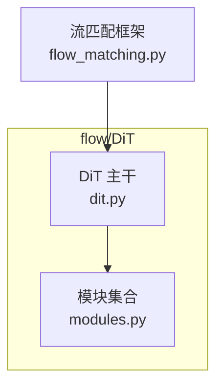
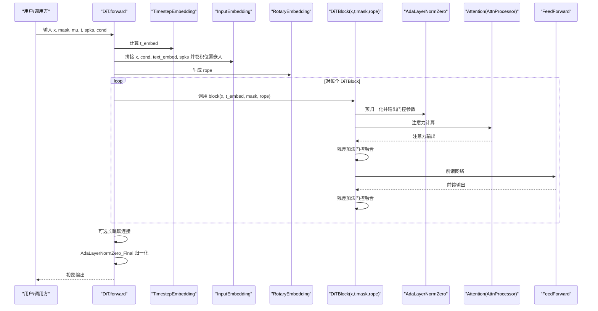
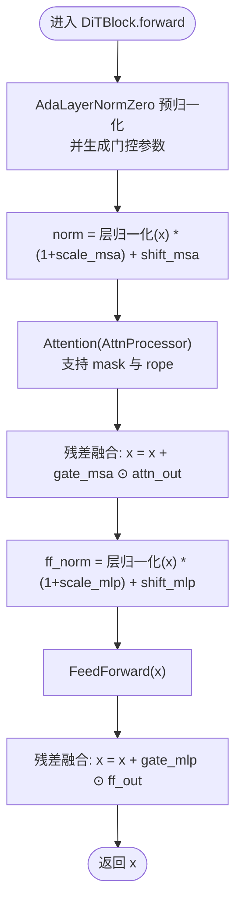
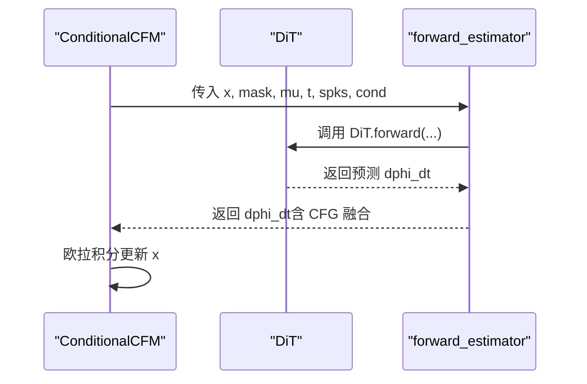
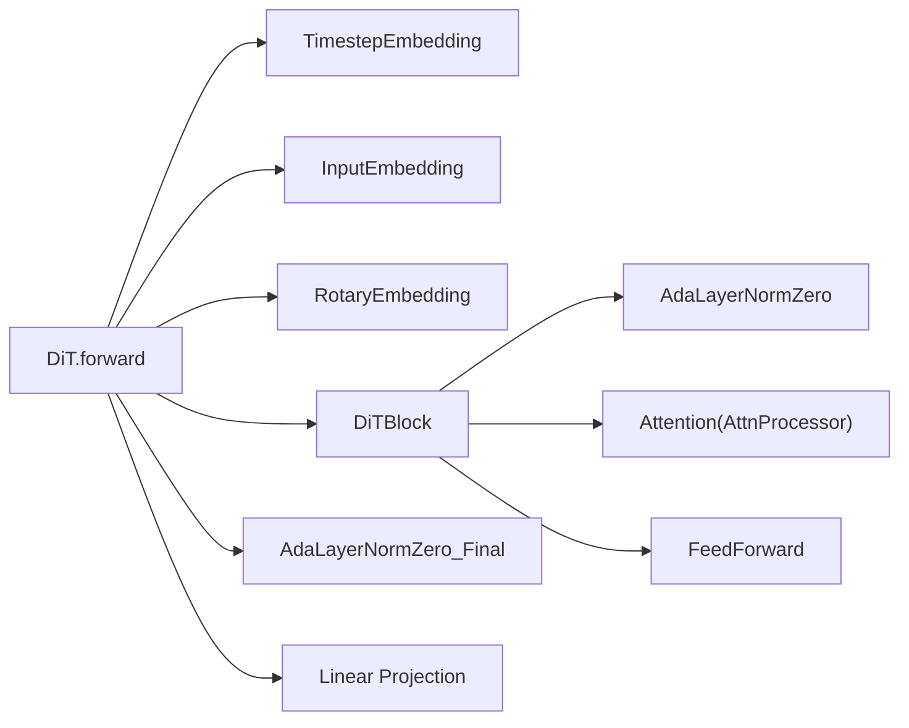

# DiT基础块

<cite>
**本文引用的文件**
- [dit.py](file://cosyvoice/flow/DiT/dit.py)
- [modules.py](file://cosyvoice/flow/DiT/modules.py)
- [flow_matching.py](file://cosyvoice/flow/flow_matching.py)
</cite>

## 目录
1. [引言](#引言)
2. [项目结构](#项目结构)
3. [核心组件](#核心组件)
4. [架构总览](#架构总览)
5. [详细组件分析](#详细组件分析)
6. [依赖关系分析](#依赖关系分析)
7. [性能考量](#性能考量)
8. [故障排查指南](#故障排查指南)
9. [结论](#结论)
10. [附录](#附录)

## 引言
本文件围绕 DiT 基础块（DiTBlock）展开，系统解析其在扩散流匹配模型中的作用：如何通过自适应层归一化（AdaLayerNormZero）与多头自注意力机制，在给定时间步嵌入 t 的条件下，对含噪梅尔频谱进行逐步去噪。重点阐释：
- 双重归一化结构：attn_norm（AdaLayerNormZero）与 ff_norm（标准层归一化）如何协同工作；
- 动态调制参数 gate_msa、shift_mlp、scale_mlp、gate_mlp 如何由时间嵌入 t 生成并控制注意力输出与前馈网络的行为；
- 数据流从归一化、注意力计算到残差连接与前馈网络的完整路径；
- rope 参数如何集成旋转位置编码（RoPE），增强对序列顺序的感知；
- 在流匹配模型中的堆叠方式与对生成高质量梅尔频谱的贡献。

## 项目结构
DiT 模块位于 flow/DiT 目录下，包含两个关键文件：
- dit.py：定义了 DiT 主干网络、输入嵌入、文本嵌入与时间步嵌入，并在 forward 中组织块级堆叠与最终归一化投影。
- modules.py：实现 DiTBlock、AdaLayerNormZero、Attention、AttnProcessor、FeedForward 等核心子模块。

图表来源
- [dit.py](file://cosyvoice/flow/DiT/dit.py#L104-L177)
- [modules.py](file://cosyvoice/flow/DiT/modules.py#L497-L531)
- [flow_matching.py](file://cosyvoice/flow/flow_matching.py#L126-L153)

章节来源
- [dit.py](file://cosyvoice/flow/DiT/dit.py#L104-L177)
- [modules.py](file://cosyvoice/flow/DiT/modules.py#L497-L531)

## 核心组件
- DiTBlock：单个 Transformer 块，包含自适应归一化、注意力与前馈网络，支持残差连接与门控融合。
- AdaLayerNormZero：基于时间嵌入 t 输出多组调制参数，对输入执行预归一化与动态缩放/平移。
- Attention + AttnProcessor：多头自注意力，支持可选掩码与旋转位置编码。
- FeedForward：前馈网络，用于 MLP 分支的非线性变换。
- DiT 主干：堆叠多个 DiTBlock，串联时间嵌入、输入嵌入、旋转位置编码与最终归一化投影。

章节来源
- [modules.py](file://cosyvoice/flow/DiT/modules.py#L230-L266)
- [modules.py](file://cosyvoice/flow/DiT/modules.py#L289-L408)
- [modules.py](file://cosyvoice/flow/DiT/modules.py#L271-L283)
- [modules.py](file://cosyvoice/flow/DiT/modules.py#L497-L531)
- [dit.py](file://cosyvoice/flow/DiT/dit.py#L104-L177)

## 架构总览
DiT 主干在 forward 中完成以下关键步骤：
- 将输入梅尔频谱、条件（如 mu）与文本嵌入拼接并经卷积位置嵌入后送入堆叠的 DiTBlock；
- 计算时间步嵌入 t 并生成 rope（旋转位置编码）；
- 针对不同推理模式构建注意力掩码；
- 循环调用每个 DiTBlock，将 t、mask、rope 传入；
- 最终经 AdaLayerNormZero_Final 归一化与线性投影得到输出。

图表来源
- [dit.py](file://cosyvoice/flow/DiT/dit.py#L145-L177)
- [modules.py](file://cosyvoice/flow/DiT/modules.py#L497-L531)
- [modules.py](file://cosyvoice/flow/DiT/modules.py#L230-L266)
- [modules.py](file://cosyvoice/flow/DiT/modules.py#L289-L408)

## 详细组件分析

### DiTBlock 类与前向传播流程
DiTBlock 的核心职责是：
- 使用 AdaLayerNormZero 对注意力输入进行预归一化与动态调制，得到 norm 与门控参数；
- 将 norm 输入注意力模块，得到注意力输出；
- 通过门控参数 gate_msa 对注意力输出进行加权融合，再与原始输入相加；
- 对融合后的特征进行 ff_norm 与前馈网络，再通过 gate_mlp 进行门控融合，完成残差连接。

图表来源
- [modules.py](file://cosyvoice/flow/DiT/modules.py#L497-L531)

章节来源
- [modules.py](file://cosyvoice/flow/DiT/modules.py#L497-L531)

### AdaLayerNormZero 的动态调制机制
- 输入：x 为当前块的输入特征；emb 为时间步嵌入 t 经过激活与线性映射得到的向量；
- 输出：返回两部分
  - x_mod：对 x 执行无仿射的层归一化后，按 (1 + scale_msa) 缩放并加上 shift_msa，作为注意力输入；
  - 门控参数：shift_msa、scale_msa、gate_msa（注意力门控）；shift_mlp、scale_mlp、gate_mlp（前馈门控）。
- 该机制使得注意力与前馈分支均能被时间步 t 动态调节，从而在扩散的不同阶段对特征施加不同的调制。

章节来源
- [modules.py](file://cosyvoice/flow/DiT/modules.py#L230-L266)

### 注意力与旋转位置编码（RoPE）
- Attention 支持两种处理器：
  - AttnProcessor：纯自注意力，支持 mask 与 rope；
  - JointAttnProcessor：联合注意力（用于 MMDiT），支持上下文 c 与独立 rope；
- AttnProcessor 的关键步骤：
  - 计算 Q、K、V；
  - 应用旋转位置编码（rope）对 Q、K 进行旋转；
  - 使用缩放点积注意力（SDPA）计算注意力权重；
  - 线性投影与 dropout；
  - 掩码填充（mask）以屏蔽填充位置。
- rope 的生成与传递：
  - DiT.forward 中根据序列长度生成 rope，并在每块调用时传入；
  - Attention.forward 接收 rope 并将其应用于 Q、K。

章节来源
- [modules.py](file://cosyvoice/flow/DiT/modules.py#L289-L408)
- [modules.py](file://cosyvoice/flow/DiT/modules.py#L410-L495)
- [dit.py](file://cosyvoice/flow/DiT/dit.py#L145-L177)

### 前馈网络与双重归一化
- ff_norm 使用标准层归一化，对融合后的特征进行归一化；
- FeedForward 实现两层线性映射与激活，作为 MLP 分支；
- gate_mlp 与 shift_mlp、scale_mlp 共同决定前馈分支的动态调制强度与偏置。

章节来源
- [modules.py](file://cosyvoice/flow/DiT/modules.py#L271-L283)
- [modules.py](file://cosyvoice/flow/DiT/modules.py#L500-L531)

### 在流匹配模型中的堆叠与应用
- DiT 主干在 forward 中：
  - 计算时间步嵌入 t；
  - 将含噪梅尔、条件、文本嵌入与说话人嵌入拼接并通过卷积位置嵌入；
  - 生成 rope；
  - 构建注意力掩码（支持分块流式推理）；
  - 循环堆叠 DiTBlock；
  - 可选长跳跃连接；
  - 最终 AdaLayerNormZero_Final 归一化与线性投影得到输出。
- 流匹配框架（ConditionalCFM）通过求解常微分方程（ODE）迭代更新 x，其中 dphi_dt 由 DiT 前向得到，再进行 CFG（Classifier-Free Guidance）融合与欧拉积分。

图表来源
- [flow_matching.py](file://cosyvoice/flow/flow_matching.py#L126-L153)
- [dit.py](file://cosyvoice/flow/DiT/dit.py#L145-L177)

章节来源
- [flow_matching.py](file://cosyvoice/flow/flow_matching.py#L126-L153)
- [dit.py](file://cosyvoice/flow/DiT/dit.py#L145-L177)

## 依赖关系分析
- DiTBlock 依赖：
  - AdaLayerNormZero：提供预归一化与门控参数；
  - Attention + AttnProcessor：实现多头注意力与 SDPA；
  - FeedForward：实现前馈网络；
  - DiT 主干负责组织这些组件并传入 t、mask、rope。
- DiT 主干依赖：
  - TimestepEmbedding：将标量时间步 t 映射为向量；
  - InputEmbedding：拼接多源输入并加入卷积位置嵌入；
  - RotaryEmbedding：生成旋转位置编码；
  - AdaLayerNormZero_Final：最终归一化；
  - 线性投影：将特征映射回梅尔维度。

图表来源
- [dit.py](file://cosyvoice/flow/DiT/dit.py#L104-L177)
- [modules.py](file://cosyvoice/flow/DiT/modules.py#L230-L266)
- [modules.py](file://cosyvoice/flow/DiT/modules.py#L289-L408)
- [modules.py](file://cosyvoice/flow/DiT/modules.py#L271-L283)
- [modules.py](file://cosyvoice/flow/DiT/modules.py#L497-L531)

章节来源
- [dit.py](file://cosyvoice/flow/DiT/dit.py#L104-L177)
- [modules.py](file://cosyvoice/flow/DiT/modules.py#L230-L266)
- [modules.py](file://cosyvoice/flow/DiT/modules.py#L289-L408)
- [modules.py](file://cosyvoice/flow/DiT/modules.py#L271-L283)
- [modules.py](file://cosyvoice/flow/DiT/modules.py#L497-L531)

## 性能考量
- 计算热点：
  - 注意力计算（Q/K/V 投影、SDPA）是主要开销；
  - AdaLayerNormZero 的线性层与切分操作引入额外计算；
  - 多头注意力的张量重塑与转置带来内存与带宽压力。
- 优化建议：
  - 使用 torch.nn.functional.scaled_dot_product_attention（已采用）以获得高效内核；
  - 合理设置 heads 与 dim_head，避免头数过大导致显存不足；
  - 在推理侧启用分块掩码与流式处理，减少一次性注意力矩阵规模；
  - 使用半精度（fp16）或混合精度训练/推理，注意 dtype 一致性（见流匹配框架中的 dtype 处理）。

[本节为通用性能讨论，不直接分析具体文件，故无章节来源]

## 故障排查指南
- 形状不匹配：
  - 确认 t 的批次与 x 匹配（DiT.forward 中会重复 t 以匹配 batch）；
  - 确保 mask 与 x 的序列长度一致，并正确扩展为注意力掩码形状。
- dtype 不一致：
  - 流匹配框架中为避免 TRT FP16 推理 NaN，需将输入张量 dtype 设置为 spks.dtype，确保所有张量一致。
- 掩码与填充：
  - 注意力掩码应屏蔽填充位置；若未正确扩展，可能导致信息泄漏或异常。
- RoPE 与序列长度：
  - rope 的维度需与 dim_head 一致；序列长度变化时需重新生成 rope 或使用预计算频率。

章节来源
- [dit.py](file://cosyvoice/flow/DiT/dit.py#L145-L177)
- [flow_matching.py](file://cosyvoice/flow/flow_matching.py#L93-L101)
- [flow_matching.py](file://cosyvoice/flow/flow_matching.py#L133-L153)
- [modules.py](file://cosyvoice/flow/DiT/modules.py#L289-L408)

## 结论
DiTBlock 通过 AdaLayerNormZero 的动态调制与双归一化结构，实现了对注意力与前馈分支的精细控制；配合旋转位置编码与掩码机制，能够在扩散流匹配框架中稳定地对含噪梅尔频谱进行逐步去噪。DiT 主干的堆叠方式与最终归一化投影共同保证了从噪声到高质量梅尔频谱的连续变换过程。在实际部署中，需关注 dtype 一致性、掩码正确性与 RoPE 维度匹配，以获得稳定且高效的推理表现。

[本节为总结性内容，不直接分析具体文件，故无章节来源]

## 附录
- 实际使用场景示例（概念性说明）：
  - 在流匹配推理中，先以随机噪声初始化 x，随后在固定步数的 ODE 求解循环中反复调用 DiT 前向，得到每一步的 dphi_dt，并通过 CFG 融合与欧拉积分逐步去噪，最终输出高质量梅尔频谱。
  - 在训练阶段，ConditionalCFM 通过采样随机时间步 t，构造 y 与 u，调用 DiT 计算预测并最小化掩码下的均方误差。

[本节为概念性说明，不直接分析具体文件，故无章节来源]