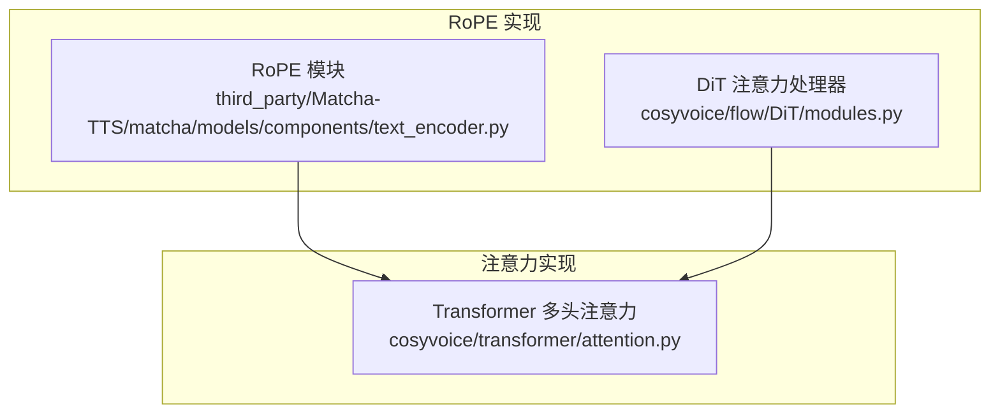
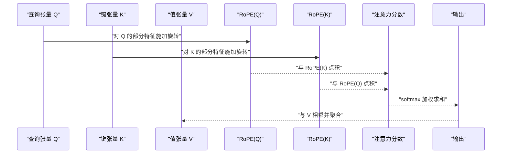
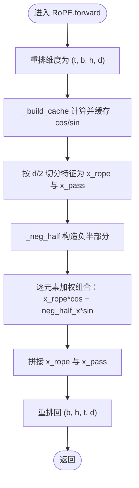
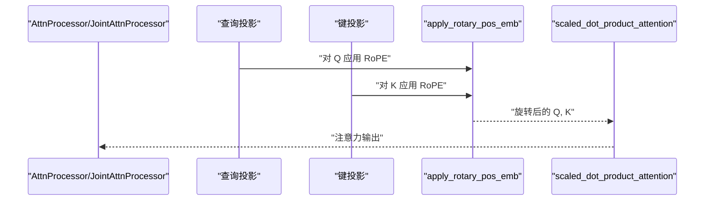
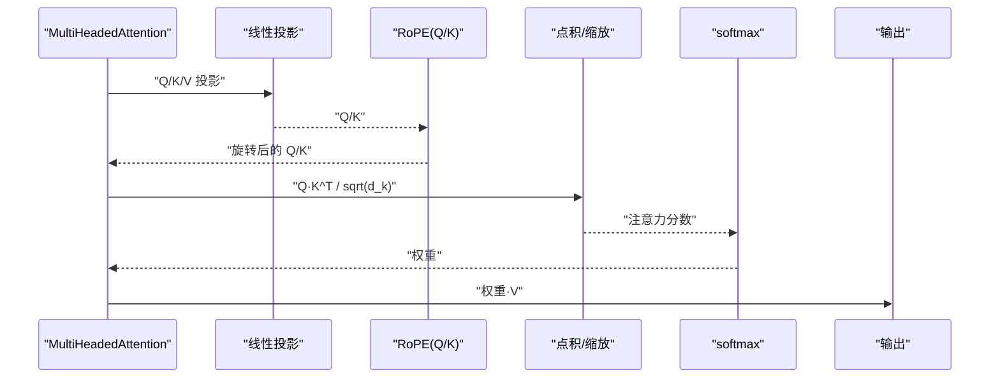
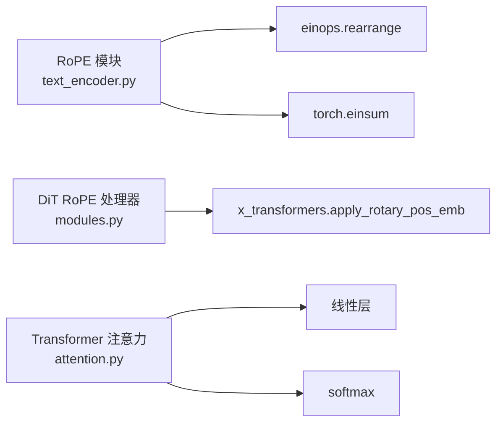

# 旋转位置编码

<cite>
**本文引用的文件**
- [text_encoder.py](file://third_party/Matcha-TTS/matcha/models/components/text_encoder.py)
- [modules.py](file://cosyvoice/flow/DiT/modules.py)
- [attention.py](file://cosyvoice/transformer/attention.py)
</cite>

## 目录
1. [简介](#简介)
2. [项目结构](#项目结构)
3. [核心组件](#核心组件)
4. [架构总览](#架构总览)
5. [详细组件分析](#详细组件分析)
6. [依赖关系分析](#依赖关系分析)
7. [性能考量](#性能考量)
8. [故障排查指南](#故障排查指南)
9. [结论](#结论)
10. [附录](#附录)

## 简介
本文件系统性阐述旋转位置编码（Rotary Positional Embedding, RoPE）在自注意力机制中的工作原理与关键作用。RoPE通过将特征维度两两分组，在二维平面内对每一对特征进行角度旋转，从而将位置信息编码到查询（Q）与键（K）的相对关系中。该方法具有良好的外推能力，尤其适用于长序列建模与流式推理场景。本文结合代码路径，深入解析：
- RoPE模块的数学机制与实现细节
- 预计算并缓存 cos 和 sin 值以提升推理效率的策略
- 负半部分特征构造与旋转变换的实现
- forward 中 einsum 计算位置索引与频率基乘积的过程
- RoPE 在注意力实现中的协同工作方式，确保长时语音序列的时间一致性

## 项目结构
本仓库中与 RoPE 相关的关键实现分布在以下模块：
- 第三方 Matcha-TTS 的文本编码器：提供独立的 RoPE 模块与多头注意力中对 Q/K 应用 RoPE 的示例
- DiT 流派的注意力实现：使用 x-transformers 提供的 apply_rotary_pos_emb 对 Q/K 进行旋转
- Transformer 注意力实现：展示传统线性投影后应用 RoPE 的流程

图表来源
- [text_encoder.py](file://third_party/Matcha-TTS/matcha/models/components/text_encoder.py#L97-L173)
- [modules.py](file://cosyvoice/flow/DiT/modules.py#L19-L161)
- [attention.py](file://cosyvoice/transformer/attention.py#L1-L331)

章节来源
- [text_encoder.py](file://third_party/Matcha-TTS/matcha/models/components/text_encoder.py#L97-L173)
- [modules.py](file://cosyvoice/flow/DiT/modules.py#L19-L161)
- [attention.py](file://cosyvoice/transformer/attention.py#L1-L331)

## 核心组件
- RoPE 模块（Matcha-TTS）
  - 作用：对 Q/K 的部分特征维度施加旋转，将位置信息嵌入到特征空间的二维对中
  - 关键点：预计算并缓存 cos/sin；按需对特征进行“负半部分”构造；通过 einsum 计算位置索引与频率基的乘积
- DiT 注意力处理器
  - 作用：调用 x-transformers 的 apply_rotary_pos_emb 对 Q/K 施加旋转
  - 关键点：支持可选的 x-pos 缩放因子，用于长序列外推
- Transformer 多头注意力
  - 作用：在线性投影后对 Q/K 分别施加 RoPE，再计算注意力分数

章节来源
- [text_encoder.py](file://third_party/Matcha-TTS/matcha/models/components/text_encoder.py#L97-L173)
- [modules.py](file://cosyvoice/flow/DiT/modules.py#L19-L161)
- [attention.py](file://cosyvoice/transformer/attention.py#L1-L331)

## 架构总览
RoPE 在不同注意力实现中的集成方式如下：

图表来源
- [text_encoder.py](file://third_party/Matcha-TTS/matcha/models/components/text_encoder.py#L226-L246)
- [modules.py](file://cosyvoice/flow/DiT/modules.py#L349-L408)
- [attention.py](file://cosyvoice/transformer/attention.py#L196-L197)

## 详细组件分析

### RoPE 模块（Matcha-TTS）
- 数学机制
  - 将 d 维特征分为 d/2 对，每对在二维平面内绕原点旋转，旋转角度与位置索引成比例
  - 通过频率基 Θ 与位置索引相乘得到角度，再计算对应的 cos 和 sin
- 预计算与缓存
  - _build_cache：当缓存未构建或当前序列长度更大时，重新计算并缓存 idx_theta2.cos() 与 idx_theta2.sin()
  - 使用 einsum 计算位置索引与频率基的乘积，形成每个位置对应的角度矩阵
- 负半部分构造
  - _neg_half：将前半部分特征取反，后半部分保持不变，实现二维旋转的等价变换
- 前向传播
  - forward：对 Q/K 的部分通道施加 RoPE，其余通道保持不变；最后按需重排维度

图表来源
- [text_encoder.py](file://third_party/Matcha-TTS/matcha/models/components/text_encoder.py#L119-L173)

章节来源
- [text_encoder.py](file://third_party/Matcha-TTS/matcha/models/components/text_encoder.py#L97-L173)

### DiT 注意力处理器中的 RoPE
- 使用 x_transformers.apply_rotary_pos_emb 对 Q/K 施加旋转
- 支持可选的 x-pos 缩放因子，用于长序列外推（NTK-aware scaling）
- 通过 precompute_freqs_cis 预计算频率复指数，便于后续直接应用

图表来源
- [modules.py](file://cosyvoice/flow/DiT/modules.py#L349-L408)
- [modules.py](file://cosyvoice/flow/DiT/modules.py#L414-L495)

章节来源
- [modules.py](file://cosyvoice/flow/DiT/modules.py#L19-L161)
- [modules.py](file://cosyvoice/flow/DiT/modules.py#L349-L408)
- [modules.py](file://cosyvoice/flow/DiT/modules.py#L414-L495)

### Transformer 多头注意力中的 RoPE
- 在线性投影后，分别对 Q 与 K 应用 RoPE
- 通过注意力分数 softmax 后与 V 相乘，得到最终输出

图表来源
- [attention.py](file://cosyvoice/transformer/attention.py#L196-L197)

章节来源
- [attention.py](file://cosyvoice/transformer/attention.py#L1-L331)

## 依赖关系分析
- RoPE 模块依赖于 einops.rearrange 进行维度重排
- DiT 注意力处理器依赖 x_transformers.apply_rotary_pos_emb
- Transformer 注意力实现依赖 torch.nn 线性层与 torch.softmax

图表来源
- [text_encoder.py](file://third_party/Matcha-TTS/matcha/models/components/text_encoder.py#L1-L20)
- [modules.py](file://cosyvoice/flow/DiT/modules.py#L19-L21)
- [attention.py](file://cosyvoice/transformer/attention.py#L1-L331)

章节来源
- [text_encoder.py](file://third_party/Matcha-TTS/matcha/models/components/text_encoder.py#L1-L20)
- [modules.py](file://cosyvoice/flow/DiT/modules.py#L19-L21)
- [attention.py](file://cosyvoice/transformer/attention.py#L1-L331)

## 性能考量
- 预计算与缓存
  - RoPE 模块在首次遇到更长序列时才重新计算并缓存 cos/sin，避免重复计算，显著降低推理开销
- 计算复杂度
  - 频率基计算与 einsum 操作的时间复杂度与序列长度和特征维度相关，但仅在缓存缺失时发生
- 内存占用
  - cos/sin 缓存按序列长度维度存储，注意在长序列场景下的显存占用
- 外推能力
  - DiT 中的 precompute_freqs_cis 支持通过 theta_rescale_factor 进行 NTK-aware 缩放，提升长序列外推能力

章节来源
- [text_encoder.py](file://third_party/Matcha-TTS/matcha/models/components/text_encoder.py#L119-L146)
- [modules.py](file://cosyvoice/flow/DiT/modules.py#L150-L161)

## 故障排查指南
- 形状不匹配
  - 确保 Q/K 的通道数与 RoPE 模块指定的 d 一致；若只对部分通道施加 RoPE，需保证切分与拼接逻辑正确
- 设备与 dtype 不一致
  - RoPE 模块在计算频率基时会将张量移动到输入设备并转换 dtype，若出现异常，检查输入张量的设备与 dtype
- 缓存未更新
  - 当序列长度减少时，RoPE 模块不会自动缩小缓存；若出现越界访问，需显式重建缓存或调整输入长度
- 注意力掩码与 RoPE 协同
  - 若使用掩码，请确保掩码形状与注意力分数一致，避免因形状不匹配导致的错误

章节来源
- [text_encoder.py](file://third_party/Matcha-TTS/matcha/models/components/text_encoder.py#L119-L173)
- [attention.py](file://cosyvoice/transformer/attention.py#L82-L127)

## 结论
RoPE 通过将位置信息编码到 Q/K 的相对几何关系中，实现了对长序列的良好外推能力与高效推理。Matcha-TTS 的 RoPE 模块与 DiT 的 apply_rotary_pos_emb 实现展示了两种主流集成方式：一种是针对特定通道的旋转与缓存策略，另一种是通过外部库函数统一处理并支持长序列缩放。两者均可与标准注意力实现无缝协作，确保在处理长时语音序列时保持时间一致性与稳定性。

## 附录
- 关键实现路径参考
  - RoPE 模块与 forward 流程：[text_encoder.py](file://third_party/Matcha-TTS/matcha/models/components/text_encoder.py#L97-L173)
  - 频率基预计算与 x-pos 缩放：[modules.py](file://cosyvoice/flow/DiT/modules.py#L150-L161)
  - DiT 注意力处理器应用 RoPE：[modules.py](file://cosyvoice/flow/DiT/modules.py#L349-L408)
  - Transformer 注意力中对 Q/K 应用 RoPE 的流程：[attention.py](file://cosyvoice/transformer/attention.py#L226-L246)