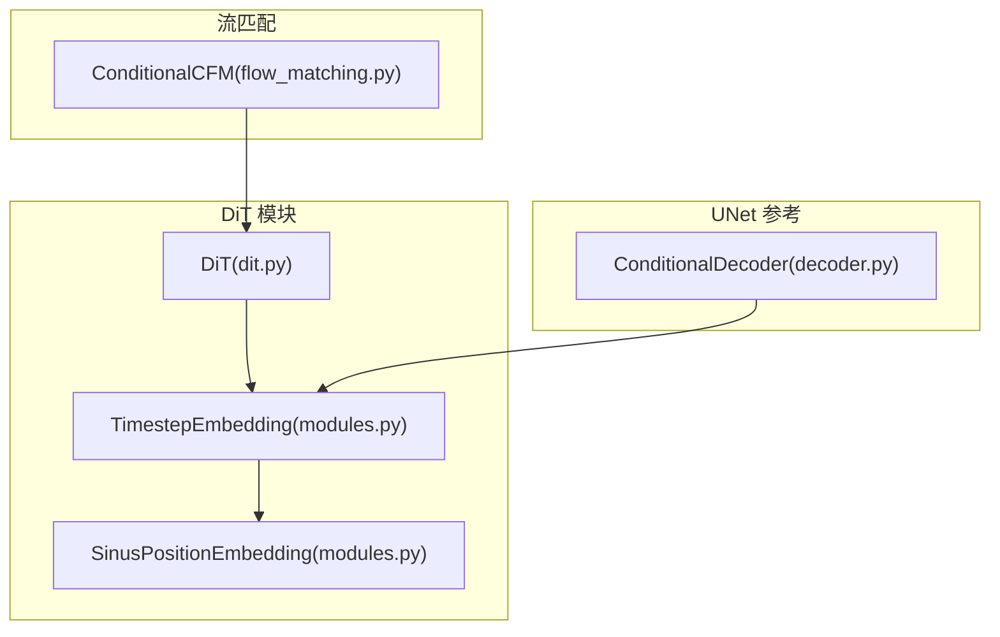
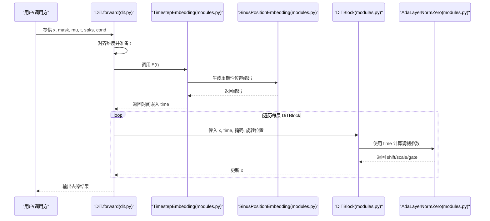
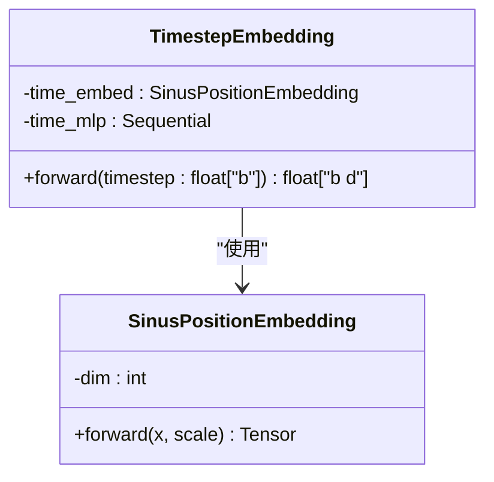
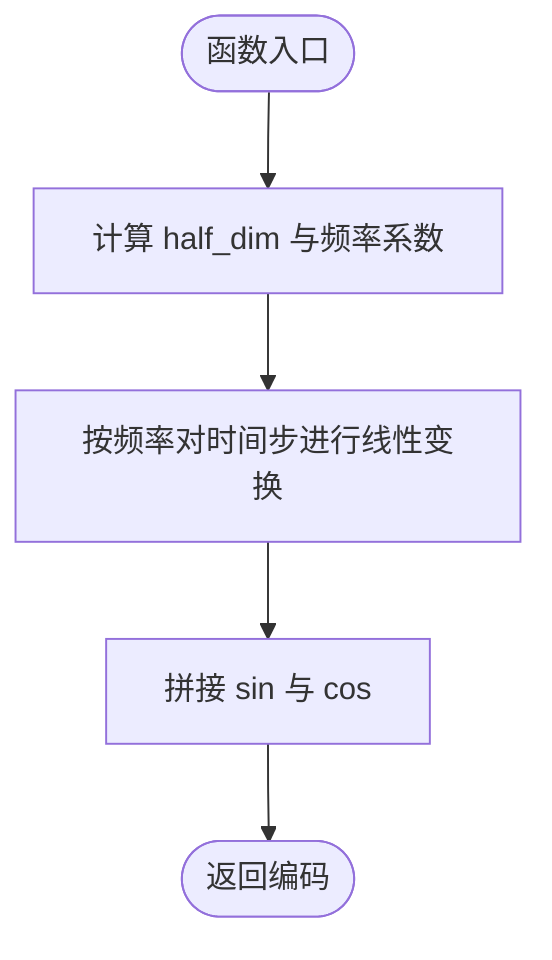
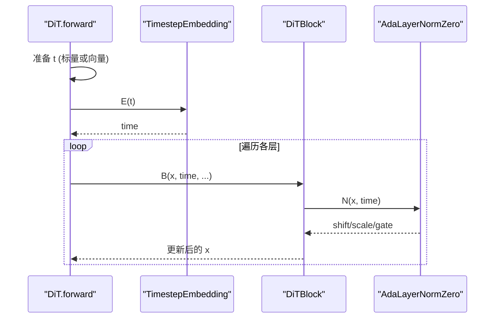
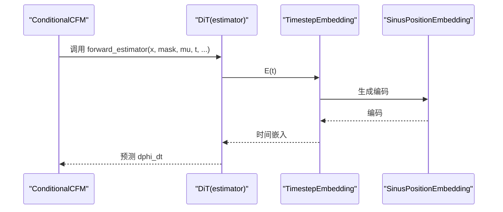
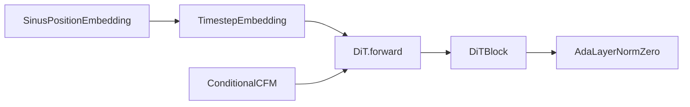

# 时间步嵌入模块

<cite>
**本文引用的文件列表**
- [dit.py](file://cosyvoice/flow/DiT/dit.py)
- [modules.py](file://cosyvoice/flow/DiT/modules.py)
- [flow_matching.py](file://cosyvoice/flow/flow_matching.py)
- [decoder.py](file://cosyvoice/flow/decoder.py)
</cite>

## 目录
1. [简介](#简介)
2. [项目结构](#项目结构)
3. [核心组件](#核心组件)
4. [架构总览](#架构总览)
5. [详细组件分析](#详细组件分析)
6. [依赖关系分析](#依赖关系分析)
7. [性能考量](#性能考量)
8. [故障排查指南](#故障排查指南)
9. [结论](#结论)
10. [附录](#附录)

## 简介
本文件聚焦于时间步嵌入模块的实现与使用，系统性解析以下内容：
- TimestepEmbedding 如何将离散时间步信息转换为连续高维嵌入向量；
- SinusPositionEmbedding 如何生成周期性位置编码，并通过 MLP（time_mlp）进行非线性变换；
- 输入 timestep 的维度含义（float["b"]），以及在前向传播中的处理流程；
- 在流匹配模型中，时间步嵌入如何为每个去噪步骤提供上下文感知能力，使模型能根据当前噪声水平动态调整行为；
- 实际调用示例：如何将时间步嵌入集成到 DiT 块中进行特征调制。

## 项目结构
围绕时间步嵌入的相关代码主要分布在以下文件：
- DiT 架构与调用：cosyvoice/flow/DiT/dit.py
- 时间步嵌入与位置编码：cosyvoice/flow/DiT/modules.py
- 流匹配训练/推理入口：cosyvoice/flow/flow_matching.py
- 另一套基于 UNet 的时间步嵌入用法参考：cosyvoice/flow/decoder.py

图表来源
- [dit.py](file://cosyvoice/flow/DiT/dit.py#L120-L177)
- [modules.py](file://cosyvoice/flow/DiT/modules.py#L606-L616)
- [flow_matching.py](file://cosyvoice/flow/flow_matching.py#L1-L120)
- [decoder.py](file://cosyvoice/flow/decoder.py#L100-L130)

章节来源
- [dit.py](file://cosyvoice/flow/DiT/dit.py#L120-L177)
- [modules.py](file://cosyvoice/flow/DiT/modules.py#L606-L616)
- [flow_matching.py](file://cosyvoice/flow/flow_matching.py#L1-L120)
- [decoder.py](file://cosyvoice/flow/decoder.py#L100-L130)

## 核心组件
- TimestepEmbedding：将标量时间步张量映射为与模型维度一致的条件嵌入，作为后续调制参数的来源。
- SinusPositionEmbedding：生成周期性正弦余弦位置编码，构造时间步的高维表示。
- DiT 前向：在每层 DiTBlock 中，AdaLayerNormZero 将时间嵌入转换为多组调制参数，分别用于注意力与 FFN 的缩放、平移与门控。

章节来源
- [modules.py](file://cosyvoice/flow/DiT/modules.py#L606-L616)
- [modules.py](file://cosyvoice/flow/DiT/modules.py#L71-L84)
- [modules.py](file://cosyvoice/flow/DiT/modules.py#L230-L245)
- [dit.py](file://cosyvoice/flow/DiT/dit.py#L145-L177)

## 架构总览
下图展示了时间步嵌入在 DiT 中的端到端调用链路，以及它如何参与每层的特征调制。

图表来源
- [dit.py](file://cosyvoice/flow/DiT/dit.py#L145-L177)
- [modules.py](file://cosyvoice/flow/DiT/modules.py#L606-L616)
- [modules.py](file://cosyvoice/flow/DiT/modules.py#L71-L84)
- [modules.py](file://cosyvoice/flow/DiT/modules.py#L230-L245)
- [modules.py](file://cosyvoice/flow/DiT/modules.py#L500-L531)

## 详细组件分析

### TimestepEmbedding 类
- 功能：将形状为 float["b"] 的时间步张量映射为形状为 float["b d"] 的时间嵌入，其中 d 由构造时指定。
- 实现要点：
  - 先通过 SinusPositionEmbedding 生成固定维度的中间表示；
  - 再经由两层线性层（含 SiLU 激活）映射到目标维度；
  - 输出类型与输入 dtype 保持一致，便于与模型其他张量对齐。

图表来源
- [modules.py](file://cosyvoice/flow/DiT/modules.py#L606-L616)
- [modules.py](file://cosyvoice/flow/DiT/modules.py#L71-L84)

章节来源
- [modules.py](file://cosyvoice/flow/DiT/modules.py#L606-L616)

### SinusPositionEmbedding：周期性位置编码
- 功能：对输入标量序列（通常为时间步）生成周期性正弦/余弦编码，形成高维表示。
- 关键点：
  - half_dim = dim // 2，指数间隔的频率构成；通过乘法引入尺度因子；
  - 最终拼接 sin 与 cos，得到长度为 dim 的编码向量；
  - 该编码具备良好的周期性与可区分性，适合作为时间步的连续表征。

图表来源
- [modules.py](file://cosyvoice/flow/DiT/modules.py#L71-L84)

章节来源
- [modules.py](file://cosyvoice/flow/DiT/modules.py#L71-L84)

### DiT 前向传播中的时间步嵌入
- DiT 初始化时创建 TimestepEmbedding，并在 forward 中对 t 进行预处理（若为标量则重复到 batch 维度）。
- 将时间嵌入传入每层 DiTBlock，AdaLayerNormZero 将其转换为多组调制参数（shift/scale/gate），分别用于注意力与 FFN 的归一化与门控。

图表来源
- [dit.py](file://cosyvoice/flow/DiT/dit.py#L145-L177)
- [modules.py](file://cosyvoice/flow/DiT/modules.py#L230-L245)
- [modules.py](file://cosyvoice/flow/DiT/modules.py#L500-L531)

章节来源
- [dit.py](file://cosyvoice/flow/DiT/dit.py#L145-L177)
- [modules.py](file://cosyvoice/flow/DiT/modules.py#L230-L245)
- [modules.py](file://cosyvoice/flow/DiT/modules.py#L500-L531)

### 在流匹配模型中的角色
- 流匹配训练/推理通过 ConditionalCFM 的 forward_estimator 或 solve_euler 步进 ODE，期间会将时间步 t 作为条件输入给估计器（DiT）。
- DiT 在每一步根据当前 t 生成时间嵌入，驱动每层的调制参数，使模型在不同噪声水平下自适应地调整特征表示与去噪策略。

图表来源
- [flow_matching.py](file://cosyvoice/flow/flow_matching.py#L126-L154)
- [dit.py](file://cosyvoice/flow/DiT/dit.py#L145-L177)
- [modules.py](file://cosyvoice/flow/DiT/modules.py#L606-L616)
- [modules.py](file://cosyvoice/flow/DiT/modules.py#L71-L84)

章节来源
- [flow_matching.py](file://cosyvoice/flow/flow_matching.py#L126-L154)
- [dit.py](file://cosyvoice/flow/DiT/dit.py#L145-L177)
- [modules.py](file://cosyvoice/flow/DiT/modules.py#L606-L616)
- [modules.py](file://cosyvoice/flow/DiT/modules.py#L71-L84)

### 输入维度与处理流程说明
- 输入 t 的维度含义：float["b"] 表示 batch 维度上的标量时间步，通常取值范围与调度策略相关（如 cosine 调度）。
- 处理流程：
  - 若 t 为标量，则在 DiT.forward 中重复到 batch 维度；
  - 调用 TimestepEmbedding 得到时间嵌入；
  - 将时间嵌入传入每层 DiTBlock，AdaLayerNormZero 将其转换为注意力与 FFN 的调制参数。

章节来源
- [dit.py](file://cosyvoice/flow/DiT/dit.py#L145-L177)
- [modules.py](file://cosyvoice/flow/DiT/modules.py#L606-L616)

### 实际调用示例：集成到 DiT 块进行特征调制
- 在 DiT.forward 中，先对 t 做维度适配，再调用 self.time_embed(t)，得到 time；
- 将 time 传入每层 DiTBlock，AdaLayerNormZero 使用 time 计算 shift/scale/gate，分别用于注意力与 FFN 的调制；
- 这使得模型在每个去噪步骤都能依据当前噪声水平动态调整特征表示。

章节来源
- [dit.py](file://cosyvoice/flow/DiT/dit.py#L145-L177)
- [modules.py](file://cosyvoice/flow/DiT/modules.py#L230-L245)
- [modules.py](file://cosyvoice/flow/DiT/modules.py#L500-L531)

## 依赖关系分析
- TimestepEmbedding 依赖 SinusPositionEmbedding 生成周期性编码；
- DiT 在 forward 中实例化 TimestepEmbedding，并在每层 DiTBlock 中使用 AdaLayerNormZero 将时间嵌入转换为调制参数；
- 流匹配框架通过 ConditionalCFM 将时间步 t 作为条件传递给 DiT，从而在训练/推理中实现时间步感知。

图表来源
- [modules.py](file://cosyvoice/flow/DiT/modules.py#L71-L84)
- [modules.py](file://cosyvoice/flow/DiT/modules.py#L606-L616)
- [dit.py](file://cosyvoice/flow/DiT/dit.py#L145-L177)
- [modules.py](file://cosyvoice/flow/DiT/modules.py#L230-L245)
- [flow_matching.py](file://cosyvoice/flow/flow_matching.py#L126-L154)

章节来源
- [modules.py](file://cosyvoice/flow/DiT/modules.py#L71-L84)
- [modules.py](file://cosyvoice/flow/DiT/modules.py#L606-L616)
- [dit.py](file://cosyvoice/flow/DiT/dit.py#L145-L177)
- [modules.py](file://cosyvoice/flow/DiT/modules.py#L230-L245)
- [flow_matching.py](file://cosyvoice/flow/flow_matching.py#L126-L154)

## 性能考量
- 时间步嵌入计算开销极低，主要为一次 SinusPositionEmbedding 的向量化操作与两层线性层；
- 由于只产生固定维度的条件向量，不会显著增加注意力或 FFN 的计算复杂度；
- 在流匹配推理中，时间步 t 通常为标量或批量标量，dtype 与主干保持一致可避免额外类型转换成本。

[本节为通用建议，不直接分析具体文件]

## 故障排查指南
- 形状不匹配：确保输入 t 的形状为 float["b"]，并在 DiT.forward 中完成重复或广播；
- dtype 不一致：TimestepEmbedding 会将中间编码转换为与输入相同的 dtype，若出现数值异常，检查上游数据类型；
- 调制参数缺失：若 AdaLayerNormZero 未正确接收时间嵌入，确认 DiTBlock 的调用路径是否传入了 time。

章节来源
- [dit.py](file://cosyvoice/flow/DiT/dit.py#L145-L177)
- [modules.py](file://cosyvoice/flow/DiT/modules.py#L606-L616)
- [modules.py](file://cosyvoice/flow/DiT/modules.py#L230-L245)

## 结论
- TimestepEmbedding 通过 SinusPositionEmbedding 生成周期性位置编码，并经由 MLP 映射到模型维度，为 DiT 的每一层提供时间感知的调制参数；
- 在流匹配框架中，时间步 t 作为关键条件贯穿训练与推理，使模型能够在不同噪声水平下自适应地调整特征与去噪策略；
- 该模块设计简洁高效，易于集成且扩展性强，是 DiT 在扩散/流匹配任务中的关键组件之一。

[本节为总结性内容，不直接分析具体文件]

## 附录
- 参考用法对比：UNet 解码器也使用 TimestepEmbedding（decoder.py），可作为另一套实现的对照参考。

章节来源
- [decoder.py](file://cosyvoice/flow/decoder.py#L100-L130)