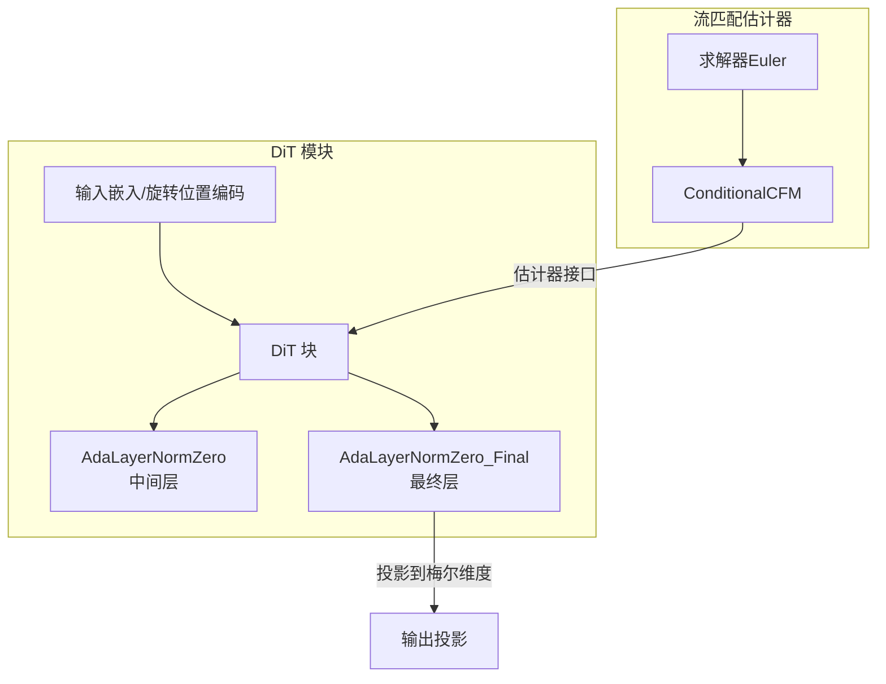
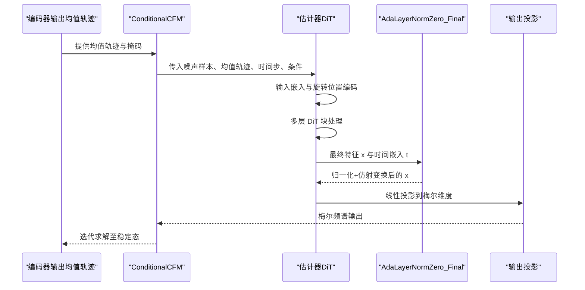
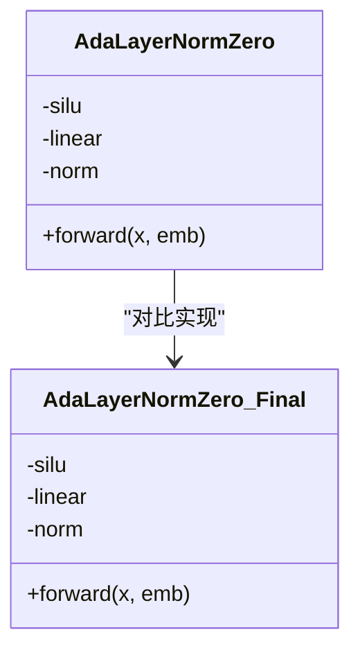
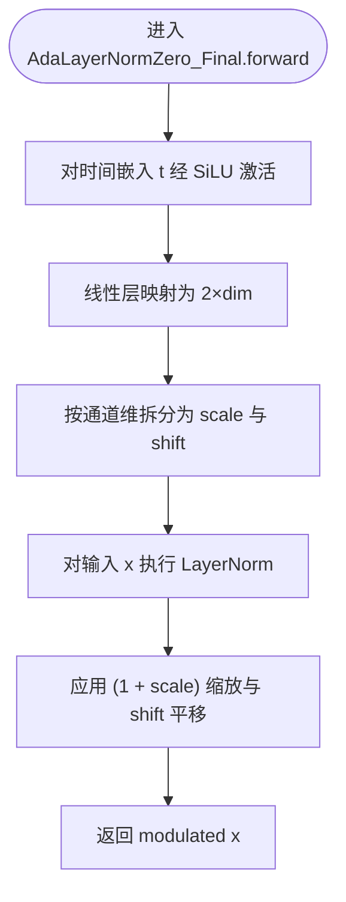
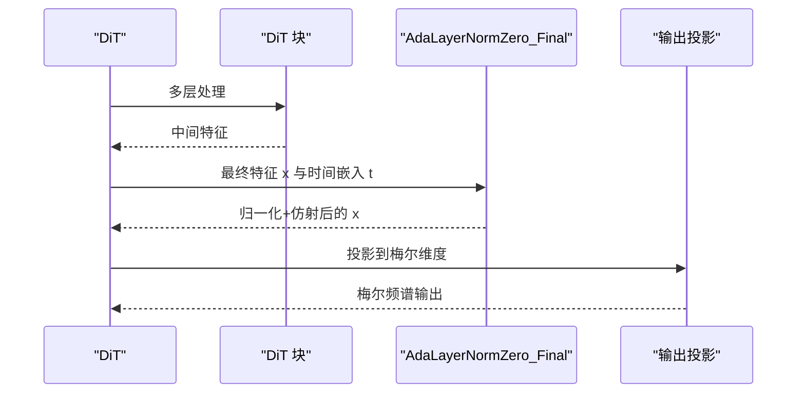
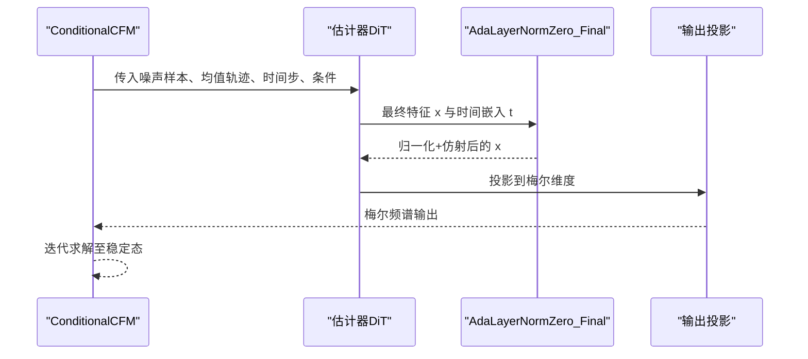
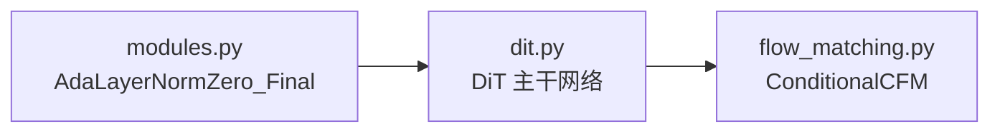

# 最终自适应层归一化

<cite>
**本文引用的文件**
- [modules.py](file://cosyvoice/flow/DiT/modules.py)
- [dit.py](file://cosyvoice/flow/DiT/dit.py)
- [flow_matching.py](file://cosyvoice/flow/flow_matching.py)
</cite>

## 目录
1. [引言](#引言)
2. [项目结构](#项目结构)
3. [核心组件](#核心组件)
4. [架构总览](#架构总览)
5. [详细组件分析](#详细组件分析)
6. [依赖关系分析](#依赖关系分析)
7. [性能考量](#性能考量)
8. [故障排查指南](#故障排查指南)
9. [结论](#结论)

## 引言
本文件聚焦于流匹配模型中的“最终自适应层归一化”模块——AdaLayerNormZero_Final 的设计意图与实现细节。该模块位于 DiT 变体的输出阶段，负责在不引入额外门控信号的前提下，对注意力输入进行标准化与仿射变换，从而确保最终生成的梅尔频谱图在幅度与相位上达到稳定状态。文档将对比其与普通 AdaLayerNormZero 的差异，解释线性层如何将时间嵌入映射为 scale 与 shift 参数并经由分块操作拆分，以及归一化与仿射变换如何共同实现特征的平滑重加权。

## 项目结构
- AdaLayerNormZero_Final 定义于 DiT 模块文件中，用于在 DiT 变体（如 MMDiT）的最后一层进行预归一化与条件调制。
- DiT 主干网络在前向传播末尾调用 AdaLayerNormZero_Final 对特征进行最终归一化与仿射变换，随后通过线性投影得到梅尔频谱输出。
- 流匹配（ConditionalCFM）模块负责从编码器输出的均值轨迹出发，通过求解常微分方程（ODE）生成梅尔频谱，DiT 作为估计器参与其中。

图表来源
- [modules.py](file://cosyvoice/flow/DiT/modules.py#L229-L266)
- [dit.py](file://cosyvoice/flow/DiT/dit.py#L135-L177)
- [flow_matching.py](file://cosyvoice/flow/flow_matching.py#L36-L124)

章节来源
- [modules.py](file://cosyvoice/flow/DiT/modules.py#L229-L266)
- [dit.py](file://cosyvoice/flow/DiT/dit.py#L135-L177)
- [flow_matching.py](file://cosyvoice/flow/flow_matching.py#L36-L124)

## 核心组件
- AdaLayerNormZero_Final
  - 输入：特征张量 x、时间步嵌入 emb
  - 输出：经归一化与仿射变换后的特征 x
  - 关键点：
    - 使用 SiLU 激活与线性层将 emb 映射为两组参数（scale 与 shift）
    - 使用 torch.chunk 将映射结果按通道维拆分为 scale 与 shift
    - 对 x 执行 LayerNorm 后，以 (1 + scale) 进行缩放并加上 shift，实现特征的平滑重加权
- AdaLayerNormZero（对比）
  - 在中间层使用，除返回 modulated x 外，还返回门控与 MLP 调制参数（gate_msa、shift_mlp、scale_mlp、gate_mlp），用于后续 FFN 的门控与调制
- DiT 主干网络
  - 在所有 DiT 块之后，使用 AdaLayerNormZero_Final 对最终特征进行归一化与仿射变换，再通过线性层投影到梅尔维度
- 流匹配估计器
  - DiT 作为估计器被 ConditionalCFM 调用，通过 Euler 求解器迭代更新，最终输出稳定梅尔频谱

章节来源
- [modules.py](file://cosyvoice/flow/DiT/modules.py#L229-L266)
- [dit.py](file://cosyvoice/flow/DiT/dit.py#L135-L177)
- [flow_matching.py](file://cosyvoice/flow/flow_matching.py#L36-L124)

## 架构总览
下图展示了从编码器输出到最终梅尔频谱的端到端流程，重点标注了 AdaLayerNormZero_Final 在 DiT 输出阶段的作用。

图表来源
- [dit.py](file://cosyvoice/flow/DiT/dit.py#L135-L177)
- [flow_matching.py](file://cosyvoice/flow/flow_matching.py#L36-L124)

## 详细组件分析

### AdaLayerNormZero_Final 类设计与实现
- 设计目标
  - 作为流匹配模型的最终归一化层，仅执行标准化与仿射变换，不再输出门控信号，避免对后续 MLP 的重复调制
  - 通过时间嵌入 t 生成 scale 与 shift，对最终特征进行平滑重加权，确保输出在幅度与相位上的稳定性
- 实现要点
  - 线性层与激活：对时间嵌入 t 先经 SiLU 激活，再通过线性层映射为 2×dim 的向量
  - 分块操作：使用 torch.chunk 将映射结果按通道维拆分为 scale 与 shift
  - 归一化与仿射：对输入 x 执行 LayerNorm，然后以 (1 + scale) 缩放并加上 shift，返回 modulated x
- 与 AdaLayerNormZero 的区别
  - 返回值不同：AdaLayerNormZero 返回 modulated x 以及门控与 MLP 调制参数；AdaLayerNormZero_Final 仅返回 modulated x
  - 适用层级不同：AdaLayerNormZero 用于中间层，AdaLayerNormZero_Final 用于最终层
  - 门控信号不同：AdaLayerNormZero_Final 不输出门控信号，避免对后续 MLP 的重复门控

图表来源
- [modules.py](file://cosyvoice/flow/DiT/modules.py#L229-L266)

章节来源
- [modules.py](file://cosyvoice/flow/DiT/modules.py#L229-L266)

### 前向传播与公式解析
- 时间嵌入到参数映射
  - 线性层将时间嵌入 t 映射为 2×dim 的向量，随后通过 torch.chunk 拆分为 scale 与 shift
- 归一化与仿射变换
  - 对 x 执行 LayerNorm 得到标准化特征
  - 以 (1 + scale) 进行缩放，并加上 shift，实现特征的平滑重加权
- 输出阶段的意义
  - 在 DiT 的最后阶段，AdaLayerNormZero_Final 将最终特征稳定化，为后续投影到梅尔维度提供高质量输入
  - 由于不再输出门控信号，避免了对后续 MLP 的重复门控，简化了最终输出路径

图表来源
- [modules.py](file://cosyvoice/flow/DiT/modules.py#L251-L266)

章节来源
- [modules.py](file://cosyvoice/flow/DiT/modules.py#L251-L266)

### DiT 主干网络中的使用
- DiT 在完成多层处理后，调用 AdaLayerNormZero_Final 对最终特征进行归一化与仿射变换，随后通过线性投影得到梅尔频谱输出
- 该设计确保了最终输出的稳定性与一致性，避免中间层门控信号对最终输出造成干扰

图表来源
- [dit.py](file://cosyvoice/flow/DiT/dit.py#L135-L177)
- [modules.py](file://cosyvoice/flow/DiT/modules.py#L251-L266)

章节来源
- [dit.py](file://cosyvoice/flow/DiT/dit.py#L135-L177)

### 流匹配估计器中的角色
- ConditionalCFM 通过 Euler 求解器迭代更新，DiT 作为估计器参与其中
- DiT 的最终输出（经 AdaLayerNormZero_Final 与投影）为流匹配过程提供稳定的梅尔频谱估计，从而保证生成质量与收敛稳定性

图表来源
- [flow_matching.py](file://cosyvoice/flow/flow_matching.py#L36-L124)
- [dit.py](file://cosyvoice/flow/DiT/dit.py#L135-L177)
- [modules.py](file://cosyvoice/flow/DiT/modules.py#L251-L266)

章节来源
- [flow_matching.py](file://cosyvoice/flow/flow_matching.py#L36-L124)
- [dit.py](file://cosyvoice/flow/DiT/dit.py#L135-L177)

## 依赖关系分析
- 模块内依赖
  - AdaLayerNormZero_Final 依赖于 nn.LayerNorm、nn.Linear 与激活函数
  - DiT 主干网络依赖 AdaLayerNormZero_Final 作为最终归一化层
- 模块间依赖
  - DiT 作为估计器被 ConditionalCFM 调用，参与流匹配求解
- 耦合与内聚
  - AdaLayerNormZero_Final 与 DiT 的耦合度较低，职责清晰：前者负责最终归一化与仿射，后者负责特征变换与预测
  - 通过线性投影连接到梅尔输出，形成稳定的端到端链路

图表来源
- [modules.py](file://cosyvoice/flow/DiT/modules.py#L229-L266)
- [dit.py](file://cosyvoice/flow/DiT/dit.py#L135-L177)
- [flow_matching.py](file://cosyvoice/flow/flow_matching.py#L36-L124)

章节来源
- [modules.py](file://cosyvoice/flow/DiT/modules.py#L229-L266)
- [dit.py](file://cosyvoice/flow/DiT/dit.py#L135-L177)
- [flow_matching.py](file://cosyvoice/flow/flow_matching.py#L36-L124)

## 性能考量
- 计算复杂度
  - AdaLayerNormZero_Final 的主要开销来自线性层、SiLU 激活与 LayerNorm，整体为线性复杂度
- 内存占用
  - 采用分块（chunk）操作将映射结果拆分为 scale 与 shift，避免额外的中间张量复制
- 推理效率
  - 作为最终层，不产生门控信号，减少后续处理分支，有利于推理加速
- 数值稳定性
  - LayerNorm 使用较小的 eps，有助于数值稳定；SiLU 激活与仿射变换配合可提升输出稳定性

## 故障排查指南
- 形状不匹配
  - 确保时间嵌入 t 的通道数与线性层输入维度一致，且经 chunk 拆分后 scale 与 shift 的通道数等于 x 的特征维度
- 归一化异常
  - 若出现数值不稳定或输出异常，检查 LayerNorm 的 eps 设置与输入 x 的分布
- 门控信号缺失
  - AdaLayerNormZero_Final 不返回门控信号是预期行为；若期望门控，请确认使用的是 AdaLayerNormZero（中间层）

章节来源
- [modules.py](file://cosyvoice/flow/DiT/modules.py#L251-L266)

## 结论
AdaLayerNormZero_Final 作为流匹配模型的最终归一化层，通过将时间嵌入映射为 scale 与 shift，并对最终特征执行标准化与仿射变换，确保输出在幅度与相位上的稳定。相比中间层的 AdaLayerNormZero，其不输出门控信号，避免对后续 MLP 的重复门控，使最终输出路径简洁高效。在 DiT 主干网络与流匹配估计器的协同下，该模块为高质量梅尔频谱的生成提供了关键保障。