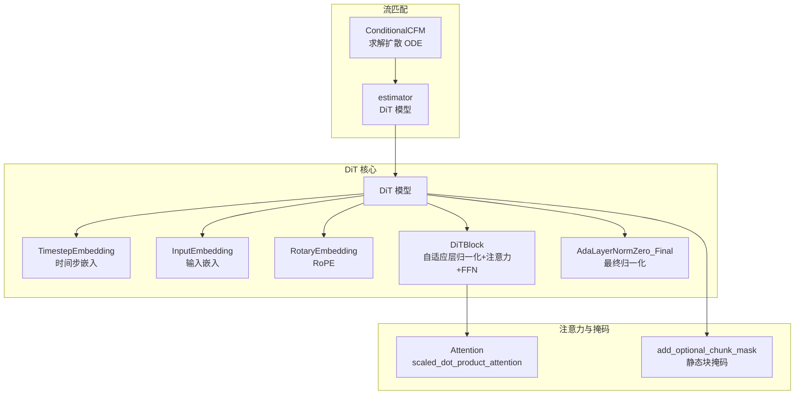
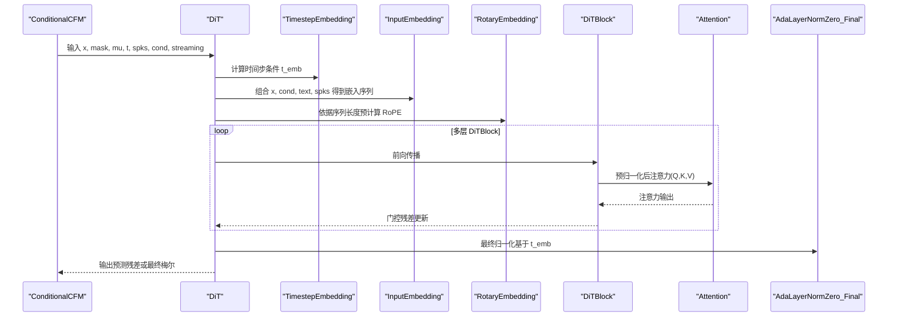
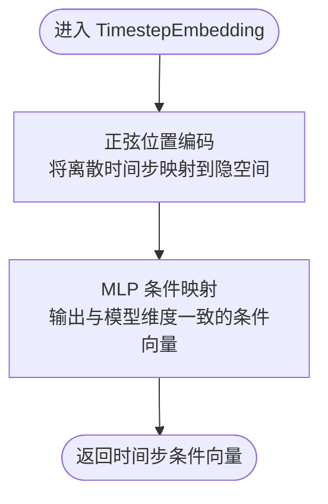
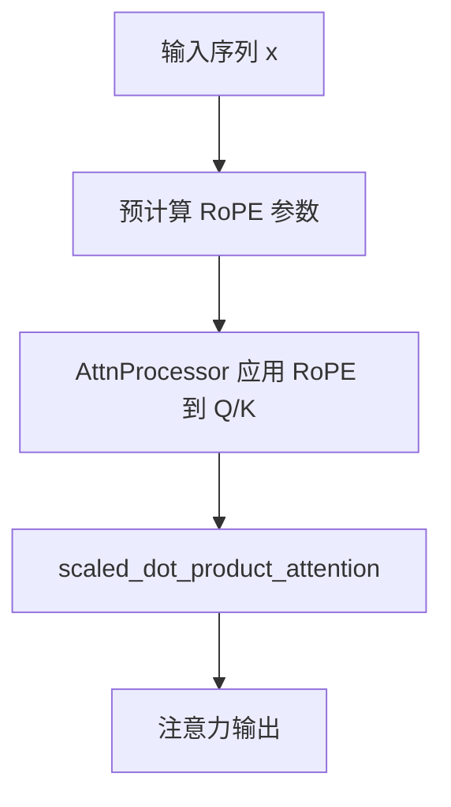
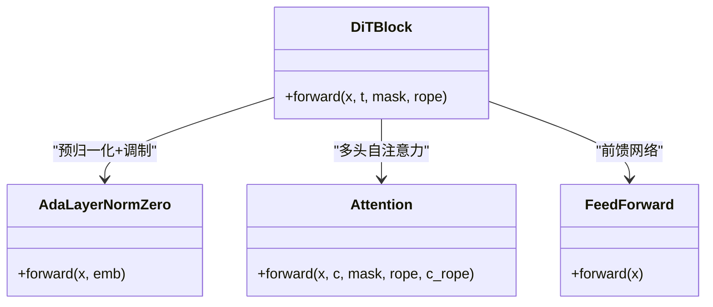
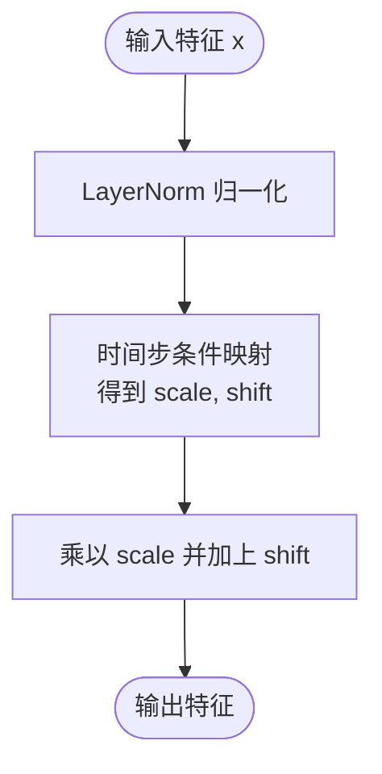
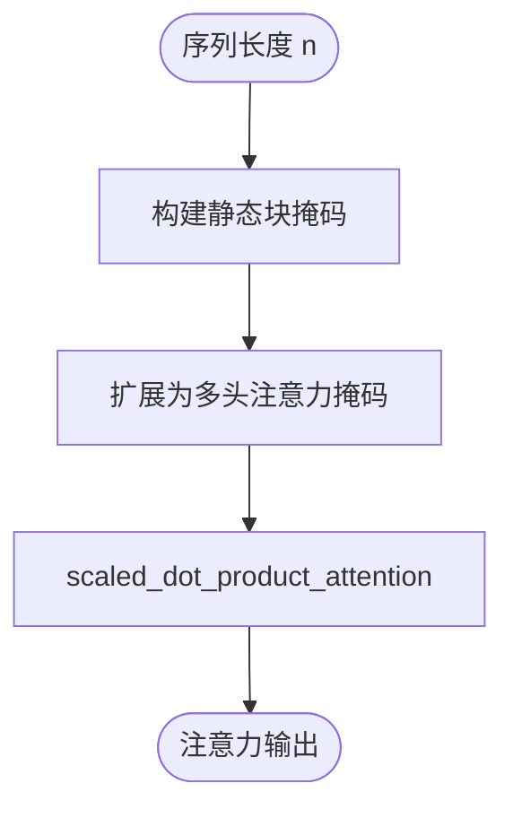
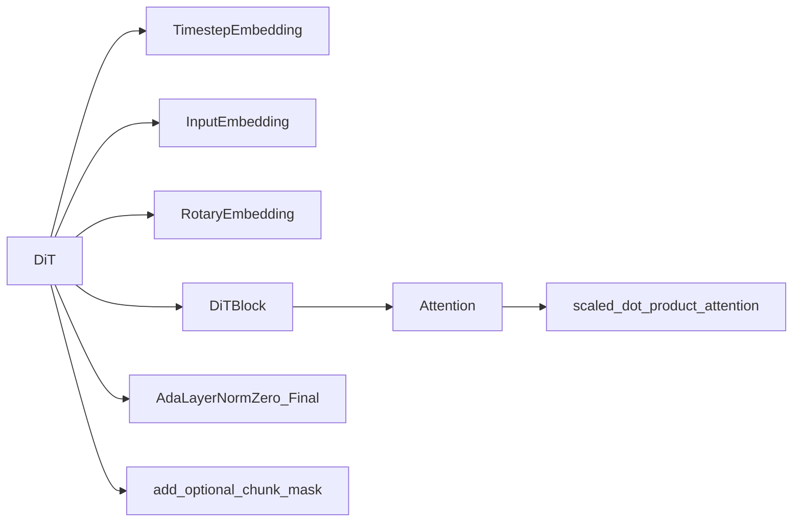

# 流匹配核心模块

<cite>
**本文引用的文件列表**
- [dit.py](file://cosyvoice/flow/DiT/dit.py)
- [modules.py](file://cosyvoice/flow/DiT/modules.py)
- [attention.py](file://cosyvoice/transformer/attention.py)
- [flow_matching.py](file://cosyvoice/flow/flow_matching.py)
- [mask.py](file://cosyvoice/utils/mask.py)
</cite>

## 目录
1. [引言](#引言)
2. [项目结构](#项目结构)
3. [核心组件](#核心组件)
4. [架构总览](#架构总览)
5. [详细组件分析](#详细组件分析)
6. [依赖关系分析](#依赖关系分析)
7. [性能考量](#性能考量)
8. [故障排查指南](#故障排查指南)
9. [结论](#结论)

## 引言
本文件面向流匹配（Conditional Flow Matching, CFM）语音合成系统中的核心模块，聚焦于以下关键组件：
- 时间步嵌入：将离散时间步映射为连续条件向量，并参与扩散过程的调制。
- 旋转式位置编码（RoPE）：在自注意力中引入相对位置信息，增强对序列顺序的敏感度。
- DiT 块：包含自适应层归一化、多头自注意力与前馈网络，支撑扩散过程中的特征变换。
- AdaLayerNormZero_Final：作为最终归一化层，依据时间步嵌入动态调整特征分布。

同时，结合注意力实现与掩码策略，说明流匹配模型如何处理长序列依赖，确保生成的梅尔频谱在时间维度上的连贯性。

## 项目结构
围绕流匹配与 DiT 的相关代码主要位于以下路径：
- 流匹配与估计器接口：flow/flow_matching.py
- DiT 架构与模块：flow/DiT/dit.py、flow/DiT/modules.py
- 注意力与位置编码：transformer/attention.py
- 掩码与流式推理：utils/mask.py

图表来源
- [flow_matching.py](file://cosyvoice/flow/flow_matching.py#L1-L120)
- [dit.py](file://cosyvoice/flow/DiT/dit.py#L104-L177)
- [modules.py](file://cosyvoice/flow/DiT/modules.py#L289-L616)
- [mask.py](file://cosyvoice/utils/mask.py#L161-L236)

章节来源
- [flow_matching.py](file://cosyvoice/flow/flow_matching.py#L1-L120)
- [dit.py](file://cosyvoice/flow/DiT/dit.py#L104-L177)
- [modules.py](file://cosyvoice/flow/DiT/modules.py#L289-L616)
- [mask.py](file://cosyvoice/utils/mask.py#L161-L236)

## 核心组件
- 时间步嵌入（TimestepEmbedding）
  - 将离散时间步通过正弦位置编码映射到高维隐空间，再经 MLP 得到与模型维度一致的条件向量，用于后续自适应调制。
- 旋转式位置编码（RoPE）
  - 使用 x-transformers 提供的 RotaryEmbedding，按头维度分组对 Q/K 应用旋转，保留相对位置信息，提升长序列建模能力。
- DiT 块（DiTBlock）
  - 预归一化 + 自适应层归一化（AdaLayerNormZero），随后多头自注意力与门控残差，再经前馈网络与门控残差，形成稳定的两阶段调制。
- AdaLayerNormZero_Final
  - 最终归一化层，仅输出经时间步条件调制后的特征，不引入额外 FFN 调制，避免冗余计算。

章节来源
- [modules.py](file://cosyvoice/flow/DiT/modules.py#L606-L616)
- [modules.py](file://cosyvoice/flow/DiT/modules.py#L226-L266)
- [modules.py](file://cosyvoice/flow/DiT/modules.py#L497-L531)
- [dit.py](file://cosyvoice/flow/DiT/dit.py#L124-L140)

## 架构总览
下图展示从扩散求解到 DiT 前向传播的关键流程，以及注意力与掩码的作用点。

图表来源
- [flow_matching.py](file://cosyvoice/flow/flow_matching.py#L126-L154)
- [dit.py](file://cosyvoice/flow/DiT/dit.py#L145-L177)
- [modules.py](file://cosyvoice/flow/DiT/modules.py#L289-L495)
- [modules.py](file://cosyvoice/flow/DiT/modules.py#L497-L531)
- [modules.py](file://cosyvoice/flow/DiT/modules.py#L533-L601)

## 详细组件分析

### 时间步嵌入（TimestepEmbedding）
- 设计要点
  - 正弦位置编码：将离散时间步映射为周期性向量，提供平滑的时间信号表示。
  - MLP 条件映射：通过两层线性层与激活，将频率维度映射到模型隐藏维度，得到可与特征张量广播相加的条件向量。
- 调制方式
  - 在 DiT 前向中，时间步嵌入作为 AdaLayerNormZero 的条件输入，产生缩放、偏移与门控参数，分别用于注意力与 FFN 的调制。
- 复杂度
  - 嵌入与 MLP 计算为线性于序列长度的常数开销；调制参数维度与通道数一致，整体开销与注意力成比例。

图表来源
- [modules.py](file://cosyvoice/flow/DiT/modules.py#L606-L616)

章节来源
- [modules.py](file://cosyvoice/flow/DiT/modules.py#L606-L616)
- [dit.py](file://cosyvoice/flow/DiT/dit.py#L145-L156)

### 旋转式位置编码（RoPE）
- 设计要点
  - 使用 x_transformers 的 RotaryEmbedding，按头维度分组对 Q/K 应用旋转，保留相对位置信息。
  - 在 DiT 中，按序列长度预计算并传入注意力处理器，确保 Q/K 的旋转一致。
- 注意力实现
  - Attention 的 AttnProcessor 对 Q/K 分别应用旋转，随后使用 PyTorch 的 scaled_dot_product_attention 进行高效注意力计算。
- 长序列与稳定性
  - RoPE 通过旋转保持相对位置不变性，有助于长序列建模；配合掩码与块式注意力，进一步控制信息流动范围。

图表来源
- [dit.py](file://cosyvoice/flow/DiT/dit.py#L158-L160)
- [modules.py](file://cosyvoice/flow/DiT/modules.py#L349-L408)

章节来源
- [dit.py](file://cosyvoice/flow/DiT/dit.py#L158-L160)
- [modules.py](file://cosyvoice/flow/DiT/modules.py#L349-L408)

### DiT 块（DiTBlock）
- 结构组成
  - 预归一化 + AdaLayerNormZero：输出注意力输入的归一化特征与门控参数。
  - 注意力：多头自注意力，支持掩码与 RoPE。
  - 前馈网络：两阶段门控残差，先对注意力输出进行门控，再对 FFN 输出进行门控。
- 扩散调制
  - AdaLayerNormZero 将时间步条件映射为缩放、偏移与门控参数，分别作用于注意力与 FFN，使模型在不同时间步具备不同的调制强度与方向。

图表来源
- [modules.py](file://cosyvoice/flow/DiT/modules.py#L497-L531)
- [modules.py](file://cosyvoice/flow/DiT/modules.py#L226-L266)
- [modules.py](file://cosyvoice/flow/DiT/modules.py#L289-L495)

章节来源
- [modules.py](file://cosyvoice/flow/DiT/modules.py#L497-L531)
- [modules.py](file://cosyvoice/flow/DiT/modules.py#L226-L266)

### AdaLayerNormZero_Final（最终归一化）
- 作用
  - 在 DiT 末尾对特征进行最终归一化与时间步条件调制，不引入 FFN 调制，减少计算并稳定输出。
- 实现
  - 将时间步条件映射为缩放与偏移参数，直接应用于归一化后的特征，实现逐通道的动态调整。

图表来源
- [modules.py](file://cosyvoice/flow/DiT/modules.py#L247-L266)
- [dit.py](file://cosyvoice/flow/DiT/dit.py#L174-L176)

章节来源
- [modules.py](file://cosyvoice/flow/DiT/modules.py#L247-L266)
- [dit.py](file://cosyvoice/flow/DiT/dit.py#L174-L176)

### 注意力与掩码（处理长序列依赖）
- 注意力实现
  - 使用 PyTorch 2.0 的 scaled_dot_product_attention，支持掩码与非因果注意力，满足流匹配的全局依赖需求。
- 掩码策略
  - add_optional_chunk_mask 支持静态块掩码，限制每个位置可见的历史范围，兼顾长序列建模与推理效率。
  - 在流匹配推理中，根据 streaming 标志选择不同掩码构造方式，保证在线推理时的因果性与稳定性。

图表来源
- [mask.py](file://cosyvoice/utils/mask.py#L161-L236)
- [modules.py](file://cosyvoice/flow/DiT/modules.py#L349-L408)
- [dit.py](file://cosyvoice/flow/DiT/dit.py#L163-L167)

章节来源
- [mask.py](file://cosyvoice/utils/mask.py#L161-L236)
- [modules.py](file://cosyvoice/flow/DiT/modules.py#L349-L408)
- [dit.py](file://cosyvoice/flow/DiT/dit.py#L163-L167)

## 依赖关系分析
- 模块耦合
  - DiT 依赖 TimestepEmbedding、InputEmbedding、RotaryEmbedding、DiTBlock 与 AdaLayerNormZero_Final。
  - DiTBlock 内部依赖 Attention 与 FeedForward，Attention 依赖 x_transformers 的 RoPE 工具。
  - 掩码工具 add_optional_chunk_mask 由 DiT 前向调用，影响注意力的可见范围。
- 外部依赖
  - x_transformers 提供 RoPE 与 apply_rotary_pos_emb。
  - PyTorch 2.0 的 scaled_dot_product_attention。

图表来源
- [dit.py](file://cosyvoice/flow/DiT/dit.py#L104-L177)
- [modules.py](file://cosyvoice/flow/DiT/modules.py#L289-L616)
- [mask.py](file://cosyvoice/utils/mask.py#L161-L236)

章节来源
- [dit.py](file://cosyvoice/flow/DiT/dit.py#L104-L177)
- [modules.py](file://cosyvoice/flow/DiT/modules.py#L289-L616)
- [mask.py](file://cosyvoice/utils/mask.py#L161-L236)

## 性能考量
- 注意力计算复杂度
  - scaled_dot_product_attention 在无掩码时近似 O(B*H*L^2*D/H)，其中 B 为批大小，H 为头数，L 为序列长度，D 为维度。
- 掩码与块式注意力
  - 静态块掩码可显著降低注意力的可见范围，减少无效计算，适合长序列推理。
- 线性映射与调制
  - 时间步条件通过线性层映射，开销与序列长度无关，但需注意 dtype 一致性以避免精度问题。
- 推理稳定性
  - 在流匹配推理中，掩码与块式策略应与采样步长、温度参数协同调整，避免过度遮蔽导致信息不足。

## 故障排查指南
- 注意力掩码全假
  - 若掩码在某些时间步全为 False，会触发强制置真逻辑，建议检查掩码构造参数与序列长度。
- dtype 不一致
  - 推理时若混合了不同 dtype，可能导致数值不稳定，建议统一为 spks.dtype。
- RoPE 长度不匹配
  - 预计算 RoPE 需与实际序列长度一致，否则会出现位置偏差；可通过 forward_from_seq_len 或预计算函数确保长度匹配。
- 门控残差异常
  - 若 AdaLayerNormZero 的门控参数过大，可能引起梯度爆炸或数值溢出，建议检查时间步条件的归一化与激活。

章节来源
- [mask.py](file://cosyvoice/utils/mask.py#L231-L236)
- [flow_matching.py](file://cosyvoice/flow/flow_matching.py#L94-L101)
- [modules.py](file://cosyvoice/flow/DiT/modules.py#L226-L266)

## 结论
本文系统梳理了流匹配模型中的核心模块：时间步嵌入通过正弦编码与 MLP 映射提供时间条件；RoPE 在注意力中引入相对位置信息；DiT 块以预归一化与 AdaLayerNormZero 的双阶段门控实现稳定的特征变换；AdaLayerNormZero_Final 在末尾进行最终调制。结合掩码与块式注意力策略，模型能够在长序列上保持良好的连贯性与推理效率。上述设计共同支撑了从扩散 ODE 到最终梅尔频谱的高质量生成。